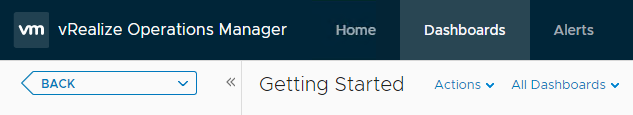
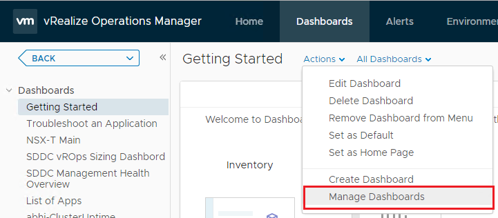
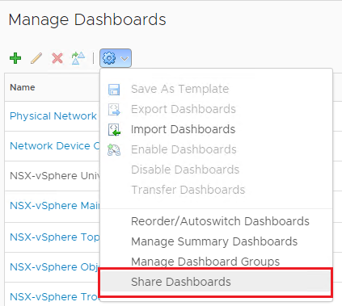
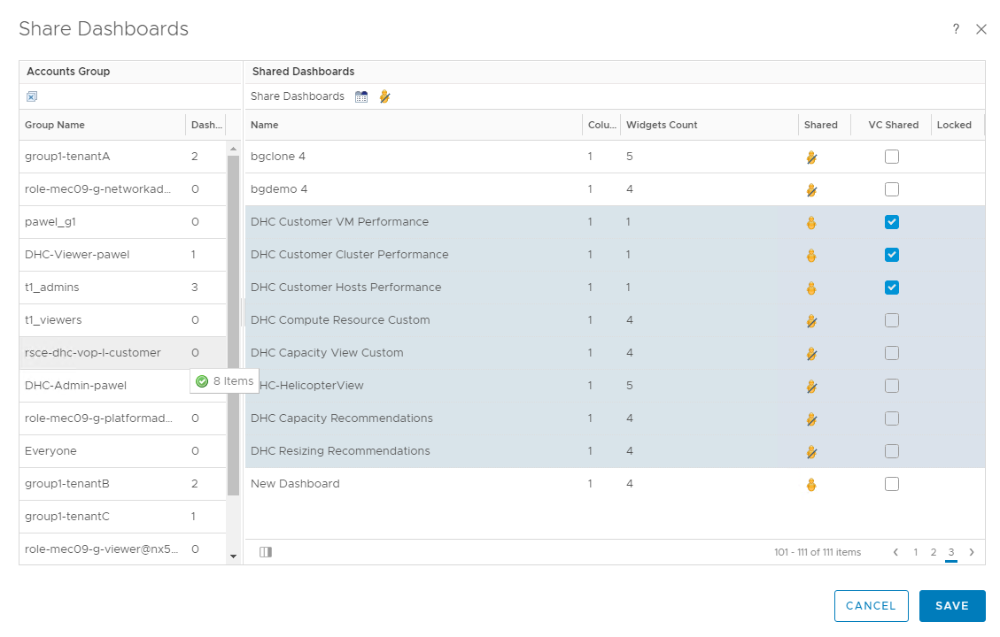
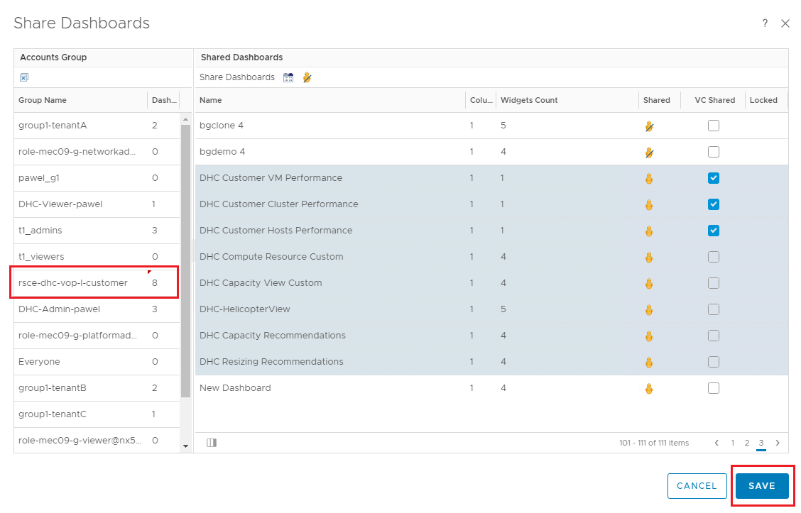

# Integrate vROPS with Customer Active Directory

# Changelog

| Version | Date       | Description           | Author          |
| ------- | ---------- | --------------------- | --------------- |
| 0.1     | 06/05/2020 | Initial draft version | Marcin Kujawski |
| 0.2     | 21/05/2020 | Updating Infrastructure and Network requirements. Adding Ansible role details| Marcin Kujawski  |

## Introduction

### Purpose

Configure components that are used to integrate Customer Active Directory (external) to VCS vRealize Operations Manager and allow Customer to use dashboards within Customer domain role-based access control.

### Audience

- VCS Operations

### Scope

That work instruction is intended to cover below tasks and activities:

1. Integrate Customer Active Directory into vROps.
2. Assign proper group (from Customer AD) to vROps role.
3. Import Customer dashboards to vROps.
4. Configure Customer access to a limited set of dashboards (for a group).

# Related Documents

| Document |
| -------- |
| [LLD Monitoring Logging](../design/lldMonitoringLogging.md) |

# Infrastructure Requirements

1. FQDN of Customer AD is resolvable in VCS domain (creating of Stub DNS zone can be required for that).
2. Predefined role **CustomerAccess-< customerCode >** available in vROps.
3. Ansible Core VM is required to run playbook.
4. vROps functional and available.

# Network Requirements

Connection flow need to be opened between vROps server and Customer Active Directory server. Details for firewall network request are provided in below table.

| Source | Destination | Protocol | Port |
| ------ | ----------- | -------- | ---- |
| VCS vROps IP | Customer AD IP  | TCP | 636 |
| VCS AD IP | Customer AD IP  | TCP | 636 |

# Other Requirements

Other requirements are related strictly to Customer environment and are necessary to properly run the integration.
The required items that need to be in place are:

- Domain Controller FQDN
- User from Customer domain used for integration (R/O rights)
- Active Directory group for vROps created in Customer domain

**IMPORTANT !**\
Default group name is: **rsce-dhc-vop-l-customer**.
Group name can be changed according to Customer needs to be aligned with Customer naming convention if required.

# Ansible Role

Role that execute Customer AD integration into vROps is named: **dhc-integrateVropsCustomerAd**.\
It automates adding Customer Domain Controller as Authentication Source in vROps and assign vROps role into Customer domain group.

Configuring Customer Access to a Limited Set of Dashboards is not yet automated and need to be done manually - [here](#configuring-customer-access-to-a-limited-set-of-dashboards) is the chapter to proceed.

To run Customer AD integration with vROps, execute role as follows:

`$ ansible-playbook dhc-integrateVropsCustomerAd.yml -t addAuthSource`

To delete/disjoin Customer AD from VCS vROps, execute role as follows:

`$ ansible-playbook dhc-integrateVropsCustomerAd.yml -t deleteAuthSource`

Please note, however that the import of Dashboards are automated via the ansible role: dhc-importVropsDashboards. This will automate the import of standard VCS Reports, Views and Dashboards.

`$ ansible-playbook dhc-importVropsDashboards.yml`

# Configuring Customer Access to a Limited Set of Dashboards

**Description:**
The following dashboards are required for customer access:

- VCS Customer VM Performance
- VCS Customer Cluster Performance
- VCS Customer Hosts Performance
- VCS Compute Resource Custom
- VCS Capacity View Custom
- DHC-HelicopterView
- VCS Capacity Recommendations
- VCS Resizing Recommendations

They are made available to the customer via the AD group:

- rsce-dhc-vop-l-customer

Note: the name of this group may have been amended per customer requirements.

The execute section details the steps needed to present them to a customer.

**Execute:**

Within the vROps Management Console, navigate to the Dashboards section:

Figure 1. vROps Management Console - Dashboards

From the **Actions** dropdown, select **Manage Dashboards**:

Figure 2. vROps Management Console - Manage Dashboards

From the **Manage Dashboards** page select **Share Dashboards** from the gear dropdown:

Figure 3. vROps Management Console - Share Dashboards

From the **Share Dashboards** page select the dashboards listed in the Description section and drag them across to the Accounts Group `rsce-dhc-vop-l-customer`:

Figure 4. vROps Management Console - Select Dashboards

The Accounts Group `rsce-dhc-vop-l-customer` now displays the number of allocated dashboards. Click **Save** to complete the configuration:

Figure 5. vROps Management Console - Save Dashboard Config
