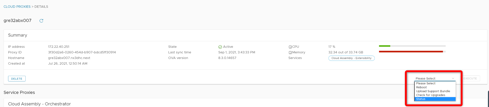
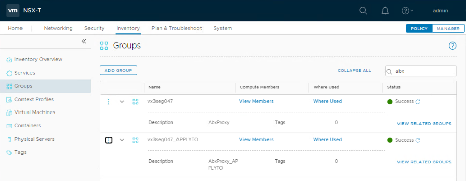
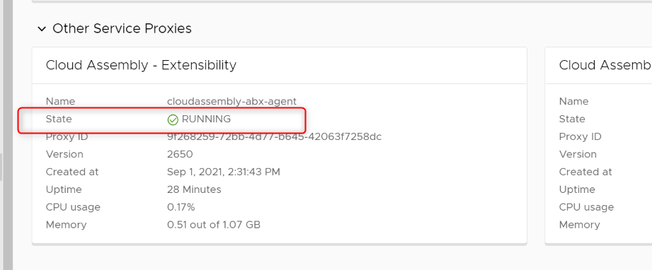
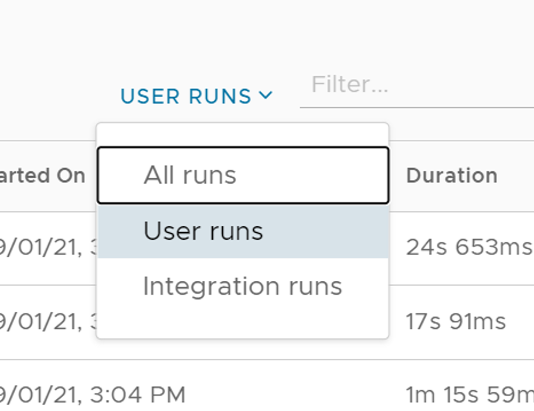
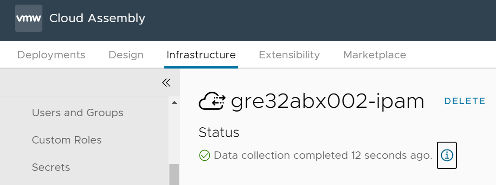
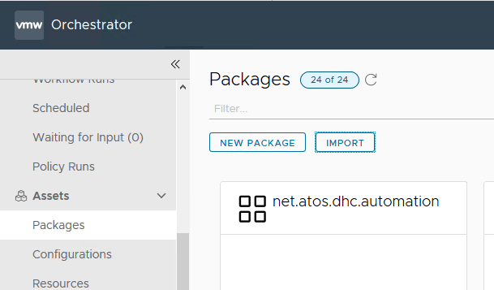

# Upgrade of the ABX proxy

# Table of Contents

- [Upgrade of the ABX proxy](#upgrade-of-the-abx-proxy)
- [Table of Contents](#table-of-contents)
- [List of Changes](#list-of-changes)
  - [Introduction](#introduction)
    - [Purpose](#purpose)
    - [Audience](#audience)
    - [Scope](#scope)
- [Related Documents](#related-documents)
- [Upgrade procedure](#upgrade-procedure)
  - [Prerequisites](#prerequisites)
  - [Upgrade of the ABX proxy](#upgrade-of-the-abx-proxy-1)
  - [Infoblox integration update](#infoblox-integration-update)
  - [VRO integration update](#vro-integration-update)
  - [Installation of EPOPs agent](#installation-of-epops-agent)
  - [Installation of Log Insight agent](#installation-of-log-insight-agent)
  - [Add/Delete new entry in Hashi Vault](#adddelete-new-entry-in-hashi-vault)
  - [Verification](#verification)
  - [Adding Tags](#adding-tags)
  - [Adding vCenter instance in Orchestrator](#adding-vcenter-instance-in-orchestrator)
  - [Add custom workflows](#add-custom-workflows)
  - [Remove of the old ABX](#remove-of-the-old-abx)

# List of Changes
  
| Version | Date       | Description      | Author       |
| ------- | ---------- | ---------------- | -------------|
| 0.1     | 08.09.2021 | First version    | Radoslaw Dabrowski |
| 0.2     | 27.09.2021 | Added steps for NSX-T Inventory update and vRO package import | Adam Szymczak |
| 0.2     | 11.07.2022 | Added steps for installation of EPOP's and Log Insight Agents | Michał Sobieraj |
| 0.3     | 15.07.2022 | Added details about agents installation and tags | Michał Sobieraj |
| 0.4     | 30.10.2022 | CESDHC-4376 Corrected command to skip certificate check for Log Insight agent configuration | Marcin Gala |

## Introduction

### Purpose

Upgrade ABX Proxy (Extensibility Proxy) to newest version available.

### Audience

- VCS Operations

### Scope

1. Upgrade of ABX Proxy
2. Update of the IPAM integration
3. Update of the VRO integration
4. Installation of EPOPs agent
5. Installation of Log Insight agent

# Related Documents

N/A

# Upgrade procedure

The upgrade sequence allows direct upgrade from version current version to newest one. **There is no mechanism to define which historic version will be picked**.

## Prerequisites

Follow below steps:

1. Before upgrading, test VM deployment using VRA cloud should be performed. This is needed to define if change have been done with success.

## Upgrade of the ABX proxy

1. Login to the Cloud Assembly.
2. Navigate to the **Infrastructure > Connections > Cloud Proxies**
3. Validate that current ABX proxy is in **State** Active and **last sync** time is less than 10 min
4. Select from dropdown list action **Status** to perform checks on active ABX.
     
5. Navigate to the  **Infrastructure > Integrations**  and then click on the Add Integration button
6. From the list pick on the **Extensibility Actions On Prem**
7. In the form click on the button **New Cloud Extensibility Proxy**
8. New windows shows, **download link** and the **key** important during deployment. Download package into the TSS of the environment (this might require to setup proxy on the TSS with exclusion list of local components and domain)
9. Go to the **DNS** of the environment, add there entry for new ABX (old one would be not used). Create **host A** entry to create entry for new ABX proxy and check PTR records so it will get updated. - Free IP address should be chosen (i.e. ```{{ local region network}}.16```).
10. Login to **NSX Policy Manager** in environment, navigate to **Inventory** then **Groups** and in search box type in **abx**.
    
11. Edit the first group (one without APPLYTO) and to the list of IP addresses add reserved IP for new ABX.
12. Edit the second group and add reserved name for ABX to the membership criteria.
13. Navigate to the environment's vCenter with administrative rights.
14. Deploy new VM from OVA in Management Domain.
15. Search for local file downloaded from VRA cloud, confirm with **Next** button.
16. Define name of the VM as ```{{ customer code }}abx{{ abx number }}```, other than existing ones. i.e. gre23abx002, confirm with **Next** button.
17. Select compute resource inside management cluster, confirm with **Next** button.
18. Review details and confirm with **Next** button.
19. Accept agreements and confirm with **Next** button.
20. Accept configuration and confirm with **Next** button.
21. For a storage, select VSAN storage, confirm with **Next** button.
22. For the network configuration, select **[Management/Local Region Network]**
23. Fill the form with data:
     - **Hostname**: ```{{ full FQDN name of the new ABX appliance }}```
     - **Initial root password**: ```{{ generated password  to be stored in Hashivault}}```
     - **Enable SSH service in the appliance**: check the checkbox
     - **Kubernetes internal cluster CIDR**: leave unchanged
     - **Kubernetes internal service CIDR**: leave unchanged
     - **NTP Servers**: ```{{ IP address of the ADC001, and ADC002 divided by comma sign }}```
     - **FIPS Mode**: leave unchanged
     - **Remote Data Collector Display Name**: ```{{ customer code }}abx{{ abx number }}``` same as defined in point 13
     - **VMware Cloud Services One Time Key (OTK)**: ```{{ key copied from VRA cloud - from point 8 }}```
     - **Network Proxy Hostname/IP Address**: ```{{ FQDN address of the PXY001 }}```
     - **Network Proxy port**: ```{{ Proxy port number }}```
     - **Network Proxy Username**: leave blank
     - **Network Proxy Password**: leave blank
     - **Default Gateway**: ```{{ Gateway of the [Management/Local Region Network] }}```
     - **Domain Name**: ```{{ Domain name on the environment }}```
     - **Domain Search Path**: ```{{ Domain name on the environment }}```
     - **Domain Name Servers**: ```{{ IP address of the ADC001, and ADC002 divided by comma sign }}```
     - **Network 1 IP address**: ```{{ IP address of the new ABX appliance - defined in point 9 }}```
     - **Network 1 Netmask**: ```{{ Netmask or prefix of the [Management/Local Region Network] }}```
24. Confirm form with **Next** button.
25. Verify input data and confirm with **Finish** button.
26. After deployment of the VM, start new ABX VM in vCenter.
27. Wait 15-20 minutes until ABX will be visible in VRA Cloud Assembly under **Infrastructure > Connections > Cloud Proxies**.
28. Once it would be visible, click on it and navigate to the Other Services Proxies.
29. Search for the **Cloud Assembly Extensibility** and validate that **state** is **RUNNING**.
     
30. Navigate to the  **Infrastructure > Integrations**  and then click on the Add Integration button
31. From the list pick on the Extensibility Actions On Prem
32. Fill the name of the integration to ```{{ customer code }}abx{{ abx number }}``` same as defined in point 13
33. From the dropdown list under **Cloud extensibility proxy** pick new ABX proxy
34. Click on **Validate** button, to validate connection between VRA and ABX.
35. For **Capability Tags** type
 ipam:```{{ {{ customer code }}abx{{ abx number }} same as defined in point 13 }}``` . I.e. "ipam:gre23abx002"
36. Confirm by clicking OK button.

## Infoblox integration update

1. Navigate to the  **Infrastructure > Integrations**  and then click on the old ABX integration with IPAM, normally named similarly to this example: gre23abx001-ipam.
2. From the dropdown list in point **Running environment** click on the newly created ABX. It may not appear until old name is in place.
3. Define **username** and **password** to the Infoblox.
4. Validate hostname and click on **Validate** button.
5. Correct name of the integration to match name of the new ABX.
6. Once validation is successfully finished and the name is corrected, click on **Save** button.
  a. This point might take a while. To define whats happening, details about current validation can be found in **Extensibility > Activity > Action Runs**, here there is a need to change filter from User runs to All runs.
    
7. Verify Data collection status by clicking on the IPAM integration.
  

## VRO integration update

1. Navigate to the  **Infrastructure > Integrations**  and then click on the old ABX integration with VRO, normally named similarly to this example: gre23abx001-vro.
2. Correct there **vRealize Orchestrator URL** to match newly created ABX.
3. From dropdown list under **Cloud extensibility proxy**, pick newly created ABX.
4. Click on the **Validate** button in order to validate newly configured setup.
5. Accept thumbprint in new window.
6. Once validation is done, click **Save** button.
7. Navigate to the **Infrastructure > Administration > Projects** then click on the project.
8. Navigate to the **Provisioning > Extensibility constrains** and change value there to tag "ipam:```{{ customer code }}abx{{ abx number }}```:soft
same as defined in point 13. I.e. "ipam:gre23abx002:soft".Remember to remove the old tag.
9. Rename of the VRO integration to match name of the new ABX.
10. Confirm changes by clicking **Save** button.
11. Copy **net.atos.dhc.automation.package** file from **/opt/binaries** directory on **ans001** machine to terminal server.
12. Using that terminal server go to **vRealize Orchestrator URL** changed earlier and click on **Start Orchestrator Client** (make sure pxy001 proxy is configured to be used as proxy server on terminal server before executing this step).
13. Login using your VMware account.
14. Enter the **Packages** menu found under **Assets** category and import **net.atos.dhc.automation.package** file using the **Import** button.
  

## Installation of EPOPs agent

1. Check the version of vROPS in OPS machine of the environment by logging in and clicking in the right top corner **user icon > about > Version**.
2. Go to VMware Customer Connect and download same version of **End-Point Operations - Linux Operations System Agent** as in vROPS and put file into the terminal server.

    >**NOTE** You can download either rpm or gz file.

3. Move installation file from terminal server into freshly deployed ABX proxy machine.
4. Log in into the ABX proxy by SSH and proceed with installation of the EPOP's agent you've choose. For example for gz file the command will look like:

    ```cmd
    cd /var/vmware | tar -xvzf <file-name>.tar.gz
    ```

5. After installation is finished start the EPOP's agent and register it with vROPS credentials. Exemplary command:

    ```cmd
    cd /var/vmware/epops-agent | ./ep-agent.sh start
    ```

6. When registration is finished, go into the vROPS and under **Administration > Solutions > Inventory** put into the filter **ABX** and check if you can find deployed ABX proxy with it's EP Ops Agent collecting status green.

## Installation of Log Insight agent

1. After ABX proxy deployment the Log Insight agent is already installed but needs configuration.
2. Log into the ABX proxy by SSH.
3. Check if ABX proxy Log Insight agent configured itself by:

    ```cmd
    vracli vrli
    ```
  
   If there is no configuration proceed further with agent installation.

4. Use below command to check if agent is running:

    ```cmd
    systemctl status liagentd
    ```

    if it is started, stop it be using:

    ```cmd
    systemctl stop liagentd
    ```

5. Use command to configure Log insight agent with VLI server:

    ```cmd
    vracli vrli set {{ customer code }}vli{{ vli server number }}
    ```

    If the agent shows certificate error you can use below command:

    ```cmd
    vracli vrli set {{ customer code }}vli{{ vli server number }} --force --insecure
    ```

6. Check with below command if configuration was saved:

    ```cmd
    vracli vrli
    ```

7. Log into log insight server machine into **Administration > Management > Agents** and check if ABX proxy is visible, active and collects data.

## Add/Delete new entry in Hashi Vault

1. To add new entry inside of vault log into the Hashi Vault with service account ans003 credentials.
2. Go into **Secrets > secret > {domain} > {location_code} > servers**.
3. Here click **create secret** in the right top corner and provide Path, key and value.

    >NOTE: The path should be in the format of {location_code}abx{VM_number}

4. This way addition of root user with password is possible.

    >NOTE: To delete any entry proceed as in 1 & 2 step then choose the machine for which you want to delete password entry. Click 3 dots at the end of the row with entry you want to delete, then chose **delete permanently**.

## Verification

1. Perform new deployment of the VM in VRA cloud (with same parameters as before upgrade).

## Adding Tags

After deploying successfully ABX it is needed to add required tags to the vm.

1. Log into the vRA and choose the tenant related with abx which you'd like to add tags.
2. Launch Vmware Cloud Assembly in Services section.
3. Go to Resources Tab on top of the page.
4. Choose "Virtual Machines" under "Deployments".
5. In the top right search bar put the name of the abx you've installed.
6. Click on the three dots on the right side of the abx name and choose "Update Tags"
7. Add tags using plus icon. The two tags that every abx should have is "tenant" tag set to tenant Code value and "backupPolicy" tag set to value "daily2100_3w".
8. After successfully adding tags click Submit to confirm the action.

## Adding vCenter instance in Orchestrator

1. Log in the ABX Machine in the environment.

    >NOTE: Remember that you have to enable proxy for such action.

2. Choose Orchestrator **Client -> Start the orchestrator client**
3. In the main menu under **Library** choose **Workflows**.
4. Find the **Add a vCenter Server Instance workflow** and Click **Run**
5. In the tab **Set the vCenter Server instance properties** fill the field **IP or host name** with the vCenter server name E.g **hrk01vcs001**.
6. Check to **ignore certificate**.
7. In the **Set the connection properties** fill the Domain name and vCenter administrator login tabs.
8. After completing all the steps above run the workflow and wait for it to finish.
9. When workflow completes check under **Administration -> Inventory** if in the **vSphere vCenter Plug-in** new vCenter server is added.

## Add custom workflows

1. Log in the ABX Machine in the environment.
2. Choose Orchestrator **Client -> Start the orchestrator client**
3. In the main menu under **Assets** choose **Packages**.
4. Click **import** at the top of the page.
5. Choose the package file to upload and add it to the vCenter Assets

## Remove of the old ABX

1. Click on the old ABX integration.
2. Click **Delete** button and confirm once again by clicking **Delete** button.
3. Navigate to the **Infrastructure > Cloud Proxies**.
4. Click on the old ABX proxy.
5. Click on the **Delete** button under summary and confirm by clicking on **Delete** button again.
6. Navigate to the vCenter Server and login with administrative credentials.
7. Shutdown old ABX VM.
8. Remove old ABX VM from inventory.
9. Edit **mgmtDns.abx001** variable in **/opt/dhc/deploy/group_vars/all** file on **ans001** to include name and IP of new ABX VM (repeat this step for **manage** and **update** folders).

    >**NOTE** In some cases (for example multi tenant setup) in might not be **ans001**

10. Delete old ABX IP and name from **NSX Manager** Inventory.
11. Delete old ABX IP reservation from DNS
