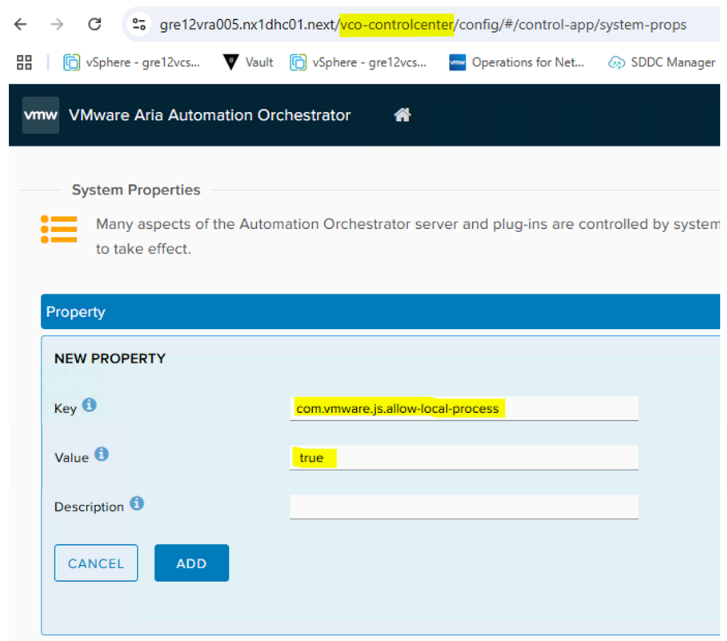

# Lifecycle Management - 1.8.4

## Table of Contents

- [Lifecycle Management - 1.8.4](#lifecycle-management---184)
  - [Table of Contents](#table-of-contents)
  - [List of Changes](#list-of-changes)
  - [Introduction](#introduction)
  - [Scope](#scope)
  - [Related Documents](#related-documents)
  - [DHC Version matrix](#dhc-version-matrix)
  - [Rollback](#rollback)
  - [Upgrade Steps](#upgrade-steps)
    - [Download DHC version matrix](#download-dhc-version-matrix)
    - [LCM code update](#lcm-code-update)
      - [New Code Update Process](#new-code-update-process)
      - [Define DHC version](#define-dhc-version)
    - [Download Binaries](#download-binaries)
    - [VCF components](#vcf-components)
      - [\[Step 1a\] **VMware Aria Suite Lifecycle 8.18.0**](#step-1a-vmware-aria-suite-lifecycle-8180)
      - [\[Step 1b\] **VMware Aria Suite Lifecycle 8.18.0 PSPACK 2**](#step-1b-vmware-aria-suite-lifecycle-8180-pspack-2)
      - [Supported versions as of LCM 8.18.0 PSPACK 2](#supported-versions-as-of-lcm-8180-pspack-2)
      - [\[Step 2a\] **VMware Aria Operations for Logs 8.16.1**](#step-2a-vmware-aria-operations-for-logs-8161)
      - [\[Step 2b\] **VMware Aria Operations for Logs 8.18.0**](#step-2b-vmware-aria-operations-for-logs-8180)
      - [\[Step 2c\]  **VMware Aria Operations for Logs Agents update**](#step-2c--vmware-aria-operations-for-logs-agents-update)
      - [\[Step 2d\] **Content Pack Marketplace upgrade procedure**](#step-2d-content-pack-marketplace-upgrade-procedure)
      - [\[Step 3\] **VMware Aria Operations 8.18.1**](#step-3-vmware-aria-operations-8181)
      - [\[Step 4\] **VMware Aria Operations for Networks 6.13.0**](#step-4-vmware-aria-operations-for-networks-6130)
      - [\[Step 5\] **VMware Aria Automation 8.18.0**](#step-5-vmware-aria-automation-8180)
    - [non-VCF components](#non-vcf-components)
      - [\[Step 6\] Upgrade Vault to version 1.17.5](#step-6-upgrade-vault-to-version-1175)
      - [\[Step 7\] Upgrade Infoblox to version 9.0.5](#step-7-upgrade-infoblox-to-version-905)
      - [\[Step 8\] Upgrade openSsl to version 1.1.1v](#step-8-upgrade-openssl-to-version-111v)
    - [Disable NSX-T VM Tagging for Aria Automation](#disable-nsx-t-vm-tagging-for-aria-automation)
    - [CloudLink to NKP migration](#cloudlink-to-nkp-migration)
    - [vSphere Replication upgrade](#vsphere-replication-upgrade)
    - [Site Recovery Manager upgrade](#site-recovery-manager-upgrade)
    - [Security updates](#security-updates)
      - [\[Step 9\] vCenter update via async tool](#step-9-vcenter-update-via-async-tool)
      - [\[Step 10\] OpenSSH update for Aria components and SRM via ansible playbook](#step-10-openssh-update-for-aria-components-and-srm-via-ansible-playbook)
  - [Redefine DHC version](#redefine-dhc-version)
  - [Post LCM Validation Steps](#post-lcm-validation-steps)
    - [Deploy Virtual Machine \[ETA 15min\]](#deploy-virtual-machine-eta-15min)
    - [Day2 action validation \[ETA 20min\]](#day2-action-validation-eta-20min)
    - [Disabling maintenance - starting vROps monitoring](#disabling-maintenance---starting-vrops-monitoring)
    - [Monitoring Validation \[ETA 45min\]](#monitoring-validation-eta-45min)
    - [External services validation](#external-services-validation)
    - [Remove LCM snapshots](#remove-lcm-snapshots)
  - [Known issues](#known-issues)
    - [Aria Lifecycle Manager](#aria-lifecycle-manager)
    - [Aria Automation - Command Method](#aria-automation---command-method)
  
## List of Changes

| Date       | Issue    | Author          | TOS  | Description |
| ---------- | -------- | --------------- | ---- | --------------------- |
| 22/07/2024 | VCS-13311 | Mariusz Stanek |      | Initial draft creation based on previous LCM versions |
| 27/08/2024 | VCS-13579 | Lukasz Tomaszewski |      | Added chapter *Security updates* |
| 26/09/2024 | VCS-13975 | Nicu Butaru |      | modified versions to latest ones |
| 30/10/2024 | VCS-14276 | Nicu Butaru |      | edit 1.9.1 to 1.8.4 |
| 30/12/2024 | VCS-14621 | Mariusz Stanek |      | Fix for Aria Operations integrations added |
| 13/03/2025 | VCS-15407 | Mariusz Stanek |      | Fix for Aria Operations SNOW config added |
| 24/03/2025 | VCS-15491 | Marcin Kujawski |     | Add missing chapter to disable NSX-T VM tagging on Aria Automation    |
| 15/05/2025 | VCS-16104 | Piotr Gesikowski |     | Added info about custom property in vRO control center |

## Introduction

This page describes Life Cycle Management of DHC components to version 1.8.4.

## Scope

The work instruction is intended to cover update from DHC 1.8.2 to DHC 1.8.4.

## Related Documents

| Document |
| -------- |

## DHC Version matrix

[json1.8.4]: https://github.com/GLB-CES-PrivateCloud/DHC-Version-Matrix/blob/DHC-1.8.4/versionMatrix.json

[upgradeLogic]: https://github.com/GLB-CES-PrivateCloud/DHC-Documentation/wiki/Coding-standards#upgrade-flow-diagrams

[versionMatrixConfluence]: https://github.com/GLB-CES-PrivateCloud/DHC-Documentation/wiki/LCM-Version-Matrix

Version table of DHC component can be found [here on Confluence wiki pages][versionMatrixConfluence].

See an example DHC 1.8.4 version fragment below:

```json
{
    "dhcVersion": "1_8_4",
    "services": {
        "sdm": [
            {
                "component": "sdm",
                "description": "SDDC Manager",
                "version": "4.5.2.0",
                "build": "22223457",
                "package": "",
                "strict": true,
                "update": true,
                "checksum": "",
                "type": "appliance"
            }
        ]
    }
}
```

For full LCM 1.8.4 components list refer to [versionMatrix.json][json1.8.4] file.

Current and target DHC release versions are set in *group_vars/all* files.

You may always override the versions by using extra vars while executing playbooks.

```bash
ansible-playbook upgradePlaybook.yml -e "componentCurrentVersion=dhcVersion1_8_2 componentNextVersion=dhcVersion1_8_4"
```

Detailed explanation of the update logic used in the code can be found in [code standard][upgradeLogic] document.

## Rollback

>Although over the Life Cycle Management process snapshots are taken of the specific components,  there is no FULL rollback procedure available to initial state from any point of an upgrade. It hasn't been tested by DHC Engineering team. There is no comeback possible.

Statements/recommendations:

- run every pre-check defined by DHC Engineering team
- read in advance the entire upgrade documentation to understand the complexity, dependencies and order of an upgrade
- VCF stack upgrade is fully supported by vendor (VMware)
- any VCF upgrade dependencies are described by vendor
- DHC Engineering team has performed a VCF stack upgrade based on vendor guidance. DHC shows the overall upgrade steps, adds DHC specific actions, however often links to vendor articles avoiding "rewriting" content.
- perform any snapshots/backup activities recommended by vendor in the provided knowledge base articles or DHC upgrade work instructions
- VCF components upgrades steps rely on pre-checks and retry activities, there is no revert option. Preferably solve all warnings and errors traced by pre-checks activities upfront as they will potentially brake the upgrade.
- Open vendor support call in case of failures.
- Potentially, in case of failure, there is no need to revert the previously successfully updated components but open a support call to vendor, solve the problem and continue the upgrade
- DHC Engineering found that after the upgrade of `Virtual infrastructure layer` in VCF upgrade path a rollback to initial state is not possible
- Automated updates have snapshots creation included in the code (it considers mainly non_VCF component update)
- Refer to individual non-VCF components upgrade paragraph to find `revert` playbooks.
- Most non-VCF components (DHC management component) can be upgraded independently from others. Contact DHC Engineering team in case of doubts.
- The automation logic relies on the upgrade schema defined for the upgrade process by the engineering team and is based on DHC version matrix parameters.
- Majority of upgrades should take place in order, defined by `Upgrade Steps` paragraph. Chosen non-VCF components can be upgraded at any time, under condition the DHC version matrix file, LCM code and binaries are recent.

## Upgrade Steps

The upgrade steps contain both manual and automated (if feasible) parts.

**Before an upgrade, ensure:**

- Maintenance plan is agreed and approved, it is in-line with LCM process.
- It is expected the upgrade is performed by a person(s) with expert knowledge in VMware and DHC solution. Engineers must have sufficient privileges.
- Image backups are created and available. LCM is irreversible at some point, see rollback section.
- Current and Target DHC versions are known and well defined. Refer to DHC version matrix paragraph for more details.
- Version dependencies of non-VCF component excluded from this WI (like backup, antivirus, mid servers) have been checked. It means external teams confirmed their services matrices are compatible to work with DHC after an upgrade. Potentially some upgrade activities might be planned upfront.
- The playbooks mentioned in this work instruction, unless otherwise specified, are executed from /opt/dhc, by an engineer logged in with their dedicated domain account.

The majority of upgrade tasks should take place in order, defined by below paragraphs. Chosen non-VCF components can be upgraded at any time, **under condition the DHC version matrix file, LCM code and binaries are recent**.

>Note: All the playbooks run in the update and manage phase will require credentials from DHC management domain


### Download DHC version matrix

DHC 1.7 version introduced new approach to version matrix file. There is no more need to download it separately as the upgrade is combined with [LCM code update](#new-code-update-process).

### LCM code update

Please check if new/updated playbook versions are available. See the `manageDhcRepository.yml` playbook for more information.

#### New Code Update Process

---
Note: During TOS manually change the branch to DHC-1.8.4 in `opt/dhc/version-matrix` and `opt/dhc/update`
example:

```bash
/opt/dhc/version-matrix: git checkout DHC-1.8.4
/opt/dhc/update: git checkout DHC-1.8.4
```

DHC 1.6 introduced a new way of updating the local git repository on the ansible server, that skips the git001 VM/local gitlab.

To upgrade the code execute the playbook on *ans001* server from */opt/dhc/manage/* directory:

```bash
ansible-playbook manageDhcRepository.yml
```

The `manageDhcRepository.yml` playbook is available from version `DHC-1.5-latest` and later.

Familiarize yourself with the playbook description and arrange pre-requisites:

- Internet connection (at least to github.com) is required.
- Account on *github.com* with at least a read-only access to the DHC repositories is required.
- A GitHub access token with at least read privileges is required.

The playbook will prompt the user to input a release tag to upgrade the code to. The tags can be found at <https://github.com/GLB-CES-PrivateCloud/DHC/tags>. For a given DHC version, i.e. DHC 1.8.0, the latest available tag for that version should be chosen.  
Example, the available tags are `DHC-1.8.0-20240101` and `DHC-1.8.0-20240301`. The last part is a release date in YYYYMMDD format, therefore the later one should be preferred.

>Note, **the first run will fail by design**, as the playbook backs up the existing code as a first step. **You will be prompted to execute this playbook from a backup location.**
>
>By following the prompts you should end up with code updated to the desired release.

New code upgrade process updates the version Matrix file which is stored in *`/opt/dhc/version-matrix/versionMatrix.json`*. This is default location for both *manage* and *update* playbooks.

>Note, the old version Matrix json files located in *manage/group_vars/* and *update/group_vars/* folders become depreciated, not used and might be removed manually.

#### Define DHC version

Execute : `ansible-playbook upgradeDhcVersionInGroupVarsAll.yml -e "currentDhcVersion=dhcVersion1_8_2 nextDhcVersion=dhcVersion1_8_4"` from update directory .

### Download Binaries

Execute the following playbook on *ans001* server from */opt/dhc/update* folder.

```bash
ansible-playbook downloadBinaries.yml
```

### VCF components

#### [Step 1a] **VMware Aria Suite Lifecycle 8.18.0**

Also known as: VMware vRealize Suite Lifecycle Manager

Estimated upgrade time: ~30m

Important note: If FIPS Mode Compliance is enabled in VMware Aria Suite Lifecycle, you must manually disable it. See: [Activate or deactivate FIPS Mode Compliance in VMware Aria Suite Lifecycle](https://docs.vmware.com/en/VMware-Aria-Suite-Lifecycle/8.16/lifecycle-install-upgrade-manage/GUID-4C29A6BF-2570-47A7-8A8B-591AC4C8A5CD.html).  

- Download upgrade package `VMware-Aria-Suite-Lifecycle-Appliance-8.18.0.0-24029603-updaterepo.iso` from Broadcom Support Portal [website](https://support.broadcom.com/group/ecx/productfiles?displayGroup=VMware%20Aria%20Suite%20-%20Enterprise&release=2019&os=&servicePk=202420&language=EN&groupId=204011) (choose 8.18 version from dropdown filter).
- Verify that you have taken a snapshot of VMware Aria Suite Lifecycle.
- Upload the `VMware-Aria-Suite-Lifecycle-Appliance-8.18.0.0-24029603-updaterepo.iso` iso file to VSAN datastore in Management Domain. In case there is an certificate error uploading .iso file using vCenter, try uploading connecting directly to any of management hosts using host`s GUI.
- Attach the iso file to the CD-ROM drive of LCM appliance.
- Log into the LCM appliance using `vcfadmin@local` account.
- Browse to `VMware Aria Suite Lifecycle` > `Lifecycle Operations` > `Settings` > `System Upgrade`.
- Select Repository Type `CDROM` and click `CHECK FOR UPGRADE` Button.
- Click `UPGRADE` and proceed with the upgrade process.
- Once VMware Aria Suite Lifecycle is upgraded, perform an [Operational Verification of vRealize Suite Lifecycle Manager](https://docs.vmware.com/en/VMware-Cloud-Foundation/4.5/vcf-operations/GUID-3FDF80B1-1462-4AEE-AAA7-8A07D3D7F170.html).

#### [Step 1b] **VMware Aria Suite Lifecycle 8.18.0 PSPACK 2**

Estimated upgrade time: ~1h

- Download upgrade package `vrlcm-8.18.0-PSPACK2.pspak` from Broadcom Support Portal [website](https://support.broadcom.com/web/ecx/solutiondetails?patchId=5527).
- Verify that you have taken a snapshot of VMware Aria Suite Lifecycle.
- Log in to VMware Aria Suite Lifecycle.
- On the Lifecycle Operations dashboard, navigate to `Settings` > `Product Support Pack`.
- Click `Upload` button and choose already downloaded `vrlcm-8.18.0-PSPACK2.pspak` file. Then click `Import`.
- Click `Apply version` button.
- Once the PSPAK 2 installation is triggered successfully, VMware Aria Suite Lifecycle services are restarted and you are redirected to VMware Aria Suite Lifecycle UI login page.
- To verify your new PSPAK 5, on the VMware Aria Suite Lifecycle dashboard, navigate to `Settings` > `Product Support Pack`. The option lists the `Version 8.18.0 PSPack 2`.
- If FIPS mode has been disabled prior to upgrade, re-enable FIPS Mode Compliance.

> NOTE: During documentation creation PSPACK 2 was the newest. If there will be some new version for example PSPACK 3 then please use the newest. PSPACKs can be found [here](https://support.broadcom.com/group/ecx/solutionfiles?displayGroup=VMware%20Aria%20Universal%20-%20Enterprise%20Plus&os=&release=Subscription&solution=VMware%20Aria%20Universal%20-%20Enterprise%20Plus&subfamily=VMware%20Aria%20Universal)

#### Supported versions as of LCM 8.18.0 PSPACK 2


#### [Step 2a] **VMware Aria Operations for Logs 8.16.1**

Also known as: VMware vRealize Log Insight

Estimated upgrade time: ~2h

- Download upgrade package `VMware-vRealize-Log-Insight-8.16.1-24029724.pak` from Broadcom Support Portal [website](https://support.broadcom.com/group/ecx/productfiles?subFamily=VMware%20Aria%20Operations%20for%20Logs&displayGroup=VMware%20Aria%20Operations%20for%20Logs&release=8.16.1&os=&servicePk=520770&language=EN).
- Ensure you have a recent successful backup of of the VMware Aria Operations for Logs virtual appliances (vli001a, vli001b, vli001c).
- Ensure Aria Operations for logs certificates are valid. In LCM navigate to `Locker>Certificates` and verify that Aria Operations for Logs certificate is Healthy (green tick).
- Perform an inventory sync in VMware Aria Suite Lifecycle for the VMware Aria Operations for Logs environment: go to `Lifecycle Operations` > `Environments` > `vRLI Environment` > `Details` > `...` > `Trigger Inventory Sync`.
- Upload downloaded file to VMware Aria Suite Lifecycle VM into directory `/data`. You can use WINSCP for such purpose.
- Go to the `VMware Aria Suite Lifecycle` > `Lifecycle Operations` > `Settings` > `Binary Mapping` and click `Add binaries` button.
- Choose `Location type` > `Local`, insert in `Base Location` phrase `/data` and click `Discover` button. You will see discovered binaries as on below picture.

- Select the  bundle and click `ADD` button. Wait for mapping request to finish, verify the bundle is visible.
- Go to `Environments` > `vRLI_environment` > `View Details`.
- Click `Upgrade` and follow the upgrade wizard.
- Check if all agents are upgraded to the newest version.
- Delete upgrade bundle file from VMware Aria Suite Lifecycle `/data` folder on `<locationCode>lcm001`.
- Repeat the inventory sync.

#### [Step 2b] **VMware Aria Operations for Logs 8.18.0**

- Download upgrade package `VMware-vRealize-Log-Insight-8.18.0-24021974.pak` from Broadcom Support Portal [website](https://support.broadcom.com/group/ecx/productfiles?subFamily=VMware%20Aria%20Operations%20for%20Logs&displayGroup=VMware%20Aria%20Operations%20for%20Logs&release=8.18.0&os=&servicePk=520484&language=EN).
- Ensure you have a recent successful backup of of the VMware Aria Operations for Logs virtual appliances (vli001a, vli001b, vli001c).
- Ensure Aria Operations for logs certificates are valid. In LCM navigate to `Locker>Certificates` and verify that Aria Operations for Logs certificate is Healty (green tick).
- Perform an inventory sync in VMware Aria Suite Lifecycle for the VMware Aria Operations for Logs environment: go to `Lifecycle Operations` > `Environments` > `vRLI Environment` > `Details` > `...` > `Trigger Inventory Sync`.
- Upload downloaded file to VMware Aria Suite Lifecycle VM into directory `/data`. You can use WINSCP for such purpose.
- Go to the `VMware Aria Suite Lifecycle` > `Lifecycle Operations` > `Settings` > `Binary Mapping` and click `Add binaries` button.
- Choose `Location type` > `Local`, insert in `Base Location` phrase `/data` and click `Discover` button. You will see discovered binaries as on below picture.
- Select the  bundle and click `ADD` button. Wait for mapping request to finish, verify the bundle is visible.
- Go to `Environments` > `vRLI_environment` > `View Details`.
- Click `Upgrade` and follow the upgrade wizard.
- Check if all agents are upgraded to the newest version.
- Delete upgrade bundle file from VMware Aria Suite Lifecycle `/data` folder on `<locationCode>lcm001`.
- Repeat the inventory sync.
- After the upgrade is successful at this time there is a patch released that needs to be installed.There are 2 files that needs to be downloaded:
[pak file](https://support.broadcom.com/web/ecx/solutiondetails?patchId=5502) and [HotFixPatch](https://support.broadcom.com/web/ecx/solutiondetails?patchId=5505)
- Follow [KB373991](https://knowledge.broadcom.com/external/article?articleNumber=373991) . First upgrade the vRLI cluster using the PAK file and then apply the HotFix from `VMware Aria Suite Lifecycle` .
- Go to the `VMware Aria Suite Lifecycle` > `Lifecycle Operations` > `Settings` > `Binary Mapping` > `Patch Binaries` and click `Add patch binary` to add the HotFix Downloaded in previous step `vrlcm-vrli-8.18.0-HF1.patch`
- Go to `Environments` > `vRLI_environment` > `View Details`. Click on th 3 dots and Select `Patches` > `Install Patch`

#### [Step 2c]  **VMware Aria Operations for Logs Agents update**

As Log Insight Agents are not updated automatically this work needs to be completed separately using `updateLogInsightAgent.yml` playbook from `Manage` repository. In order for playbook to work Version-Matrix must be on DHC-1.8.4 branch to read correct vRLI Agent versions and all vRLI Agents 8.18.0 packages must be available in `/data/binaries/` on ans001.

- Login to Aria for Logs, go to `Management` > `Agents`
- Run playbook for all hosts that have vRLI Agent version lower than 8.18.0. Playbook can be ran for particular hosts or cumulative for hostgroups, ie: `ansible-playbook updateLogInsightAgent.yml -e HOSTS=pxy001` or `ansible-playbook updateLogInsightAgent.yml -e HOSTS=linux`
- Once playbook run is finished navigate back to Aria for Logs and confirm that Agent version has changed for desired hosts.

#### [Step 2d] **Content Pack Marketplace upgrade procedure**

Estimated upgrade time: ~1h

With VMware Aria Operations for Logs upgraded to the latest version (8.18.0), we now upgrade the content packs for use with this product.

- The Content Pack Marketplace requires a connection from your web browser to the internet. Check your browser's connection settings (proxy settings).
- Choose from left administration menu and check which content packs require update.

  

- As a result, all Content Packs should be up to date.

  

- Once both VMware Aria Operations for Logs and content packs are upgraded, perform a daily tasks to check if upgrade is successful .

#### [Step 3] **VMware Aria Operations 8.18.1**

Also known as: VMware vRealize Operations

Estimated upgrade time: ~2h

- Download upgrade package `vRealize_Operations_Manager_With_CP-8.14.x-to-8.18.1.24267781.pak` from Broadcom Support Portal [website](https://support.broadcom.com/group/ecx/productfiles?subFamily=VMware%20Aria%20Operations&displayGroup=VMware%20Aria%20Operations&release=8.18.1&os=&servicePk=523019&language=EN).
- Ensure you have a recent successful backup of the VMware Aria Operations VMs `<locationCode>ops002` and `<locationCode>ops003`.
- Ensure Aria Operations certificates are valid. In LCM navigate to `Locker>Certificates` and verify that Aria Operations certificate is Healty (green tick).
- Perform the `inventory sync` of the vROPS_environment, exactly the same way as it was done for VMware Aria Operations for Logs.
- Prior to the upgrade, it is recommended to run the Pre-Upgrade Readiness Assessment Tool. Its goal is to analyze the potential impact following the reduction of metrics in various versions of the product, as well as to evaluate the feasibility for upgrade.
In case of an upgrade failure, VMware support may ask whether this validation was performed and ask for the report to be provided to aid in their troubleshooting. A correct version of the tool must be downloaded, i.e. matching the VMware Aria Operations version you plan to upgrade to (8.18.1). Download link [here](https://support.broadcom.com/group/ecx/productfiles?subFamily=VMware%20Aria%20Operations&displayGroup=VMware%20Aria%20Operations&release=8.18.1&os=&servicePk=523019&language=EN) and the release notes [here](https://docs.vmware.com/en/VMware-Aria-Operations/8.18.1/rn/vmware-aria-operations-8181-release-notes/index.html).
- Upload downloaded file to VMware Aria Suite Lifecycle VM into directory `/data`. You can use WINSCP for such purpose.
- Go to the `VMware Aria Suite Lifecycle` > `Lifecycle Operations` > `Settings` > `Binary Mapping` and click `Add binaries` button.
- Choose `Location type` > `Local`, insert in `Base Location` phrase `/data` and click `Discover` button. You will see discovered binaries as on below picture.

- Select the  bundle and click `ADD` button. Wait for mapping request to finish, verify the bundle is visible.
- Go to `Environments` > `vROPS_environment` > `View Details`.
- Click `Upgrade` and follow the upgrade wizard ( Note: Ignore recommendations to upgrade with two PAK files and continue the upgrade with using the PAK file downloaded already ).
- Once VMware Aria Operations is upgraded fix SNOW integration by running below playbook from `manage` respository:

```shell
ansible-playbook excludeAbsLayerFromMonitoring.yml --tags updateJsonVrops
```

- Perform a daily tasks to check if upgrade is sucesfull.
- Delete upgrade bundle file from VMware Aria Suite Lifecycle `/data` folder on `<locationCode>lcm001`.
- Repeat the inventory sync.
- If the VMware Aria Operations is upgraded with CloudProxy, then telegraf agents also need to be updated using the WI [wiUpdateTelegrafAgent](wiUpdateTelegrafAgent.md).

After vROPS upgrade, login into the VMware Aria Operations UI  `https://<locationCode>ops001.<domainName>/ui`, go to `Administration` > `Integrations` > `Accounts` and validate if the state of the configured integrations is shown as `OK`. Please fix any noticed Warnings/Errors.

IMPORTANT INFO: It seems that since Aria Operations 8.18 Broadcom changed part of integrations and home pages. Now some integrations are displayed in `Home` > `Overview`. Most likely after upgrade vCenter will be shown in `Home` > `Overview` as not configured even if integrations are present in `Administration` > `Integrations` as below:


It is important to fix this problem because when integrations are not visible in `Home` > `Overview` then CIS Compliance will be affected.

Reason of this issue is option `Cloud Type` not set in particular vCenter `Advanced Settings`:


To fix this issue it is enough to change `Cloud Type` to `vCenter` manually and `Save` configuration:


Or run a playbook which will do the same through API call:

 ```yaml
  ansible-playbook updateVropsIntegrations.yml
  ```

When one of above is done then vCenter integrations will appear in `Home` > `Overview`:


It takes some time until some details appear in `Inventory`:


At the end go to `Administration` > `Integrations` > `Accounts` and validate if the state of the configured integrations is shown as `OK`.

#### [Step 4] **VMware Aria Operations for Networks 6.13.0**

Also known as: VMware vRealize Network Insight

Estimated upgrade time: ~3h

- Download upgrade package `VMware-Aria-Operations-for-Networks.6.13.0.1717138317.upgrade.bundle` from Broadcom Support Portal [website](https://support.broadcom.com/group/ecx/productfiles?displayGroup=VMware%20NSX-T%20Data%20Center%20-%20VMware%20NSX%20Data%20Center%20Enterprise%20Plus&release=3.x&os=&servicePk=202465&language=EN&groupId=204303).
- Ensure you have a recent successful backup of the vRNI VMs `<locationCode>vni001` and `<locationCode>vnc001`.
- Ensure Aria Operations for Networks certificates are valid. In LCM navigate to `Locker>Certificates` and verify that Aria Operations for Networks certificate is Healthy (green tick).
- Perform inventory sync.
- Upload downloaded file to VMware Aria Suite Lifecycle VM into directory `/data`. You can use WINSCP for such purpose.
- Go to the `VMware Aria Suite Lifecycle` > `Lifecycle Operations` > `Settings` > `Binary Mapping` and click `Add binaries` button.
- Choose `Location type` > `Local`, insert in `Base Location` phrase `/data` and click `Discover` button.
- Select the  bundle and click `ADD` button. Wait for mapping request to finish, verify the bundle is visible and delete it from `/data` folder.
- Go to `Environments` > `vRNI` > `View Details`.
- Click `Upgrade` and follow the upgrade wizard and if preCheck will fail with free space alert please follow this KB: [https://kb.vmware.com/s/article/88977](https://kb.vmware.com/s/article/88977).
- Once VMware Aria Operations for Networks is upgraded, log in to vRNI web interface (vni001 appliance VM) and verify that it is up and running.
- Delete upgrade bundle file from VMware Aria Suite Lifecycle `/data` folder on `<locationCode>lcm001`.
- Repeat inventory sync.

> Note: there is a possibility that after the upgrade of VMware Aria Operations for Logs and/or VMware Aria Operations for Networks appliances, the VMware Aria Operations for Networks will be visible as `localhost` on the list of agents inside VMware Aria Operations for Logs. To fix that, execute the following playbook on *ans001* server from */opt/dhc/update* folder:

  ```yaml
  ansible-playbook configureVniLiAgent.yml
  ```

Validate the state by going to `Aria Operations for Logs` > `Management` > `Agents` and checking if `vni001` host is visible correctly and showing as active.

#### [Step 5] **VMware Aria Automation 8.18.0**

Also known as: VMware vRealize Automation

Estimated upgrade time: ~3h

Important note: Since version 8.16.2 assigned amount of RAM must be increased from 48 GB to 54 GB for each `vra appliance` VM. See `Note` section from [here](https://docs.vmware.com/en/VMware-Aria-Suite-Lifecycle/8.18/rn/vmware-aria-suite-lifecycle-818-release-notes/index.html).

>Note Before starting upgrade process check if this [KB326133](https://knowledge.broadcom.com/external/article?legacyId=95835) was applied . If not follow the instructions to remove weak algorithms and ciphers from VMware Aria Products

- Download upgrade package `Prelude_VA-8.18.0.35770-24024333-updaterepo.iso` from Broadcom Support Portal [website](https://support.broadcom.com/group/ecx/productfiles?subFamily=VMware%20Aria%20Automation&displayGroup=VMware%20Aria%20Automation&release=8.18.0&os=on%20OS%205&servicePk=521124&language=EN).
- Ensure you have a recent successful backup of the vRA VMs `<locationCode>vra002`, `<locationCode>vra003` and `<locationCode>vra004`.
- Ensure Aria Automation certificates are valid. In LCM navigate to `Locker>Certificates` and verify that Aria automation certificate is Healty (green tick).
- Perform inventory sync.
- Upload downloaded file to VMware Aria Suite Lifecycle VM into directory `/data`. You can use WINSCP for such purpose.
- Go to the `VMware Aria Suite Lifecycle` > `Lifecycle Operations` > `Settings` > `Binary Mapping` and click `Add binaries` button.
- Choose `Location type` > `Local`, insert in `Base Location` phrase `/data` and click `Discover` button.
- Select the  bundle and click `ADD` button. Wait for mapping request to finish, verify the bundle is visible.
- Go to `Environments` > `vRA` > `View Details`.
- Click `Upgrade` and follow the upgrade wizard.
- Once VMware Aria Automation is upgraded, perform a daily tasks to check if upgrade is successful.
- Once VMware Aria Automation is upgraded, perform a daily tasks to check if upgrade is successful .
- Delete upgrade bundle file from VMware Aria Suite Lifecycle `/data` folder on `<locationCode>lcm001`.
- Repeat the inventory sync.

>Note: After succesfull upgrade check if VRA status is disconnected in SDDC - Password management.  
>Fix: ecdsa-sha2-nistp256 keys for the nodes are missing from /etc/vmware/vcf/commonsvcs/known_hosts - Add missing keys as explained in this articles.[KB314627](https://knowledge.broadcom.com/external/article/314627/sddc-manager-knownhosts-files-contain-mu.html) , [disconnected_accounts](https://www.dmware.nl/2024/04/sddc-manager-has-disconnected-vrli-vrops-and-vrslcm-accounts/)  
>e.g:  
>ssh-keyscan -4 -t ecdsa-sha2-nistp256 gre72vra002.nx7dhc01.next >> /etc/vmware/vcf/commonsvcs/known_hosts  
>ssh-keyscan -4 -t ecdsa-sha2-nistp256 gre72vra003.nx7dhc01.next >> /etc/vmware/vcf/commonsvcs/known_hosts  
>ssh-keyscan -4 -t ecdsa-sha2-nistp256 gre72vra004.nx7dhc01.next >> /etc/vmware/vcf/commonsvcs/known_hosts  

Once vRA is upgraded to 8.18.0 , infoblox plugin must also pe upgraded to latest version: 1-5-2 . For instructions how to do it follow [wi](https://docs.vmware.com/en/vRealize-Automation/8.11/Using-and-Managing-Cloud-Assembly/GUID-5EA6CE96-122C-45C0-A753-353D4BB8735E.html), download from [here](https://marketplace.cloud.vmware.com/services/details/aria-automation-infoblox-plugin-1-5-2-3?slug=true) .  

>Note: In case of problem with executing Command method on the vRO server app via workflows got to the chapter 'Known issues'.

### non-VCF components

#### [Step 6] Upgrade Vault to version 1.17.5

To upgrade HashiCorp Vault execute the playbook on *ans001* server from */opt/dhc/update/* directory:

```yaml
ansible-playbook upgradeVault.yml
```

#### [Step 7] Upgrade Infoblox to version 9.0.5

To upgrade Infoblox execute the playbook on *ans001* server from */opt/dhc/update/* directory :
>Note Before running the playbook check Infoblox GUI for any alerts that might affect the upgrade process.For example if HTTPS certificate is expired it must be renewed before the upgrade.(On the Right Panel go to `Certificates`>`HTTPS Cert`>`Generate Self-signed Certificate` )

```yaml
ansible-playbook upgradeInfoblox.yml
```

#### [Step 8] Upgrade openSsl to version 1.1.1v

To upgrade openSsl execute the playbook on *ans001* server from */opt/dhc/update/* directory:

```yaml
ansible-playbook installOpenSsl.yml
```

### Disable NSX-T VM Tagging for Aria Automation

To replicate to NSX-T only microsegmentation tags, there is a requirement to disable NSX-T VM tagging that is by default enabled in Aria Automation. In disable that please execute the playbook on *ans001* server from */opt/dhc/manage* directory:

```yaml
ansible-playbook disableNsxtVmTaggingAria.yaml
```

### CloudLink to NKP migration

For instructions how to migrate the existing standard key provider to vSphere Native Key Provider (NKP) follow [NkpMigration](./CloudLinkToNkpMigration.md)

### vSphere Replication upgrade

Upgrade to vSphere Replication 9.0.2 is only posible from at least 8.7.  
To upgrade vSphere Replication appliance to 9.0.2 version execute the playbook on *ans001* server from */opt/dhc/update/* directory:

```yaml
ansible-playbook upgradeVsr.yml
```

Manual procedure - vSphere Replication [upgrade](https://techdocs.broadcom.com/us/en/vmware-cis/live-recovery/vsphere-replication/9-0/vr-help-plug-in-9-0/upgrading-vsphere-replication/upgrade-the-vsphere-replication-appliance.html#GUID-B04CAEF2-FDE0-44CC-81F1-4ABFF731C715-en)
[downloadIso](https://support.broadcom.com/group/ecx/productfiles?displayGroup=VMware%20vSphere%20-%20Essentials%20Plus&release=8.0&os=&servicePk=202630&language=EN&groupId=204423)
For VMWare vSphere Replication PlugIns download - Use Drivers & Tools tab  
--[upgrade](https://techdocs.broadcom.com/us/en/vmware-cis/live-recovery/vsphere-replication/9-0/vro-vr-plug-in-user-guide-9-0/installing-and-configuring/installing-upgraing-and-uninstalling-the-vsphere-replication-plug-in.html) vSphere Replication plug-in for VMware Aria Automation Orchestrator

### Site Recovery Manager upgrade

Upgrade to Live Site Recovery 9.0.2 is only posible from at least 8.7 Site Recovery Manager  
Before upgrading SRM export the [SRM Configuration](https://techdocs.broadcom.com/us/en/vmware-cis/live-recovery/live-site-recovery/9-0/overview/exporting-and-importing-site-recovery-manager-configuration-data/export-site-recovery-manager-configuration-data-by-using-the-user-interface.html)  
In the vSphere Client, click Site Recovery.Open Site Recovery.  
On the Live Site Recovery home tab, select a site pair, and click View Details.  
On the Summary pane, click Export/Import SRM ConfigurationExport, and click Download

>Note: IMPORTANT  
Verify that there are no pending cleanup operations on recovery plans and that there are no configuration issues for the virtual machines that VMware Live Site Recovery protects.  
All recovery plans are in the Ready state.  
The protection status of all the protection groups is OK.  
The protection status of all the individual virtual machines in the protection groups is OK.  
The recovery status of all the protection groups is Ready.  

To upgrade Site Recovery Manger to  to 9.0.2 Live Site Recovery execute the playbook on *ans001* server from */opt/dhc/update/* directory:

```yaml
ansible-playbook upgradeSrm.yml
```

Manual procedure - Live Site Recovery [upgrade](https://techdocs.broadcom.com/us/en/vmware-cis/live-recovery/live-site-recovery/9-0/overview/upgrading-srm/configure-the-update-settings.html)
[downloadIso](https://support.broadcom.com/group/ecx/productfiles?subFamily=VMware%20Live%20Recovery&displayGroup=VMware%20Live%20Site%20Recovery&release=9.0.2.1&os=&servicePk=526079&language=EN)
For VMware Liver Site Recovery Plugins download - Use Drivers & Tools tab  
--[upgrade](https://techdocs.broadcom.com/us/en/vmware-cis/live-recovery/live-site-recovery/9-0/using-the-vmware-aria-automation-orchestrator-plug-in-for-vmware-live-site-recovery-9-0/using-the-srm-plug-in/installing-and-configuring-the-srm-plug-in/installing-upgrading-and-unstalling-the-srm-plug-in.html) VMware Live Site Recovery plug-in for VMware Aria Automation Orchestrator

### Security updates

After DHC 1.8.4 LCM a security assessment has been executed. Several Critical/High severity vulnerabilities have been found. Here's the list for affected VMware components:

| CVE | CVSS | Risk | Name | Synopsis | Solution |
| ---------- | -------- | --------------- | ---- | --------------------- | ------- |
| CVE-2024-6387,CVE-2024-39894 | 7.6 | High | OpenSSH < 9.8 RCE | The SSH server running on the remote host is affected by a vulnerability. | [CVE20246387](https://knowledge.broadcom.com/external/article/372561/cve20246387-vulnerability-for-the-openss.html) |
| CVE-2023-34048 | 10.0 | Critical | VMware vCenter Server 6.5 < 6.5U3v / 6.7 < 6.7U3t / 7.0 < 7.0U3o / 8.0 < 8.0U1d Out-of-bounds Write (VMSA-2023-0023) | The VMware vCenter Server is affected by an out-of-bounds write vulnerability. | [dhcAsyncPathTool](./dhcAsyncPatchTool.md#patch-tool-steps) |
| CVE-2024-37079-CVE-2024-37081 | 10.0 | Critical | VMware vCenter Server 7.0 < 7.0U3r / 8.0 < 8.0U2d Multiple Vulnerabilities (VMSA-2024-0012) | The VMware vCenter Server is affected by multiple vulnerabilities. | [dhcAsyncPathTool](./dhcAsyncPatchTool.md#patch-tool-steps) |
| CVE-2023-34051 | 10.0 | Critical | VMware Aria Operations for Logs 8.6.x / 8.8.x / 8.10 / 8.10.2 / 8.12 Authentication Bypass (VMSA-2023-0021) | VMware Aria Operations running on the remote host is affected by an authentication bypass vulnerability. | false/positive - we have 8.18 Note: HTTP basic authentication credentials are required to obtain version information from the API, otherwise partial version information is used. |
| CVE-2023-34052 | 6.9 | High | VMware Aria Operations for Logs 8.10.2 / 8.12 Deserialization (VMSA-2023-0021) | VMware Aria Operations running on the remote host is affected by a deserialization vulnerability. | false/positive - we have 8.18 Note: HTTP basic authentication credentials are required to obtain version information from the API, otherwise partial version information is used. |
| CVE-2024-5535 | 10.0 | Critical | OpenSSL 1.0.2 < 1.0.2zk Vulnerability | The remote service is affected by a vulnerability. | fixed from 8.18 HF2 Aria Operations |

#### [Step 9] vCenter update via async tool

Below mitigates folowing vulnerabilities: CVE-2023-34048, CVE-2024-37079, CVE-2024-37080, CVE-2024-37081

Please follow that work instruction, skipping paragraphs 8-10: [dhcAsyncPatchTool](./dhcAsyncPatchTool.md)

Async tool used for downloading upgrade packages: Release 1.1.0.2

At the time of executing vCenter upgrade the newest and not vulnerable version of vCenter Server was: VCENTER:7.0 Update 3s-24201990

#### [Step 10] OpenSSH update for Aria components and SRM via ansible playbook

Below mitigates folowing vulnerabilities: CVE-2024-6387

Execute the playbook on *ans001* server from */opt/dhc/update/* directory:

```yaml
ansible-playbook upgradeAriaOpenSsh.yml
```

## Redefine DHC version

DHC uses *componentCurrentVersion* parameter to indicate current version of the environment for reporting and operational activities, hence it needs to be updated after every LCM.

Execute the following playbook to reflect current and target version variables in *update/group_vars/all* and *manage/group_vars/all* files.

```json
ansible-playbook upgradeDhcVersionInGroupVarsAll.yml -e "currentDhcVersion=dhcVersion1_8_4 nextDhcVersion=dhcVersion2_0"
```

>
>Note: DHC versions are case sensitive. Refer to [version Matrix](#dhc-version-matrix) chapter for names validation in the json file. The naming convention is like `dhcVersion1_X`  
> To validate:
>
> 1. SSH to ans001
> 2. View */opt/dhc/manage/group_vars/all* and */opt/dhc/update/group_vars/all* files
> 3. Check top of the file for the following entries
>
>      ```yaml
>      # group_vars/all file
>      componentCurrentVersion: dhcVersion1_8_4
>      componentNextVersion: dhcVersion2_0
>      ```

## Post LCM Validation Steps

>After the upgrade it is required to perform a bundle of validation activities that will ensure DHC is stable and fully operational in new software versions. Steps expected to contain both, automation and manual parts.

### Deploy Virtual Machine [ETA 15min]

Execute the following playbook on *ans001* server from */opt/dhc/update* folder to proceed with validation of `Deploy Virtual Machine` catalog item.

```shell
ansible-playbook validateVraCloudCatalogItem.yml
```

Playbook triggers deployment of five OS flavours with random inputs. You may observe deployment status on VMware Cloud Services portal during execution. At the end playbook returns report with result status. Test deployments are removed.

### Day2 action validation [ETA 20min]

Execute the following playbook on *ans001* server from */opt/dhc/update* folder to validate and test core day2 actions using default catalog item `Deploy Virtual Machine`.

```shell
ansible-playbook validateVraCloudDay2Action.yml
```

Playbook creates test deployment based on `Deploy Virtual Machine` catalog item using random mandatory inputs.
Based on created test deployment playbook triggers tasks to validate and test core day2 actions (core day2 actions are defined in role defaults main.yml file).

Currently playbook validates and test below core day2 actions:

- Add disk
- Resize machine
- Snapshot create
- Power Off
- Power One

You may observe deployment status and day2 action executions under VMware Cloud Service portal and ansible console.
>Example output from vRA Cloud Service Broker Portal showing current status of day2 actions execution.


>Example output from ansible console showing result of day2action test execution (failed).


>Example output from ansible console showing result of day2action test execution (successfully).


At the end playbook returns overall summary report.
>Example output from ansible console showing summary report


Additionally playbook generates overall summary report in json format (stored in role file folder).
>Example output from ansible console showing overall summary report in json format.


At the end playbook perform cleanup of created test deployment.
>Example output from vRA Cloud Service Broker Portal showing cleanup of test deployment.


### Disabling maintenance - starting vROps monitoring

After running the upgrade tasks and validating that all is well, do not forget to reenable monitoring by running the following command in /opt/dhc/update:

```shell
ansible-playbook configureVropsMaintenance.yml -e "maintenanceAction=START"
```

>Starts monitoring of all vROps resources.

### Monitoring Validation [ETA 45min]

Execute the following playbook on *ans001* server from */opt/dhc/update* folder to proceed with validation of monitoring.
Playbook validates and checks if monitoring for management and compute resources is working properly.

```shell
ansible-playbook validateMonitoring.yml
```

Monitoring validation covers following fully automated tasks:

- Copy stress script into predefined mgmt server (tss002)
- Generate high CPU demand on machine
- Check if alarm is created on vCenter
- Check if vROps adapter status for MGT vCenter is ok
- Check if alert is created on vROps
- Check if Http Gateway heartbeat is working
- Check if vROps adapter status for Workload Domain vCenter is ok

After playbook is finished a manual check is required only to validate if event/incident has been raised in SNOW.

User is informed about these steps at the end of playbook execution.

To do this please follow below steps:

- Login to SNOW instance via web browser (i.e. <https://atosglobal.service-now.com/>)


- Go to 'Service Event Management' --> 'All'


- Filter event by Event Sender or Affected CI or other specific value you know


- Validate if event has been created successfully


### External services validation

Request E2E testing of the external services, like:

- Backup
- Antivirus
- other customer specific

### Remove LCM snapshots

Execute the following playbook on *ans001* server from */opt/dhc/update* folder to proceed with removal of all automatic snapshots performed on non-VCF components.

Playbook requires EXTRA_VARS otherwise it will stop.


Command syntax:

- use *-e whatif=true* to enable REPORTING ONLY mode

```shell
ansible-playbook removeLcmSnapshots.yml -e whatif=true
```

- use *-e whatif=false* to enable SNAPSHOTS REMOVAL mode

```shell
ansible-playbook removeLcmSnapshots.yml -e whatif=false
```

>IMPORTANT: The playbook runs against all windows and linux hosts from ansible inventory (except Root Certificate Authority server which powered OFF by default).  Exact snapshot name *`prior LCM to version <componentNextVersion>`* are filtered and removed. Any other snapshots stays untouched.
It's important to search carefully for all remaining snapshots that have had been created manually as part of any pre manual activities and remove them.

When using REPORTING mode, you may expect the below output at the end of playbook. Servers not having the exact snapshot name *`prior LCM to version <componentNextVersion>`* are skipped.


## Known issues

### Aria Lifecycle Manager

If upgrade process does not start after hitting "UPGRADE" button and GUI instantly shows that "Aria Lifecycle Manager successfully upgraded" but the version does not change please review following [article](https://www.arunnukula.com/post/vmware-aria-suite-lifecycle-upgrade-might-fail-to-start-due-to-operation-not-allowed-in-the-curren).

### Aria Automation - Command Method

Error in Aria Automation Orchestrator: "This method is disabled for security reasons. 'Command' is deprecated and will be removed in future release". This issue is resolved in Aria Automation 8.18.0.35806 (PATCH2), when custom property is added on vRO:

Login as a root to vRO Control Center, go to System Properties and add the following custom property 'com.vmware.js.allow-local-process' to true:


