# Table of Contents

- [Table of Contents](#table-of-contents)
- [Title: Lifecycle Management - 1.8](#title-lifecycle-management---18)
- [List of Changes](#list-of-changes)
- [Introduction](#introduction)
- [Scope](#scope)
- [Related Documents](#related-documents)
- [VCS Version matrix](#vcs-version-matrix)
- [Rollback](#rollback)
- [Upgrade Steps](#upgrade-steps)
  - [Download VCS version matrix](#download-vcs-version-matrix)
  - [LCM code update](#lcm-code-update)
    - [New Code Update Process](#new-code-update-process)
  - [VCF components \[ETA 3 days\]](#vcf-components-eta-3-days)
  - [non-VCF components](#non-vcf-components)
    - [Site Recovery Manager and vSphere Replication appliances upgrade](#site-recovery-manager-and-vsphere-replication-appliances-upgrade)
    - [Windows mgmt servers upgrade](#windows-mgmt-servers-upgrade)
    - [Ubuntu mgmt servers upgrade](#ubuntu-mgmt-servers-upgrade)
  - [Redefine VCS version](#redefine-vcs-version)
- [Post LCM Validation Steps](#post-lcm-validation-steps)
  - [Deploy Virtual Machine \[ETA 15min\]](#deploy-virtual-machine-eta-15min)
  - [Day2 action validation \[ETA 20min\]](#day2-action-validation-eta-20min)
  - [Disabling maintenance - starting vROps monitoring](#disabling-maintenance---starting-vrops-monitoring)
  - [Monitoring Validation \[ETA 45min\]](#monitoring-validation-eta-45min)
  - [External services validation](#external-services-validation)
  - [Remove LCM snapshots](#remove-lcm-snapshots)

# Title: Lifecycle Management - 1.8

# List of Changes

| Date       | Issue    | Author          | TOS  | Description |
| ---------- | -------- | --------------- | ---- | --------------------- |
| 12/10/2023 | VCS-6605 | Mariusz Stanek / Nicu Butaru |      | Initial draft creation based on previous LCM versions |
| 20/10/2023 | VCS-10544 | Robert Kaminski | | Added vSR and SRM upgrade to v8.7 in non-VCF component section |

# Introduction

This page describes Life Cycle Management of VCS components. Some VCS components can be upgraded independently, others have to follow the exact order.

# Scope

The work instruction is intended to cover below tasks:

1. LCM code update.
2. Upgrade of VCF components
3. Upgrade of non-VCF components
4. Post LCM validation

# Related Documents

| Document |
| -------- |
| [VCS 1.8 - VCF upgrade to 4.5.1](dhcVcfUpgradeTo-4.5.1.md) |

# VCS Version matrix

[json1.8]: https://github.com/GLB-CES-PrivateCloud/DHC-Version-Matrix/blob/DHC-1.8/versionMatrix.json

[upgradeLogic]: https://github.com/GLB-CES-PrivateCloud/DHC-Documentation/wiki/Coding-standards#upgrade-flow-diagrams

[versionMatrixConfluence]: https://github.com/GLB-CES-PrivateCloud/DHC-Documentation/wiki/LCM-Version-Matrix

Version table of VCS component can be found [here on Confluence wiki pages][versionMatrixConfluence].

From VCS 1.7 version matrix file structure has changed, contains new variables and includes components from the exact VCS version only (previous version are erased). See an example VCS 1.8 version fragment below:

```json
{
    "dhcVersion": "1_8",
    "services": {
        "sdm": [
            {
                "component": "sdm",
                "description": "SDDC Manager",
                "version": "4.5.1.0",
                "build": "21682411",
                "package": "",
                "strict": true,
                "update": true,
                "checksum": "",
                "type": "appliance"
            }
        ]
    }
}
```

For full LCM 1.8 components list refer to [versionMatrix.json][json1.8] file.

Current and target VCS release versions are set in *group_vars/all* files.

You may always override the versions by using extra vars while executing playbooks.

```bash
ansible-playbook upgradePlaybook.yml -e "componentCurrentVersion=dhcVersion1_6 componentNextVersion=dhcVersion1_7"
```

Detailed explanation of the update logic used in the code can be found in [code standard][upgradeLogic] document.

# Rollback

>Although over the Life Cycle Management process snapshots are taken of the specific components,  there is no FULL rollback procedure available to initial state from any point of an upgrade. It hasn't been tested by VCS Engineering team. There is no comeback possible.

Statements/recommendations:

- run every pre-check defined by VCS Engineering team
- read in advance the entire upgrade documentation to understand the complexity, dependencies and order of an upgrade
- VCF stack upgrade is fully supported by vendor (VMware)
- any VCF upgrade dependencies are described by vendor
- VCS Engineering team has performed a VCF stack upgrade based on vendor guidance. VCS shows the overall upgrade steps, adds VCS specific actions, however often links to vendor articles avoiding "rewriting" content.
- perform any snapshots/backup activities recommended by vendor in the provided knowledge base articles or VCS upgrade work instructions
- VCF components upgrades steps rely on pre-checks and retry activities, there is no revert option. Preferably solve all warnings and errors traced by pre-checks activities upfront as they will potentially brake the upgrade.
- Open vendor support call in case of failures.
- Potentially, in case of failure, there is no need to revert the previously successfully updated components but open a support call to vendor, solve the problem and continue the upgrade
- VCS Engineering found that after the upgrade of `Virtual infrastructure layer` in VCF upgrade path a rollback to initial state is not possible
- Automated updates have snapshots creation included in the code (it considers mainly non_VCF component update)
- Refer to individual non-VCF components upgrade paragraph to find `revert` playbooks.
- Most non-VCF components (VCS management component) can be upgraded independently from others. Contact VCS Engineering team in case of doubts.
- The automation logic relies on the upgrade schema defined for the upgrade process by the engineering team and is based on VCS version matrix parameters.
- Majority of upgrades should take place in order, defined by `Upgrade Steps` paragraph. Chosen non-VCF components can be upgraded at any time, under condition the VCS version matrix file, LCM code and binaries are recent.

# Upgrade Steps

The upgrade steps contain both manual and automated (if feasible) parts.

**Before an upgrade, ensure:**

- Maintenance plan is agreed and approved, it is in-line with LCM process.
- It is expected the upgrade is performed by a person(s) with expert knowledge in VMware and VCS solution. Engineers must have sufficient privileges.
- Image backups are created and available. LCM is irreversible at some point, see rollback section.
- Current and Target VCS versions are known and well defined. Refer to VCS version matrix paragraph for more details.
- Version dependencies of non-VCF component excluded from this WI (like backup, antivirus, mid servers) have been checked. It means external teams confirmed their services matrices are compatible to work with VCS after an upgrade. Potentially some upgrade activities might be planned upfront.
- The playbooks mentioned in this work instruction, unless otherwise specified, are executed from /opt/dhc, by an engineer logged in with their dedicated domain account.

The majority of upgrade tasks should take place in order, defined by below paragraphs. Chosen non-VCF components can be upgraded at any time, **under condition the VCS version matrix file, LCM code and binaries are recent**.

>Note: All the playbooks run in the update and manage phase will require credentials from VCS management domain

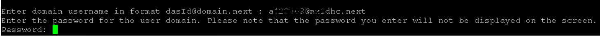

## Download VCS version matrix

VCS 1.7 version introduced new approach to version matrix file. There is no more need to download it separately as the upgrade is combined with [LCM code update](#new-code-update-process).

## LCM code update

Please check if new/updated playbook versions are available. See the `manageDhcRepository.yml` playbook for more information.

### New Code Update Process

---

VCS 1.6 introduced a new way of updating the local git repository on the ansible server, that skips the git001 VM/local gitlab.

To upgrade the code execute the playbook on *ans001* server from */opt/dhc/manage/* directory:

```bash
ansible-playbook manageDhcRepository.yml
```

The `manageDhcRepository.yml` playbook is available from version `DHC-1.5-latest` and later.

Familiarize yourself with the playbook description and arrange pre-requisites:

- Internet connection (at least to github.com) is required.
- Account on *github.com* with at least a read-only access to the VCS repositories is required.
- A GitHub access token with at least read privileges is required.

The playbook will prompt the user to input a release tag to upgrade the code to. The tags can be found at <https://github.com/GLB-CES-PrivateCloud/DHC/tags>. For a given VCS version, i.e. VCS 1.8.0, the latest available tag for that version should be chosen.  
Example, the available tags are `DHC-1.8.0-20240101` and `DHC-1.8.0-20240301`. The last part is a release date in YYYYMMDD format, therefore the later one should be preferred.

>Note, **the first run will fail by design**, as the playbook backs up the existing code as a first step. **You will be prompted to execute this playbook from a backup location.**
>
>By following the prompts you should end up with code updated to the desired release.

New code upgrade process updates the version Matrix file which is stored in *`/opt/dhc/version-matrix/versionMatrix.json`*. This is default location for both *manage* and *update* playbooks.

>Note, the old version Matrix json files located in *manage/group_vars/* and *update/group_vars/* folders become depreciated, not used and might be removed manually.

## VCF components [ETA 3 days]

VCS is based on VMware Cloud Foundation (VCF). Life cycle is controlled by VMware as a single entity allowing updates and security patching via SDDC Manager.

The following components are taken into consideration for an upgrade in this section (`MGT WD` and `VI WD`):

- SDDC Manager and VCF services
- vRealize Suite Lifecycle Manager
- vRealize Log Insight
- vRealize Operation Manager
- VMware Identity Manager (Workspace One Access)
- vRealize Log Insight
- vRealize Network Insight
- vRealize Automation (VMware vRealize Orchestrator is embeded)
- NSX-T Data Center
- vCenter Server
- ESXi hosts

VCF components upgrade sequence may differ depending on the version, hence refer to exact VCS and VMware VVD documents for step by step guidance.

| Upgrade path | VCS document | VMware document |
| --- | --- | --- |
| 4.5.0->4.5.1| [VCF upgrade 4.5.0->4.5.1](dhcVcfUpgradeTo-4.5.1.md) | [VMware Cloud Foundation 4.5.1](https://docs.vmware.com/en/VMware-Cloud-Foundation/4.5/vcf-lifecycle/GUID-B384B08D-3652-45E2-8AA9-AF53066F5F70.html)|

## non-VCF components

### Site Recovery Manager and vSphere Replication appliances upgrade

`valid for Disaster Recovery integrated environments only`

>Note: Site Recovery Manager 8.5.x is the last general version to support storage policy protection groups (SPPG). For array based principal storage on compute workload, before upgrading to Site Recovery Manger 8.7, all storage policy protection groups must be migrated to regular array-based replication protection groups. Existing operational manuals for datastore creation and SRM Protection Group creation should be reviewed and validated.

| Upgrade path | VCS document |
| --- | --- |
| 8.5.0->8.7 | [SRM and vSR upgrade to v8.7](wiSrmVsrUpgradeTo8.7.md) |

### Windows mgmt servers upgrade

Upgrade to Windows Server 2022 instuction tbd here.

### Ubuntu mgmt servers upgrade

Upgrade to Ubuntu Linux 22 instruction tbd here.

## Redefine VCS version

VCS uses *componentCurrentVersion* parameter to indicate current version of the environment for reporting and operational activities, hence it needs to be updated after every LCM.

Execute the following playbook to reflect current and target version variables in *update/group_vars/all* and *manage/group_vars/all* files.

```json
ansible-playbook upgradeDhcVersionInGroupVarsAll.yml -e "currentDhcVersion=dhcVersion1_8 nextDhcVersion=dhcVersion1_9"
```

>
>Note: VCS versions are case sensitive. Refer to [version Matrix](#vcs-version-matrix) chapter for names validation in the json file. The naming convention is like `dhcVersion1_X`  
> To validate:
>
> 1. SSH to ans001
> 2. View */opt/dhc/manage/group_vars/all* and */opt/dhc/update/group_vars/all* files
> 3. Check top of the file for the following entries
>
>      ```yaml
>      # group_vars/all file
>      componentCurrentVersion: dhcVersion1_8
>      componentNextVersion: dhcVersion1_9
>      ```

# Post LCM Validation Steps

>After the upgrade it is required to perform a bundle of validation activities that will ensure VCS is stable and fully operational in new software versions. Steps expected to contain both, automation and manual parts.

## Deploy Virtual Machine [ETA 15min]

Execute the following playbook on *ans001* server from */opt/dhc/update* folder to proceed with validation of `Deploy Virtual Machine` catalog item.

```shell
ansible-playbook validateVraCloudCatalogItem.yml
```

Playbook triggers deployment of five OS flavours with random inputs. You may observe deployment status on VMware Cloud Services portal during execution. At the end playbook returns report with result status. Test deployments are removed.

## Day2 action validation [ETA 20min]

Execute the following playbook on *ans001* server from */opt/dhc/update* folder to validate and test core day2 actions using default catalog item `Deploy Virtual Machine`.

```shell
ansible-playbook validateVraCloudDay2Action.yml
```

Playbook creates test deployment based on `Deploy Virtual Machine` catalog item using random mandatory inputs.
Based on created test deployment playbook triggers tasks to validate and test core day2 actions (core day2 actions are defined in role defaults main.yml file).

Currently playbook validates and test below core day2 actions:

- Add disk
- Resize machine
- Snapshot create
- Power Off
- Power One

You may observe deployment status and day2 action executions under VMware Cloud Service portal and ansible console.
>Example output from vRA Cloud Service Broker Portal showing current status of day2 actions execution.

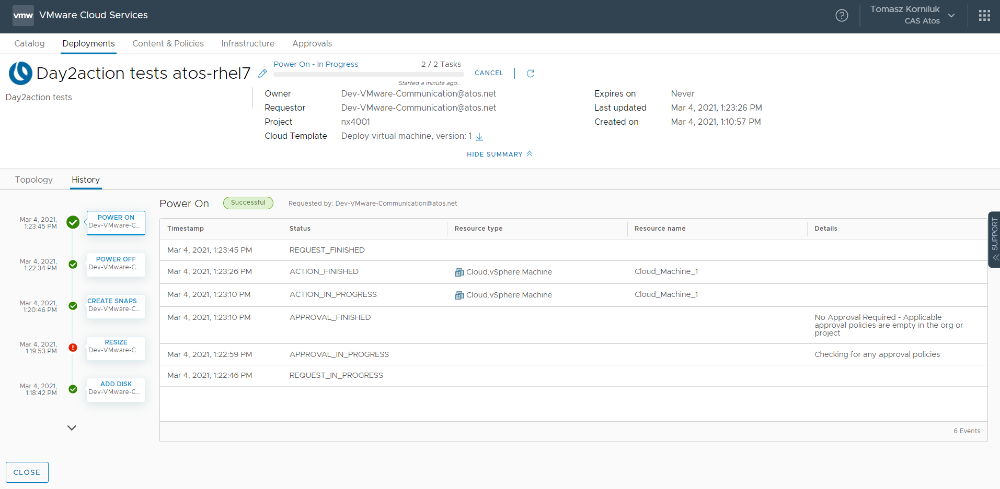

>Example output from ansible console showing result of day2action test execution (failed).

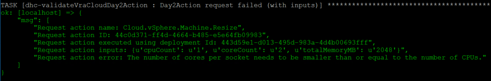

>Example output from ansible console showing result of day2action test execution (successfully).

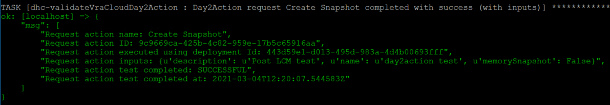

At the end playbook returns overall summary report.
>Example output from ansible console showing summary report

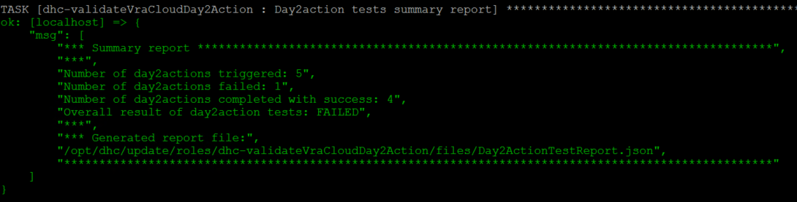

Additionally playbook generates overall summary report in json format (stored in role file folder).
>Example output from ansible console showing overall summary report in json format.

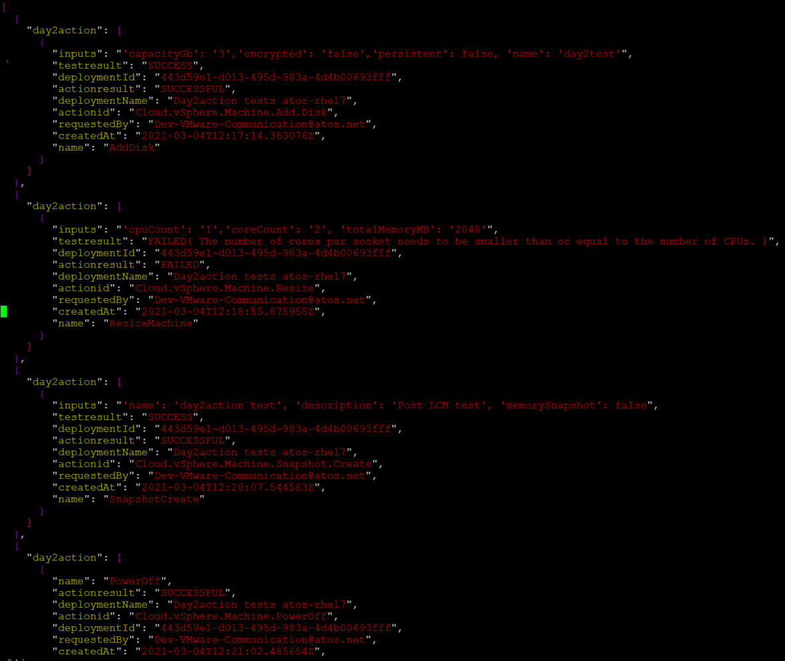

At the end playbook perform cleanup of created test deployment.
>Example output from vRA Cloud Service Broker Portal showing cleanup of test deployment.


## Disabling maintenance - starting vROps monitoring

After running the upgrade tasks and validating that all is well, do not forget to reenable monitoring by running the following command in /opt/dhc/update:

```shell
ansible-playbook configureVropsMaintenance.yml -e "maintenanceAction=START"
```

>Starts monitoring of all vROps resources.

## Monitoring Validation [ETA 45min]

Execute the following playbook on *ans001* server from */opt/dhc/update* folder to proceed with validation of monitoring.
Playbook validates and checks if monitoring for management and compute resources is working properly.

```shell
ansible-playbook validateMonitoring.yml
```

Monitoring validation covers following fully automated tasks:

- Copy stress script into predefined mgmt server (tss002)
- Generate high CPU demand on machine
- Check if alarm is created on vCenter
- Check if vROps adapter status for MGT vCenter is ok
- Check if alert is created on vROps
- Check if Http Gateway heartbeat is working
- Check if vROps adapter status for Workload Domain vCenter is ok

After playbook is finished a manual check is required only to validate if event/incident has been raised in SNOW.

User is informed about these steps at the end of playbook execution.

To do this please follow below steps:

- Login to SNOW instance via web browser (i.e. <https://atosglobal.service-now.com/>)

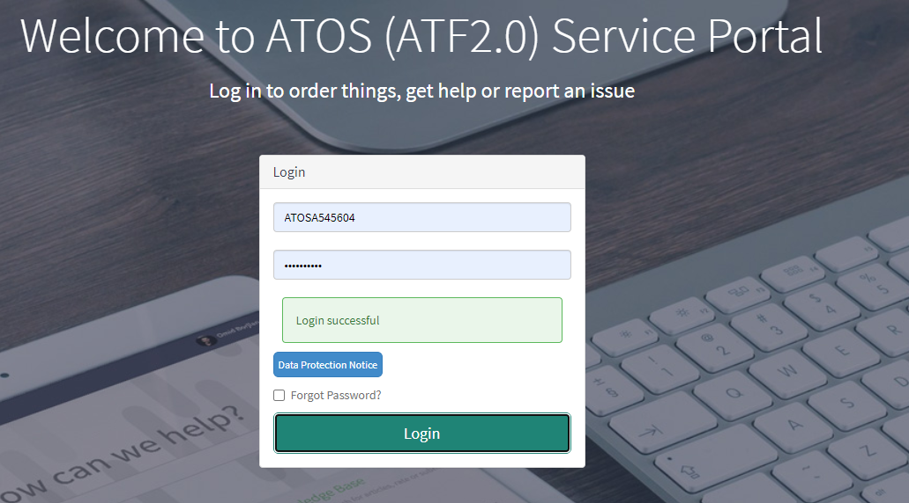

- Go to 'Service Event Management' --> 'All'

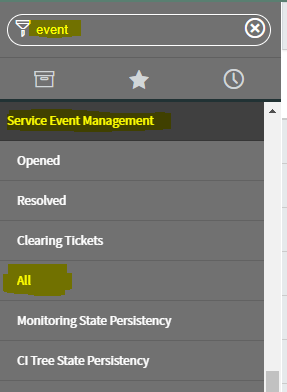

- Filter event by Event Sender or Affected CI or other specific value you know

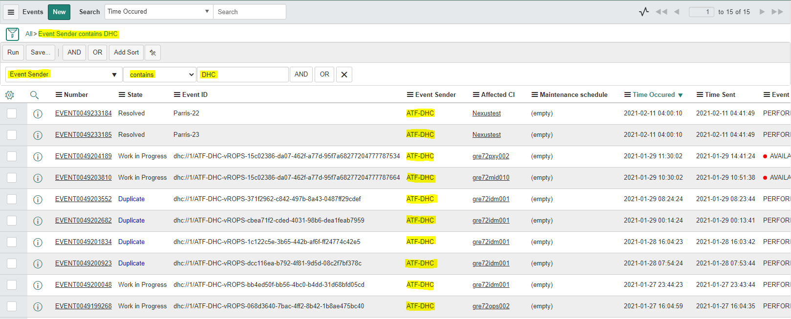

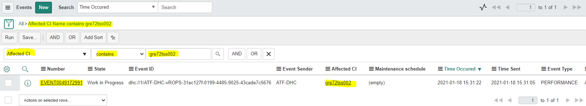

- Validate if event has been created successfully

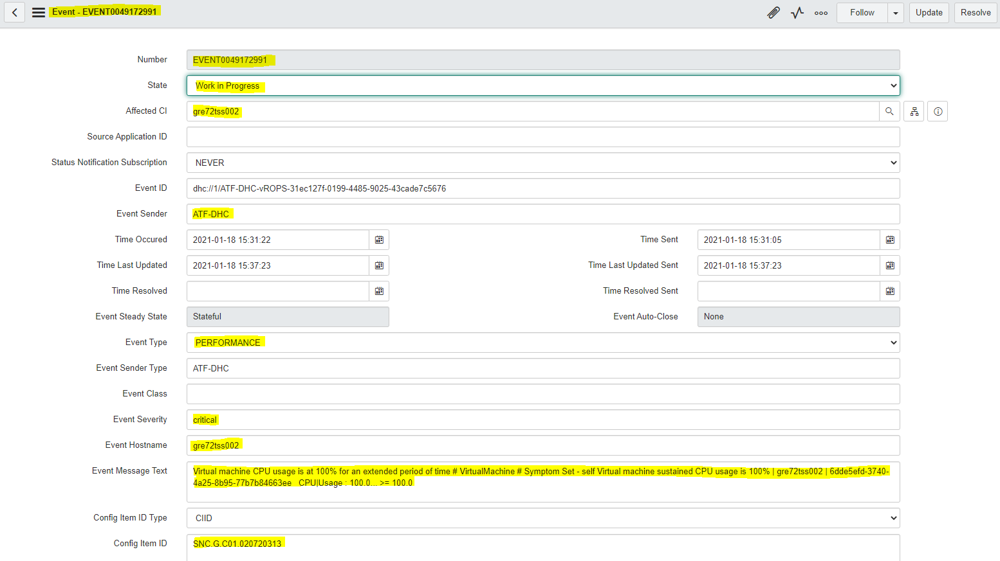

## External services validation

Request E2E testing of the external services, like:

- Backup
- Antivirus
- other customer specific

## Remove LCM snapshots

Execute the following playbook on *ans001* server from */opt/dhc/update* folder to proceed with removal of all automatic snapshots performed on non-VCF components.

Playbook requires EXTRA_VARS otherwise it will stop.

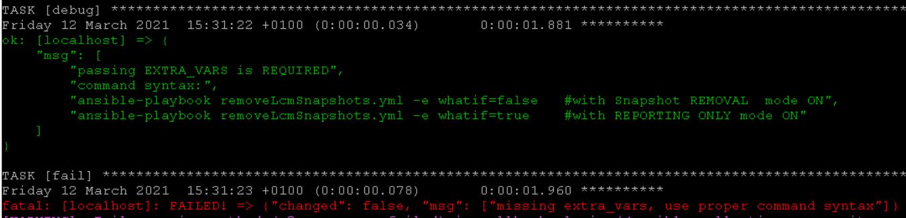

Command syntax:

- use *-e whatif=true* to enable REPORTING ONLY mode

```shell
ansible-playbook removeLcmSnapshots.yml -e whatif=true
```

- use *-e whatif=false* to enable SNAPSHOTS REMOVAL mode

```shell
ansible-playbook removeLcmSnapshots.yml -e whatif=false
```

>IMPORTANT: The playbook runs against all windows and linux hosts from ansible inventory (except Root Certificate Authority server which powered OFF by default).  Exact snapshot name *`prior LCM to version <componentNextVersion>`* are filtered and removed. Any other snapshots stays untouched.
It's important to search carefully for all remaining snapshots that have had been created manually as part of any pre manual activities and remove them.

When using REPORTING mode, you may expect the below output at the end of playbook. Servers not having the exact snapshot name *`prior LCM to version <componentNextVersion>`* are skipped.

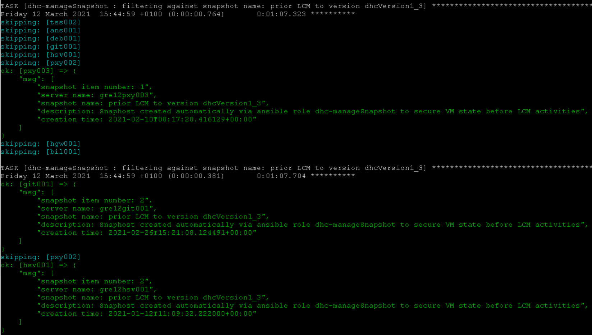
