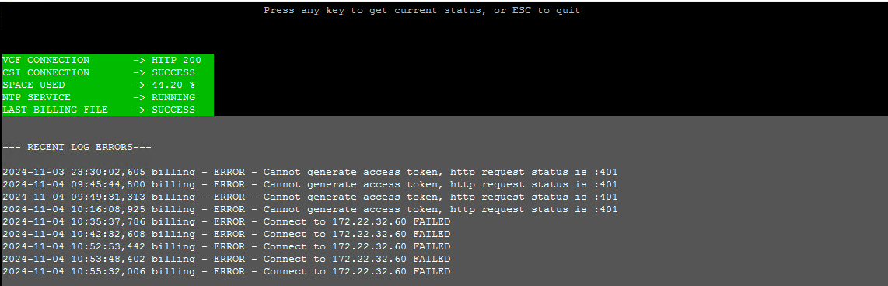
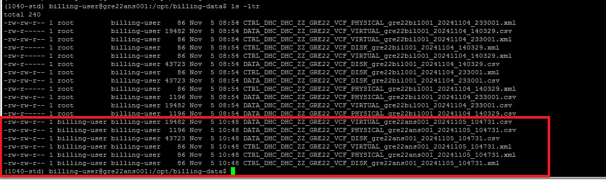
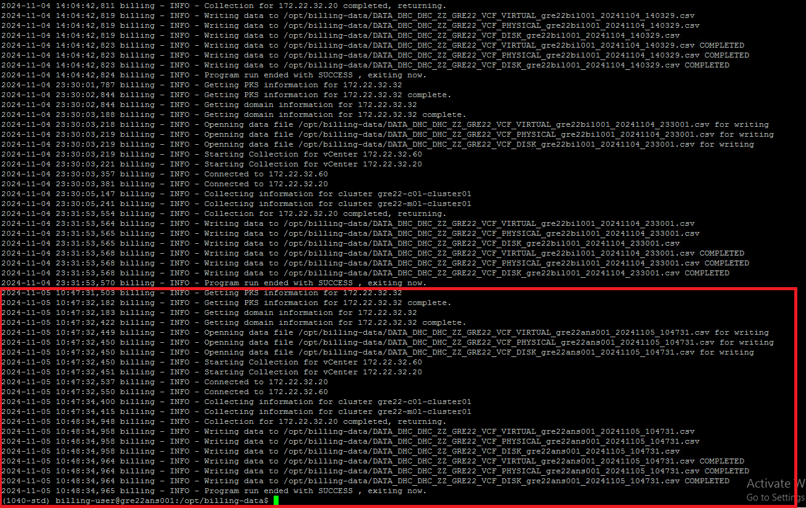
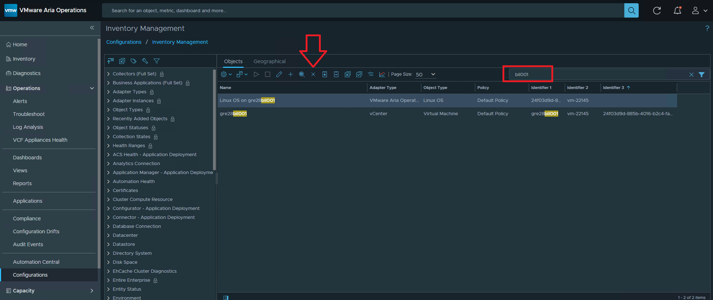
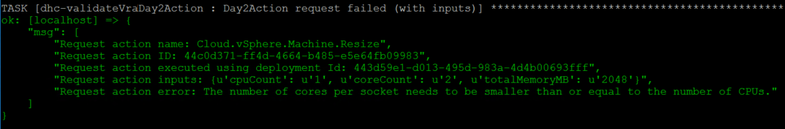
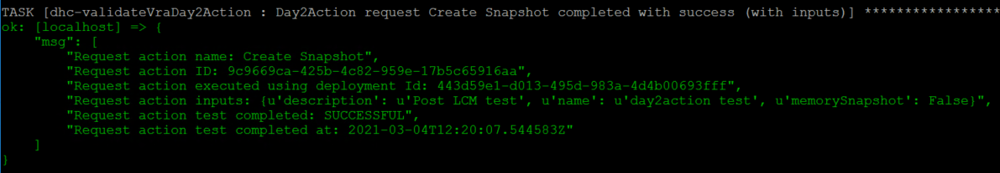
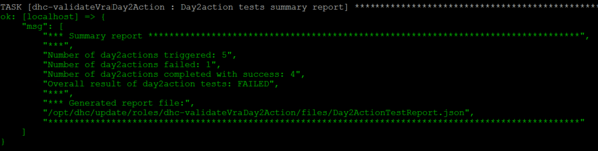
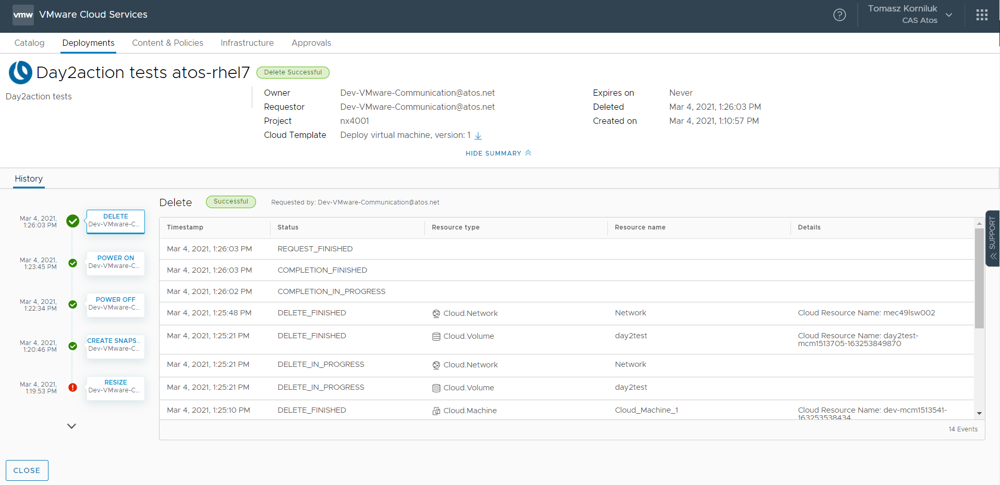
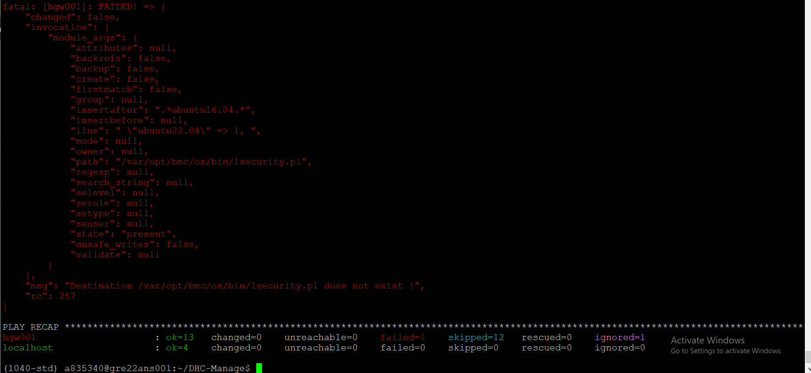

# Title: Lifecycle Management - 2.0.1

# List of Changes

| Date       | Issue     | Author              | TOS | Description                                                           |
| ---------- | --------- | ------------------- | --- | --------------------------------------------------------------------- |
| 24/07/2024 | VCS-13373 | Łukasz Tomaszewski  |     | Initial version                                                       |
| 05/11/2024 | VCS-14283 | Mariusz Stanek      |     | Added Billing section, post LCM validation, renumber to version 2.0.1 |
| 20/11/2024 | VCS-13872 | Krzysztof Olszewski |     | SDN NSX-T SSR implementation                                          |
| 12/12/2024 | VCS-14591 | Mariusz Stanek      |     | VRA tests scripts updated                                             |
| 14/01/2025 | VCS-14849 | Mariusz Stanek      |     | Perform group_vars and hosts cleanup                                  |
| 27/01/2025 | VCS-14891 | Mariusz Stanek      |     | Perform NSX TEPs readressing                                          |
| 14/02/2025 | VCS-15111 | Lukasz Bienkowski   |     | Add VCF adapter to VROPS                                              |
| 17/03/2025 | VCS-15417 | Mariusz Stanek      |     | Change upgradeAnsible procedure                                       |
| 19/03/2025 | VCS-15410 | Mariusz Stanek      |     | Documentation changes provided by TOS                                 |
| 24/03/2025 | VCS-15491 | Marcin Kujawski     |     | Add missing chapter to disable NSX-T VM tagging on Aria Automation    |
| 22/04/2025 | VCS-15901 | Mariusz Stanek      |     | Add Transport Node Profile assignment in case of missing configuration |
| 23/04/2025 | VCS-15900 | Krzysztof Olszewski |     | Add annotation about multitenancy as requirement                      |
| 24/04/2025 | VCS-15682 | Mariusz Stanek      |     | Information related with CSI Team and GCP migration details added |
| 25/04/2025 | VCS-16015 | Mariusz Stanek      |     | DSO comments implemented, interface removal added for TEPs readressing |
| 05/05/2025 | VCS-16008 | Mariusz Stanek      |     | VraToHashi NSX rule add through createVraToHashiRule.yml |
| 21/05/2025 | VCS-16000 | Krzysztof Olszewski |     | Add link to wiVraOnPremMultitenancy.md |
| 23/05/2025 | VCS-16013 | Adrian Giurgiu      |     | Documentation fix for GCP credentials |
| 08/07/2025 | VCS-16547 | Mariusz Stanek      |     | Billing cleanup playbook removeOldBilling.yml added |
| 08/07/2025 | VCS-16577 | Divyaprakash J      |     | Updated details for Alcatraz Scanner Validation |
| 17/07/2025 | VCS-16181 | Mariusz Stanek      |     | AD reboot after DHCP inteface delete removed from WI, Aria Operations and Port Group cleanup added. |
| 29/07/2025 | VCS-16680 | Mariusz Stanek      |     | Pexpect installation on IDM added |
| 15/08/2025 | VCS-16779 | Mariusz Stanek      |     | Billing bil001 object removal from Aria Operations info added  |
| 02/10/2025 | VCS-17041 | Mariusz Stanek      |     | NSX TEPs IPs readressing excluded from 2.0.1 release  |
| 03/10/2025 | VCS-17329 | Nicu Butaru      |     | Upgrade PowerCLi section added  |
| 18/12/2025 | VCS-17945 | Lukasz Bienkowski |    | Add step to upgrade PowerCLI on ans001 with tags |

# Introduction

This page describes Life Cycle Management of VCS components. Some VCS components can be upgraded independently, others have to follow the exact order.

# Scope

The work instruction is intended to cover below tasks:

- LCM code adaptation and update
- non-VCF components upgrade
- VCF components upgrade
- Post LCM validation

# Related Documents

| Document                                                                                    |
| ------------------------------------------------------------------------------------------- |
| [VCF Upgrade to 5.2.0](dhcVcfUpgradeTo-5.2.0.md)                                            |
| [Configure Billing](wiConfigureBilling.md)                                                  |
| [NSX-T SSRs implementation](wiEnableSdnNsxtSsrs.md)                                         |
| [Tenant Builder for Multi-tenant vRA On Prem](wiTenantBuilderVraOnPremMultiTenancy.md)      |
| [NSX-T Multi-Tenancy solution](wiNsxtMultiTenancy.md)                                       |
| [Configure NSX-T Components using configureNsxt.yml ansible playbook](wiConfigureNsxt.md)   |
| [vCF 5/vSphere 8 adjustments for Active/Active DR](dhcBuildGuide.md#vsan-stretched-cluster) |
| [Hardening of ESXi8 following Atos TSS document](dhcEsxi8AtosTSShardening.md) |
| [Hardening of vCenter8 following Atos TSS document](dhcvCenter8AtosTSSHardening.md) |
| [VCS AD Security Enhancement](dhcAdSecurityEnhancement.md) |
| [vRA On-Premises Multi-tenancy Configuration](wiVraOnPremMultitenancy.md) |
| [DHC METERING AND RECHARGING CUSTOMER ONBOARDING WI](https://atos365.sharepoint.com/:b:/s/CloudServiceInfrastructure-CSI/Eb0v-97tcN5Gsqoia3JOOA0BvjigQkw_PjTsjaCTfaOiaA?e=nYWdxI&xsdata=MDV8MDJ8bWFyaXVzei5zdGFuZWtAYXRvcy5uZXR8NGMxMTJlNmRhMmFiNDQzN2RhODAwOGRkODIzYWQxNDl8MzM0NDBmYzZiN2M3NDEyY2JiNzMwZTcwYjAxOThkNWF8MHwwfDYzODgwOTkxMTMwODMwMjgwMHxVbmtub3dufFRXRnBiR1pzYjNkOGV5SkZiWEIwZVUxaGNHa2lPblJ5ZFdVc0lsWWlPaUl3TGpBdU1EQXdNQ0lzSWxBaU9pSlhhVzR6TWlJc0lrRk9Jam9pVFdGcGJDSXNJbGRVSWpveWZRPT18MHx8fA%3d%3d&sdata=bDc5UkFxaHYzdU1FdzJydUlwbEdGbFBQL2FBTnVTSFBQbSs1bjNvbDllUT0%3d) |
| [isDedicated.pdf](files/wiLifeCycleManagementDHC201/isDedicated.pdf) |

# Features Summary

## Feature(Mandatory): Automated Service Integration - Billing

**Description**: Automated deployment and config of metering data collection and upload into CSI (using GCP)  
**Associated Jira Epic**: [VCS-12395](https://msdevopsjira.fsc.atos-services.net/browse/VCS-12395)  
**CodeRepo**: **DHC-Update**

## Feature(Mandatory): vCF 5/vSphere 8 security hardening

**Description**: Security hardening of vCF 5 components - mainly ESXi/vCenter with vSphere 8.Feature is available for the Manage phase of the VCS 2.0 which aligns and hardens both ESXi and vCenter 8.x versions according to ATOS TSS compliance benchmark.  
**Associated Jira Epic**: [VCS-9845](https://msdevopsjira.fsc.atos-services.net/browse/VCS-9845)  
**CodeRepo**: **DHC-Manage**

## Feature(Mandatory): DHC AD security enhancement (Tanable fix , RBAC,ORADAD fix)

**Description**: This feature contains Tenable , RBAC,ORADAD fixes on AD security hardening in conjunction with Windows Server 2022 update.  
**Associated Jira Epic**: [VCS-12167](https://msdevopsjira.fsc.atos-services.net/browse/VCS-12167)  
**CodeRepo**: **DHC-Manage**
  
## Feature(Optional): Improve DHC included consumption Portals exposure

**Description**: Feature is available under Aria Automation portal. It enables new look and feel of the Day1 catalog items for provisioning servers. New custom forms are applied that introduce Atos logos, icons, coloring and templating. There is also split for deployment of the servers based on OS flavors. Dedicated catalog items are used to deploy Windows, Red Hat and SUSE machines. Moreover, initial deployment supports additional disk creation as well as additional tags to be assigned for deployment for micro segmentation but also for application details.  
**Associated Jira Epic**: [VCS-12616](https://msdevopsjira.fsc.atos-services.net/browse/VCS-12616)  
**CodeRepo**: **DHC-Manage & VRO-Workflows**

## Feature(Optional): SDN NSX-T SSR support for NSX Multi tenancy (projects)

**Description**: The Aria Automation portal offers new Day1 SSRs for customers, including managing security groups, adding/removing security policies, managing VM security groups, automating firewall rule management within security policies, and creating new NSX services for use in firewall rules and policies. This feature enable support for NSX multi tenancy.  
**Associated Jira Epic**: [VCS-13584](https://msdevopsjira.fsc.atos-services.net/browse/VCS-13584)  
**CodeRepo**: **DHC-Manage & VRO-Workflows**

# Upgrade Steps

The upgrade steps contain both manual and automated (if feasible) parts.

**Before an upgrade, ensure:**

- **Aria Automation is enabled with Multi-Tenancy (and 'default-tenant' is created)**  
  If Multi-Tenancy is not enabled, please follow the [vRA On-Premises Multi-tenancy Configuration](wiVraOnPremMultitenancy.md)
- Maintenance plan is agreed and approved, it is in-line with LCM process.
- It is expected the upgrade is performed by a person(s) with expert knowledge in VMware, Linux and VCS solution. Engineers must have sufficient privileges.
- Image backups are created and available.
- All accounts are valid (not locked due, for example expired password).
- The playbooks mentioned in this work instruction, unless otherwise specified (for example user *next*), are executed by an engineer logged in with their dedicated domain account.
- File `csi-gcp-access.json` required for SCP to GCP migration was received from CSI Team (<dl-cloud-csi@atos.net>). For more details read [DHC METERING AND RECHARGING CUSTOMER ONBOARDING WI](https://atos365.sharepoint.com/:b:/s/CloudServiceInfrastructure-CSI/Eb0v-97tcN5Gsqoia3JOOA0BvjigQkw_PjTsjaCTfaOiaA?e=nYWdxI&xsdata=MDV8MDJ8bWFyaXVzei5zdGFuZWtAYXRvcy5uZXR8NGMxMTJlNmRhMmFiNDQzN2RhODAwOGRkODIzYWQxNDl8MzM0NDBmYzZiN2M3NDEyY2JiNzMwZTcwYjAxOThkNWF8MHwwfDYzODgwOTkxMTMwODMwMjgwMHxVbmtub3dufFRXRnBiR1pzYjNkOGV5SkZiWEIwZVUxaGNHa2lPblJ5ZFdVc0lsWWlPaUl3TGpBdU1EQXdNQ0lzSWxBaU9pSlhhVzR6TWlJc0lrRk9Jam9pVFdGcGJDSXNJbGRVSWpveWZRPT18MHx8fA%3d%3d&sdata=bDc5UkFxaHYzdU1FdzJydUlwbEdGbFBQL2FBTnVTSFBQbSs1bjNvbDllUT0%3d) and [isDedicated.pdf](files/wiLifeCycleManagementDHC201/isDedicated.pdf)

The majority of upgrade tasks should take place in order, defined by below paragraphs.

>Note: All the playbooks run in the update and manage phase will require credentials from VCS management domain


## LCM code adaptation and update

### Move ansible group_vars and inventory (ans001)

Fetch and download the latest content of update repository. Execute below as a user *next*:

```bash
sudo su next
cd /opt/dhc/update
git pull
git checkout DHC-1.8
```

Next, execute the following playbook from */opt/dhc/update* folder.

```bash
ansible-playbook createDhcConfig.yml
```

### Code update (ans001)

---
To upgrade the code execute the playbook on *ans001* server from */opt/dhc/manage/* directory:

```bash
ansible-playbook manageDhcRepository.yml
```

The `manageDhcRepository.yml` playbook is available from version `DHC-1.5-latest` and later.

Familiarize yourself with the playbook description and arrange pre-requisites:

- Internet connection (at least to github.com) is required.
- Account on *github.com* with at least a read-only access to the VCS repositories is required.
- A GitHub access token with at least read privileges is required.

The playbook will prompt the user to input a release tag to upgrade the code to. The tags can be found at <https://github.com/GLB-CES-PrivateCloud/DHC/tags>. For a given VCS version, i.e. VCS 2.0, the latest available tag for that version should be chosen.  
Example, the available tags are `DHC-2.0-20240101` and `DHC-2.0-20240301`. The last part is a release date in YYYYMMDD format, therefore the later one should be preferred.

>Note, **the first run will fail by design**, as the playbook backs up the existing code as a first step. **You will be prompted to execute this playbook from a backup location.**
>
>By following the prompts you should end up with code updated to the desired release.

New code upgrade process updates the version Matrix file which is stored in *`/opt/dhc/version-matrix/versionMatrix.json`*. This is default location for both *manage* and *update* playbooks.

## non-VCF components

VCS 2.0 LCM process contains:

- upgrade ansible python virtual environment
- update binaries

Proceed with steps in order described below.  

### Upgrade ansible python virtual environment

Execute the following playbook on *ans001* server from */opt/dhc/update* folder.

```bash
ansible-playbook upgradeAnsible.yml --tags "upgrade"
```

IMPORTANT NOTE: Close your ssh session to *ans001* and relogin, it will connect you to the new virtual env.

Execute the following playbook on *ans001* server from */opt/dhc/update* folder to install chromium.

```bash
ansible-playbook upgradeAnsible.yml --tags "chromium"
```

Execute the following playbook on *ans001* server from */opt/dhc/update* folder to cleanup sources.list and proxy settings.

```bash
ansible-playbook upgradeAnsible.yml --tags "cleanup"
```

### Download Binaries

Execute the following playbook on *ans001* server from */opt/dhc/update* folder.

```bash
ansible-playbook downloadBinaries.yml
```

### Migrate billing from SCP to GCP on bil001

Before running mentioned playbook it is required to have `csi-gcp-access.json` file which can be asked from CSI Team. Please follow instructions lised in [Configure Billing](wiConfigureBilling.md) document. Do not proceed if pre-requisites are NOT met. Prerequisite is also prompted as follows:

```bash
Please be aware that this automation script requires input files with specific variables in following path
{{ lookup('env', 'HOME') }}/csi-gcp-access.json

Before continue, please make sure that {{ lookup('env', 'HOME') }}/csi-gcp-access.json file is present.
File can be asked from CSI team.

Before continue, please confirm that you have read the documentation, prepared the required input files, and you are willing to continue script execution.

To confirm type 'yes', to abort type 'no'
```

Execute the following playbook on *ans001* server from */opt/dhc/update* folder.

```bash
ansible-playbook updateGcpAccessKeyForBilling.yml
```

### Migrate billing from bil001 to ans001

Important note: More billing details can be found in [Configure Billing](wiConfigureBilling.md).

Execute the following playbook on *ans001* server from */opt/dhc/update* folder.

```bash
ansible-playbook migrateBillingToAns001.yml
```

#### Steps to verify billing on ans001

1. Login as `billing-user`
2. Execute `billing-status`:

   ```bash
   billing-user@xxxxans001 billing-status
   ```

   

   Comment: See if there are any errors or criticals from current time. Error seen on picture above were noticed 2 days ago and are fixed now.

3. Execute `billing`:

   ```bash
   billing-user@xxxxans001 billing
   ```

4. Execute `billing-status` once again:

   ```bash
   billing-user@xxxxans001 billing-status
   ```

5. Verify if there are any new files created in `/opt/billing-data/`:

   ```bash
   billing-user@xxxxans001 cd /opt/billing-data
   billing-user@xxxxans001:/opt/billing-data$ ls -ltr
   ```

   

   Comment: New files were succesfully created with current time/date stamps.

6. Verify logs stored in `/var/log/billing.log`:

   ```bash
   billing-user@xxxxans001:/opt/billing-data$ cat /var/log/billing.log
   ```

   

   Comment: Check if there are any errors or criticals from current time. Search if there is success info displayed `Program run ended with SUCCESS , exiting now`.

#### Remove of bil001

If billing has been migrated succesfully then `bil001` can be deleted from vCenter, Hashi, DNS, AD and hosts file. Execute below playbook to trigger a cleanup:

```bash
ansible-playbook removeOldBilling.yml
```

Finally remove `bil001` from Aria Operations:

- Login to `ops001` through webbrowser.
- Navigate to `Operations` > `Configurations` > `Inventory Management`
- Search for `bil001` and remove listed objects:

 

### Move variables fron nsxVars.yml to platformConfig.yml

Execute the following playbook on *ans001* server from */opt/dhc/update* folder. It will move missing nsxVars.yml variables to platformConfig.yml.

```bash
ansible-playbook copyNsxVarsToPlatformConfig.yml
```

### Backup and remove old group_vars

Execute the following playbook on *ans001* server from */opt/dhc/update* folder. It will backup old group_vars into /home/next/group_vars_backup and remove them.

```bash
ansible-playbook removeOldGroupVars.yml
```

### Backup and remove old hosts

Execute the following playbook on *ans001* server from */opt/dhc/update* folder. It will backup old hosts into /home/next/hosts_backup and remove them.

```bash
ansible-playbook removeOldHosts.yml
```

## VCF components

Steps that should be performed in order to upgrade VCF from version 4.5.2 (VCS 1.8.4) to 5.2.0 (VCS 2.0.1) are detaily explained in following document: [VCF Upgrade to 5.2.0](dhcVcfUpgradeTo-5.2.0.md)

### SDN NSX-T SSR (Optional)

To implement functionality of SDN NSX-T SSR that supports NSX Multi tenancy, proceed with the following Work Instruction [SDN NSX-T SSR implementation in environment](wiEnableSdnNsxtSsrs.md).  

> IMPORTANT NOTE: It is required to allow traffic between VRA and Hashi Vault on port TCP 8200 before implement createVroConfig.yml and createNsxtSsrsBroker.yml. It can be done by executing:

```bash
ansible-playbook createVraToHashiRule.yml
```

### Improve DHC included consumption Portals exposure (Optional)

To implement functionality , proceed with the following Work Instruction [vra-onprem-tenant-service-broker-configuration](../workInstructions/wiTenantBuilderVraOnPremMultiTenancy.md#vra-onprem-tenant-service-broker-configuration)

# Pexpect installation on IDM

It is required to install pexpect module on IDM to keep password rotation functionality. Installation proces is automated by below playbook run:

```bash
ansible-playbook installIdmPexpect.yml
```

# PowerCLI upgrade on terminal servers and Ansible controller

After upgrade to vSphere 8.0U3 upgrade powerCli version to 13.3.0-24145081 - [download](https://developer.broadcom.com/tools/vmware-powercli/latest) is required to follow Broadcom Product Interoperability Matrix:
Please follow Broadcom [guide](https://techdocs.broadcom.com/us/en/vmware-cis/vcf/power-cli/latest/powercli/installing-vmware-vsphere-powercli/install-powercli-offline.html#GUID-3034A439-E9D7-4743-ABC0-EE38610E15F8-en) or execute playbook `upgradePowerCli.yml` from update repository with desired tags (tss or ans001)

```yaml
ans001:~/dhc/update$ ansible-playbook upgradePowerCli.yml -v --tags tss
ans001:~/dhc/update$ ansible-playbook upgradePowerCli.yml -v --tags ans001
```

# vCF 5/vSphere 8 security hardening  

Execute the following steps to harden Esxi and vCenter [dhcEsxi8AtosTSShardening](https://github.com/GLB-CES-PrivateCloud/DHC-Documentation/blob/develop/workInstructions/dhcEsxi8AtosTSShardening.md),
[dhcvCenter8AtosTSSHardening](../workInstructions/dhcvCenter8AtosTSSHardening.md)  

# DHC AD security enhancement (Tanable fix, RBAC, ORADAD fix)  

Execute the following steps for AD security hardening [dhcAdSecurityEnhancement](../workInstructions/dhcAdSecurityEnhancement.md)  

### Disable NSX-T VM Tagging for Aria Automation

To replicate to NSX-T only microsegmentation tags, there is a requirement to disable NSX-T VM tagging that is by default enabled in Aria Automation. In disable that please execute the playbook on *ans001* server from */opt/dhc/manage* directory:

```yaml
ansible-playbook disableNsxtVmTaggingAria.yaml
```

# Post LCM Validation Steps

>After the upgrade it is required to perform a bundle of validation activities that will ensure VCS is stable and fully operational in new software versions. Steps expected to contain both, automation and manual parts.

### Deploy Virtual Machine [ETA 15min]

Execute the following playbook on *ans001* server from */opt/dhc/update* folder to proceed with validation of `Deploy Virtual Machine` catalog item.

```shell
ansible-playbook validateVraCatalogItem.yml
```

Playbook triggers deployment of five OS flavours with random inputs. You may observe deployment status on VMware Cloud Services portal during execution. At the end playbook returns report with result status. Test deployments are removed.

### Day2 action validation [ETA 20min]

Execute the following playbook on *ans001* server from */opt/dhc/update* folder to validate and test core day2 actions using default catalog item `Deploy Virtual Machine`.

```shell
ansible-playbook validateVraDay2Action.yml
```

Playbook creates test deployment based on `Deploy Virtual Machine` catalog item using random mandatory inputs.
Based on created test deployment playbook triggers tasks to validate and test core day2 actions (core day2 actions are defined in role defaults main.yml file).

Currently playbook validates and test below core day2 actions:

- Add disk
- Resize machine
- Snapshot create
- Power Off
- Power One

You may observe deployment status and day2 action executions under VMware Cloud Service portal and ansible console.
>Example output from Aria Automation Service Broker Portal showing current status of day2 actions execution.


>Example output from ansible console showing result of day2action test execution (failed).



>Example output from ansible console showing result of day2action test execution (successfully).



At the end playbook returns overall summary report.
>Example output from ansible console showing summary report



Additionally playbook generates overall summary report in json format (stored in role file folder).
>Example output from ansible console showing overall summary report in json format.


At the end playbook perform cleanup of created test deployment.
>Example output from Aria Automation Service Broker Portal showing cleanup of test deployment.



### Disabling maintenance - starting vROps monitoring

After running the upgrade tasks and validating that all is well, do not forget to reenable monitoring by running the following command in /opt/dhc/update:

```shell
ansible-playbook configureVropsMaintenance.yml -e "maintenanceAction=START"
```

>Starts monitoring of all Aria Operations resources.

### Add VCF adapter to Aria Operations

The VROPS integration of Workload Domain is not supported anymore on SDDC Manager side, from VCF 5.2 it has to be configured as new adapter (VCF adapter) in Aria Operations. To create it please execute:

```shell
ansible-playbook configureVropsVcfAdapter.yml
```

IMPORTANT: New Vmware Cloud Foundation adapter is now created under Integrations tab in Aria Operations. Please be aware that Aria Operations automatically discovers vCenter, vSAN and NSX adapters and move all of them under VCF adapter into corresponding domain. It is visible under VMware Cloud Foundation -> VCF adapter instance afterwards.

### Monitoring Validation [ETA 45min]

Execute the following playbook on *ans001* server from */opt/dhc/update* folder to proceed with validation of monitoring.
Playbook validates and checks if monitoring for management and compute resources is working properly.

```shell
ansible-playbook validateMonitoring.yml
```

Monitoring validation covers following fully automated tasks:

- Copy stress script into predefined mgmt server (tss002)
- Generate high CPU demand on machine
- Check if alarm is created on vCenter
- Check if Aria Operations adapter status for MGT vCenter is ok
- Check if alert is created on Aria Operations
- Check if Http Gateway heartbeat is working
- Check if Aria Operations adapter status for Workload Domain vCenter is ok

After playbook is finished a manual check is required only to validate if event/incident has been raised in SNOW.

User is informed about these steps at the end of playbook execution.

To do this please follow below steps:

- Login to SNOW instance via web browser (i.e. <https://atosglobal.service-now.com/>)


- Go to 'Service Event Management' --> 'All'


- Filter event by Event Sender or Affected CI or other specific value you know


- Validate if event has been created successfully


### External services validation

Request E2E testing of the external services, like:

- Backup
- Antivirus
- other customer specific

### Remove LCM snapshots

Execute the following playbook on *ans001* server from */opt/dhc/update* folder to proceed with removal of all automatic snapshots performed on non-VCF components.

Playbook requires EXTRA_VARS otherwise it will stop.


Command syntax:

- use *-e whatif=true* to enable REPORTING ONLY mode

```shell
ansible-playbook removeLcmSnapshots.yml -e whatif=true
```

- use *-e whatif=false* to enable SNAPSHOTS REMOVAL mode

```shell
ansible-playbook removeLcmSnapshots.yml -e whatif=false
```

>IMPORTANT: The playbook runs against all windows and linux hosts from ansible inventory (except Root Certificate Authority server which powered OFF by default).  Exact snapshot name *`prior LCM to version <componentNextVersion>`* are filtered and removed. Any other snapshots stays untouched.
It's important to search carefully for all remaining snapshots that have had been created manually as part of any pre manual activities and remove them.

When using REPORTING mode, you may expect the below output at the end of playbook. Servers not having the exact snapshot name *`prior LCM to version <componentNextVersion>`* are skipped.


### Alcatraz Scanner Validation

The `generateAlcatrazReport.yml` playbook may fail on some servers due to inconsistencies in the **installation path** or **scanner version**.

#### Root Causes

1. **Path Mismatch** ( Applicable for Linux servers )  
   - In **VCS 1.x**, Alcatraz is installed at:

   ```bash
   /var/opt/bmc/Alcatraz/os
    ```

   - From **VCS 2.0.x and above**, the expected path is:  

   ```bash
   /var/opt/bmc/os
   ```

2. **Outdated Scanner Version**  
   - Some environments may have an older version of the Alcatraz scanner installed, which does not match the version specified in the `versionMatrix.json`.  
   - This mismatch can cause reporting to fail or result in incomplete compliance checks.

#### Example Error



#### If the Playbook Does **Not Fail**

If `generateAlcatrazReport.yml` runs successfully:

- The Alcatraz scanner is installed in the correct path  
- The installed version matches the target version from the version matrix  
- No further action is needed

In such cases, you can skip the `upgradeAlcatraz.yml` playbook.

#### Solution: `upgradeAlcatraz.yml`

To fix these issues, Execute the following playbook on ans001 server from /opt/dhc/update folder

```shell
ansible-playbook upgradeAlcatraz.yml
```

You may use tags to limit the host scope. For example:

```shell
ansible-playbook generateAlcatrazReports.yml --tags runScanAlcatrazWindows
ansible-playbook generateAlcatrazReports.yml --tags runScanAlcatrazLinux
```

#### What the Playbook Does :-

- Detects the currently installed Alcatraz version in both old and new paths
- Compares the detected version with the target version from versionMatrix.json
- If needed, it will:
  - Move files from the legacy path to the correct path
  - Upgrade Alcatraz to the expected version
  - Normalize the directory structure across environments

#### After Execution

- Alcatraz files will reside under the correct path: /var/opt/bmc/os
- The installed version will match what is defined in the version matrix
- The generateAlcatrazReport.yml playbook will complete successfully
