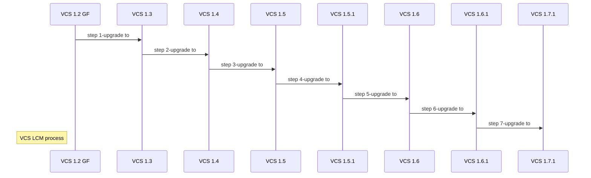
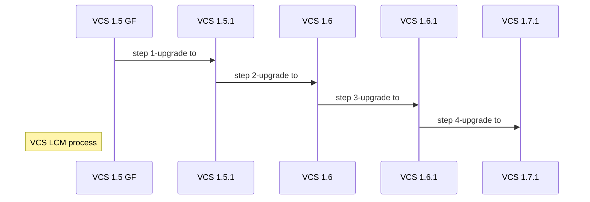

# Table of Contents

- [Table of Contents](#table-of-contents)
- [Title: Lifecycle Management](#title-lifecycle-management)
- [Changelog](#changelog)
  - [Introduction](#introduction)
    - [Purpose](#purpose)
    - [Audience](#audience)
    - [Scope](#scope)
- [Life Cycle Management overview table](#life-cycle-management-overview-table)

# Title: Lifecycle Management

# Changelog

| Date       | Issue       | Author          | TOS | Description                            |
|------------|-------------|-----------------|-----|----------------------------------------|
| 02.09.2021 | DHC-2647    | Robert Kaminski |     | First version                          |
| 04.10.2021 | DHC-3162    | Robert Kaminski |     | Added VCS 1.5 documents                |
| 26.09.2022 | CESDHC-4152 | Robert Kaminski |     | Added VCS 1.6 documents                |
| 24.10.2022 | CESDHC-3894 | Robert Kaminski |     | WI content update to reflect LCM 1.5.1 |
| 07.12.2022 | CESDHC-5102 | Pawel Holi      |     | Added VCS 1.6 and 1.6.1 documents      |
| 23.12.2022 | CESDHC-4635 | Pawel Holi      |     | Document link fix                      |

## Introduction

### Purpose

Bring an overview of the Live Cycle Management (LCM) documents.

### Audience

- VCS Operations
- VCS Engineers

### Scope

The `LCM main work instruction` contain the upgrades steps for both `VCF` and `non-VCF` components upgrades. The VCF part is exported to the separate documents that includes links to the necessary work instructions.

Instructions relevant to older VCS releases may be found within their respective releases on VCS GitHub.

# Life Cycle Management overview table

> Note: During VCS upgrade, you MUST NOT skip intermediate VCS versions. Please follow LCM process as shown on diagram below:

