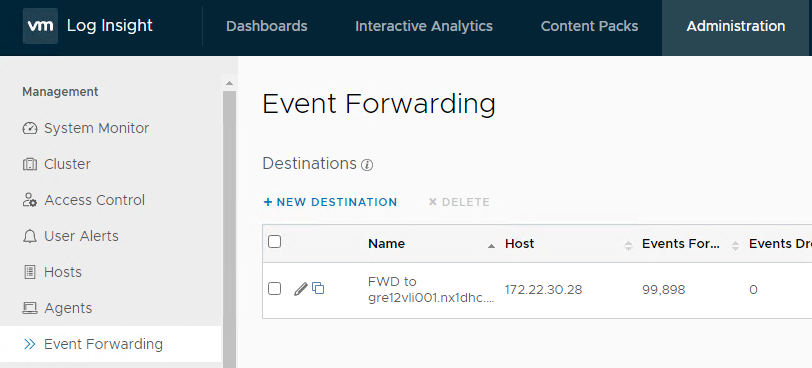
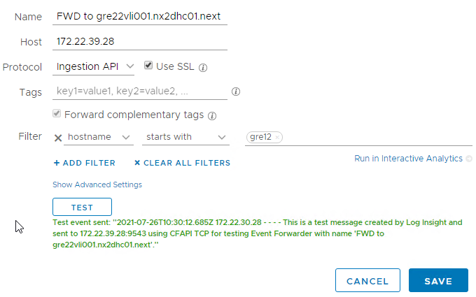
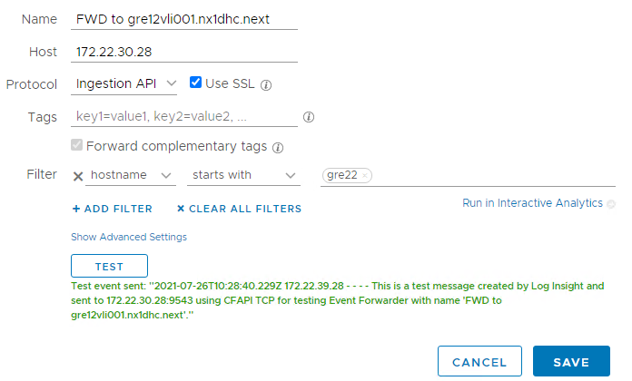
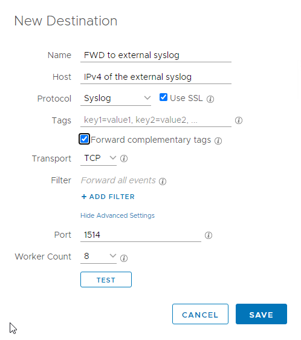

# Log Forwarding

# Changelog

|    Date    |   Issue    |      Author     |  Description  |
| ---------- | ---------- | --------------- | ------------- |
| 26.07.2021 |   DHC-528  | Jakub Zielinski | initial draft |

## Introduction

### Purpose

Forward LogInsight logs to external Syslog.

### Audience

- VCS Engineers
- VCS Operations

### Scope

To meet Atos security compliance, Log Insight logs shall be forwarded to external syslog with restricted access to security operators and administrators. There are two ways to proceed and depending on the integration architect's decision you could either:

- configure bidirectional forwarding, which is naturally suitable for Active-Passive Disaster Recovery enabled environments, or
- choose to send data to an external syslog outside of VCS infrastructure, the destination for which would be provided by the integration architect.

# Opening Network Flows

For bidirectional event forwarding between two vRealize Log Insight clusters:

- On NSX-T firewall we need to make sure that port 9543 is opened to the receiving Log Insight server to ensure SSL encrypted transmission over Ingestion API protocol.
- On SRX we need to make sure that the routing is enabled between the subnets that contain vRealize Log Insight servers

For single way forwarding to an external syslog:

- On NSX-T firewall we need to make sure that the required port is opened to the external syslog server. The default port used for encryption enabled connectivity is 1514, however it may vary depending on the destination syslog server configuration.
- On SRX we need to make sure that the routing is enabled between to the subnet containing the external syslog server.

# Configuring Bidirectional Forwarding

While configuring vRealize Log Insight to forward events to another vRealize Log Insight server we need to be cautious to not create a forwarding loop. A forwarding loop is a configuration in which a vRealize Log Insight cluster forwards events to itself, or to another cluster, which then forwards the events back to the original cluster. Such a loop might create an indefinite number of copies of each forwarded event. The vRealize Log Insight Web interface does not permit you to configure an event to be forwarded to itself. But vRealize Log Insight is not able to prevent an indirect forwarding loop, such as vRealize Log Insight cluster A forwarding to cluster B, and B forwarding the same events back to A. When creating forwarding destinations, take care not to create indirect forwarding loops. In order to prevent a loop from happening, we must create a filter to only send events containing hostname that start with < locationCode >. Consider the following example:

Log in to each vRealize Log Insight cluster and go to Administration -> Event Forwarding

Click New Destination

Fill in the necessary fields to set up the log forwarding.

- Name: FWD to < FQDN of the system to which you want to forward the events >
- Host: Here paste the IP address of the server that will receive the forwarded logs. Hostname or FQDN will not work, as there is no DNS resolution set up between the environments.
- Protocol: select Ingestion API
- Use SSL: Tick the box to enable encryption
- Click ADD FILTER and set up the filter for events starting with the < locationCode > of the environment from which the events will be sent.
- Click TEST button and accept the SSL certificate

Proceed with the same list of steps as done previously, just in the other direction.

# Configuring Unidirectional Forwarding

The integration architect may decide that the logs should be forwarded onto a syslog server somewhere remote, outside VCS infrastructure. To configure it as such log in to the vRealize Log Insight cluster and navigate to Administration -> Event Forwarding

Click on New Destination.

Fill in the necessary fields to set up the log forwarding.

- Name: FWD to < name of the syslog server to which you want to forward the events >
- Host: Here paste the IP address of the server that will receive the forwarded logs. Hostname or FQDN will not work, as there is no DNS resolution.
- Protocol: select Ingestion API
- Use SSL: Tick the box to enable encryption. Do not allow for non-encrypted communication to the syslog server.
- Do not create a filter, it is not needed for this type of configuration
- Click TEST button and accept the SSL certificate provided by the remote syslog server

# Related Documents

| Document |
| -------- |
| [VCS Role Based Access Control LLD](../design/lldDhcRoleBasedAccessControl.md) |
| [VCS Monitoring & Logging LLD](../design/lldMonitoringLogging.md) |
