# Manual upgrade of VMware Tool on management Windows

## Table of Contents

- [Manual upgrade of VMware Tool on management Windows](#manual-upgrade-of-vmware-tool-on-management-windows)
  - [Table of Contents](#table-of-contents)
- [Changelog](#changelog)
  - [Introduction](#introduction)
    - [Purpose](#purpose)
    - [Audience](#audience)
    - [Scope](#scope)
  - [Pre-implementation steps](#pre-implementation-steps)
  - [Implementation steps](#implementation-steps)
  - [Post-implementation steps](#post-implementation-steps)

# Changelog

| Date | Author       | Issue              | Description          |
| ------- | ---------- | ------------------------ | --------------- |
| 09.04.2024| Slabu Adriana | VCS-12437  |  Create initial version  |

## Introduction

### Purpose

This instruction explains the procedure which should be followed in case Vmware Tools needs to be manually upgraded on the Windows VMs. This manual upgrade might be needed for various reasons. In our case, this upgrade is required to address the vulnerability VMSA-2023-0019 reported by vmware [www.vmware.com/security/advisories/VMSA-2023-0019.html](https://www.vmware.com/security/advisories/VMSA-2023-0019.html).

### Audience

- VCS Operations

### Scope

The Instruction assumes that the reader has reasonable grasp of VCS infrastructure and VMware components.

## Pre-implementation steps

Before upgrade we need to perform some steps:

- Download ISO image on terminal server and upload it to vSAN datastore. VMware Tools can be downloaded from the [Product Download](https://customerconnect.vmware.com/downloads/details?downloadGroup=VMTOOLS1230&productId=742) page.

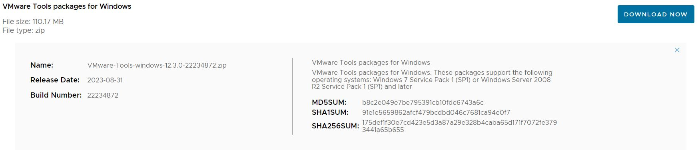

- Upload the ISO image on vSAn datastore using WinSCP.

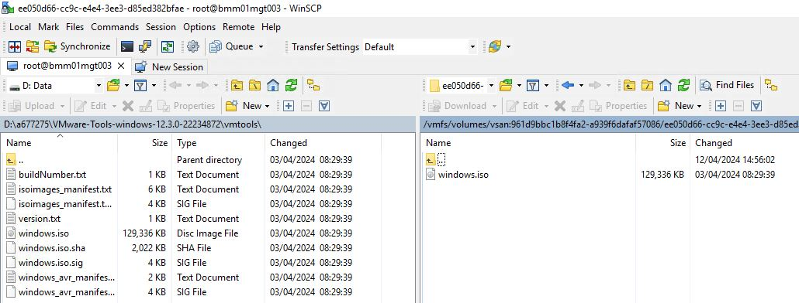

- Snapshot Virtual Machine before VMwareTool upgrade.

- Place Virtual Machine in maintenance from vROPs side.

## Implementation steps

- Right click on the VM and choose "Edit Settings", from where we mount the ISO image. We browse to the folder where we uploaded the ISO file.

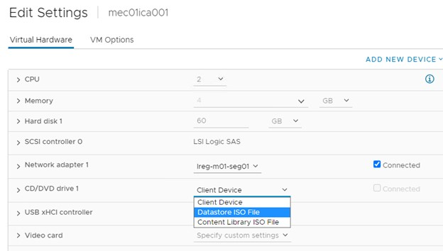

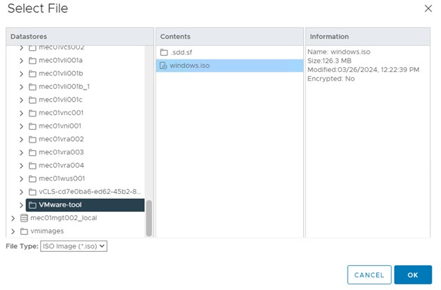

- RDP on the Windows VM, open the drive attached and run the setup file.

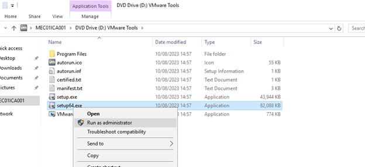

>NOTE: A pop-up installation wizard will appear. Follow the "Next" button and choose default option of "Typical" installation, click "Next" and "Install". Wait until installation finishes.

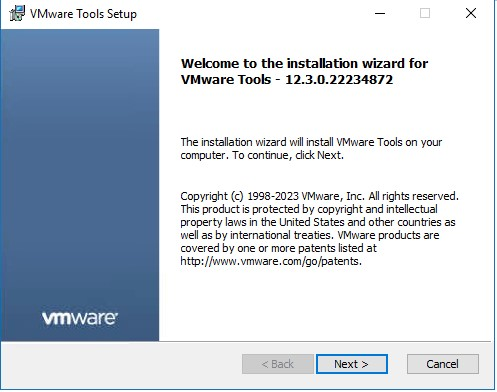

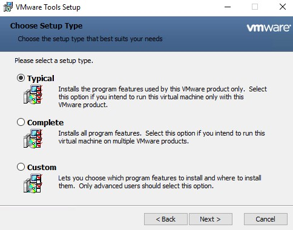

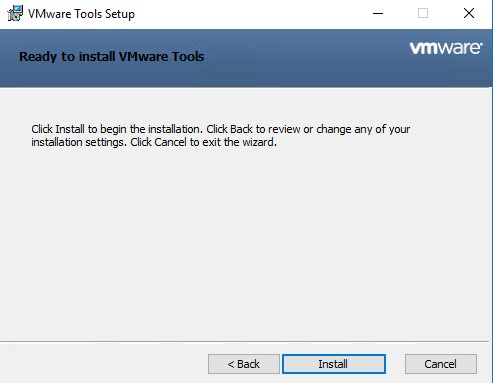

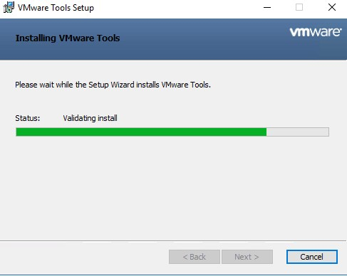

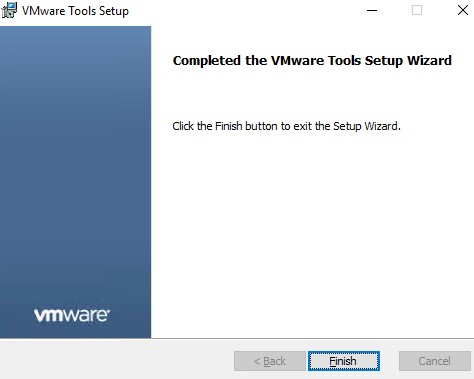

>NOTE: Most of the time, it will ask for reboot, but if it doesn't ask, we reboot it manually.

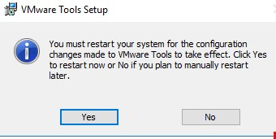

## Post-implementation steps

- After reboot, login again on the Windows VM and check services, drivers from device manager and processes from Task Manager.

- We unmount the ISO file from the VM's Edit Settings.

- We remove the VMs from maintenance.

- We print-screen the new VMware Tool version and upload it as evidence to the change.
