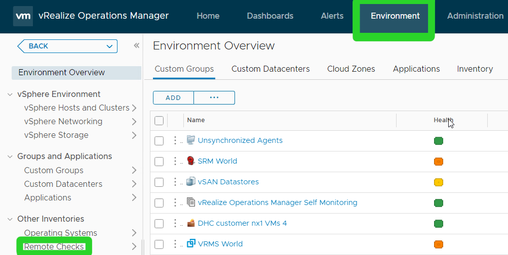
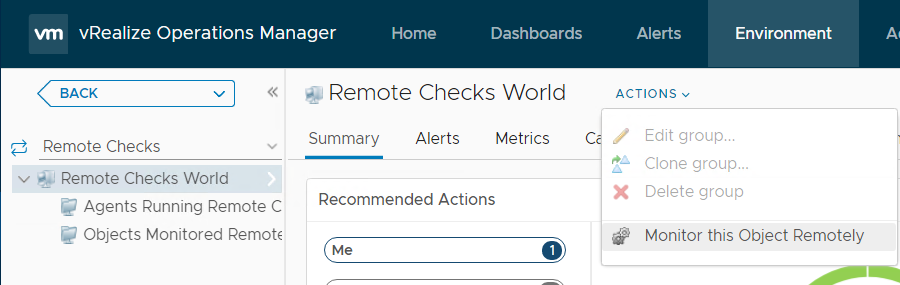
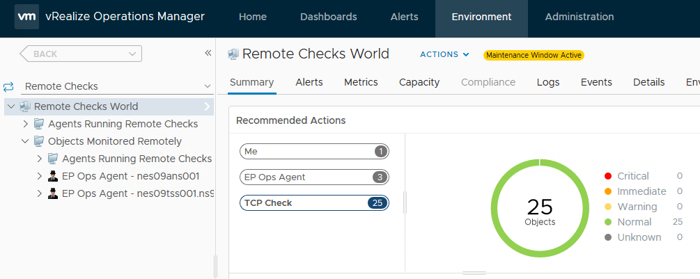
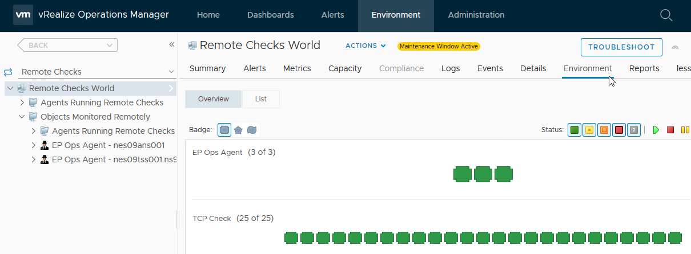

# Monitor TCP Ports

# Changelog

|    Date    |  Issue   |     Author      |      Description     |
| ---------- | -------- | --------------- | ---------------------|
| 01/07/2021 | DHC-530  | Jakub Zielinski |    Initial draft     |
| 08/07/2021 | DHC-2359 | Jakub Zielinski |  Expand on the idea  |

## Introduction

### Purpose

Configure monitoring for TCP ports for daily checks and perform the daily check.

### Audience

- VCS Operations

### Scope

- Configure monitoring
- Perform the daily check

# Setting up the monitoring

To easily generate the list of TCP ports to monitor with vROps, use the following playbook from */opt/dhc/manage* folder on *ans001* server.

```shell
ansible-playbook listTcpToMonitor.yml
```

The output should look similar to this:


Log in to vRealize Operations Manager.

Click Environment and then Remote Checks.


Select Remote Checks world. The below part you will have to perform multiple times for each item in the list:

Click Actions - Monitor this Object Remotely


From the list of items copy the DisplayName and paste it into the Display Name field

From Monitor From dropdown list select the host listed as "From:" by double clicking on it. You can use the filter to make things easier.

From Check Method select TCP Check

Copy and paste the FQDN listed as "To:" into the hostname field

Type in the appropriate value for port.


Click OK

Repeat for each item in the list given by the listTcpToMonitor.yml playbook.

# Performing the daily check

Log in to vRealize Operations Manager.

Click Environment and then Remote Checks.


Click TCP Check. The result of these checks is shown on the circular graph, if everything is OK it should be all green. Any triggered alerts are shown in the table below the graph.



Another useful view is available. Select "more..." under Remote Checks World, then Environment. You can view the details of each check by hovering over them one by one.


