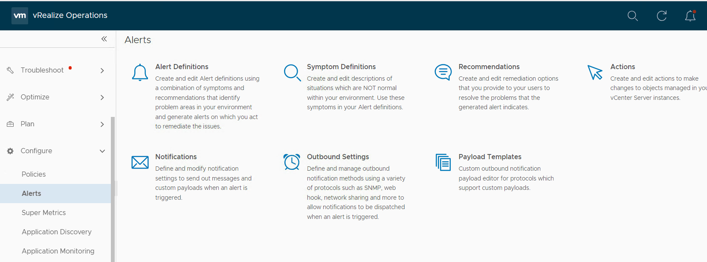
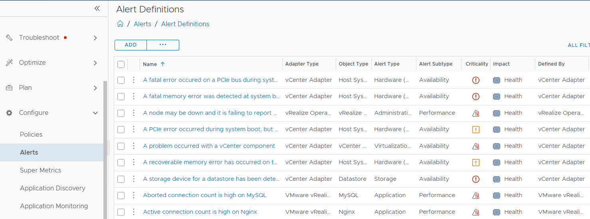
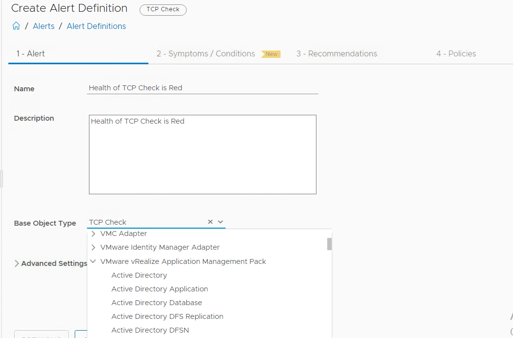
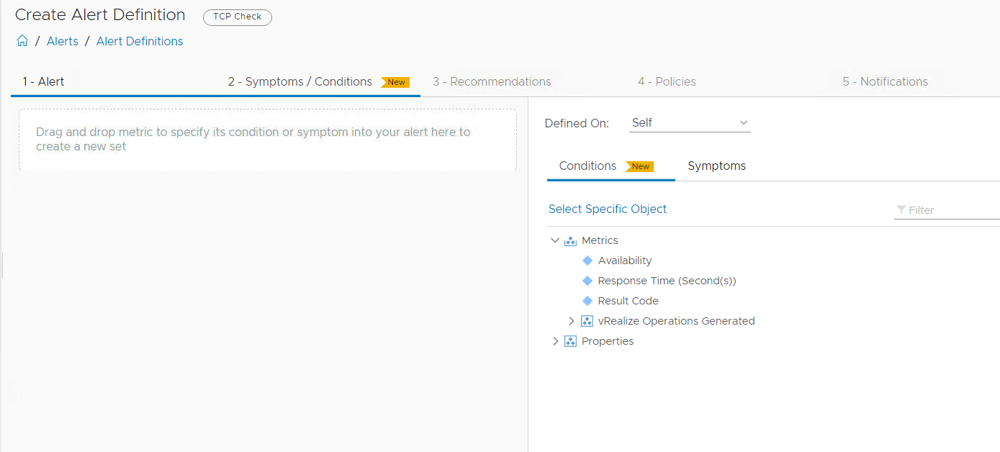
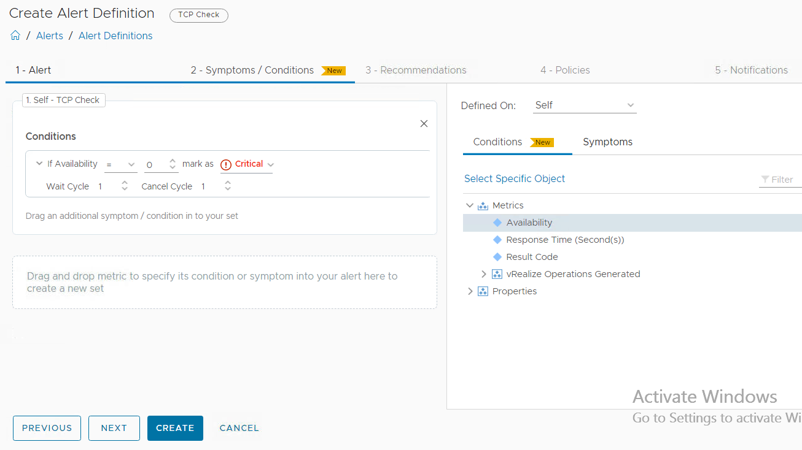
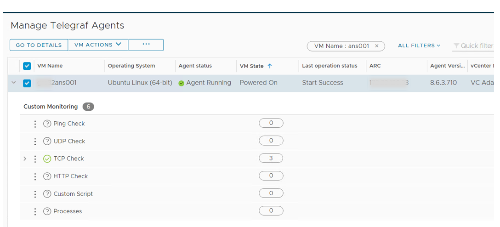
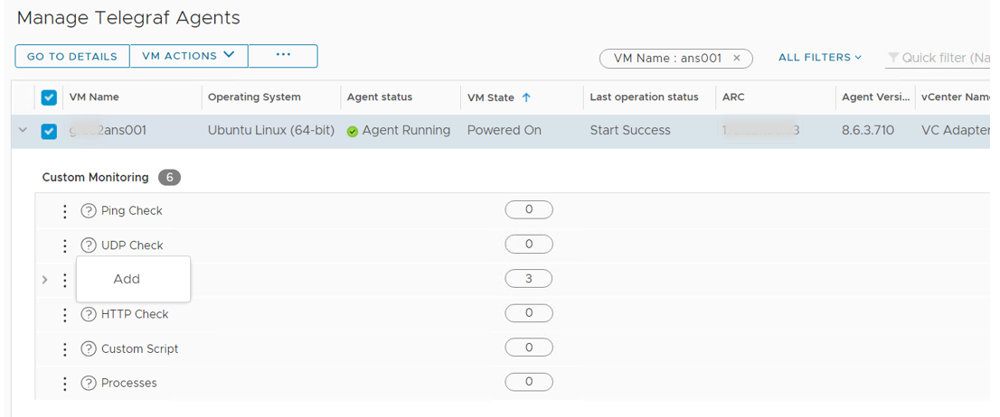
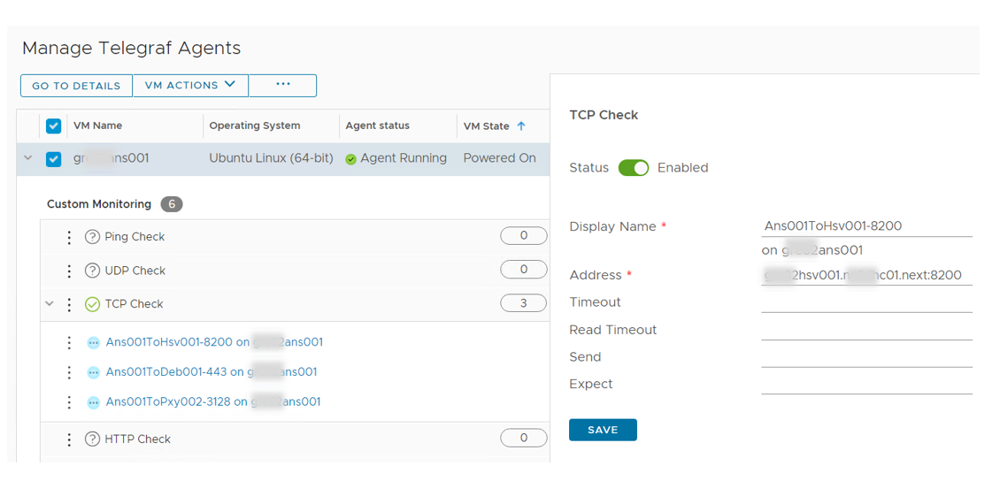
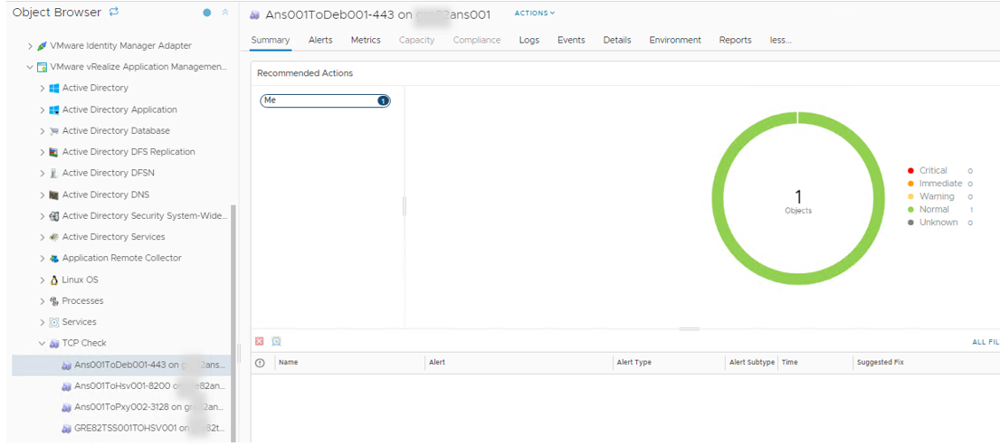
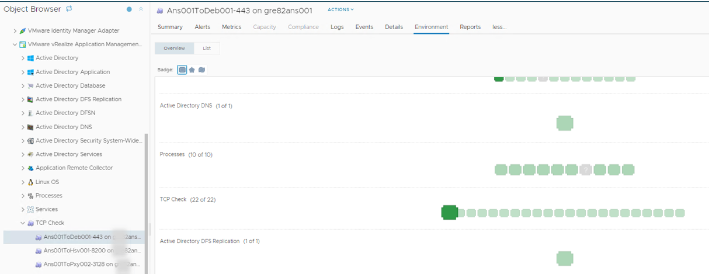

# Monitor TCP Ports using vROps Telegraf Agent

Table of Contents

- [Monitor TCP Ports using vROps Telegraf Agent](#monitor-tcp-ports-using-vrops-telegraf-agent)
- [Changelog](#changelog)
- [Introduction](#introduction)
- [Scope](#scope)
- [Pre-requisite](#pre-requisite)
- [Procedure](#procedure)
  - [Create Alert Definition in vROps for TCP Check](#create-alert-definition-in-vrops-for-tcp-check)
  - [Generate the list of TCP ports to be monitored](#generate-the-list-of-tcp-ports-to-be-monitored)
  - [Configure TCP port monitoring](#configure-tcp-port-monitoring)
    - [vROps Remote TCP Checks Issue](#vrops-remote-tcp-checks-issue)
  - [Performing the Daily Check](#performing-the-daily-check)

# Changelog

| version | Date       | Description                                                  | Author(s)             |
| ------- | ---------- | ------------------------------------------------------------ | --------------------- |
| 0.1     | 19-07-2023 | VCS-10208 Initial Draft                                      | Madhavi Rane          |
| 0.2     | 31-07-2023 | VCS-10318 Added details related to creation of vROps alert definition | Madhavi Rane |

# Introduction

This document explains the step by step process of configuring remote TCP checks using vROps Telegraf Agent.

# Scope

This work instruction is intended to cover below tasks:

1. Create vROps alert definition for TCP check object.
2. Configure remote TCP checks using vROps Telegraf agent from vROps UI.
3. How to perform Daily checks for already configured TCP port monitoring.

The following tasks are out of scope of this document:

1. vROps Telegraf agent installation.

# Pre-requisite

Before proceeding,

1. Please make sure vROps cloud proxy is up and running.
2. vROps Telegraf agents are installed and are in running state on source VMs from which remote TCP checks need to be configured. At the time of writing this document we are using tss001,ans001 and mid001 as source vms for configuring various TCP checks. So please make sure Telegraf agents are installed and are in running state on these vms.

# Procedure

## Create Alert Definition in vROps for TCP Check

As of writing this document there is no out of the box vROps Alert definition available for TCP Check. Hence we need to create the Alert Definition in vROps in order to monitor and generate the alert for TCP Check object. Please follow below mentioned steps to create a new alert definition.

1. Login to vROps UI with admin credentials.
2. From the left menu, click **Configure**-> **Alerts**. Click on **Alert Definitions**.

   

3. Click on **ADD** to create new alert definition.

   

4. Enter name as **Health of TCP Check is Red**.
5. In **Base Object Type** drop down field, expand **VMware vRealize Application Management Pack** and select **TCP Check** as object type. Click Next.

   

6. on **Sysmptoms / Conditions** tab, select **Self** from **Defined On** drop down field.
7. Expand **Metrics** list. Drag and drop **Availability** metric into drag and drop box.

    

8. Set condition as **If Availability = 0**. Mark it as **Critical**. Set **Wait Cycle** to 1 and **Cancel Cycle** to 1. Please refer following screen shot. Click Next.

    

9. Click Next on **Recommendations** Tab.
10. On **Policies** tab, select **Default Policy**. Click Next.
11. On **Notifications** tab, Click **CREATE**

## Generate the list of TCP ports to be monitored

To easily generate the list of TCP ports to be monitored with vROps, execute the following playbook from /opt/dhc/manage folder on ans001 server.

```yml

ansible-playbook listTcpToMonitor.yml

```


## Configure TCP port monitoring

Please perform following steps to configure TCP port monitoring from vROps UI. These steps need to be performed for each item in the list acquired in earlier section.

1. Login to vROps UI with admin credentials
2. From the left menu, click **Environment**-> **Applications**. From the Applications panel, click **Manage Telegraf Agents**.
3. Select the source vm from which remote TCP check needs to be performed. This VM is mentioned against "From:" in the list. e.g. select ans001 server.
4. The Telegraf agent must be running on this VM.
5. Expand the drop-down arrow against the VM. You see the **Custom Monitoring** section.
   

6. From the **Custom Monitoring** section, select **TCP Check** , click the vertical ellipsis and then click Add.
   

7. Enable the TCP Check from dialog box that is displayed on the right side.
8. From the list copy the **DisplayName** and paste it in to **Display Name** field e.g **Ans001ToHsv001-8200**
9. From the list copy the FQDN listed against "To:" into the **Address** field and append it with port value mentioned in the list e.g. **gre82hsv001.nx8dhc01.next:8200**
    

10. Click Save. It takes some time to enable the monitoring.

Please repeat these steps for each item in the list given by the listTcpToMonitor.yml playbook.

### vROps Remote TCP Checks Issue

- Once the TCP checks are configured and it is observed that monitoring is not getting enabled then it is an issue with the salt-minion service. The salt-minion service is down which prevents actions from the UI from being sent to the endpoint as the Cloud Proxy. The salt-master needs to be able to communicate with the salt-minion on the endpoint VM for monitoring

- To resolve this issue SSH to the affected endpoint VM and login as root account. To restart the ucp-salt-minion service on the affected endpoint VM see the below command:

```shell
systemctl start ucp-salt-minion
```

**Note:** As per the VMware updates the permanent fix of this issue is available in vROps version 8.10

## Performing the Daily Check

These custom TCP port monitoring objects can be viewed in vROps by navigating to **Environment** -> **Object Browser** -> **All Objects** -> **VMware vRealize Application Management Pack** -> **TCP Check**



Also you can check status of all configured TCP Checks under **Environment** tab of any **TCP Check** object.


