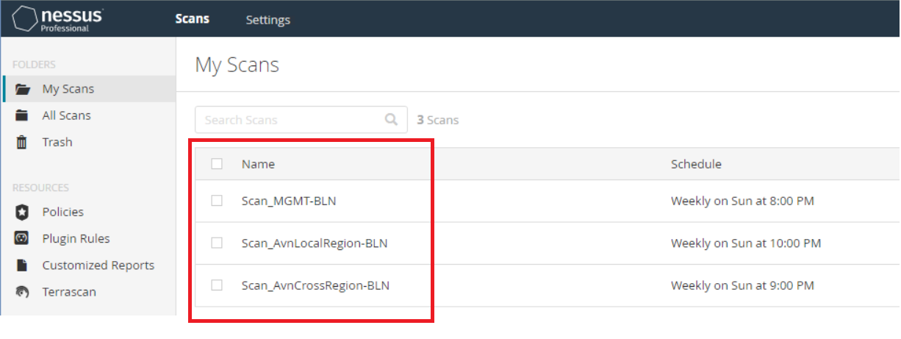
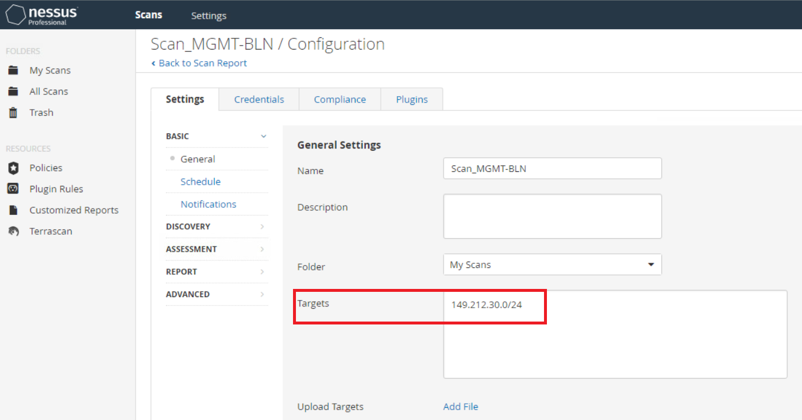
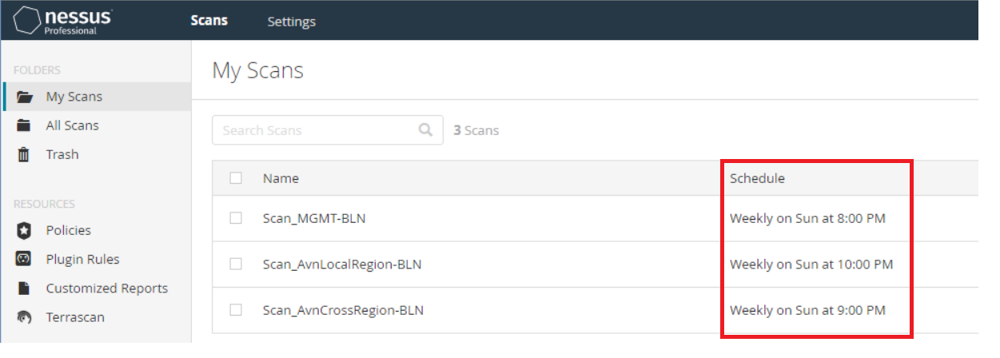
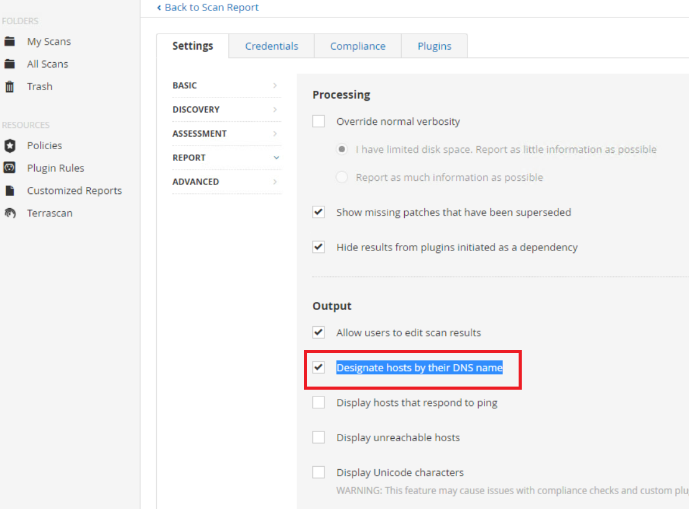
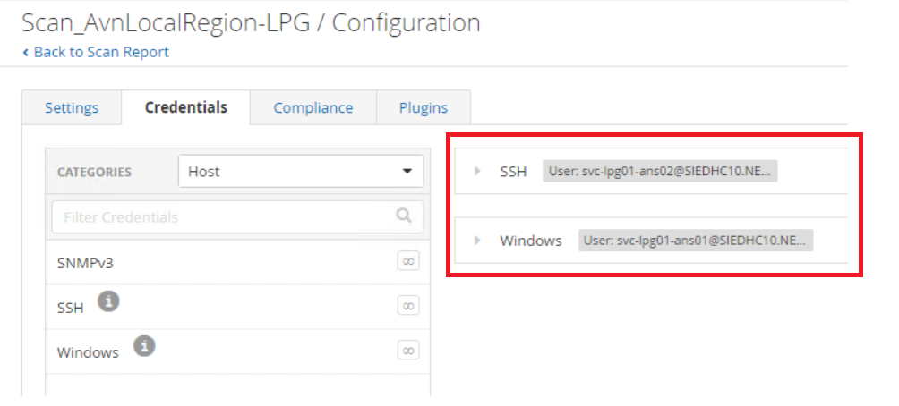
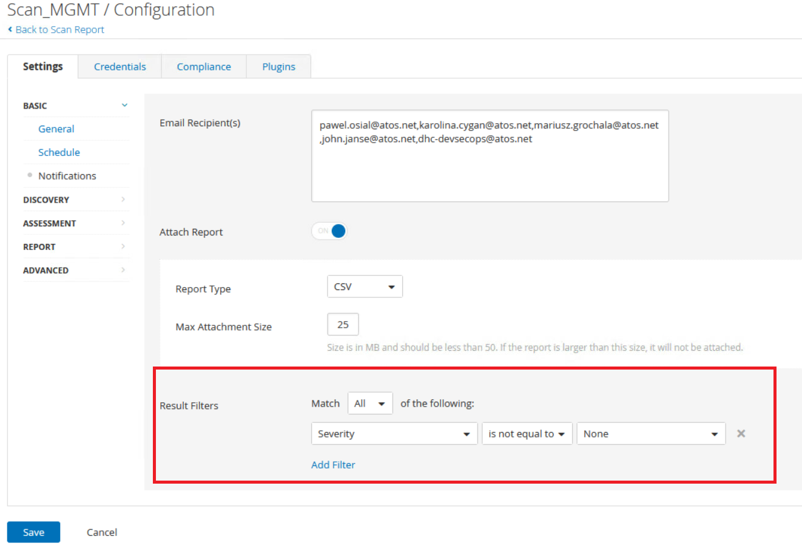
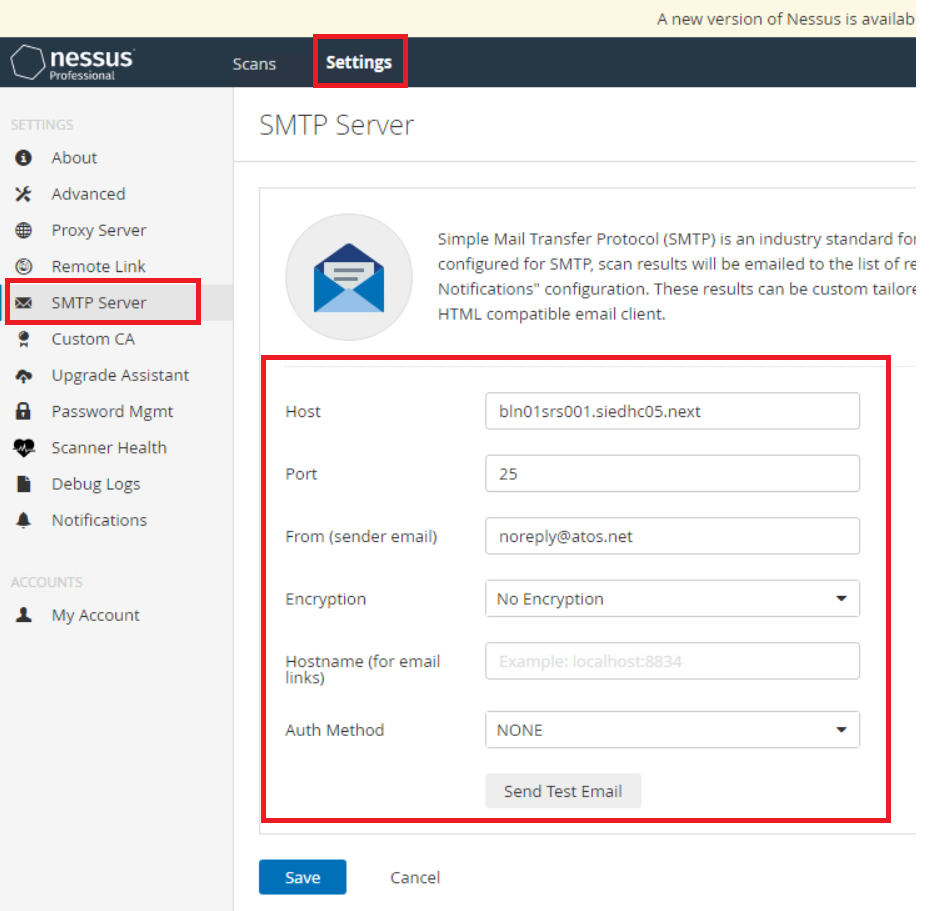

# Nessus Scan

# Table of Contents

- [Nessus Scan](#nessus-scan)
- [Table of Contents](#table-of-contents)
- [Changelog](#changelog)
  - [Introduction](#introduction)
    - [Audience](#audience)
  - [Nessus Report Config Steps](#nessus-report-config-steps)
    - [Check scans configuration](#check-scans-configuration)
    - [Configure proper scan credentials](#configure-proper-scan-credentials)
    - [Set up report delivery](#set-up-report-delivery)

# Changelog

| Version | Date       | Description      | Author       |
| ------- | ---------- | ---------------- | -------------|
| 0.1     | 24.08.2023 | Initial version    | Piotr Gesikowski |
| 0.2     | 24.04.2026 | Update License Key | Kanchan Pardeshi |

## Introduction

Validate proper presence of Nessus scans and add report delivery to the proper recipients.

### Audience

VCS DevSecOps

## Nessus Report Config Steps

### Check scans configuration

1. Verify if the Nessus scans were created with proper network and name.
  Go to **Scans -> My Scans** and you should see 3 scans with added location name:

  ```text
  - "Scan_MGMT"
  - "Scan_AvnLocalRegion"
  - "Scan_AvnCrossRegion"
   ```

  
2. Go to each **Scan -> Configure -> Settings -> Basic** and validate if each scan has proper subnet assigned:
  
3. Go to **Scans -> My Scans** and verify if scans have right time window scheduled:
  
4. Go to each **Scan -> Configure -> Settings -> Report** and verify the DNS option is enabled:
  

### Configure proper scan credentials

1. Run playbook **configureNessusCredScan.yml** (in manage phase)
2. Go to each **Scan -> Configure -> Credentials -> Host** and find newly added credentials under **SSH** and **Windows**:
  

### Set up report delivery

1. Run playbook **cronMailNessusReports.yml** (in manage phase)
2. In each scan add manually a result filter. Delivered report ignores findings with **severity=None** which makes report smaller and more readable to Vulnerability Management:
  
3. Go to **Settings -> SMTP Server** and make sure SMTP server is properly configured for sending scan results:
  

### Updating Nessus License Key

To update the Nessus license key, run the following command:

```shell
/opt/nessus/sbin/nessuscli fetch --register-only {{ nessusActivationKey }}
```

This command will update the Nessus activation key on the server.
Note: Replace {{ nessusActivationKey }} with the valid Nessus license key.
