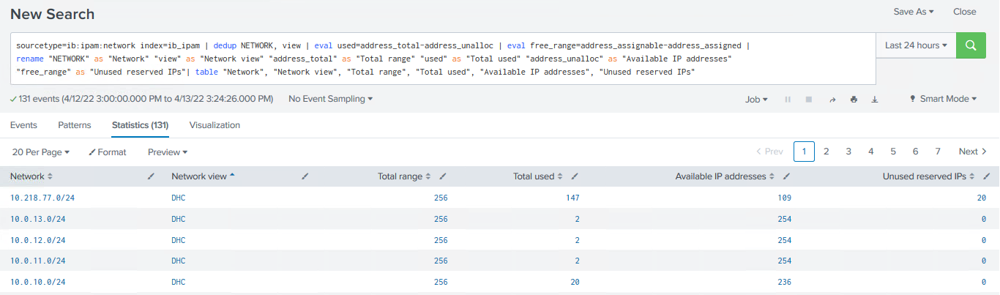
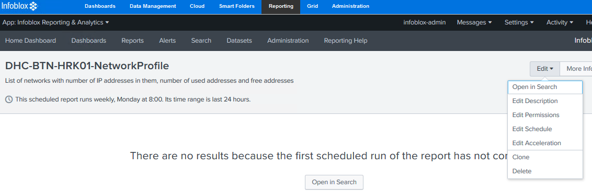

# Table of Contents

<!-- TOC -->
- [Table of Contents](#table-of-contents)
- [List of Changes](#list-of-changes)
  - [Introduction](#introduction)
    - [Purpose](#purpose)
    - [Audience](#audience)
    - [Scope](#scope)
- [Related Documents](#related-documents)
- [Setting up Network Capacity Report in Infoblox](#setting-up-network-capacity-report-in-infoblox)

<!-- TOC -->

# List of Changes
  
| Version | Date       | Description      | Author       |
| ------- | ---------- | ---------------- | -------------|
| 0.1     | 11.10.2021 | First version    | Adam Szymczak |
| 0.2     | 14.04.2022 | Added Unused reserved IPs column to report | Adam Szymczak |

## Introduction

### Purpose

Set up Network Capacity report generation in Infoblox.

### Audience

- VCS Operations

### Scope

1. Setting up Network Capacity Report in Infoblox

# Related Documents

N/A

# Setting up Network Capacity Report in Infoblox

1) Log in to **Infoblox Grid Manager** using admin credentials
2) Enter the **Reporting** tab (If the tab is not visible please install Infoblox Reporting appliance and add it to the grid, this process is described in Infoblox documentation in article "Installing the NIOS Virtual or Reporting Virtual Appliance")
3) Then enter **Search** tab and in window that appears type the following query (make sure that names in quotes are not spread between two lines to avoid column names in report being put in two lines)

   ```python
   sourcetype=ib:ipam:network index=ib_ipam | dedup NETWORK, view | eval used=address_total-address_unalloc | eval free_range=address_assignable-address_assigned | rename "NETWORK" as "Network" "view" as "Network view" "address_total" as "Total range" "used" as "Total used" "address_unalloc" as "Available IP addresses" "free_range" as "Unused reserved IPs"| table "Network", "Network view", "Total range", "Total used", "Available IP addresses", "Unused reserved IPs"
   ```

4) Confirm that query returns list of networks in environment with number of addresses allocated

   

5) In top right corner select **Save As** and in dropdown that appears **Report**
6) In window that appears pick a name for Network Capacity report and click **Save** (the name for report should follow the format: DHC-{ customerCode }-{ locationCode }-NetworkProfile like shown on picture below)
7) After saving the report pick **Schedule** from additional settings list (this setting can also be accessed in **Reports** tab in **Edit** menu of report)

   

8) Tick **Schedule Report** and pick how often it should be generated (by default the report should be sent out every Monday), then click **Next**
9) In next window select **Send Email** option and fill out the form that appears, the form includes who will receive the email and what will be its contents (the report should be sent to team supporting the environment from Atos side and people responsible for monitoring network capacity - it can be the supporting team or Capacity Mangement)
10) After filling out the form click **Save**, make sure that email settings are configured correctly in **Server settings** that are found in **Settings** menu on top of the screen (the mail server should be set to **srs001** machine as default)
