# NSX Application Platform Deployment

## Table of Contents

- [NSX Application Platform Deployment](#nsx-application-platform-deployment)
  - [Table of Contents](#table-of-contents)
  - [List of Changes](#list-of-changes)
  - [Introduction](#introduction)
    - [Purpose](#purpose)
    - [Audience](#audience)
    - [Scope](#scope)
  - [Prerequisites](#prerequisites)
    - [NSX Application Platform Infrastructure Requirements](#nsx-application-platform-infrastructure-requirements)
    - [NSX Application Platform System Requirements](#nsx-application-platform-system-requirements)
    - [TKG Post Deployment Steps](#tkg-post-deployment-steps)
    - [AD Integration](#ad-integration)
  - [Instructions](#instructions)
  - [RBAC](#rbac)
  - [Deploy the NSX Application Platform](#deploy-the-nsx-application-platform)
    - [Procedure](#procedure)
- [NAPP Activation](#napp-activation)
  - [How to Activate](#how-to-activate)
  - [Prechecks](#prechecks)

## List of Changes

| Version | Date       | Author       | Issue    | Changes           |
|---------|------------|--------------|----------|-------------------|
| 0.1     | 14.12.2023 | Adrian Baciu | VCS-11599| Document creation |
| 0.2     | 29.12.2023 | Aroop Sethi  | VCS-11712| Deployment of NSX Intelligence Appliance and NAPP Activation |
| 0.3     | 10.01.2024 | Aroop Sethi  | VCS-11785| TKGs deployment, Customer AD integration (via vIDM),RBAC |

## Introduction

### Purpose

The Purpose of the document is to understand the prerequisite or requirements for the deployment of NSX Application Platform.

### Audience

This document is intended for Atos Cloud Services Engineers and Architects responsible for implementing NSX Application Platform Deployment in DHC.

### Scope

This document covers NSX Application Platform deployment instructions.

## Prerequisites

### NSX Application Platform Infrastructure Requirements

- NSX-T Datacenter running version 3.2.3.1 or newer.
- If you have VCF installed, you can upgrade NSX-T using the Async Patch Tool approach as described in the [link](https://kb.vmware.com/s/article/88287)
- A minimum of one NSX Manager with vSphere HA enabled on the underlying cluster is required for evaluations. For a production environment, deploying a management cluster of three NSX Managers is recommended.
- To deploy the NSX Application Platform, you must have a valid, non-expired NSX license of one of the following types:
  1. NSX Data Center/NSX-T Enterprise Plus
  2. NSX Data Center/NSX-T Advanced with NSX ATP
  3. NSX Data Center/NSX-T Advanced with NSX TP
  4. NSX Security (Distributed Firewall or Gateway Firewall), NSX Evaluation.
- vSphere 7.0U3f or newer (vCenter Server and ESXi Hypervisor). You will also need a target vSphere Cluster with sufficient resources to meet the NAPP System Requirements. As NAPP is an extension of the NSX solution, a Management or Shared Cluster is typically used to meet this requirement.
- A supported microservices environment for NSX Application Platform. This document covers the required configuration steps for the microservices environment and the NAPP Automation Appliance will perform end-to-end deployment, so you do not need the microservices environment in advance, but you will need to ensure that the infrastructure is compatible with the listed versions. VMware supports and validates NAPP on the following solutions:
  1. vSphere with Tanzu (TKGs)
  2. NSX 3.2: v1.17.17 to v1.21.6
  3. NSX 4.0: v1.20.7 to 1.22.9
  4. NSX 4.1: v1.22.9 to 1.24.9.
  5. Note: It is recommended to use a Tanzu Kubernetes Release of version 1.20.7 or newer for important fixes and enhancements.
  6. Upstream Kubernetes
  7. NSX 3.2: v1.17 to v1.21
  8. NSX 4.0: v1.20 to v1.24
  9. NSX 4.1: v1.22 to 1.24.
  10. Other Kubernetes distributions that have not been officially validated and are therefore unsupported by VMware.
- Ability to add a fully qualified domain name (FQDN) in DNS. This is required during the NSX Application Platform deployment to create Service Names which are the API and messaging endpoints used to connect to the NSX Application Platform.
- Network connectivity between your microservices environment and NSX Manager/vCenter.
- Time synchronized between NSX, vSphere and your Kubernetes environments.
- A system which can be used to run the required tools to bootstrap your environment. This should be a supported Windows, MacOS, or Linux operating system for accessing the vSphere Web Client, NSX-T Datacenter and NSX Intelligence UIs and also support Kubernetes tools.
- As per the VMware recommendation, We used the internet based option. In case if not able to setup internet then setup the private harbor registry. Please follow the [link](https://docs.vmware.com/en/VMware-NSX-T-Data-Center/3.2/nsx-application-platform/GUID-FAC9DBE3-A8EE-4891-A723-942D0AB679F6.html#GUID-FAC9DBE3-A8EE-4891-A723-942D0AB679F6).

### NSX Application Platform System Requirements

- There are several form factors for NSX Application Platform dependent on the features you plan to enable. Resource requirements and supported features for each form factor are listed below. Please ensure your target vSphere Cluster has sufficient capacity for the selected form factor. Standard and Evaluation Form Factors do not support scale-out at present. Control Plane nodes are required for production deployments. Also, the Evaluation form factor is currently only supported for use in non-production deployments (POC evaluations or demonstrations). It has limited data retention, no high availability support, and no support for upgrades.
- If you are deploying the NSX Application Platform on TKGs, the control plane and worker nodes for the guest cluster will require an additional storage volume of **64GB** for ephemeral storage. The deployment guide will cover the steps required to provide this storage volume.

### TKG Post Deployment Steps

- (Optional) If you do not have the tanzu environment so you can refer the [document](https://github.com/GLB-CES-PrivateCloud/DHC-Documentation/blob/develop/workInstructions/wiVsphereWithTanzuBuildGuide.md) and follow the Post Deployment Steps for the existing one.

### AD Integration

Different methods to integrate AD with NSX-T for NAPP.

**First Method:**

- Direct integration of AD with the NSX-T Appliance.

| Steps                                    | Screenshots                              |
| ---------------------------------------- | ---------------------------------------- |
| 1. Login to NSX-T Appliance.  2. Go to “System” tab.  3. In the left-hand side plane, you have an option “User Management.”  4. Click on “User Management” | 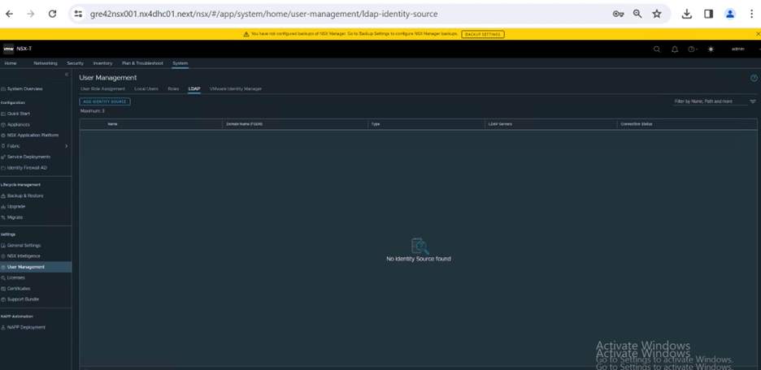 |
| 5. You can see an option called “LDAP”.  6. Click on “ADD IDENTITY SOURCE” | 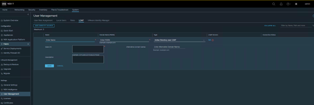 |
| 7. Enter all the required details.  Choose “Active Directory over LDAP” **Name:** NAME OF THE AD CONNECTION IN NSX-T **FQDN:** AD Servers FQDN **Base DN:** CN=Users,DC=Corp,DC=local | 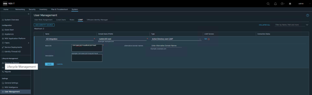 |
| 8. We will have to set the Server details in “Set” | 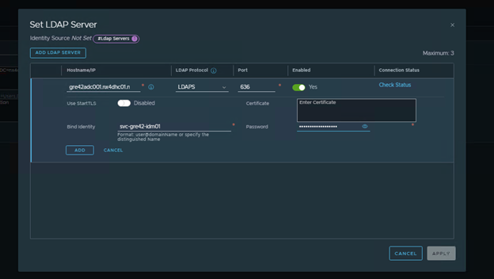 |  
| 9. Accept the certificate and click on “Add”.   **NOTE:** It should show enabled once it is “Added”. | 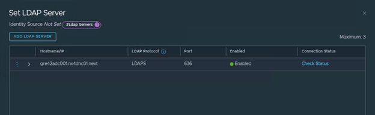 |
| 10. Upon addition of the server details you can “SAVE” the form. And it will get added successfully. | 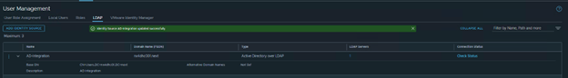 |

**Second Method:**

- Integrating the Active Directory through vIDM
- If we have vIDM setup already done, then we can use it to integrate AD to the NSX-T Appliance.

| Steps                                    | Screenshots                              |
| ---------------------------------------- | ---------------------------------------- |
| 1. Login to vIDM as admin and go to “Identity & Access Management.” | 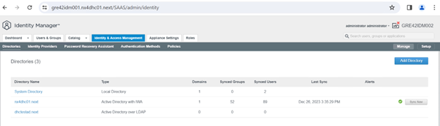 |
| 2. Click on “Add Directory” | 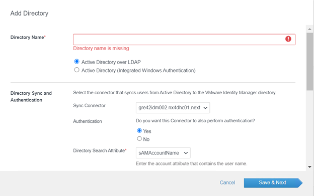 |
| 3. Fill in all the relevant details.  4. You can choose either “AD Over LDAP” or AD “IWE” | 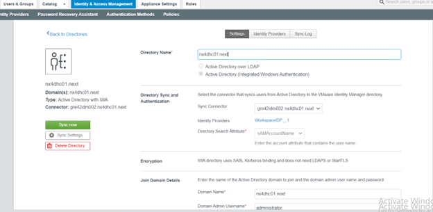 |
| 5. Always use a Service Account for the Integration. | 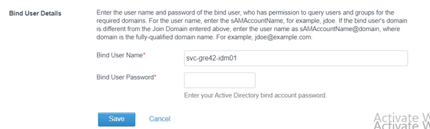 |
| 6. Post validation of Username and Password “Save” the AD integration in vIDM.  7. It should be visible in Directories section. | 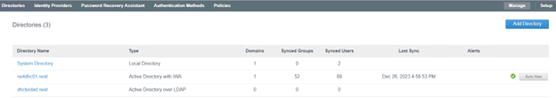 |
| 8. Now login to NSX-T Appliance and go to “System.”  9. System  User Management  VMware Identity Manager | 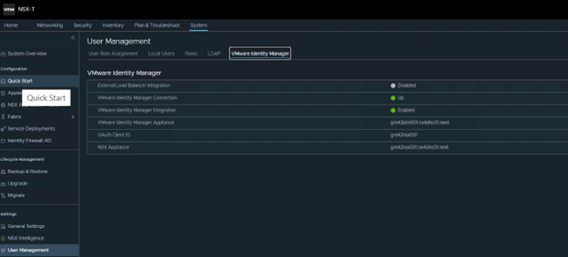 |
| 10. Add the relevant vIDM details. | 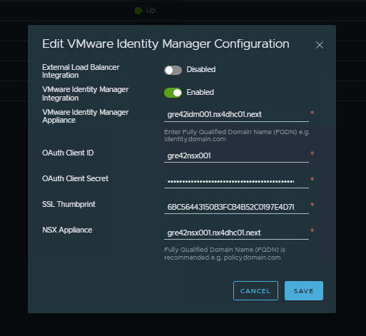 |
| 11. Once saved vIDM will be integrated to the NSX-T Appliance.   **Verification:**   Navigate to System - “User Management” - “User Role Assignment.”  Click on “ADD” - “Role Assignment for vIDM”  You should be able to add the AD accounts now and assign proper roles to it. | 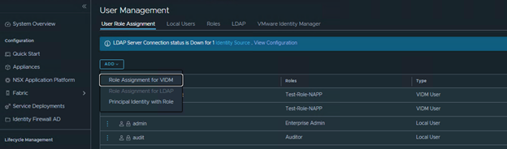 |

**NOTE**

You can also use/connect LDAP to the NSX Appliance. You can fill in the LDAP server details and test connection. Login to NSX-T - System - User Management - LDAP - Add Identity Source Choose “Open LDAP”

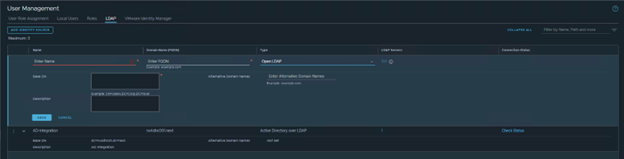

Once all the details are filled and verified click on SAVE. It should be ready to use now.

## Instructions

1. Verify that you have satisfied all requirements listed in the NSX Application Platform System Requirements section of this Deployment Guide. Also, ensure you have a valid kubeconfig file for the correct context. Note: If you are referring to the public documentation on vmware.com, you can ignore any references to a Private Harbor registry (if they are listed) as we will use the VMware Public Distribution Harbor instance for our deployment. The documentation should be updated by the time you are viewing this guide. Note: You will also need the ability to add a DNS record for the NAPP Service Name and Messaging Name.
2. Deploy an NSX-T Data Center 3.2.3.1 or newer unified appliance and ensure there is IP connectivity between the Manager and your K8s environment. Your NSX-T Manager can be either a standalone or clustered deployment, although as mentioned in the prerequisites, clustered is recommended for production. It is important to note that all NAPP Deployment, Lifecycle Management, and Monitoring steps are performed via the NSX-T Manager. After the underlying cluster infrastructure is provided, no knowledge of microservices application provisioning or operations is required to run NAPP.
3. Once your NSX Manager has been provisioned, powered on, and an appropriate license applied, you are now ready to start the NAPP deployment. Log in to NSX-T Manager and navigate to System -> NSX Application Platform.
4. The first screen in the NAPP deployment workflow is Prepare to Deploy. Here you are prompted to provide the Helm Repository and Docker Registry hosting NAPP charts and images. Note: It is strongly recommended to use the VMware

## RBAC

***NOTE: As per the VMware update till today, The NSX Intelligence feature recognizes the following built-in roles. You can create any new roles but NSX Intelligence feature does not support those custom RBAC.***. Please refer the [Document](https://docs.vmware.com/en/VMware-NSX-Intelligence/4.1/user-guide/GUID-4040CA65-5F32-49C5-A88F-61599EA36477.html).

We can add users to the below groups as per the requirement:

| Group Name                               | Description                              |
| ---------------------------------------- | ---------------------------------------- |
| rsce-{locationCode}-nsx-l-auditors       | Location-specific Resource Group for Auditor access to NSX (Read Only) |
| rsce-{locationCode}-nsx-l-enterpriseadmins | Location-specific Resource Group for Enterprise Admin access to NSX (Full Access)|

## Deploy the NSX Application Platform

After you have an NSX-T Data Center version 3.2.3.1 or later installed and all the deployment prerequisites are met, you can proceed to deploy the NSX Application Platform.

### Procedure

| Steps                                    | Screenshots                              |
| ---------------------------------------- | ---------------------------------------- |
| 1. Firstly, We need to create VM class as per prerequisite. | 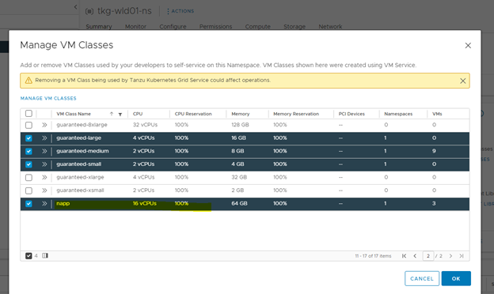 |
| 2. Then, deploy the cluster according to yaml and add volume details to the yaml file. | 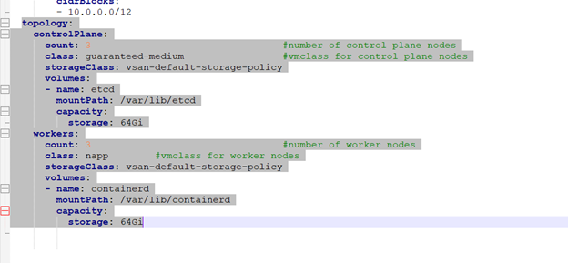 |
| 3. Created new TKG cluster using YAML file.   Login to vsphere and run the command **kubectl create -f <File.yaml>** it will create a fresh cluster. Once deployed, You can recheck the details by running the command **kubectl get tkc tkgs-cluster-01 -o yaml** as specified in the screenshot. | 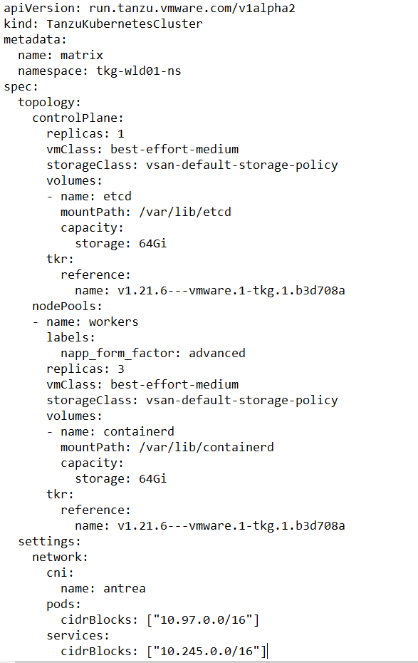 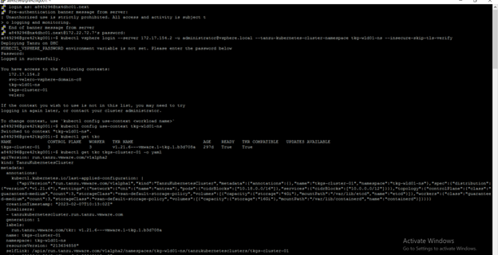 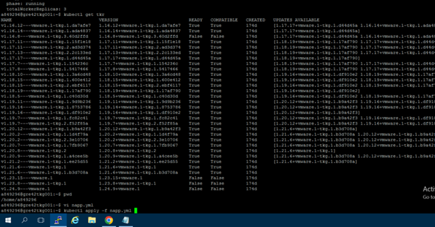 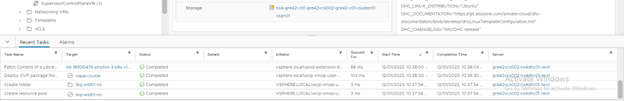 |
| 4. From your browser, log in with Enterprise Admin privileges to an NSX Manager.  5. Navigate to System > NSX Application Platform in the Configuration section.  6. Click **Deploy** NSX Application Platform.  7. Verify the **Helm Repository URL** and **Docker Registry path.**  8. Click Save URL. (**NOTE:** This step might take some time to complete as the system gathers the NSX Application Platform details from the Helm charts and Docker registry locations.) | 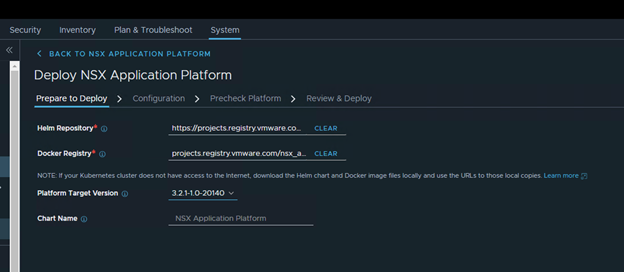 |
| 9. In the Platform Target Version text box, verify that the correct NSX Application Platform version is selected for the deployment. (**NOTE:** The system derives the list of versions from the Helm repository.)  10. Click NEXT | 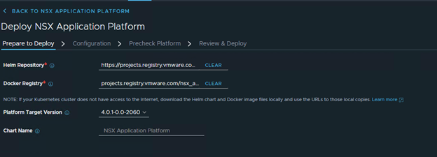 |
| 11. Need to generate the **kubeconfig File**, so need to login to jumpbox.  12. Use the command below to log into the **Tanzu Cluster** created  **kubectl vsphere login --server 172.17.154.2 -u `administrator@vsphere.local` --tanzu-kubernetes-cluster-name tkgs-cluster-01 --tanzu-kubernetes-cluster-namespace tkg-wld01-ns --insecure-skip-tls-verify**  13. Issue the following commands to create an **administrator service account** and **cluster role binding.** It is prefered to run each commands individually.  kubectl create serviceaccount napp-admin -n kube-system kubectl create clusterrolebinding napp-admin --serviceaccount=kube-system:napp-admin --clusterrole=cluster-admin | 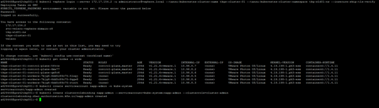 |
| 14. Make the necessary adjustments according to the VMware [documentation](https://docs.vmware.com/en/VMware-NSX/4.1/nsx-application-platform/GUID-52A52C0B-9575-43B6-ADE2-E8640E22C29F.html). Obtain the authentication token for the administrator service account and the cluster certificate authority, run the following commands separately. For supported Kubernetes versions prior to version **1.24**, use the following commands.  SECRET=$(kubectl get serviceaccount napp-admin -n kube-system -ojsonpath='{.secrets[].name}') TOKEN=$(kubectl get secret $SECRET -n kube-system -ojsonpath='{.data.token}' &#124; base64 -d) kubectl get secrets $SECRET -n kube-system -o jsonpath='{.data.ca\.crt}' &#124; base64 -d > ./ca.crt   | 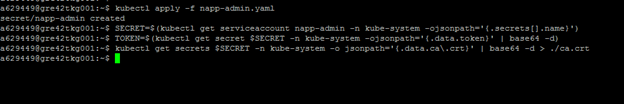 |
| 15. Run the commands below to obtain the Tanzu cluster URL. Once again, run these commands individually.  CONTEXT=$(kubectl config view -o jsonpath='{.current-context}') CLUSTER=$(kubectl config view -o jsonpath='{.contexts[?(@.name == "'"$CONTEXT"'")].context.cluster}') URL=$(kubectl config view -o jsonpath='{.clusters[?(@.name == "'"$CLUSTER"'")].cluster.server}') | 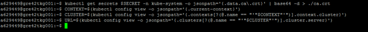 |
| 16. This step generates the **kubeconfig file**, the filename is your choice.  TO_BE_CREATED_KUBECONFIG_FILE="&lt;file-name&gt;" kubectl config --kubeconfig=$TO_BE_CREATED_KUBECONFIG_FILE set-cluster $CLUSTER --server=$URL --certificate-authority=./ca.crt --embed-certs=true kubectl config --kubeconfig=$TO_BE_CREATED_KUBECONFIG_FILE set-credentials napp-admin --token=$TOKEN kubectl config --kubeconfig=$TO_BE_CREATED_KUBECONFIG_FILE set-context $CONTEXT --cluster=$CLUSTER --user=napp-admin kubectl config --kubeconfig=$TO_BE_CREATED_KUBECONFIG_FILE use-context $CONTEXT | 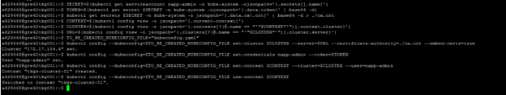 |
| 17. The file should now exist in the current working directory. Transfer this file to your desktop, we will need to upload it in the following section. | 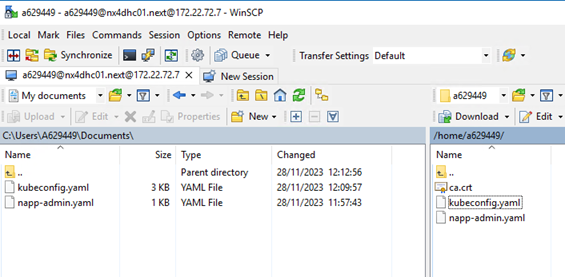 |
| 18. We have the generated the **kubeconfig File**, Under Configuration Tab, In the Upload file text box, click Select and navigate to the location of the kubeconfig file  19. Click Upload. **NOTE:** This step can take some time to complete while the system verifies the Kubernetes configuration file contents.  20. Verify the **Cluster Type** information is correct. This information refers to the type of Kubernetes environment. Currently, **Standard** is the only type supported.  21. Verify the **Storage Class** information is correct. The system obtains the storage class values from the Kubernetes configuration file and makes them available in the drop-down menu.  22. Enter a valid fully qualified domain name (FQDN) value for the **Interface Service Name** text box in an NSX-T Data Center. Value taken in the Screenshot is **napp-svc.`<customerCode>`dhc`<dhcInstance>`.next**  23. For an NSX-T Data Center , enter a valid FQDN value for the **Messaging Service Name** text box. Value taken in the Screenshot is **napp-msg-svc.`<customerCode>`dhc`<dhcInstance>`.next**   24. Need to register the DNS Entries for the available IPs as specified in the screenshot.   | 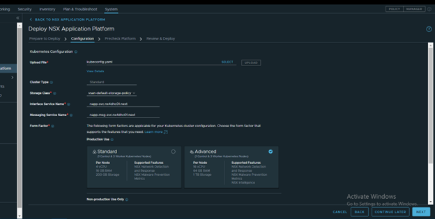 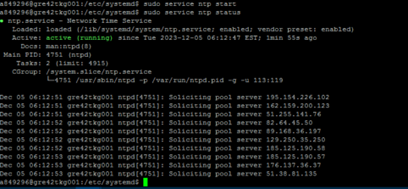 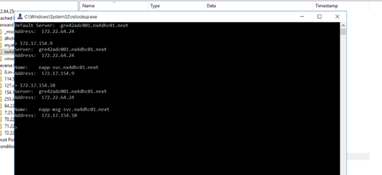 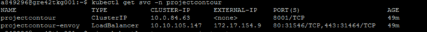 |
| 25. In the **Precheck Platform tab**, click **Run Prechecks**. The system displays the progress status for each precheck performed.  **NOTE:** If there are any errors displayed in the Details column, click the link provided for the error. Obtain the details and make the necessary corrections to resolve the reported errors. See [Troubleshooting Issues with the NSX Application Platform](https://docs.vmware.com/en/VMware-NSX-T-Data-Center/3.2/nsx-application-platform/GUID-2C1A9FA8-E45C-4640-99E3-865CD00A0D73.html#GUID-2C1A9FA8-E45C-4640-99E3-865CD00A0D73) for more information.  26. As there is no Error, Hit NEXT. | 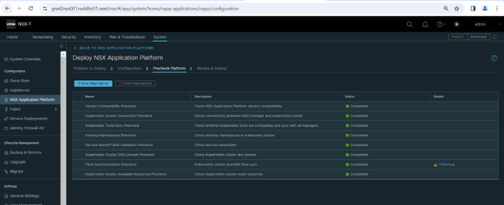 |
|27. In the **Review & Deploy tab**, review the information displayed in the Platform, Configuration and Prechecks sections. Click the **Edit** link for the corresponding section where changes are needed. When you click Edit, you are taken back to the tab where you can update the information.  28. If all the information looks correct, click **Deploy**. The system proceeds with the final deployment steps and provides progress information in the UI. The steps can take some time to complete. | 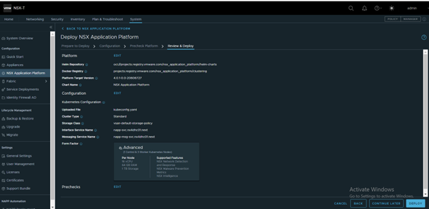 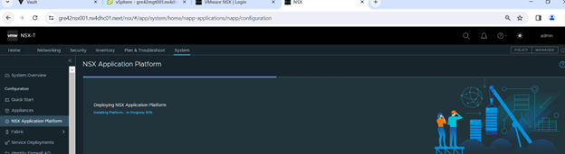 |

NOTE: You can also refer to the [Document](files/NSXAppliancePlatform/NSXIntelligenceandNAPPDeploymentandPOCguidev0.18.pdf) for deployment of NSX Applcation Platform

## NAPP Activation

NAPP is native analytics engine for  1. traffic flow visibility 2. Firewall policy recommendation 3. Suspicious traffic flow

### How to Activate

Login to NSX -> System --> NSX Application Platform  -> Features --> NSX Intelligence --> Run Precheck

### Prechecks

Advanced features License check
NSX License Validation
NSX Transport Node Limit
NSX Application Platform Form Factor

| Checks                                   | Screenshots                              |
| ---------------------------------------- | ---------------------------------------- |
| 1. Once the pre-check are completed you can start the Activation. As soon as you activate the NAPP intelligence you will see an output saying performance is degraded. | 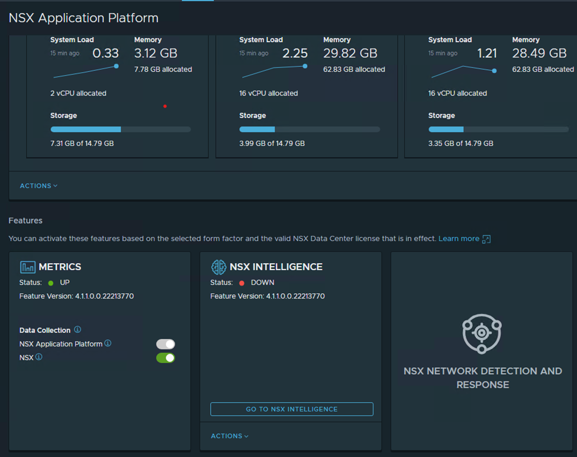 |
| 2. Wait for 10 mins it will go to healthy state. If not please follow the below [document](https://docs.vmware.com/en/VMware-NSX-Intelligence/4.1/user-guide/GUID-2062D621-FD14-45C6-B758-5EAB94EDC115.html). | 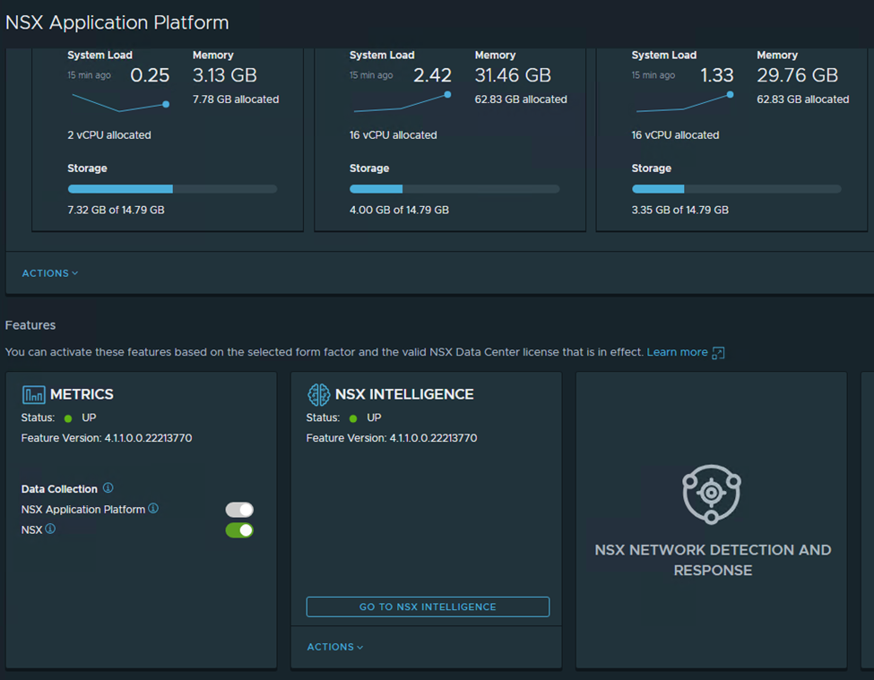 |
| 3. **Need to be checked:**   License Network Traffic Analysis (NTA) will not be enabled due to a missing entitlement. You can enable this feature later by installing an applicable license | 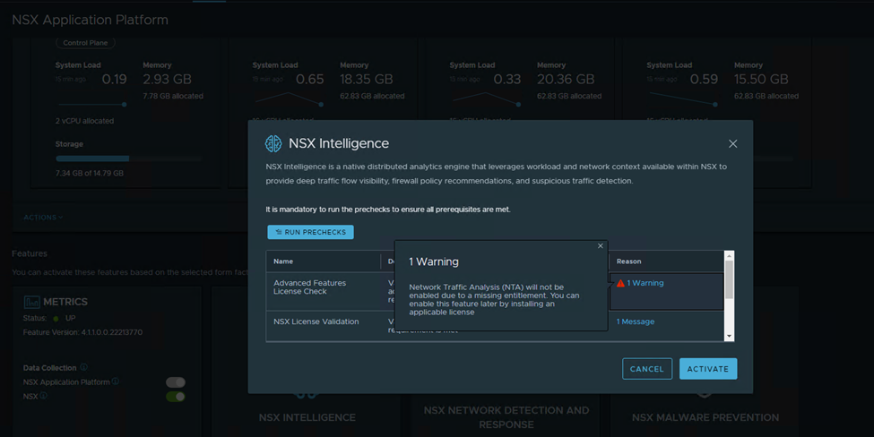 |
| 4. Once Activated it will start Analyzing the Network traffic. | 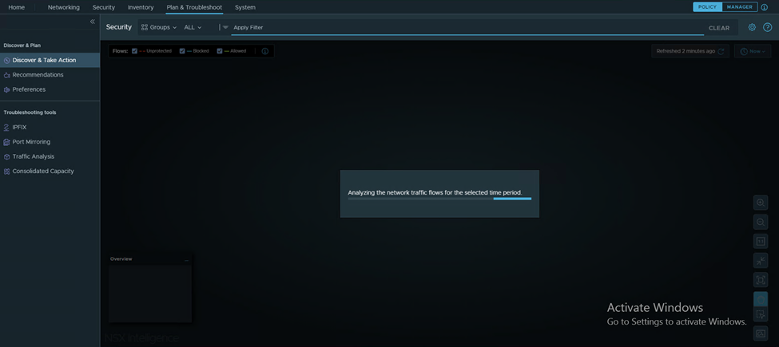 |
| 5. Final Output | 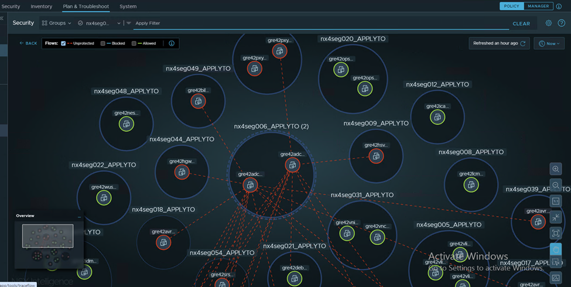 |
