# NSX-T Identity Firewall

## Changelog

| Version | Date | Author | Changes |
|---------|------|------|---------|
| 0.1 | 17.05.2024 | Michal Pindych | Document creation |
| 0.2 | 20.05.2024 | Michal Pindych | Adding the section regarding AD log event scrapping |
| 0.3 | 13.06.2024 | Michal Pindych | Updating documentation after demo and official statement from Vmware |
| 0.4 | 1.10.2024 | Michal Pindych | TOS testing and validation |

## Introduction

An Identity Firewall (IDFW) in NSX-T  is a security feature that enhances traditional firewalls by incorporating user identity information into the firewall rules.
This allows for more granular control and context-aware security policies based on user or group identities rather than just IP addresses, subnets, or ports.

Key Features:

- NSX-T can integrate with Microsoft Active Directory to fetch user and group information. This enables the firewall to recognize and apply policies based on these identities.
- Firewall rules can be defined for specific users or user groups. For example, only members of the "Finance" group can access financial applications.
- As users log in and out, or change roles, the firewall policies dynamically adjust based on their current identity and group memberships.
- The identity firewall tracks user sessions, ensuring that policies are enforced correctly throughout a user's session.
- User identity can be used as source only and not at the destination in firewall rule.
- NSX Manager supports from 2 (medium deployment ) to 8 (large deployment) different Active Directory Domains.
  
It is possible to gather information about user login attempts from from these sources:

- VM tools ( Guest Introspection )
- AD log event scraping
- Third-parties devices (like VPN's) using Log Insight integration
  
Use case where the identity firewall suites best is environment where we are using protocols like:

- VDI sessions (single-user session support)
- RDSH (multi-user session support)
  
IDFW use case scenario for VCS platform:

Identity firewall suits best in environments where there is Remote Desktop Service on specific version of Windows OS from which is required to centrally manage access to customer environment.
Windows Terminal Server farm servs as a central hopping point to customer resources.  Terminal server farm is the only way to get into the environment and further onwards to customer Servers (e.g via SSH or DRP).
In configuration where Remote Desktop Service is running on supported Windows OS and Guest Introspection drivers are enabled on VM -  multiple users can be logged on to terminal server farm at the same time, end every single of them can have a dedicated ruleset.

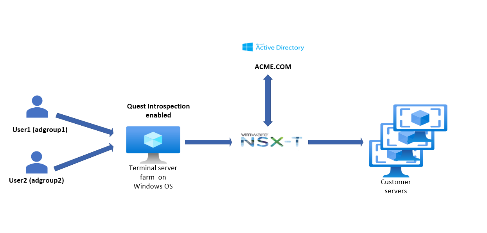

In this scenario when network event is generated by a user, a guest introspection agent send required infroamtion (for example secure identifire from AD) to the NSX Manager.
NSX manager can make decisions based on operating system level information from which user traffic should be allowed or blocked.

### Purpose

The purpose of this WI is to explain how to enable Identity firewall for customer workload and how to use and troubleshoot this feature on VCS platform.

### Audience

- VCS Engineers
- VCS Architects

### Scope

This document covers the following topics

- Enablement NSX-T identity firewall
- Creating an identity based firewall rules in NSX
- Enable AD log event scraping
- Enable NSX Identity Firewall integration with Log Insight
- Identity firewall basic troubleshooting (based on VMtools)

### Related Documents

Please refer also to these documentation regarding identity firewall for more information:

| LLD              | Link |
| -------------------------- |--------------- |
| lldSoftwareDefinedNetworks.md | [VCS Software Defined Network LLD](../design/lldSoftwareDefinedNetworks.md) |
| Identity Firewall Workflow (NSX-T 4.1) | [IDFW configuration guide](https://docs.vmware.com/en/VMware-NSX/4.1/administration/GUID-F15C4916-CEBF-47A0-A6A8-64428190B08D.html) |
| Identity Firewall Maximus (NSX-T 4.1) | [VMware NSX-T Maximus](https://configmax.esp.vmware.com/guest?vmwareproduct=VMware%20NSX&release=NSX%204.1.0&categories=19-47) |

## Configuration Steps

### Know limitations

Gi - Guest Introspection
ADls - AD log scrapping

| Limitations/Guidances              | Description  |
| -------------------------- |--------------- |
| Linux OS support                             | Linux OS are not supported at all for IDFW (both for Gi and ADls  ) |
| Gi/ADls concurrent configuration             | Gi and ADls can be used together but is not recommended. Gi will take precedence for VMs over ADls as it is faster. ADls should be used for physical server use case and rules should be applied to destination VM in NSX |
| ICMP protocol support                        | ICMP in IDFW does not work as expected. Only TCP and UDP is supported in IDFW                                                         |
| Multi-user environment support               | For supporting multi-user environment the following requirements must be met : supported Windows OS, Quest introspection drivers enabled for source server, RDHS (terminal service) enabled, properly configured firewall rules (including source and destination ESX hosts)                                                          |
| ADls and multi-users environment              | ADls doesn't work with multi-user as the config gets overwritten by a last log in user. Only Gi should be used for multi-user.        |
| IDFW traffic for Gi                          | It is required to deploy IDFW rules on both source ESX (using AD group membership ) and on destination ESX (using standard approach ) |

### Enablement NSX-T identity firewall

Please refer to all steps required to enable IDFW on NSX-T

| Steps              | Picture |
| -------------------------- |--------------- |
| 1. Configure Active Directory domain in NSX-T    <b>System -> Identity Firewall AD -> ADD Active Directory <b> | 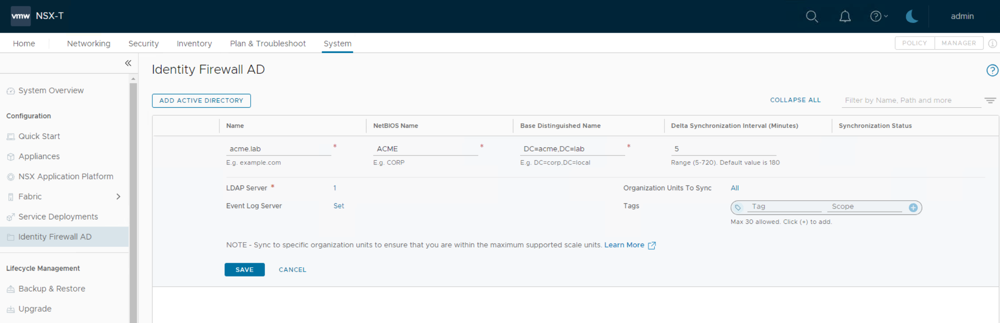 |
| 2. Adding LDAPS server (in the same tab as above)   | 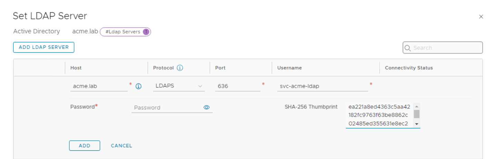 |
| 3. Enable the IDF firewall on NSX-T manager       <b>Security -> Distributed Firewall ->  Actions -> General Settings -> General Firewall Settings</b> | 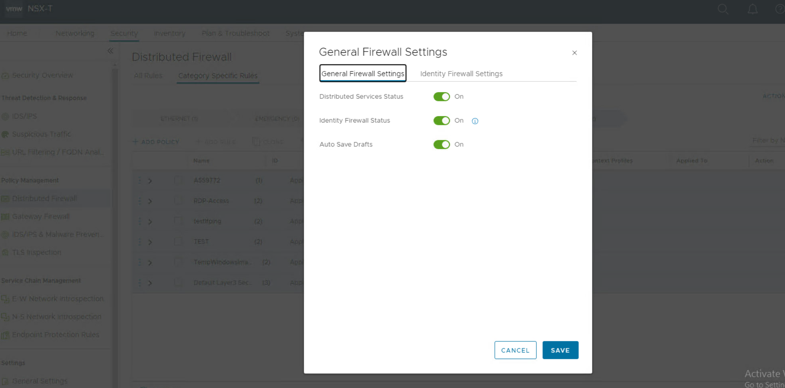 |
| 4. Enable the IDF firewall on specific Vcenter Cluster        <b>Security -> Distributed Firewall ->  Actions -> General Settings ->  Identity Firewall Settings </b> | 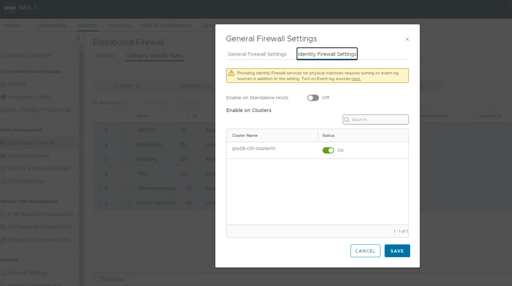 |

### Creating an identity based firewall rules in NSX

The process of creating an identity-based firewall rule is the same as creating a normal firewall rule.
Except that the source group is filled with an Active Directory group.

| Steps              | Picture |
| -------------------------- |--------------- |
| 1. Create a security group on NSX-T with an active directory group as member    <b> Inventory -> Groups -> Add Group </b> |      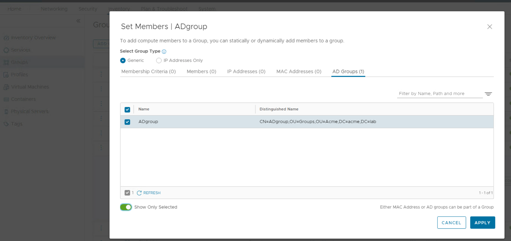  |
| 2. Create a firewall rule using above security group (as a source of traffic )    <b> Security -> Distributed Firewall -> Add Rule  </b>   | 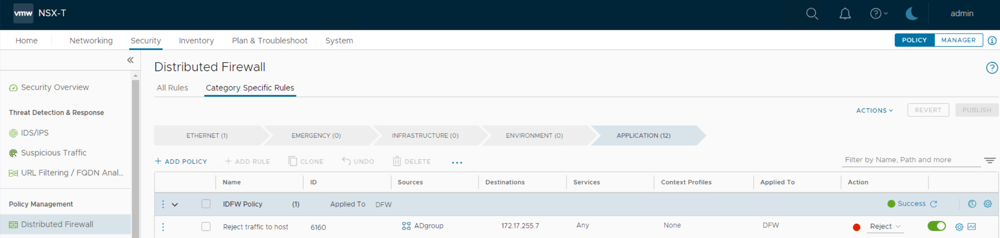 |

### Enable AD log event scraping

AD log event scraping is a useful tool in case when we can't use Guest Introspection - for example for physical servers not hosted on Vcenter.
Please refer to these steps to enable AD log event scraping.

| Steps              | Picture |
| -------------------------- |--------------- |
| 1. Configure Active Directory Event Log Server in NSX-T    <b> System -> Identity Firewall AD -> ADD Active Directory -> Event Log Server <b> | 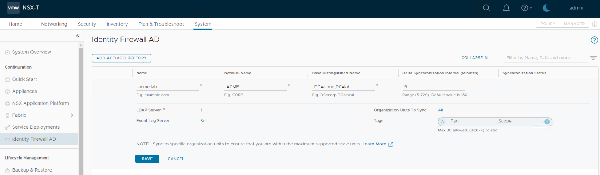     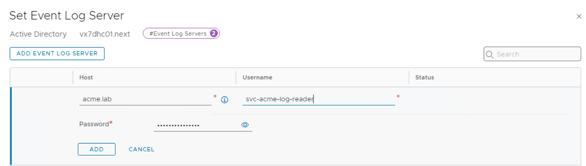 |
| 2. Second step is to enable the integration with AD log event on NSX-T manager.    This can be done on NSX-T under <b> Security -> General Settings -> Identity Firewall Event Log Sources -> Event Log Sources - AD Log Scraper </b>| 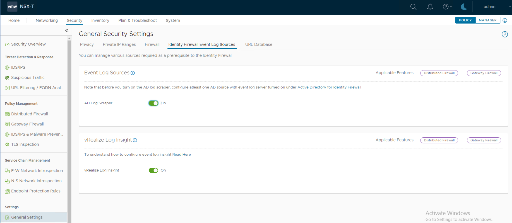 |

The event log reader account must have read permissions for security event logs.
Refer to these steps which must be executed on AD to create event log reader account:

- Navigate to Start > Administrative Tools > Active Directory Users and Computers > .
- In the navigation tree, expand the node that corresponds to the domain for which you and to enable security log access.
- Under the expanded node, select the Builtin node.
- Double-click Event Log Readers in the list of groups.
- Select the Members tab in the Event Log Readers Properties dialog box.
- Click Add, and select the user or group you want to add to the Event Log Readers Group.
- The Select Users, Contacts, Computers, or Groups dialog appears.
- Click OK to close all open dialog boxes.

### Enable NSX Identity Firewall integration in Log Insight

In the use case when we want to gather information regarding user access from third-parties components
(for example VPN firewalls like Global-Protect or ClearPass and others ) we can use Log Insight integration for that.
These third-parties components will sent authentication attempts to Log Insight,
which will search the through the logs using regex expressions to find specific user information like

- Username
- IP address
- Domain
- Event Type (login, logoff)

Please refer to this diagram:

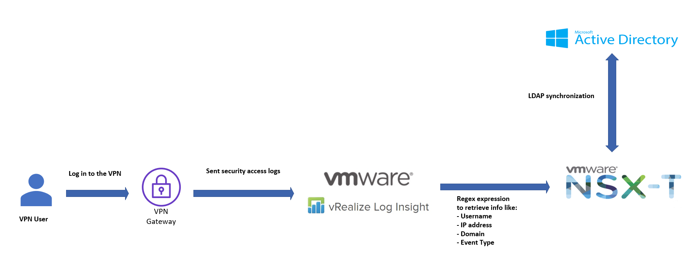

Please refer to all steps required to deploy Log Insight integration for NSX-T identity firewall:

| Steps              | Picture |
| -------------------------- |--------------- |
| 1. Enable logging from third-party device to Log Insight.    Refer to the documentation of third-parties vendor how to sent user-id logs to Log Insight for specific device . If setup up would be correctly - we should see authentication logs on Log Insight. | 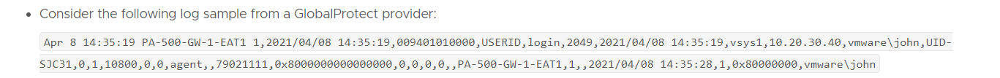 |
| 2. The next step is to enable the processing and forwarding of the logs from Log Insight to NSX    On Log Insight please navigate to: <b> Integration > NSX Identity Firewall > NSX Manager Configuration </b> | 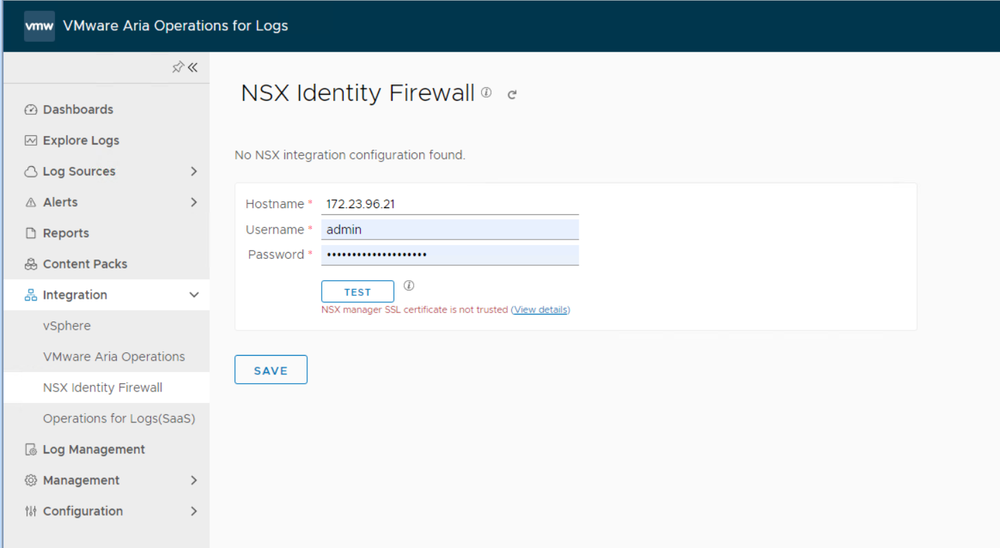    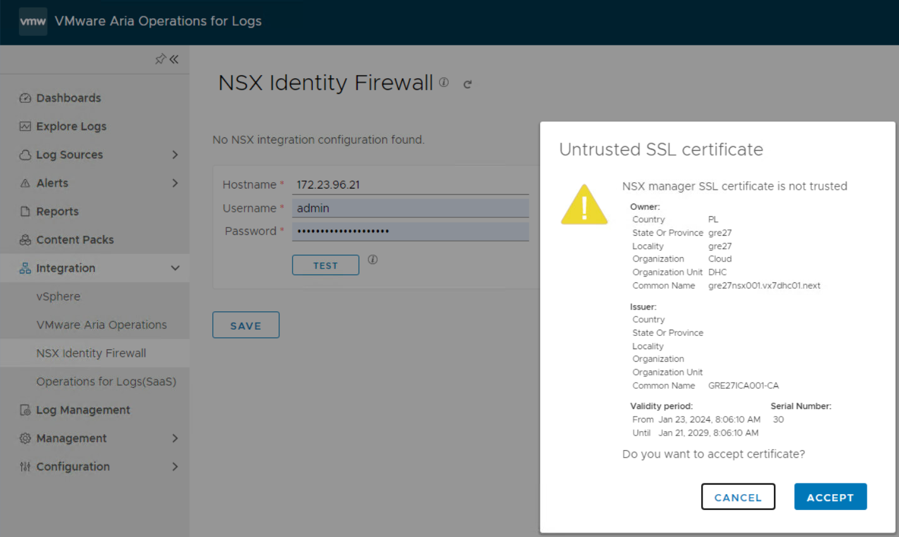 |
| 3. The next step is to add the provider.    The provider analyses the logs from a specific source based on regex expressions and sends the information to the configured NSX Manager. Only the logs for those Sources are being analysed by the provider. On Log Insight please navigate to: <b> Integration > NSX Identity Firewall > Provider > + New Provider </b> | 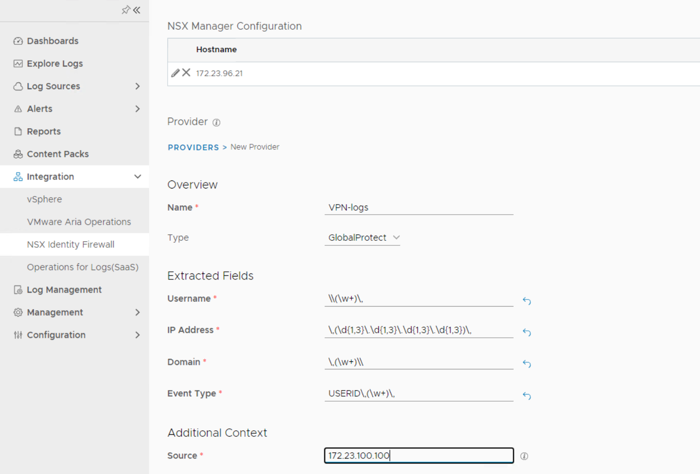 |
| 4. Last step is to enable the integration with vRealize Log Insight on NSX-T manager.    This can be done on NSX-T under <b>Security > Distributed Firewall > Settings > General Settings > Identity Firewall Event Log Sources > vRealize Log Insight </b>|  |

More information about IDFW integration with Log Insight can be found here:

[vRealize Log Insight](https://docs.vmware.com/en/vRealize-Log-Insight/8.10/com.vmware.log-insight.administration.doc/GUID-5F8ABAD3-2398-4E41-86B3-CD11123B72A4.html)

All presented examples based on Log Insight in version 8.10.

### Identity firewall basic troubleshooting (based on VMtools)

First thing we should do to troubleshoot problems with identity firewall is to check connection between NSX-T and Active Directory.
This can be done by checking Synchronization status under:
<b> System > Identity Firewall AD > Synchronization Status </b>

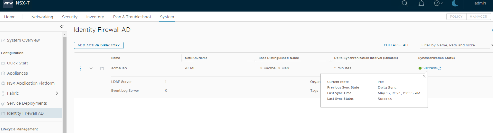

On this tab it is also possible to adjust Delta Synchronization Interval (Minutes).
In our case this value has been changed from default one - 180 minutes to 5 minutes.
The other useful option is to perform full synchronization if necessary as below.

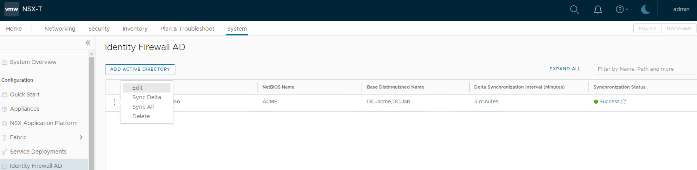

If all has been configured correctly, the IP-address of the users should appear as IP-address in the Security group as on picture below.
It means that the user has been correctly mapped to the AD group and corresponding virtual machine to which his were log in.
Please refer to security group dynamic membership before user is login to the specific VM.

Group definition:
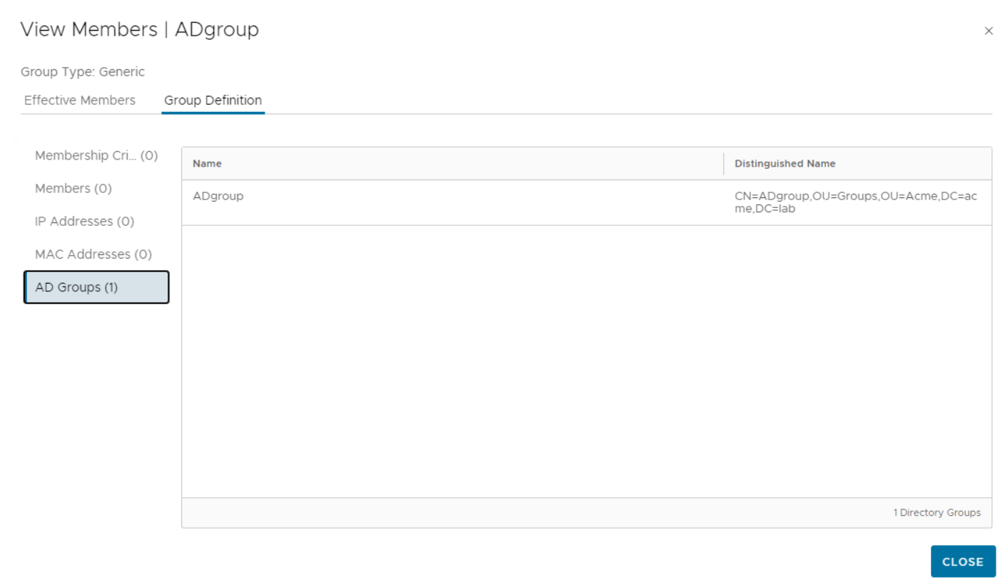

Effective Members:
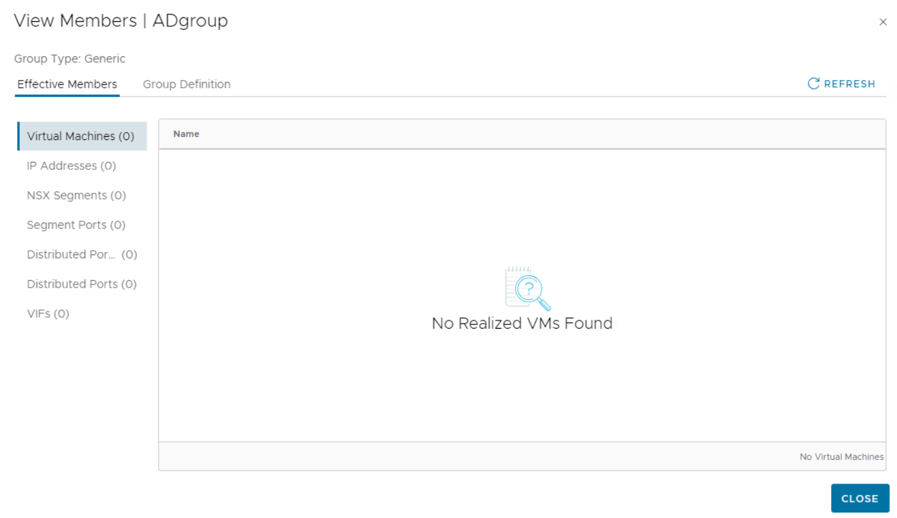

After user in specific AD group is successfully logged in to the VM, this will be reflected in Effective Members tab where
we should be able to see Virtual Machines names and corresponding IPs

Effective Members:
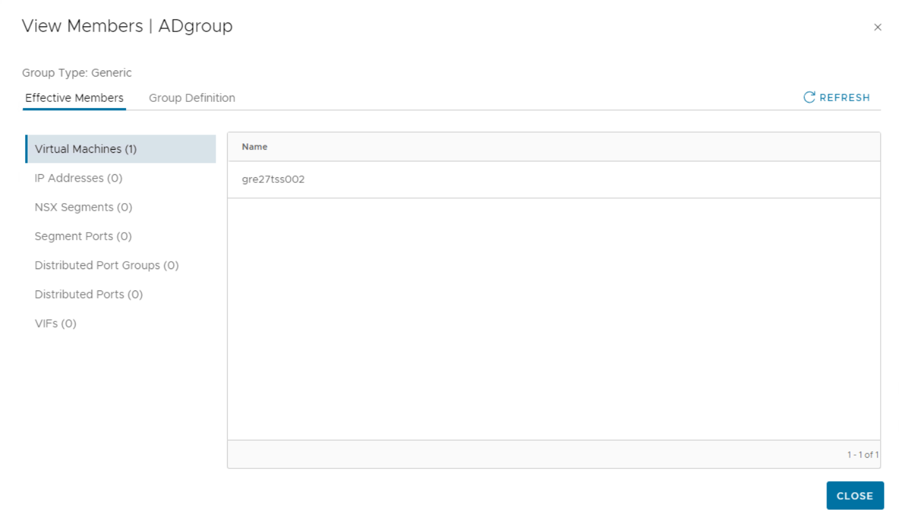

Guest introspection drivers can extract information from Windows operating system ( like Security Identifiers - SIDs ).
Based on this information NSX manager decide which traffic is allowed or blocked. These informations are not propagated between ESX host.
That is why there is a need to open traffic on source ESX (using AD group membership) and on destination ESX (using standard approach)

Please refer to below example how to properly allow flow on both ESX's:
Please be sure that the traffic is allowed in a proper as in example.

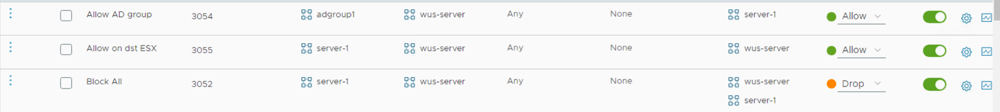

We need also check if VM tools have been installed with required components for IDFW (VMCI Driver with NSX File Introspection Driver and NSX Network Introspection)

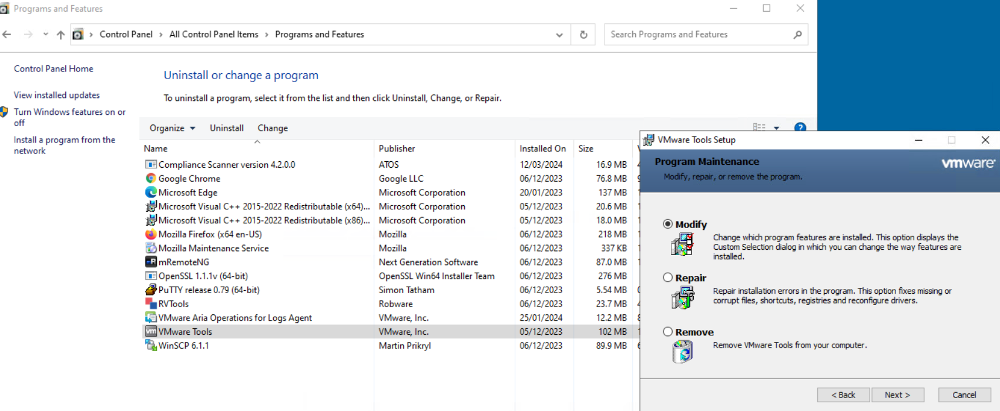
 
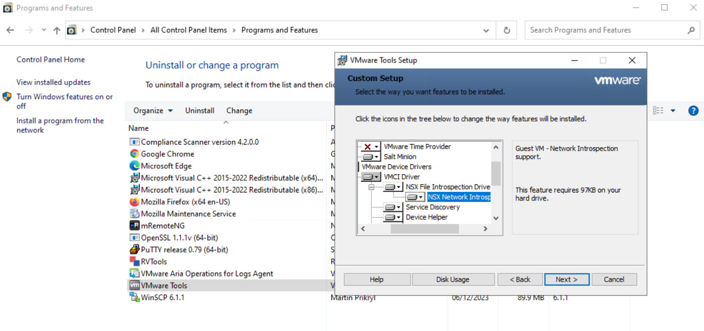

If Windows auto-logon is enabled on VMs, go to Local  <b>Computer Policy > Computer configuration > Administrative Templates > System > Logon and enable Always wait for the network at computer startup and logon. </b>
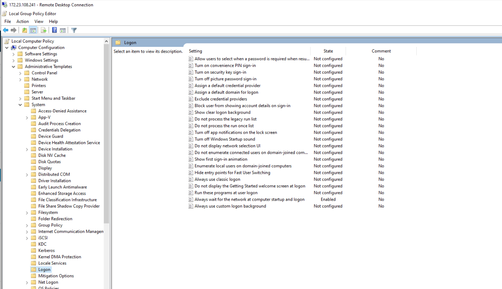

Troubleshooting notes:

This troubleshooting steps are describing way of proceeding when we are using Identity firewall
based on Vm tools ( with excluding of AD log scrapping and integration with log insight )

In the NSX-T version 3.2.2.X we observed following issues which should be should be taken into account during troubleshooting:

- When the AD group name is changed on AD server, this change is not reflected on NSX-T security group , we must update it manually (full AD synchronization doesn't fix this problem)
- ICMP and UDP traffic is only supported for specific VM tools version (below v12+)
- Despite the rule is correctly deployed and working as expected - we don't see corresponding VM name and IP address in NSXT security group on tab "Effective Members"

### Testing and validation

All testing and validation will be performed on management workload as ADC server will simulate customer Active Directory.
Identity firewall works together with remote desktop service  - in our case wus001 server will be used.
All examples are based on <b> vx8dhc01 <b>  environment so additional adjustment to the target environment are required.
If feasible the same process can be followed on Workload domain using dedicated customer Active Directory servers.

| Steps              | Picture |
| -------------------------- |--------------- |
| 1. Log in on wus001 server and confirm if required components for VM tools are installed (VMCI Driver with NSX File Introspection Driver and NSX Network Introspection ).  |                  |
| 2. Add 2 test users in Active Directory     <b> Active Directory Users and Computers -> vx8dhc01.next -> VCS -> Users -> VCS Admins </b>     idfw-user1    idfw-user2   |  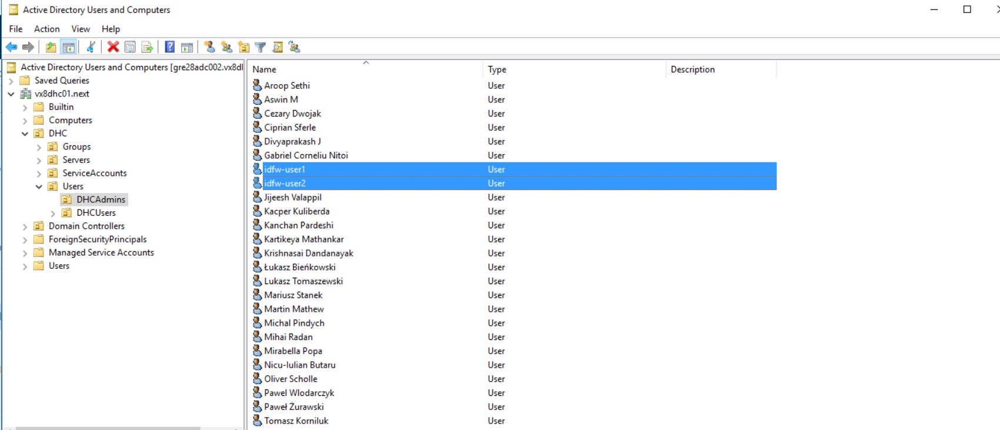              |
| 3. Add 2 test groups in Active Directory    <b> Active Directory Users and Computers -> vx8dhc01.next -> VCS -> Groups -> RoleGroups  </b>    idfw-group1    idfw-group2  |  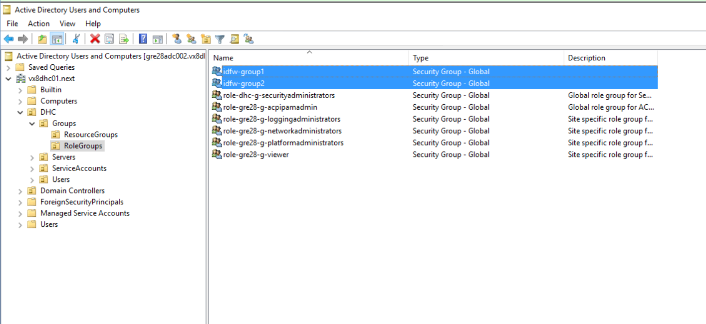              |
| 4. Add idfw-user1 to idfw-group1 in Active Directory   |  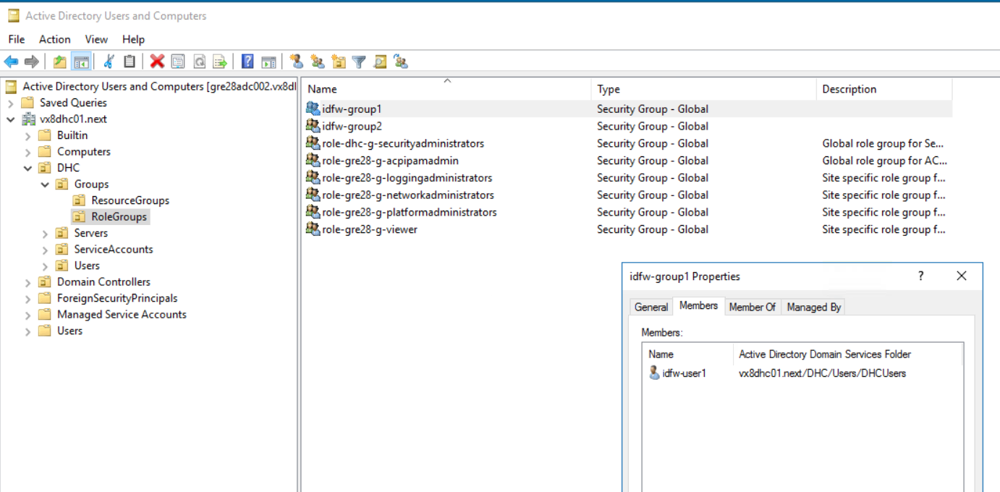              |
| 5. Add idfw-user2 to idfw-group2 in Active Directory   |  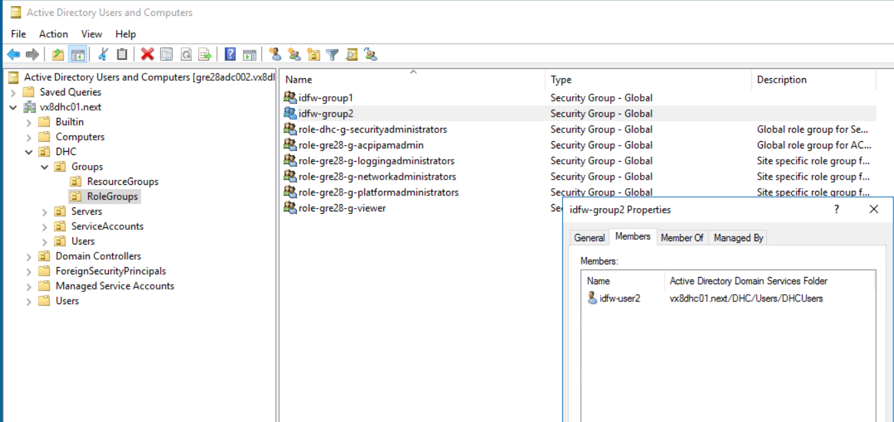              |
| 6. Add idfw-user1 and idfw-user2 to platformadministrators group ( to allow remote desktop connection ) in Active Directory |  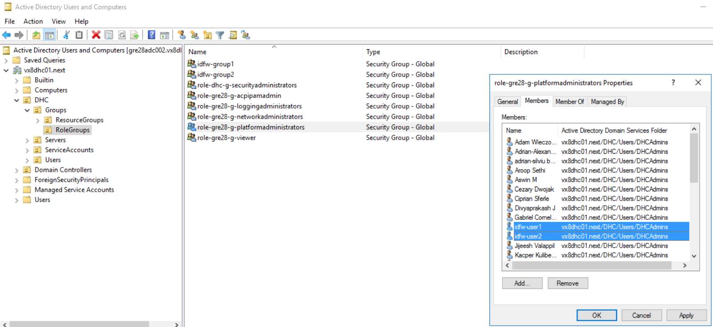              |
| 7. Configure Active Directory domain in NSX-T 001    
 System -> Identity Firewall AD -> ADD Active Directory 
 |  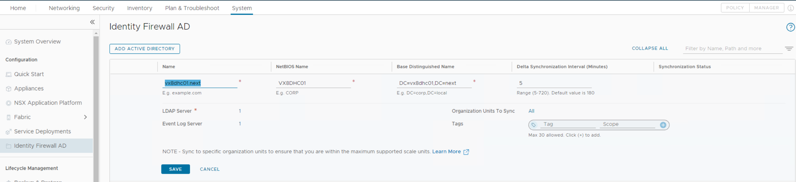              |
| 8. Add LDAP servers (in the same tab as above)  |  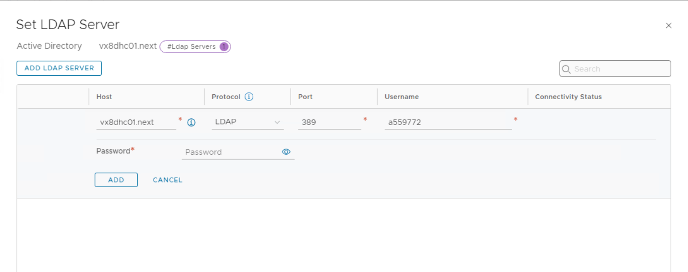              |
| 9. Enable the IDFW on NSX-T 001 manager    <b> Security -> Distributed Firewall -> Actions -> General Settings -> General Firewall Settings </b> |  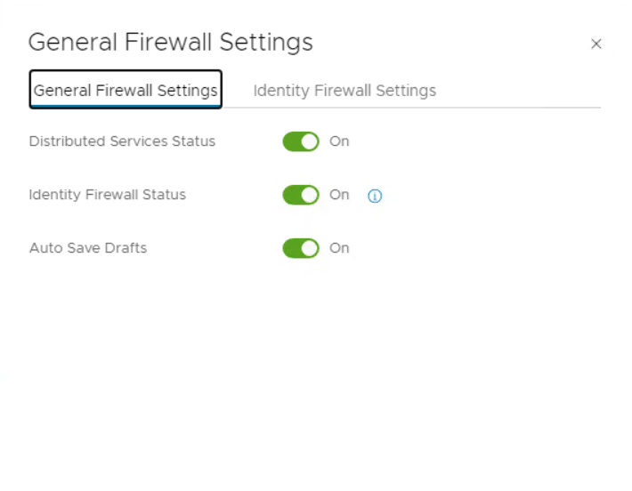              |
| 10. Enable the IDFW on specific Vcenter cluster    <b> Security -> Distributed Firewall -> Actions -> General Settings -> Identity Firewall Settings </b> |  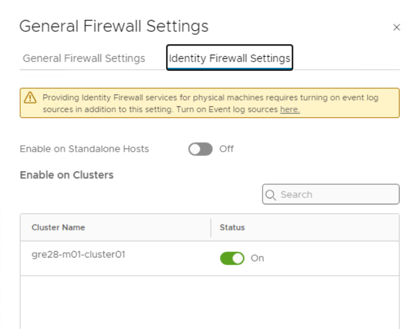              |
| 11. Add idfw-group1 on NSX-T 001    
  Inventory -> Groups -> ADD GROUP <b>  |  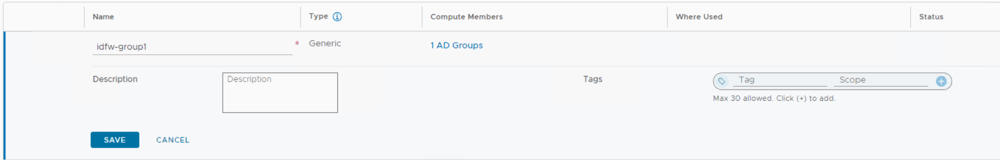   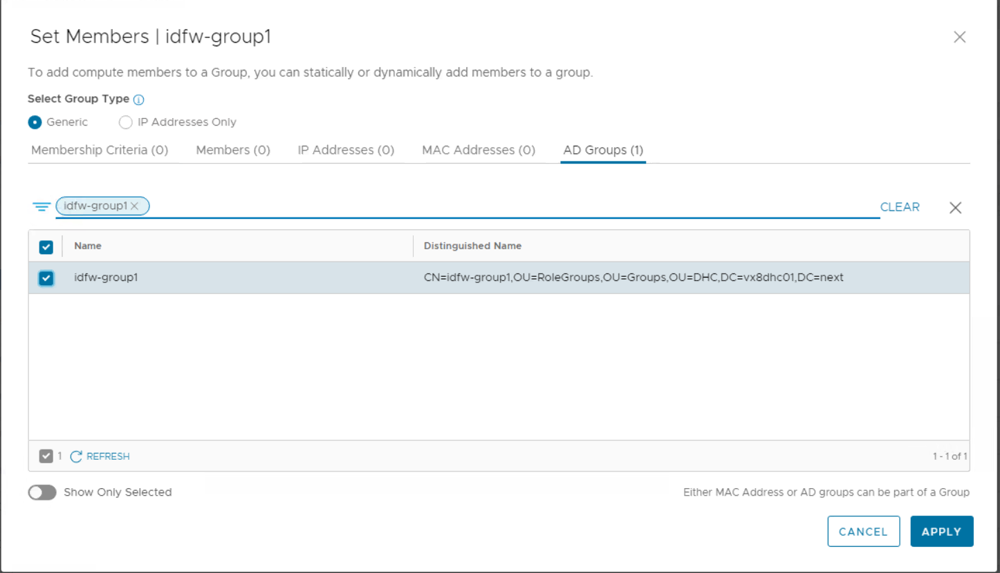            |
| 12. Add idfw-group2 on NSX-T 001    
  Inventory -> Groups -> ADD GROUP <b> |                  |
| 13. Create firewall rules on NSX-T 001 as in example    
 Security -> Distributed Firewall -> ADD Policy  then Add Rule 
   |  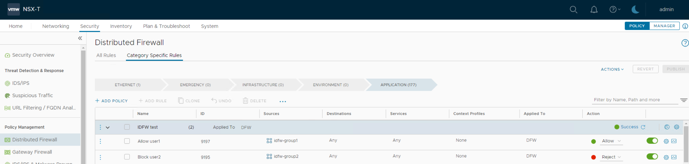              |
| 14. Log in to wus001 using idfw-user1 credentials   |  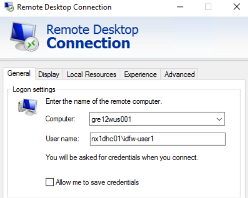              |
| 15. Execute telnet test to ans001 as in example - traffic should be allowed   |  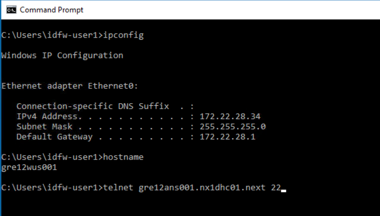  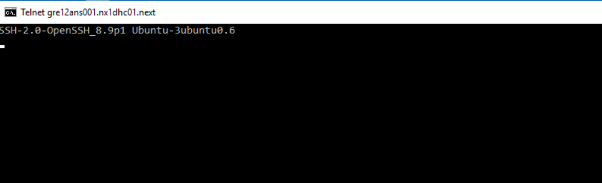            |
| 16. Log in to wus001 using idfw-user2 credentials  |  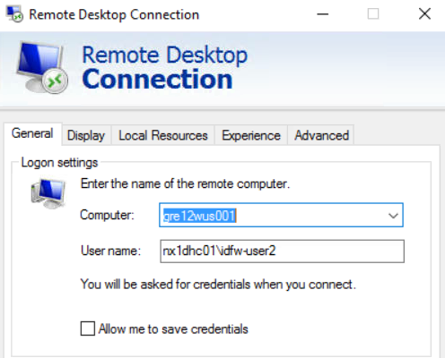              |
| 17. Execute telnet test as in example - traffic should be blocked |  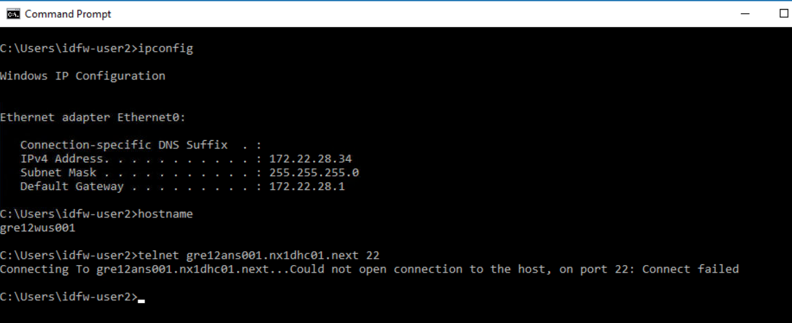              |

After testing please remove all objects from

  AD:

- idfw-user1
- idfw-user2
- idfw-group1
- idfw-group2

  NSX-T:

- rules and policy
- idfw-group1
- idfw-group2
