# NSX-T Multi-Tenancy solution

## Table of contents

## Changelog

|    Date    |   TOS   |   Issue   | Author | Description |
|------------|---------|-----------|--------|-------------|
| 21.10.2024 | VCS 2.0 | VCS-14191 | Michal Pindych  | Initial document creation |

## Introduction

VMware NSX-T’s multitenancy solution leverages Projects and Virtual Private Clouds (VPCs) to provide secure
isolated environments tailored to the needs of multiple tenants within a single NSX-T deployment.

- Projects: serve as logical boundaries for tenant resources within NSX-T. Each project has its own resource allocations, user roles, and policies, enabling a clear separation of administrative control between tenants.
- Virtual Private Clouds (VPCs): represent dedicated networking environments within a project. Each VPC can have its own network segments, gateways, and security policies, mimicking the isolated networking found in public cloud VPCs

### Purpose

The purpose of this WI is to explain how to enable Multi-Tenancy for customer workload and how to use this feature on VCS platform.

### Audience

- VCS Engineers
- VCS Operations
- Integration Architects

### Scope

This document covers configuring the following items:

- Multi-tenancy introduction for NSX-T 4.X
- NSX-T Project functionality consideration and limitations
- NSX-T Project configuration
- NSX-T VPC functionality consideration and limitations
- NSX-T VPC configuration

### Related Documents

|          Documentation         |
|--------------------------------|
| [VCS Software Defined Network LLD](../design/lldSoftwareDefinedNetworks.md)|
| [NSX Projects](https://docs.vmware.com/en/VMware-NSX/4.1/administration/GUID-52180BC5-A1AB-4BC2-B1CE-666292505317.html)|
| [NSX Virtual Private Clouds](https://docs.vmware.com/en/VMware-NSX/4.2/administration/GUID-45670D79-7CBE-424D-B1D3-B9BB3B6D8C88.html)|
| [Microsegmentation Architecture](../design/lldMicrosegmentation.md)|

## Introduction to multi-tenancy based on Projects and VPC's

All considerations, limitations, and examples in this documentation are based on NSX-T Manager version 4.2.
This version serves as the reference point for the features, configurations, and functionalities discussed,
ensuring alignment with NSX-T 4.2 capabilities and constraints

In version 4.X, NSX-T introduces Projects and Virtual Private Clouds (VPCs) to enable multi-tenancy,
allowing for the separation of network and security resources across different tenants or business units.
Each project operates within its own isolated virtual network environment, ensuring that each project or
VPC is securely isolated from others, preventing any cross-impact between activities.

Compared to the current multi-tenancy model in VCS, this enhanced solution introduces additional layers of separation within the management plane.
While data and control planes maintain similar structures, Projects and VPCs provide extended isolation for management purposes.

NSX-T 4.X supports two levels of multi-tenancy separation:

- Data Plane Separation - Achieved through dedicated network resources such as segments, T1 routers, T0/VRFs, and specific firewall rules, ensuring that each tenant has its own independent network infrastructure.
- Management Plane Separation - Established by varying privilege levels in GUI/API access for roles within Projects and VPCs, this separation allows precise control over management access for different users and teams.

With multi-tenancy on the management plane, end customers can be granted access to specific projects and VPC configurations, ensuring that they have secure and controlled visibility into only their designated resources.

### Configuration Structure

- At the global level (within the default project), shared resources such as Overlay Transport Zones, Edges,
  and T0 Routers are configured. These objects serve as foundational resources accessible to tenant-specific projects as needed.

- Within tenant-specific projects, more tailored configurations are applied, such as T1 routers, firewall rules, NAT configurations,
  network segments, and quotas, ensuring that each tenant has control over their dedicated resources while benefiting from the global resources defined in the default project.

This structure allows for both efficient resource sharing and isolated management, supporting robust and secure multi-tenancy.

### Management Levels in VPC and Project Framework

This solution is managed across three distinct administrative levels:

- Enterprise Admin: Has full access to the entire infrastructure, including all Projects and VPCs, with the ability to configure and manage resources across tenants.
- Project Admin: Has restricted access limited to specific Projects and their associated VPC configurations, allowing control over resources within assigned Projects only.
- VPC Admin: Has the most limited access, managing only the resources within their dedicated VPC, without visibility or control over other Projects or VPCs.

These management levels provide granular access control, aligning with the multi-tenancy model to ensure secure and organized administration at each level.

### Virtual Machine Connectivity Across Multiple Projects and VPCs

In NSX-T 4.2, a single virtual machine can be connected to multiple projects and VPCs simultaneously. This capability is based on segment membership,
enabling flexible network configurations to support diverse use cases. For example, this allows a virtual machine to communicate with shared resources, such as VLAN-based backup networks, which are supported at the default project level only.

This flexible connectivity model enhances network efficiency by allowing virtual machines to access necessary shared services while maintaining project-specific network isolation.

### Distributed Firewall Rules Deployment for Projects and VPCs

When configuring distributed firewall (DFW) rules for Projects and Virtual Private Clouds (VPCs), it’s important to understand the sequence and precedence of rule evaluation. The hierarchy is as follows:

- Default Project Rules: These rules hold the highest priority within the deployment hierarchy and can override any other rules applied at both the project and VPC levels.
Categories are supported (EMERGENCY, INFRASTRUCTURE, ENVIRONMENT, APPLICATION), allowing for organized grouping of rules within the default project.

- Specific Project Rules: can override rules set at the VPC level but cannot override default project rules.
Categories are supported (only INFRASTRUCTURE, ENVIRONMENT, APPLICATION), enabling structured rule organization within each project.

- VPC-Level Rules: have the lowest priority and can be overridden by both default and project-specific rules.
Categories are not supported at the VPC level. Instead, all VPC rules are deployed under the Application section within the specific project.

All microsegmentation details can be found here:
[Microsegmentation Architecture](../design/lldMicrosegmentation.md)

## NSX-T Projects

In NSX-T 4.X, projects are divided into two types, each serving distinct roles in managing multi-tenancy:

- Default Project (Global Level) - The default project is used to configure global objects and shared resources that can be utilized by other projects.
  This includes infrastructure elements such as Overlay Transport Zones, Edges, and T0 Routers. Configuring these resources at the global level ensures
  they are accessible across multiple tenant projects, optimizing shared usage.

- Tenant-Specific Projects - These projects are designed for specific tenants, offering complete SDN management separation for individual customers.
  Under each tenant-specific project, configurations are isolated, enabling granular control over resources and policies.
  These resources typically include T1 Routers, Gateway/Distributed Firewalls, NAT rules, segments, quotas, and more.

### Limitations

Please refer to key project limitations:

- "Project segments" in VRA are learned only from vCenter endpoints.
- Shared inventory exists between the default project and specific projects.
- Limited RBAC support (5 predefined roles, 3 identity sources).
- Only overlay transport zones are supported for projects.
- Only the Advanced Load Balancer is supported for projects.
- No support for L2/L3 VPN.
- No support for Identity Firewall.
- No support for TLS inspection/decryption.
- No support for Gateway IDS/IPS and malware prevention.
- Limited support for application identity and context-aware security.
- No support for NSX Intelligence.
- No support for NSX-T Federation.

Some of these limitation are existing only on specific project level but we can provide exactly the same functionality to the customer from default project level (Identiti firewall for example).
Although management of this feature is unavailable directly within the specific tenant project, it remains accessible to end customers through the default global project.

### RBAC

In a project we can assign the following roles to the users:

- Project Admin
- Security Admin
- Network Admin
- Security Operator
- Network Operator

These roles are predefined, project does not support any roles customizations.\
NSX-T Managers support only three different identity sources.\
Desired RBAC solution should be based on Active Directory controller deployed outside VCS platform (RBAC schema can by based on VCS).

### Configuration - Projects

| Steps              | Picture |
| -------------------------- |--------------- |
|  1. Chose “Default” section and click “Manage”                            | 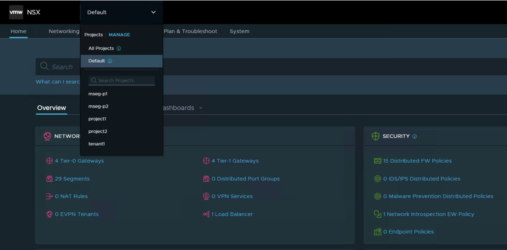               |
|  2. Click “ADD PROJECT”                           | 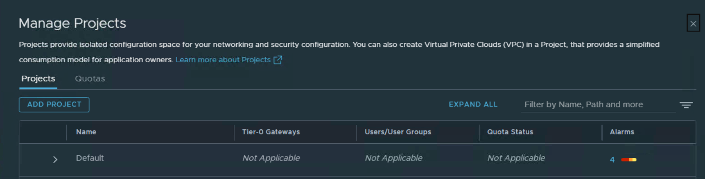               |
|  3. In order to create project we must provide information about “T0 gateways”, “Edge Clusters”, optionally we can specify  “External IPv4 Block”  (used only by VPC ) and “Short log identifier”                           | 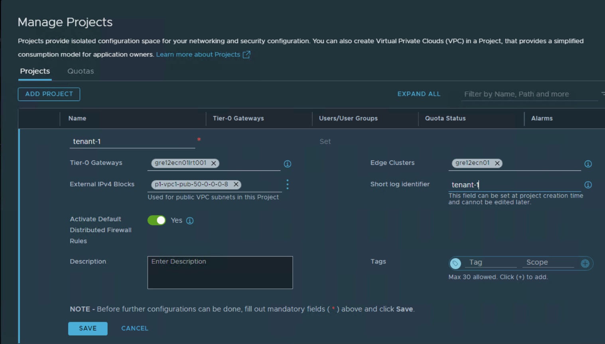               |

### Configuration - RBAC

| Steps              | Picture |
| -------------------------- |--------------- |
| 1. Navigate to System->User Management->Local Users                           | 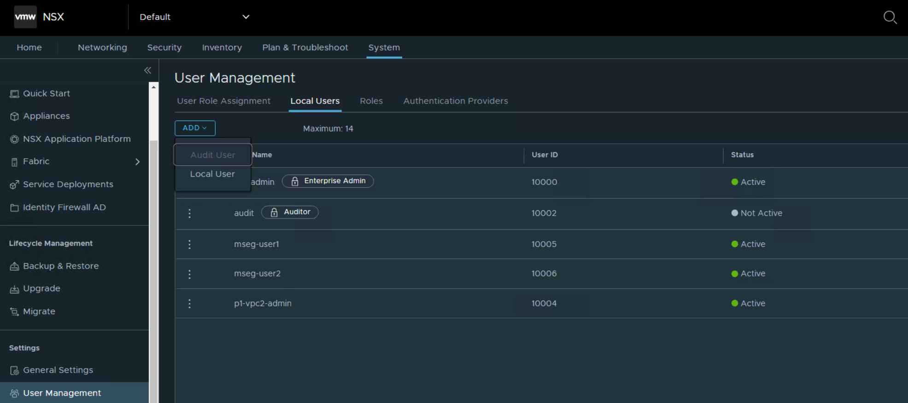               |
| 2.  Add local user                            | 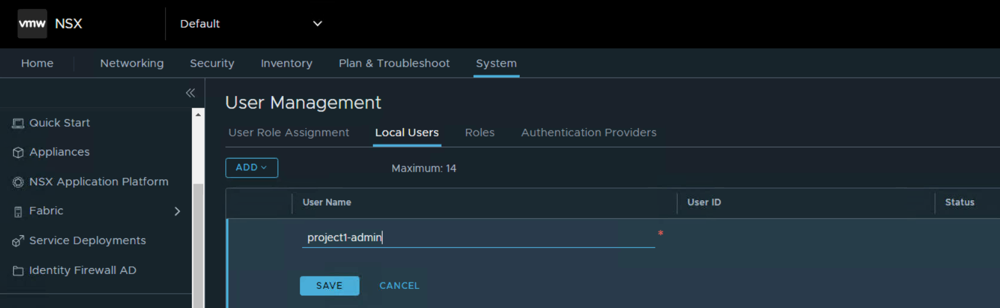               |
| 3. Activate local user                            | 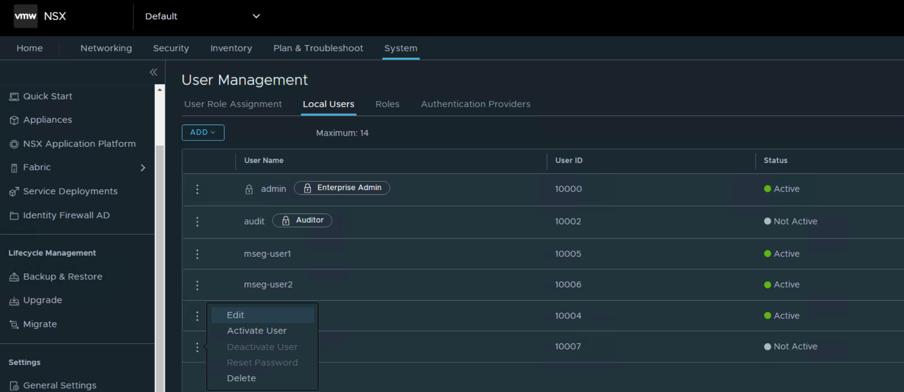               |
| 4. Assign new password for a user                            | 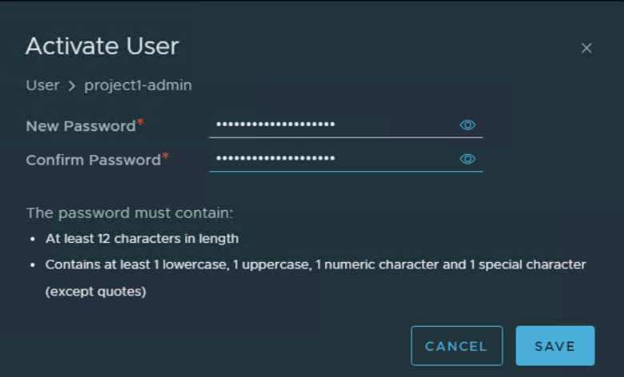               |
| 5. Switch to section User Management and edit the user                            | 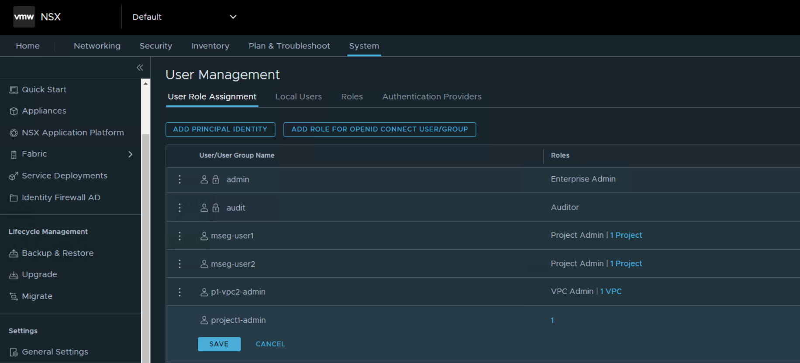               |
| 6. In role section add “Project Admin”                            | 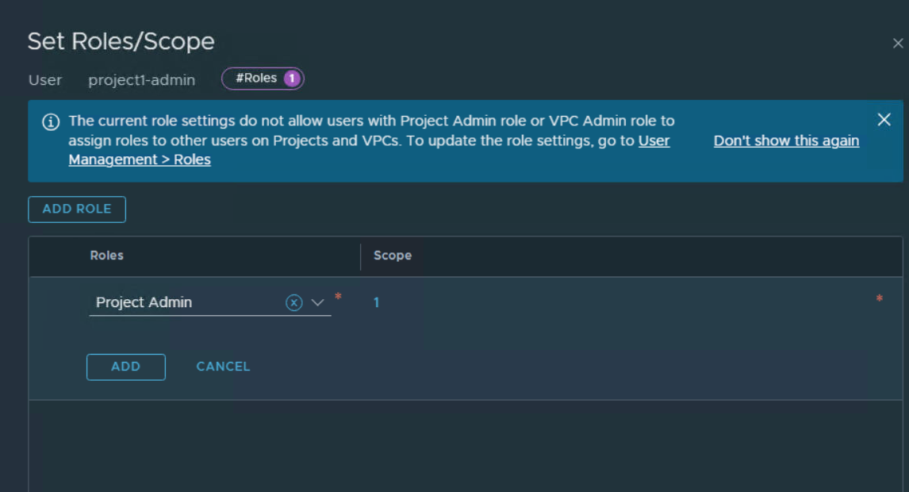               |
| 7. In “Scope” configuration chose specific project which should be accessible for this user                            | 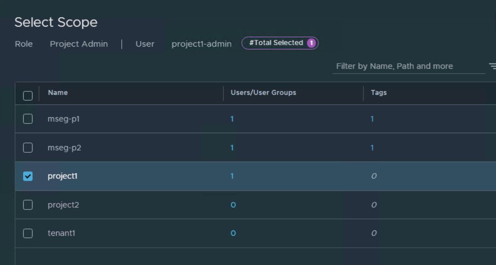  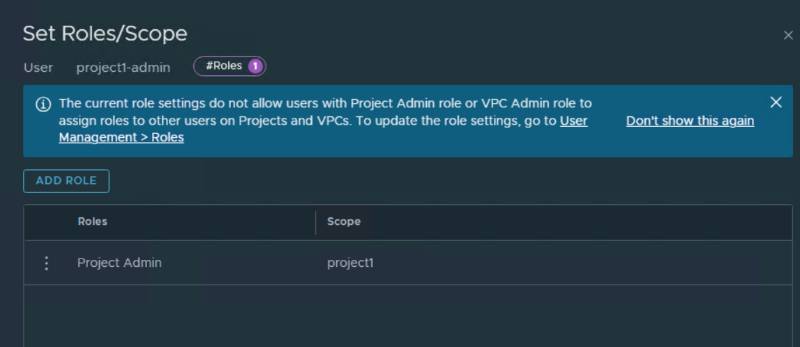               |
| 8. Navigate to NSX-T GUI and log in by a given user                           | 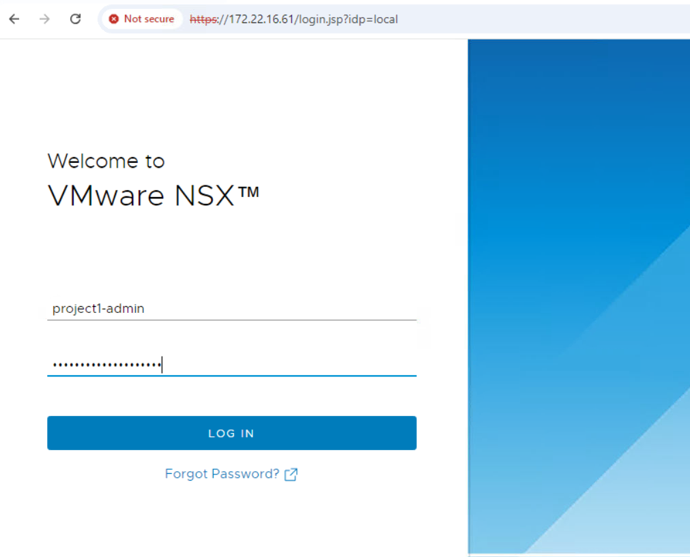  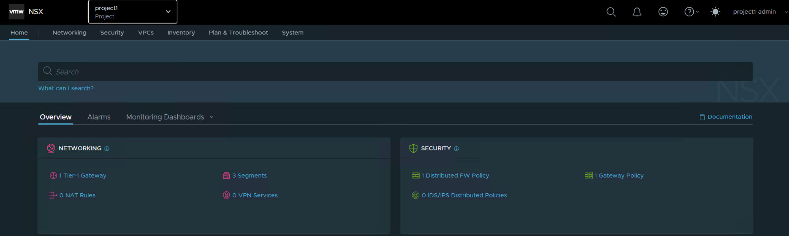               |

## NSX-T VPC

In NSX-T, VPC functionality is integrated as a component within Projects. Both VPCs and Projects utilize the same underlying infrastructure and share a consistent configuration structure.
However, a VPC is built on top of a Project, adding another layer of network and security separation within the Project’s framework. It’s important to understand that VPCs are extensions
of Projects, designed to enable fine-grained control and segmentation without duplicating infrastructure.

Virtual Private Cloud (VPC) functions as a logical container within a Project, encompassing a set of network and security resources that remain isolated from other tenants or workloads.
Each Project can host multiple VPCs, allowing for flexibility and layered segmentation.

This VPC model provides significant flexibility by supporting different operational perspectives:

- Sub-Tenancy for Specific Tenants: By configuring multiple VPCs within a Project, administrators can create sub-tenants under a single primary tenant. This model is ideal for scenarios where multiple business units within a single tenant require isolated environments.

- Cloud Consumption Model: VPCs enable a native cloud consumption model for end users, where application owners can directly manage their network infrastructure within their assigned VPC. This empowers application owners to create and configure networks independently, without needing in-depth knowledge of the underlying SDN complexities.

In essence, VPCs within Projects streamline resource management, enhance multi-tenancy, and allow organizations to offer flexible, self-service capabilities to end users.

Each VPC is automatically provisioned with a dedicated T1 router in read-only mode. This router is managed solely by the system and is not accessible for direct modification by users or administrators.
This automatic configuration ensures consistent routing infrastructure across all VPCs, maintaining network stability and simplifying management.
The "IP Blocks" feature is fundamental to network creation within a Virtual Private Cloud (VPC), providing flexible options for defining IP address spaces on demand.
When configuring an IP block, you can select from the following options:

- Private Space: Accessible solely within the VPC. Communication does not extend beyond the VPC boundary unless specific Network Address Translation (NAT) rules are configured.
- External Space: By default, this IP space is routed externally through the VPC’s uplink router, allowing connectivity outside the VPC.
- Isolated Space: This space has no connection to the uplink router, creating an isolated network segment with no external routing.

VPC admin configuration is limited to:

- Network connectivity (Subnets , Static routes)
- Network services (NAT rules)
- Security services (East-west firewall rules L4-L7, North-south firewall rules L4 only)
- Inventory objects (Groups static and dynamic memberships)

### Limitations

Please refer to key VPCs limitations:

- Public IP Block Limitation: Each tenant is limited to configuring a maximum of five public IP blocks within their environment.
- Inherited Limitations: All other limitations for VPCs are directly inherited from the Project settings, ensuring consistency and alignment with the overall Project framework.

### RBAC

In a project we can assign the following roles to the users:

- VPC Admin
- Security Admin
- Network Admin
- Security Operator
- Network Operator

These roles are predefined, VPC does not support any roles customizations.\
NSX-T Managers support only three different identity sources.\
Desired RBAC solution should be based on Active Directory controller deployed outside VCS platform (RBAC scheamt can by based on VCS).

### Configuration - Public IP Block

| Steps              | Picture |
| -------------------------- |--------------- |
| 1. In “Default project” navigate to Networking->IP Address Pools->IP Address Blocks                           | 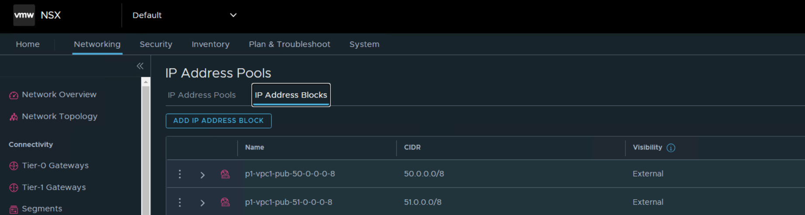               |
| 2. Click “ADD IP ADDRESS BLOCK” and specify address block name, CIDR and set Visibility to “External”                           | 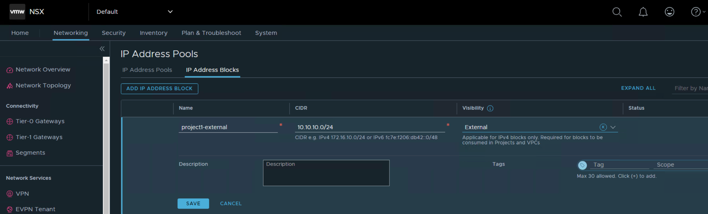               |
| 3. To add this IP block to a Project navigate to “Projects” section and click “Manage”                           | 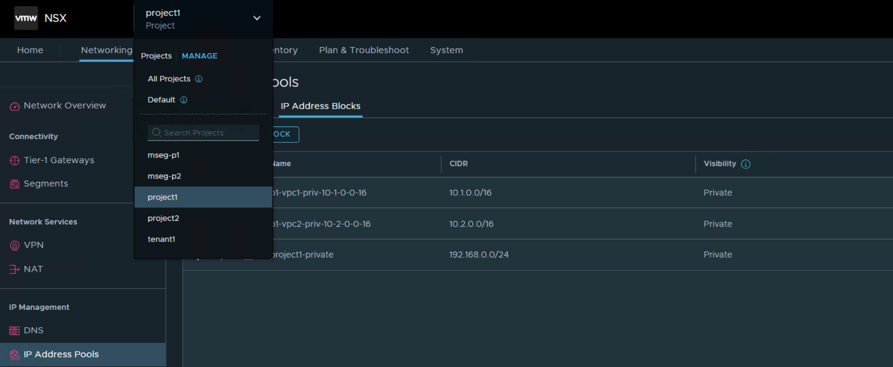               |
| 4. From “Manage Projects” click “Edit” for specific project                            | 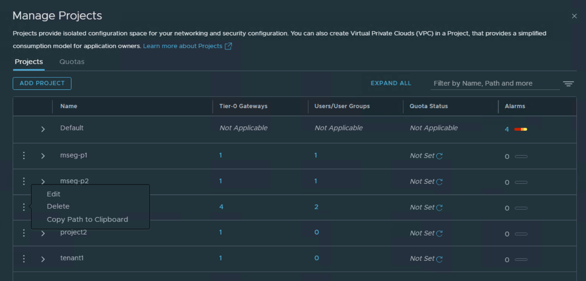               |
| 5. In the edit section add “External IPv4 Blocks” created previous                            | 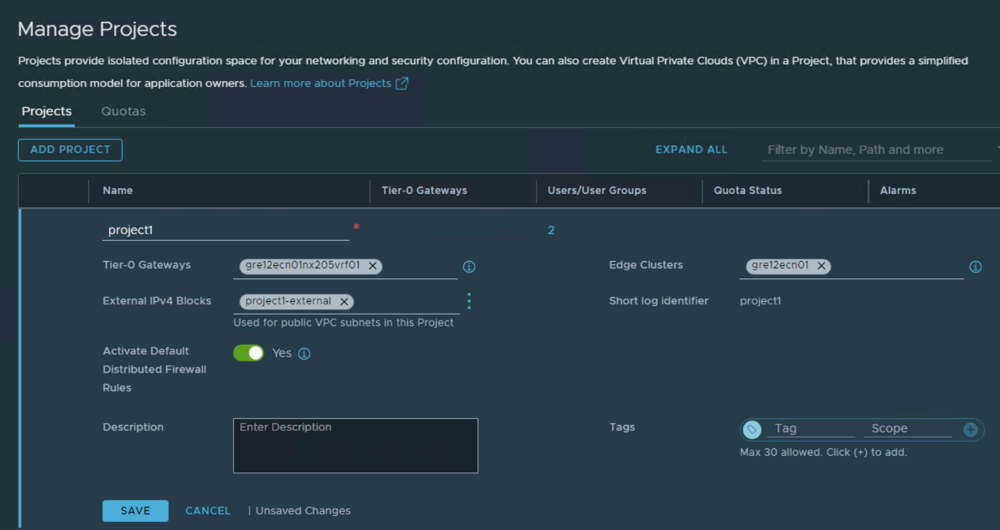               |

### Configuration - Private IP Block

| Steps              | Picture |
| -------------------------- |--------------- |
| 1. Under the specific project navigate to Networking->IP Address Pools->IP Address Block                           | 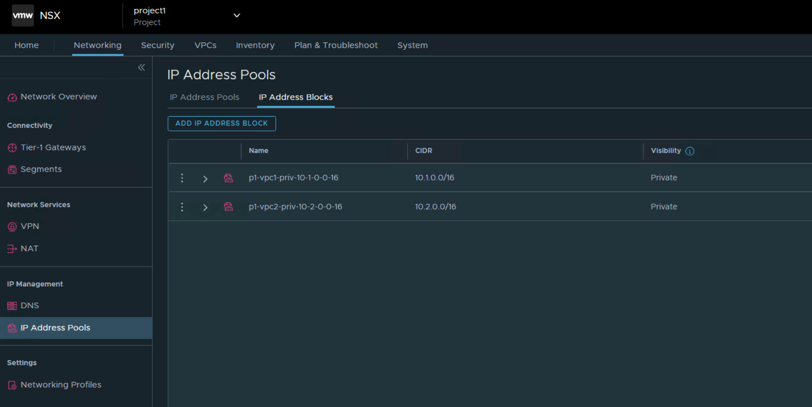               |
| 2. Click “ADD IP ADDRESS BLOCK” and specifies name , CIDR and Visibility as a Private                           | 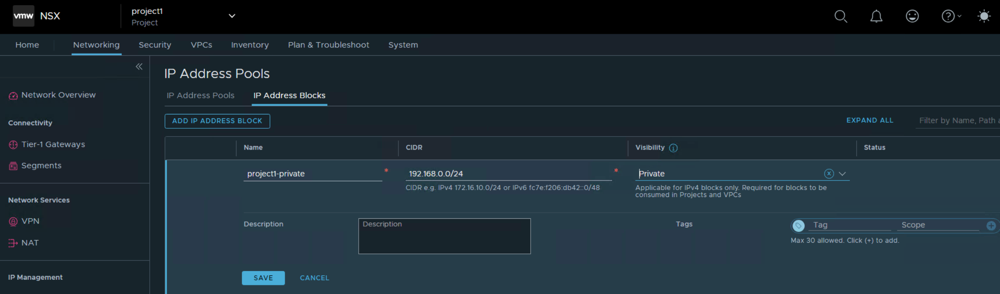               |

### Configuration - VPC

| Steps              | Picture |
| -------------------------- |--------------- |
|  1. Under the specific project navigate VPC section                          | 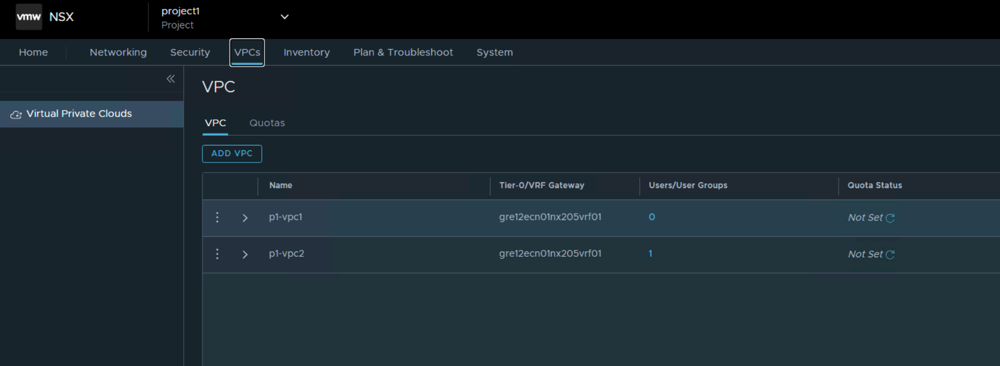               |
|  2. Click “ADD VPC” and specifies project name , T0/VRF and edge cluster, please add External IPv4 Block and Private IPv4 Blocks (if required)                          | 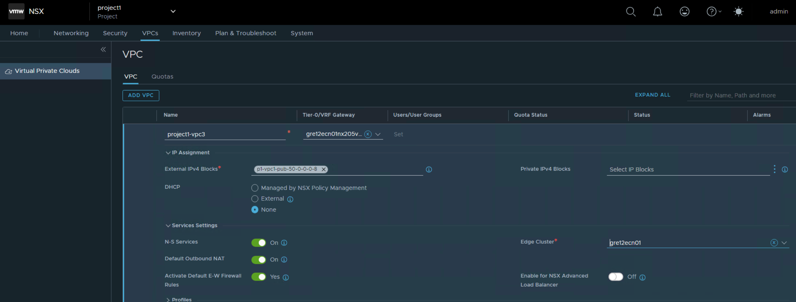               |
|  3. VPC creation is completed now                           | 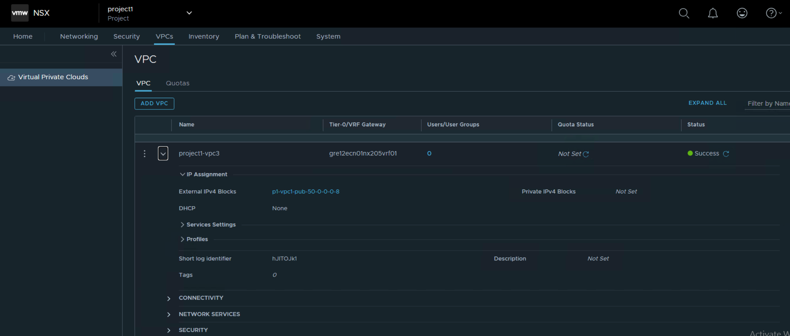               |

### Configuration - RBAC

| Steps              | Picture |
| -------------------------- |--------------- |
|  1. Under the “Default project” navigate to System-> User Management-> Local Users, click “ADD” and specifies user name                           | 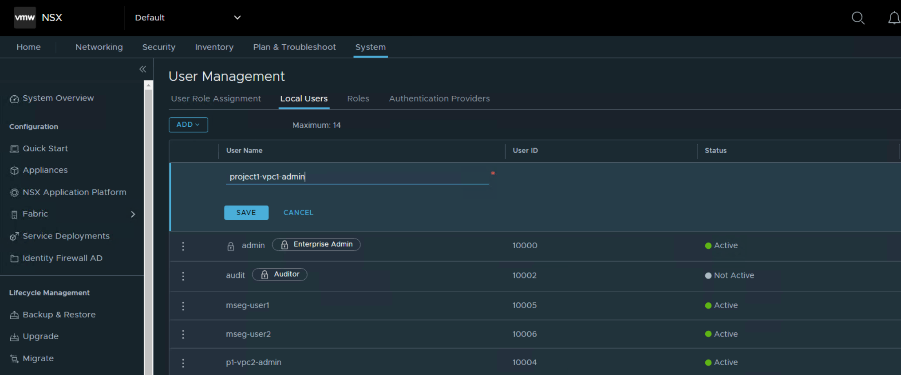               |
|  2. Click “Activate User” for a specific user                            | 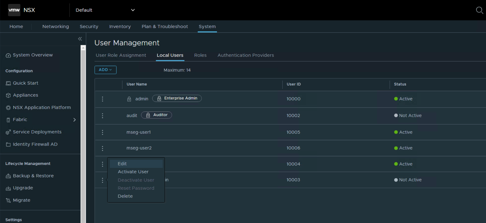               |
|  3. Configure password for a user                            | 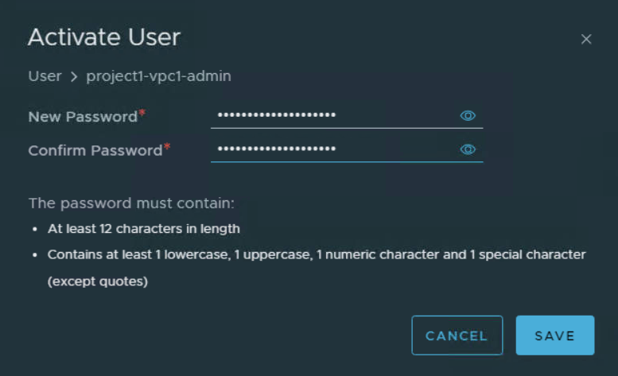               |
|  4. Click “Roles” section under specific user                           | 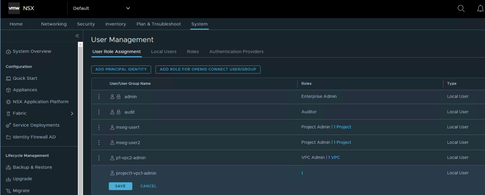               |
|  5. Chose “VPC Admin” role                           | 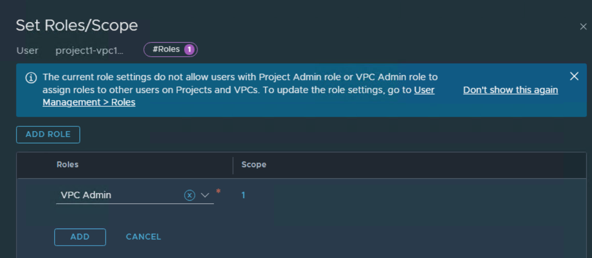               |
|  6. In the scope section select appropriate VPC to which users should have access                           | 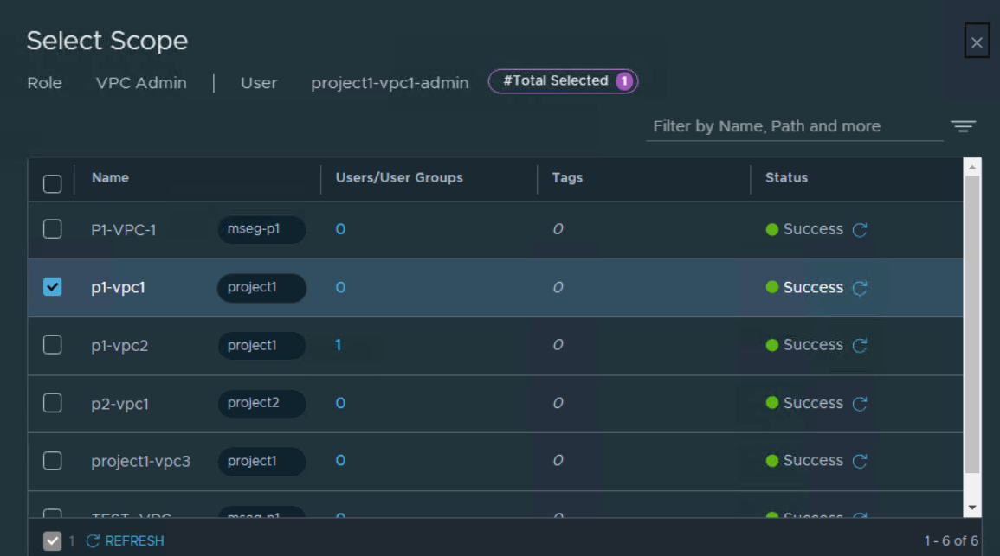               |
|  7. VPC admin creation is completed                           | 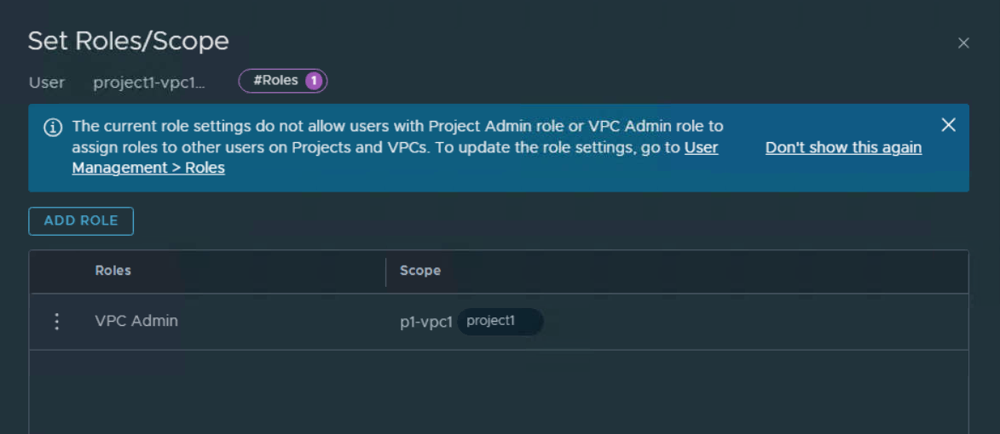               |
|  8. Log in to the NSX-T GUI interface using VPC admin credentials                           | 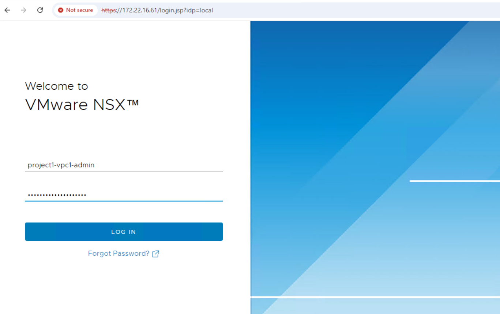               |
|  9. After successful log in You should be able to manage VPC                            | 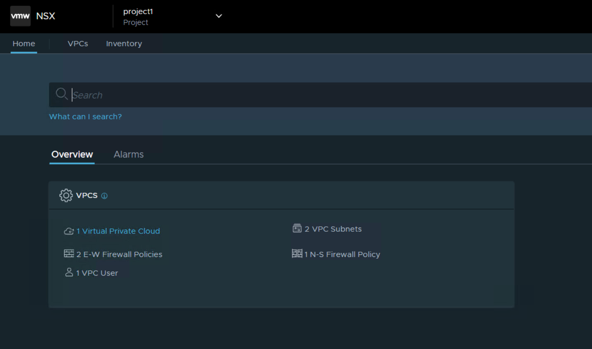               |

### Configuration - Segment

| Steps              | Picture |
| -------------------------- |--------------- |
| 1. Under the specific VPC navigate to Connectivity->Subnets                            | 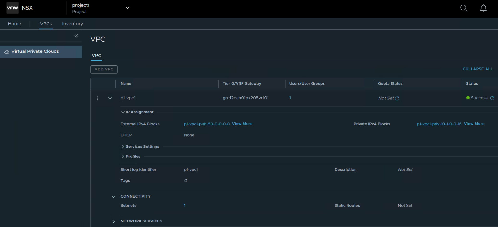               |
| 2. Click “ADD SUBNET”                           | 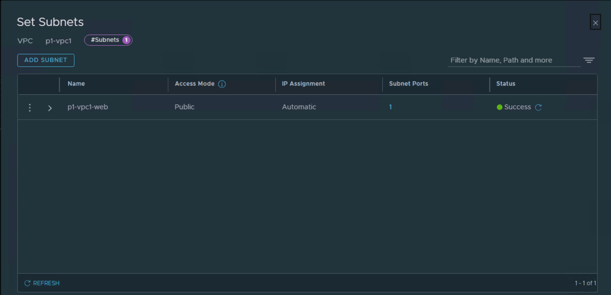               |
|  3.  Specifies subnet name and “Access mode” as public, external or isolated. In” IP Assignment “we can choose Automatic or Manual value. In case of Automatic – we should s specifies workload size, in case of Manual we should specifies network CIDR  (within defined IP blocks) | 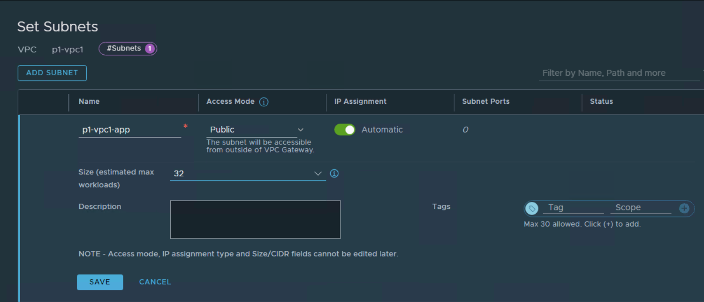 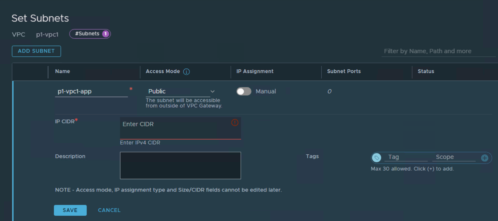                 |
| 4. From this moment new segment should be ready to use                            | 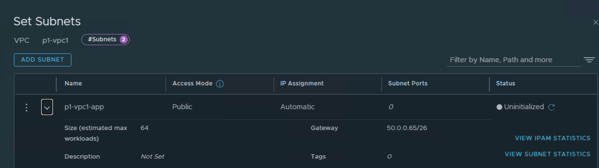               |
