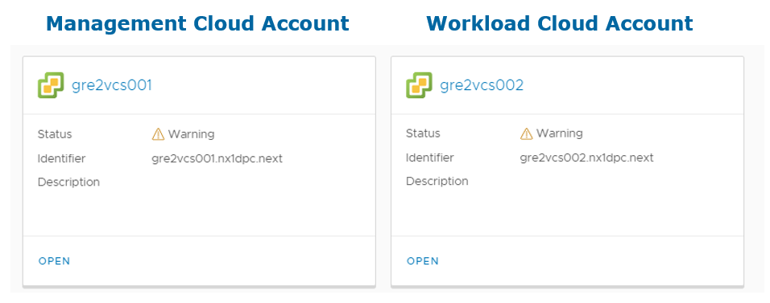
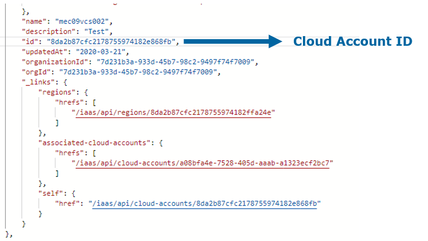
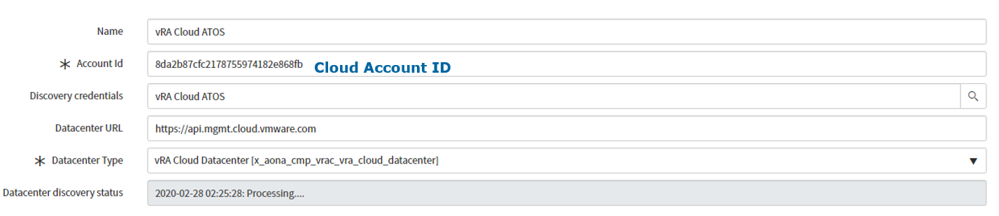
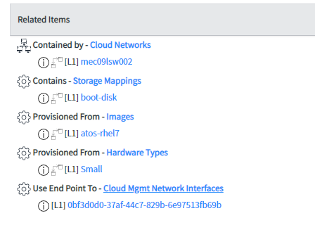
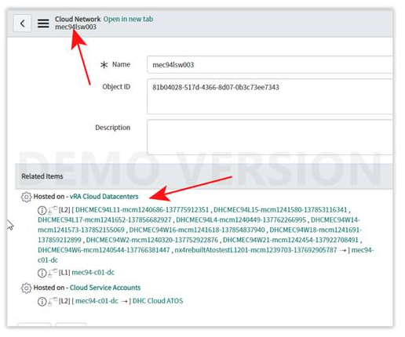
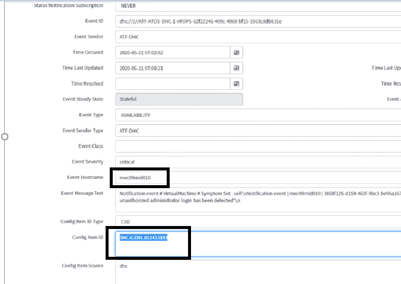
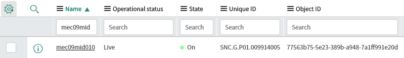
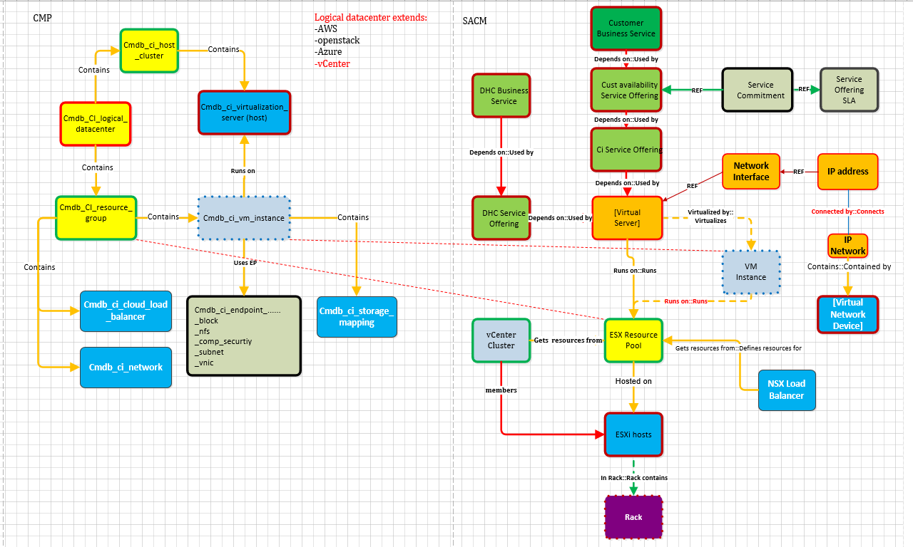

# Management CI Onboarding

# Changelog

| Version | Date       | Description                   | Author(s)     |
|---------|------------|-------------------------------|---------------|
| 0.1     | 2020-03-18 | Initial draft creation        | Brian Gerrard |
| 0.2     | 2020-04-20 | Updated with draft Data Model | Brian Gerrard |

## Introduction

### Purpose

Onboard Management CIs into the CMP CMDB. This process is partially automated but requires some manual steps as well.

### Audience

- VCS Engineers
- VCS Operations

### Scope

- Description of automated onboarding of Management Virtual Machines
- Description of manual onboarding of Management Hosts and Hardware

Onboarding the workload domain VMs (Customer VMs) or hardware is not in scope of this document.

## 1.4 Related Documents

This document is a subset of Atos Technology Lifecycle Management (ATLM) artefacts. All documents are stored in the VCS documentation repository.

|                                                                                                                                                                                                                                         SACM Import templates                                                                                                                                                                                                                                          |
|:------------------------------------------------------------------------------------------------------------------------------------------------------------------------------------------------------------------------------------------------------------------------------------------------------------------------------------------------------------------------------------------------------------------------------------------------------------------------------------------------------:|
| <https://sp2013.myatos.net/ms/gd/gdts/bid-tt/Public%20Documentation/Forms/AllItems.aspx?&&p_SortBehavior=0&p_FileLeafRef=ATOS%5fSACM%5fCI%5fExceptions%5fImport%5fTemplate%2exlsx&&RootFolder=%2fms%2fgd%2fgdts%2fbid%2dtt%2fPublic%20Documentation%2fATF%20Implementation%20Guide%2fATF%202%2e0%20IMG%20%28under%20construction%29%2fATF%202%2e0%20Service%20Asset%20and%20Configuration%20Management%2fCMDB%2fSACM%5fImport%5fTemplates&PageFirstRow=1&&View={90ADDAA8-EF3A-41A1-A5D1-8F16EACEA257>} |

# 2 Automated Onboarding

In order to automatically onboard Management CIs onto CMDB, CMP requires the ID of a vRA Cloud Cloud Account which connects to the Management cluster in vSphere. As part of the VCS build pipeline, there is a step to create this.
The code for creating the management cloud account resides in the *configureVraCloud.yml* Ansible role.

The example image below shows the Cloud Accounts for a VCS development platform.

Once the Cloud Account has been created, we need to supply the CMP team with the Cloud Account IDs.

To collect the project ID, trigger the following API call : <https://api.mgmt.cloud.vmware.com/iaas/cloud-accounts>

The response will look as follows:

The ID is then used in CMP when creating a new Service Account

Automated discovery will populate the following relationships in CMDB:

Storage - cmdb_ci_storage_mapping  
network - cmdb_ci_network  
tshirt size - cmdb_ci_compute_template  
Operating System - cmdb_ci_os_template  
Network Interface Card - cmdb_ci_nic  

An example if this is shown:

>**DISCLAIMER!** All screenshots are for illustrative purposes only.

# 3 Manual Onboarding

In order to extend the automated onboarding of Virtual Machines, we need to manually onboard the hardware. For example, Network devices and ESXi Hosts. In order to do this we must use the following SACM CI import templates.

ATOS_SACM_CI_Business_Service_Import_Template  
ATOS_SACM_CI_ESX_Resource_Pool_Import_template  
ATOS_SACM_CI_Server_Import_Template  
ATOS_SACM_CI_VM_Instance_Import_Template  
ATOS_SACM_CI_Service_Commitment_Import_Template  
ATOS_SACM_CI_Service_Offering_Import_Template  

These can be found on Sharepoint [here](https://sp2013.myatos.net/ms/gd/gdts/bid-tt/Public%20Documentation/Forms/AllItems.aspx?RootFolder=%2Fms%2Fgd%2Fgdts%2Fbid-tt%2FPublic%20Documentation%2FATF%20Implementation%20Guide%2FATF%202%2E0%20IMG%20%28under%20construction%29%2FATF%202%2E0%20Service%20Asset%20and%20Configuration%20Management%2FCMDB%2FSACM_Import_Templates&FolderCTID=0x012000E6576F165B6B374DA6CC8B162BAFA0DB&View=%7B90ADDAA8-EF3A-41A1-A5D1-8F16EACEA257%7D)

>**Note:** Only ESXi Host should be added to the ATOS_SACM_CI_Server_Import_Template. They will have CI class name of *cmdb_ci_esx_server*

| Class Label              | Field Label                 | DIS Upload template                             | Class Name                | Example Value                                   |
|--------------------------|-----------------------------|-------------------------------------------------|---------------------------|-------------------------------------------------|
| Business Service         | Company                     | ATOS_SACM_CI_Business_Service_Import_Template   | cmdb_ci_service           |                                                 |
| Business Service         | Criticality                 | ATOS_SACM_CI_Business_Service_Import_Template   | cmdb_ci_service           |                                                 |
| Business Service         | Data Source                 | ATOS_SACM_CI_Business_Service_Import_Template   | cmdb_ci_service           |                                                 |
| Business Service         | Name                        | ATOS_SACM_CI_Business_Service_Import_Template   | cmdb_ci_service           |                                                 |
| Business Service         | Operational Status          | ATOS_SACM_CI_Business_Service_Import_Template   | cmdb_ci_service           |                                                 |
| ESX Resource Pool        | Company                     | ATOS_SACM_CI_ESX_Resource_Pool_Import_template  | cmdb_ci_esx_resource_pool | ServiceNOW FO Name                              |
| ESX Resource Pool        | Monitoring Object ID        | ATOS_SACM_CI_ESX_Resource_Pool_Import_template  | cmdb_ci_esx_resource_pool |                                                 |
| ESX Resource Pool        | Monitoring Tool             | ATOS_SACM_CI_ESX_Resource_Pool_Import_template  | cmdb_ci_esx_resource_pool | ATF-VCS                                         |
| ESX Resource Pool        | Name                        | ATOS_SACM_CI_ESX_Resource_Pool_Import_template  | cmdb_ci_esx_resource_pool | < mgt cluster name>                             |
| ESX Resource Pool        | Operational Status          | ATOS_SACM_CI_ESX_Resource_Pool_Import_template  | cmdb_ci_esx_resource_pool | Live                                            |
| ESX Resource Pool        | Data Source                 | ATOS_SACM_CI_ESX_Resource_Pool_Import_template  | cmdb_ci_esx_resource_pool | Manual Import                                   |
| ESX Resource Pool        | Criticality                 | ATOS_SACM_CI_ESX_Resource_Pool_Import_template  | cmdb_ci_esx_resource_pool | 2. Medium-High                                  |
| ESX Resource Pool        | Support Group L1            | ATOS_SACM_CI_ESX_Resource_Pool_Import_template  | cmdb_ci_esx_resource_pool | RO.Cloud.DPC/IN.Cloud.DPC                       |
| Server                   | Class                       | ATOS_SACM_CI_Server_Import_Template             | cmdb_ci_server            | cmdb_ci_server                                  |
| Server                   | Criticality                 | TOS_SACM_CI_Server_Import_Template              | cmdb_ci_server            | 2. Medium-High                                  |
| Server                   | Monitoring Object ID        | ATOS_SACM_CI_Server_Import_Template             | cmdb_ci_server            |                                                 |
| Server                   | Monitoring Tool             | ATOS_SACM_CI_Server_Import_Template             | cmdb_ci_server            | ATF-VCS                                         |
| Server                   | Name                        | ATOS_SACM_CI_Server_Import_Template             | cmdb_ci_server            | < mgt and workload hostname >                   |
| Server                   | Data Source                 | ATOS_SACM_CI_Server_Import_Template             | cmdb_ci_server            | manual import                                   |
| Server                   | DNS Domain                  | ATOS_SACM_CI_Server_Import_Template             | cmdb_ci_server            | < dhc domain >                                  |
| Server                   | Fully Qualified Domain Name | ATOS_SACM_CI_Server_Import_Template             | cmdb_ci_server            | < mgt and workload hosts FQDN >                 |
| Server                   | IP Address                  | ATOS_SACM_CI_Server_Import_Template             | cmdb_ci_server            | < IP address of mgt network for all mgt hosts > |
| Server                   | Location                    | ATOS_SACM_CI_Server_Import_Template             | cmdb_ci_server            | < location from Service NOW >                   |
| Server                   | Manufacturer                | ATOS_SACM_CI_Server_Import_Template             | cmdb_ci_server            | < Manufacturer from Service NOW >               |
| Server                   | Model ID                    | ATOS_SACM_CI_Server_Import_Template             | cmdb_ci_server            | < Model ID from Service NOW >                   |
| Server                   | Operating Status            | ATOS_SACM_CI_Server_Import_Template             | cmdb_ci_server            | ESXi 6.7                                        |
| Server                   | OS Familiy                  | ATOS_SACM_CI_Server_Import_Template             | cmdb_ci_server            | Linux                                           |
| Server                   | Serial Number               | ATOS_SACM_CI_Server_Import_Template             | cmdb_ci_server            | S/N of Hardware blades                          |
| Server                   | Support Group L1            | ATOS_SACM_CI_Server_Import_Template             | cmdb_ci_server            | RO.Cloud.DPC/IN.CLoud.DPC                       |
| Service offering         | Company                     | ATOS_SACM_CI_Service_Offering_Import_Template   | service_offering          |                                                 |
| Service offering         | Name                        | ATOS_SACM_CI_Service_Offering_Import_Template   | service_offering          |                                                 |
| Service offering         | Description                 | ATOS_SACM_CI_Service_Offering_Import_Template   | service_offering          |                                                 |
| Service Commitment       | Description                 | ATOS_SACM_CI_Service_Commitment_Import_Template | service_commitment        |                                                 |
| Service Commitment       | Name                        | ATOS_SACM_CI_Service_Commitment_Import_Template | service_commitment        |                                                 |
| Service Commitment       | Type                        | ATOS_SACM_CI_Service_Commitment_Import_Template | service_commitment        |                                                 |
| Virtual Machine Instance | Criticality                 | ATOS_SACM_CI_VM_Instance_Import_Template        | cmdb_ci_vm_instance       |                                                 |
| Virtual Machine Instance | Monitoring Object ID        | ATOS_SACM_CI_VM_Instance_Import_Template        | cmdb_ci_vm_instance       |                                                 |
| Virtual Machine Instance | Monitoring Tool             | ATOS_SACM_CI_VM_Instance_Import_Template        | cmdb_ci_vm_instance       |                                                 |
| Virtual Machine Instance | Name                        | ATOS_SACM_CI_VM_Instance_Import_Template        | cmdb_ci_vm_instance       |                                                 |
| Cloud Network            | Name                        | ATOS_SACM_CI_IP_Network_Import_Template         | cmdb_ci_network           | < mgt network names > < vRealize Network Name > |
| Cloud Network            | Company                     | ATOS_SACM_CI_IP_Network_Import_Template         | cmdb_ci_network           | ServiceNOW FO Name                              |
| Cloud Network            | Property Type               | ATOS_SACM_CI_IP_Network_Import_Template         | cmdb_ci_network           | AO Property                                     |
| Cloud Network            | Support Group L1            | ATOS_SACM_CI_IP_Network_Import_Template         | cmdb_ci_network           | RO.Cloud.DPC/IN.CLoud.DPC                       |

>**Note:** for Cloud Network the relationship is hosted on logical datacenter (vRA Cloud Datacenters)

Additionally, we should also note the importance of the VM instance Object ID. This should be picked up by the automated discovery and correlates to the VM ID in vRA Cloud. The Object ID is critical to ensuring that events and incidents are correctly generated and connected to the proper CI in the cmdb_ci_vm_instance SNOW table. When an event is triggered, it will map the Object ID to the unique SNC ID to ensure the correct CI is affected.

The below image shows an event in SNOW with the hostname of mec09mid010 with the SNC number and Object ID of the VM

The below images shows the cmdb_ci_vm_instance table where the information is taken from to create the event against the correct CI

# 4 Data Model

The following diagram is the agreed CMP data model and its relationship with the existing SACM Model

