# Onboarding Aviva VMs to vRA On-Prem: Work Instruction

- [Onboarding Aviva VMs to vRA On-Prem: Work Instruction](#onboarding-aviva-vms-to-vra-on-prem-work-instruction)
- [Changelog](#changelog)
- [1 Introduction](#1-introduction)
  - [1.1 Purpose](#11-purpose)
  - [1.2 Audience](#12-audience)
  - [1.3 Scope](#13-scope)
  - [1.4 Prerequisites](#14-prerequisites)
    - [1.4.1 Prepare wave sheet](#141-prepare-wave-sheet)
    - [1.4.2 Assign VM Owner to vRA On-Prem project](#142-assign-vm-owner-to-vra-on-prem-project)
    - [1.4.3 Verify Access to vRA On-Prem](#143-verify-access-to-vra-on-prem)
- [2 Automated Onboarding](#2-automated-onboarding)
  - [2.1 VRO Workflows](#21-vro-workflows)
    - [2.1.1 The Main Migration Workflow](#211-the-main-migration-workflow)
    - [2.1.2 Single VM Migration Workflow](#212-single-vm-migration-workflow)
    - [2.1.3 Create Migration Report Workflow](#213-create-migration-report-workflow)
  - [2.2 On-boarding Procedure](#22-on-boarding-procedure)
- [Post Migration Report](#post-migration-report)
- [Migration Rollback](#migration-rollback)

# Changelog

| Date       | Issue     | Author(s)       | Description     |
|------------|-----------|-----------------|-----------------|
| 2023-11-20 | VCS-11401 | Marcin Kujawski | Initial version |
| 2023-12-18 | VCS-11515 | Marcin Kujawski | Final version   |

# 1 Introduction

## 1.1 Purpose

The purpose of this document is to provide work instruction how to prepare and execute Onboarding into vRA On-Prem for Virtual Machines being migrated from Aviva DPC environment as part of the Workload Migration service in accordance with Atos Global Delivery standards and portfolio services.

**Due to specific Customer requirements, like filtering based on custom tags the onboarding process is specific to Aviva only.**

## 1.2 Audience

This document is intended for the engineers who will be tasked with Onboarding the VMs into vRA On-Prem. Assumption is that the reader has reasonable grasp of VMware cloud technologies, virtualisation, hyperconnected infrastructure, VCS, ServiceNow, and Siemens environment specification as well as familiarity with architecture principles including single and multi-tenancy.

## 1.3 Scope

This work instruction is intended to cover below components and domains:

1. Prerequisites to start onboarding process
2. Detailed steps to execute automated onboarding process
3. Postchecks after onboarding process

vRA On-Prem onboarding process relies on a VRO workflow and an input CSV file. CSV file will be used as input data for onboarding. The workflow covers all necessary steps to allow SSRs execution on onboarded VMs.

Additionally onboarding process requires dedicated vRA account with administrator roles to generate token for onboarding process.

This work instruction is not covering:

- VCS platform design
- ServiceNoW integration
- ServiceNoW CMDB discovery

## 1.4 Prerequisites

Following chapter describes mandatory prerequisites steps that needs to be executed before onboarding process starts.

### 1.4.1 Prepare wave sheet

The Wave Sheet (wavesheet.csv) is in CSV format and contains dynamic information specific to each Virtual Machine migrated into VRA On-Prem.

**IMPORTANT:**

**Please be aware that automation is case-sensitive and CSV wavesheet file need to be filled in with care having exactly the same values as in below table.**

The following table shows what is required in the Wave Sheet and provides some example content.
Make sure to fill wave sheet mandatory fields, in case missing validation step fails.

|     Field Name     | Example Value                                                           | Mandatory? | Comment                                                                                |
|:------------------:|-------------------------------------------------------------------------|------------|----------------------------------------------------------------------------------------|
| virtualmachinename | testvm1                                                                 | Yes        | Exact name of the migrated virtual machine under compute vCenter                       |
|       tenant       | `LBG01IDM002` or `BBP02IDM002`                                          | Yes        | Name of the vRA tenant                                                                 |
|      project       | `prd001`                                                                | Yes        | Name of the vRA project                                                                |
|       owner        | `svc-lbg01-vro01` or `svc-bbp02-vro01`                                  | Yes        | Deployment owner of the VM in vRA On-Prem. This should be the service account for SSRs |
| hostedServiceName  | `SO_AT_MAN Flexera Beacon PRD SO`                                       | Yes        | Hosted Service name value                                                              |
|    environment     | `Production` or `Non-Production` or `Development`                       | Yes        | Environment type where VM belongs to                                                   |
|    organization    | `Aviva UK&I` or `Aviva Investors`                                       | Yes        | Organization where VM belongs to                                                       |
|    businessUnit    | `Atos Managed Services`                                                 | Yes        | Business Unit for a given VM                                                           |
|   patchingCycle    | `2nd Monday after patch release`                                        | Yes        | Patching cycle value for VM                                                            |
|    drProtected     | `yes` or `no`                                                           | Yes        | Indicator for DR protected VM                                                          |
|  protectionGroup   | `na` (if `drProtected = no`) or `{srm-pgname}` (if `drProtected = yes`) | No         | SRM Protection group name or `na`                                                      |
|    backupPolicy    | `Default_Backup_Replicated`                                             | Yes        | Backup Policy name for VM                                                              |

Creation of **wavesheet.csv** file is a prerequisite for a migration. File need to generated manually with care to avoid typos and human errors.

Below shows an example of how this will look in csv format:

```csv
virtualmachinename,tenant,project,owner,hostedServiceName,environment,organization,businessUnit,patchingCycle,drProtected,protectionGroup,backupPolicy
testvm1,BBP02IDM002,prd001,svc-bbp02-vro01,SO_AT_MAN Flexera Beacon PRD SO,Production,Aviva UK&I,Atos Managed Services,2nd Monday after patch release,yes,Atos_Managed_BBP_LBG,Default_Backup_Replicated
testvm2,LBG01IDM002,prd001,svc-lbg01-vro01,SO_AT_MAN Flexera Beacon PRD SO,Production,Aviva UK&I,Atos Managed Services,2nd Monday after patch release,no,na,Default_Backup_Replicated
```

### 1.4.2 Assign VM Owner to vRA On-Prem project

VM Owner for onboarded VMs has to be added either as *Member* or *Administrator* in vRA On-Prem project.

Step 1. Login into vRA console. Go to "Assembler" service.

Step 2. Please navigate to *Infrastructure* tab and then under *Administration* click on "Projects"

Step 3. Click on tenant project name to enter inside the project. Select "Users" and then "+ Add Users" button to add the user.

Step 4. Add the dedicated ServiceNow service account created in VCS Active Directory (also specified in the CSV file). The account has to be added as *Administrator* to the project. The account name should be **svc-{locationCode}-vro01**.

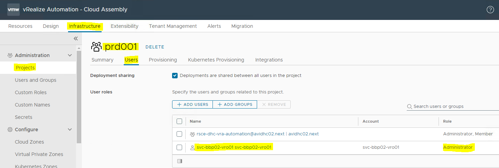

### 1.4.3 Verify Access to vRA On-Prem

Make sure that the user running the migration VRO workflow has enough permissions in vRA. Cloud Assembly Administrator role is allowed to manage Onboarding plans in VRA.

Validation: Under Assembler service go to *Infrastructure* tab and verify if *Onboarding* section is accessible.

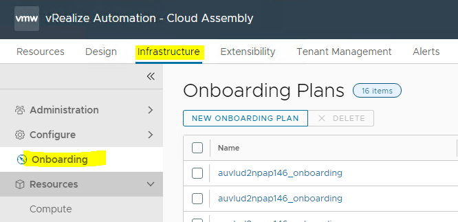

# 2 Automated Onboarding

The onboarding process is automated using 3 VRO workflows - one main workflow started by the user and 2 subworkflows triggered from the main one:

1. **dhcOnboardMultipleVms** - the main workflow where the inputs are gathered from the user
2. **dhcOnboardSingleVm** - the async workflow that is triggered from the main workflow for each VM to execute on-boarding
3. **dhcOnboardingReport** - the workflow generating and sending a summary report, triggered by the main workflow at the end of the execution.

## 2.1 VRO Workflows

### 2.1.1 The Main Migration Workflow

Workflow name: **dhcOnboardMultipleVms**

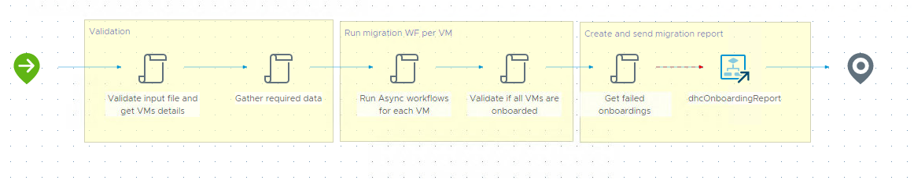

During workflow execution the following tasks are started in a sequence:

1. Parse the input file and convert it to a list of VMs and their properties and tags.
2. Extract the domain name and location code.
3. Run the "dhcOnboardSingleVm" Workflow asynchronously for each VM on the list.
4. Validate if all onboarding workflows are completed.
5. Gather errors (if any).
6. Trigger the "dhcOnboardingReport" workflow.

### 2.1.2 Single VM Migration Workflow

Workflow name: **dhcOnboardSingleVm**

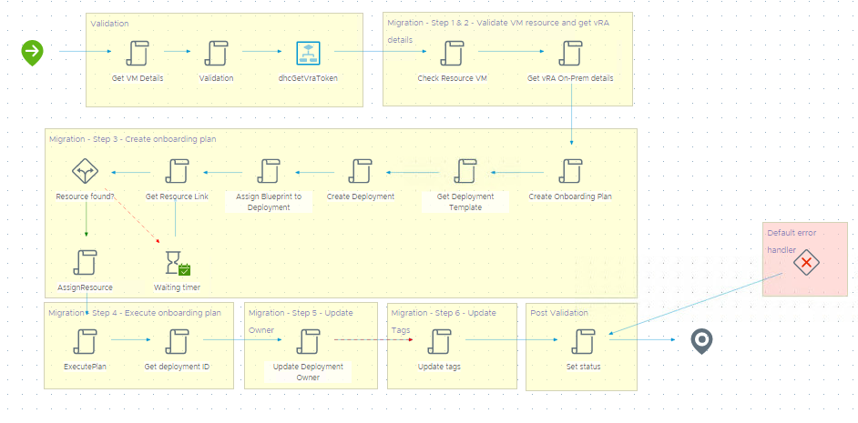

During workflow execution the following tasks are started in a sequence:

1. Get the VM details.
2. Validate the power state, VMware tools and Guest OS of the VM.
3. Get the vRA On-Prem bearer token.
4. Check the status of the VM resource in vRA On-Prem.
5. Get vRA On-Prem details.
6. Create on-boarding plan in vRA On-Prem.
7. Fetch the Day1 Cloud Template ID.
8. Add Deployment to the on-boarding plan.
9. Assign Cloud Template to the Deployment.
10. Get VM resource ID in vRA On-Prem (go through a loop until the resource is found).
11. Assign VM resource to the onboarding plan.
12. Execute the onboarding plan.
13. Get the vRA On-Prem Deployment id for onboarded VM.
14. Update the Deployment owner in vRA.
15. Update VM tags in vRA.
16. Return the migration status for the VM.

### 2.1.3 Create Migration Report Workflow

Workflow name: **dhcOnboardingReport**

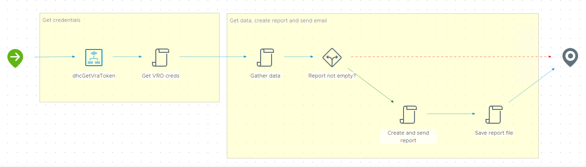

During workflow execution the following tasks are started in a sequence:

1. Get the vRA On-Prem bearer token.
2. Get the list of onboarded VMs and their details within a timeframe set in the main migration workflow.
3. Get the list of failed VM onboardings.
4. Generate the HTML migration report and send it to the e-mail address specified as the input in the main migration workflow.

## 2.2 On-boarding Procedure

In order to automatically onboard Customer virtual machines inputs data needs to be correctly filled like was described in chapter 1.4.

To begin with onboarding process make sure to logon into VRA On-Prem and open the Orchestrator service.

Navigate to **workflows** directory and run

Run the **dhcOnboardMultipleVms** workflow and provide required inputs:

1. Migration CSV file - upload the migration CSV file created in section 1.4
2. E-mail address for the migration report
3. Leave **Validation IP?** field not selected

  > Note: By default this option is disabled - do not select this checkbox!

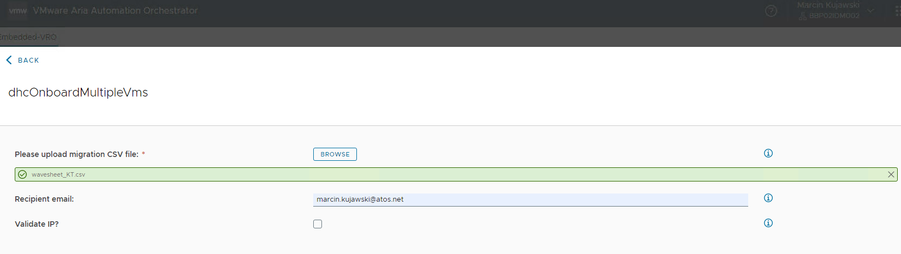

During the execution of the main workflow the status of the migrations can be monitored in the Logs tab.

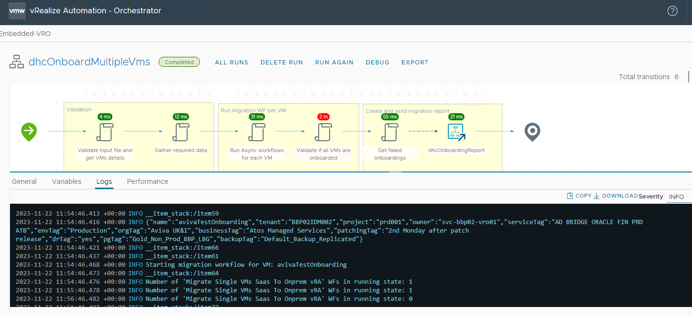

After the migration workflow is finished the migration report can be found either on email provided during WF startup as input or within vRO inside *Assets* -> *Resources* in folder **OnboardingReports/OnboardingReport_{date}.html**.

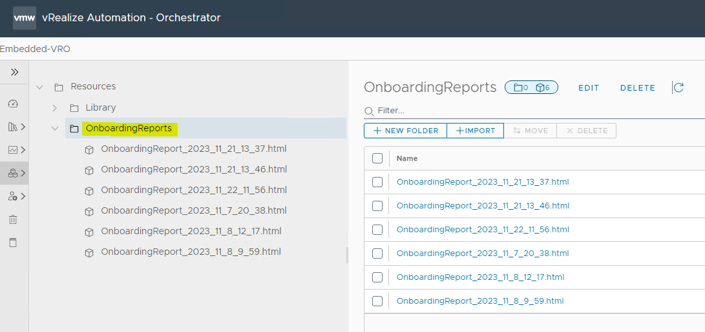

# Post Migration Report

Once all onboarding tasks are done for all VMs indicated in the CSV file, the summary report is created using **dhcOnboardingReport** workflow.

Workflow is included in the main workflow and there is no need to execute it separately.

Reason of summary report is to give user general knowledge about tasks that were executed during onboarding process, not going into deep details for each task.

The most crucial information is to validate the tags count. All data is handy available within post migration report send by email.

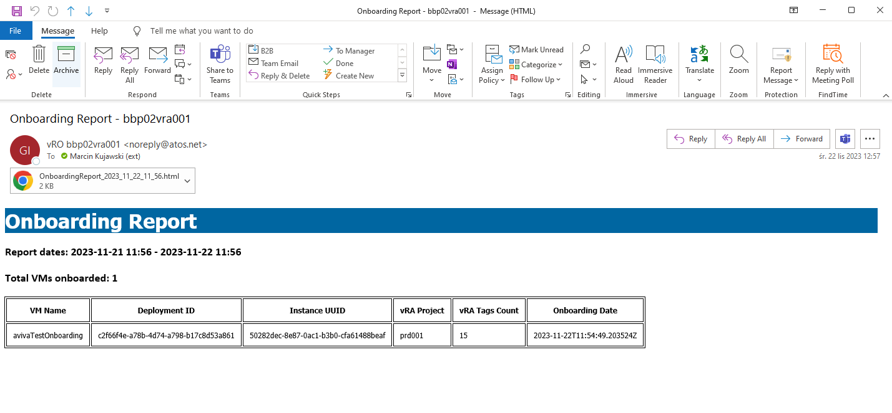

The report will also contain a section with failed onboardings. Manual intervention and careful examination is needed if failed onboardings appear in generated report.

# Migration Rollback

Please note that rollback procedure is applicable only if VM onboarding into vRA OnPrem failed because of some reasons, but deployment is present in vRA Deployments.

When onboarding for a given VM (deployment) failed please follow backout plan below:

**Rollback procedure for unsuccessful onboarding**:

1. Login to vRA Onprem with your account and go to *Assembler* service.
2. Navigate to *Resources* -> *Deployments* -> *Deployments* and click on failed deployment.
3. Select `Cloud vSphere Machine` object in topology and click on *Actions* drop down menu on right hand side.
4. Click on *Unregister* Day2 action and confirm by clicking *Submit* button.

   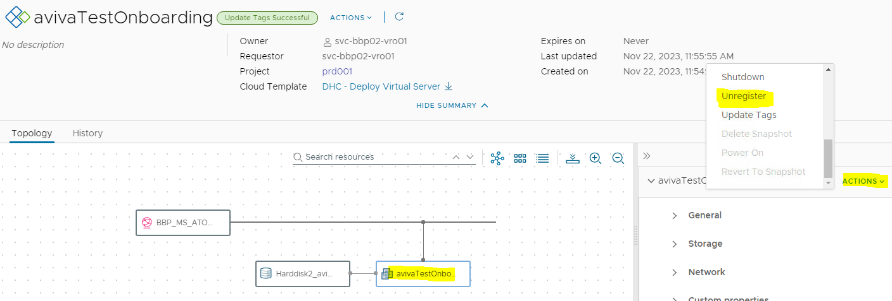
  
5. Once machine will be unregistered, you can delete the deployment.
6. Before doing that **MAKE SURE DEPLOYMENT IS EMPTY** (without machine object).
7. Click on *Actions* drop down menu on top and click *Delete* to delete the deployment. Confirm by clicking *Submit* button.

   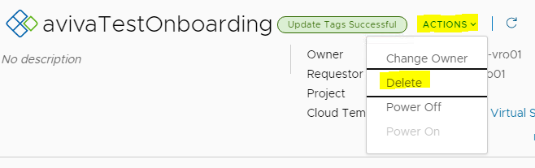

8. Once deployment is deleted, you are ready to onboard the failed VM again.
