# One Arm Load Balancer Configuration with Service Interface in NSX-T

Table of Contents

- [One Arm Load Balancer Configuration with Service Interface in NSX-T](#one-arm-load-balancer-configuration-with-service-interface-in-nsx-t)
- [Changelog](#changelog)
  - [Introduction](#introduction)
    - [Purpose](#purpose)
    - [Audience](#audience)
    - [Scope](#scope)
- [Procedure](#procedure)

# Changelog

| version | Date       | Description   | Author(s)           |
| ------- | ---------- | ------------- | ------------------- |
| 0.1     | 24-11-2021 | Initial Draft | Bhalchandra Gavhane |

## Introduction

Using a VLAN-backed Segment will allow the load balancer to direct traffic to both VM and bare metal workloads that may live on the same broadcast domain.  
Service Interface is used to connect VLAN systems from NSX-T. Thus use One arm Load balancer with service Interface to load balance the traffic on non-NSX VMs/Systems.  
The service Interface will be created on T1 router and the same will get connect to the VLAN transport zone in NSX-T.

### Purpose

Configure One Arm Load Balancer with service Interface in NSX-T.

### Audience

- VCS Operations

### Scope

The work instruction is intended to cover below tasks:

1. New T1 router configuration and connection to VLAN transport zone.
2. Load Balancer configuration on newly created T1.

# Procedure

Following is the process to configure One Arm Load balancer with Service Interface in NSX-T:

1. #### Network Setup

   1. Below network Setup contains VLAN backed VMs.
   2. T1 router with Service Interface and Load Balancer.

   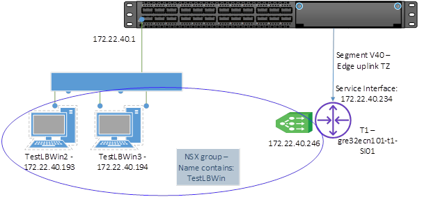

2. #### Setup the Network

   1. First create a VLAN Segment, which will be used to connect VMs to be load balanced. It should be connected to a Transport Zone that is applied to the hosts that will run the VMs and the Edge Custer that will be used to host the T1 Gateway:

      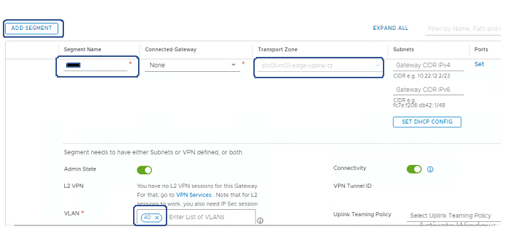

   2. Create a new T1 Gateway. It should be assigned to an Edge Cluster to run the centralized load balancer service, but doesn’t need to be connected to a T0:

      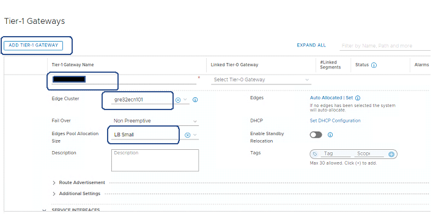

   3. Create a Service Interface on the T1 that connects to the VLAN Segment created at the start:

      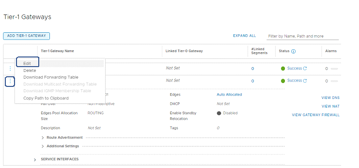

      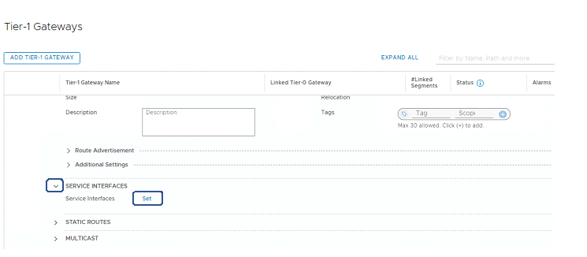

      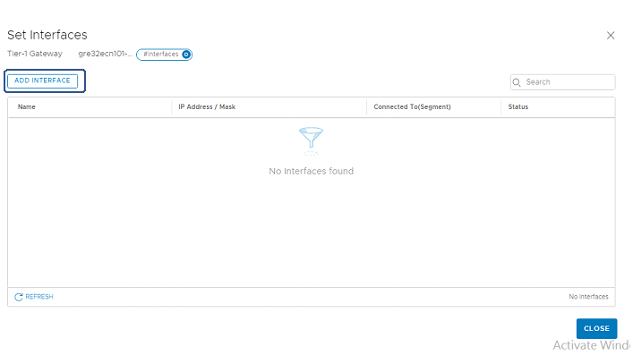

      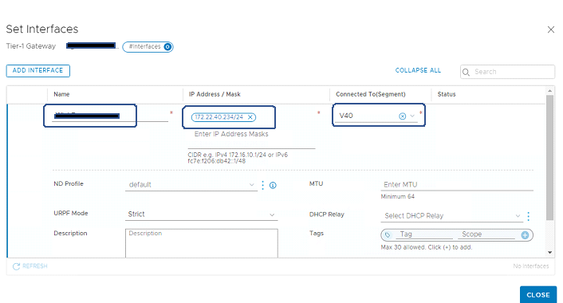

      - Give name to the Service Interface, set IP address to the Service Interface (which is from VLAN segment) and connect to the segment, which was created at the start.

      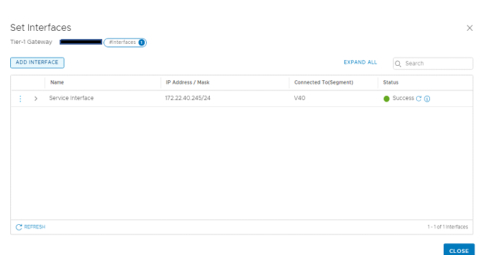

   4. Create a static route on the T1 to reach the external networks.

      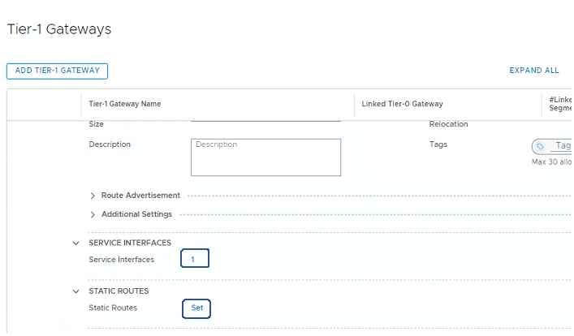

      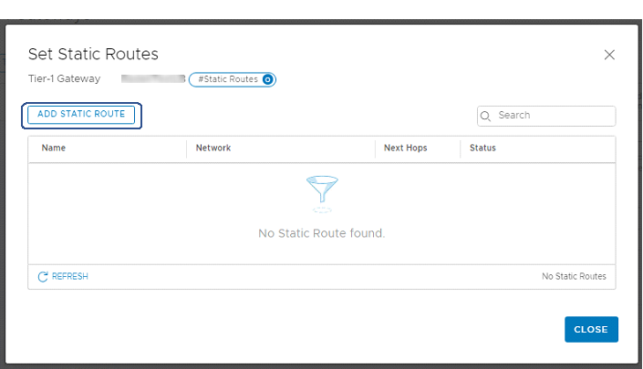

      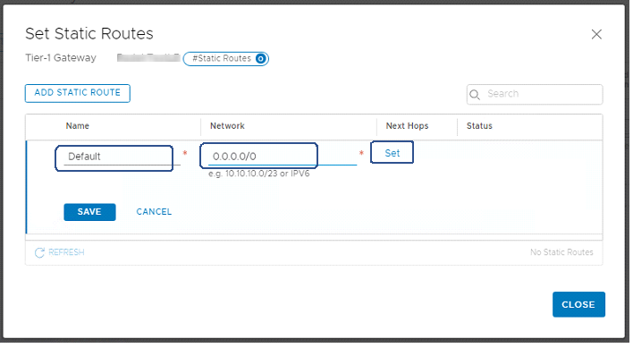

      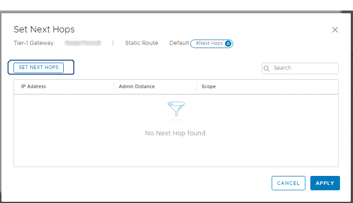

      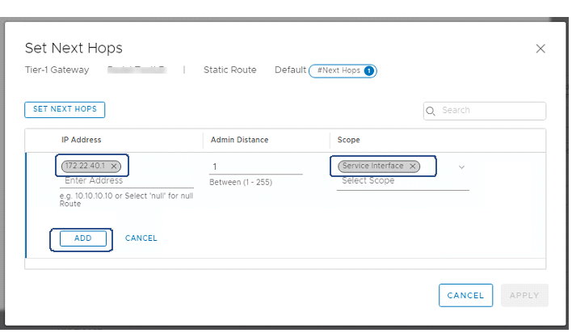

      - Set Next hop IP Address in IP Address.

      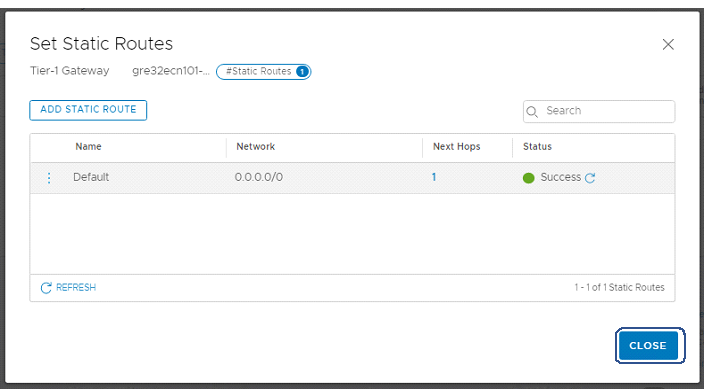

3. #### Configure the Load Balancer

   1. Create a Load Balancer in **Load Balancing > Load Balancers > Add Load Balancer** and attach it to the T1 Gateway:

      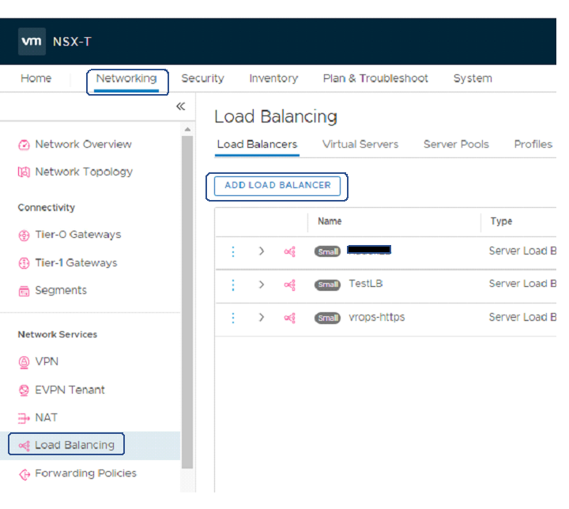

      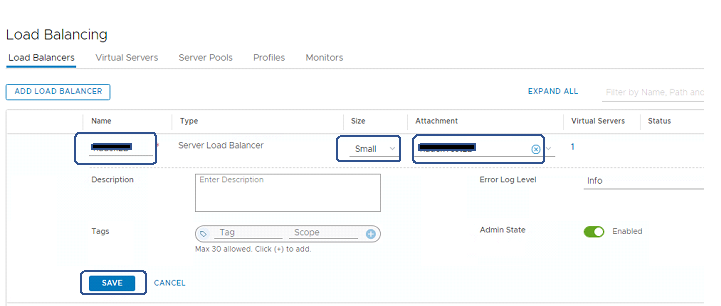

      - Give name to Load Balancer, define size and Attach T1 Router in Attachment.

   2. Create a **Server Pool** to specify which back-end servers are to be load balanced. Note that the SNAT Translation Mode is set to Automap, which means the Source IP will be that of the T1 rather than the original client IP.

      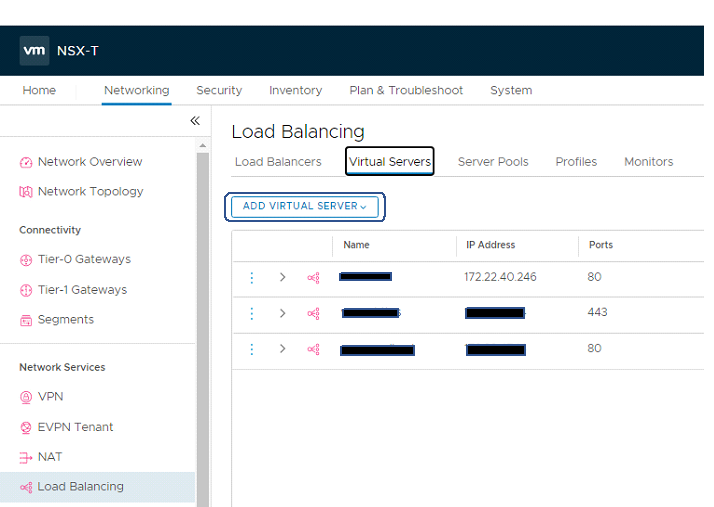

      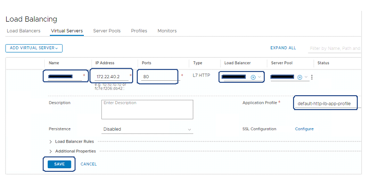
      - Assign the VIP (172.22.40.246-as per Network Setup), Set Port, Load Balancer, Server Pool, Application Profile.

   3. The **Members/Group** contains the criteria to match the back-end servers, this could be using Tags, VM Names, or for non-NSX-aware workloads such as bare metal IP addresses:

      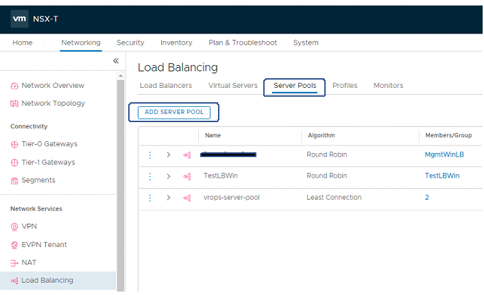

   4. Create a **Virtual Server**, which acts as the entry point to the Load Balancer, setting the virtual IP/port/protocol. It needs to reference the Pool that’s just been created and is attached to the Load Balancer:

      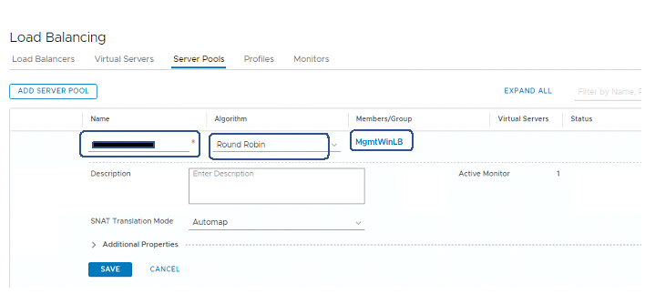

      - Give a Server Pool name, select Algorithm and Server Group/Members.

      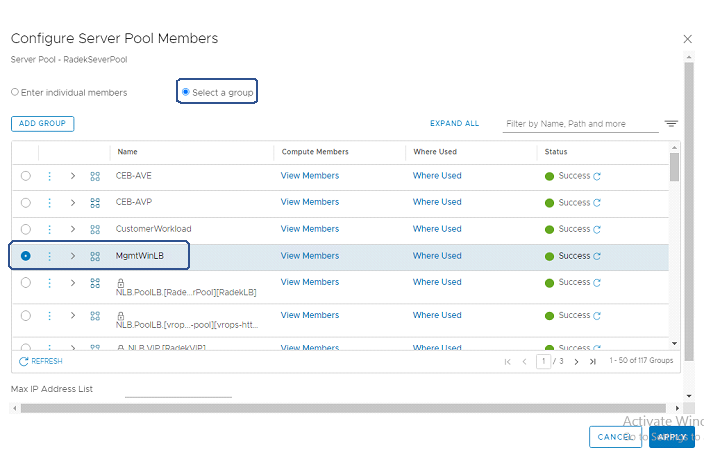

4. #### Checking the traffic

   1. Check the telnet connectivity.

      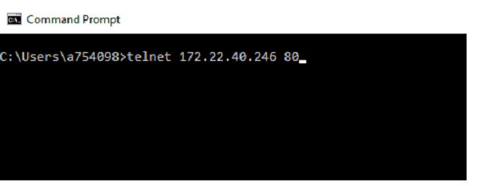

      

   2. Check with browser.

      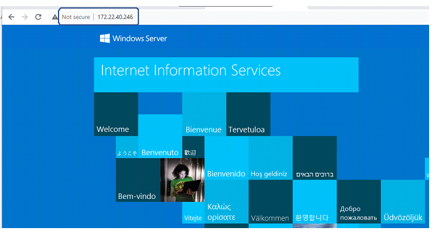

   3. Checking the statistics shows traffic going to both the VM workloads, which was specified by IP:

      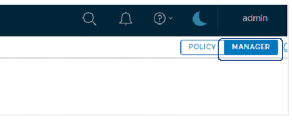

      - Click on Manager to start the NSX-T Manager mode.

      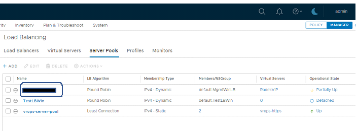

      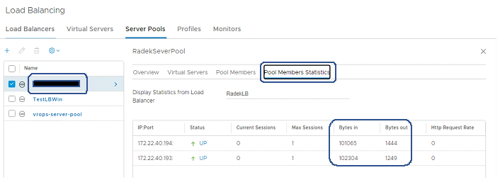
