# Rotate ONTAP tools passwords

## Table of Contents

- [Rotate ONTAP tools passwords](#rotate-ontap-tools-passwords)
  - [Table of Contents](#table-of-contents)
  - [Introduction](#introduction)
    - [Purpose](#purpose)
    - [Audience](#audience)
    - [Scope](#scope)
    - [Prerequisites](#prerequisites)
  - [Action Plan](#action-plan)
    - [Pre-checks](#pre-checks)
    - [Password rotation for administrator account](#password-rotation-for-administrator-account)
    - [Password rotation for database account](#password-rotation-for-database-account)
    - [Post-checks](#post-checks)
  - [Changelog](#changelog)

## Introduction

### Purpose

This instruction covers the manual password rotation of administrator and database local accounts for the ONTAP tools.

### Audience

- VCS Engineers
- VCS Architects

### Scope

The Instruction covers the password rotation procedure for the following ONTAP tools accounts:

- administrator
- derbyDB

### Prerequisites

- Reasonable grasp of VCS infrastructure and VMware components
- Access to the vCenter
- Access to the HashiVault
- Basic vCenter Knowledge
- Basic SRM Knowledge
- CTASK to perform password change activity

## Action Plan

### Pre-checks

We need to ensure that passwords are changed every 3 months, so the change needs to be planned and raised in advance. If not changed in time, the passwords will expire and this will impact Disaster Recovery tests.

### Password rotation for administrator account

You can change the administrator password of ONTAP tools post deployment using the maintenance console.
>**Note**: Password expires after **90** days, however password expiry warning is shown after 75 days of resetting the password. </br>
> After performing the password change in ONTAP tools, SRA credentials will also need to be updated. This needs to be done only for the **administrator** user account.</br>
> If password is already expired, **Main Menu** won't be visible anymore. Instead you'll be prompted to change the expired accounts. In this case, enter 1 to change administrator user password.
    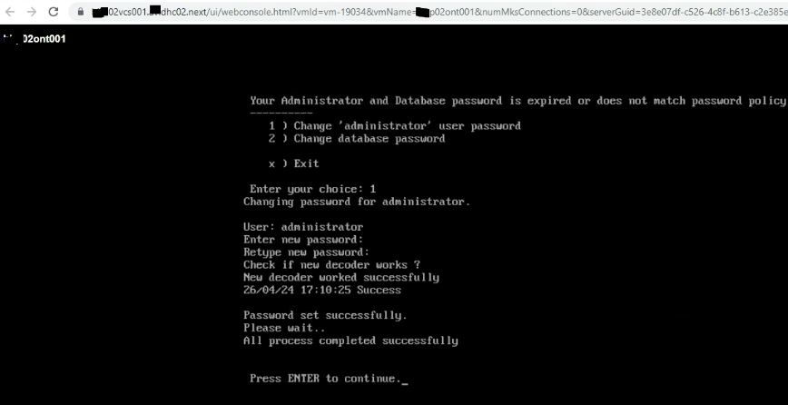

Below are the steps for changing the ONTAP tools administrator password:

1. Login to vCenter and open web console for ONTAP tools appliance. Additional pop-up window will be displayed to launch the web console, click **OK**.

    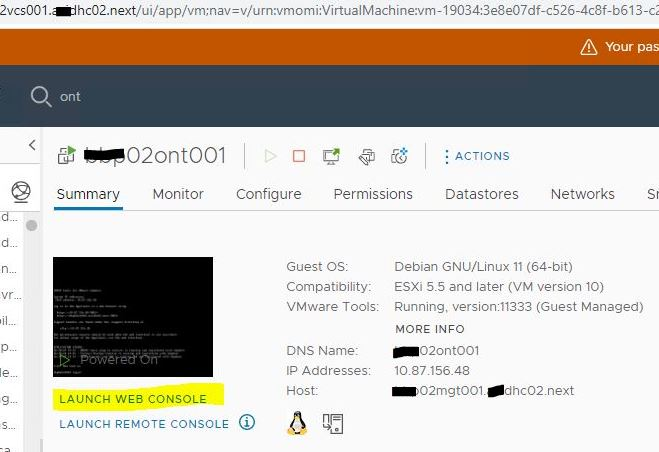

    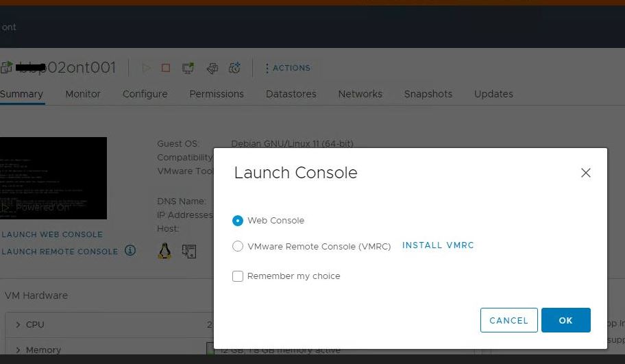

2. Login with **maint** account. Password for this account is available in vault.

    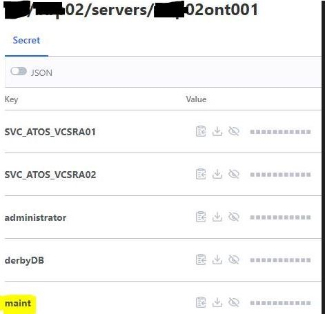

    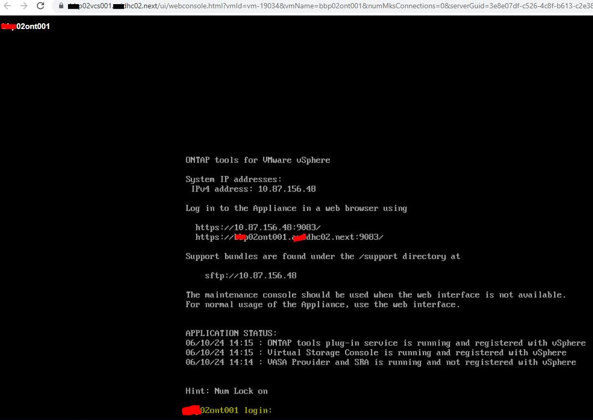

3. At login **Main Menu** will be displayed. Enter 1 in the maintenance console to select **Application Configuration**.

    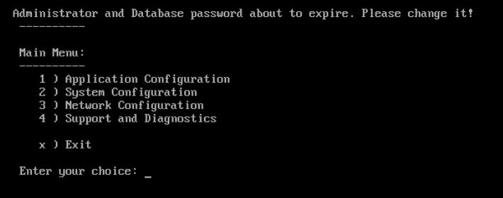

4. Enter 6 to select **Change 'administrator' user password**.

    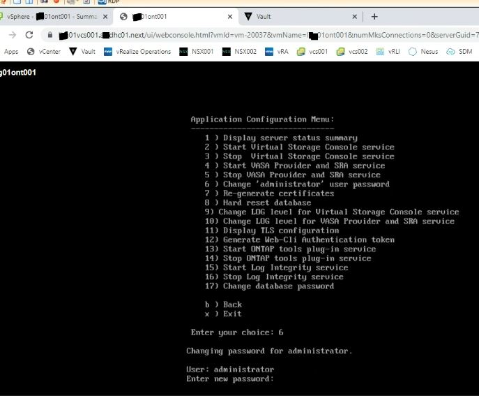

   > Enter a password with a minimum of eight characters and a maximum of 30 characters. The password must contain a minimum of one upper, one lower, one digit, and one special character. The new password cannot be the same as the last used password.

5. Enter **y** in the confirmation dialog box.
6. Login via ssh to SRM appliance using **admin** account and switch to **root** account, using `su root` or `sudo -i` command.
7. Retrieve and save the **docker ID** used by SRA docker using command:

     ```bash
     docker ps -l
     ```

     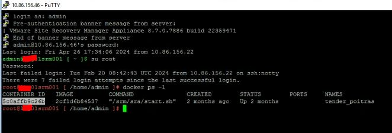

8. Login to the docker ID:

     ```bash
     docker exec -it -u srm <docker ID> sh
     ```

     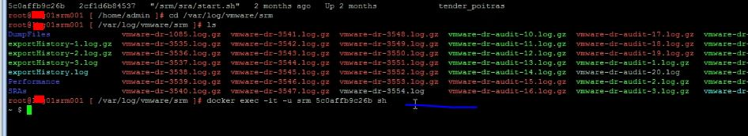

9. We delete the contents of the **/srm/sra/conf** directory after we move to that specific folder. We do that using the following commands:

     ```bash
     cd /srm/sra/conf
     ```

    >**Note**: Without login in to docker ID we won't have access to srm/sra/conf folder, which will need to be cleaned off before resetting the password.

     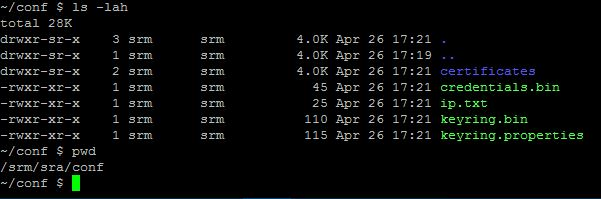

     ```bash
     rm -rf *
     ```

    > **Note**: Once the conf folder is cleaned, we need to navigate one folder up, to **/srm/sra**:

     ```bash
     cd /srm/sra/
     ```

10. Execute the perl command to configure SRA with the new credentials:

     ```bash
     perl command.pl -I <otv-IP> administrator <otv-password>
     ```

    > **Note**: `otv-IP` is the IP of the ONTAP tools and the `otv-password` is the password for the administrator that we just reset.</br>
    > If conf directory was cleaned before resetting the password, then a success message will show "Success: Successfully configured the SRA adapter". If instead the cleanup action was not previously done, this message will be displayed instead: "SRA adapter already configured...". This situation is identified in the below print-screen:

     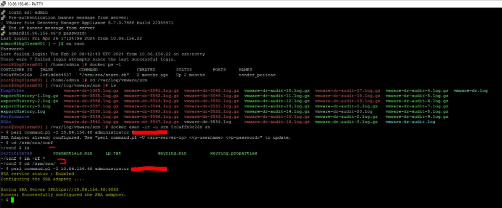

11. Update the password in Vault.

     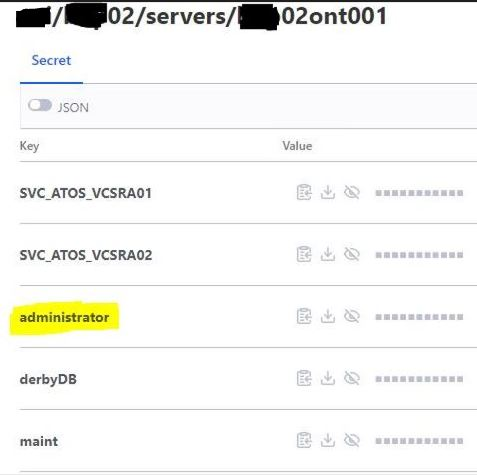

### Password rotation for database account

The ONTAP tools database account is a local account present only in ONTAP tools and it will be changed only on this appliance side.

Follow the same previous steps (1 -> 4) mentioned in administrator password change case, but this time for changing database local account password for the ONTAP tools only.

- Enter 17 this time to select **Change database password**. Change the password when prompted.

     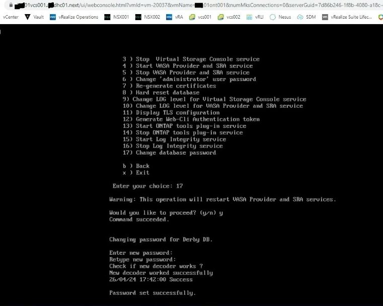

- Update the password in Vault.

     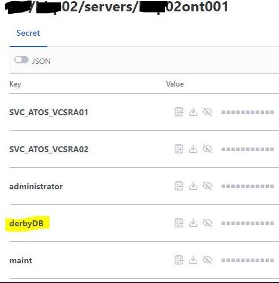

### Post-checks

Login to SRM from vCenter side and re-scan array pairs. No warnings should be displayed. In order to do that we follow the steps:

1. Login to vCenter with your local account.

     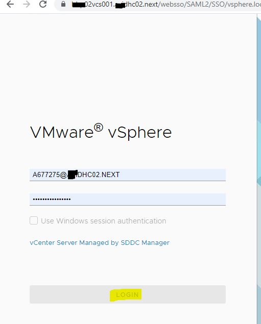

2. Login to SRM. Please check the following steps for this.

   - From left menu, choose **Site Recovery**:

     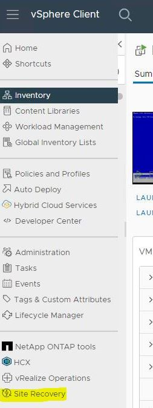

   - On the Site Recovery page choose **OPEN Site Recovery**. You will be prompted to login with the SSO account into local vCenter. This account is the only one with permissions to login into SRM, so we need to use it.

     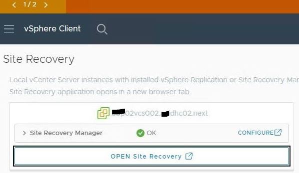

     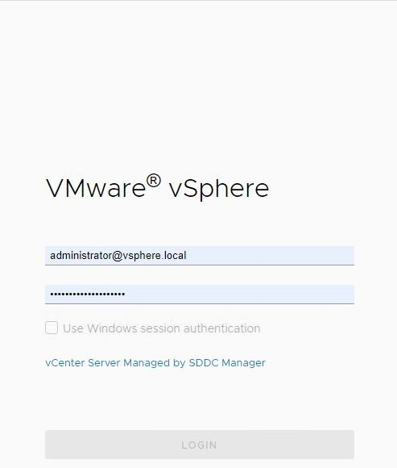

   - Site Recovery configured pairs will be displayed, however we need to click on the **VIEW DETAILS** button so that we can access the array pairs and protection groups details.

     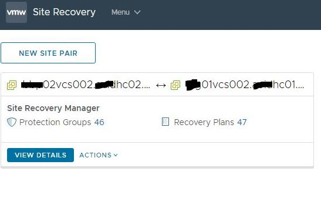

   - You will be prompted to login with the SSO account of the remote vCenter.

     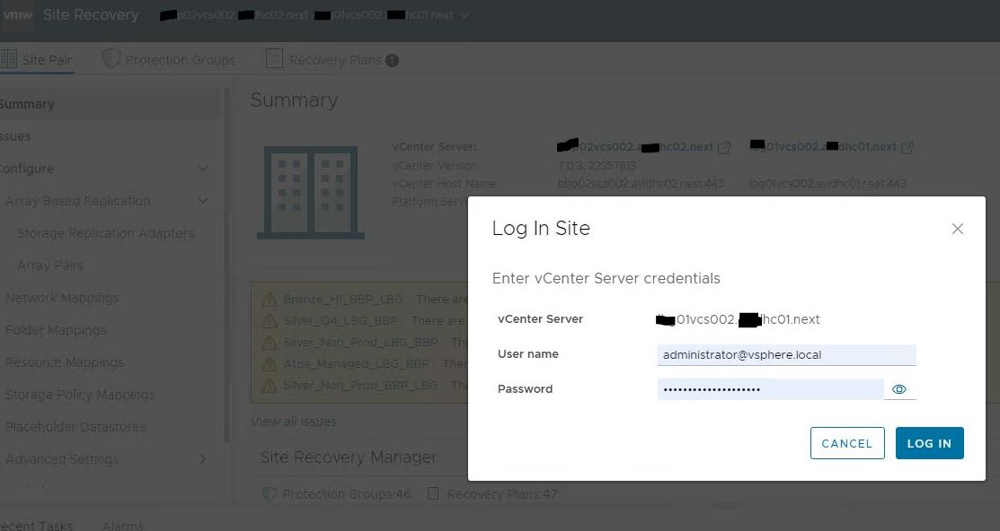

3. We discover the devices for the Array Pairs. This discovery is being made through SRA adapter. To do that we navigate to **Site Pair** -> **Configure** -> **Array Pairs** -> select the array pair from the right column and **DISCOVER DEVICES** option will appear. Click on it.

     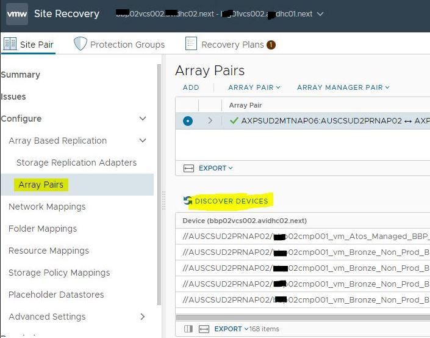

4. On the **Discover Replicated Devices** window, we choose **YES**:

     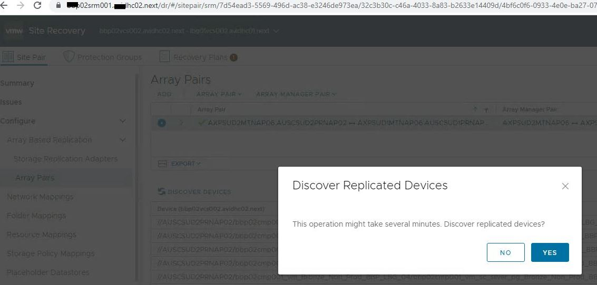

5. The discovery operation will start. Wait until it finishes successfully. This operation will recompute device and datastore groups as well.

     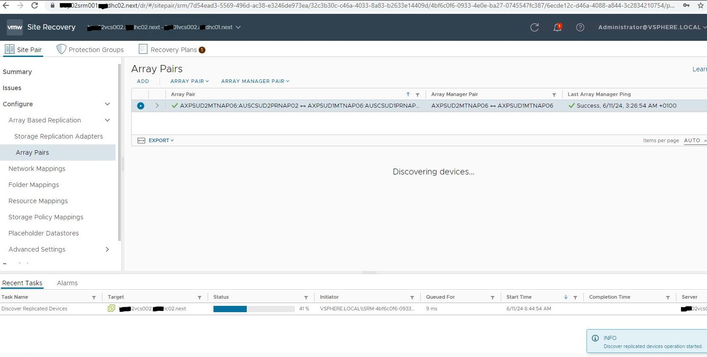

     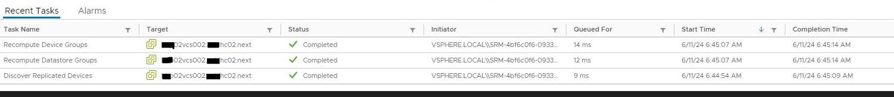

## Changelog

| Version | Date          | Description                                                                                                                                                         | Author             |
|---------|---------------|---------------------------------------------------------------------------------------------------------------------------------------------------------------------|--------------------|
| 0.1     | 10/06/2024    | First version | Lupu Adriana |
