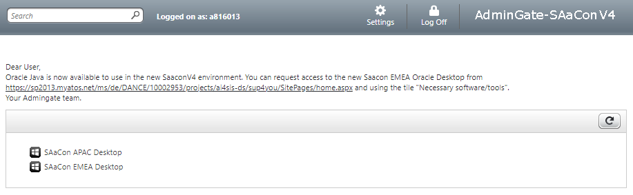
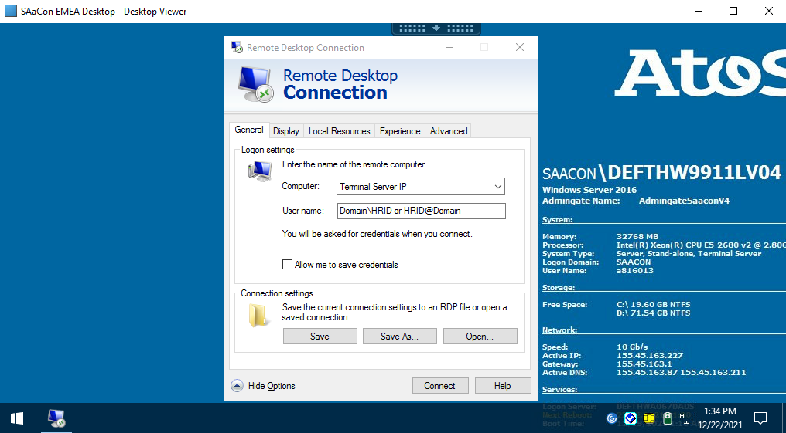
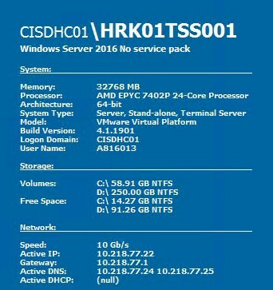

# Table of Contents

- [Table of Contents](#table-of-contents)
- [List of Changes](#list-of-changes)
  - [Introduction](#introduction)
    - [Purpose](#purpose)
    - [Audience](#audience)
    - [Scope](#scope)
- [Related Documents](#related-documents)
- [Prerequisites](#prerequisites)
- [Logging in into VCS production environment](#logging-in-into-vcs-production-environment)

# List of Changes
  
| Version | Date       | Description      | Author       |
| ------- | ---------- | ---------------- | -------------|
| 0.1     | 21.12.2021 | First version    | Adam Szymczak |

## Introduction

### Purpose

Log in into VCS production environments.

### Audience

- VCS Operations

### Scope

1. Prerequisites
2. Logging in into VCS production environment

# Related Documents

N/A

# Prerequisites

To be able to log in to production environment make sure you have:

1) Connection to **URA** (if you are using office network it`s not needed)

2) **SAaCon** access (provided by line manager)

3) **Citrix Workspace** application from Company Portal installed

4) Environment access details (Terminal server IP and domain name)

5) Account on production environment

# Logging in into VCS production environment

1) Connect to **URA** on device you will use to access the environment, the connection is required to reach **SAaCon** which is used to access environments (if you use office network this step can be skipped)

2) Log in to **SAaCon** using this login page - <https://emea-de-090.asn.saacon.net/Citrix/SaaconV4/auth/login.aspx>

3) On next screen select **SAaCon EMEA Desktop** option, this will download **launch.ica** file to your computer 

4) Open the file using **Citrix Workspace** application, this will open remote desktop connection to SAaCon machine that can be used to log in to production environments

5) On window that opens open application that allows remote desktop access (for example Remote Desktop Connection)

6) Provide Terminal server IP and user name as show in below screen, the IP of server and domain should be provided by person that created your account on environment 

7) When connecting provide password for the account, initial password will be provided by person that created the account

8) When you login you should notice on right side of the desktop data similar to one below, first line is where domain and location code are shown (for example for picture below domain is **CISDHC01** and location code is **HRK01**, where **TSS001** is name of terminal server connected) 

9) Using data obtained earlier it is possible to login to **vCenter** of environment by accessing **`https://<locationCode>vcs001.<domain>.next/`**. Another important appliance is Hashi Vault holding passwords to some appliances used in environment which can be accessed with **`https://<locationCode>hsv001.<domain>.next:8200`**. Both use Active Directory and can be accessed by web browser with environment login (with domain, for example `HRID@Domain.next`) and password. For example using data from picture above the addresses would be **`https://hrk01vcs001.cisdhc01.next/`** and **`https://hrk01hsv001.cisdhc01.next:8200`**.

10) Using data found in vCenter and Hashi Vault other appliances might be accessed to depending on rights assigned to account created
