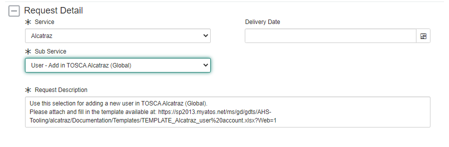
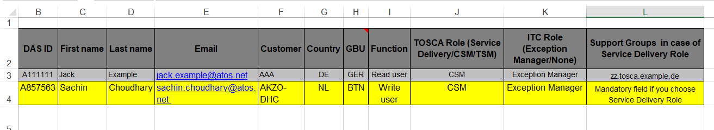

# RBAC Management

# Table of Contents

<!-- TOC -->
- [RBAC Management](#rbac-management)
- [Table of Contents](#table-of-contents)
- [List of Changes](#list-of-changes)
  - [Introduction](#introduction)
    - [Purpose](#purpose)
    - [Audience](#audience)
    - [Scope](#scope)
- [Related Documents](#related-documents)
- [Instructions](#instructions)
  - [AD Access](#ad-access)
  - [vRA Cloud Access](#vra-cloud-access)
  - [SNOW Access](#snow-access)
    - [Steps](#steps)
    - [Examples of Access in SNOW](#examples-of-access-in-snow)
  - [TOSCA/ITC Portal Access](#toscaitc-portal-access)
<!-- TOC -->
# List of Changes

| Version | Date | Author | Issue | Changes |
|---------|------|------| ----|---------|
| 0.1 | 07.12.2021 | Margo Piliukh | | Document creation |
| 0.2 | 24.02.2022 | Margo Piliukh | DHC-3532 |Added TOSCA/ITC access request |

## Introduction

### Purpose

Check and adjust RBAC access rights for left and joined operational admins as a part of VCS Production Plan.

### Audience

- VCS Operations

### Scope

This document covers RBAC management on the following platforms:

- Active Directory access
- vRA Cloud access
- SNOW access
- TOSCA/ITC Portal Access

# Related Documents

This task is presented as a part of Production Plan and is included in [dhcProductionPlan.md](./dhcProductionPlan.md) document.

The task of verifying and adjusting Role-Based Access Control for operational admins involves manual and automated tasks based on Ansible playbooks in Manage phase:

| Access type| Automation     | Playbook             |
| ------- | ---------- | ------------------------ |
| AD  | YES | manageAdAccounts.yml|
| | | createAuthorizationMatrixReport.yml|
| vRA Cloud | YES | manageVraCloudUsers.yml|
| SNOW | NO | n/a |
| TOSCA/ITC | NO | n/a |

# Instructions

These actions should be performed on the **last working day of each month** as defined in the Production Plan. The task of checking and adjusting RBAC access rights should be a regular monthly task, however, in case of need or urgency the creation/amendment/removal of a user from either platform can be performed any time of the month through a standard or non-standard change.

## AD Access

In order to generate a full report of the users currently present in AD with the description of their roles, run the following playbook from /opt/dhc/manage folder on ans001 server:

```shell
ansible-playbook createAuthorizationMatrixReport.yml
```

To manage the AD user accounts and roles, use the following playbook from /opt/dhc/manage folder on ans001 server.
Make sure the **input file** is prepared and located in **/tmp** directory of this server. Example input file can be checked in the ***files*** folder of the role **dhc-manageAdAccounts**.

```shell
ansible-playbook manageAdAccounts.yml
```

After all the changes are done, generate the **Authorization Matrix** once again and upload it in the **SharePoint of CES Evidence Repository** under the appropriate customer folder.

The Authorization Matrix must be **approved** by **VCS Service Responsible Manager** and the approval must be uploaded in the same location.

## vRA Cloud Access

At the end of each month verify if change in access rights is required for any user on vRA Cloud.

Currently there is no automation in place for generating a report of existing users and their roles in vRA Cloud.

In order to manage vRA Cloud users, run the following playbook from /opt/dhc/manage folder on ans001 server.

```shell
ansible-playbook manageVraCloudUsers.yml
```

Instructions on how to use this playbook are described [here](./wiManageVraUsersAndRoles.md).

## SNOW Access

Members of DevSecOps Team are required to have ATF2 Specialist security assignment as well as visibility assignment for the particular customers they are handling. Each member of the DevSecOps Team is also assigned to the following SNOW groups:

- ZZ.Cloud.DHC-DevSecOps
- ZZ.Cloud.DHC-JIRA

This must be requested or removed as needed by raising an Automated Request in self-service catalog “Atos Internal Service Catalog".

### Steps

1. Login to SNOW
2. Navigate to Self-Service -> Service Catalog
3. Atos Internal Service Catalog -> GDTS -> Service Request Management (ServiceNow) -> User Group Assignment
4. Fill in the required details on the form:

   **Add / Remove** --> Add/Remove

   **User to be added/removed** --> User Name

   **Group Type** --> Visibility/Assignment/Security as per your need

   **Group** = enter the necessary group name

   **Justification** = enter reason why access is needed

5. Click **Order Now**

### Examples of Access in SNOW

| Group| Group Type  |
| ------- | ---------- |
| ATF 2 Specialist  | Security |
| AkzoNobel (Parent) | Visibility |
| ZZ.Cloud.DHC-DevSecOps | Assignment |

## TOSCA/ITC Portal Access

All members of DevSecOps Team should have access to the TOSCA Portal in order to perform Production Plan activities like CSA Score Report or Alcatraz Upload Checks. ITC access is also needed for registering any exceptions.

The following roles are to be requested:

| Role Type | Role Name  |
| ------- | ---------- |
| TOSCA Role | CSM |
| ITC Role | Exception Manager |

In order to request access follow these steps:

1. Login to SNOW
2. Navigate to **Self-Service** -> **Service Catalog**
3. Select **Atos Internal Service Catalog** -> **GDTS** -> **System Management Requests (AHS-T \ GTS-A)** -> **Generic Service Request**
4. Fill in the required fields in the form as follows:

   

5. Follow the link presented in the request form and download it. You will have to fill in this Excel file with the information for whom access is requested and what type of access should be granted. Specify the roles described above.

   Example form is presented below:

   

   After the request is processed the user will receive an email notification with the links to the respective sites - TOSCA and ITC.
