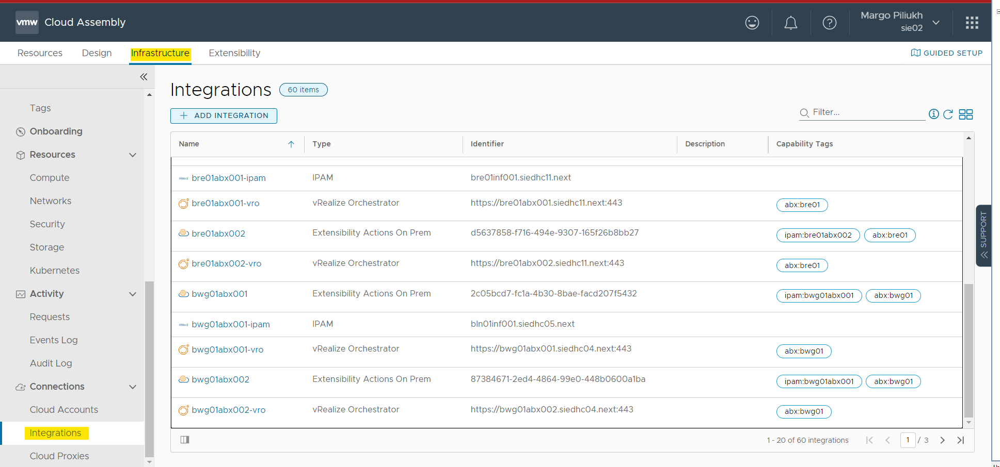
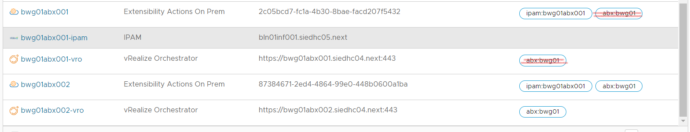
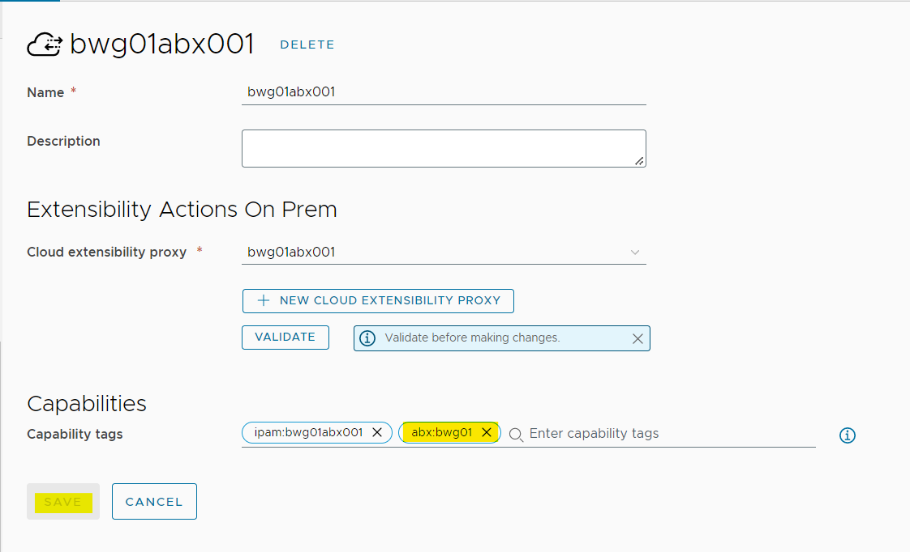
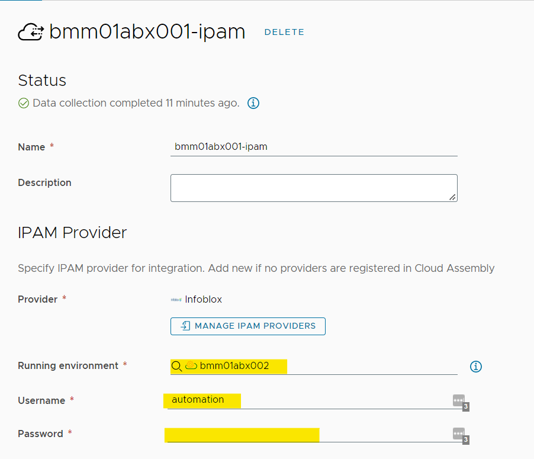
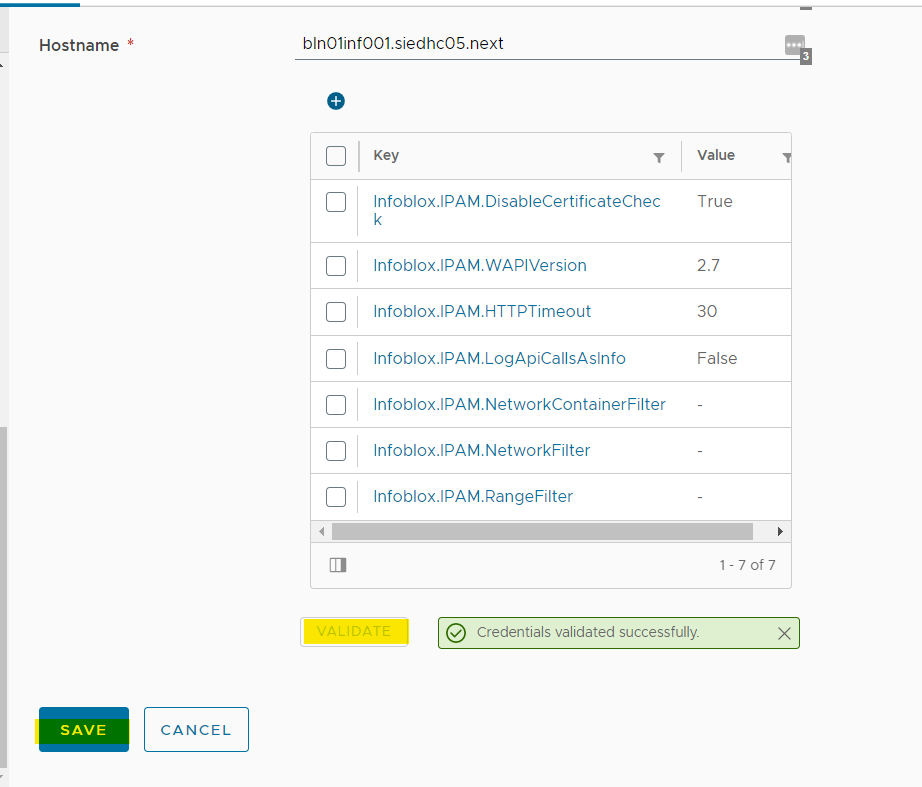

# Reboot ABX Appliance

## Changelog

|    Date    |    Issue   | Author | Description |
|------------|-----------|--------|-------------|
| 03.01.2023 |  CESDHC-5502 | Margo Piliukh | Initial document creation |

## Introduction

### Purpose

Reboot the ABX appliance in production as a troubleshooting measure.

### Audience

- VCS Engineers
- VCS Operations

### Scope

- Switchover to a secondary ABX appliance for the time of reboot
- Reboot of the ABX appliance

## Step-by-step Process

### Switchover to Secondary ABX

Depending on which ABX appliance needs to be rebooted as a part of troubleshooting or other valid reason, a switchover to the secondary ABX appliance has to be made in vRA Cloud portal.

#### Remove Tags

1. Log into vRA Cloud portal.
2. Navigate to **Cloud Assembly** -> **Infrastructure** -> **Integrations**. Depending on the organization you might see integrations for multiple sites, as it is in Siemens. Find the integrations related to your site.

   

3. Normally the tags will match for both abx001 and abx002 as well as the vRO part of it. You need to remove the *`abx:<location>`* tag.

   

4. Open each integration item to remove the tag. Click on the **X** to delete the tag, and click **Save**. Perform this for both ABX and vRO integrations.

   

#### Switch ABX in IPAM Integration

1. While on the same page in vRA (**Integrations**), open the relevant for your site IPAM integration.
2. Change the ABX selection to the secondary one and provide the credentials for *automation* account for Infoblox. You can find the password in the HashiCorp Vault.

   

3. Click **Validate** button to validate provided credentials. When successful - click **Save**.

   

### Reboot ABX Appliance

After the switchover of the faulty ABX to the healthy one, you can reboot the former one with no impact to SSRs or second day actions in vRA Cloud.

It is advised to shut down the ABX appliance and power it on again instead of regular reboot.

1. Log into vCenter server.
2. Locate the ABX Appliance to reboot.
3. Click on **Actions** -> **Power** -> **Shut Down Guest OS**.
4. After the shut down, wait a couple of minutes and power the machine on. It takes some 30-40 minutes to start all the services on ABX after a reboot.

### Post-Troubleshooting

Remember to revert the changes you've made in the vRA Cloud after the issue is resolved.
