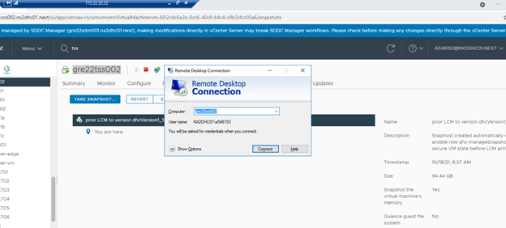
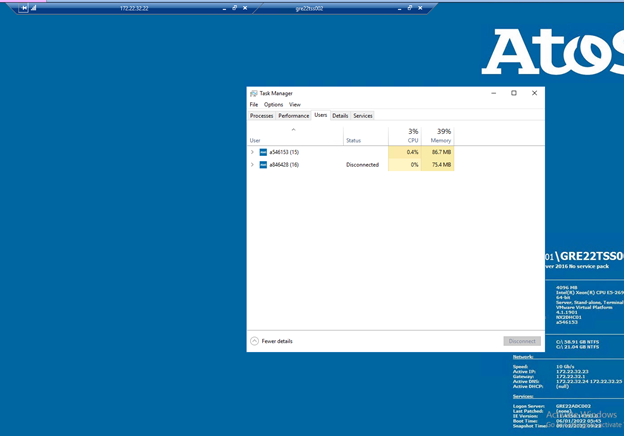
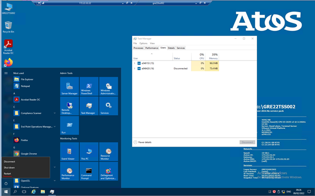
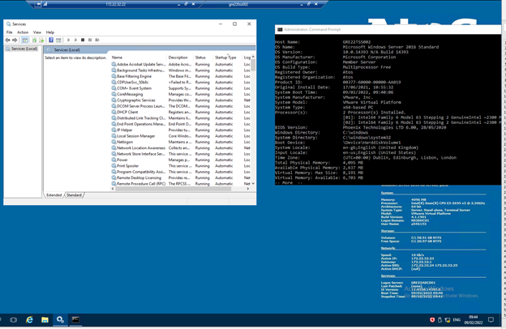
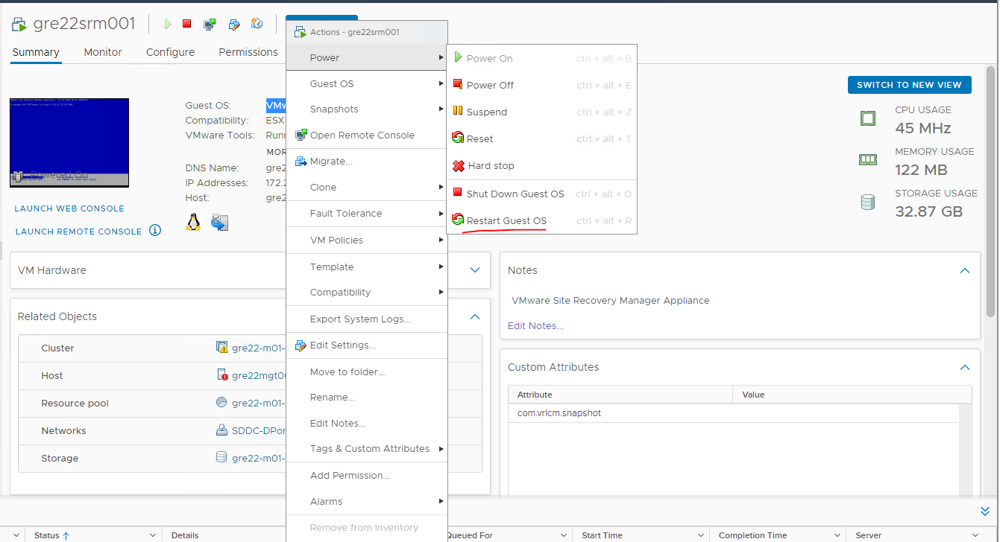
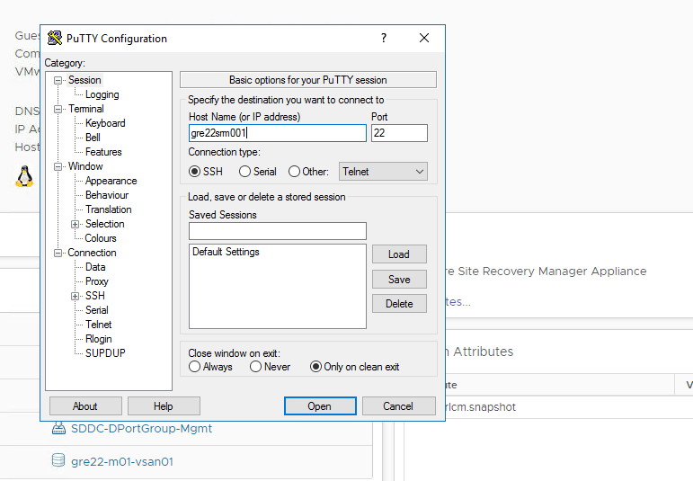
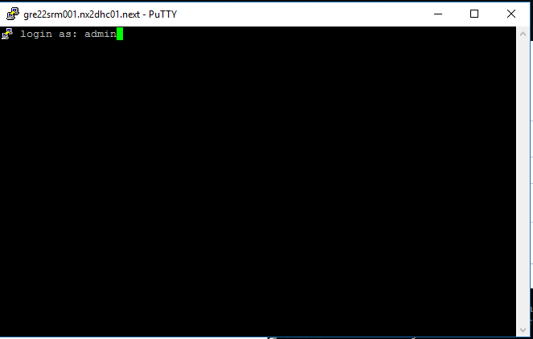
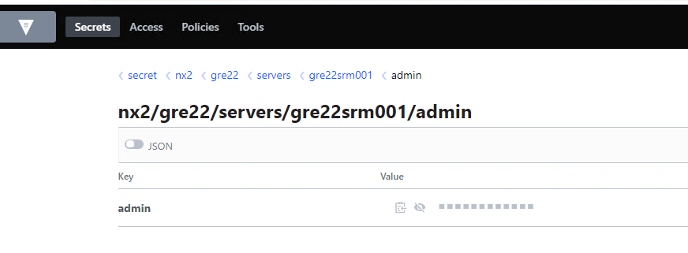
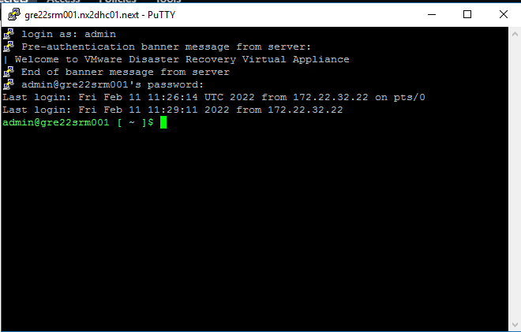

# Reboot Management VM

## Table of Contents

- [Reboot Management VM](#reboot-management-vm)
  - [Table of Contents](#table-of-contents)
- [Changelog](#changelog)
  - [Introduction](#introduction)
    - [Purpose](#purpose)
    - [Audience](#audience)
    - [Scope](#scope)
  - [Windows servers](#windows-servers)
  - [1.RDP to management VM](#1rdp-to-management-vm)
  - [2.Check if there is someone logged in  on the server](#2check-if-there-is-someone-logged-in--on-the-server)
  - [3.Reboot the server](#3reboot-the-server)
  - [4.Check RDP connection and services after server reboot](#4check-rdp-connection-and-services-after-server-reboot)
  - [VMware Photon OS and Unix](#vmware-photon-os-and-unix)
  - [1 Reboot the server](#1-reboot-the-server)
  - [Check if server is reachable after reboot using Putty](#check-if-server-is-reachable-after-reboot-using-putty)

# Changelog

| Issue   | Date         | Description              | Author          |
| ------- | ----------   | ------------------------ | --------------- |
| DHC-4078| 11/02/2022   | First version            | Berte Petru     |

## Introduction

### Purpose

Reboot and verify the functionality of management Windows VMs.

### Audience

- VCS Operations

### Scope

- Reboot management VM

## Windows servers

## 1.RDP to management VM

Open Remote Desktop to logon to the server

## 2.Check if there is someone logged in  on the server

If yes check with the user if the servers can be rebooted without interfering with their work

## 3.Reboot the server

## 4.Check RDP connection and services after server reboot

Check if all automatic services are started.

Use the command **systeminfo | more** to check the uptime of the server

## VMware Photon OS and Unix

## 1 Reboot the server

Log into the vCenter Server and find the VM you want to reboot. Select 'Actions' -> 'Restart Guest OS'.

## Check if server is reachable after reboot using Putty

Log into the server via SSH using admin account. Credentials are located in HashiCorp Vault.

