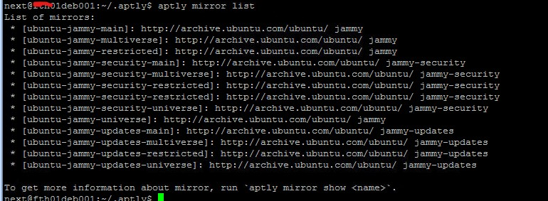
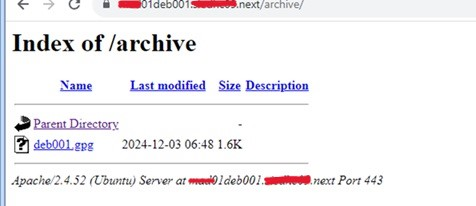
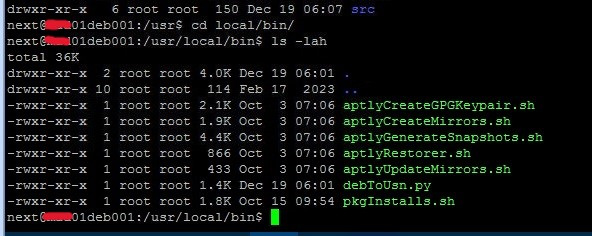
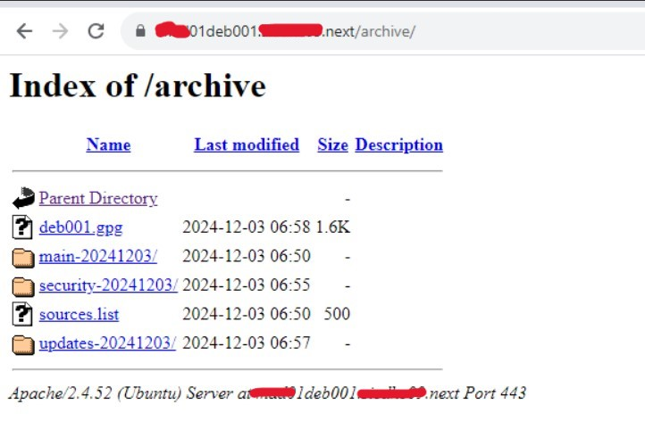

# Rebuild deb repository

## Table of Contents

- [Rebuild deb repository](#rebuild-deb-repository)
  - [Table of Contents](#table-of-contents)
  - [Changelog](#changelog)
- [Introduction](#introduction)
  - [Purpose](#purpose)
  - [Audience](#audience)
  - [Scope](#scope)
- [Verify deb repository status](#verify-deb-repository-status)
- [Cleanup and backup repository](#cleanup-and-backup-repository)
- [Install aptly tool](#install-aptly-tool)
- [Rebuild deb repository](#rebuild-deb-repository)

## Changelog
  
| Version | Date       | Description      | Author       |
| ------- | ---------- | ---------------- | -------------|
| 0.1     | 30.01.2025 | First version    | Lupu Adriana |

# Introduction

## Purpose

Provide steps to be taken in case deb repository is broken and mirrors need to be re-created.

## Audience

- VCS Operations

## Scope

- Verify deb repository health
- Perform repository cleanup and backup
- Rebuild deb repository

# Verify deb repository status

To check the deb local repository and aptly mirrors, below command should be ran using next account, from home directory, aptly folder: '/home/next/.aptly/'.

```shell
 aptly mirror list
```

Command should list mirrors and the output should be similar to the example in the image below:



If mirrros are not listed as in the example above and repository is broken, rebuilding of repository might be needed. Please follow the steps below.

# Cleanup and backup repository

Before rebuilding, repository cleanup will be needed.

1. List the published repositories using command below. Each reporsitory from the list will need to be dropped later on.

   ```shell
   aptly publish list
   ```

   Output for this command will look similar to this:

   ```shell
     * main-20241022/jammy (origin: Ubuntu) [amd64] publishes {main: [ubuntu-jammy-main-20241022]: Snapshot from mirror [ubuntu-jammy-main]: http://archive.ubuntu.com/ubuntu/ jammy}, {multiverse: [ubuntu-jammy-restricted-20241022]: Snapshot from mirror [ubuntu-jammy-restricted]: http://archive.ubuntu.com/ubuntu/ jammy}, {restricted: [ubuntu-jammy-multiverse-20241022]: Snapshot from mirror [ubuntu-jammy-multiverse]: http://archive.ubuntu.com/ubuntu/ jammy}, {universe: [ubuntu-jammy-universe-20241022]: Snapshot from mirror [ubuntu-jammy-universe]: http://archive.ubuntu.com/ubuntu/ jammy}
     * security-20241003/jammy-security (origin: Ubuntu) [amd64] publishes {main: [ubuntu-jammy-security-main-20241003]: Snapshot from mirror [ubuntu-jammy-security-main]: http://archive.ubuntu.com/ubuntu/ jammy-security}, {multiverse: [ubuntu-jammy-security-restricted-20241003]: Snapshot from mirror [ubuntu-jammy-security-restricted]: http://archive.ubuntu.com/ubuntu/ jammy-security}, {restricted: [ubuntu-jammy-security-multiverse-20241003]: Snapshot from mirror [ubuntu-jammy-security-multiverse]: http://archive.ubuntu.com/ubuntu/ jammy-security}, {universe: [ubuntu-jammy-security-universe-20241003]: Snapshot from mirror [ubuntu-jammy-security-universe]: http://archive.ubuntu.com/ubuntu/ jammy-security}
     * updates-20241022/jammy-updates (origin: Ubuntu) [amd64] publishes {main: [ubuntu-jammy-updates-main-20241022]: Snapshot from mirror [ubuntu-jammy-updates-main]: http://archive.ubuntu.com/ubuntu/ jammy-updates}, {multiverse: [ubuntu-jammy-updates-restricted-20241022]: Snapshot from mirror [ubuntu-jammy-updates-restricted]: http://archive.ubuntu.com/ubuntu/ jammy-updates}, {restricted: [ubuntu-jammy-updates-multiverse-20241022]: Snapshot from mirror [ubuntu-jammy-updates-multiverse]: http://archive.ubuntu.com/ubuntu/ jammy-updates}, {universe: [ubuntu-jammy-updates-universe-20241022]: Snapshot from mirror [ubuntu-jammy-updates-universe]: http://archive.ubuntu.com/ubuntu/ jammy-updates}
   ```

   There are 3 types of repositories: *main*, *security* and *updates*. Command to drop them will slightly vary depending on the type:

     - In case of main type repository, command to drop will be: `aptly publish drop jammy  main-20241022`.

     - In case of security type repository, command to drop will be: `aptly publish drop jammy-security security-20241003`.

     - In case of update type repository, command to drop will be: `aptly publish drop jammy-updates updates-20241022`.

   To check no repository was left, command to publish list needs to be ran. Output message should be similar to: `No snapshots/local repos have been published. Publish a snapshot by running aptly publish snapshot`.

2. Next step will be to drop the snapshots as well. To do this, run the command below:

   ```shell
   for i in $(aptly snapshot list | awk '{print $2}' | grep ubuntu | sed -e 's/\[//' -e 's/\]//' -e 's/\://' | xargs); do aptly snapshot drop $i; done
   ```

   Output will show snapshots being dropped similar to the following messages:

   ```shell
   Snapshot `ubuntu-jammy-main-20241022` has been dropped.
   Snapshot `ubuntu-jammy-multiverse-20241022` has been dropped.
   Snapshot `ubuntu-jammy-restricted-20241022` has been dropped.
   Snapshot `ubuntu-jammy-security-main-20241003` has been dropped.
   Snapshot `ubuntu-jammy-updates-main-20241022` has been dropped.
   Snapshot `ubuntu-jammy-updates-multiverse-20241022` has been dropped.
   ```

3. GPG key is required to sign any published repository. So, before removing the content of the public folder, back up of the gpg key. It will be moved back and used later on.

   Command to copy the key is:

     ```shell
     cp /home/next/.aptly/public/deb001.gpg ~/deb001.gpg_$(date +"%Y%m%d")
     ```

   Commands to clean up inventory and database are:

     ```shell
     rm -r /home/next/.aptly/public/*
     ```

     ```shell
     aptly db cleanup
     ```

   After clean up is done, gpg key is moved back:

     ```shell
     mv ~/deb001.gpg_$(date +"%Y%m%d") /home/next/.aptly/public/deb001.gpg
     ```

4. Last step required is to make sure the next user is the owner for the pool folder. Aptly stores package files in deduplicated way in the package pool (by default in directory ~/. aptly/pool ). Command to adjust this in case permissions are needed is:

   ```shell
   sudo chown -R next:next /home/next/.aptly/pool
   ```

   To double-check cleanup was done successfully, login using URL to check the archive of the deb server in browser, which should only contain the key in the parent directory. URL is:

   ```html
   https://<locationCode>deb001.<searchDomain>/archive/
   ```

   Bellow image is an example of a deb archive after cleanup was performed. As it can be observed from the image, apart from the gpg key, no other folders are present:

   

# Install aptly tool

To update/create mirrors, aptly tool will need to be installed. Because the bug is affecting the aptly version, fall back on the initial aptly version (untouched by any update) will be necessary.

In case of aptly version 1.4.0+ds1-6ubuntu0.1, every patch related action will break mirror management. The symptom error message is: "Error decoding mirror: EOF".

```shell
next@<locationCode>deb001:/$ aptly mirror list
2024/11/21 09:26:08 Error decoding mirror: msgpack decode error [pos 530]: only encoded map or array can be decoded into a struct
2024/11/21 09:26:08 Error decoding mirror: EOF
2024/11/21 09:26:08 Error decoding mirror: EOF
2024/11/21 09:26:08 Error decoding mirror: msgpack decode error [pos 515]: only encoded map or array can be decoded into a struct
2024/11/21 09:26:08 Error decoding mirror: EOF
2024/11/21 09:26:08 Error decoding mirror: EOF
2024/11/21 09:26:08 Error decoding mirror: EOF
2024/11/21 09:26:08 Error decoding mirror: msgpack decode error [pos 518]: only encoded map or array can be decoded into a struct
2024/11/21 09:26:08 Error decoding mirror: EOF
2024/11/21 09:26:08 Error decoding mirror: msgpack decode error [pos 469]: only encoded map or array can be decoded into a struct
2024/11/21 09:26:08 Error decoding mirror: EOF
```

This is a known issue which is affecting particularly this aplty version: [github.com bug](https://github.com/aptly-dev/aptly/issues/1399). **Only in case of this bug, fix for this issue will also include the follwing install steps:**

1. Download tool from [repository sharepoint link](https://155.45.172.37/ubuntu22.04/updates/mirror/archive.ubuntu.com/ubuntu/pool/universe/a/aptly/) and upload it to the deb server in tmp folder using winscp.

2. Login into deb server via ssh and run command to install aptly tool:

   ```shell
   sudo dpkg -i aptly_1.4.0+ds1-6_amd64_1.deb
   ```

   >Note: Aptly does not support publishing objects without ACL rules. So, install is required, if ACL is not already installed. Command to install is:

      ```shell
      sudo apt-get install acl
      ```

3. Additionaly, after installation of right package, it is necessary to hold it so it won't be updated by default during patching or each time patching report is triggered. Command to run to hold aptly version is:

   ```shell
   echo "aptly hold" | sudo dpkg --set-selections
   ```

   After this, check status of aptly with command:

   ```shell
   dpkg --get-selections | grep aptly
   ```

# Rebuild deb repository

Database will need to be re-created during rebuild process, so the existing one can be renamed for the backup purposes. It is recommended to be renamed as creating aptly mirrors can fail without performing this step.

Command to rename db folder is:

  ```shell
  mv /home/next/.aptly/db /home/next/.aptly/db-backup
  ```

>Note: All the aptly scripts which are used within this work instruction, to create, update mirrros and snapshots can be found in /usr/local/bin location:

   Bellow image pesents a list with the aptly scripts available for use:

  

Steps for rebuilding repository:

1. Run command for creating mirrros:

    ```shell
    /usr/local/bin/aptlyCreateMirrors.sh
    ```

    Output for this should be similar to:

    ```shell
     Downloading https://archive.ubuntu.com/ubuntu/dists/jammy/InRelease...
     gpgv: can't allocate lock for '/home/next/.gnupg/trustedkeys.gpg'
     gpgv: Signature made Thu 21 Apr 2022 05:16:39 PM UTC
     gpgv: using RSA key 871920D1991BC93C
     gpgv: Good signature from "Ubuntu Archive Automatic Signing Key (2018) ftpmaster@ubuntu.com"
     Mirror [ubuntu-jammy-main]: https://archive.ubuntu.com/ubuntu/ jammy successfully added.
     You can run 'aptly mirror update ubuntu-jammy-main' to download repository contents.
     Downloading https://archive.ubuntu.com/ubuntu/dists/jammy/InRelease...
    ```

    >Note: This will create a local mirror, that is linked to the public mirror directly, without downloading anything. In order to obtain a local copy of the mirror, local mirror will need to be updated next.

2. Command to update mirrors is:

   ```shell
    /usr/local/bin/aptlyUpdateMirrors.sh
   ```

    Output for this should be similar to:

    ```shell
     gpgv: can't allocate lock for '/home/next/.gnupg/trustedkeys.gpg'
     gpgv: Signature made Thu 21 Apr 2022 05:16:39 PM UTC
     gpgv: using RSA key 871920D1991BC93C
     gpgv: Good signature from "Ubuntu Archive Automatic Signing Key (2018) ftpmaster@ubuntu.com"
     gpgv: can't allocate lock for '/home/next/.gnupg/trustedkeys.gpg'
    ```

    >Note: This will download all packages present in the public mirror to your local machine. Depending on the size of the mirror planned on updating, this can end up taking hours. Do not worry, in case of failure, running the update command again will figure out the deltas and finish downloading the missing packages.

    To check logs on the update mirrros command, open a duplicate deb ssh session and run command `tail -f aptlyGeneratePublishSnapshots.log`.

3. If space on home directory will increase to 100%, hard disk of the deb server needs to be increased before cleaning up the database.

   Work instruction on how to increase the size of the disk partition can be found at: [msdevopsconfluence.fsc.atos-services.net](https://msdevopsconfluence.fsc.atos-services.net/confluence/pages/viewpage.action?spaceKey=DPC&title=Increase+Size+of+Disk+Partition+in+Ubuntu)

   Next run the command to clean up database: `aptly db cleanup`.

   This command would remove packages and files that have been downloaded but not linked to the mirror (as updating has failed). This packages are filing up space. Once the cleanup is done, run again aptly mirror update to resume download.

4. Run create snapshots command:

   ```shell
    /usr/local/bin/aptlyGenerateSnapshots.sh
    ```

    Output for this should be similar to:

    ```shell
     gpgv: Good signature from "Ubuntu Archive Automatic Signing Key (2018) ftpmaster@ubuntu.com"
     gpgv: can't allocate lock for '/home/next/.gnupg/trustedkeys.gpg'
     gpgv: Signature made Thu 21 Apr 2022 05:16:39 PM UTC
     gpgv: using RSA key 871920D1991BC93C
    ```

>Note: After rebuilding, deb repository archive will contain additional folders. URL to access deb archive would be: `https://<locationCode>deb001.<searchDomain>/archive/`

   Bellow image is an example of a deb archive after rebuilding of the repository was performed:

   
