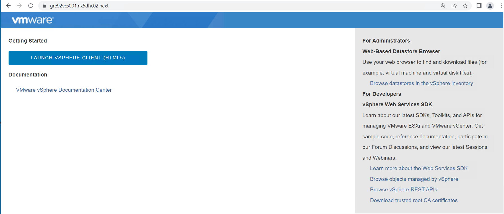
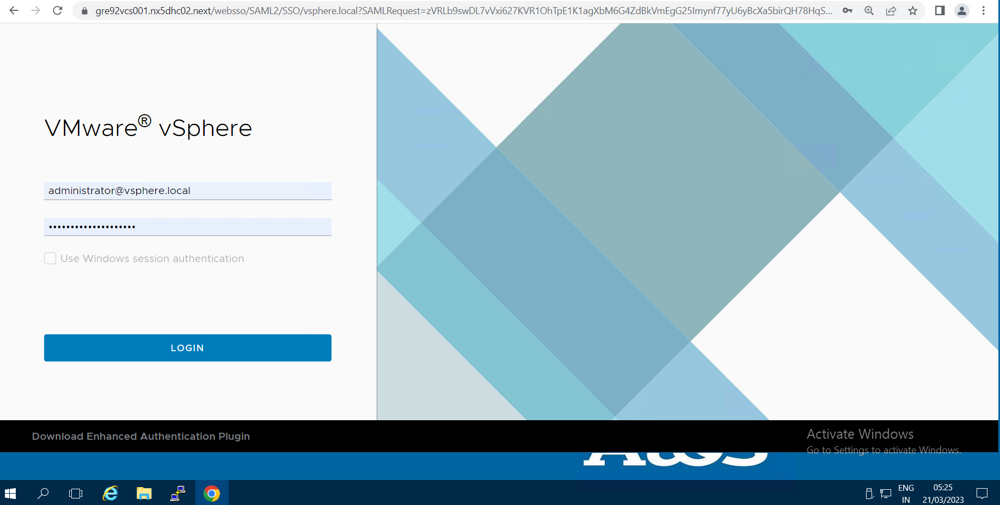
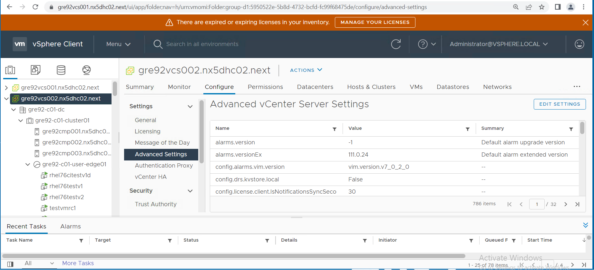
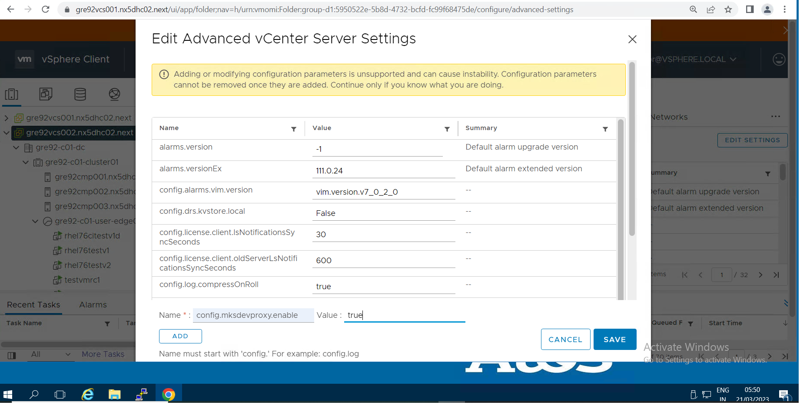
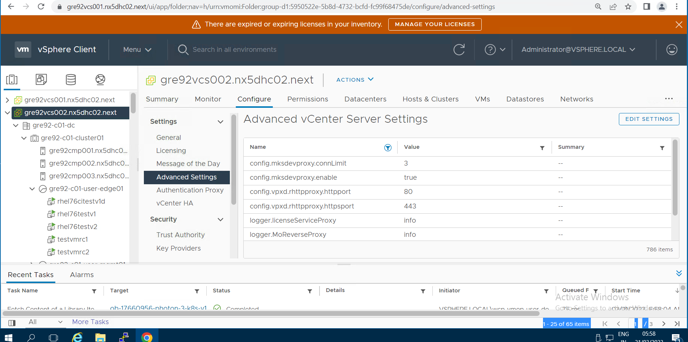
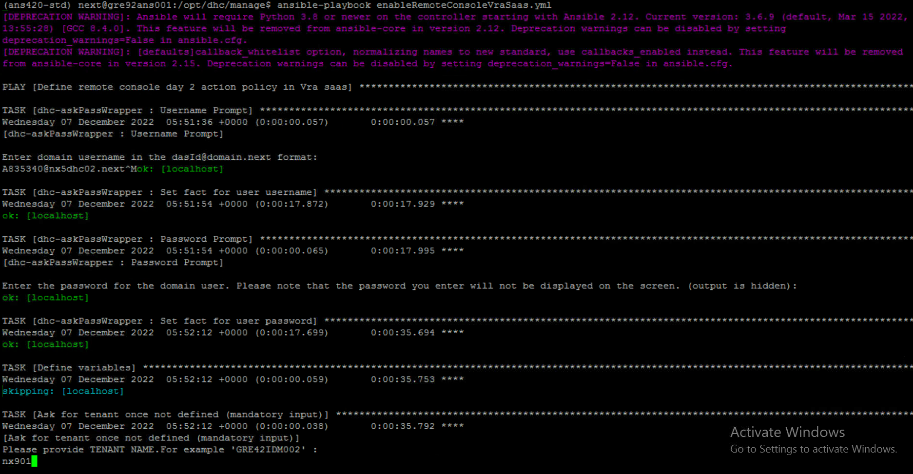
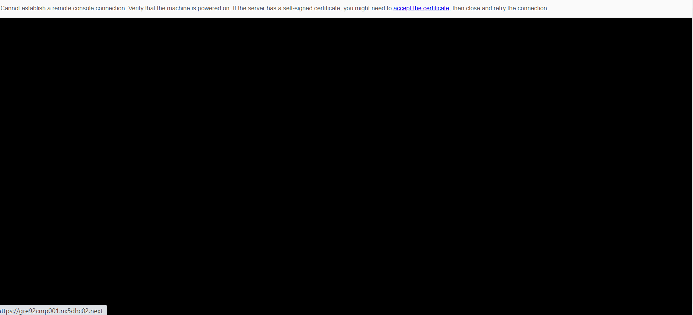
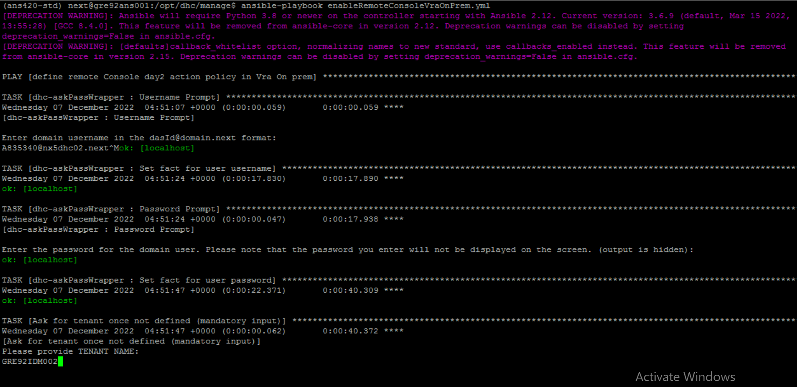

# Table of Contents

- [Table of Contents](#table-of-contents)
- [Changelog](#changelog)
  - [Introduction](#introduction)
    - [Purpose](#purpose)
    - [Audience](#audience)
    - [Scope](#scope)
- [VRA SaaS](#vra-saas)
  - [Requirements](#requirements)
  - [Prerequisites](#prerequisites)
  - [Certificate Installation](#certificate-installation)
  - [Enable vCenter console proxy](#enable-vcenter-console-proxy)
  - [Day 2 Action Policy Definition](#day-2-action-policy-definition)
    - [Note](#note)
- [VRA OnPrem](#vra-onprem)
  - [Requirements](#requirements-1)
  - [Day 2 Action Policy Definition](#day-2-action-policy-definition-1)
- [Troubleshooting](#troubleshooting)

# Changelog

|    Date    |   TOS    | Issue   | Author | Description |
|------------|----------|---------|-----------|--------|
| 06.12.2022 |  VCS 1.7 | CESDHC-5067 | Divyaprakash J | Remote Console Access for VRA SaaS and OnPrem|
| 16.03.2023 |  VCS 1.7 | CESDHC-6571 | Mohit Bilakhia | Remote Console Access for VRA SaaS and OnPrem using vCenter Proxy |
| 14.02.2025 |          | VCS-14892   | Piotr Gesikowski | Added Troubleshooting chapter  |
| 20.03.2025 |          | VCS-15178   | Piotr Gesikowski | Added info for Remote Console access on Aria Automation on Prem |
| 08.10.2025 |          | VCS-15175   | Piotr Gesikowski | Updated info about workaround for Remote Console access on Aria Automation on Prem |

## Introduction

### Purpose

Enable and use remote console day 2 action in vRA Cloud (SaaS) and vRA on-prem.

### Audience

- VCS Engineers
- VCS Operations

### Scope

Remote console day 2 action should be visible and working in vRA Cloud (SaaS) and vRA On-prem.

# VRA SaaS

## Requirements

1. Required network communication open and all pre-requisites met as per Remote Console Access LLD document.
2. Host file entries are added for vRA, IDM and vCenter server in the host file of terminal server.
3. vCenter server hostname can be resolved and is reachable over SSL(443) from terminal server.
4. VM which user wants to access via remote console is in power ON state.

## Prerequisites

Before running playbook for VRA SaaS, user need to generate an API token from vmware cloud service under "My Account"

1. Playbook **createVraCloudToken.yml** is used to generate api token and update in vault via automation
2. Run playbook using command **"ansible-playbook createVraCloudToken.yml -vvv"** which will be in path **/opt/dhc/manage**
3. vCenter server login access with Global.Settings privileges

## Certificate Installation

Download certificates of vCenter CA, ICA, RCA and install into **Trusted Root Certification Authorities** on the terminal server/browser from where the remote console session will be launched.

**Steps :-**

1. Navigate to base url of the vCenter Server or the vCenter Server Virtual Appliance without appending port numbers or 'vsphere-client' extension.
2. Right click on "Download trusted root CA certificates" link at the bottom of the grey box on the right and download the file using save link and enter a path to save the file (you may also download the file by clicking the download link)

   .png>)

3. Downloaded file Download.zip is a ZIP file of all root certificates and all CRLs in the VMware Endpoint Certificate Store (VECS)
4. Extract the contents of the ZIP file. Extracted folder contains two types of files. Files with a number as the extension (.0, .1, and so on) are root certificates. Files with an extension starting with an r (.r0,. r1, and so on) are CRL files associated with a certificate.
5. Install the certificate files as trusted certificates.
   - Click Start, click Start Search, type **mmc**, and then press ENTER.
   - On the File menu, click Add/Remove Snap-in
   - Select Certificates,and then click Add
   - Select Computer Account -> Click Next -> Select Local Computer -> Click on Finish -> Click OK

     .png>)

   - Select Certificates under Trusted Root Certification Authorities and Right Click -> Select All Tasks -> Click Import

     .png>)

   - Choose certificate store and proceed to remain with the default option and click Finish.

## Enable vCenter console proxy

1. Navigate to base url of the vCenter Server or the vCenter Server Virtual Appliance without appending port numbers or 'vsphere-client' extension.
   

2. Login to the vsphere-client with the credentials for Global Settings privileges.
   

3. In the vSphere Client, navigate to and select the vCenter Server instance. On the Configure tab, select Advanced Settings. Click on Edit Settings.
   
4. The Edit Advanced vCenter Server Settings dialog box opens. In the Name text box, enter the name of the service - **config.mksdevproxy.enable** and in the Value text box, enter **true** and click Save.
   
5. Verify the entry for config.mksdevproxy.enable is present in the Advanced vCenter Server Settings
    

## Day 2 Action Policy Definition

To enable remote console access in vRA SaaS, execute **enableRemoteConsoleVraSaas.yml** playbook located at path **/opt/dhc/manage**

Run playbook in ans001 machine using command **"ansible-playbook enableRemoteConsoleVraSaas.yml -vvv"**

Provide below inputs to playbook

1. Domain Username (`dasid@domain.next`)
2. Domain Password
3. Tenant name (i.e nx901)

   

   .png>)

   .png>)

- After successful execution of playbook, a new policy definition will be created in policy definitions in vRA.
- This new policy definition adds a remote console access day2 policy action.
- Remote console day 2 action availability can be checked by navigating to deployed VM. From action **Connect to Remote console** option will be visible as shown in below screenshot.

  .png>)

- After selecting the remote console option users can login to VM using remote console from their web browser session as shown in below screenshot

  .png>)

### Note

If a connection attempt indicates that connection can not be established with the host, it might be required to accept the self-signed certificate.

1. If there is certificate error, click accept the certificate and follow method provided in web browser to open the URL for target vCenter Server Host.
2. Opening vCenter Server page is sufficient to accept the certificate. Close the vCenter Server page.
3. Refresh or reopen the remote console connection page that previously displayed the warning.

Remote console for target machine opens.



# VRA OnPrem

## Requirements

1. vRA cluster FQDN can be resolved and is reachable over HTTPS(443) from terminal server.
2. IDM server FQDN can be resolved and is reachable over HTTPS(443) from terminal server
3. VM which user wants to access via remote console is in powered ON.
4. Port 443 is opened between Aria Automation and ESXi hosts.

## Day 2 Action Policy Definition

To enable Remote console access in VRA On-prem, execute playbook **enableRemoteConsoleVraOnPrem.yml** located in path **/opt/dhc/manage**

Run playbook using command **"ansible-playbook enableRemoteConsoleVraOnPrem.yml -vvv"**

Provide below inputs to playbook

1. Domain Username (`dasid@domain.next`)
2. Domain Password
3. Tenant name

   

   .png>)

   .png>)

- After successful execution of playbook, user can navigate to VM and verify day 2 action for remote console access is available as shown in below screenshot.

  .png>)

- After selecting remote console action for target VM, user can see remote console window/ tab in web browser.

  .png>)

# Troubleshooting

**Symptoms:**\
Establishing a remote console connection in Aria Automation fails with error:\
```Cannot establish a remote console connection. Verify that the machine is powered on. If the server has a self-signed certificate, you might need to accept the certificate, then close and retry the connection.```

  

**Workaround:**\
This issue occurs because the cloud account state does not contain the certificate details.\
To resolve this, follow the steps to update the cloud account with vCenter's certificate:

- Download the Automation Orchestrator package *net.broadcom.vra.update.ca.certificate* (attached to the KB <https://knowledge.broadcom.com/external/article?legacyId=88531>)
- Import package into Orchestrator **Assets** -> **Packages** -> **Import**
- Start the workflow **Update Cloud Account Certificate**
- Select the Aria Automation host for field **Tenant Admin Host**.
- Once the host is selected, all configured vSphere cloud accounts will be populated in the **vSphere Cloud Accounts to Update** data grid.
- Enter data for the **Administrator password** field.
- Trigger the workflow run and wait until the execution completes.
- Once the workflow execution is completed you will see a summary of information for the update certificate operation in the workflow execution log.
- Close the Cloud Account if it is open in the UI, then **Validate** the health of the Cloud Account. This may take up to 10 minutes to complete the data collection.
- **If there are multiple tenants using the remote console which should be proxied through Automation, please run the resolution workflow on each tenant.**
