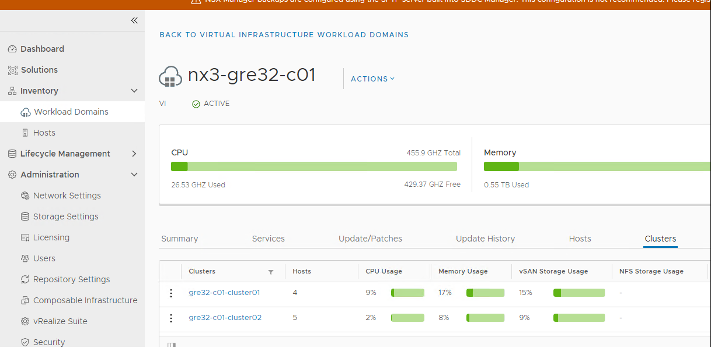
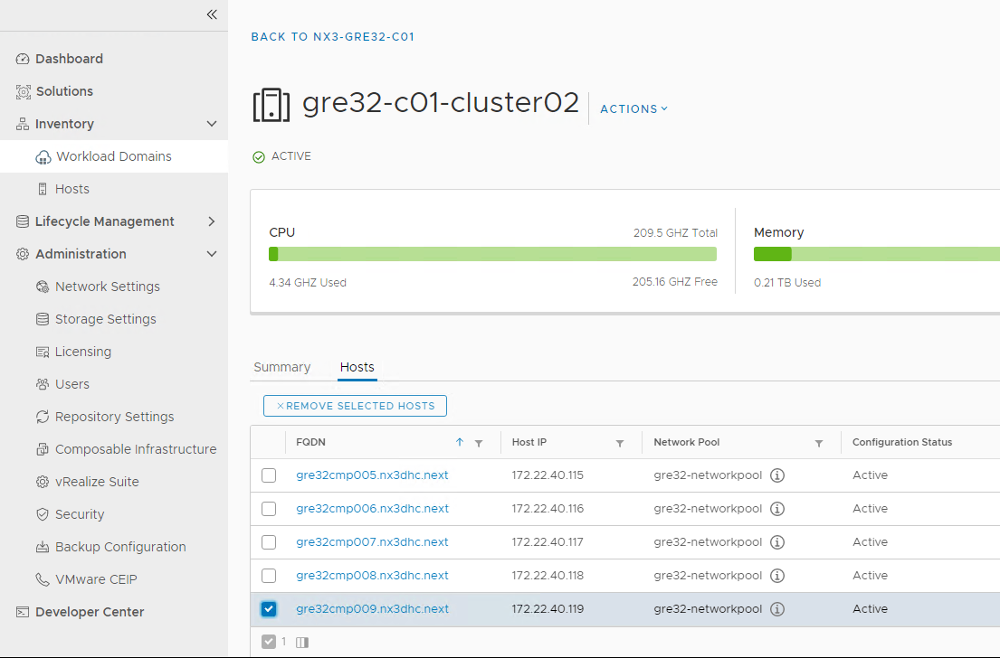
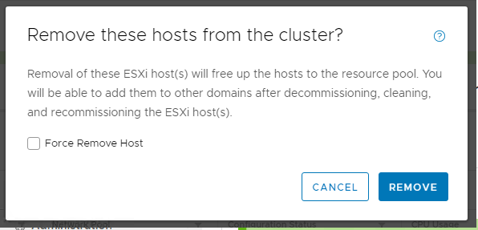
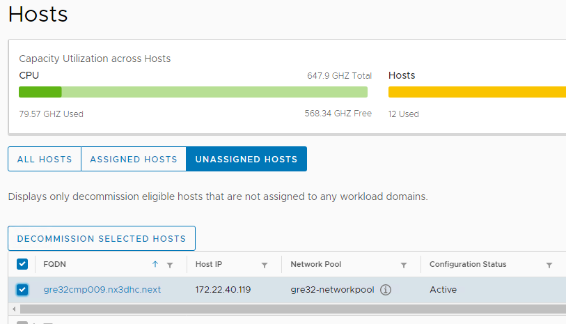
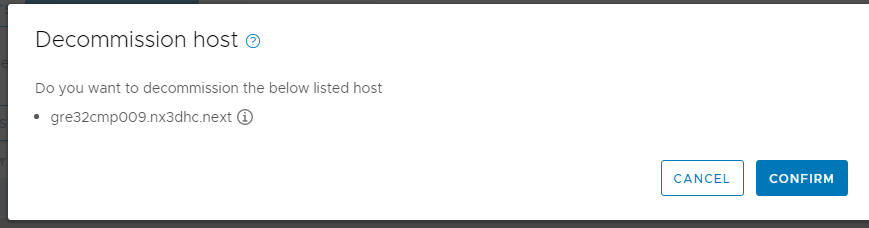
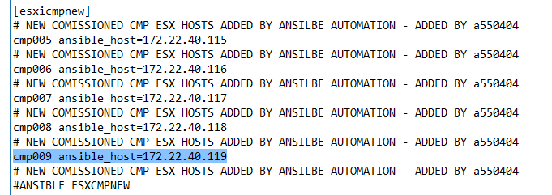
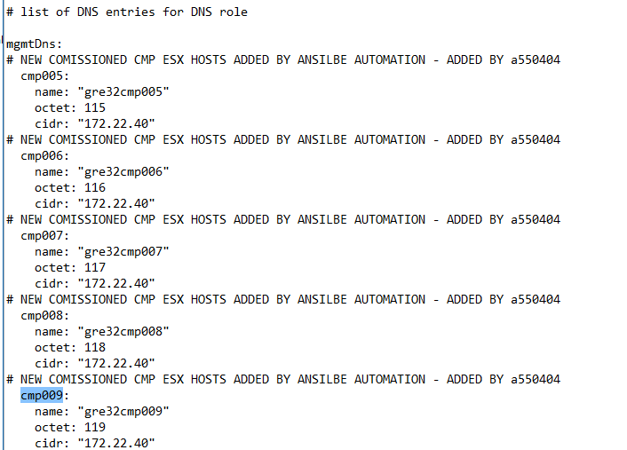
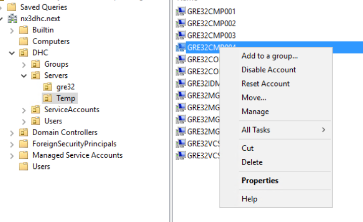
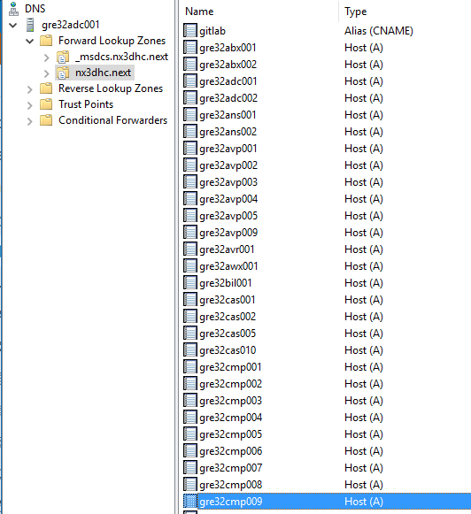
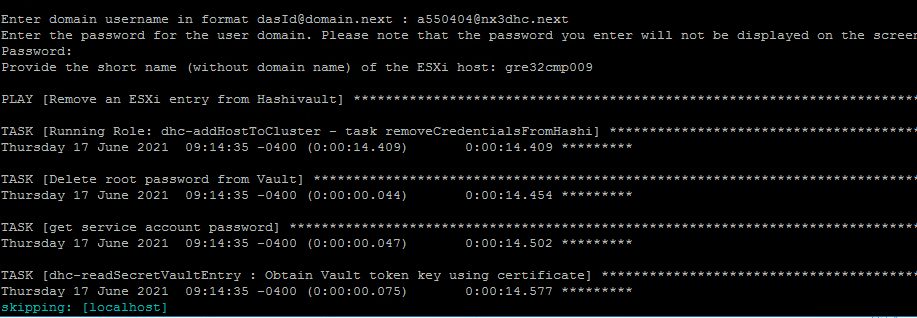

# Remove Host From Cluster

# Changelog

| Date      | Issue    | Author            | TOS         | Description                                |
|-----------|----------|-------------------|-------------|--------------------------------------------|
| 17/6/2021 | DHC-2232 | Piotr Lewandowski | Release 1.4 | Initial version                            |
| 17/8/2021 | DHC-2589 | Piotr Lewandowski | Release 1.4 | Update based on the automation developmnet |

## Introduction

### Purpose

Remove an ESXi host from the existing vSphere Cluster.

### Audience

- VCS Operations

### Scope

Removing a host from vSphere Cluster in VCS involves several steps in order to clean-up the environment:

- Removing a host from the cluster using the SDDC Manager workflow
- Decommissioning a host from the VCF inventory using the SDDC Manager workflow
- Removing entries from the inventory and group_vars/all files
- Removing the host credentials from hashivault
- removing a host from AD and DNS

The following activities are out of scope:

- physical decommissioning and clean-up of the server.

**DISCLAIMER!** All screenshots are for illustrative purposes only.

# Related Documents

| Document               |
|------------------------|
| VCS Infrastructure LLD |

# Assumptions

There is an assumption that the engineers following this process have an understanding of VMware VCF and vSphere products.

# Infrastructure Requirements

There needs to be a sufficient number of hosts after removal.

Minimum 4 ESXi hosts are required for a RAID-1 vSAN cluster. This applies to both Hybrid and All-Flash option.

Minimum 5 ESXi hosts are required for RAID-5 SPBM policies.

**If there is not enough hosts for RAID-5 post-removal, spbm policies need to be adjusted accordingly.**

# Software Requirements

N/A

# Network Requirements

N/A

# Removal Procedure

**!!!NOTE!!! Please note that the following procedure has been fully automated and the steps described below were left for reference and troubleshooting purposes only**

In order to remove a host from a given cluster, run the **removeHostFromCluster.yml** playbook located in the Manage folder.

## Step 1 - Remove ESXi host from the cluster

**NOTE: The manual step applies only to a standalone cluster. It's not possible to remove a host from a stretched cluster (A/A DR) using GUI. It's only possible through API, which is leveraged by the aforementioned Ansible playbook**

| Step | Description                                                                                                                                                                                                | Example                                                          |
|------|------------------------------------------------------------------------------------------------------------------------------------------------------------------------------------------------------------|------------------------------------------------------------------|
| 1.   | Log into SDDC Manager with an administrative account, go to the Inventory -> Workload Domains menu and click on the **Clusters** tab, then click on the cluster that requires the removal of an ESXi host  |  |
| 2.   | Go to the Hosts tab, select a given host and click **Remove Selected Hosts**                                                                                                                               |     |
| 3.   | Leave the checkbox unselected. Click **Remove** to confirm the operation. This will trigger a VCF workflow that will be visible in the Tasks pane. Monitor the task to make sure it completed successfully |            |

## Step 2 - Decommission the host

| Step | Description                                                                                                                                                                                                                                                                  | Example                                                          |
|------|------------------------------------------------------------------------------------------------------------------------------------------------------------------------------------------------------------------------------------------------------------------------------|------------------------------------------------------------------|
| 1.   | Once the removal is completed, go to the Hosts menu in navigation pane on the left-hand side select the **Unassigned Hosts** tab, click the checkbox nex to the host that was removed from the cluster in the previous step and click **Decommission selected hosts** button |  |
| 2.   | Click **Confirm** to proceed. Once again this will trigger a VCF workflow that will be visible in the Tasks pane. Monitor the task to make sure it completed successfully                                                                                                    |       |

## Step 3 - Remove the host from Ansible inventory

| Step | Description                                                                                                                                                                                            | Example                                                        |
|------|--------------------------------------------------------------------------------------------------------------------------------------------------------------------------------------------------------|----------------------------------------------------------------|
| 1.   | Log into the Management Ansible server (ans001), go to the /opt/dhc/manage/ directory and edit the Hosts file. Find the line containing the removed host, delete it and save the file.                 |       |
| 2.   | Go to the /opt/dhc/manage/group_vars folder and open all.yml file. Find the entry for the removed host in the mgmtDns dictionary variable and remove all lines associated with the host. Save the file |  |

## Step 4 - Remove the host from AD and DNS

| Step | Description                                                                                                                                                                                                                            | Example                                              |
|------|----------------------------------------------------------------------------------------------------------------------------------------------------------------------------------------------------------------------------------------|------------------------------------------------------|
| 1.   | Open the Active Directory Management console (dsa.msc) on the TSS server, expand the domain, navigate to DHC/Servers and locate the Computer Object in either the Temp or {locationCode} OU. Right-click the object and select Delete. |  |
| 2.   | Open the DNS Management console on the TSS server and connect to one of the Domain Controllers, open the forward lookup zone for the VCS management domain, find the entry for the removed host and delete it                          |    |

## Step 5 - Remove the host from Hashivault

**NOTE: Currently the removeHostFromCluster.yml playbook covers the above steps as well, not only the Hashivault part.**

| Step | Description                                                                                                                                                                                                                          | Example                                                   |
|------|--------------------------------------------------------------------------------------------------------------------------------------------------------------------------------------------------------------------------------------|-----------------------------------------------------------|
| 1.   | Log into the Management Ansible server (ans001), go to the /opt/dhc/manage/ directory and run a playbook called **removeHostFromCluster.yml**. When prompted, provide the short name of the removed host (without the domain suffix) |  |
