# Replacement of vIDM Connector to AD with LDAP method instead of IWA

## Table of contents

## Changelog

|    Date    |   TOS   |   Issue   | Author | Description |
|------------|---------|-----------|--------|-------------|
| 13.03.2024 | VCS 1.8.2 | VCS-12207 | Jakub Zielinski | Initial Commit |

## Introduction

### Purpose

Replacement of vIDM Connector to AD with LDAP method instead of IWA

### Audience

- VCS Engineers
- VCS Operations

### Scope

This instruction covers configuring the following items:

- Leaving the domain on IDM001
- Deleting the directory
- Re-adding directory with LDAP authentication
- Syncing users
- Testing

## Connector Replacement

### Prerequisites

- Log in to Hashi Vault and test IDM001 credentials to make sure that they work correctly before performing the operation
- Take a snapshot of IDM001
- Test access with your AD account to VMware Aria Operations Network Insight, Aria Operations for Logs, Aria Operations, NSX-T, etc.

### Replacement

Log in to IDM and navigate to `Identity & Access Management`

Navigate to the `Identity & Access Management` -> `Setup` -> click `Leave Domain`

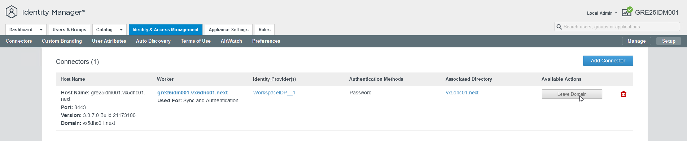

Supply your credentials and click `Leave Domain`

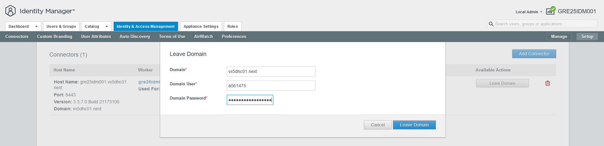

Navigate to the `Identity & Access Management` -> `Directories` -> Select the directory you wish to remove and click  `Delete`

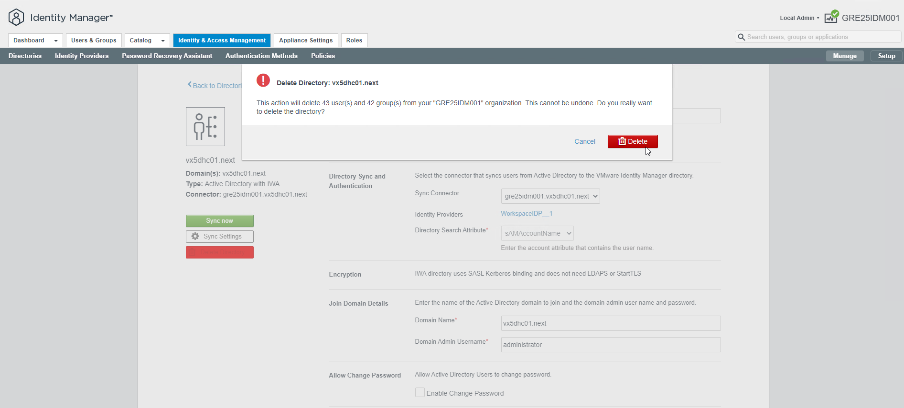

Navigate to the `Identity & Access Management` -> `Directories` ->  `Add Directory` -> Select `Add Active Directory over LDAP/IWA`

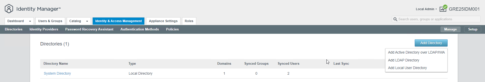

Select `Active Directory over LDAP` and settings as on the screenshot below. STARTTLS is not required.

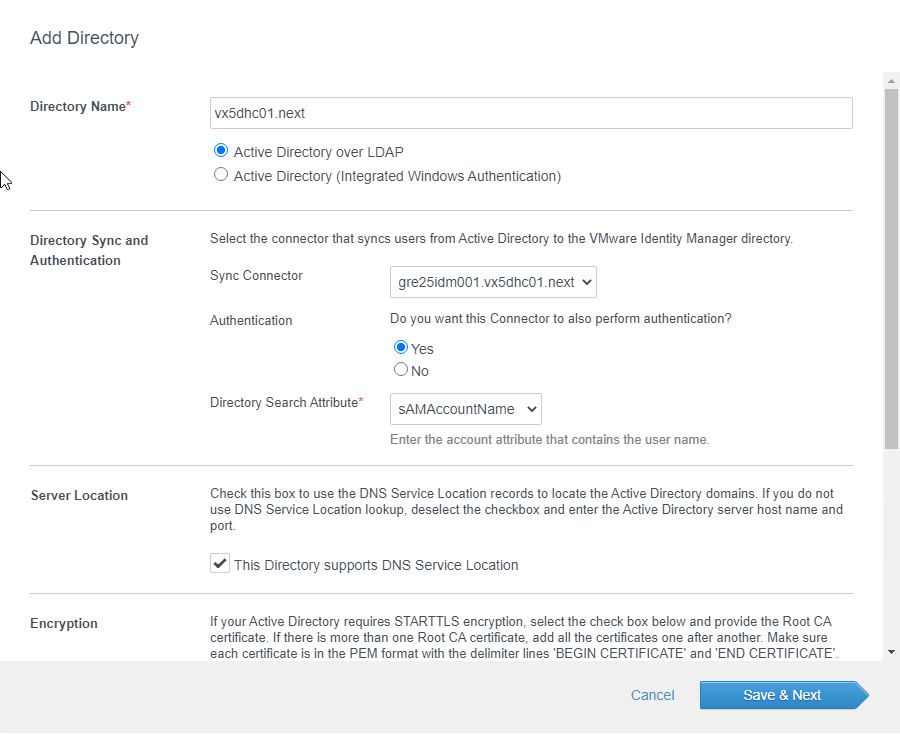

Configure the Bind User Details similarly to the screenshot below. Fetch credentials for svc-.....-idm001 from HashiVault. Click `Test Connection`. If the connection is successful click `Save & Next`.

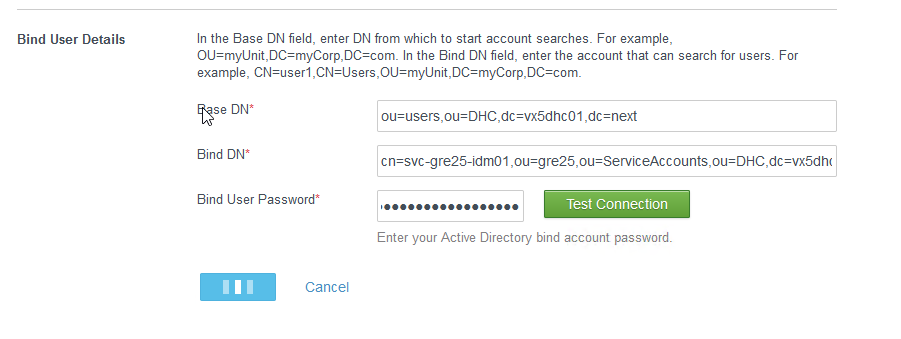

Fill in the 'Specify the group DNs' as shown on the screen below and click the `+` button.

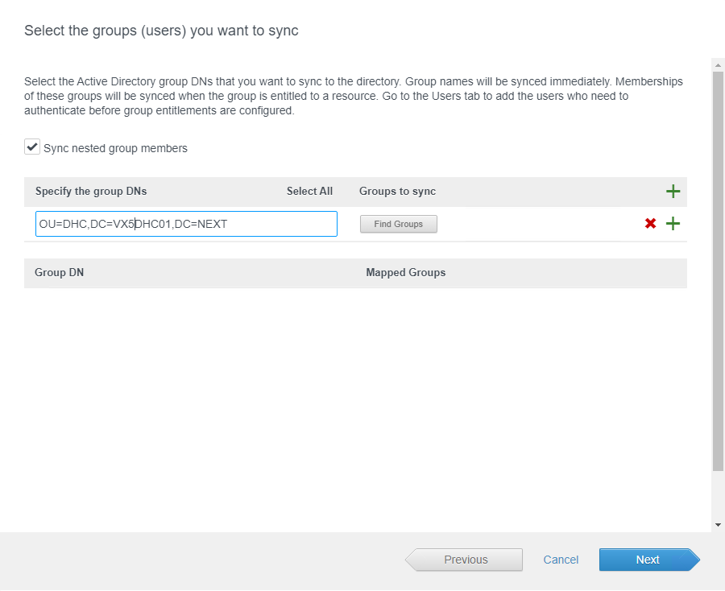

Check the `Select All` checkbox and click `Next`

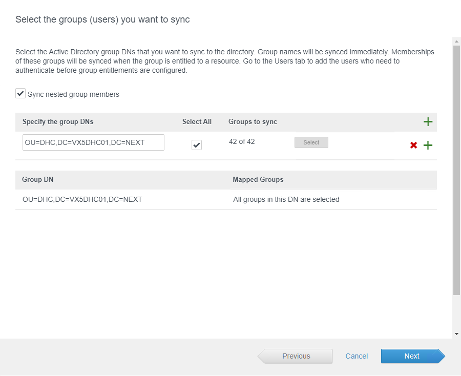

On the `Select the Users you would like to sync` click `Next`

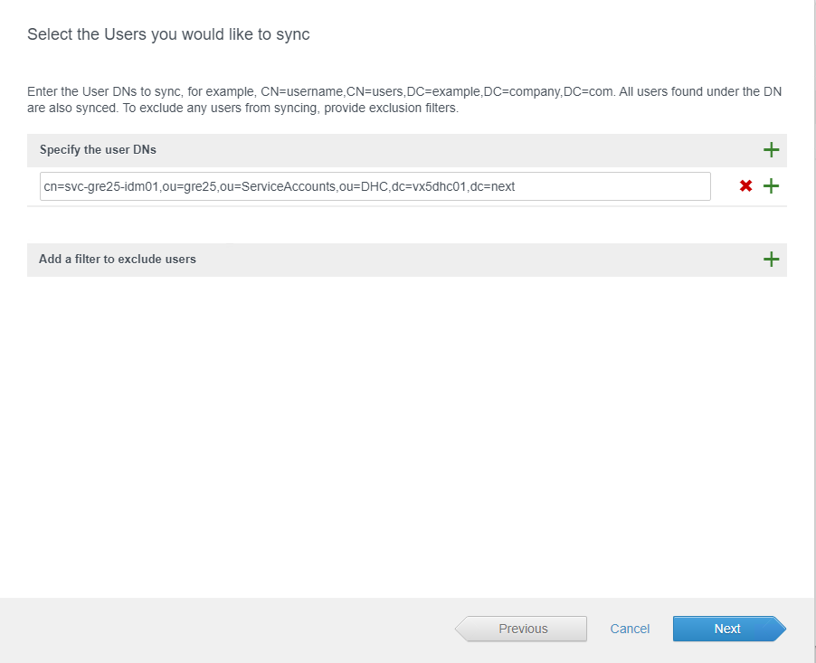

On the following page click `Sync Directory`

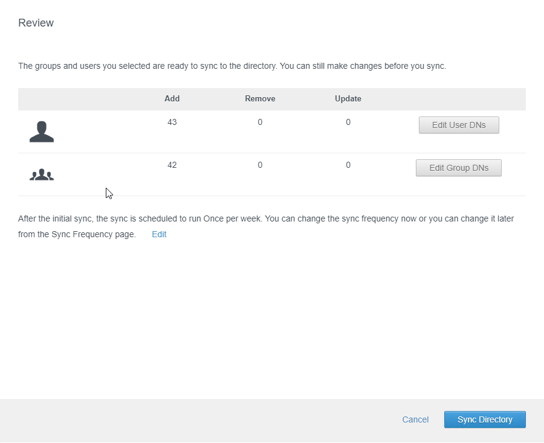

You will be prompted with a message that the sync has started.

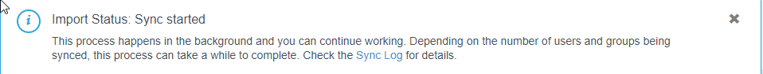

Click `Refresh Page` and notice that groups and users have been synced.

Go to `Identity & Access Management` -> `Setup` -> click `Join Domain`

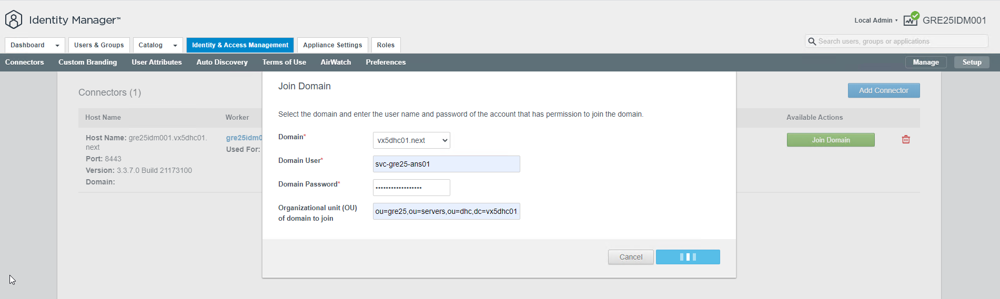

### Testing and clean-up

- Test access with your AD account to VMware Aria Operations Network Insight, Aria Operations for Logs, Aria Operations, NSX-T, etc.
- Remove Snapshots
