# Replace vRops Epops Agents with vROps Telegraf Agents

Table of Contents

- [Replace vRops Epops Agents with vROps Telegraf Agents](#replace-vrops-epops-agents-with-vrops-telegraf-agents)
  - [Changelog](#changelog)
  - [Introduction](#introduction)
    - [Purpose](#purpose)
    - [Audience](#audience)
    - [Scope](#scope)
  - [Pre-requisite](#pre-requisite)
  - [Procedure](#procedure)
    - [Replace Epops agent with Telegraf Agent](#replace-epops-agent-with-telegraf-agent)
      - [Step 1 - Remove vROps Epops Agents](#step-1---remove-vrops-epops-agents)
        - [1.1 Remove vROps Epops Agents from Ubuntu management VMs](#11-remove-vrops-epops-agents-from-ubuntu-management-vms)
        - [1.2 Remove vROps Epops Agents from windows management VMs](#12-remove-vrops-epops-agents-from-windows-management-vms)
          - [Windows VM List](#windows-vm-list)
        - [1.3 Remove vROps Epops Agents from vRA Cloud Proxy Appliances](#13-remove-vrops-epops-agents-from-vra-cloud-proxy-appliances)
        - [1.4 Remove vROps Epops Adapter instances from vROps UI](#14-remove-vrops-epops-adapter-instances-from-vrops-ui)
      - [Step 2 - Deploy vROps Cloud Proxy](#step-2---deploy-vrops-cloud-proxy)
      - [Step 3 - Install vROps Telegraf Agent](#step-3---install-vrops-telegraf-agent)
      - [Step 4 - Install vROps Telegraf Agent on vRA Cloud Proxy appliances](#step-4---install-vrops-telegraf-agent-on-vra-cloud-proxy-appliances)
      - [Step 5 - Configure custom service monitoring](#step-5---configure-custom-service-monitoring)
        - [5.1 - Enable Active Directory Service Monitoring](#51---enable-active-directory-service-monitoring)
        - [5.2 - Enable custom service monitoring on VCS management VMs](#52---enable-custom-service-monitoring-on-vcs-management-vms)
        - [5.2.1 - Enable custom service monitoring on Windows management VMs](#521---enable-custom-service-monitoring-on-windows-management-vms)
          - [Service List for Windows VMs](#service-list-for-windows-vms)
        - [5.2.2 - Enable custom process monitoring on Linux management VMs](#522---enable-custom-process-monitoring-on-linux-management-vms)
          - [Service List for Linux VMs](#service-list-for-linux-vms)
        - [5.2.3 - Enable custom Process Monitoring on vRA Cloud Proxy Appliance](#523---enable-custom-process-monitoring-on-vra-cloud-proxy-appliance)
          - [Service List for vRA Cloud Proxy](#service-list-for-vra-cloud-proxy)
    - [Important Note](#important-note)

## Changelog

| version | Date       | Description                                                  | Author(s)             |
| ------- | ---------- | ------------------------------------------------------------ | --------------------- |
| 0.1     | 20-03-2023 | Initial Draft                                                | Madhavi Rane          |
| 0.2     | 31-03-2023 | Update cloud proxy deployment                                | Vasanth Vignesh M R   |
| 0.3     | 04-04-2023 | Updating WI for cloud proxy cred update in vault             | Chetan Patidar        |
| 0.4     | 08-05-2023 | Added details for installing Telegraf agent on CAS proxy appliances | Madhavi Rane   |
| 0.5     | 18-05-2023 | Added details related to downloading binaries and required firewall rule settings | Madhavi Rane |
| 0.6     | 08-06-2023 | VCS-9831 Updated firewall rule list and steps to install sudo in CAS proxy | Madhavi Rane |
| 0.7     | 20-03-2025 | VCS-12231 Added details for Cloud Proxy deployment and corrected header formatting | Stanisław Kilanowski |
| 0.8     | 16-01-2026 | VCS-6661 Remove HGW monit service monitoring | Lukasz Bienkowski |

## Introduction

vROps version 8.6 onward epops agents are no longer supported. For monitoring operating systems, windows services and Linux processes the Application monitoring feature of vROps can be used. For Application monitoring, we need to deploy vROps Cloud Proxy and install telegraf agent on target VMs.

### Purpose

Remove existing vROps epops agents from VCS management VMs (windows and linux) and install vROps Telegraf agent for OS level monitoring of VCS management VMs.

### Audience

- VCS Operations

### Scope

This work instruction is intended to cover below tasks:

1. Remove vROps epops agent from following **VCS management** vms.
    - Windows VMs
    - Ubuntu VMs
    - CAS proxy appliances
2. Deploy vROps Cloud Proxy.
3. Install vROps Telegraf agent on following **VCS management** vms.
    - Windows VMs
    - Ubuntu VMs
    - CAS proxy appliances
4. Configure custom service/process monitoring for required VCS components as stated in **lldMonitoringLogging.md**.

## Pre-requisite

Before proceeding,

1. Please make sure required Firewall rules are in place to allow communication between vROps, vROpsCloud proxy, vCenter and target vms. Please refer document [LLD Software Defined Networks Firewall](lldSoftwareDefinedNetworksFirewall.md) for more details. Its a manual process. The list of services, security groups and firewall rules which need to be created or updated is as follows,

   ```yml
           ## Step1 - Create Following Two new services
   
           mdServices:  
             - displayName: "TCP4505"
               protocol: "TCP"
               destinationPort: "4505"
               
             - displayName: "TCP4506"
               protocol: "TCP"
               destinationPort: "4506"
            
           ## Step2 - Create following new security group with IP
   
           mdSecurityGroupsIp:
             - description: "CloudProxy"
               name: "{{ customerCode }}seg079"
               members: [
                 "{{ networkAvnCrossRegion.cidr }}.32"
               ]  
             
           ## Step3 - Create following new security group based on dynamic membership
   
           mdSecurityGroupsDynamic:
             - description: "CloudProxy_APPLYTO"
               name: "{{ customerCode }}seg079_APPLYTO"
               members: [
                 "{{ locationCode }}cpx001",
                 ]
               
           ## Step4- Create following new Distributed Firewall rules
           mdDfwRules:
             - name: "CpxToVrops"
               section: "CPX"
               source: ["{{ customerCode }}seg079"]
               destination: ["{{ customerCode }}seg020"]
               service: ["HTTPS"]
               action: "ALLOW"
               applyto: ["{{ customerCode }}seg020_APPLYTO", "{{ customerCode }}seg079_APPLYTO"]
               
             - name: "CpxToVcs"
               section: "CPX"
               source: ["{{ customerCode }}seg079"]
               destination: ["{{ customerCode }}seg013"]
               service: ["HTTPS"]
               action: "ALLOW"
               applyto: ["{{ customerCode }}seg013_APPLYTO", "{{ customerCode }}seg079_APPLYTO"]
               
             - name: "CpxToMgmtESXi"
               section: "CPX"
               source: ["{{ customerCode }}seg079"]
               destination: ["{{ customerCode }}seg034"]
               service: ["HTTPS"]
               action: "ALLOW"
               applyto: ["{{ customerCode }}seg034_APPLYTO", "{{ customerCode }}seg079_APPLYTO"]
               
             - name: "ToCpx"
               section: "Cpx"
               source: [
                 "{{ customerCode }}seg001",
                 "{{ customerCode }}seg004",
                 "{{ customerCode }}seg006",
                 "{{ customerCode }}seg007",
                 "{{ customerCode }}seg009",
                 "{{ customerCode }}seg011",
                 "{{ customerCode }}seg012",
                 "{{ customerCode }}seg021",
                 "{{ customerCode }}seg022",
                 "{{ customerCode }}seg033",
                 "{{ customerCode }}seg039",
                 "{{ customerCode }}seg044",
                 "{{ customerCode }}seg045",
                 "{{ customerCode }}seg046",
                 "{{ customerCode }}seg047",
                 "{{ customerCode }}seg048",
                 "{{ customerCode }}seg049",
                 "{{ customerCode }}seg051",
                 "{{ customerCode }}seg054",
                 "{{ customerCode }}seg063"
               ]
               destination: ["{{ customerCode }}seg079"]
               service: ["HTTPS", "TCP4505", "TCP4506"]
               action: "ALLOW"
               applyto: [
                 "{{ customerCode }}seg001_APPLYTO",
                 "{{ customerCode }}seg004_APPLYTO",
                 "{{ customerCode }}seg006_APPLYTO",
                 "{{ customerCode }}seg007_APPLYTO",
                 "{{ customerCode }}seg009_APPLYTO",
                 "{{ customerCode }}seg011_APPLYTO",
                 "{{ customerCode }}seg012_APPLYTO",
                 "{{ customerCode }}seg021_APPLYTO",
                 "{{ customerCode }}seg022_APPLYTO",
                 "{{ customerCode }}seg033_APPLYTO",
                 "{{ customerCode }}seg039_APPLYTO",
                 "{{ customerCode }}seg044_APPLYTO",
                 "{{ customerCode }}seg045_APPLYTO",
                 "{{ customerCode }}seg046_APPLYTO",
                 "{{ customerCode }}seg047_APPLYTO",
                 "{{ customerCode }}seg048_APPLYTO",
                 "{{ customerCode }}seg049_APPLYTO",
                 "{{ customerCode }}seg051_APPLYTO",
                 "{{ customerCode }}seg054_APPLYTO",
                 "{{ customerCode }}seg063_APPLYTO",
                 "{{ customerCode }}seg079_APPLYTO"
               ] 
   
           ## Step5 -  Add cpx proxy security group ( seg079 )to following existing firewall rules
   
             - name: "TssAsManagement"
               section: "TSS"
               source: ["{{ customerCode }}seg004"]
               destination: [
                       "{{ customerCode }}seg079"
               ]
               service: ["HTTPS", "SSH"]
               action: "ALLOW" 
               applyto: [
                 "{{ customerCode }}seg079_APPLYTO"
               ]
               
             - name: "AnsibleAsAutomationServer"
               section: "Ansible"
               source: ["{{ customerCode }}seg007"]
               destination: [
                 "{{ customerCode }}seg079"
               ]
               service: ["HTTPS", "SSH"]
               action: "ALLOW"
               applyto: [
                 "{{ customerCode }}seg079_APPLYTO"
               ] 
               
             - name: "DNS"
               section: "DNS"
               source: [
                 "{{ customerCode }}seg079"
                ]
               destination: ["{{ customerCode }}seg006"]
               service: ["DNS", "DNS-UDP"]
               action: "ALLOW"
               applyto: ["ANY"] 
               
             - name: "NTP"
               section: "NTP"
               source: [
                 "{{ customerCode }}seg079"
               ]
               destination: ["{{ customerCode }}seg006"]
               service: ["NTP_Time_Server"]
               action: "ALLOW"
               applyto: [
                 "{{ customerCode }}seg079_APPLYTO"
               ]
               
             - name: "ToProxyInternal"
               section: "ToProxy"
               source: [
                 "{{ customerCode }}seg079"
               ]
               destination: ["{{ customerCode }}seg001"]
               service: ["TCP{{ proxyPort }}"]
               action: "ALLOW"
               applyto: [
                 "{{ customerCode }}seg079_APPLYTO"
               ]
   ```

2. vROps Cloud proxy appliance ova file and vRops Telegraf agent installation scripts for windows and linux os must be available in binaries folder of ansible server. Please refer corresponding VCS version specific version matrix document for more details. The components required for Telegraf agent installation are as follows,

   ```yml
          component: cpxOva
          description: Cloud proxy for vRealize Operations Manager
     
          component: winTelegrafAgent
          description: vRops Telegraf agent installation script for Windows
     
          component: linuxTelegrafAgent
          description: vRops Telegraf agent installation script for Linux
   ```

   Please make sure version matrix file available at path /opt/dhc/update/group_vars/ on ansible server has details of above mentioned components. If these components are not  available in version matrix file then please download the latest version of this file.

   **NOTE** :

   This note is **NOT** applicable for Customers who are performing steps mentioned in this WI as part of VCS LCM process.

   This feature installation is part of update phase. Hence it is included in applicable VCS LCM documents. Customers (specifically Siemens) who are following this WI outside of LCM process must follow the points mentioned in this note.
       The Telegraf agent installation playbook uses **componentCurrentVersion** and **componentNextVersion** variables available in **/opt/dhc/update/group_vars/all** file while extracting required binaries details. Telegraf agent based monitoring is introduced in VCS version 1.6 onward. If you have already upgraded your environment to VCS 1.6 and you are installing Telegraf agent based monitoring outside of LCM process then you need to set the values of **componentCurrentVersion** and **componentNextVersion** variables to pre-LCM state in order to successfully execute Telegraf Agent installation playbooks. Post completing the Telegraf installation process these values need to be set to original values (i.e post-LCM state)

   e.g. If you have already completed the LCM process to upgrade your environment to DHC-1.6 then variables **componentCurrentVersion** and **componentNextVersion** must be having following values, i.e. Post-LCM value , (Please note down values from /opt/dhc/update/group_vars/all file)

   ```yml
      componentCurrentVersion : dhcVersion1_6
      componentNextVersion: dhcVersion1_6_1
   ```

   in this scenario, Please manually set the values of these variables in */opt/dhc/update/group_vars/all* to pre-LCM state, e.g.  set these values as follows,

   ```yml
     componentCurrentVersion : dhcVersion1_5_1
     componentNextVersion: dhcVersion1_6
   ```

   **After successful installation of Telegraf Agent please revert this change and set these values back to their original values. i.e. Post-LCM value**. Its important to set these values back to their original state to avoid any issues later.

3. The binaries of required components (mentioned in point 2) must be available at path /data/binaries on ansible server. If the required binaries are not available then to trigger packages download, run the following playbook from /opt/dhc/update folder on ans001.

   ```yml
    ansible-playbook upgradeBinaries.yml
   ```  

4. OS level metrics can be collected with vROps Advanced license. For application monitoring vROps enterprise license is required.

## Procedure

### Replace Epops agent with Telegraf Agent

This process includes removing epops agent from target vms and setting up Application monitoring for target vms. For Application monitoring, we need to deploy vROps cloud proxy appliance and install Telegraf agent on target vms. Once the Telegraf agents are installed on vms we can check the agent status on vROps application monitoring page. Post successful Telegraf agent installation we can configure required custom service/process monitoring for vm from vROps UI.

#### Step 1 - Remove vROps Epops Agents

##### 1.1 Remove vROps Epops Agents from Ubuntu management VMs

Follow below mentioned steps to remove epops agents from Ubuntu management VMs:

1. Login to Ansible server `ans001` and navigate to directory `opt/dhc/update`
2. Execute the playbook `removeVropsEpopsAgents.yml`

   ```bash

     dhc/update$ ansible-playbook removeVropsEpopsAgents.yml
    
   ```

3. You will be prompted to provide the following inputs:

   ```yml

    Enter domain username in format dasId@domain.next
    Your input: Your Active Directory domain username

    Enter the password for the domain user. Please note that the password you enter will not be displayed on the screen. 
    Your input: Your Active Directory domain password
   
   ```

4. This playbook removes the epops agent installation folder and epops agent service from target ubuntu vm.
5. Post successful execution of this playbook please verify epops agent service ( epopsagent.service ) is removed from target vm.

##### 1.2 Remove vROps Epops Agents from windows management VMs

Its a manual process. The windows VMs which are in scope are listed in **Table 1 Windows VM List**.

###### Windows VM List

|   VM   |
| :----: |
| adc001 |
| adc002 |
| tss001 |
| tss002 |
| ica001 |
| wus001 |

Table 1 Windows VM List

Please follow below mentioned steps on each windows server listed in **Table 1 Windows VM List**

1. Log in to windows server.
2. Open windows services management console. Stop **End Point Operations Management Agent** service.
3. Go to epops agent installation folder ( c:\ep-agent)
4. Execute **unins000.exe** which is available in the installation folder.
5. Post successful execution of exe file, agent will be removed from target vm.

##### 1.3 Remove vROps Epops Agents from vRA Cloud Proxy Appliances

Please follow below mentioned steps on each vRA Cloud proxy (CAS proxy and abx proxy ) server.

1. SSH in to vRA Cloud proxy appliance using root credentials.
2. Stop epops agent service by executing following command.

   ```bash
      systemctl stop epopsagent.service
   ```

3. Verify that epops agent service is stopped by checking the service status

   ```bash
      systemctl status epopsagent.service
   ```

4. Disable epops agent service by executing following command

   ```bash
      systemctl disable epopsagent.service
   ```

5. Delete the folder **ep-agent** which is located at path **/opt/ep-agent** by executing following command

   ```bash
      rm -rf /opt/ep-agent
   ```

6. To remove epops agent service permanently execute following commands

   ```bash
      rm /etc/systemd/system/epopsagent.service
      rm /usr/lib/systemd/system/epopsagent.service
      systemctl daemon-reload
   ```

##### 1.4 Remove vROps Epops Adapter instances from vROps UI

Post uninstallation of epops agent, the corresponding epops adapter still exist in vROps. We need to manually remove these epops adapter instances.
Please follow below mentioned steps to remove epops adapters from vROps UI.

1. Log in to vROps with admin user credential.
2. Go to **Environment** -> **Inventory** -> **Adapter Types** -> **EP Ops Adapter**
3. Select the objects corresponding to VCS management vms. Please make sure the Adapter Type of selected object is **EP Ops Adapter** and remove the object.

Please refer below screen print,

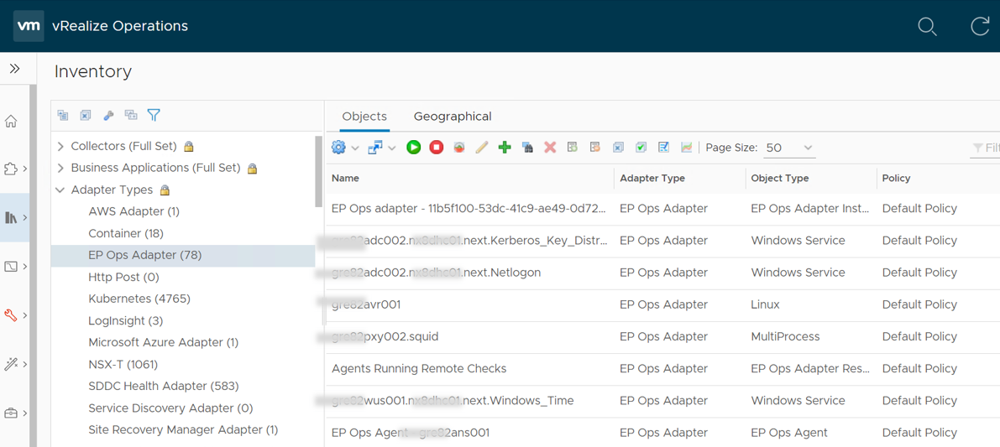

#### Step 2 - Deploy vROps Cloud Proxy

This is the first step towards setting up Application monitoring within vROps.

Follow below mentioned steps to Deploy vROps Cloud Proxy:

- To get the OTK, login to vROps UI with admin credentials, under Data Sources select 'Cloud Proxies' and click 'New' to get OTK". Select the OTK from the text box from section 3 as shown below in the screenshot:  

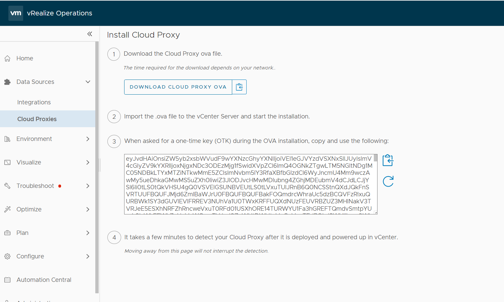

- Login to Ansible server ans001
- Input file vRopsCloudProxyVars.yml needs to be created and placed in users home directory (user who is executing the playbook)
- Enter the OTK in input file vRopsCloudProxyVars.yml. Please refer below mentioned format for vRopsCloudProxyVars.yml file. User needs to replace "<key_value>" with OTK obtained in step 1
   For example:

```yml

cloudProxyVars:
  otk:
    node1: "<key_value>"

```

- Navigate to directory `opt/dhc/update` and execute the playbook `createVropsCloudProxy.yml`

   ```bash

    dhc/update$ ansible-playbook createVropsCloudProxy.yml
    
   ```

- You will be prompted to provide the following inputs:

   ```yml

    vars_prompt:
    - name: confirmation
    prompt: |
    Please note that this automation requires input file with specific variables in /home/XXXXX directory
    - vRopsCloudProxyVars.yml
    All required information can be found in dhc-createVropsCloudProxy role readme file.
    -------------------------------------------------------------------------------------------------------------------------
    -------------------------------------------------------------------------------------------------------------------------
    -------------------------------------------------------------------------------------------------------------------------
    -------------------------------------------------------------------------------------------------------------------------
    Please confirm that you have read the documentation, prepared the required input file, placed it in mentioned path and
    You are willing to continue the script execution.
    Confirmation (yes)
    .
    .
    
    Enter domain username in format dasId@domain.next
    Your input: Your Active Directory domain username

    Enter the password for the domain user. Please note that the password you enter will not be displayed on the screen. 
    Your input: Your Active Directory domain password
   
   ```

- This playbook automatically adds a DNS record for the cloud proxy and deploys it in vCenter and registers it in the vROPS. After successful execution of the playbook, allow 30 minutes for the cloud proxy appliance to register to vROPS

- While checking in vROPS console, we can make sure cloud proxy is registered successfully
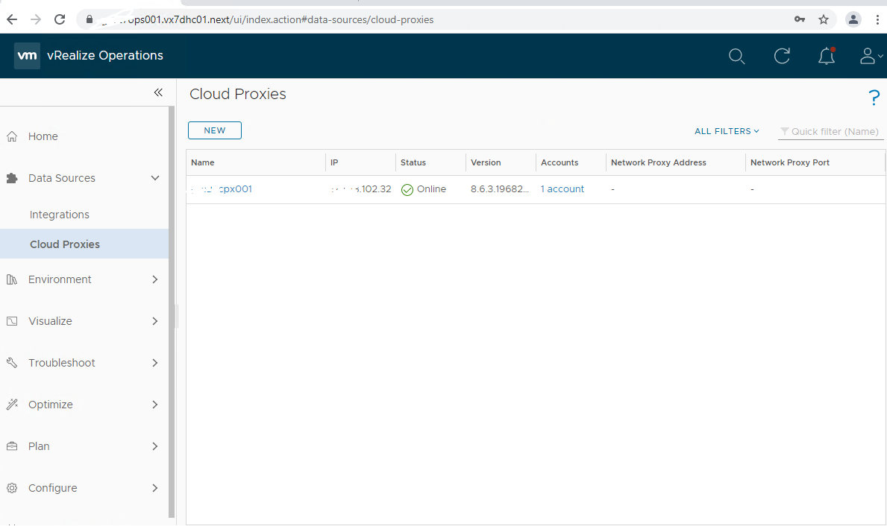

- Also, you can see in the cloud proxy VM console that it is registered to vROPS
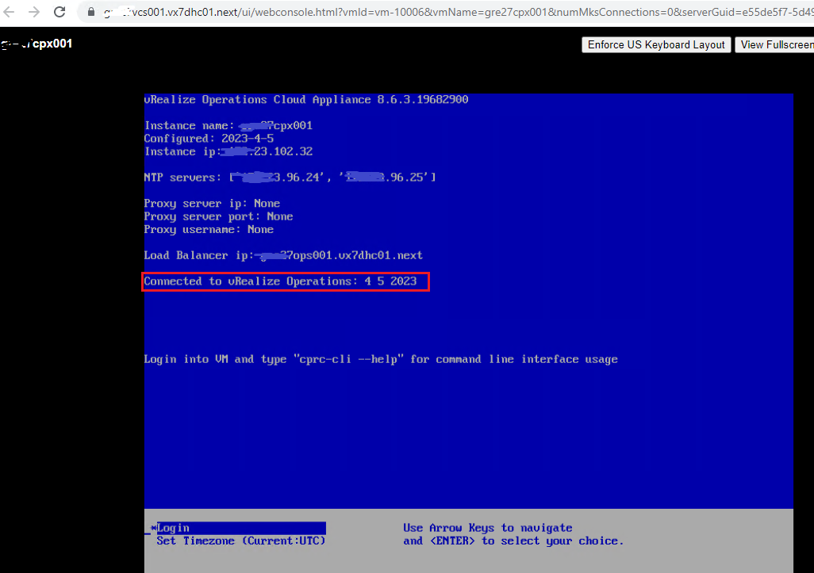

- Manual task:

  - By default ssh will be disabled and root password for the cloud proxy appliance is "vmware".
  - Login to vcenter and open vm console of the cloud proxy appliance then run the below command to enable ssh and reset the default password.

   ```bash
   systemctl enable sshd
   systemctl start sshd
   passwd root
   ```

- Execute the playbook `updateVropsCloudProxyCredentialsToVault.yml` to update the changed root password in vault

   ```bash

   dhc/update$ ansible-playbook updateVropsCloudProxyCredentialsToVault.yml
   
   ```

   ```yml

    Enter domain username in format dasId@domain.next
    Your input: Your Active Directory domain username

    Enter the password for the domain user. Please note that the password you enter will not be displayed on the screen. 
    Your input: Your Active Directory domain password
    
    Enter the new password for Cloud Proxy root account to update it in hashi vault
    Your input: Enter new password

    Re-enter the new password to check that the password entered by the user is same
    Your input: Enter new password 
   
   ```

#### Step 3 - Install vROps Telegraf Agent

For Telegraf agent installation vROps Cloud proxy must be up and running. Its status must be online. Follow below mentioned steps to Install vROps Telegraf agent on winodws and linux management vms:

1. Login to Ansible server `ans001` and navigate to directory `opt/dhc/update`
2. Execute the playbook `installVropsTelegrafAgents.yml`

   ```bash

     dhc/update$ ansible-playbook installVropsTelegrafAgents.yml
    
   ```

3. You will be prompted to provide the following inputs:

   ```yml

    Enter domain username in format dasId@domain.next
    Your input: Your Active Directory domain username

    Enter the password for the domain user. Please note that the password you enter will not be displayed on the screen. 
    Your input: Your Active Directory domain password
   
   ```

4. This playbook creates vrops local account required for telegraf agent installation and installs telegraf agents on windows and linux management vms.
5. Post successful execution of this playbook please verify telegraf agent status for VCS management vms in vROps UI.
6. Navigate to **Environment**-> **Applications**. From the Applications panel, click **Manage Telegraf Agents**.

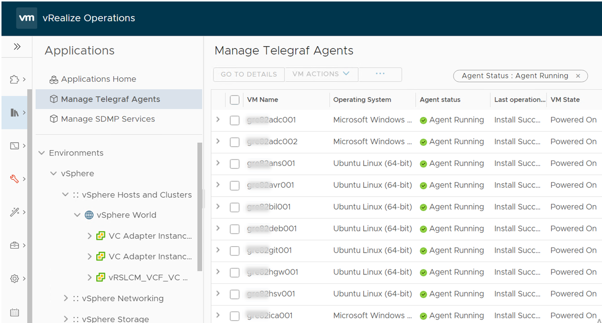

#### Step 4 - Install vROps Telegraf Agent on vRA Cloud Proxy appliances

Please perform following steps to install vROps Telegraf Agent on vRA Cloud Proxy vms ( CAS proxy and abx proxy appliance). Its a manual process.

1. Telegraf Agent installation script checks for sudo package availability on target vm. SSH in to vRA Cloud proxy appliance using root credentials. Please execute following command on CAS proxy appliance to verify if sudo package exists.

   ```bash
      command -V sudo
   ```

   if sudo package is installed on it then command output will display the path else there won't be any output and exit code will be 1.
2. If sudo package is available then skip step 3 and go to step 4.
3. To install sudo please execute following steps,
    1. Open file **/etc/sysconfig/proxy**. Please verify that **HTTPS_PROXY** value is set. If it is not set then set it to same value as **HTTP_PROXY**. Post updating **HTTPS_PROXY** value please reboot the vRA Cloud proxy appliance.

       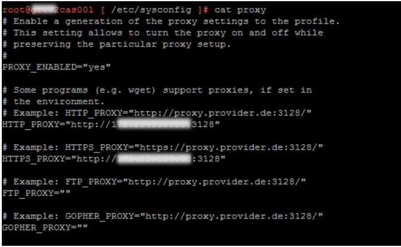

    2. Open **photon.repo** file available at path **/etc/yum.repos.d/photon.repo**. Check if **repo** is enabled by verifying value of parameter **enabled** is set to 1 in the file.
    3. Please verify that the baseurl value in file **/etc/yum.repos.d/photon.repo** is pointing to `packages.vmware.com` if it is pointing to any other url then replace the baseurl value with, `https://packages.vmware.com/photon/$releasever/photon_release_$releasever_$basearch`

       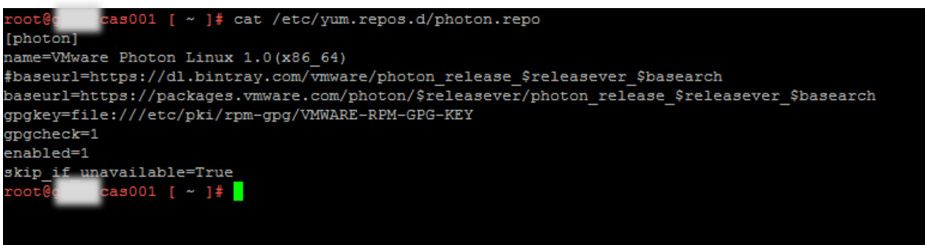

    4. Now install sudo package by executing following command,

       ```bash
         tdnf install sudo
       ```

4. Post verifying availability of sudo package , now we can install Telegraf agent on vm from vROps UI.
5. Login to vROps UI with admin credentials.
6. From the left menu, click **Environment**-> **Applications**. From the Applications panel, click **Manage Telegraf Agents**.
7. Select the target CAS proxy vm. e.g. select cas001 server. Please make sure a single CAS proxy vm is selected.
8. Click the horizontal ellipsis available at the top. Select **Install**.

   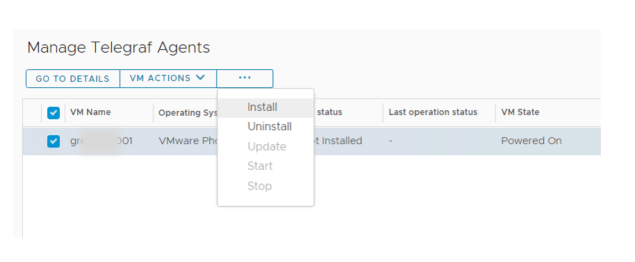

9. Select option **Common username & password**. Click Next.

   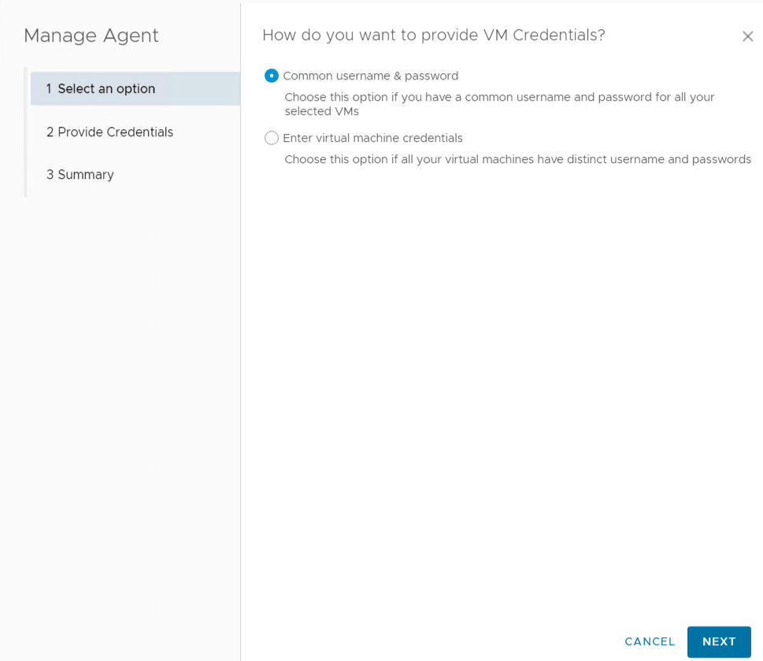

10. Provide CAS proxy appliance root credentials. Select checkbox for **Create runtime user** option. Click Next.

    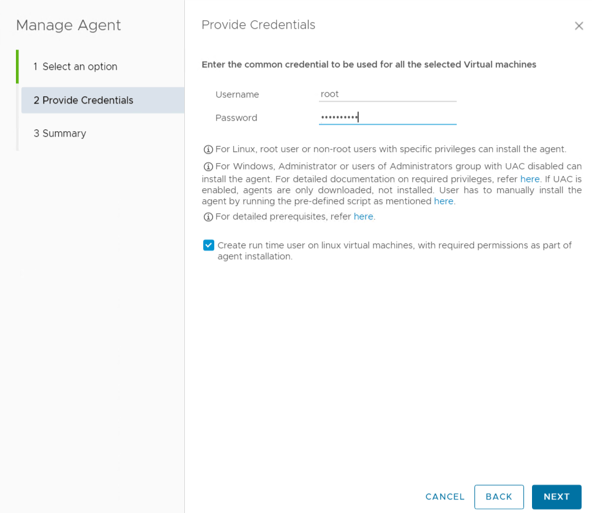

11. Verify the details on Summary page. Click **Install Agent**.

    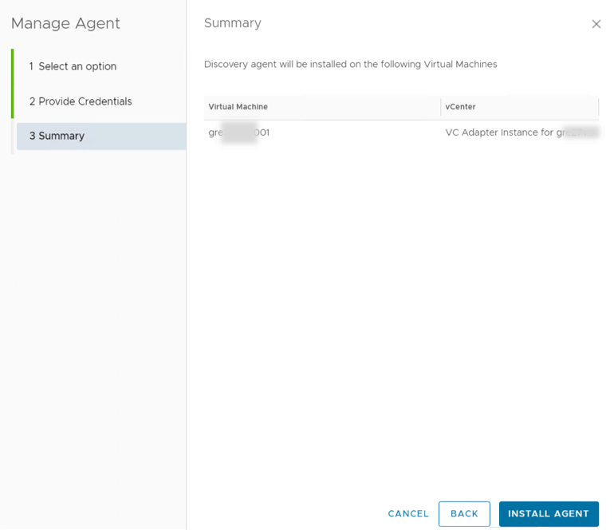

12. Post successful Telegraf Agent installation check the **Agent Status**. It should be **Agent Running**.

    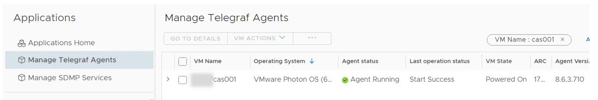

#### Step 5 - Configure custom service monitoring

After successfully installing the Telegraf agent on vm we can configure custom service/process monitoring for vm. The Telegraf agent status for the target vm must be green in vROps UI. The process of enabling service/process monitoring is manual. It needs to be configured from vROps UI.

##### 5.1 - Enable Active Directory Service Monitoring

The vROps Telegraf agent installed on active directory server auto discovers the active directory application installed on this server. We need to enable the monitoring for this application on individual active directory servers. Please follow the below mentioned steps to enable monitoring of active directory service.

1. Login to vROps UI with admin credentials
2. From the left menu, click **Environment**-> **Applications**. From the Applications panel, click **Manage Telegraf Agents**.
3. Select the active directory server. The Telegraf agent must be running on this VM.
4. Expand the drop-down arrow against the active directory VM. You see the Services Discovered section.
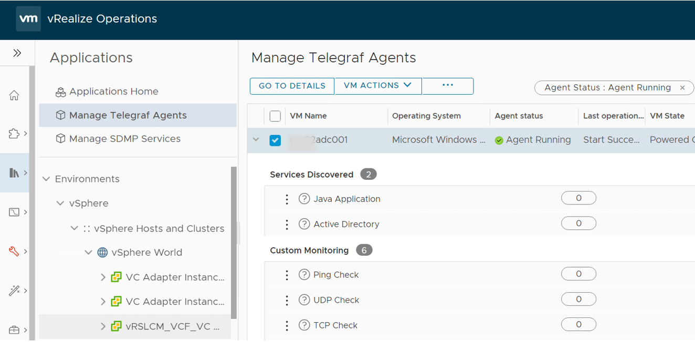
5. From the Services Discovered section, select **Active Directory** service, click the vertical ellipsis and then click Add.
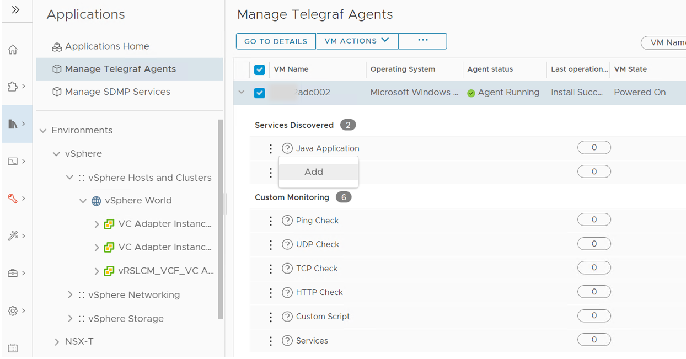
6. Enable the application service from dialog box that is displayed on the right side.
7. Enter the display name as **Active Directory** and click Save. It takes some time to enable the monitoring and fetch related metrics
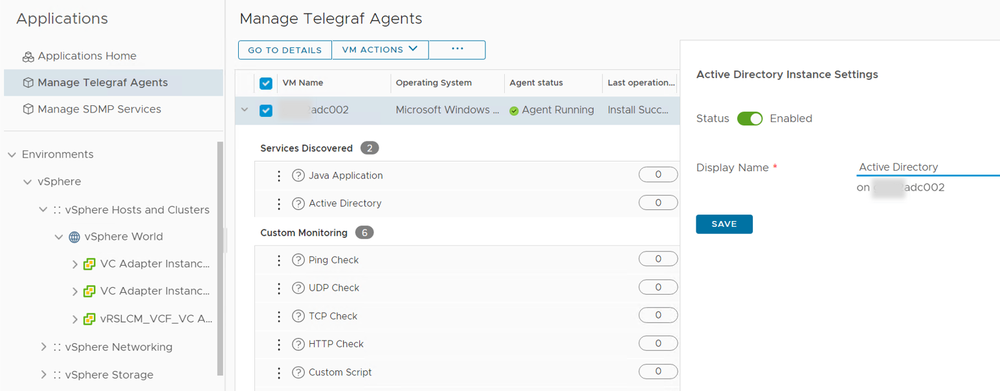
8. Perform steps 3 to 7 on each active directory server.
9. Post successful configuration. We can check the status of Active Directory application under **Environment** -> **Object Browser** -> **All Objects** -> **VMware vRealize Application Management Pack** -> **Active Directory**
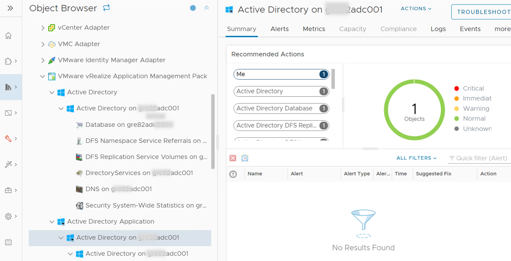

##### 5.2 - Enable custom service monitoring on VCS management VMs

As stated in **lldMonitoringLogging.md** we need to enable monitoring for specific services/processes on VCS management vms. The services and processes which need to be monitored are listed in **Table 2 Service List for Windows VMs**, **Table 3 Service List for Linux VMs**, **Table 4 Service List for vRA Cloud Proxy**.

##### 5.2.1 - Enable custom service monitoring on Windows management VMs

We need to enable service monitoring for services listed in **Table 2 Service List for Windows VMs**. On individual windows VM listed in this table we need to enable service monitoring for specified services. Please refer column **Display Name** and **Service Name** while configuring service monitoring.

###### Service List for Windows VMs

|   VM   |       Display Name               | Service Name |
| :----: | :------------------------------: | :----------: |
| adc001 | Active_Directory_Domain_Services |     NTDS     |
| adc001 |  Active_Directory_Web_Services   |     ADWS     |
| adc001 | Kerberos_Key_Distribution_Center |     KDC      |
| adc001 |             Netlogon             |   Netlogon   |
| adc001 |            DHCPServer            |  DHCPServer  |
| adc001 |           Windows_Time           |   W32Time    |
| adc001 |         DFSR_Replication         |     DFSR     |
| adc002 | Active_Directory_Domain_Services |     NTDS     |
| adc002 |  Active_Directory_Web_Services   |     ADWS     |
| adc002 | Kerberos_Key_Distribution_Center |     KDC      |
| adc002 |             Netlogon             |   Netlogon   |
| adc002 |            DHCPServer            |  DHCPServer  |
| adc002 |           Windows_Time           |   W32Time    |
| adc002 |         DFSR_Replication         |     DFSR     |
| wus001 |               wsus               | WsusService  |
| wus001 |           Windows_Time           |   W32Time    |
| ica001 |           Windows_Time           |   W32Time    |

Table 2 Services List for Windows VMs

Please perform following steps to enable custom windows service monitoring.  

1. Login to vROps UI with admin credentials
2. From the left menu, click **Environment**-> **Applications**. From the Applications panel, click **Manage Telegraf Agents**.
3. Select the target windows vm. e.g. select ica001 server.
4. The Telegraf agent must be running on this VM.
5. Expand the drop-down arrow against the target VM. You see the **Custom Monitoring** section.
6. From the **Custom Monitoring** section, select **Services** , click the vertical ellipsis and then click Add.
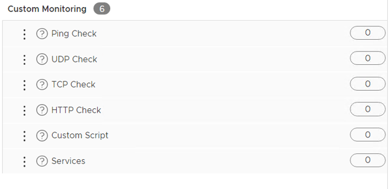
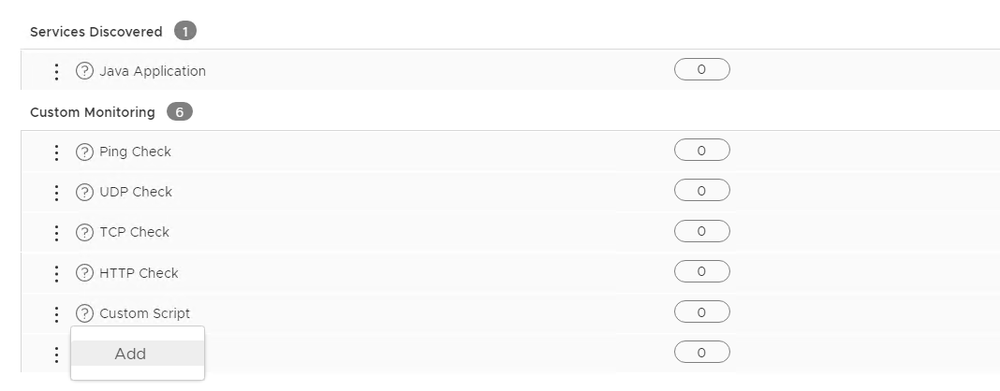
7. Enable the custom service from dialog box that is displayed on the right side.
8. Enter the Display name e.g **Windows_Time** and Service name  e.g. **W32Time** and click Save. It takes some time to enable the monitoring and fetch related metrics.

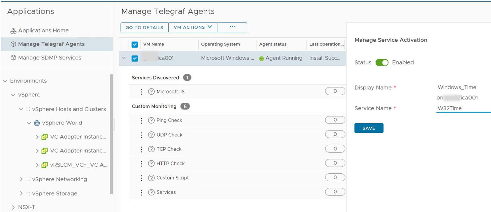

Please perform steps 3 to 8 on windows servers (listed in Table 2 Service List for Windows VMs) for services mentioned against these servers.
e.g. On wus001 server we need to enable custom monitoring for two services i.e wsusservice and W32Time.
In case of enabling multiple services on a server please add each service separately by clicking Add option.

These custom windows service objects can be viewed in vROps by navigating to **Environment** -> **Object Browser** -> **All Objects** -> **VMware vRealize Application Management Pack** -> **Services**

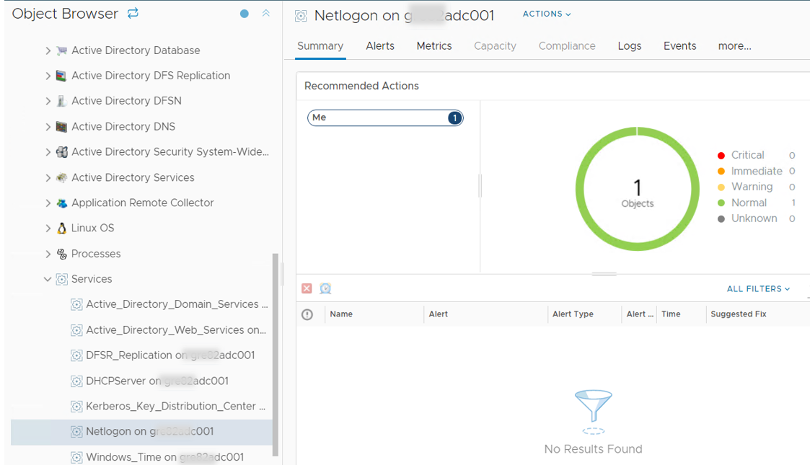

##### 5.2.2 - Enable custom process monitoring on Linux management VMs

We need to enable service monitoring for services listed in **Table 3 Service List for Linux VMs**. On individual linux VM listed in this table we need to enable process monitoring for specified processes. Please refer column **Display Name** and **Service Name** while configuring process monitoring.

>[!NOTE]
>
>**To verify if a service names is correct. Navigate to `Services` > `Select the Desired Service` > `Service name`.**
>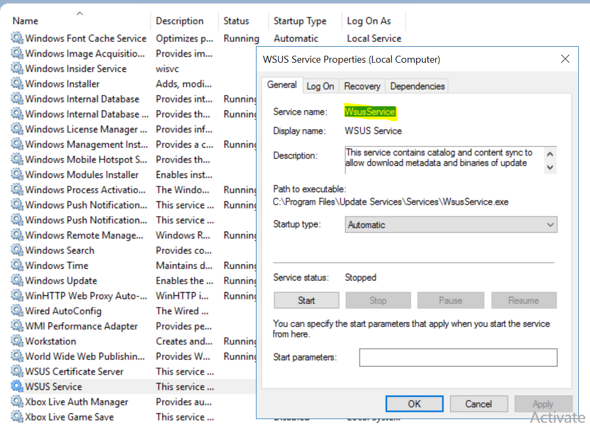

###### Service List for Linux VMs

|   VM   |       Display Name       | Service Name |
| :----: | :------------------------------: | :----------: |
| pxy002 | squid |     squid     |
| pxy002 | monit | monit |
| pxy003 | squid | squid |
| pxy003 | monit | monit |
| hsv001 | vault | vault |
| deb001 | webserver | apache2 |
| nes001 | nessusd | nessusd |
| nes001 | nessus-service | nessus-service |
| srs001 | postfix-qmgr |      qmgr      |
| srs001 | master | master |

Table 3 Services List for Linux VMs

Please perform following steps to enable custom linux process monitoring.  

1. Login to vROps UI with admin credentials
2. From the left menu, click **Environment**-> **Applications**. From the Applications panel, click **Manage Telegraf Agents**.
3. Select the target linux vm. e.g. select hsv001 server.
4. The Telegraf agent must be running on this VM.
5. Expand the drop-down arrow against the target VM. You see the **Custom Monitoring** section.
6. From the **Custom Monitoring** section, select **Processes** , click the vertical ellipsis and then click Add.
7. Enable the custom process from dialog box that is displayed on the right side.
8. Enter the Display name e.g **vault**. Select Filter Type as **Executable Name**. For setting Filter value please refer **Service Name** column of **Table 3 Service List for Linux VMs**. e.g. in case of hsv001 server for monitoring **vault** process we need to enter Filter value as **vault**.
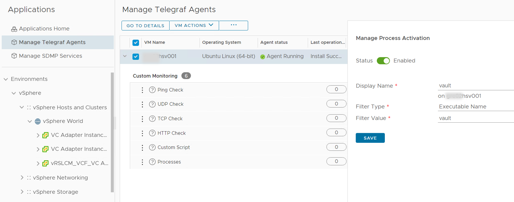
9. Click Save. It takes some time to enable the monitoring and fetch related metrics.

Please perform steps 3 to 9 on Linux servers (listed in Table 3 Service List for Linux VMs) for processes mentioned against these servers. In case of monitoring multiple processes on a server please add each process separately by clicking Add option.
e.g. On pxy002 server we need to enable custom monitoring for two processes i.e monit and squid.

These custom linux process objects can be viewed in vROps by navigating to **Environment** -> **Object Browser** -> **All Objects** -> **VMware vRealize Application Management Pack** -> **Processes**

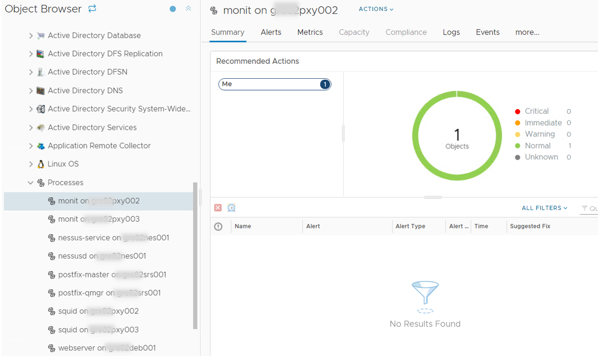

##### 5.2.3 - Enable custom Process Monitoring on vRA Cloud Proxy Appliance

Please perform following steps to enable custom process monitoring for CAS proxy appliance.  

1. Login to vROps UI with admin credentials
2. From the left menu, click **Environment**-> **Applications**. From the Applications panel, click **Manage Telegraf Agents**.
3. Select the target CAS proxy vm. e.g. select cas001 server.
4. The Telegraf agent must be running on this VM.
5. Expand the drop-down arrow against the target VM. You see the **Custom Monitoring** section.
6. From the **Custom Monitoring** section, select **Processes** , click the vertical ellipsis and then click Add.
7. Enable the custom process from dialog box that is displayed on the right side.
8. Enter the Display name as **rdc-proxy**. Select Filter Type as **Pid File**. Enter the Filter value as **/var/run/rdc-proxy.pid**

   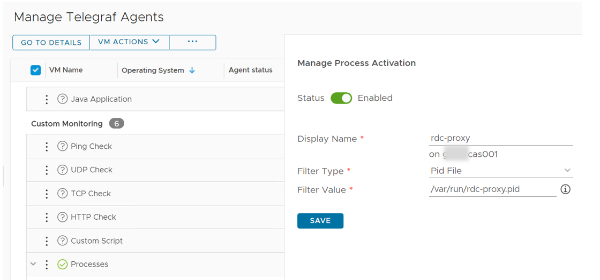

9. Click Save. It takes some time to enable the monitoring and fetch related metrics.

Follow the above mentioned steps on each vRA Cloud Proxy vm available in the environment.

###### Service List for vRA Cloud Proxy

|   VM   |       Service Display Name       | Filter       |   Filter Value     |
| :----: | :------------------------------: | :----------: | :----------------: |
| vRA CloudProxy | rdc-proxy |    Pid File     | /var/run/rdc-proxy.pid |

Table 4 Service List for vRA Cloud Proxy

### Important Note

In case you have changed the values of **componentCurrentVersion** and **componentNextVersion** variables available in */opt/dhc/update/group_vars/all* file for successful installation of Telegraf Agent. Then please revert this change and set the values of these variables back to their original value. Please ignore if you have not updated/changed these value.
