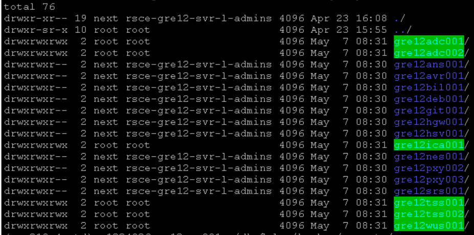

# Reporting Overview

## Table of Contents

- [Reporting Overview](#reporting-overview)
  - [Table of Contents](#table-of-contents)
  - [Changelog](#changelog)
  - [Introduction](#introduction)
    - [Purpose](#purpose)
    - [Audience](#audience)
    - [Scope](#scope)
  - [Related Documents](#related-documents)
  - [Gathering reports](#gathering-reports)
  - [Preparation of the reporting variables](#preparation-of-the-reporting-variables)
  - [Nessus - vulnerability report](#nessus---vulnerability-report)
    - [Gather reports manually](#gather-reports-manually)
    - [Mailing the reports automatically](#mailing-the-reports-automatically)
      - [Encrypting the file](#encrypting-the-file)
      - [Decrypting the file](#decrypting-the-file)
  - [Alcatraz - compliance report](#alcatraz---compliance-report)
    - [On demand Alcatraz report generation](#on-demand-alcatraz-report-generation)
    - [On demand upload Alcatraz reports to Tosca (Alcatraz ITCDB)](#on-demand-upload-alcatraz-reports-to-tosca-alcatraz-itcdb)
  - [Certificate Authority - expiring certificates report](#certificate-authority---expiring-certificates-report)
  - [Windows - patching report](#windows---patching-report)
  - [Linux - patching report](#linux---patching-report)
  - [Licensing - report](#licensing---report)
  - [Gathering reports using collectReports.yml playbook](#gathering-reports-using-collectreportsyml-playbook)
  - [Custom Reports](#custom-reports)
    - [Infoblox Custom Report](#infoblox-custom-report)
    - [vROps Custom Report](#vrops-custom-report)
    - [Customer User Expiration Report](#customer-user-expiration-report)
    - [VRA Cloud Users Report](#vra-cloud-users-report)
  - [VCS inventory scan reports](#vcs-inventory-scan-reports)
  - [Ubuntu OVAL report](#ubuntu-oval-report)
  - [AD User expiry notification](#ad-user-expiry-notification)
  - [vSAN Report](#vsan-report)
  - [CAPM - RVTools Report](#capm---rvtools-report)
  - [Tenantless VMs Report](#tenantless-vms-report)
  - [Password Expiration Report](#password-expiration-report)

## Changelog

| Version | Date       | Description              | Author(s)       |
| ------- | ---------- | ------------------------ | --------------- |
| 0.1     | 2020-03-23 | Initial draft creation   | Lukasz Tomaszewski |
| 0.2     | 2020-04-15 | Updated chapter 2.6 Licensing - report | Jakub Wosko |
| 0.3  | 2021-05-07 | dhc-1926 adjustments in alcatraz on demand reporting | Robert Kaminski |
| 0.4  | 2021-05-21 | dhc-2103 added authorization matrix report | Lukasz Tomaszewski |
| 0.5 | 2021-06-01 | HOTFIX - merge wiNessusReports into this document | Kacper Kuliberda |
| 0.6 | 2021-06-24 | DHC-2238 Local Region network amendment | Lukasz Tomaszewski |
| 0.7 | 2021-09-29 | DHC-2976 Added section about collectReports playbook | Adam Szymczak |
| 0.8 | 2022-04-26 | DHC-2976 DHC-3584 Added paragraph on Custom Reports | Margo Piliukh |
| 0.9 | 2023-02-17 | CESDHC-6110 information regarding VCS inventory scan reports | Jakub Zielinski |
| 0.10 | 2023-03-16 | CESDHC-6263 update information regarding VCS inventory scan reports | Marcelino Sanchez |
| 0.11 | 2023-04-06 | VCS-9362 Updated license report folder (manage) | Krystian Bibik |
| 0.12 | 2023-09-28 | VCS-10948 Create expiration report of AD Customer Users | Adrian Ilea |
| 0.13 | 2023-11-17 | VCS-11494 Create expiry notification for AD Users | Adam Szymczak |
| 0.14 | 2024-01-31 | VCS-6275 removed numbering of sections along with some sections for License, vRA and ARA reporting i.e 2.7, and 2.8(old numbering) | Vani Tatipamula |
| 0.15 | 2024-01-31 | VCS-6556 updated documentation for VRA Cloud Users Report | Vani Tatipamula |
| 0.16 | 2024-03-01 | VCS-12271 Added reference to WI for updating certificates | Stanislaw Kilanowski |
| 0.17 | 2024-09-04 | VCS-13804 Added cron option for Certificate Expiry report | Adam Szymczak |
| 0.18 | 2025-02-04 | VCS-15011 Added e-mail reporting to inventory scans | Stanislaw Kilanowski |
| 0.19 | 2025-04-09 | VCS-14426 Password update not working when different drive is used | Adriana Slabu |
| 0.20 | 2024-11-21 | VCS-14293 Added reference to WI for executing OVAL scans | Stanislaw Kilanowski |
| 0.21 | 2026-04-30 | VCS-18345 Added reporting variable instructions | Michał Braun-Sobieraj |

## Introduction

### Purpose

Generate reports that are available in VCS environment.

### Audience

- VCS Engineers
- VCS Operations

### Scope

Reports available in VCS

- Preparation of the reporting variables
- Nessus vulnerability report
- Alcatraz compliance report
- Certificate Authority - expiring certificates
- Windows patching report
- Linux patching report
- Licensing report
- Components integration report
- OVAL report

## Related Documents

This document is a subset of Atos Technology Lifecycle Management (ATLM) artefacts. All documents are stored in the VCS Documentation
repository

## Gathering reports

Before turn over to production (TOP) engineer/architect can run several tasks that procure reports, to check the current state of components related to:

- security
- compliance
- patching
- networking
- certificate expiration
- licensing
- components integration (vRA Cloud)

>**DISCLAIMER!** All screenshots are for illustrative purposes only.

## Preparation of the reporting variables

Before running any of the reports engineers are required to run ```addEntryToMailRecipients.yml``` playbook from the manage phase repository.

During playbook usage the user should create reportEmail group with mails suitable for the given client. One of the emails always must be one of DevSecOps mailboxes dependent on the location and customer agreements.

## Nessus - vulnerability report

Description:  
Management environment requires periodic vulnerability scans. Nessus Vulnerability Scanner has been chosen as a security scanner. There are two scans created:

- Scan_MGMT - used to scan full subnet range within management network
- Scan_AvnCrossRegion - used to scan full subnet range within Cross Region network
- Scan_AvnLocalRegion - used to scan full subnet range within Local Region network

If you use ansible, playbook runs both scans in the execution. To start scan and export results in the csv format run on ansible control host:

Execute:

```bash
ansible-playbook runNessusScan.yml --tags runScan
ansible-playbook runNessusScan.yml --tags exportScan
```

### Gather reports manually

To check and see reports, login to Nessus (nes001) server and explore directory:

1. SSH to nes001
2. Change directory:
   cd /opt/nessus/var/dhcReports/nessus
3. List directory content (Figure 1)
   ls -al

You can also access Nessus via web browser.

1. In your web browser open `https://<nessus_server_fqdn>:8834/#/`
2. There should be two defined scans. You can run each by clicking triangle icon on the far right of each defined scan
3. Once completed, click on scan name. You will see the current run result
4. To export the report click Report->HTML (or CSV if you prefer) on the right upper right section of the page

### Mailing the reports automatically

If you wish to only encrypt and send the last performed scan, the first task `runScan` can be omitted.

Execute:

```bash
ansible-playbook runNessusScan.yml --tags runScan
ansible-playbook runNessusScan.yml --tags encryptSendScan
```

#### Encrypting the file

After a scan is exported by the `runNessusScan` playbook via the use of the `encryptSendScan` tag
it is encrypted via `gpg`. In order to do this, gpg needs a passphrase with which the file can be decrypted.  
Currently this passphrase is located in HashiCorp Vault in Nessus secrets as 'email'.

Afterwards this encrypted file is mailed to a recipient/list of recipients that are currently located in `manage/roles/dhc-manageNessusScans/defaults/main.yml`.

#### Decrypting the file

In order to decrypt the report file you need to:

- know the passphrase used to encrypt it
- have gpg installed on the recipient's computer

Depending on which tool you choose to decrypt the file (GnuPG or Gpg4win) the process is slightly different (covered in their documentation).  
Regardless of which tool should you choose, the resulting file will be the decrypted report file.

## Alcatraz - compliance report

---

### On demand Alcatraz report generation

Description:
Compliance scans can be executed against all windows and linux VCS management servers. Reports will be generated and stored locally. Solution is desired for environments not integrated with Alcatraz framework (no upload to Tosca).

Execute the following playbook on *ans001* server from */opt/dhc/manage* folder, to generate alcatraz reports

```shell
ansible-playbook generateAlcatrazReports.yml
```

>Playbook:
>
>- prompts for user dasId from the VCS managment domain in format `dasId@domain.next`
>- generates alcatraz scans against linux servers
>- generates alcatraz scans against windows servers
>- stores reports on *ans001* server in `/backup/reports/` folder. One report per server in a format `<timestamp>_<hostname>_result.xml`.



You may use tags to limit hosts scope, for example:

```shell
ansible-playbook generateAlcatrazReports.yml --tags runScanAlcatrazWindows
ansible-playbook generateAlcatrazReports.yml --tags runScanAlcatrazLinux
```

---

### On demand upload Alcatraz reports to Tosca (Alcatraz ITCDB)

Perform steps described in [Integration steps with alcatraz framework tosca](wiAlcatrazIntegration.md) upfront in order to be able to upload reports to Tosca.

To generate alcatraz reports and send them to Alcatraz framework (Tosca), execute the following playbook:

```shell
ansible-playbook generateAlcatrazReports.yml -e enableTosca=true
```

>Playbook:
>
>- prompts for user dasId from the VCS management domain in format `dasId@domain.next`
>- generates alcatraz scans against linux servers
>- generates alcatraz scans against windows servers
>- stores reports on *ans001* server in `/backup/reports/` folder. One report per server.
>- sends compliance reports to Alcatraz ITCDB.
> *It requires upfront Alcatraz configuration inputs stored in VCS and firewall flow opened to 161.89.90.30 (alcatraz-itcdb.it-solutions.myatos.net)*.

## Certificate Authority - expiring certificates report

Description:  

All certificates issued by VCS Certificate Authority have certificate expiration date, which depends on template used during signing process. </br>
Web server certificates, which are the most commonly requested, are valid for two years. VCS system administrators are required to periodically check which certificates are going to expire soon, and it it happens they should request and replace them on target systems. In order to replace them, please follow wiUpdateCertificates.md work instruction.
The playbook createCertificateReport.yml creates report with certificates which expiration date is shorter than 30 days.

Gather report:

```shell
ansible-playbook createCertificateReport.yml
```

To create report without sending it by email:

```shell
ansible-playbook createCertificateReport.yml -t createReport
```

Gather reports:

Report is delivered to mailbox by default. Confirm reports are in destination directory in case it was not delivered:

1. RDP to ica001
2. Open file explorer and go to directory:
   C:\Reports
3. Click on the newest report (filename: `DHC-<customerCode>-<locationCode>-CertificateExpiryReport-<execution_timestamp>.html`)
4. Check if there are any certificates reported as expiring

Latest report present in directory can be sent by email using:

```shell
ansible-playbook createCertificateReport.yml -t sendReport
```

Report can be scheduled as monthly cron job using:

```shell
ansible-playbook createCertificateReport.yml -t configureCron
```

In case different customerCode or locationCode is expected in report name use the following command:

```shell
ansible-playbook createCertificateReport.yml -t configureCron -e reportCustomer=<customCustomerCode> -e reportLocationCode=<customLocationCode>
```

## Windows - patching report

Description:  
VCS uses WSUS server (wus001) which acts as a patch repository. Patching process is triggered on target windows hosts from Ansible Control node (ans001).  
There are 3 types of reports generated by solution:

- General and detailed post-patching reports are generated automatically when patch is requested from Ansible Control node
- General on-demand report
- Detailed on-demand report

All reports are stored on WSUS server in a dedicated folder: D:\AnsiblePatchReport.

For detailed information about Windows patching or generating on-demand reports, please read [windowsPatching](windowsPatching.md) work instruction.

Execute in /opt/dhc/manage:

```shell
# request patching
ansible-playbook patchWindows.yml -e "HOSTS=<names of hosts or groups>"
```

Gather reports

Confirm reports are in destination directory:

1. RDP to wus001
2. Open file explorer and go to directory:
   D:\AnsiblePatchReport\post_patching
3. Click on the newest report (filename: `<HOSTS>_<date>_<time>_report.html`)

## Linux - patching report

Description:  
VCS provides its own internal deb repository host, DEB001. It is Aptly service which mirrors packages, creates snapshots, and publishes them and Apache service which makes them downloadable. Patching process is triggered on target linux hosts from Ansible Control node (ans001).  
There are 3 types of reports generated by solution:  

- General and detailed post-patching report is generated after each patching automatically
- General on-demand report
- Detailed on-demand report
  
All reports are stored on deb001 server in a dedicated folder: /data/ansiblepatchreport.

For detailed information about Linux patching or generating on-demand reports, please read [linuxPatching work instruction](linuxPatching.md).

Execute in /opt/dhc/manage:

```shell
# request patching
ansible-playbook patchLinux.yml -e "HOSTS=<names of hosts or groups>"
```

Gather reports:

Confirm reports are in destination directory:

1. SSH to DEB repository (deb001)
2. Change directory
   cd /data/ansiblepatchreport/postPatchingReport
3. Verify if report exists (filename: `<HOSTS>.<date>_<time>.html`)

## Licensing - report

Description:  
This report collects data about licenses used in VCS management cluster.  
The report contains information about licenses:

- VMware
- Microsoft Windows Server
- Ubuntu Linux
- Nessus
- Antivirus
- Backup solution

Report is stored on Ansible Control node (ans001) in a dedicated folder:

- for deployment phase: `/opt/dhc/manage/roles/dhc-generateLicensesReport/files`
- for manage phase: `/backup/reports`

Execute in /opt/dhc/manage or /opt/dhc/manage:

```shell
ansible-playbook generateLicensesReport.yml
```

Gather reports:

To check and see reports, login to Ansible Control node (ans001) server and explore directory:

1. SSH to ans001
2. Change directory
   cd /opt/dhc/manage/roles/dhc-generateLicensesReport/files (manage phase) or
   cd /backup/reports (manage phase)
3. verify if report exists (filename: dhcLicensesReport.html)

## Gathering reports using collectReports.yml playbook

If there is need to gather all previously generated reports in one location you can use collectReports.yml playbook. It copies reports from their default location to one specified in **reportsDirectory** variable. By default it is **/opt/reports/dhcReports**. The following reports are copied by this playbook:

- Nessus - vulnerability report
- Alcatraz - compliance report
- Certificate Authority - expiring certificates report
- Windows - patching report
- Linux - patching report
- Licensing - report
- Components integration - vRA Cloud report
- Authorization matrix - AD users and service accounts report

Execute in /opt/dhc/manage:

```shell
ansible-playbook collectReports.yml
```

Example execution with different target directory (do not add "/" at the end of the path):

```shell
ansible-playbook collectReports.yml -e "reportsDirectory=<directory path>"
```

## Custom Reports

Customer or third parties might require a custom report for which will contain particular information about the environment. In such case a custom report can be created using different tools and provided on-demand. Such report can be requested using a SNOW SSR - **Provide Custom Report**.

In certain cases, specific reports are generated using PowerShell scripts stored in the "D:\Scripts\" directory on TSS002. Such reports are scheduled to run at regular intervals via the Windows Task Scheduler on the same server. **Because of this, it's important that, on TSS002, a drive D is created. Moreover, once this drive gets created, it's necessary an additional folder named: "Scripts" to be added**, as for the majority of these type of scripts, the location is hardcoded as "D:\Scripts\".

Without a valid path, not only that scheduled task would fail to launch, but also failures on password update playbooks would occur. Examples of these kind of custom reports using task scheduler and drive D in TSS002 are: vSANReport, CAPM (RVTool report), CustUsersReport, UserPasswordRxpiryNotification, TenantlessVMsReport (for environment with multiple tenants), etc.

### Infoblox Custom Report

You can create a custom report on the network components using Infoblox Reporting.
The general instructions are described in the Infoblox manual under this [link](https://www.infoblox.com/wp-content/uploads/infoblox-deployment-guide-implementing-infoblox-reporting-and-analytics.pdf) (pages 16-18).

A separate work instruction has been created specifically for Network Capacity Report using the same method: [Network Capacity Report WI](./wiNetworkCapacityReport.md).

### vROps Custom Report

A wide range of reporting capabilities are presented by vROps. You can create a report on any component for which metrics are being collected by vRealize Operations.

Each report is based on a view or several views and you can use the existing ones or create a custom view as needed.
A good guide on how to create a view and a custom report is described in [vROps Snapshot Report WI](wiVropsSnapshotReportScheduling.md). Please use it as an example to creating such reports.

### Customer User Expiration Report

Anaya and Hachette customers requested from us weekly report of expiring users in the environment.

A custom report is created for VCS AD customer users with the expiry date for each user as described in workinstruction [wiCustUsersReport.md](wiCustUsersReport.md).

### VRA Cloud Users Report

To generate report of vRA-Cloud users for a specified organization, you can run the below mentioned playbook from Manage Phase.

Execute in /opt/dhc/manage:

```shell
ansible-playbook generateVraCloudUsersReport.yml --tags single
ansible-playbook generateVraCloudUsersReport.yml --tags multi
```

Please specify if the playbook is executed for single tenant (tag: `single`) or multiple (tag: `multi`).
The playbook generates reports in html and csv format. The final reports are stored under '/backup/reports/vRA_users_reports' directory on ansible server.

*Important note*: Before running this playbook, you need to obtain API token from a privileged account and copy long organization ID from the vRA-Cloud. For Master Organization API token, please contact DevSecOps team stream lead.

## VCS inventory scan reports

There are two types of reports that are possible to be gathered from an instance of VCS after the hardening part is done: one for non-VCF components and one for VCF components. The first one is created by playbook /opt/dhc/manage/createInventoryScanReport.yml while the second one is generated by /opt/dhc/manage/getVcfComponentVersions.yml. In order to schedule their automatic creation, please run the following commands from /opt/dhc/manage folder:

For non-VCF components please run the following playbook:

```shell
/opt/dhc/manage/ansible-playbook createInventoryScanReport.yml --tags createSchedule
```

For VCF components please run the following playbook:

```shell
/opt/dhc/manage/ansible-playbook getVcfComponentVersions.yml --tags createSchedule
```

Playbooks scheduled in this way will be executed daily at 6:00 UTC and 7:00 UTC respectively.

The automation05 HashiVault account responsible for credentials necessary to gather the data for both reports is created automatically while the cron schedule is being created. The reports are automatically copied to S3 for safekeeping and sent via an e-mail (by default to VCS DevSecOps but can be overwritten with extra vars). They are also being fed to the DHC-Dashboard application to ease visibility and to allow us to view any misconfigurations more easily.

You can also create the reports on demand and decide which components interest you by changing the tags part of the above commands to one listed in the playbooks, for instance:

```shell
/opt/dhc/manage/ansible-playbook createInventoryScanReport.yml --tags proxies,bastion
```

Please note that for checking VRO components it is required to have a valid CAS user token (authorizationToken-aXXXXXX) stored in the HashiVault. This user token MUST be generated via createVracloudToken.yml playbook upfront and expires after 24 hours.

## Ubuntu OVAL report

Description:
Management Ubuntu VMs can be scanned using the OVAL vulnerability and patch definitions to generate report for Common Vulnerabilities and Exposures (CVEs) and to determine whether a particular patch, via an Ubuntu Security Notice (USN), is appropriate for the local system.

The process of manual and automatic execution of the scans is described in the [wiConfigureOvalUbuntu.md](wiConfigureOvalUbuntu.md).

---

## AD User expiry notification

To configure mail notification task on TSS002, that will notify AD users when their password is about to expire, run:

```shell
ansible-playbook configureUserPasswordExpiryNotification.yml
```

In case TSS002 doesn't have 'D' disk run playbook with extra vars:

```shell
ansible-playbook configureUserPasswordExpiryNotification.yml -e "scriptDirectory=C:\\Scripts\\UserPasswordExpiryNotification"
```

This scheduled task will:

- scan all users in AD to find which ones are close to expiry (14 days or less)
- send mail notifications to all users with 7,3,2,1 and 0 days until password expiry
- if no email is configured for AD user notification will be sent to VCS Team group mailbox instead
- generate csv report in script directory

## vSAN Report

In order to generate a more specific vSAN capacity report (which could include details like Fault to tolerate, Provisioned space etc.), a decision was made to develop a PowerShell script rather than using vROPs. For work instruction on setting it up please follow: [wiVSANReport.md](wiVSANReport.md).

Manual steps will be required, from creating necessary folder and copying the script, to schedulling it on the TSS002 with the correct service account: svc-locationCode-vcs01. To add admin permission on vCenter Server to vcs01 service account run:

```shell
ansible-playbook configureVsanReportServiceAccount.yml
```

## CAPM - RVTools Report

The RVTools report offers valuable insights into any vSphere environment. The main function of RVTools is reporting on the configuration of vCenter Servers, ESXi servers, and the virtual machines (VMs) that reside on a vSphere environment, including cluster configuration, networking, storage and snapshots.

For detailed information on how to configure it, please read [RvTools Report work instruction](wiRvToolsReport.md).

To configure the report, please run playbook:

```shell
ansible-playbook configureRvToolsReport.yml
```

>Note: Playbook runs dhc-configureRvToolsReport role that configures RVTools report on TSS002.

## Tenantless VMs Report

This type of report is only used in the environment where multiple tenants are configured (ex. BTN) and it gathers a list of VMs which are missing the tenant tag.

To configure it please run the following playbook:

```shell
ansible-playbook configureTenantlessVMSReport.yml
```

Playbook runs dhc-configureTenantlessVmsReport role which creates PowerShell script on Terminal Server that will be executed weekly using Task Scheduler to create and deliver Tenantless VMs report report to selected recipients by mail.

## Password Expiration Report

In order to prevent password expiration and also to check the status of all management accounts, a dedicated playbook was created, getPasswordExpiration.yml.

The scope of this report is to provide information on the date the password was last changed and its expiration date. Additionally, it serves as de facto evidence of password rotation for team (since it has all passwords info collected).

This playbook can be run using tags: linux, windows, etc. To get information about all the accounts status, playbook can be ran without any tag:

```shell
ansible-playbook getPasswordExpiration.yml
```

One use case of running it using tag would be, for example, to get information about password expiration for specific linux users (ex. next, root, etc). In this case, run the playbook with '--tags linux':

```shell
ansible-playbook getPasswordExpiration.yml --tags linux
```

When the playbook is executed, it will create in user home directory the output file "expirePassList.html" with information about DHC password rotation status.

This playbook can be set up with configurePasswordRotationCron.yml, to create cron job for password password expiry report:

```shell
ansible-playbook configurePasswordRotationCron.yml --tags expiryReport
```
