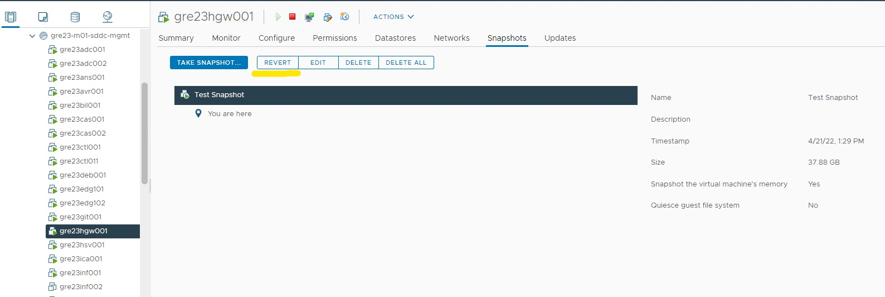

# Restore VM from Snapshot

## Changelog

| version | Date       |Issue| Description                 | Author(s)           |
| ------- | ---------- | ----| --------------------------- | ------------------- |
| 0.1     | 21.04.2022 |DHC-3582 | Initial version            | Margo Piliukh |

## Introduction

### Purpose

Restore a VM from snapshot.

### Audience

- VCS Operations

### Scope

The work instruction is intended to document the process of restoring a VM from a snapshot.

## Procedure

1. Log into vCenter server.
2. Navigate to the VM you would like to revert to the previous state.
3. Click on **Snapshots** tab and find the snapshot you want to revert to.
4. Click on **Revert** and confirm the action.

> NOTE: Depending on whether the snapshot was taken including the virtual machine's memory, you might need to power on that VM.
