# Restrict Domain Administrator account  

- Table of Contents
{:toc}

## Changelog

|    Date    |   Issue    |      Author     |  Description  |
| ---------- | ---------- | --------------- | ------------- |
| 12.09.2023 |  VCS-10865 | Adam Wieczorek  | initial draft |

## Introduction

This document was created to be applied as a quick fix for critical vulnerability discovered during Paris 2024 environment set up.  

## Purpose

The purpose of this Work Instruction is to describe process of restricting build-in domain Administrator account as described in **TECHNICAL SECURITY SPECIFICATIONS FOR ACTIVE DIRECTORY DOMAIN SERVICES**, Measure ID **ADS0012**.
According to these guidelines build-in domain Administrator account should not be allowed to login to neither Domain Controller nor any other domain Memeber Servers from network, as service, as batch job or through Remote Desktop Services.  
The preferred method of implementing these security guidelines is through Group Policy mechanism by modifying existing Group Policy objects.  

# Implementation

## Prerequisites

This vulnerability remediation assumes restricting domain Administrator account and replacing it with service account `svc-<locationCode>-ans01` account in all playbooks and tasks in Manage phase. In order to apply necessery permissions for this service account make sure to run `addAns01ToDomainAdmins.yml` playbook before proceeding with implementing this Work Instruction.  

Also make sure that Active Directory is healthy and both controllers are online and in sync.  

## Implementation Procedure

### **1. Login to domain joined Windows server**  

Login to TSS servers or any other Windows server that is domain joined, apart from domain controllers. From `Run` menu launch `mmc` console, select `File>Add/Remove Snap-in...`.  
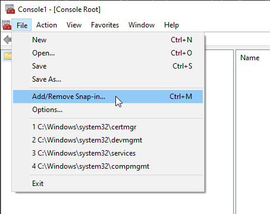  
From the Snap-in list select `Resultant Set of Policy` and click `Add` in the middle pane. Make sure that `Resultant Set of Policy` snap-in is listed in the right pane called `Selected snap-ins` as on the print screen. Click `OK`  
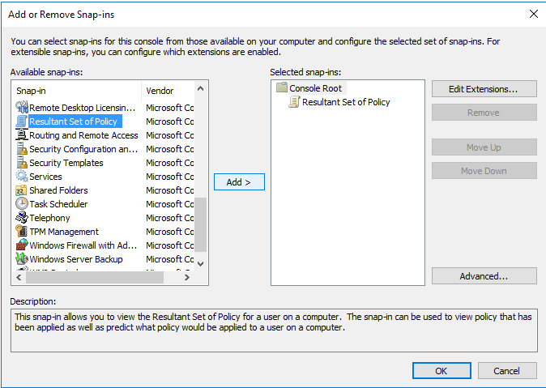

### **2. Generate RSOP**  

In the console window right-click `Resultant Set of Policy` and select `Generate RSoP Data`.  
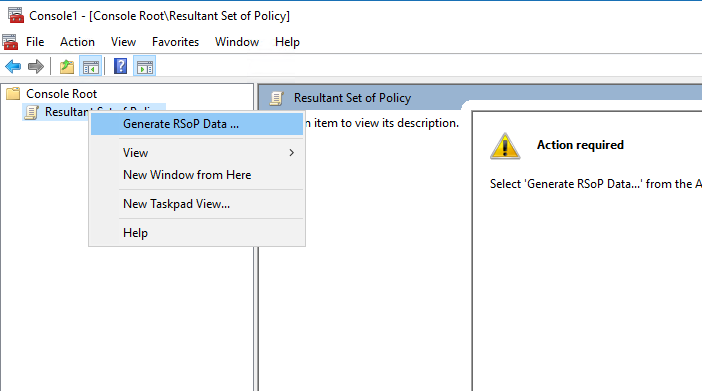  
On the pop-out Wizard Welcome screen click `Next`, on the next screen select `Loggin mode`, click `Next`  
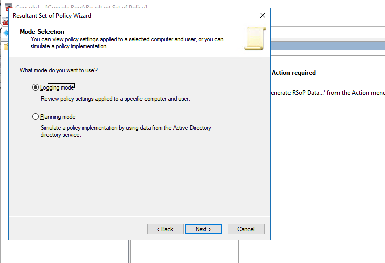  
Select `This computer`, click `Next`  
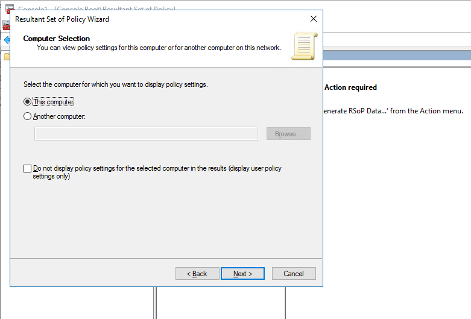  
On the next screen select `Do not display user policy settings in the results`, click `Next`  
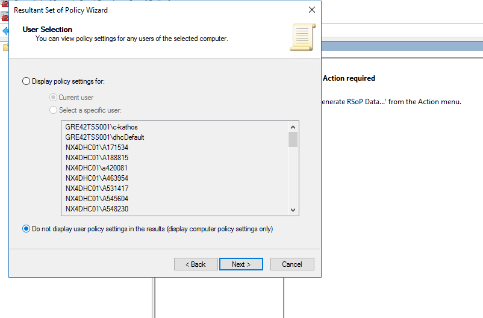  
On the next screen UNselect `Gather extended error information` checkbox.  
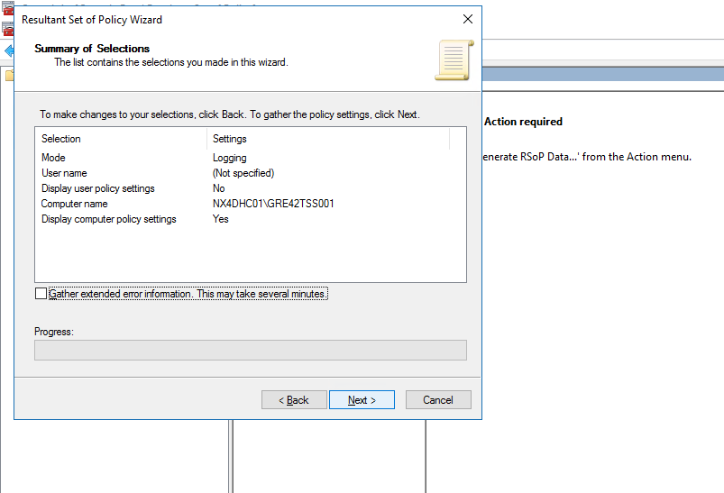  

Once RSoP generation is finished click `Finish`

### **3. Gather GPO information**  

In the generated results navigate to `Computer Configuration > Windows Settings > Security Settings > Local Policies > User Rights Assignment`.  
On the Policy list in the middle pane find following settings and note down `Source GPO` name for each of the settings listed below. For all settings it should be the same policy - `<locationCode>-AD-MemberServerBasic-v0007`

- Deny access to this computer from the network
- Deny log on as a batch job
- Deny log on as a service
- Deny log on through Remote Desktop Services  
  
  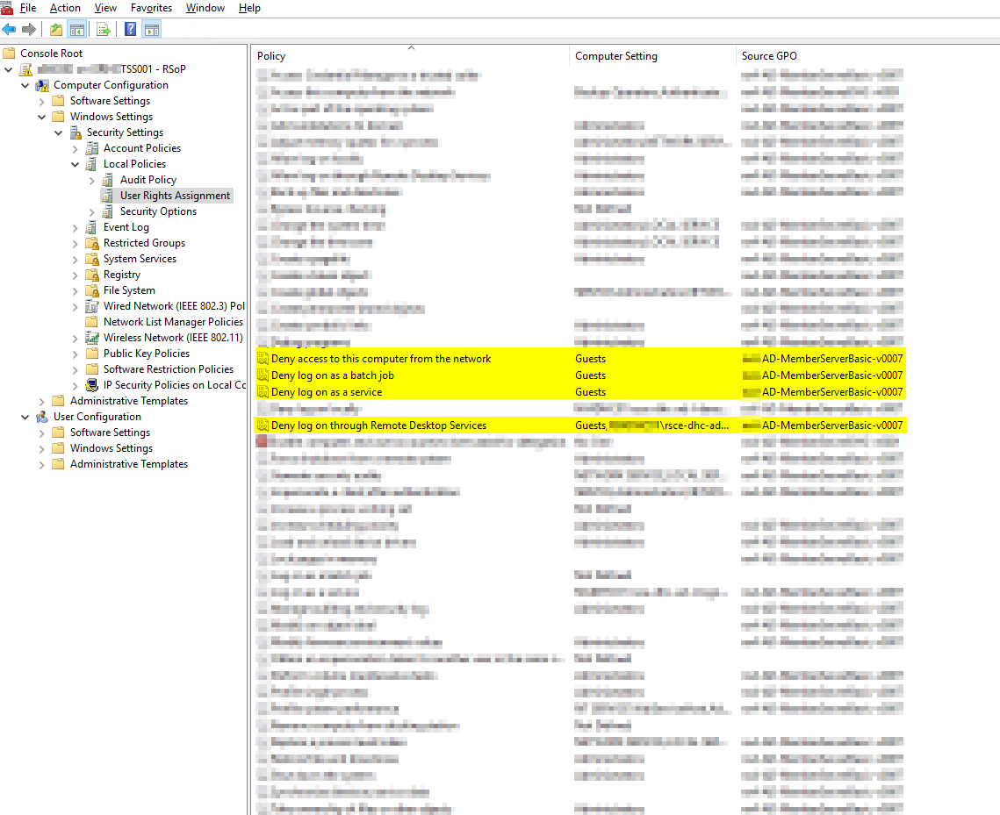  
  
  Repeat the same procedure by logging into one of the Domain Controllers servers. For the DC server policy name should be `<locationCode>-AD-DomControllerBasic-v0007`  
  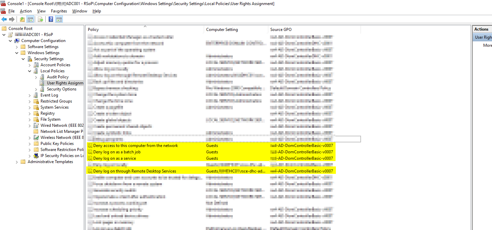  
  
  >Note  
  >If the policy/ies name(s) are different than provided above continue this procedure but make sure to modify correct policies.  

### **4. Verify GPO replication status**  
  
From the `Run` menu start Group Policy Management console by typing `gpmc.msc`.  
In the console window navigate to `Forrest <domainName> > Domains > <domainName> > Group Policy Objects`. From the list of Group Policies select first policy noted down in the point 3 of this WI.  
In the right pane select `Status` tab and click on `Detect now` button in the bottom-right corner.  
There should be one (1) domain controller with `replication in sync`. Otherwise fix replication issue before continuing.  
Repeat the same for second policy from step 3.  
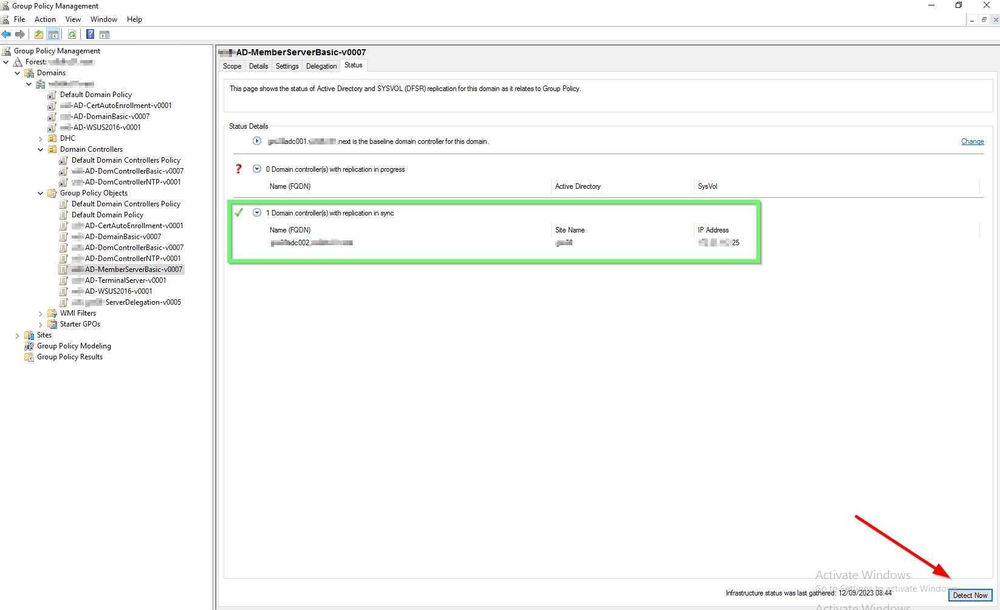  

### **5. Modify GPO**

Login to one of domain controllers and open Group Policy Management console and navigate to `Group Policy Objects` as in previous step.  
Right-click one of the policies noted down in step 3, ie. `<locationCode>-AD-MemberServerBasic-v0007` and from context menu select `Edit`.  
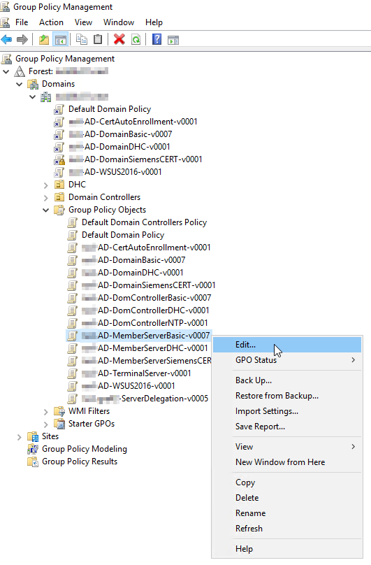  
 
In the new windows navigate to `Computer Configuration > Policies > Windows Settings > Security Settings > Local Policies > User Rights Assignment`.  
In the middle pane find `Deny access to this computer from the network` setting, double-click it, select `Add User or Group`, click `Browse` and type `administrator` in the new pop-out windows, click `Check Names` and make sure to select `Administrator` user NOT `Administrators` group. Click `Ok` to close all windows.  
Make sure `Administrator` account is on the list for the `Deny access to this computer from the network` setting as well as any user/group that was already there.  
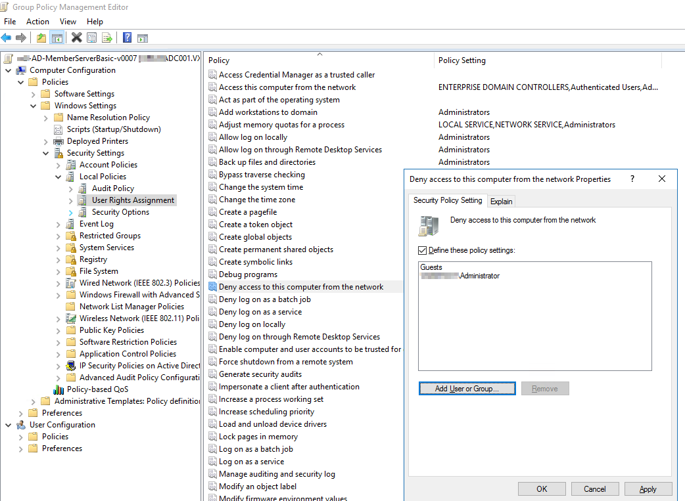  

Repeat this step for current policy for remaining 3 settings from that list.

- Deny access to this computer from the network
- Deny log on as a batch job
- Deny log on as a service
- Deny log on through Remote Desktop Services

Repeat above procedure for the second policy, in this example it would be `<locationCode>-AD-DomControllerBasic-v0007`.

## Verification

Verification process verifies policies replication and effectiveness. It will mainly refer to previously described tasks.  

### **1. GPO sync verification**

For both policies one again check if sync status is ok as described in point 4 of Implementation Procedure.

### **2. Check RSoP data**

Perform this task on both Domain Controllers and at least one domain Member Server such as TSS or WUS.  
Launch Windows Command Line or PowerShell window and run command `gpupdate /force`.  Once the command is completed generate RSoP once again as described in step 2.  
Make sure that for the settings described in step 3 `Administrator` account is listed.  
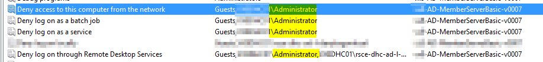  

### **3. Verify RDP connectivity**

Complete this step only if previous step was completed on the given server.  
Try to login to the server through RDP, ie. Domain Controller using `Administrator@<domainName>` account. Expected result should be inability to login through RDP.  
Repeat this step for any other server which is not Domain Controller and on which you performed step 2.

## Rollback

In case there is a need to rollback changes described in this WI login to Domain Controller through RDP or directly though console and remove `Administrator` account from all four setting in both edited policies.  
To speed up policy application process run `gpupdate /force` command on the necessary server.
