# Reverse Proxy setup for hosting NSX Application Platform (NAPP)

## Table of Contents

- [Reverse Proxy setup for hosting NSX Application Platform (NAPP)](#reverse-proxy-setup-for-hosting-nsx-application-platform-napp)
  - [Table of Contents](#table-of-contents)
  - [List of Changes](#list-of-changes)
  - [Introduction](#introduction)
    - [Purpose](#purpose)
    - [Audience](#audience)
    - [Scope](#scope)
  - [Deployment of linux Servers Ubuntu](#deployment-of-linux-servers-ubuntu)
  - [Patch servers with latest repo](#patch-servers-with-latest-repo)
  - [Hardening of Linux servers](#hardening-of-linux-servers)
  - [Install Nginx in both the servers](#install-nginx-in-both-the-servers)
  - [Create CSR including the VIP and Nginx server names as SAN Name](#create-csr-including-the-vip-and-nginx-server-names-as-san-name)
  - [Copy the certificate in the backend Nginx server](#copy-the-certificate-in-the-backend-nginx-server)
  - [Configure the Nginx server with only 443 port enabled](#configure-the-nginx-server-with-only-443-port-enabled)
  - [Configure the Virtual Host with reverse proxy rules according to the “location” required](#configure-the-virtual-host-with-reverse-proxy-rules-according-to-the-location-required)
  - [Setup a VIP with these two Nginx servers as its backend](#setup-a-vip-with-these-two-nginx-servers-as-its-backend)
  - [Start the Nginx and verify the Reverse proxy](#start-the-nginx-and-verify-the-reverse-proxy)

## List of Changes

| Version | Date       | Author       | Issue    | Changes           |
|---------|------------|--------------|----------|-------------------|
| 0.1     | 11.03.2024 | Aswin Arumugam | VCS-11949| Document creation |

## Introduction

### Purpose

The Purpose of the document is to understand the procedure/steps to setup Reverse proxy application to host NSX-T Application Platform(NAPP)

### Audience

This document is intended for Atos Cloud Services Engineers and Architects responsible for setting up and hosting the NSX-T Application Platform to the external customers in DHC.

### Scope

This document covers Reverse Proxy setup using Nginx application in linux servers for hosting NSX Application Platform.

## Deployment of linux Servers Ubuntu

- First we would need the latest version of Ubuntu template used in the DHC.
- Upload the ovf in the vCenter.
- We have reused the Ansible playbook to deploy the Ubuntu Linux servers.
- Run the playbook specifying the template name, server name and IP address that has to be assigned.

## Patch servers with latest repo

- We do have a playbook that will help us in patching the linux servers upto the latest patch.
- We can run that playbook once and check if that is patching.
- Post the playbook run please run the below command to check if the servers are upto date.
- If you still see packages available for update then you will need to upgrade it.
  - #apt update
  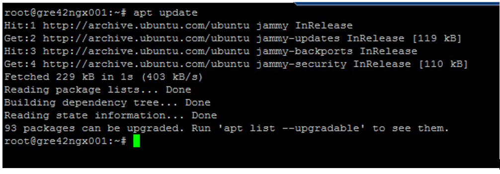
- Run the below command for upgrade.
  - #apt-get upgrade
  - #apt-get update
- Once the patch is completed then once again verify the server.
- And also check the kernel version in the server.
  - #uname -a
  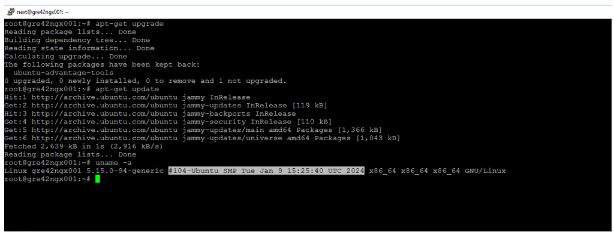

## Hardening of Linux servers

- We will have to make our linux servers security hardened.
- Once patching is done we have to do Nessus scan for the servers.
- Scanning can be done with two different methods
  - By running the scan without SSH to the servers --> This will only scan from outside the server
  - By running the scan providing SSH credentials --> This is a full scan

Please check the [Nessus Scan](./wiNessusScan.md) link for details.

**Note:** We did not get any vulnerability reported when we did the testing.
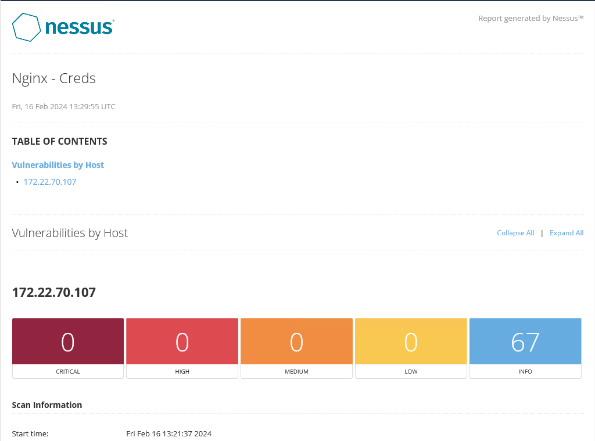

## Install Nginx in both the servers

- Nginx package would most probably present in the repo. Run the below command to check it.
- Command to check if the package is already present/installed or not.
  - #apt list | grep installed | grep nginx
    
- Below command will let us know if the package is present in our repo.
  - #apt list nginx
    
- Install the Nginx packages.
  - #apt install nginx
  
- Verify if the package is installed.
  - #apt list | grep installed | grep nginx
  
- Check if the Nginx service is started without any issues.
  - #systemctl status nginx
  
- Also install "Net-tools" packages for getting the "telnet & Netstat" command.
  - #apt-get install net-tools
  

## Create CSR including the VIP and Nginx server names as SAN Name

- It is better if we generate a signed certificate before we start configuring the reverse proxy virtual host.
- Considerations for Certificate:
  - We will have to decide what should be the certificate name. It is usually one of the SAN names.
  - We must get all the possible SAN names that has to be included.
  - Include both FQDN, Server names and IP address if required.

### Steps for Generating CSR

- We will need openssl command to be installed in the linux server first.
  - #apt list | grep installed | grep openssl
  
- Since we need to create cert with multiple SAN’s, create the below file. Alt_names section will contain all the SAN names. We can include the IP address as well if required.
  
- Run the below command for creating the Key and CSR.
  - #openssl req  -out Certname.csr -newkey rsa:2048 -nodes -keyout Certname.key -config cert.cnf
  - Certname.csr --> It is the CSR (Certificate Signing Request) file.
  - Certname.key --> Key for authenticating the cert.
  
- Check if the SAN Names are included in the CSR. DNS name in the output will represent the SAN names.
  - #openssl req -in Certname.csr -test -noout | grep DNS
  
- Now get this CSR signed through our CA server.

### ICA Certificate Signing Steps

- Login to the Windows ICA server through Remote Desktop.
- Copy the CSR in the ICA server.
- Open Server Manager --> Go to Tools and select Certification Authority
  
- Click the {LOCATION}ICA001-CA and click on Action.  You will get an option to Submit new request in All tasks.
  
- You will have to choose the CSR file.
  
- You might get the following error while signing the request. This is common. If so we can sign it in command prompt.
  
- Open the Command line prompt “As Administrator” and run the following command. Include all the SAN Names included in the CSR
  - #certreq -attrib "CertificateTemplate:WebServer\nSAN:DNS=**servername.domainname**&DNS=**servername**&IPAddress=**IPaddress**"
   
  - You will be prompted to select the CSR file. And also select the ICA server for signing the request.
   
  - Once signed you can save the file with **".crt"** extension.

## Copy the certificate in the backend Nginx server

- Once you have got the certificate copy it over to the Nginx server.
- Check the Certificate if SANs are included in it.
  
- Now we can attach this to the Nginx configuration file and to the VIP.
- Create a directory called “/etc/nginx/ssl/cert” and copy the certificate inside it.
  
- Verify the cert has all the SAN Names attached to it.

## Configure the Nginx server with only 443 port enabled

- We must enable only 443 port in the server. This will ensure the connection is secured.
  
- By default, 80 port is enabled once the Nginx is installed.
- Change the below setting in the conf files. Enable only 443 in the listen field.
  
- We must add the SSL certificate as well to this file.
- Restart the Nginx service and check the port.

## Configure the Virtual Host with reverse proxy rules according to the “location” required

- Go to Nginx directory. “/etc/nginx/”. Inside conf.d create a file called “virtual.conf”
  
- We will have to create a Virtual host configuration in this file.
  
  - listen 443 ssl --> Enable the listen with only 443 port
  - server_name --> Virtual Server Name/Nginx server host name
  - ssl_certificate --> Mention the full path where the Certificate was copied.
  - location --> Specifies the URI match for which Proxy pass must be enabled.
  - proxy_set_header --> This will exclusively set the header of the URLs to the mentioned Host.
  - proxy_pass --> This will do the reverse proxy to the mentioned URL’s.
- As of now we required 6 location specific redirects are configured

## Setup a VIP with these two Nginx servers as its backend

- We can create a Load Balancer VIP in either NSX-T Appliance or AVI Load Balancer(NSX Advanced Load Balancer)
- It is better to host our VIP in the NSX ALB. Assuming NSX ALB is present, please follow the below procedure for creating the VIP

### Steps to create VIP in NSX ALB

- Login to NSX ALB console with your AD creds. You will be designated access to a particular tenant in it.
- Verify if you are switched to proper tenant in which the VIP must be created.
  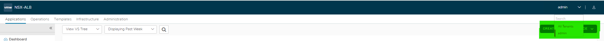
- Click on “Create Virtual Service” option in the Dashboard view.
  
- Select “Advanced Setup” from the dropdown.
  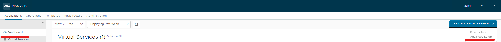
- Choose Appropriate “Cloud” where this VIP must be hosted.
  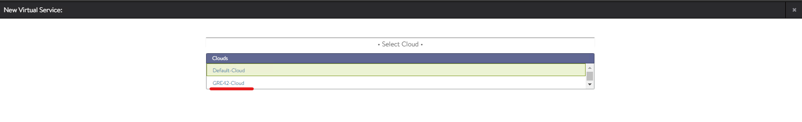
- Choose Appropriate “VRF” for this VIP.
  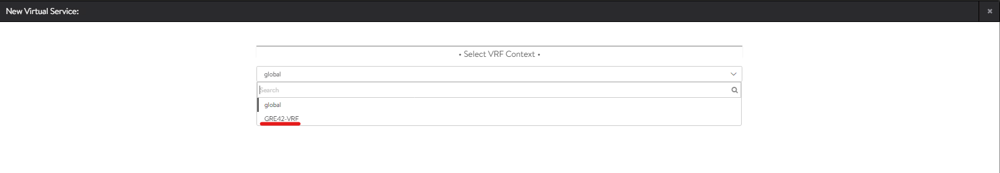
- Now you will get a page which consists of information that has to be filled regarding the VIP creation.
  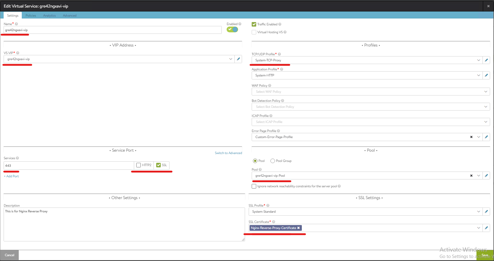
  - Name --> Name of the VIP Load balancer
  - VS VIP --> This will be the internal object of the VIP and IP mapping.
  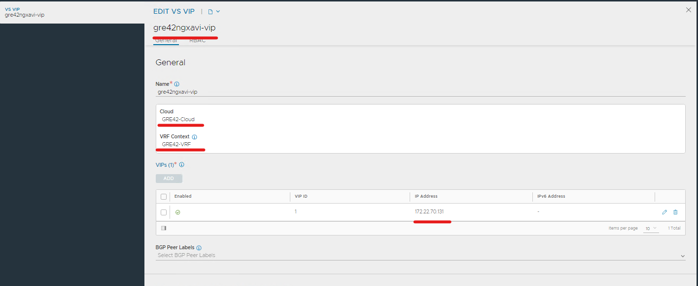
  - Services --> Mention the Port number in which the VIP as to be brought up.
  - TCP/UDP Profile --> What type of connection profile must be established with backend and the client hitting the VIP.
  - Application Profile --> What type of Application is hosted in the VIP.
  - Pool --> This will have the Pool members with the Port number details hosting the application.
  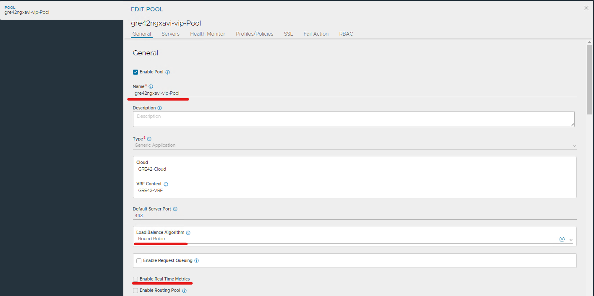
  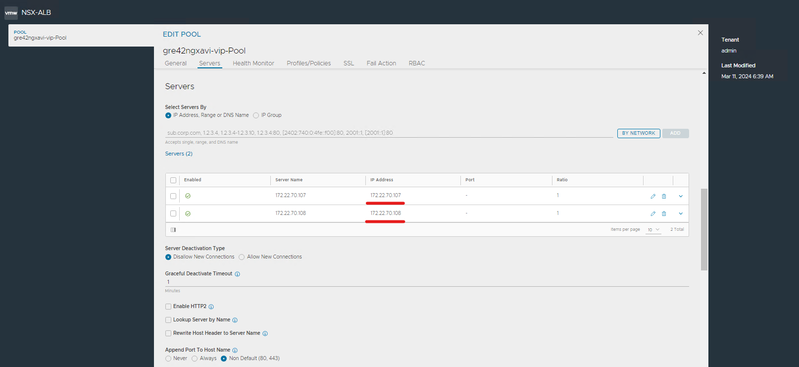
  - Health Monitor --> It is important to set a Proper Health monitor for this VIP. We have setup a HTTPs health monitor that will check the port of the backend server.
  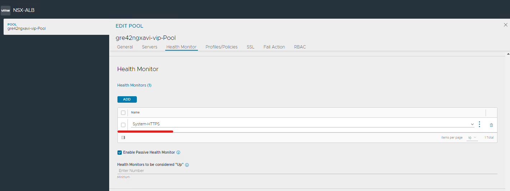
  - SSL Certificate --> You would need to import the signed certificate into the NSX ALB and attach it to the VIP.
  - Go to Template --> Security --> SSL/TLS Certificates
  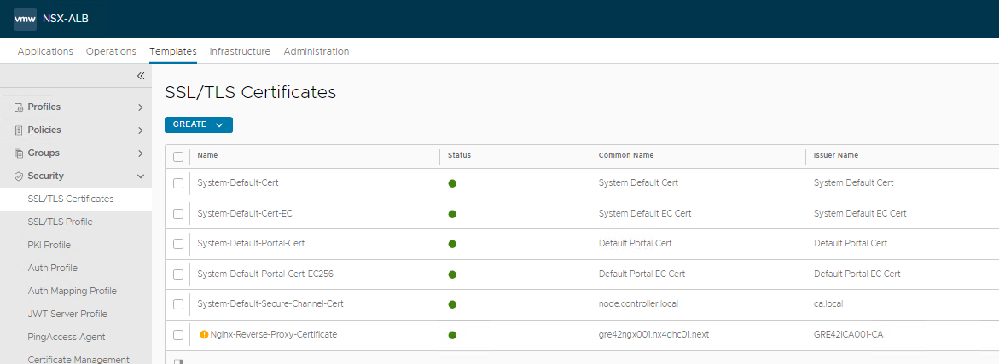
  - You can import the copied certificate into the NSX ALB controller using "import file" option.
  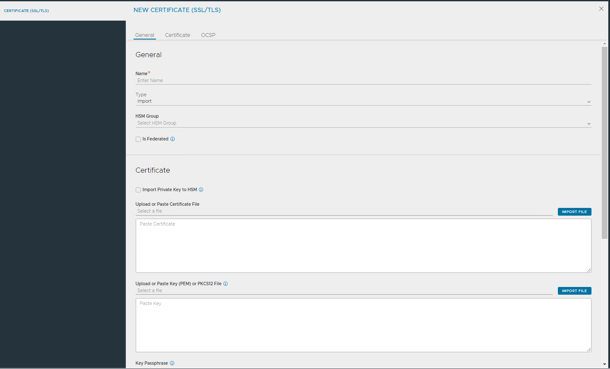

- Below screenshot shows Dashboard view of the VIP
  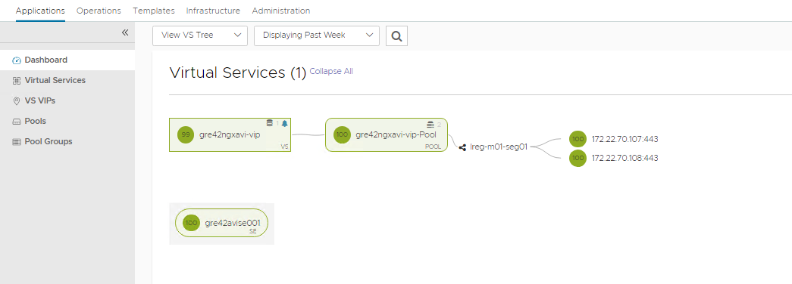
- Ensure the health score of the VIP is at least around 80 once the backend node services are started.

## Start the Nginx and verify the Reverse proxy

- Once the Virtual conf is completed you can check if the reverse proxy is working fine.
- Restart the Nginx service in both the servers using the below command.
  - #systemctl restart nginx
- Check the status of the Nginx service.
  - #systemctl status nginx
- Hit the Load balancer URL and check if the NSX-T appliance is loading properly.
  
- Do a login check as well with your AD account.
  
