# Reverse Proxy Setup for Hosting Multiple Appliances

## Table of Contents

- [Reverse Proxy Setup for Hosting Multiple Appliances](#reverse-proxy-setup-for-hosting-multiple-appliances)
  - [Table of Contents](#table-of-contents)
  - [List of Changes](#list-of-changes)
  - [Introduction](#introduction)
    - [Purpose](#purpose)
    - [Audience](#audience)
    - [Scope](#scope)
  - [Prerequisites](#prerequisites)
  - [Manual Method](#manual-method)
    - [Install Nginx in both the servers](#install-nginx-in-both-the-servers)
    - [Create CSR including the VIP and Nginx server names as SAN Name](#create-csr-including-the-vip-and-nginx-server-names-as-san-name)
    - [Copy the certificate in the backend Nginx server](#copy-the-certificate-in-the-backend-nginx-server)
    - [Configure the Nginx server with only 443 port enabled](#configure-the-nginx-server-with-only-443-port-enabled)
    - [Configure the Virtual Host with reverse proxy rules according to the “location” required](#configure-the-virtual-host-with-reverse-proxy-rules-according-to-the-location-required)
    - [Start the Nginx and verify the Reverse proxy](#start-the-nginx-and-verify-the-reverse-proxy)
  - [Automation Method](#automation-method)
  - [Certificate Handling](#certificate-handling)
  - [How to Trust the CA Certificate in Customer VM](#how-to-trust-the-ca-certificate-in-customer-vm)

## List of Changes

| Version | Date       | Author       | Issue    | Changes           |
|---------|------------|--------------|----------|-------------------|
| 0.1     | 28.10.2024 | Aswin Arumugam | VCS-12529| Document creation |
| 0.2     | 13.10.2025 | Rachel Beulah | VCS-17234| Changes based on DA call decisions and automation updates |
| 0.3     | 22.12.2025 | Rachel Beulah | VCS-17933| Documentation update in Automation and certificate section |

## Introduction

### Purpose

The Purpose of the document is to understand the procedure/steps to setup Reverse proxy application to front-end multiple appliances.

### Audience

This document is intended for Atos Cloud Services Engineers and Architects responsible for setting up and hosting the below appliances to the external customers in DHC.

1. Aria Operations(vRops)
2. NSX-T Application Platform (NSX-T)
3. vIDM (Identity Manager)

### Scope

This document covers Reverse Proxy setup using Nginx application in linux servers for hosting Aria Operation, NSX Application Platform & Identity Manager.

## Prerequisites

- **Proxy (pxy) Server**
  - Reverse proxy is deployed on a dedicated proxy server selected for appliance exposure.
  - All configurations and routing are performed on this pxy server.

- **Firewall Rules**
  - **Internal Appliance Access:** Allow secure connectivity (TCP 443) from pxy server to backend appliances (Aria Operations, NSX-T, vIDM).
  - **Customer Access:** Allow secure (TCP 443) inbound connections from Customer VMs to the pxy server to support reverse proxy access in their environment.

### Manual Method

## Install Nginx in both the servers

- Nginx package would most probably present in the repo. Run the below command to check it.
- Command to check if the package is already present/installed or not.
  - #apt list | grep installed | grep nginx
    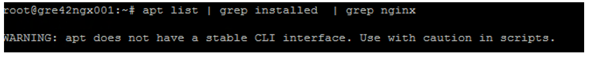
- Below command will let us know if the package is present in our repo.
  - #apt list nginx
    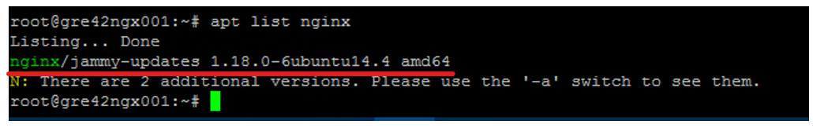
- Install the Nginx packages.
  - #apt install nginx
  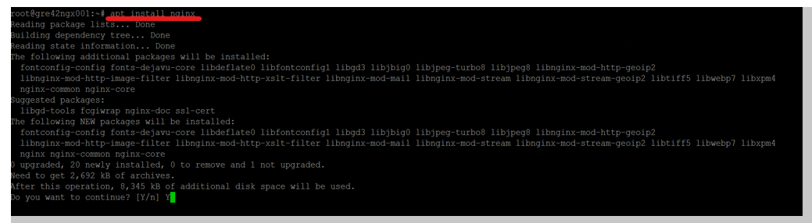
- Verify if the package is installed.
  - #apt list | grep installed | grep nginx
  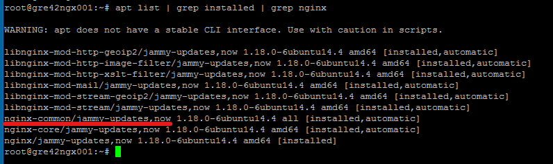
- Check if the Nginx service is started without any issues.
  - #systemctl status nginx
  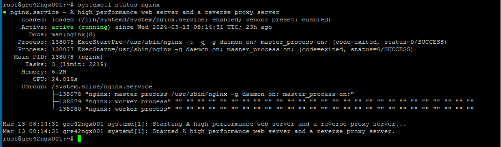
- Also install "Net-tools" packages for getting the "telnet & Netstat" command.
  - #apt-get install net-tools
  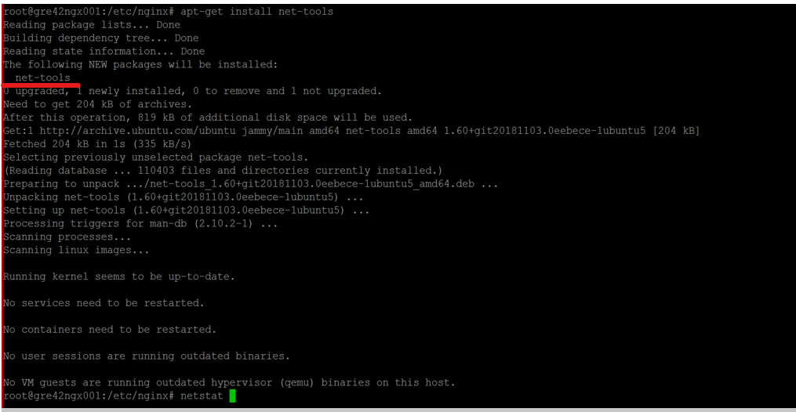

## Create CSR including the VIP and Nginx server names as SAN Name

- It is better if we generate a signed certificate before we start configuring the reverse proxy virtual host.
- Considerations for Certificate:
  - We will have to decide what should be the certificate name. It is usually one of the SAN names.
  - We must get all the possible SAN names that has to be included.
  - Include both FQDN, Server names and IP address if required.

### Steps for Generating CSR

- We will need openssl command to be installed in the linux server first.
  - #apt list | grep installed | grep openssl
  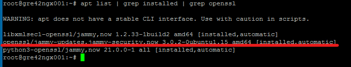
- Since we need to create cert with multiple SAN’s, create the below file. Alt_names section will contain all the SAN names. We can include the IP address as well if required.
  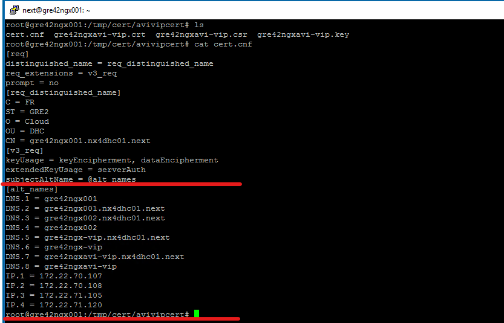
- Run the below command for creating the Key and CSR.
  - #openssl req  -out Certname.csr -newkey rsa:2048 -nodes -keyout Certname.key -config cert.cnf
  - Certname.csr --> It is the CSR (Certificate Signing Request) file.
  - Certname.key --> Key for authenticating the cert.
  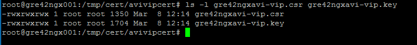
- Check if the SAN Names are included in the CSR. DNS name in the output will represent the SAN names.
  - #openssl req -in Certname.csr -test -noout | grep DNS
  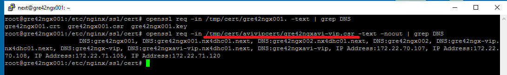
- Now get this CSR signed through our CA server.

### ICA Certificate Signing Steps

- Login to the Windows ICA server through Remote Desktop.
- Copy the CSR in the ICA server.
- Open Server Manager --> Go to Tools and select Certification Authority
  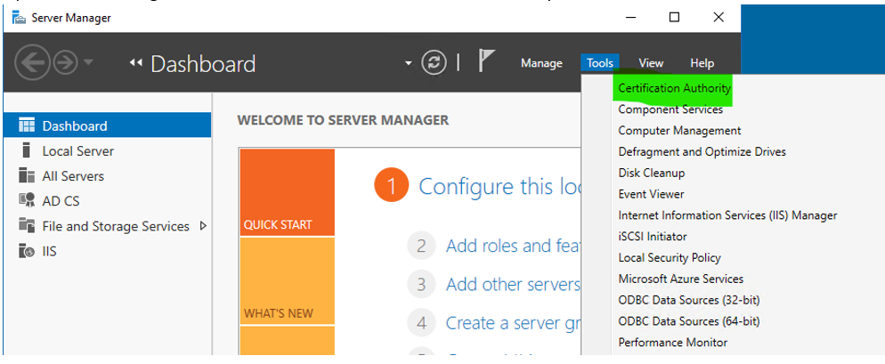
- Click the {LOCATION}ICA001-CA and click on Action.  You will get an option to Submit new request in All tasks.
  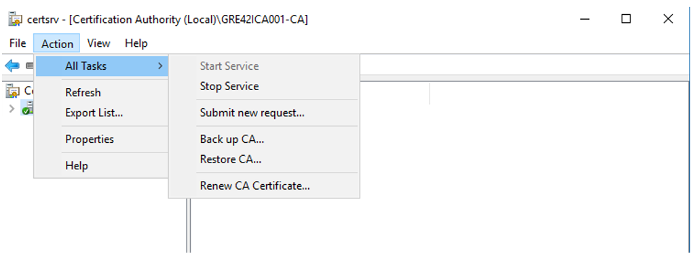
- You will have to choose the CSR file.
  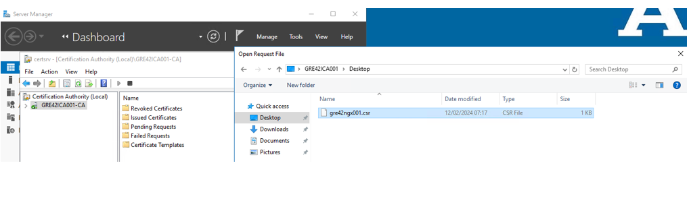
- You might get the following error while signing the request. This is common. If so we can sign it in command prompt.
  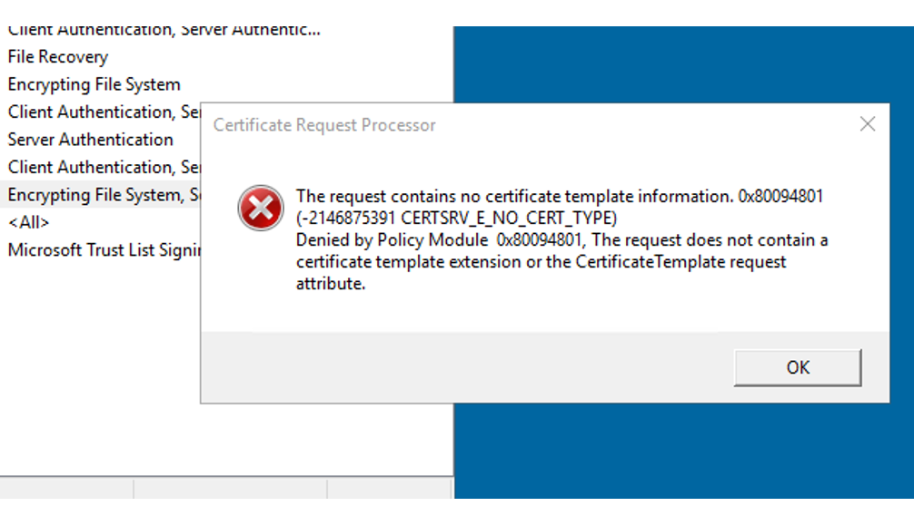
- Open the Command line prompt “As Administrator” and run the following command. Include all the SAN Names included in the CSR
  - #certreq -attrib "CertificateTemplate:WebServer\nSAN:DNS=**servername.domainname**&DNS=**servername**&IPAddress=**IPaddress**"
   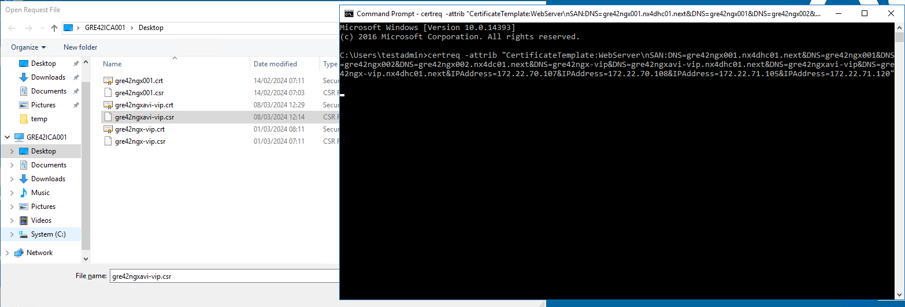
  - You will be prompted to select the CSR file. And also select the ICA server for signing the request.
   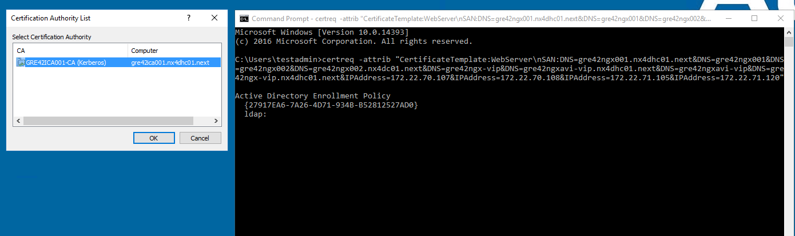
  - Once signed you can save the file with **".crt"** extension.

## Copy the certificate in the backend Nginx server

- Once you have got the certificate copy it over to the Nginx server.
- Check the Certificate if SANs are included in it.
  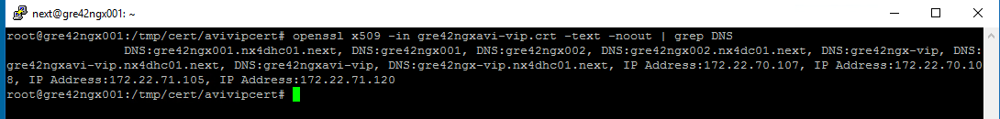
- Now we can attach this to the Nginx configuration file and to the VIP.
- Create a directory called “/etc/nginx/ssl/cert” and copy the certificate inside it.
  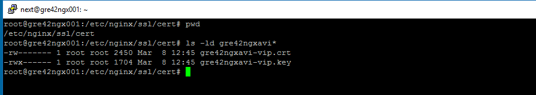
- Verify the cert has all the SAN Names attached to it.

## Configure the Nginx server with only 443 port enabled

- We must enable only 443 port in the server. This will ensure the connection is secured.
  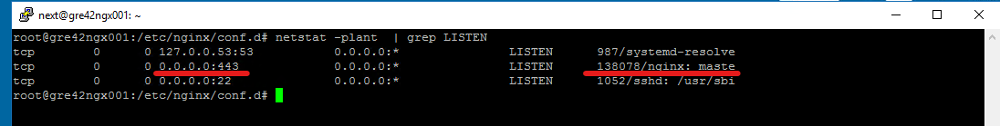
- By default, 80 port is enabled once the Nginx is installed.
- Change the below setting in the conf files. Enable only 443 in the listen field.
  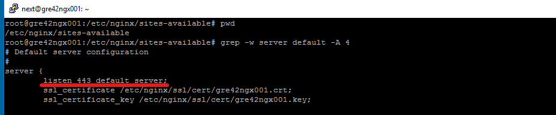
- We must add the SSL certificate as well to this file.
- Restart the Nginx service and check the port.

## Configure the Virtual Host with reverse proxy rules according to the “location” required

- Go to Nginx directory. “/etc/nginx/”. Inside conf.d create a file called “virtual.conf”
  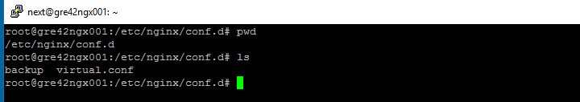
- We will have to create a Virtual host configuration in this file.
  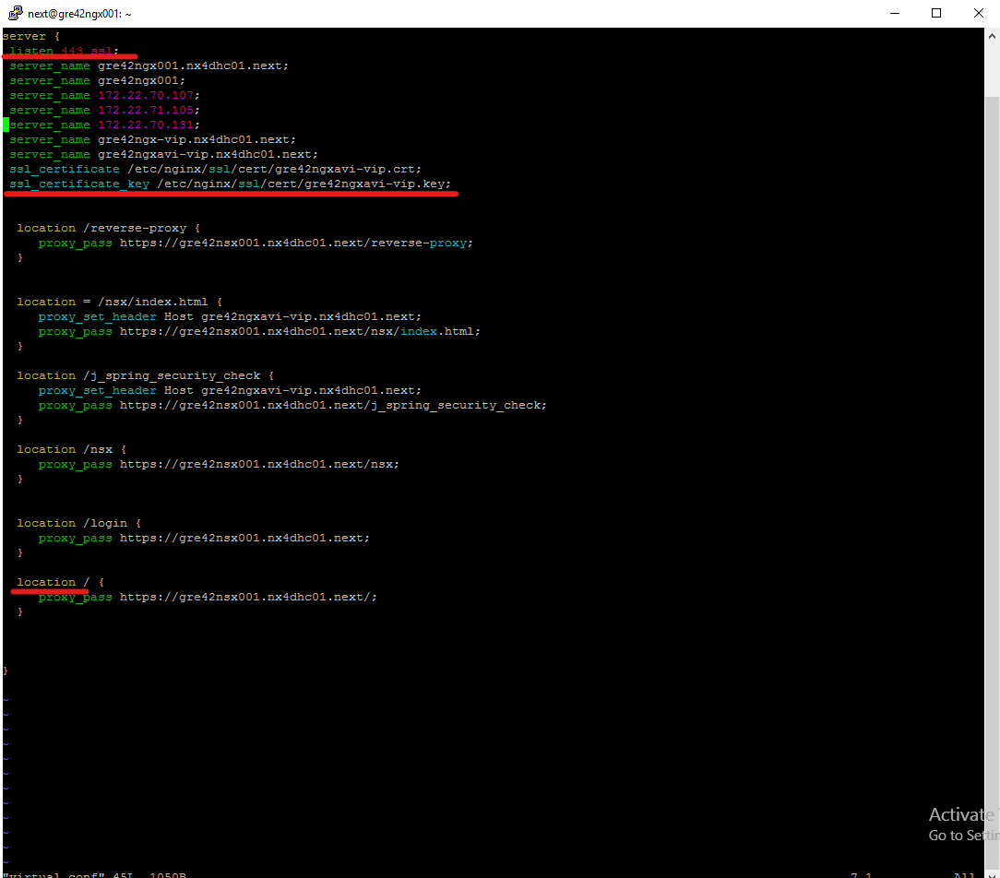
  - listen 443 ssl --> Enable the listen with only 443 port
  - server_name --> Virtual Server Name/Nginx server host name
  - ssl_certificate --> Mention the full path where the Certificate was copied.
  - location --> Specifies the URI match for which Proxy pass must be enabled.
  - proxy_set_header --> This will exclusively set the header of the URLs to the mentioned Host.
  - proxy_pass --> This will do the reverse proxy to the mentioned URL’s.
- As of now we required 6 location specific redirects are configured

## Start the Nginx and verify the Reverse proxy

- Once the Virtual conf is completed you can check if the reverse proxy is working fine.
- Restart the Nginx service in both the servers using the below command.
  - #systemctl restart nginx
- Check the status of the Nginx service.
  - #systemctl status nginx
- Hit the Load balancer URL and check if the NSX-T appliance is loading properly.
  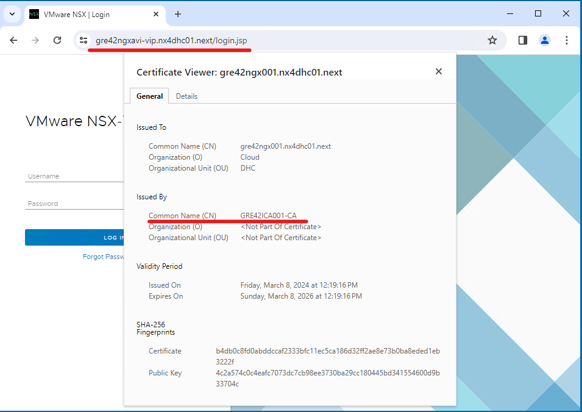
- Do a login check as well with your AD account.
  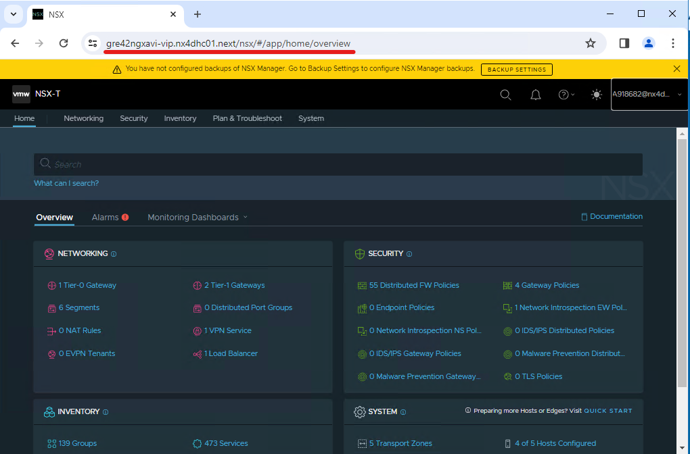

### Automation Method

The playbook will perform all the manual steps in an automatic fashion.

``` ansible-playbook configureReverseProxy.yml ```

> - This playbook will prompt for username, password and customer domain name.
> - A certificate is generated using the customer domain name and trusted by the internal Root CA. The signed certificate and private key are stored securely in HashiCorp Vault.
> - The reverse proxy is configured on proxy servers pxy002 and pxy003. Nginx is installed and configured, and the virtual host file is created at /etc/nginx/conf.d/virtual.conf.
> - Redirect URLs for NSX(in vIDM) and vROps(in vROPs) are added using alias names.
> - Access to NSX and vROps is routed through the reverse proxy instead of direct appliance FQDNs.

### Certificate Handling

#### Case 1: Customer Provides Their Own Certificate

If the customer already has a certificate:

1. Copy the certificate and key to:

   ```bash
   /etc/nginx/ssl/cert/
   ```

2. Update Nginx configuration in:

   ```bash
   /etc/nginx/conf.d/virtual.conf
   ```

   Example:

   ```nginx
   ssl_certificate     /etc/nginx/ssl/cert/customer.crt;
   ssl_certificate_key /etc/nginx/ssl/cert/customer.key;
   ```

3. Reload Nginx:

   ```bash
   systemctl reload nginx
   ```

#### Case 2: Internal Root CA Certificate

If the customer does not provide a certificate:

The playbook automatically:

- Creates a certificate trusted by the internal Root CA
- Saves it in HashiCorp Vault
- Copies it to `/etc/nginx/ssl/cert/`
- Updates `virtual.conf` automatically

For this to work in the customer environment, the **internal Root CA must be trusted** by customer systems.

### How to Trust the CA Certificate in Customer VM

#### Export Root CA

- Log in to the Windows ICA/CA server.
- Open the Certification Authority console (certsrv.msc).
- Right-click the CA name → Properties → View Certificate.
- Navigate to the Details tab → Click Copy to File.
- Choose Base-64 encoded X.509 (.CER) format and save as rootCA.crt.

#### Import the Root CA Certificate on Customer VM

- Copy rootCA.crt to target VM.
- Double-click the certificate file → Click Install Certificate.
- Choose "Local Machine" (admin) or "Current User" (non-admin).
- Store location: "Trusted Root Certification Authorities".
- Complete setup. Confirm success in certmgr.msc, under Trusted Root Certification Authorities.

> Figure: Trusted Root Certification Authorities
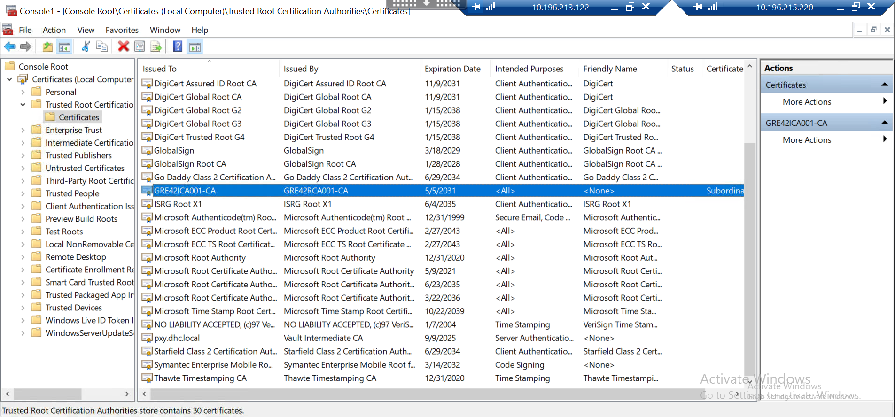
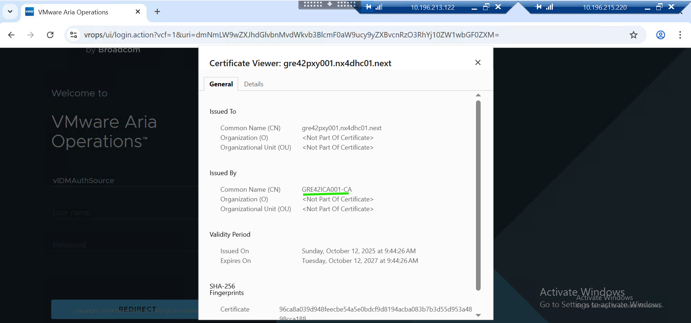

### Update DNS or /etc/hosts File in Customer VM

In the customer VM, update the DNS records or the /etc/hosts file to map the appliance URLs (vrops, nsx, and idm) to the proxy server’s IP address for proper name resolution.
