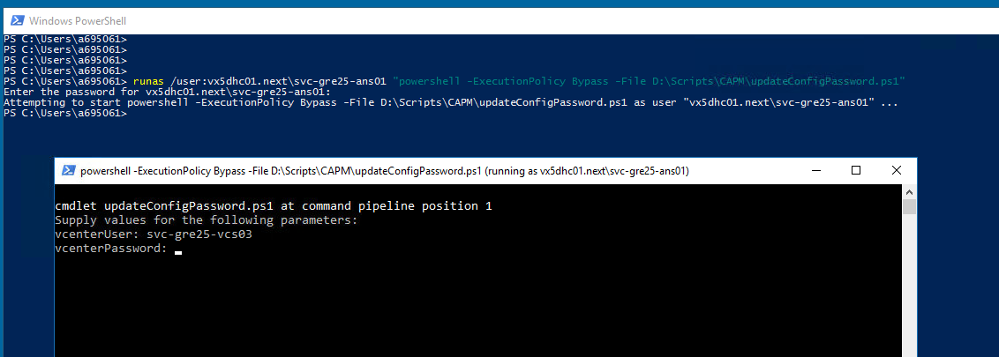

# RVTools Report

# Table of Contents

- [RVTools Report](#rvtools-report)
- [Table of Contents](#table-of-contents)
- [List of Changes](#list-of-changes)
  - [Introduction](#introduction)
    - [Purpose](#purpose)
    - [Audience](#audience)
    - [Scope](#scope)
- [Configure RVTools report](#configure-rvtools-report)
- [Summary](#summary)

# List of Changes
  
| Version | Date       | Description      | Author       |
| ------- | ---------- | ---------------- | -------------|
| 0.1     | 25.05.2022 | First version    | Adam Szymczak |
| 0.2     | 06.06.2022 | Changed information email recipients source | Adam Szymczak |
| 0.3     | 14.11.2023 | Implemented automatic password encryption | Stanislaw Kilanowski |
| 0.4     | 06.06.2024 | Updated automatic password encryption | Krystian Bibik |

## Introduction

### Purpose

Configure RVTools report generation and delivery using configureRvToolsReport.yml playbook.

### Audience

- VCS Operations

### Scope

- Configure RVTools reports

# Configure RVTools report

1) SSH to **ANS001** VM
2) Open **mailtoRecipients.yml** file found in **group_vars** directory
3) Put email addresses of recipients for RVTools report in the file following below format and save the file

   ```yaml
   rvtools:
     mailTo:
     - example1@domain.com
     - example2@domain.com
   ```

4) Run **configureRvToolsReport.yml** playbook from manage phase using following command:

   ```bash
   ansible-playbook configureRvToolsReport.yml
   ```

5) Type in domain user name and password when prompted
6) After the playbook finished running, RDP to **TSS002** VM
7) Navigate to the script's config file directory (**D:\Scripts\CAPM\RVtool\Config.xml** by default)
8) Open Config.xml and validate if the `<EncryptedPassword>` was filled correctly for each vCenter entry (encrypted password should start with "**_RVToolsV3PWD**" followed by a series of random characters)
9) If it's not correct, from PowerShell console run command:  

    ```powershell
   runas /user:< domainName >\svc-< locationCode>-ans01 "powershell -ExecutionPolicy Bypass -File D:\Scripts\CAPM\updateConfigPassword.ps1"
    ```

    and provide password for `svc-< locationCode >-ans01` account.  
    The **updateConfigPassword.ps1** script window will open,<br/>
    in which you must provide vcenterUser: `svc-< locationCode >-vcs03` and password from **HashiCorp Vault**,<br/>
    and the password for `svc-< locationCode >-vcs03` account will be updated in the Config.xml file.

     

# Summary

The playbook copied over Powershell script, used to generate and send report to selected recipients, to folder on **TSS002** VM (**D:\Scripts\CAPM** by default).
Then task was created in **Task Scheduler** that will run the script weekly generating and sending out the report by email. By default task is set to run each Monday at 8 AM.
