# Post Deployment Steps for Regional Deployment of vRA OnPrem

# Table of Contents

- [Post Deployment Steps for Regional Deployment of vRA OnPrem](#post-deployment-steps-for-regional-deployment-of-vra-onprem)
- [Table of Contents](#table-of-contents)
- [Changelog](#changelog)
  - [Introduction](#introduction)
    - [Purpose](#purpose)
    - [Audience](#audience)
    - [Scope](#scope)
- [Prerequisites](#prerequisites)
- [Steps to Perform Network Profile Update in Service Broker Form](#steps-to-perform-network-profile-update-in-service-broker-form)

# Changelog

| Date | TOS | Issue | Author | Description |
|------|-----|-------|--------|-------------|
| 09.02.2023 | | CESDHC-6072 | Mohit Bilakhia | Service Broker Steps for Network Profile Update for Regional deployment of vRA OnPrem |

## Introduction

### Purpose

Perform post deployment steps of Service Broker Form for Network Profile Updates for vRA OnPrem.

### Audience

- VCS Operations

### Scope

- Manual modifications in Service Broker Form whenever a new Network Profile is added through Ansible Playbooks.

# Prerequisites

vRA OnPrem for Regional Secondary Site(s) Deployment must be executed successfully.

# Steps to Perform Network Profile Update in Service Broker Form

1. Login to the vRA, Select Cloud Assembly and Open the Default Blueprint example:- **Deploy virtual machine**
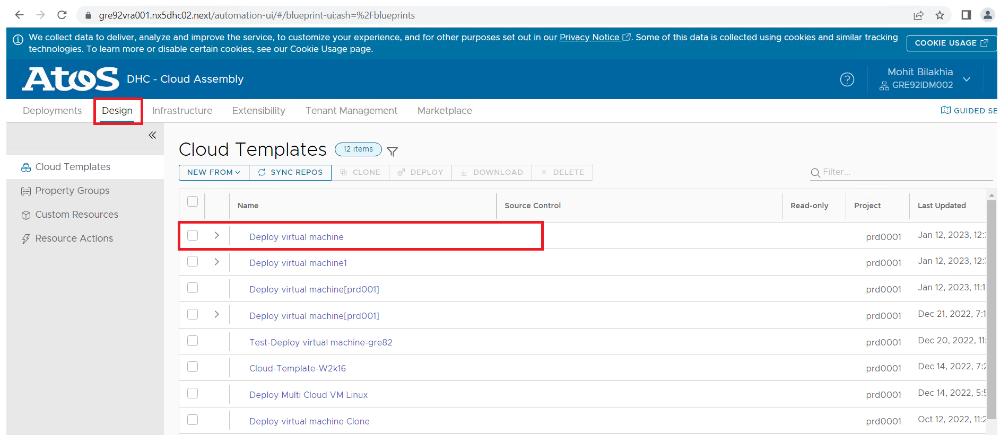

2. In the code section, verify that the new **net_tag** values is present in lists.
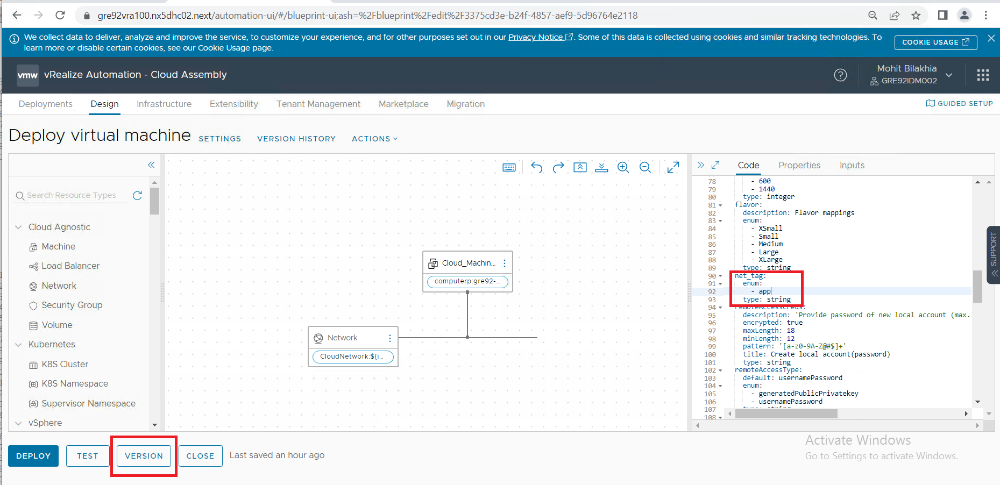

3. Publish the Blueprint to a new version as per below.
    Click on Version Button
    Keep the default version number(auto-incremented value)
    Enter Description according to the changes made
    Please select the checkbox for release the version to catalog
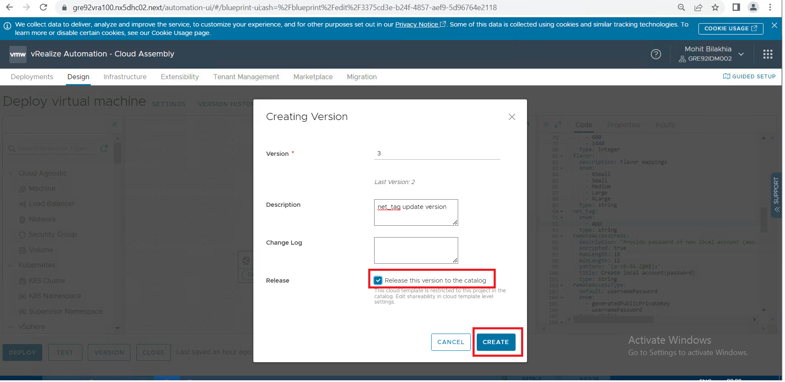

4. Once Version is published, Go to the **Service Broker** Option from the main menu.
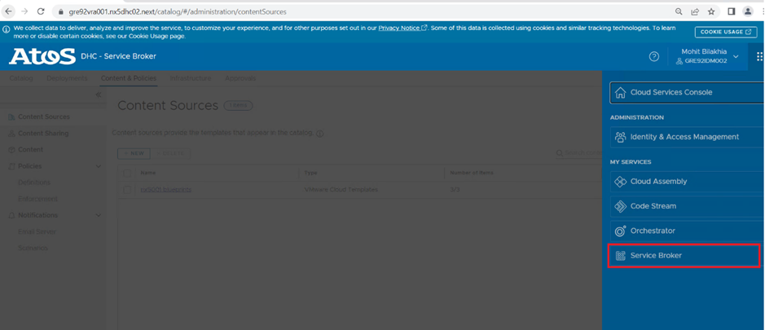

5. Select **Content & Policies** tab and then select **Content Sources** option. You can see the project name present in the table.
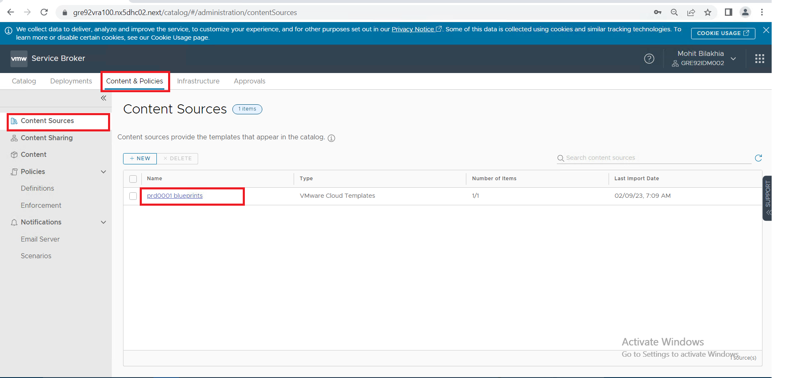

6. Click on **validate** button and then click on **Save & Import**
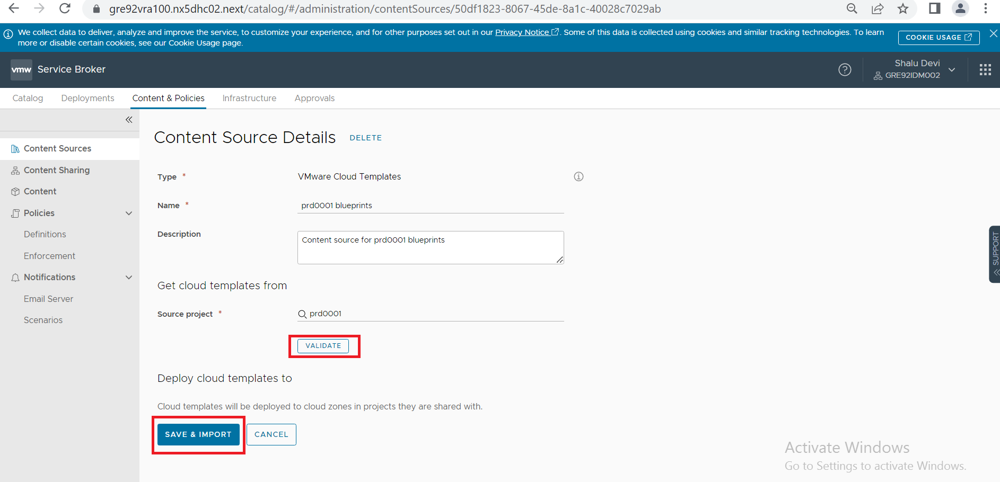

7. Select **Content & Policies** tab and then select **Content** option. You can see the default blueprint name present in the table.
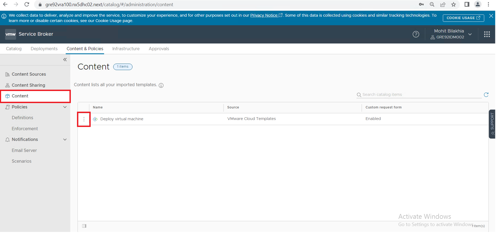

8. Besides Blueprint name, click on three dots and select **Customize form** option
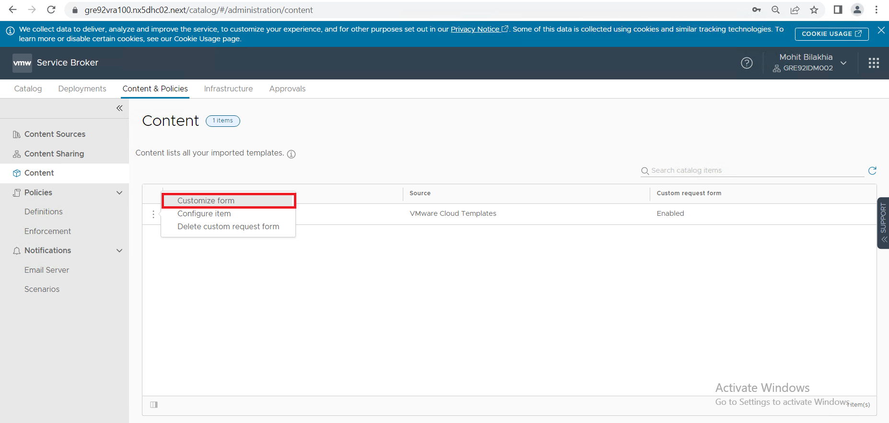

9. A complete service broker form will be visible. Select **Network Profile (net_tag)** field and click on **Delete** option.
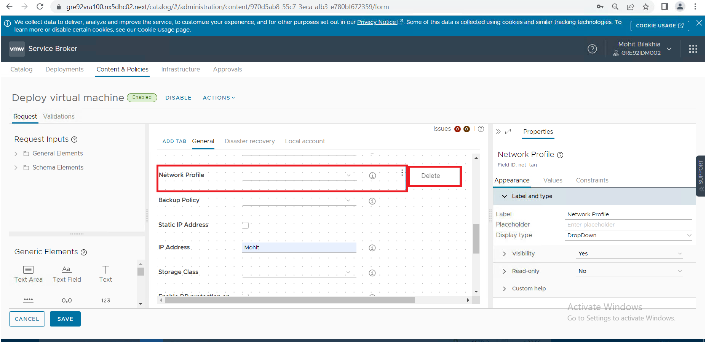

10. This net_tag field which was deleted can be seen inside **Schema Elements**. This net_tag field need to be drag and drop in the same box in **Empty section**
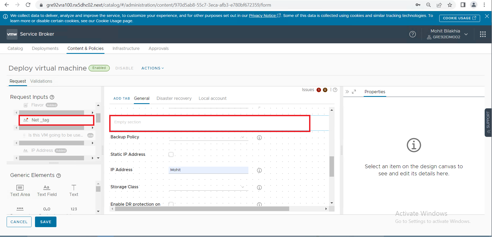

11. Once added, Select net_tag and in Properties in Appearance Tab, change the label to **Network Profile** and verify that Display is set to Dropdown. Click on Save Button
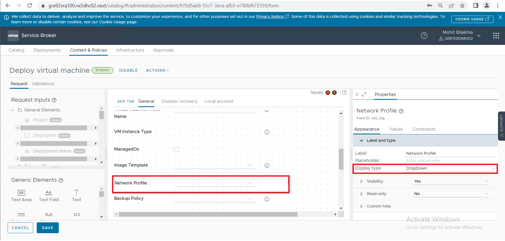
