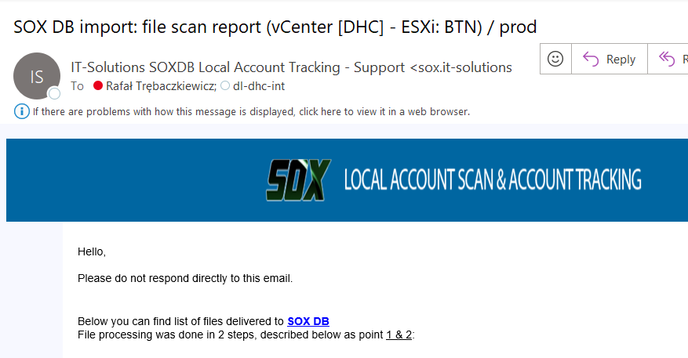
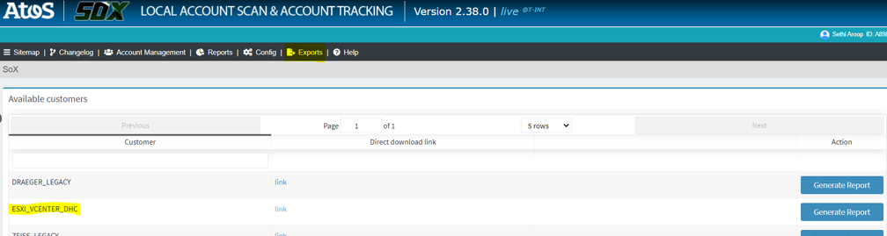

# Work instruction: SoxDB integration with DHC

## Table of Contents

- [Work instruction: SoxDB integration with DHC](#work-instruction-soxdb-integration-with-dhc)
  - [Table of Contents](#table-of-contents)
  - [Changelog](#changelog)
  - [Introduction](#introduction)
  - [Audience](#audience)
  - [Scope](#scope)
  - [Related Documents](#related-documents)
  - [Prerequisites](#prerequisites)
  - [Onboarding Request](#onboarding-request)
  - [Connection Test](#connection-test)
  - [SOXDB automation](#soxdb-automation)
  - [SOXDB automation integration](#soxdb-automation-integration)
    - [Table 1: Automation integration steps order](#table-1-automation-integration-steps-order)
    - [Code setup](#code-setup)
      - [Table 2: Automation playbook and role](#table-2-automation-playbook-and-role)
    - [Adjust automation inputs](#adjust-automation-inputs)
      - [Table 3: Table list variables for the adoption](#table-3-table-list-variables-for-the-adoption)
    - [Automation options](#automation-options)
    - [Run adhoc scan](#run-adhoc-scan)
    - [Schedule scan tasks](#schedule-scan-tasks)
      - [Scan vCenter instances for Active Directory user accounts with groups](#scan-vcenter-instances-for-active-directory-user-accounts-with-groups)
      - [Scan of DHC Active Directory user accounts with groups](#scan-of-dhc-active-directory-user-accounts-with-groups)
    - [Trigger scheduled jobs](#trigger-scheduled-jobs)
      - [Scan vCenter instances for Active Directory user accounts with groups](#scan-vcenter-instances-for-active-directory-user-accounts-with-groups-1)
      - [Scan DHC Active Directory user accounts with groups](#scan-dhc-active-directory-user-accounts-with-groups)
  - [Validate SOXDB integration](#validate-soxdb-integration)
    - [File Upload and Notification Process](#file-upload-and-notification-process)
    - [File Upload Process](#file-upload-process)
  - [Data Export Process](#data-export-process)
  - [Data Lifecycle and Retention Procedures](#data-lifecycle-and-retention-procedures)
  - [Users account review process](#users-account-review-process)
  - [Credentials](#credentials)
  - [SOXDB integration estimation](#soxdb-integration-estimation)
    - [Table 4: Time effort and skills set required to implement integration](#table-4-time-effort-and-skills-set-required-to-implement-integration)

## Changelog

| Date       | TOS     | Issue   |    Author         |    Description    |
| ---------- | ------- | ------- | ----------------- | ----------------- |
| 08-10-2024 | DHC 2.0 | VCS-13511 | Aroop Sethi | SoxDB integration with DHC |
| 27-01-2025 | DHC 2.0 | VCS-14306,VCS-14912 | Tomasz Korniluk | Final review |
| 11-03-2025 | DHC 2.0 | VCS-14929 | Tomasz Korniluk | Updated after automation code extension for AD user accounts scan |
| 08-12-2025 | DHC 2.1 | VCS-17909 | Ciprian Sferle | TOS 2.1.0 Documentation update |

## Introduction

This document outlines the process for managing user permissions in SoxDB, with a focus on identifying and disabling inactive users. Users can log in to check permissions, and if they find an inactive employee listed, they can mark that user as disabled and submit a request for review. The concerned team receives an email notification to take action, and the next report generation confirms whether the user's access has been successfully removed or if further investigation is needed.

Additionally, the document addresses:

 1. Establishing a secure and efficient connection between DHC and SoxDB.
 2. Enabling automated data transfer processes to enhance operational efficiency and data management.
 3. Allowing users to view and manage permissions within SoxDB to ensure data security and compliance.
 4. Assisting in the removal of inactive accounts.

## Audience

DHC deployment engineers

## Scope

The scope covers the integration process from DHC to SoxDB, including prerequisites, connection testing, and automation procedures.

# Related Documents

| Document |
|---|
| [SOXDB LLD](../design/lldSOXDB.md) |

## Prerequisites

To open a connection from DHC to SoxDB Prod and Dev, ensure the following prerequisites are in place:

  1. **NATed IP Acquisition:** Get the details of NATed IP addresses from the affected DHC platform.
  2. **SoxDB PROD and Dev IP:** Please collect the details of the IP addresses for both environments from the SoxDB team, as these need to be specified as the destination IP when submitting the request. Validate existing IP addresses, as these may vary in time by environment.
  3. **SoxDB hostname resolution:** Add the SoxDB hostname and IP address to the **/etc/hosts** file inside the **ans001** server, as a static entry. Review existing SoxDB entries in the hosts file, as these may vary in time.
  4. **Internal firewall rule:** Create a firewall rule in the Distributed Firewall Switch in NSX-T, under the ASN section, between ANS001 and the SoxDB IP address, on port TCP 443.
  5. **Connection Request:**
      - Submit a request to the Network Team to open a connection from DHC to SOXDB.
      - Specify the NATed IPs as the source and port 443 for secure communication.
  6. **Validation:** Test the connection between ANS001 and SoxDB.

> [!NOTE]
>
> - Reference Request Number: **RITM013684084** for the ASN Network Team regarding the connection from DHC to SoxDB.
> - For environments that require a proxy connection, use the following CHG and RITMs as templates ([VCS-17031](https://msdevopsjira.fsc.atos-services.net/browse/VCS-17031)) :
>   - **CHG003022426** for opening traffic in NSX-T between ANS001 and proxy;
>   - **RITM01571100** for opening firewall traffic between proxy and SoxDB on port TCP 443;
>   - **RITM015401449** update the proxy's whitelist

## Onboarding Request

Contact the SOXDB support team - Marta Pradun or Klaus Halbig (Service Owner) to onboard new production DHC Customer into SOXDB application and obtain appropriate credentials for the scan automation.
Ensure to use the email channel only and encrypt sensitive information. Put the appropriate Atos TSM in CC for the affected DHC production instance.

Below is an example email request:

```text
Dear SOXDB,

Please onboard Production Customer Acme01 into SOXDB to deliver the data:

- VMware / ESXi user accounts and groups report
- Active Directory user accounts with groups report

1.) ServiceNow Customer name: Acme (`<ServiceNowCustomerFOName>` e.g. Acme01)
2.) Type of data to upload: VMware / ESXi user accounts and groups, Active Directory user accounts with groups
3.) Upload done via API call
4.) File format: csv
5.) File name: `<CustomerName>`.csv
6.) DHC source NAT IP: XXX.XXX.XXX.XXX
7.) Notification recipients: <enter the proper DevSecOps distribution list) and TSM email addresses

Provide the API user credentials and the SOXDB endpoint URL to upload the data.
````

## Connection Test

Once the connection is established from DHC to the SoxDB application endpoint and the upload data API credentials are obtained, we can perform testing by running a couple of commands.

- **Test connectivity using Telnet**: This command checks if the specified IP and port are reachable.

    ```shell
    telnet IP PORT
    ```

- **Upload a file using CURL**: This command uploads a file to the specified URL using the provided SOX user credentials.

    ```shell
    curl -u SOX_USER_ID:'PASSWORD' -v -T DEFINE_FILE_PATH SOX_URL
    ```

## SOXDB automation

The following playbook and role allow the automated process for SOXDB reports and uploads.

- Playbook name: exportAndImportToSoxDB.yml
- Role name: dhc-exportOfDataAndImportToSoxDB

> [!IMPORTANT]
> Before running the automation, verify that all the requirements from the [prerequisites](#prerequisites) are met!

The above automation components will allow fetching Active Directory user accounts with groups from:

- DHC Management workload domain vCenter instance and ESXi hosts
- DHC single Compute workload domain vCenter instance and ESXi hosts
- DHC Management Active Directory

**Note:** SOXDB automation for VMware vCenter user accounts scan supports only single DHC management and compute workload domain.

Automation relies on Ansible role tasks that allows to perform two types of the scans:

- Scan vCenter instances (Management and Compute) user accounts and fetches details as outlined in the following document: [VMware ESXi Account Documentation](https://globalview.it-solutions.atos.net/sox/doc/scanner_interface/vmware_esxi_account.html).

- Scan DHC Management Active Directory user account and fetch details as outlined in the following document: [Active Directory user accounts and groups Documentation](https://globalview.it-solutions.atos.net/sox/doc/scanner_interface/ad_account.html)

Using the specified playbook(exportAndImportToSoxDB.yml), the below steps are automated.

**PowerShell script execution**: Remotely execute PowerShell script via Terminal server to fetch vCenter and ESXi hosts Active Directory user accounts and generate CSV report file.

**Connects to DHC vCenter instances:** Establish a connection to respective vCenter instances using provided credentials and export relevant Active Directory user accounts data.

**Connects to DHC Active Directory:** Establish a connection with DHC Active Directory domain controller using provided credentials and export Active Directory user accounts data with groups.

**Manage Directories and Files:** Checks if the specified folder and PowerShell script exist. If they do, it skips the steps; otherwise, it creates the folder and copies the files into respective remote hosts (Windows Terminal Server or Windows Active Directory domain controller)

**Creates Cron job task for vCenter Active Directory user accounts scan :** Creates a Cron job to start task at the specified time and day under Ansible node (ans001). This Cron job task will trigger PowerShell script to export the data from vCenter to the specified folder and next downloads generated report into Ansible node (local folder).

**Creates Cron job task for DHC Active Directory user accounts scan :** Creates a Cron job to start task at the specified time and day under Ansible node (ans001). This Cron job task will trigger PowerShell script to scan for user accounts under DHC Active Directory domain controller, stores generated CSV report to the specified folder, next downloads into Ansible node (local folder) and encrypts.

**Trigger on-demand DHC Active Directory user accounts scan :** Start tasks to run DHC Active Directory user accounts with groups scan, generates CSV report file and uploads into respective SOXDB endpoint

**Trigger on-demand DHC vCenter Active Directory user accounts scan :** Start tasks to run DHC Active Directory user accounts with groups scan, generates CSV report file and uploads into respective SOXDB endpoint

**Manage Local Directory:** Ensure the existence of a local directory and SOXDB folder on the Ansible controller to store encrypted CSV reports.

**Encrypted exported reports:** After successful upload of the export into SoxDB endpoint every report is automatically renamed and encrypted under Ansible node.

## SOXDB automation integration

The following chapter provides a guide on how to successfully implement and set up SOXDB automation inside the DHC platform.

Please follow the below order table to successfully implement SOXDB automation:

### Table 1: Automation integration steps order

| Order no. | Step name | Mandatory |
|-----------|-----------|----------|
| 1  | Code setup | Yes|
| 2  | Adjust automation inputs | Yes|
| 3  | Run adhoc vCenter users scan | Yes|
| 4  | Run adhoc Active Directory users scan| Yes|
| 5  | Schedule scan tasks | Yes|
| 6  | Trigger scheduled jobs | No|
| 7  | Validate SOXDB integration | Yes|

### Code setup

Ensure that the following role and playbook exists under /opt/dhc/manage folder path inside DHC Management Ansible node.

#### Table 2: Automation playbook and role

 | Item name | Type | Role |
 |-----------|-----------|-------|
 | exportAndImportToSoxDB.yml  | Ansible playbook | Main playbook to triggers automation |
 | dhc-exportOfDataAndImportToSoxDB  | Ansible role | Main role that triggers automation tasks |

**Note:** In case above files are missing validate proper version of the DHC release.

### Adjust automation inputs

SOXDB automation Ansible role uses hardcoded default variables to define:

- Customer DHC platform code (e.g. DHC)
- Customer FO ServiceNow name (e.g Atos DHC CI's)
- DHC Automation service account name (e.g. svc-gre82-aut02)
- DHC Ansible service account name (e.g. svc-gre82-ans01)
- SOXDB endpoint url for vCenter user accounts reports uploads (DHC Production Customers)
- SOXDB endpoint url for DHC Active Directory user accounts reports uploads (DHC Production Customers)
- Default SOXDB PowerShell scripts path
- Local path to store generated reports under Ansible node (e.g. /opt/reports/dhcReports/SOXDB)

**Note:** Make sure to update variables values under main.yml (located in  ./roles/dhc-exportOfDataAndImportToSoxDB/defaults/) using table 3. that are marked for mandatory updates.

**Note:** In case mandatory variables values are not updated permanently please execute automation playbook with extra variables like the below example. (direct connection to SoxDB)

```yaml
ansible-playbook exportAndImportToSoxDB.yml --tags "1a" --extra-vars "customerDhcCode='dhc' customerSnowName='Atos DHC'"
````

**Note:** Below is an example of automation usage with a proxy connection to SaaCon's SoxDB tool

```yaml
ansible-playbook exportAndImportToSoxDB.yml --tags "1a" --extra-vars "customerDhcCode='dhc' customerSnowName='Atos DHC' proxy=http://<CustomerProxyIp>:<CustomerProxyPort>"
````

#### Table 3: Table list variables for the adoption

| Variable name | Default value | Mandatory update |
|-----------|-----------|----------|
| ``customerDhcCode``  | ``dhc`` | **Yes** - requires correct DHC platform code|
| ``customerSnowName``  | ``Atos DHC CI's`` | **Yes** - requires proper ServiceNow FO name for affected Customer|
| ``soxesxi_url``  | ``https://globalview.it-solutions.atos.net/sox/api/_rest/upload/esxi/dhc/)`` | **No** - Requires update only in case SOXDB support provides different url |
| ``soxad_url``  | ``https://globalview.it-solutions.atos.net/sox/api/_rest/upload/ad/dhc/`` | **No** - Requires update only in case SOXDB support provides different url |
| ``soxdb_script_path``  | ``C:\\SOXDB`` | **No** - Update only in case platform requires different location|
| ``soxdb_local_reports``  | ``/opt/reports/dhcReports/SOXDB/`` |**No** - Update only in case platform requires alternative local path inside the Ansible node|
| ``autoAccount``  | ``svc-{{ locationCode }}-aut02`` |**No** - Update only in case platform requires different service account to logon into Terminal Server and scan vCenter user accounts|
| ``ansAccount``  | ``svc-{{ locationCode }}-ans01`` |**No** - Update only in case platform requires different service account to logon into Active Directory domain controller to scan user accounts|
| ``proxy`` | ``http://<CustomerProxyIp>:<CustomerProxyPort>`` | **No** - Variable to pass if customer environment requires a proxy connection|

### Automation options

Automation playbook allows to run the different options based on the provided tag name.

**Note:** Automation playbook does not allow running multiple tags at once.

- To execute playbook with selected option use below examples:

```yaml
ansible-playbook exportAndImportToSoxDB.yml --tags "1a"
ansible-playbook exportAndImportToSoxDB.yml --tags "1b"
ansible-playbook exportAndImportToSoxDB.yml --tags "2a"
ansible-playbook exportAndImportToSoxDB.yml --tags "2b"
````

>**Ansible playbook supported options:**
>
> - tag 1a - Option to run adhoc vCenter users scan
> - tag 1b - Option to schedule cronjob task for vCenter users scan
> - tag 1c - Option to trigger vCenter users scan via a crontab job
> - tag 2a - Option to run adhoc Active Directory users scan
> - tag 2b - Option to schedule Active Directory users scan
> - tag 2c - Option to trigger AD users scan via a crontab job

### Run adhoc scan

Execute Ansible playbook (exportAndImportToSoxDB.yml) with tag ``1a`` to start on-demand task which triggers scripts to scan Active Directory user accounts with groups under DHC Management and single Compute workload domain vCenter instances.

>**Playbook after the start prompts for the following inputs:**
>
> - ``Enter domain username in the dasId@domain.next format``
> - ``Enter the password for the domain user``
> - ``Enter the soxdb username**``
> - ``Enter the soxdb password**``

**Notice**: Make sure to provide proper SOXDB upload API credentials dedicated for scan type (vCenter).

```yaml
ansible-playbook exportAndImportToSoxDB.yml --tags "1a"
````

- Execute ``sudo ls /opt/reports/dhcReports/SOXDB/`` (default SOXDB reports location path) under Ansible node and validate if generated report has been stored (``<customerDhcCode>``_vCenter_userreview_``<currentTimeStamp>``.gz),example report name:``dhc_vCenter_userreview_202503050824.gz``

- Logon into first Windows Terminal Server, next go to service account ``Output`` folder location: ``C:\Users\svc-<locationCode>-ans01\Documents\Output``
- Find latest report generated for affected scan e.g. ``dhc_vCenter_userreview.csv``

**Note**: In case reports are missing under Ansible SOXDB local folder or Windows Terminal Server check Ansible logs for the potential errors.

### Schedule scan tasks

#### Scan vCenter instances for Active Directory user accounts with groups

Execute Ansible playbook (exportAndImportToSoxDB.yml) with tag ``1b`` which creates crontab job to schedule task to trigger scripts for the scan of Active Directory user accounts with groups under DHC Management and single Compute workload domain vCenter instances.

>**Playbook after start prompts for the following inputs:**
>
> - ``Enter domain username in the dasId@domain.next format``
> - ``Enter the password for the domain user``
> - ``Enter the soxdb username**``
> - ``Enter the soxdb password**``
> - ``Enter the hours (0-23) for the SOXDB cron job:**``
> - ``Enter the day of the week.(0-6, (0)Sunday, (6)Saturday, (1-5)Weekday) for the SOXDB cron job:**``

**Notice:** Provide the crontab job start hour as ``08:00`` (in format ``HH:MM``).

**Notice:** Due to design requirements, ensure the crontab job runs every weekday (from Monday to Friday).Provide the day range as ``1-5``

**Notice**: Make sure to provide proper SOXDB upload API credentials dedicated for scan type(vCenter).

```yaml
ansible-playbook exportAndImportToSoxDB.yml --tags "1b"
````

- Under Ansible node execute command ``sudo crontab -l | grep SOXDB`` to verify if crontab job was created correctly.

>**Example crontab job for the scan of DHC vCenter Active Directory user accounts and groups**:

```yaml
#Ansible: Generate SOXDB DHC vCenter report and upload
* 08:00 1,2,3,4,5 * * export ANSIBLE_CONFIG=/opt/dhc/manage/ansible.cfg && /usr/local/bin/py3venv/ans420-std/bin/ansible-playbook /opt/dhc/manage/exportAndImportToSoxDB.yml -i /opt/dhc/manage/hosts --tags 1c > /var/log/cronSOXDBvCenterReport.log  2>&1
```

#### Scan of DHC Active Directory user accounts with groups

Execute Ansible playbook (exportAndImportToSoxDB.yml) with tag ``2b`` which creates crontab job to schedule task to trigger scripts for the scan of DHC Active Directory user accounts with groups.

>**Playbook after the start prompts for the following inputs:**
>
> - ``Enter domain username in the dasId@domain.next format``
> - ``Enter the password for the domain user``
> - ``Enter the soxdb username**``
> - ``Enter the soxdb password**``
> - ``Enter the hours (0-23) for the SOXDB cron job:**``
> - ``Enter the day of the week.
(0-6, (0)Sunday, (6)Saturday, (1-5)Weekday) for the SOXDB cron job:**``

**Notice:** Provide the crontab job start hour as ``09:00`` (in format ``HH:MM``).

**Notice:** Due to design requirements, ensure the crontab job runs every weekday (from Monday to Friday). Provide the day range as ``1-5``

**Notice**: Make sure to provide proper SOXDB upload API credentials dedicated for the scan type (DHC Active Directory scan).

```yaml
ansible-playbook exportAndImportToSoxDB.yml --tags "2b"
````

- Under Ansible node execute command ``sudo crontab -l | grep SOXDB`` to verify if crontab job was created correctly.

>**Example crontab job for the scan of DHC Active Directory user accounts and groups**:

```yaml

#Ansible: Generate SOXDB DHC AD users report
* 15:00 1,2,3,4,5 * * export ANSIBLE_CONFIG=/opt/dhc/manage/ansible.cfg && /usr/local/bin/py3venv/ans420-std/bin/ansible-playbook /opt/dhc/manage/exportAndImportToSoxDB.yml -i /opt/dhc/manage/hosts --tags 2c > /var/log/cronSOXDBAdReport.log  2>&1

```

### Trigger scheduled jobs

To ensure that automation works for the scheduled cron job tasks we can skip the schedule and execute Ansible playbook with proper option per scan type.

#### Scan vCenter instances for Active Directory user accounts with groups

Execute Ansible playbook (exportAndImportToSoxDB.yml) with tag ``1c`` which starts automation in same way like schedule crontab job.

```yaml
/opt/dhc/manage/exportAndImportToSoxDB.yml -i /opt/dhc/manage/hosts --tags 1c > /var/log/cronSOXDBvCenterReport.log  2>&1
````

- Open the log file (/var/log/cronSOXDBAdReport.log) and check the output if automation completed with success and there are no errors.

```yaml
sudo vi /var/log/cronSOXDBAdReport.log
````

- Make sure that summary of the ansible task execution doesn't contain any failed tasks.

```yaml
PLAY RECAP ***************************************************************************************************************************************************************************
adc001                     : ok=13   changed=6    unreachable=0    failed=0    skipped=1    rescued=0    ignored=0
localhost                  : ok=33   changed=1    unreachable=0    failed=0    skipped=41   rescued=0    ignored=0
tss001                     : ok=1    changed=0    unreachable=0    failed=0    skipped=0    rescued=0    ignored=0
````

- Execute ``sudo ls /opt/reports/dhcReports/SOXDB/`` (default SOXDB reports location path) under Ansible node and validate if generated report has been stored (``<customerDhcCode>``_vCenter_userreview_``<currentTimeStamp>``.gz),example report name:``dhc_vCenter_userreview_202503050824.gz``

- Logon into first DHC Active Directory domain controller, next go to service account ``Output`` folder location: ``C:\Users\svc-<locationCode>-ans01\Documents\Output``

- Find latest report generated for affected scan e.g. ``dhc_vCenter_userreview.csv``

**Note**: In case reports are missing under Ansible SOXDB local folder or DHC Active Directory domain controller check Ansible logs for the potential errors.

#### Scan DHC Active Directory user accounts with groups

Execute Ansible playbook (exportAndImportToSoxDB.yml) with tag ``2c`` which starts automation in same way like schedule crontab job.

```yaml
/opt/dhc/manage/exportAndImportToSoxDB.yml -i /opt/dhc/manage/hosts --tags 2c > /var/log/cronSOXDBAdReport.log  2>&1
````

- Open the log file (/var/log/cronSOXDBAdReport.log) and check the output if automation completed with success and there are no errors.

```yaml
sudo vi /var/log/cronSOXDBAdReport.log
````

- Make sure that summary of the Ansible playbook execution doesn't contain any failed tasks.

```yaml
PLAY RECAP ***************************************************************************************************************************************************************************
adc001                     : ok=13   changed=6    unreachable=0    failed=0    skipped=1    rescued=0    ignored=0
localhost                  : ok=33   changed=1    unreachable=0    failed=0    skipped=41   rescued=0    ignored=0
tss001                     : ok=1    changed=0    unreachable=0    failed=0    skipped=0    rescued=0    ignored=0
````

- Execute ``sudo ls /opt/reports/dhcReports/SOXDB/`` (default SOXDB reports location path) under Ansible node and validate if generated report has been stored (``<dhcPlatformDomainName>``_<currentTimeStamp>``.gz), example report name:``nx8dhc01.next_202503121305.gz``

- Logon into first DHC Active Directory domain controller, next go to service account ``Output`` folder location:``C:\Users\svc-<locationCode>-ans01\Documents\Output``

- Find latest report generated for affected scan e.g.``nx8dhc01.next_202503121305.gz``

**Note**: In case reports are missing under Ansible SOXDB local folder or DHC Active Directory domain controller check Ansible logs for the potential errors.

## Validate SOXDB integration

To ensure that integration works and generated CSV reports has been successfully uploaded into respective SOXDB endpoints follow the below validation steps:

- File Upload and Notification Process

- File Upload Process

### File Upload and Notification Process

Upon successful upload of CSV files to the SOXDB environment (both or either of DEV and PROD instances), authorized users(SRM, DevSecOps team) will receive an automated notification email confirming the upload.

### File Upload Process

>Upload Locations:
>
>- SOXDB DEV: [DEV URL](https://tools-dev.it-solutions.myatos.net/sox/#/)
>- SOXDB PROD: [PROD URL](https://globalview.it-solutions.atos.net/sox/#/)

- Automation tasks: The Ansible role tasks facilitates the upload of CSV files to the specified SOXDB instance. Ensure that the CSV file conforms to the expected format prior to uploading.

- Notification: Once the file upload is successfully completed, an automated email notification will be sent to the designated recipients.The email will confirm that the file has been uploaded successfully. Screenshot attached for reference.

    

## Data Export Process

Users can access the uploaded data from both the environments:

>Accessing SOXDB: Navigate to the relevant URL
>
>- SOXDB DEV: [DEV URL](https://tools-dev.it-solutions.myatos.net/sox/#/)
>- SOXDB PROD: [PROD URL](https://globalview.it-solutions.atos.net/sox/#/)
>- SOXDB PROD (dedicated url for none BTN Customers under DHC platform):[PROD URL](https://globalview.it-solutions.atos.net/sox/dhc/)
>- SOXDB PROD (dedicated url for BTN Customers under shared DHC platform):[PROD URL](https://globalview.it-solutions.atos.net/sox/btn/)

Exporting Results:

- Users can export the resulting data directly from the SOXDB interface. Follow the prompts within the UI to select the desired data and initiate the export. A screenshot is attached for reference.



## Data Lifecycle and Retention Procedures

- If no data is sent from DHC to SOXDB within 10 days, the data will be marked for deletion.
- Deleted data will not be visible in the SOXDB GUI.
- Access to exported data will only be available in PROD SOXDB.
- Notifications will be rolled out to provide updates about the status of data uploads and deletions.
- In DEV SOXDB, automation runs every weekday at 9 AM CET (vCenter scan).
- In DEV SOXDB, automation runs every weekday at 8 AM CET (Active Directory scan).
- In PROD SOXDB, automation runs every weekday at 9 AM CET (vCenter scan).
- In PROD SOXDB, automation runs every weekday at 8 AM CET (Active Directory scan).

## Users account review process

After successful integration of SOXDB automation (vmware / esxi AD users scan / DHC Active Directory user accounts with groups) DevSecOps Leader and SRM needs to follow below document which describes process of quarterly users account review process.
[dhcQuarterlyAccesReviewSoxDB.md](./dhcQuarterlyAccesReviewSoxDB.md)

## Credentials

SOXDB automation and integration credentials are stored in secured way inside DHC Management HashiVault (path ./servers/``<dhcLocationCode>``ans001/).

SOXDB automation retrieves credentials in automated fashion and encrypts in root local secure file under Ansible node.

**Notice**: In case SOXDB credentials has been rotated requires re-running Ansible playbook for the tag options ``1b`` and ``2b`` to generated new root local secure file with updated credentials.

## SOXDB integration estimation

Table describes time effort and skill sets required to implement integration.

### Table 4: Time effort and skills set required to implement integration

| Task name | Time effort| Team responsible |
|-----------|-----------|----------|
| Onboard DHC platform into SOXDB | 1-2 working days | DHC engineer (DevSecOps) and SOXDB support engineer|
| Integrate SOXDB automation | 2 working days | DHC engineer (DevSecOps)|
| Validate SOXDB integration | 1 working days | DHC engineer (DevSecOps) and SOXDB support engineer|
