# Table of Contents

<!-- TOC -->

- [Table of Contents](#table-of-contents)
- [Changelog](#changelog)
  - [Introduction](#introduction)
    - [Purpose](#purpose)
    - [Audience](#audience)
    - [Scope](#scope)
- [IP Address Input Field Configuration](#ip-address-input-field-configuration)
  - [Update Blueprint From Cloud Assembly](#update-blueprint-from-cloud-assembly)
  - [Update Service Broker Form](#update-service-broker-form)
  - [Update Service Broker Form Using CSS](#update-service-broker-form-using-css)

<!-- TOC -->

# Changelog

|    Date     | TOS     |    issue    |    Author     | Description |
| ----------- | ------- |-------------| ------------- | ------------|
| 22/02/2023  | VCS 1.7 | CESDHC-6128 | Shalu Devi    | Static IP selection from catalog form |

## Introduction

### Purpose

Add a new input field in the VCS default catalog form(vRA Cloud/vRA On-prem) and modify the blueprint code under cloudAssembly to attach the entered IP address to the running deployment. It is used if you have deleted the VM and want to provision a new one with the same IP that was assigned to the one.

### Audience

- VCS Operations

### Scope

- Modify Blueprint to add the static IP assignment functionality to the deployment

# IP Address Input Field Configuration

Steps for addition of IP address input field in the VCS blueprints for vRA Saas (cloud) and vRA on-prem are same.

## Update Blueprint From Cloud Assembly

Create an input field **"staticIP"** in Blueprint(Cloud Assembly Code). Ensure that the field must be included after the net tag input field to position it correctly.

```text
staticIP:  
   type: string  
   title: IP Address  
   default: 0.0.0.0  
   pattern: (\b25[0-5]|\b2[0-4][0-9]|\b[01]?[0-9][0-9]?)(\.(25[0-5]|2[0-4][0-9]|[01]?[0-9][0-9]?)){3}
```

   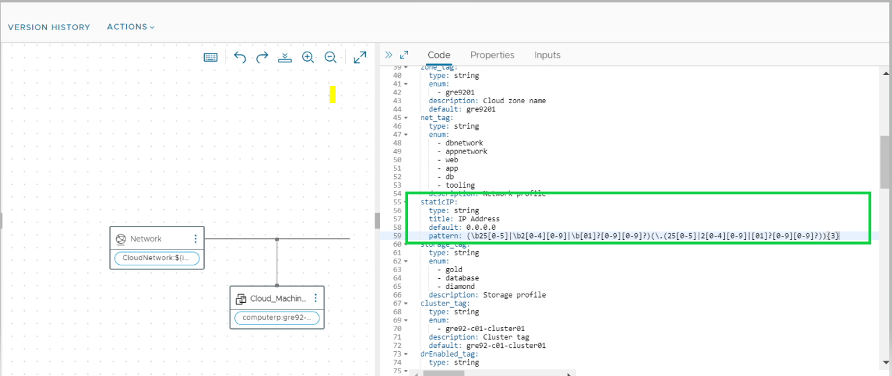

Add the following line to the VM's network properties to add the **"address"** property.(The address property is utilised to link a specific IP address)

   address: '${input.staticIP == "0.0.0.0" ? null : input.staticIP}'

   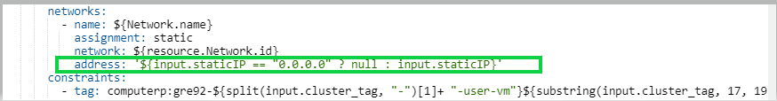

Click on **"version tab"** of blueprint

   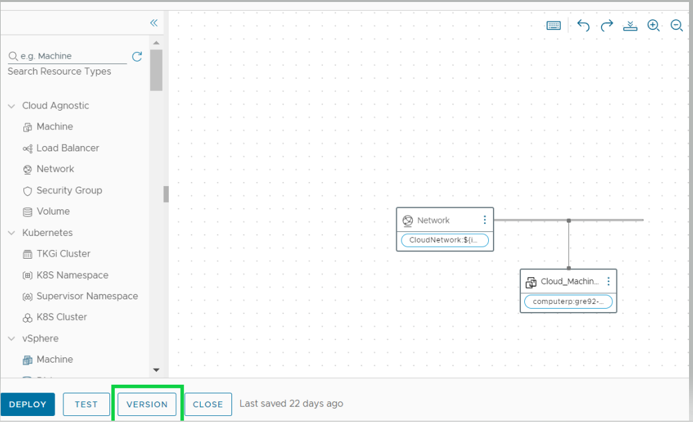

Check **"Release this version to the catalog"** and then click on **create** button.The blueprint will be updated as a result.

   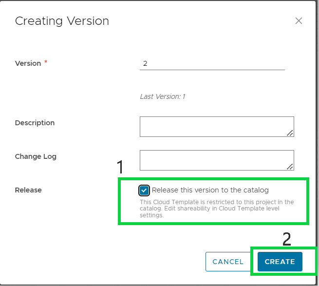

## Update Service Broker Form

Go to the Service Broker, select **"content & Policies"** and choose available **"content resource"**

   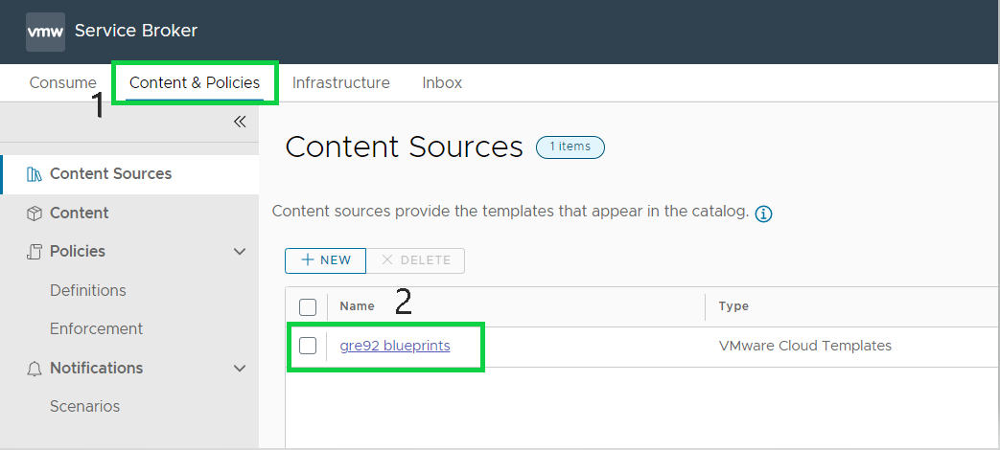

Click on **"validate"** tab to access all the most recent updates. Then, select **"Save & Import"**

   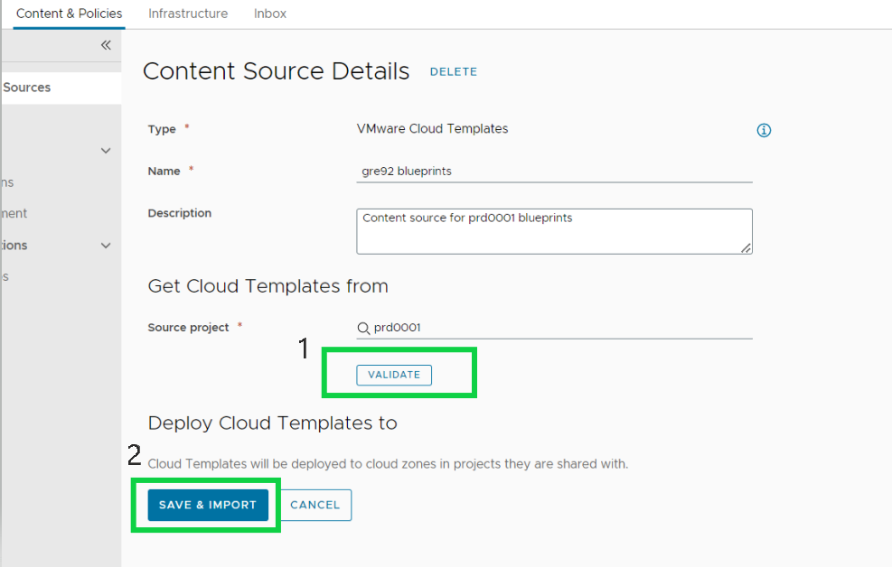

Select **content** tab from left panel and open the blueprint which is published.

   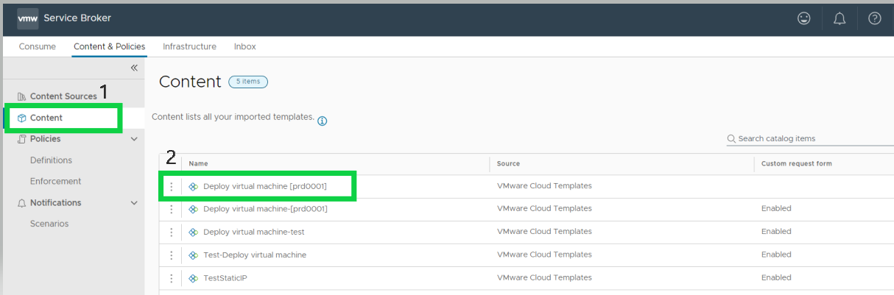

If the **"IP address"** input is not visible under the form design, drag and drop the input field from the left panel's Schema elements. To place the field correctly, make sure to add it after the net tag input field.

   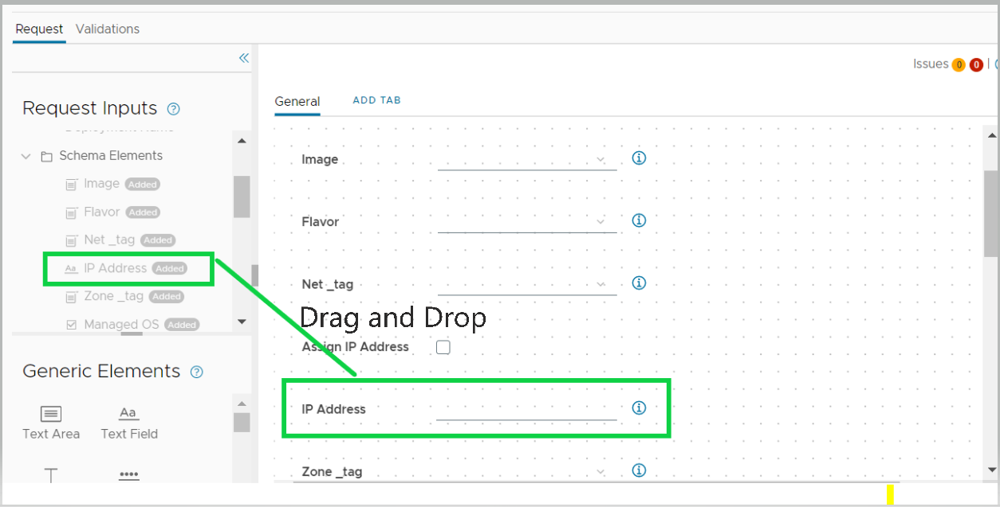

Drag the checkbox from **"General elements"** and place it above the **"IP address"** field. Also, enter the label as **"Assign IP Address"**

   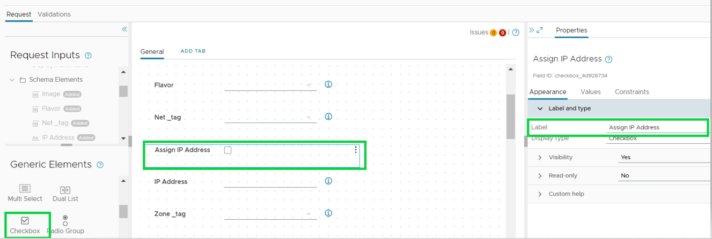

Select **"Appearance"** tab from the right panel, and choose **"conditional value"** from drop down of "value source". Click on **"Add expression"** and select **"Assign IP address"**.

   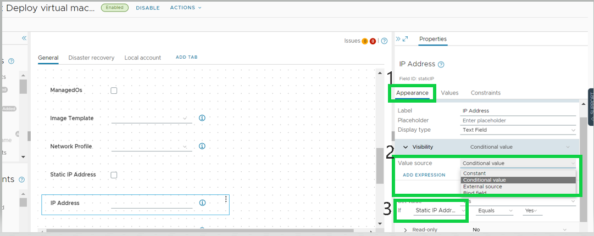

   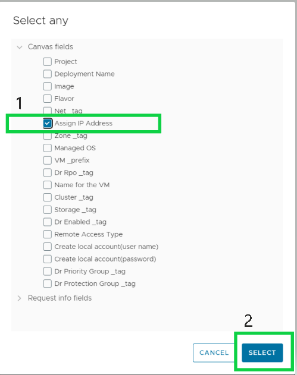

Choose **"Equals"** and **"Yes"** from drop down list as shown below Image. Set Value as **"YES"**

   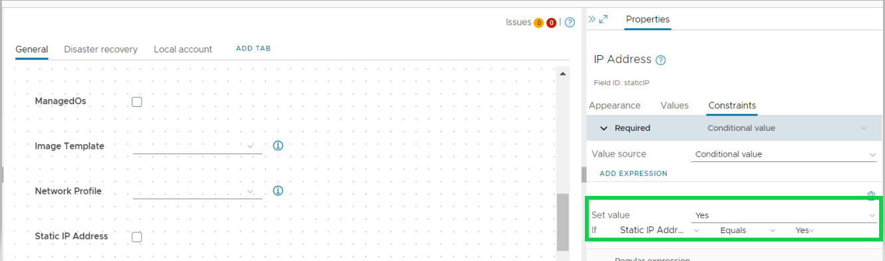

Select **"Values"** tab from the right panel, then choose **"conditional value"** from drop down of value source. Click on **"Add expression"** and select **"Assign IP address"**.

   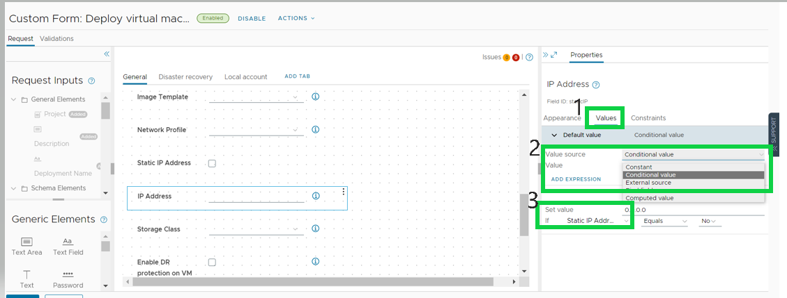

   

Choose **"Equals"** and **"Yes"** from drop down list as shown in below Image. Set Value as **"0.0.0.0"**

   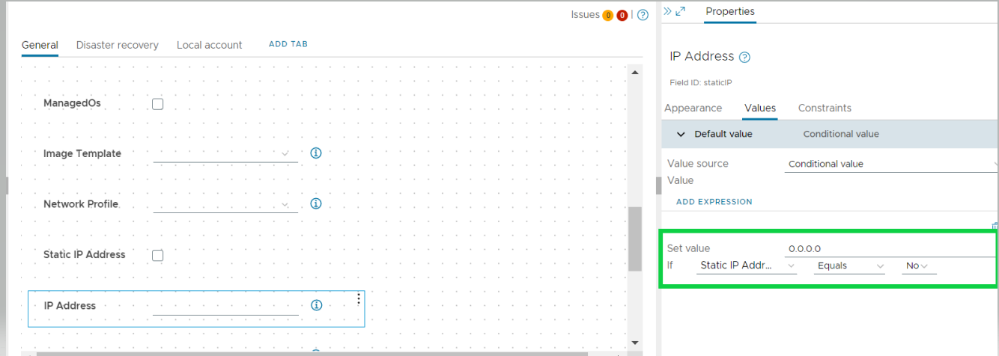

Select the **"Constraint"** tab from the right panel, and choose **"conditional value"** from drop down of **value source**.

   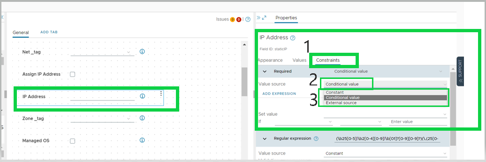

Click on **"Add expression"** and select **"Assign IP address"**

   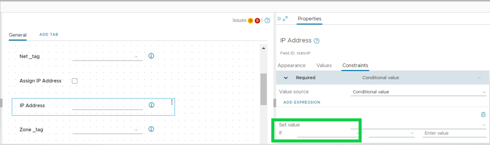

   

Choose **"Equals"** and **"Yes"** from drop down list as shown below Image. Set Value as **"YES"**

   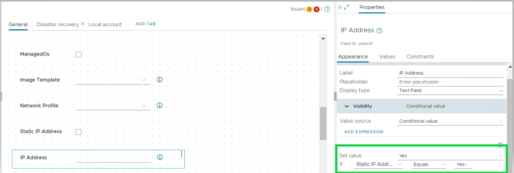

## Update Service Broker Form Using CSS

In case CSS is used in custom blueprints, then newly added fields will not have CSS format applied at service broker form as shown in below image. CSS has to be applied to new field as well.

   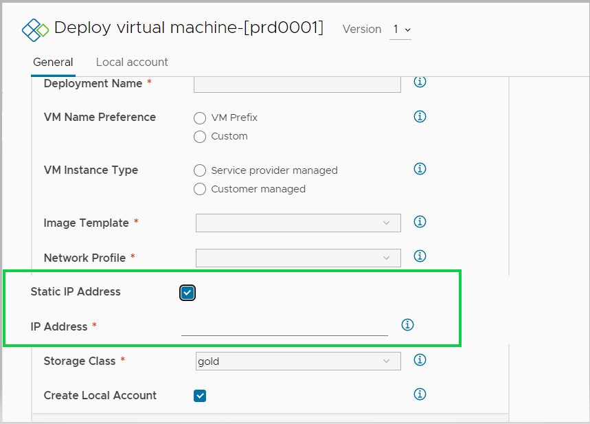

Right-click on the newly added fields and select the "inspect" option to find the section IDs of them.

   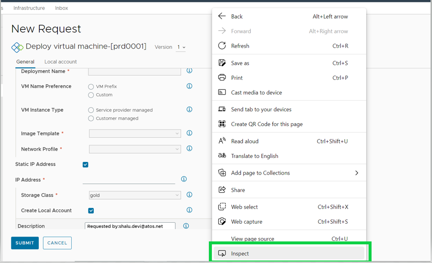

Select options in below sequence as shown in the below image to fetch the section IDs.

   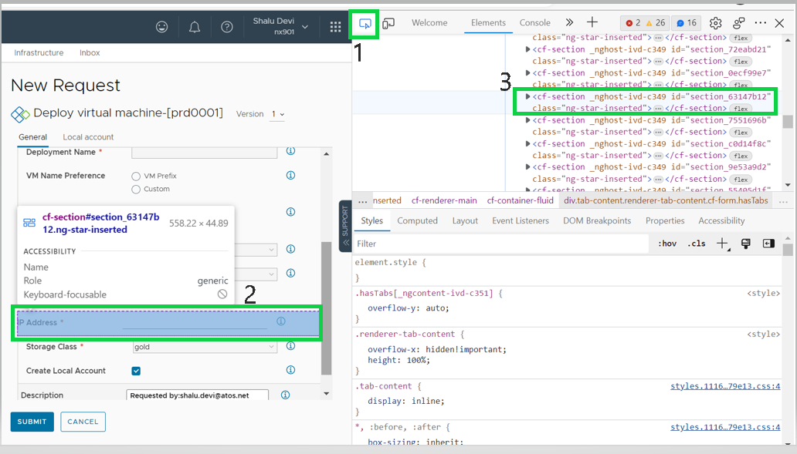

Select the option in below sequence as shown in the below image to fetch the input field IDs.

   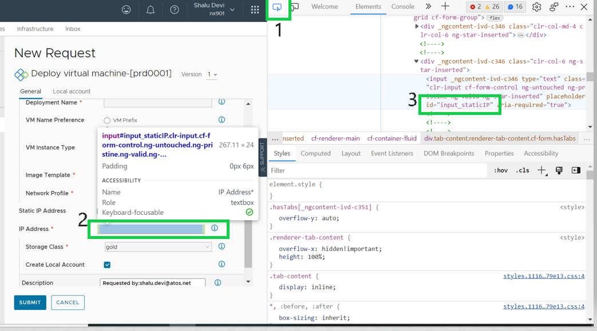

After obtaining all IDs, Enter the section and input field IDs in the exported CSS form.

   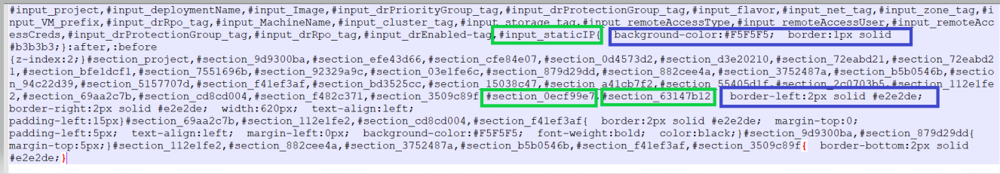

Form will be visible in a validated format as shown below.

   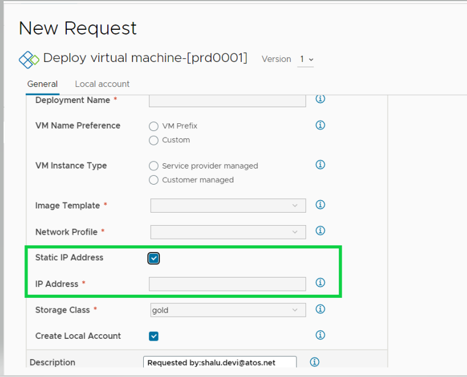
