# Tenant Builder

## Table of Contents
  
- [Tenant Builder](#tenant-builder)
  - [Table of Contents](#table-of-contents)
  - [Changelog](#changelog)
  - [Introduction](#introduction)
    - [Purpose](#purpose)
    - [Audience](#audience)
    - [Scope](#scope)
  - [Related Documents](#related-documents)
  - [Prerequisites](#prerequisites)
    - [Provider Organization](#provider-organization)
    - [Provider Administrator Token](#provider-administrator-token)
    - [Input Date File - *customInfraVars.yml*](#input-date-file---custominfravarsyml)
    - [Git Repository token](#git-repository-token)
    - [Other prerequisites](#other-prerequisites)
  - [CAS Integration procedure](#cas-integration-procedure)
    - [CAS integration - Tenant creation (*tenantBuilder.yml*) (skip for passive DR site)](#cas-integration---tenant-creation-tenantbuilderyml-skip-for-passive-dr-site)
    - [CAS integration - Resource pool creation (*createMtResourcePool.yml*) (skip for active DR site)](#cas-integration---resource-pool-creation-createmtresourcepoolyml-skip-for-active-dr-site)
    - [CAS Integration - Tenant organization token creation (*createVraCloudToken.yml*)](#cas-integration---tenant-organization-token-creation-createvracloudtokenyml)
    - [CAS Integration - Atos Global Images import to CL (*importGlobalImagesToContentLibrary.yml*)](#cas-integration---atos-global-images-import-to-cl-importglobalimagestocontentlibraryyml)
    - [CAS Integration - Create datastore clusters and storage tags (*createVmfsDatastoreClusters.yml*)](#cas-integration---create-datastore-clusters-and-storage-tags-createvmfsdatastoreclustersyml)
    - [CAS Integration - Storage policies creation (*createSpbmPolicy.yml*)](#cas-integration---storage-policies-creation-createspbmpolicyyml)
    - [CAS Integration - new Tenant configuration (*configureVraCloudTenant.yml*)](#cas-integration---new-tenant-configuration-configurevracloudtenantyml)
    - [CAS Integration - NSX-T components creation (*configureNsxt.yml*)](#cas-integration---nsx-t-components-creation-configurensxtyml)
    - [CAS Integration - 2nd Day policy definition creation (*configure2dayPolicyDefinition.yml*)](#cas-integration---2nd-day-policy-definition-creation-configure2daypolicydefinitionyml)
    - [CAS Integration - Cloud Extensibility Proxy HA enablement](#cas-integration---cloud-extensibility-proxy-ha-enablement)
    - [CAS Integration - add Change VM restart priority second day action](#cas-integration---add-change-vm-restart-priority-second-day-action)
    - [CAS Integration - configure automation accounts](#cas-integration---configure-automation-accounts)
    - [CAS Integration - configure resource pool tag](#cas-integration---configure-resource-pool-tag)
    - [CAS Integration - Enable SSRs](#cas-integration---enable-ssrs)
      - [Create REST Hosts in VRO](#create-rest-hosts-in-vro)
      - [Create VRO configuration element - SSRConfig](#create-vro-configuration-element---ssrconfig)
      - [Enable SSRs in vRA](#enable-ssrs-in-vra)
      - [Configure Service Account for VRO](#configure-service-account-for-vro)

## Changelog

| Date       | Description                                                                                       | Author             |
|------------|:--------------------------------------------------------------------------------------------------|:-------------------|
| 2012-07-15 | Initial creation                                                                                  | Pawel Wlodarczyk   |
| 2021-08-03 | Fixes after deployment testing                                                                    | Pawel Warowny      |
| 2021-09-06 | DHC-2760 fixes                                                                                    | Piotr Lewandowski  |
| 2021-09-28 | DHC-2881 updates                                                                                  | Piotr Lewandowski  |
| 2021-10-13 | DHC-3139 updates                                                                                  | Łukasz Stasiak     |
| 2021-11-23 | DHC-3332 Added details for creating Change Disk Storage Class 2nd Day Action                      | Madhavi Rane       |
| 2022-01-25 | DHC-3921 fixes                                                                                    | Robert Kaminski    |
| 2022-02-17 | DHC-3936 updated creation of high Iops storage profile                                            | Shilpa Arote       |
| 2022-03-18 | DHC-4343 Adjustment for GF version 1.5                                                            | Robert Kaminski    |
| 2022-03-24 | DHC-4407 vRO post configuration added for newly created abx ha enablement                         | Lukasz Tomaszewski |
| 2022-05-18 | DHC-4713 Tags improvement for configureVraCloudTenant playbook                                    | Robert Kaminski    |
| 2022-05-20 | DHC-4718 Adjusted for Active/Passive DR                                                           | Robert Kaminski    |
| 2022-06-22 | DHC-4849 Changed execution order for addChangeVmRestartPriorityAction playbook                    | Lukasz Tomaszewski |
| 2022-06-24 | DHC-3696 Added configure automation accounts                                                      | Kacper Kuliberda   |
| 2022-07-18 | CESDHC-233 Default storage policy configuration step                                              | Margo Piliukh      |
| 2022-07-27 | CESDHC-539/535 Added "Other prerequisites" section                                                | Grzegorz Malek     |
| 2022-07-27 | CESDHC-583 Added "Resource pool creation" section                                                 | Lukasz Tomaszewski |
| 2022-09-28 | CESDHC-198 Added section "Create datastore clusters and tags" for VMFS on FC storage solution     | Adam Wieczorek     |
| 2023-03-09 | CESDHC-6277 Added section "Enable Avamar Backup and Restore SSRs"                                 | Piotr Lewandowski  |
| 2023-03-24 | CESDHC-6675 Added section "Configure Service Account for VRO"                                     | Piotr Lewandowski  |
| 2023-08-18 | VCS-10492 Update Day2 SSR integration with A/P DR SSRs                                            | Piotr Lewandowski  |
| 2023-12-13 | VCS-10304 - updated the document indentation and also updated the new version matrix pre-requiste | Piotr Lewandowski  |
| 2025-03-27 | VCS-11076 - Add missing requirement, git token for vRO configuration                              | Adam Szymczak      |
| 2025-04-25 | VCS-15739 Fix link for omniTemplateRenderPlay.yml                                                 | Lukasz Bienkowski  |

## Introduction

### Purpose

Set up a new Customer and new Tenant Organization in vRA Cloud.
Set up a new Tenant for the existing Customer Organization in vRA Cloud.

### Audience

- VCS Operations
- VCS Engineering

### Scope

The scope of this procedure in the area of tenant creation is as follows:

- Creating of resource pool for tenant workloads
- Creating of new tenant in VMware vRA Cloud Partner Navigator (CPN)
- Saving tenant API key in HashiCorp Vault
- Enabling tenant services (Cloud Automation Services, Service Broker)
- Enabling RBAC roles for customer organization
- Creating VSAN Storage Policies
- Creating NSX-T cloud accounts
- Creating vSphere cloud accounts
- Creating Cloud Zone for Tenant organization
- Creating Project within  Tenant organization
- Importing blueprint within Tenant organization
- Creating content source and import blueprint templates within Tenant organization
- Importing custom form into Service Broker Catalog item within Tenant organization
- Creating all image mappings for Tenants from content library OS templates
- Creating all flavour mappings for Tenant
- Creating all network profiles for Tenant
- Creating gold, database, and default storage profile for Tenant
- Creating new cloud extensibility proxy (ABX) for Tenant
- Creating IPAM integration for Tenant
- Creating vRO/vRA integration for Tenant and configure vRO post deployment
- Creating vRA Subscriptions and Actions for Custom name and DR if applicable
- Creating vRA Second day request for Change VM restart priority if applicable
- Creating vRA Second day request for Change Disk Storage Class
- Enabling vRA Second day requests for Avamar Backup & Restore SSRs
- Enabling vRA Second day requests for Active/Passive DR SSRs
- Enabling dynamic backup policy selection for day1 catalog item

## Related Documents

| Document                                         | Description                                                                              |
|--------------------------------------------------|------------------------------------------------------------------------------------------|
| [Customer Infra Vars WI](wiCustomerInfraVars.md) | Guidance how to pre-create and fill in the input data file *$HOME/customerInfraVars.yml* |

## Prerequisites

New tenant creation is partially automated, based on the below playbooks extracted from CAS Integration playbook *dhc-integrateCas.yml*.

| Playbook name                               | Description                                                                                                                        |
|---------------------------------------------|------------------------------------------------------------------------------------------------------------------------------------|
| *tenantBuilder.yml*                         | Creates vRA Tenant and related resources                                                                                           |
| *createMtResourcePool.yml*                  | Creates resource pools for DR passive site                                                                                         |
| *createVraCloudToken.yml*                   | Creates vRA Cloud token (ttl 1 day) and saves it in the Password Manager Hashi CorpVault                                           |
| *importGlobalImagesToContentLibrary.yml*    | Imports Atos Global Images to workload domain Content Library on the 2nd vCenter                                                   |
| *createSpbmPolicy.yml*                      | Creates vSAN storage polices                                                                                                       |
| *configureVraCloudTenant.yml*               | Configures new Tenant on vRA Cloud                                                                                                 |
| *configureNsxt.yml*                         | Deploys and configures NSX-T components based on *customInfraVars.yml* data input file located at user home directory              |
| *configure2dayPolicyDefinition.yml*         | Creates 2nd day policy definition                                                                                                  |
| *createVracExtensibility.yml*               | Creates HA for Cloud Extensibility                                                                                                 |
| *addChangeVmRestartPriorityAction.yml*      | Creates 2nd day Change VM restart priority action                                                                                  |
| *configureAutomationAccounts.yml*           | Creates automation accounts                                                                                                        |
| *configureCloudAssemblyResourcePoolTag.yml* | Configures resource pool tag                                                                                                       |
| *configureRestHostsVro.yml*                 | Creates Avamar and vRA REST Hosts in VRO. Prerequisite for Backup/Restore SSRs                                                     |
| *createVroConfig.yml*                       | Creates the VRO configuration element containing variables required by the Backup/Restore SSRs workflows                           |
| *createDay2Actions.yml*                     | creates Backup/Restore SSRs and Active/Passive DR SSR custom resource actions and updates Service Broker 2nd day policy definition |
| *addChangeVmRestartPriorityAction.yml*      | Creates 2nd day Change VM restart priority action                                                                                  |

There are three main prerequisites to fulfil before the playbooks may be executed:

- **Provider Organization** must exists
- **Provider Administration Token** must exists
- **Input Data File** *$HOME/customerInfraVars.yml* for playbooks must exists

---

### Provider Organization

New Tenant creation playbooks assumes the Provider Organization, called sometimes the Master Organization, already exists.

**To create Provider Organization perform the below manual steps**

- Login to VMware Cloud Partner Navigator and navigate to `Administration -> Additional Provider Organizations` tab. Click on `Add Organization`.

  

- Provide all required inputs

  | Input                | Description                                | Example value |
  |----------------------|--------------------------------------------|---------------|
  | Name of Organization | Provide a Customer organization name       | BTN           |
  | Country              | Provide a Customer country                 | Belgium       |
  | Zip Code             | Provide a zip code for a Customer location | 1234          |

  Click `Add Organization` once all fields are filled.  
  

  

---

### Provider Administrator Token

Provider Administrator token is not stored in Hashi Vault, but it's required when adding a new Tenant in an existing VCS instance. Follow the below steps to generate the token, in order to use it later in the `tenantBuilder.yml` playbook.

- Logon to VMware Cloud Partner Navigator and navigate to Provider Organization Dashboard.

- Click on top right hand side menu and click on `Change Organization`. Make sure that the Provider Organization/Master Organization is selected in the drop-down list.

  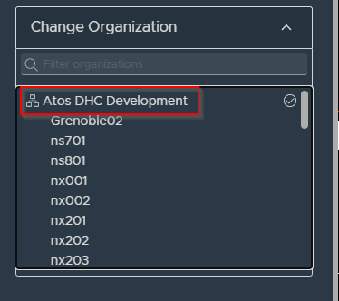

- In the same menu (top right hand side) click on `My Account`.

  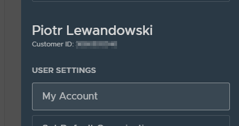

- You will see your account profile. Select `API Tokens` tab at the top and click `Generate a New Api Token` in the middle of webpage.

  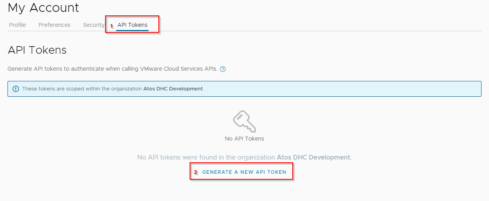

- Provide all required inputs

  | Input      | Description                                                     | Example value |
  |------------|-----------------------------------------------------------------|---------------|
  | Token Name | This defined token name only                                    | providerToken |
  | Token TTL  | This defines how long the API token is valid for (Time To Live) | `1 day`       |

  >Note: In order to reduce the security risk it is expected that the token TTL will be set to `1 day`.

  Click `Generate`.

  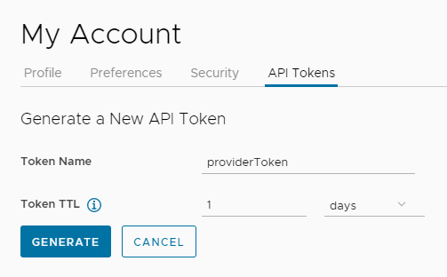

- You will be prompted in separate window that token is generated. Please note down the token as it will be used in further steps.

  >**IMPORTANT**: Make sure that you *copy/download/print* your token. It would be not possible to see this token once again. Once you click "Continue", you will not be able to retrieve this token again (without re-generation of the token itself).

  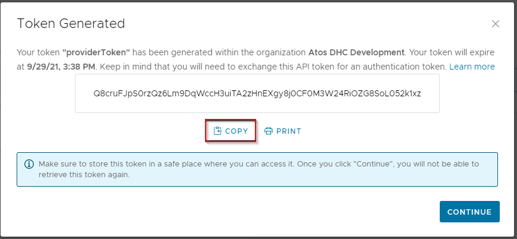

- Click `Continue`. You should now see the token is generated and visible under the Master Organization. You should also receive an email with confirmation that token was generated.

  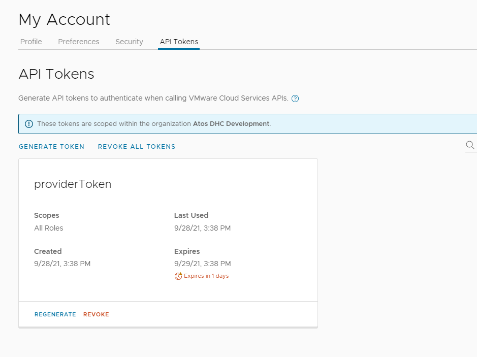

---

### Input Date File - *customInfraVars.yml*

The `tenantBuilder.yml` and the `configureNsxt.yml` playbooks relies on input data file *$HOME/customInfraVars.yml* located in your home directory.

You may use `/opt/dhc/manage/omniTemplateRenderPlay.yaml` playbook to create the *$HOME/customInfraVars.yml* file from template.

```bash
ansible-playbook /opt/dhc/manage/omniTemplateRenderPlay.yaml
```

Next, the input file have to be **filled out manually**.

Mandatory parameters for the `tenantBuilder.yml` playbook are located in the section `customInfraVars.tenant`:

| parameter name       | description                                                                                                                                                                              |
|----------------------|------------------------------------------------------------------------------------------------------------------------------------------------------------------------------------------|
| workloadDomainNumber | use 01 for the first customer workload domain                                                                                                                                            |
| clusterNumber        | use 01 for the first cluster within the customer workload domain                                                                                                                         |
| displayName          | tenant name (refer to naming convention document)                                                                                                                                        |
| providerOrgId        | login to vRA, choose Provider Organization name and click user/organization settings to view provider/master `Organization ID` 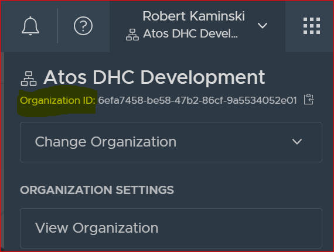 |
| country              | Organization/Company country location                                                                                                                                                    |
| companyName          | Organization/Company name                                                                                                                                                                |
| city                 | Organization/Company city location                                                                                                                                                       |
| state                | Organization/Company state                                                                                                                                                               |
| domain               | VCS management active directory domain name                                                                                                                                              |
| zip                  | Organization/Company postal location zip code                                                                                                                                            |
| tag                  | use tenant name, the same as in field displayName                                                                                                                                        |
| addressLine1         | Organization/Company address                                                                                                                                                             |

There are many more parameters to satisfy inputs required by `configureNsxt.yml` playbook. Refer to [wiCustomerInfraVars.md](wiCustomerInfraVars.md) document for guidance.

### Git Repository token

To run package import for vRO, Github token with VRO-Workflows repository read access is required.
Create the token using your account (or obtain it from Operations Team) and save it in Vault using below playbook:

```shell
ansible-playbook saveVroGitAuthToken.yml
```

The token saved using above method will be removed from Vault after 24 hours.

### Other prerequisites

Validate whether the version matrix present in /opt/dhc/version-matrix/versionMatrix.json is the correct version for your VCS release.

**NOTE**: As per the new version matrix in VCS, the versionMatrix.json file may not be directly referenced in any playbooks. All interactions with the version matrix must be performed via the dedicated dhc_version_matrix Python module.

## CAS Integration procedure

New Tenant creation is partially automated, based on CAS integration playbook *dhc-integrateCas.yml*.

Please proceed with steps below.

---

### CAS integration - Tenant creation (*tenantBuilder.yml*) (skip for passive DR site)

> **IMPORTANT**: For Active Passive DR integration, the passive/recovery site tenant creation must be skipped. Disaster Recovery integration is done under the same tenant organization and the VCS site is to be reflected by projects `VMware Cloud Assembly->Infrastructure->Administration->Projects`. Tenant creation is skipped therefore and the existing tenant configuration is handled later in this work instruction in chapter [CAS integration - new Tenant configuration (*configureVraCloudTenant.yml*)](#cas-integration---new-tenant-configuration-configurevracloudtenantyml).

- Login to *ans001* virtual machine and navigate to `/opt/dhc/manage/`

   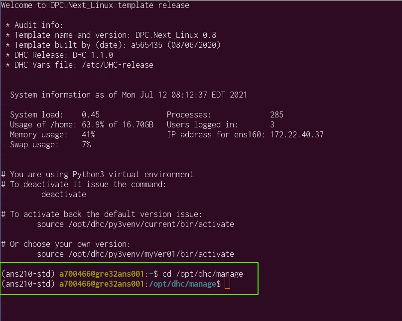

- Make sure the [Input data file](#input-date-file---custominfravarsyml) exists and is properly fulfilled.

- The `tenantBuilder.yml` playbook assumes that the user has already generated an API token for vRA Cloud Provider organization (Provider Administrator role) and it will prompt for the token during execution. Start the `tenantBuilder.yml` playbook, provide your Active Directory username and password, and when prompted provide the [Provider Administrator API token](#provider-administrator-token) (make sure the token is still valid, not expired)

    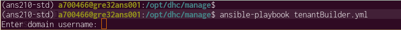

    In case of any errors, please make sure you copy the error message.

- Validate the data that will be used for tenant creation.

    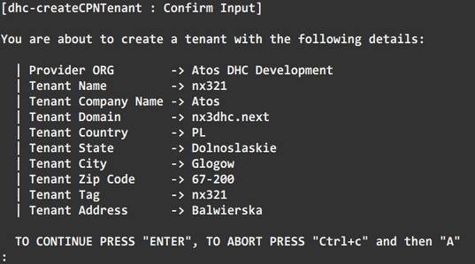

    **NOTE:** Please make sure the data displayed on the screen is correct as this data will be used for tenant creation.

- Make sure the playbook finished without any failures.

    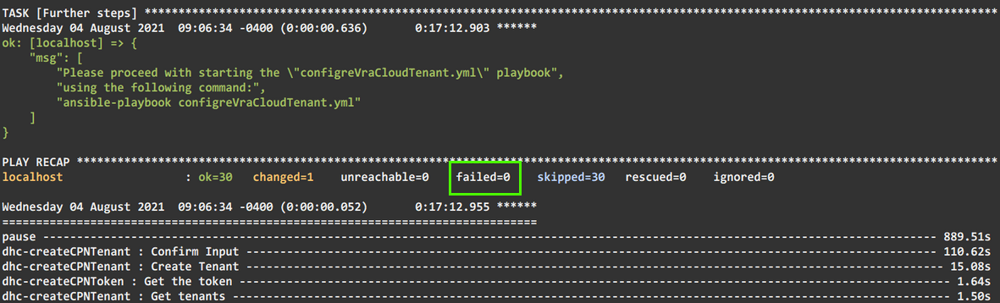

- Access services for tenant organization.

    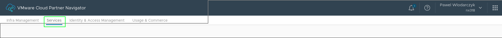

- Enable **Cloud Assembly** service.

    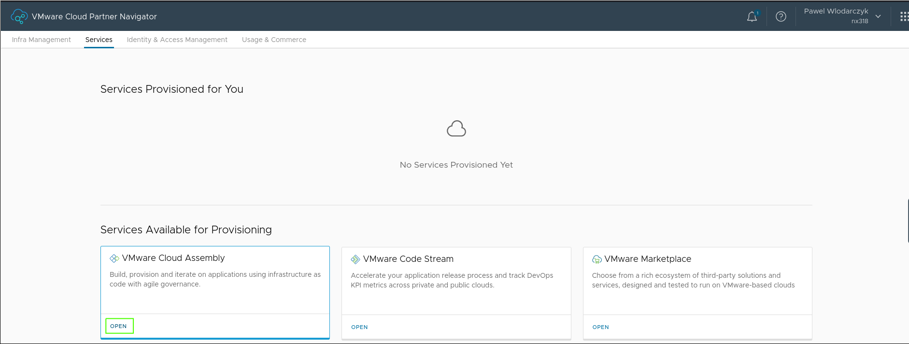

    **NOTE**: The service needs to be enabled in order for the next playbooks to work correctly.

- Confirm Opening service.

    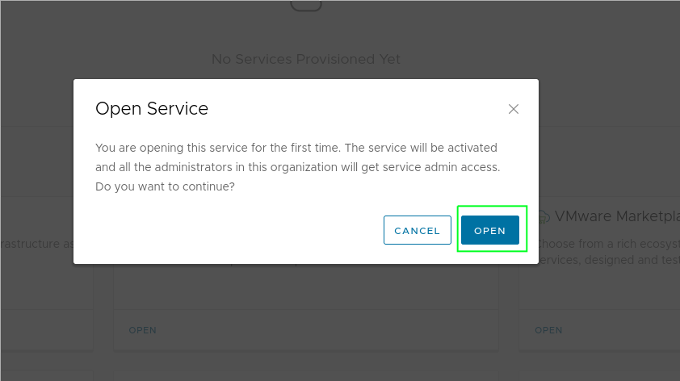

- Open **Service Broker** service.

    Please repeat step 7 and 8 for **Service Broker** service in order to enable it.

- Enable RBAC roles in the Customer Organization

    In order to enable RBAC roles in each of the services so that they can be assigned later on to users, you need to click **Manage Customer Access** in each of the Services and select a checkbox next to each of the roles.

    Roles enabled for Cloud Assembly service:

    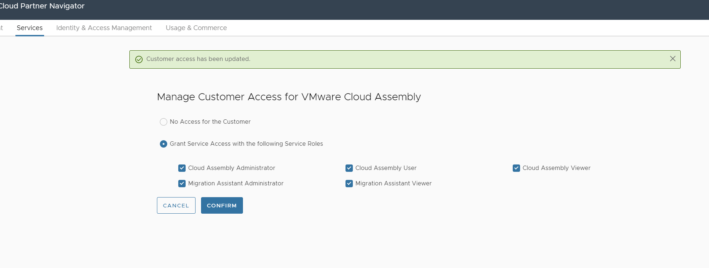

    Roles enabled for Service Broker:

    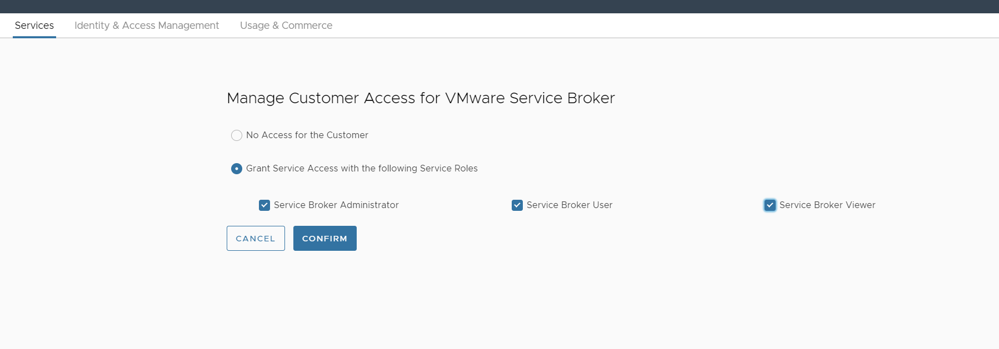

---

### CAS integration - Resource pool creation (*createMtResourcePool.yml*) (skip for active DR site)

> **IMPORTANT**: For Active Passive DR integration, the active/protected site resource pool creation is completed within `Tenant creation` step.

- Login to *ans001* virtual machine and navigate to `/opt/dhc/manage/` and execute:

    ```shell
    ansible-playbook createMtResourcePool.yml
    ```

### CAS Integration - Tenant organization token creation (*createVraCloudToken.yml*)

- Create and Save a tenant organization token

    This task will automatically generate an authorization token for a given Tenant Organization and save it into Hashi Corp Vault Password Manager. Since the tokens are based on individual user accounts, each token will be stored as a separate entry in Hashivault, with a username appended to each entry ( the username of a user executing the playbook). The token will be visible only to this particular user.

    >Note: MultiFactor Authentication needs to be enabled on the vRA Cloud account before running this playbook.

    In order to proceed please log in to the ansible server and browse to */opt/dhc/manage*. Execute the playbook:

    ```bash
    dhc/manage$ ansible-playbook createVraCloudToken.yml
    ```

    You will be prompted to provide the following inputs:

    ```yml
    Enter VCS management domain username e.g.: a123456@exampledomain.com
    Your input: Your Active Directory domain username

    Enter the password for the user domain. Please note that the password you enter will not be displayed on the screen. 
    Your input: Your Active Directory domain password

    Enter vRA Cloud username e.g.: a123456@exampledomain.com 
    Your input: Your e-mail address associated with VMware Cloud Services

    Enter password for vRA Cloud user 
    Your input: Your password for the above account

    Please enter the name of the tenant organization, i.e. nx302
    Your input: tenant organization name

    NOTE: AS THIS IS SELENIUM, BEFORE ENTERING PIN, PLEASE WAIT FOR NEW VALIDITY CYCLE

    Please enter MFA Authenticator PIN
    Your input: PIN
    ```

    >Note: During the execution of this playbook you will be prompted for One Time Password (OTP) used in Multi Factor Authentication (MFA). Without enabled MFA on the vRA account, the playbook will fail.

    Once playbook execution is finished please double check that all data provided is saved successfully in Hashi Corp Vault Password Manager. Login to Vault using LDAP option and navigate through secrets path to find credentials you are looking for. In this case it would be `/secrets/secret/customerCode/locationCode/vracloud/tenant org/`

    There must be an entry with your Active Directory username suffix `authorizationToken-aXXXXXX`.

    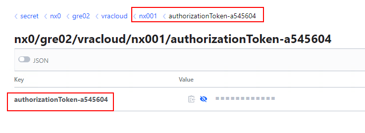

    >Note: In the prerequisites **Provider** organization token was generated, here the **Tenant** organization token is generated and stored in the VCS password manager for the further automation. Token is valid for `1 day`. Valid tenant token in the Hashi is mandatory for the playbooks used next in this work instruction. You may use *createVraCloudToken.yml* playbook again to regenerate it.

---

### CAS Integration - Atos Global Images import to CL (*importGlobalImagesToContentLibrary.yml*)

- Login to *ans001* virtual machine and navigate to `/opt/dhc/manage/`. Import Atos Global Images to Compute vCenter Content Library by executing the playbook:
  
    ```shell
    ansible-playbook importGlobalImagesToContentLibrary.yml
    ```

- You may login to *vcs002* vCenter and check if expected templates are present in the Content Library
    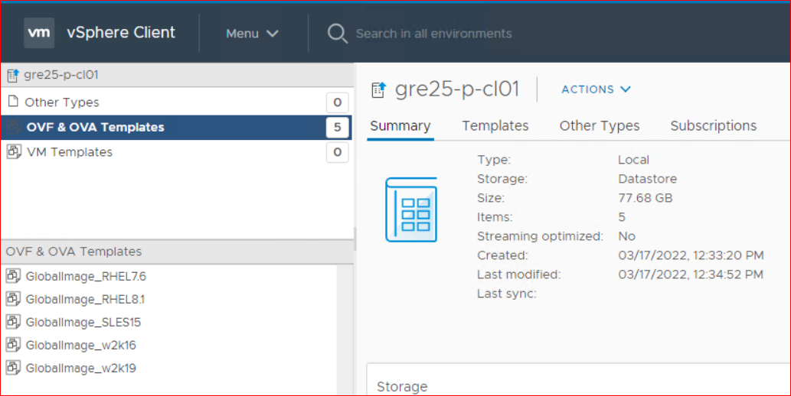

**IMPORTANT:** Importing Atos Global Images for the second and subsequent VCS sites is no longer necessary as images are now configured with the Subscribed Content Library. Subscribed Content Library is replicating Atos Global Images from primary VCS Published Content Library.
Instead of running `importGlobalImagesToContentLibrary.yml` run the playbook:

```yml
ansible-playbook createSubscribedContentLibrary.yml
```

for creating vSphere Subscribed Content Library. Then run the playbook:

```yml
ansible-playbook addSubscribedClImageMapping.yml
```

to configure Image Mappings for Atos Global Images in vRA Cloud Assembly. Follow guidance of above playbook's Readme file, to provide vRA-specific user's input paremeters.

Please continue with [wiTenantBuilderVraOnPrem.md](wiTenantBuilderVraOnPrem.md) for configuring vRA tenant.

---

### CAS Integration - Create datastore clusters and storage tags (*createVmfsDatastoreClusters.yml*)

**NOTE**: Execute only when using external storage solution in workload domain - `principalStorageTypeCmp: "vmfs"`

Before running this playbook make sure that all required datastores are created, connected to all hosts in WD and listed in `customInfraVars` file in `storagePoliciesVmfs` section as described in [wiCustomerInfraVars.md](wiCustomerInfraVars.md).

This playbook will:

- create `StorageClass` category and tags for each storageClass provided in customInfraVars file
- create `StorageReplication` category and tags for replication status - `yes` and/or `no`
- create datastore cluster(s) for each storage flavor (storage class and storage replication combination) based on customInfraVars file
- assigned datastore(s) to newly created datastore cluster(s) based on customInfraVars file
- tag all datastores and datastore clusters with appropriate tags from `StorageClass` and `StorageReplication` categories

Playbook necessary input:

- MGMT domain credentials

Login to `ans001` and from `/opt/dhc/manage` run:

   ```shell
   ansible-playbook createVmfsDatastoreClusters.yml
   ```

Once playbook run is finished verify that all datastores and datastore clusters are corectly tagged. Each should have one tag from `StorageClass` category and one tag from `StorageReplication` category.

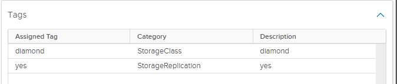

### CAS Integration - Storage policies creation (*createSpbmPolicy.yml*)

- Prepare the inputs for *createSpbmPolicy.yml* playbook. You will need to provide:
  
  - MGMT domain credentials
  - vRA Cloud Tenant name
  - The Compute cluster number (two digits). Default value: 01
  - Storage type of vSAN (af or hd). Default value: af (short cuts means AllFlash or Hybrid)
  - RAID value for storage policies (1 or 5). Default value: 5
  
- Login to *ans001* virtual machine and navigate to `/opt/dhc/manage/` and execute:

  ```shell
  ansible-playbook createSpbmPolicy.yml
  ```

- You may login to *vcs002* vCenter and check if expected storage policies exists.
    

- Configure the default storage policy with unlimited IOPs in vCenter and respective vRA Cloud storage profile mapping; update the blueprint and catalogue item to have the Default storage policy as default. To do so, run the following playbook from `/opt/dhc/manage/`:

**NOTE**: the locationCodeDr in *group-vars/all* file **cannot** be empty (`none`, however, is an acceptable value).
  
  ```shell
    ansible-playbook createDeafaultStoragePolicy.yml
  ```

- At the prompt you will have to provide:
  - MGMT domain credentials
  - vRA Cloud Tenant name
  - The Compute cluster number (two digits). Default value: 01
  - Storage type of vSAN (af or hd). Default value: af (short cuts means AllFlash or Hybrid)
  
 **NOTE**: for Active-Active stretched cluster, additional storage policies are created on vCenter level to reflect the placement preferences: dual-site mirroring, preferred site, and non-preferred site. Only **one** storage policy is mapped to the respective storage profile in vRA Cloud (dual-site mirroring).

---

### CAS Integration - new Tenant configuration (*configureVraCloudTenant.yml*)

- Start Services and components configuration tenant related

    Now, under the condition that Tenant Administrator token added to Hashi Vault is still valid (reminder `1day`), we can run the next playbook.

    ```bash
    ansible-playbook configureVraCloudTenant.yml
    ```

    **OR... as an ALTERNATIVE**, since the *configureVraCloudTenant.yml* playbook contains large number of tasks that have **tags** associated to each of them, you may find it useful to use tags in order to start tasks one by one. Thanks to it, you can have a better control on the progress.

    Use the below command to list all tags for vRA cloud tenant configuration playbook:

    ```bash
    ansible-playbook configureVraCloudTenant.yml --list-tags
    ```

  You will get the output as below with the play names and task tags associated to it. Refer to example usage.

```yaml
playbook: configureVraCloudTenant.yml

  play #1 (localhost): Import Custom Input Variables    TAGS: [createVracExtensibility,createIpam,importVariables,createAbx,createCloudProxy,installAgents,createVraSubDr,createVraSubApply,configureVraCloud,prepareVracExtensibility,createIpamIntegration,configureVro,createVraSubCustom,showInfo,createVroVra]
      TASK TAGS: [configureVraCloud, configureVro, createAbx, createCloudProxy, createIpam, createIpamIntegration, createVraSubApply, createVraSubCustom, createVraSubDr, createVracExtensibility, createVroVra, importVariables, installAgents, prepareVracExtensibility, showInfo]

  play #2 (localhost): Create Cloud Proxy       TAGS: [createCloudProxy]
      TASK TAGS: [createCloudProxy]

  play #3 (localhost): Configure Tenant Organization in VRA Cloud       TAGS: [configureVraCloud]
      TASK TAGS: [configureVraCloud]

  play #4 (localhost): Prepare Requirements to Deploy ABX       TAGS: [createAbx,prepareVracExtensibility]
      TASK TAGS: [createAbx, prepareVracExtensibility]

  play #5 (adc001): Create DNS Entry for New ABX Proxy  TAGS: [createAbx,createDns]
      TASK TAGS: [createAbx, createDns]

  play #6 (localhost): Create vRAC Extensibility Integration    TAGS: [createVracExtensibility,createAbx]
      TASK TAGS: [createAbx, createVracExtensibility]

  play #7 (localhost): Create IPAM Integration  TAGS: [createIpamIntegration,createIpam]
      TASK TAGS: [createIpam, createIpamIntegration]

  play #8 (localhost): Create vRO Integration on vRA Cloud      TAGS: [createVroVra]
      TASK TAGS: [createVroVra]

  play #9 (localhost): Configure vRO Post Deployment    TAGS: [configureVro]
      TASK TAGS: [configureVro]

  play #10 (localhost): Create vRA Subscription for Applying VM Name    TAGS: [createVraSubApply]
      TASK TAGS: [createVraSubApply]

  play #11 (localhost): Create Custom VM Name   TAGS: [createVraSubCustom]
      TASK TAGS: [createVraSubCustom]

  play #12 (localhost): Create Place VM Extensibility Action and Subscription on vRA Cloud      TAGS: [createVraSubDr]
      TASK TAGS: [createVraSubDr]

  play #13 (vraproxies): Install monitoring agents      TAGS: [installAgents]
      TASK TAGS: [installAgents]

  play #14 (localhost): Further steps   TAGS: [showInfo]
      TASK TAGS: [showInfo]
```

The `1st` task/play *`Import Custom Input Variables`* of the *configureVraCloudTenant.yml* is mandatory for all, hence it contains all tags.

To run the `2nd` task/play *`Create Cloud Proxy`* execute the following:

```bash
    ansible-playbook configureVraCloudTenant.yml --tags createCloudProxy
```

To run the `3rd` task/play *`Configure Tenant Organization in VRA Cloud`* execute the following:

```bash
    ansible-playbook configureVraCloudTenant.yml --tags configureVraCloud
```

Plays `4,5,6th` contains the same tag *`createAbx`*, you may execute them all at one by command:

```bash
    ansible-playbook configureVraCloudTenant.yml --tags createAbx
```

Alternatively, you could run just plays `4th and 5th` using tags *`prepareVracExtensibility,createDns`*:

```bash
    ansible-playbook configureVraCloudTenant.yml --tags prepareVracExtensibility,createDns
```

or... run everything except *`Install monitoring agents`* (skip play #13 )

```bash
    ansible-playbook configureVraCloudTenant.yml --skip-tags installAgents
```

>**Note**: Play `6th`, *`Create IPAM Integration`*, due to the issue with automatic package import it is required to import package manually before executing IPAM integration playbook.
>
>You can obtain package *.zip* file from */opt/binaries* on control host, or by downloading it from marketplace - links to specific versions can be found [here](<https://docs.vmware.com/en/vRealize-Automation/8.6/Using-and-Managing-Cloud-Assembly/GUID-ADD9C0D7-328C-4DAD-BC83-9C0F5656FE98.html>).
>
>Follow the below steps to import provider package into vRA Cloud.
>
>- Download appropriate IPAM provider package .zip file (you can find valid version in VCS versionMatrix).
>- Logon to VMware Cloud Partner Navigator and navigate to Provider Organization Dashboard.
>- Click on top right hand side menu and click on `Change Organization`. Make sure that the Tenant organization is selected in the drop-down list.
>- Select `Infrastructure > Connections > Integrations` and click `Add Integration`.
>- Click `IPAM`.
>- Click `Manage IPAM Providers`.
>- Click `Import Provider Package`, navigate to an existing provider package .zip file, and select it. Once uploaded, you can close the window.

---

### CAS Integration - NSX-T components creation (*configureNsxt.yml*)

- Configure SDN for the new tenant

    This step is automated by the `configureNsxt.yml` playbook, however as described in the Prerequisites section, it requires the template file to be filled in properly. If this is done, run the playbook:

    ```bash
    ansible-playbook configureNsxt.yml
    ```

   >**IMPORTANT**: After a newly created NSX-T segment is visible on vRA cloud side, there is a need to perform Infoblox integration manually. Currently this process cannot be automated due lack of public API from vRA Cloud. Please follow wiVraInfobloxIntegration work instruction for every added network.

- Add Change Disk Storage Class second day action

    This SSR is released in VCS 1.5 and should be added in each tenant. Follow the steps mentioned below to add Change Disk Storage Class second day action.
    Execute the following playbook on ans001 server from */opt/dhc/manage* folder to add Change Disk Storage Class second day action. Please note that valid Tenant Organization Token (generated as per steps mentioned in section Create and Save tenant organization Token of this document) must be available in Hashi vault before executing this playbook.

    ```bash
    ansible-playbook createChangeDiskStorageClassAction.yml 
    ```

    Provide following information for the playbook execution:

  - DasId from the VCS management domain in format `dasId@domain.next`
  - VCS management account password
  - tenant name for which action will be created

---

### CAS Integration - 2nd Day policy definition creation (*configure2dayPolicyDefinition.yml*)

- To configure 2day action SSRs policy definitions on Service Broker (vRA Cloud) execute:

    ```bash
    ansible-playbook configure2dayPolicyDefinition.yml
    ```

You may validate policy definitions by login to `vRA Service Broker -> Content&Policies -> Policies -> Definitions`
  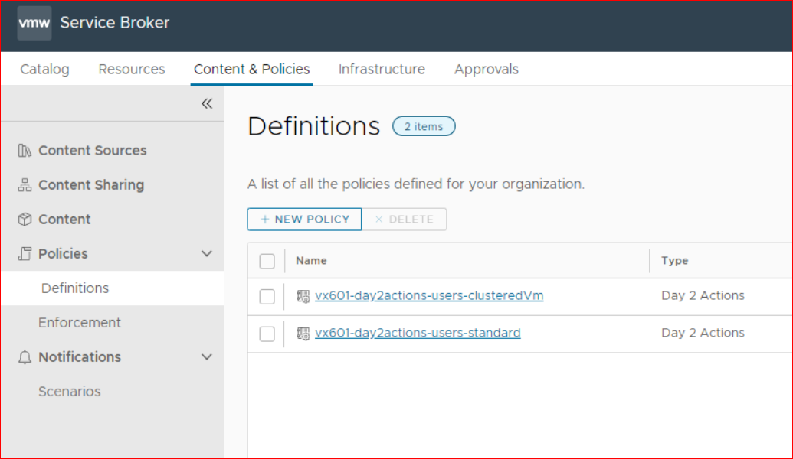

### CAS Integration - Cloud Extensibility Proxy HA enablement

This chapters enables the high availability proxy on Cloud Extensibility

- Login to the ansible server and browse to */opt/dhc/manage*. Execute the following playbook to deploy and configure additional Cloud Extensibility Proxy (abx) appliance with embedded vRO.

  ```shell
  ansible-playbook createVracExtensibility.yml -e projectName=prd001
  ```

  Command syntax:

  Use *-e projectName=prd<3digits>* in case Cloud Extensibility Proxy (abx) appliance is placed under different project name (i.e. prd002)

  Playbook during execution prompts to provide the following inputs:

  - *Enter domain username in format `dasId@domain.next`*
  - *Please provide TENANT ORGANIZATION NAME*

Execution of playbook results provisioned additional cloud extensibility proxy (abx) under management wld cluster domain.

- Login to the vRA cloud tenant org. (cloud assembly) go to `Infrastructure -> Administration->Projects`, open affected project (i.e. prd001).

  - Go to `provisioning` tab, next under `Extensibility Constraints` field overwrite existing tag with new one as below screen example - abx:<projectname> (i.e. abx:prd001) and save changes.

    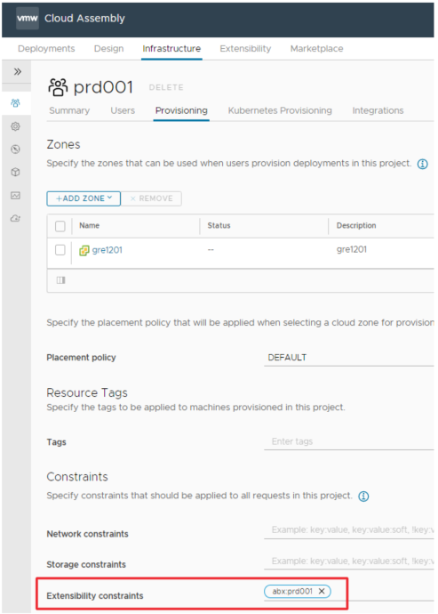

  - Next under infrastructure tab browse to `Connections -> Integrations`, open newly created abx integration (i.e. gre12abx003).

  - Under abx integration go to field "Capability tags", overwrite existing tag with new one as below screen example - abx:<projectname> (i.e. abx:prd001) and save changes.

    >**NOTE: Repeat step and update old abx integration as well to use new capability tag to form redundancy**
  
  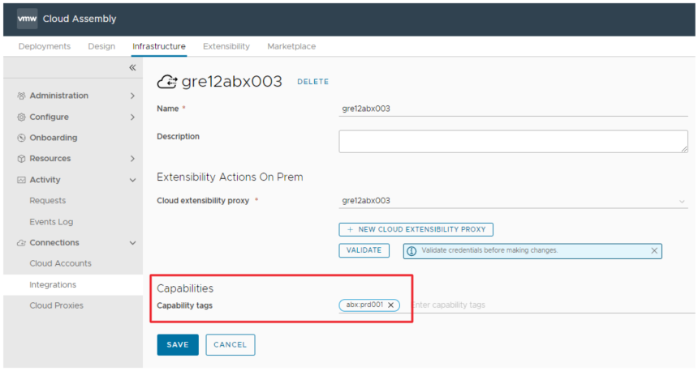

Execute the following playbook to create new vRO integration using newly created cloud extensibility proxy.

  ```shell
  ansible-playbook createVroVraIntegration.yml -e abxName=gre12abx003
  ```

Command syntax:

use *-e abxName=gre12abx<3digits>* provide name of newly created Cloud Extensibility Proxy (abx) appliance (i.e. gre12abx003)

Playbook during execution prompts to provide the following inputs:

- Enter domain username in format `dasId@domain.next`

- Please provide TENANT ORGANIZATION NAME

Execution of playbook results that additional new vRO integration will be created.
  
Next under infrastructure tab browse to `Connections -> Integrations`, open newly created vRO integration (i.e. gre12abx003-vro)
Under vRO integration go to field `Capability tags`, overwrite existing tag with new one as below screen example - abx:<projectname> (i.e. abx:prd001) and save changes.

**NOTE: Repeat step and update old vRO integration as well to use new capability tag to form redundancy**
  
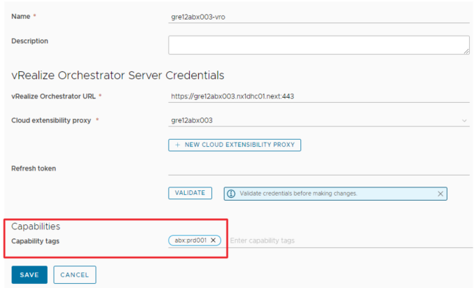

Execute the following playbook to configure new vRO integration using newly created cloud extensibility proxy.

  ```shell
  ansible-playbook configureVroPostDeployment.yml -e abxName=gre12abx003
  ```

Command syntax:

use *-e abxName=gre12abx<3digits>* provide name of newly created Cloud Extensibility Proxy (abx) appliance (i.e. gre12abx003)

Playbook during execution prompts to provide the following inputs:

- Enter domain username in format `dasId@domain.next`

- Please provide TENANT ORGANIZATION NAME

Execution of playbook results that additional new vRO contains post configuration applied.

### CAS Integration - add Change VM restart priority second day action

This SSR has been released in VCS 1.5 and should be added only for Active-Active DR type. Follow the steps below to add Change VM restart priority second day action.
Execute the following playbooks on ans001 server from */opt/dhc/manage* folder to add Change VM restart priority second day action

```bash
   ansible-playbook addChangeVmRestartPriorityAction.yml 
```

Provide following information for the playbook execution:

- DasId from the VCS management domain in format `dasId@domain.next`
- VCS management account password
- tenant name for which action will be created

### CAS Integration - configure automation accounts

Execute the following playbook to configure automation accounts.

```bash
   ansible-playbook configureAutomationAccounts.yml 
```

### CAS Integration - configure resource pool tag

Execute the following playbook on ans001 server from */opt/dhc/manage* to configure resource pool tag.

```bash
   ansible-playbook configureCloudAssemblyResourcePoolTag.yml 
```

### CAS Integration - Enable SSRs
  
Enabling the SSRs is automated by Ansible playbooks and includes the following steps:

- create Avamar and vRA REST Hosts in VRO
- create VRO Configuration element (SSRConfig)
- create backup & restore custom resource actions in Cloud Assembly
- create 'Manage DR A/P Protection' Day2 action for a given tenant in vRA (only when VCS is configured with Active/Passive DR and VSAN storage)
- update the Service Broker day2 policy definition
- update the Service Broker day1 catalog item to allow dynamic Avamar backup policy selection during VM deployment
- update Service Broker custom form for day1 catalog item to enable dynamic lookup of SRM Protection Groups
  
#### Create REST Hosts in VRO

Execute the **configureRestHostsVro.yml** playbook on ans001 server. Please note that valid Tenant Organization Token (generated as per steps mentioned in section Create and Save tenant organization Token of this document) must be available in Hashi vault before executing this playbook.

 ```yml
ansible-playbook configureRestHostsVro.yml
 ```

You will be prompted to provide the following inputs:

- VCS management Active Directory domain username i.e. `a123456@exampledomain.com`
- Your Active Directory domain password
- Tenant name. For VRA SaaS it's the tenant organization name i.e. 'nx301'. For vRA On-Prem it's the IDM hostname dedicated for a given tenant, i.e. 'GRE92IDM002'
- Avamar server FQDN, i.e. gre92ave001.exampledomain.com

Once playbook execution is finished please double check that the REST Hosts have been successfully created. Login to vRA, open Orchestrator, navigate to the Inventory and verify that the Avamar and VRA REST Hosts are present.
  
 Example:

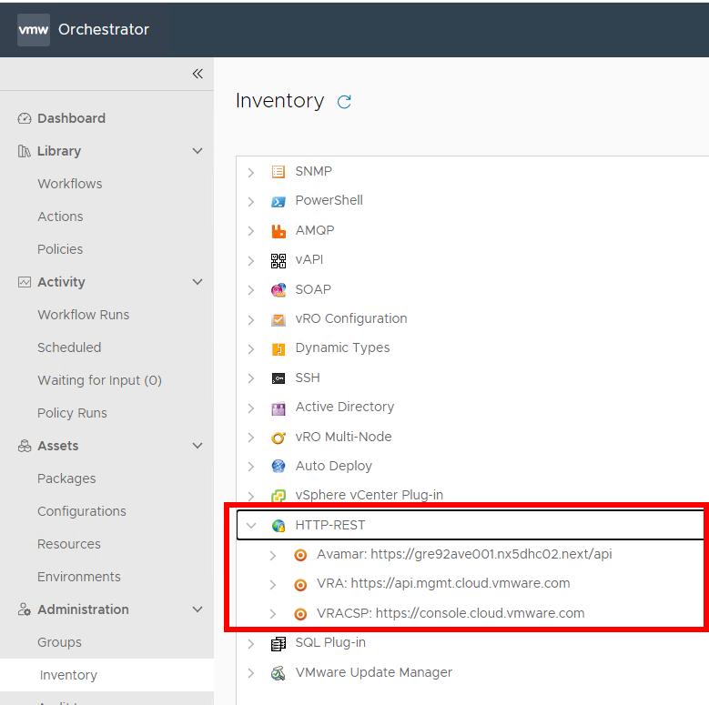

#### Create VRO configuration element - SSRConfig

This step will create the **SSRConfig** configuration Element in VRO, containing all the variables required by workflows used for executing the Avamar Backup & Restore SSRs.

Execute the **createVroConfig.yml** playbook on ans001 server. Please note that valid Tenant Organization Token (generated as per steps mentioned in section Create and Save tenant organization Token of this document) must be available in Hashi vault before executing this playbook.

 ```yml
ansible-playbook createVroConfig.yml
 ```

You will be prompted to provide the following inputs:

- VCS management Active Directory domain username i.e. `a123456@exampledomain.com`
- Your Active Directory domain password
- Tenant name. For VRA SaaS it's the tenant organization name i.e. 'nx301'. For vRA On-Prem it's the IDM hostname dedicated for a given tenant, i.e. 'GRE92IDM002'

Once playbook execution is finished please double check that the Configuration element has been successfully created and all variables are filled in correctly. Login to vRA, open Orchestrator, navigate to the (Assets) Configurations and click on the SSRConfig file under Configrations/DHC/.
  
Example:

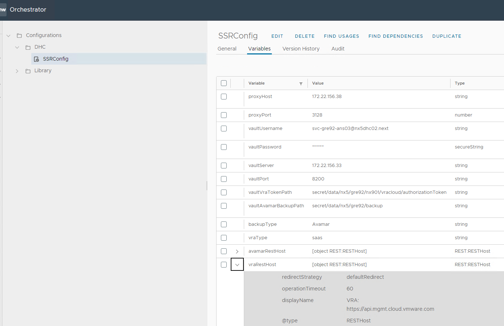
  
#### Enable SSRs in vRA

This step will cover the following tasks:

- create 'Manage VM Backup Policy' Day2 action for a given tenant in vRA
- create 'Backup On-Demand' Day2 action for a given tenant in vRA
- create 'Backup Restore' Day2 action for a given tenant in vRA
- create 'Manage DR A/P Protection' Day2 action for a given tenant in vRA (only when VCS is configured with Active/Passive DR and VSAN storage)
- update Service Broker policies definitions with the new Day2 actions
- update Service Broker custom form for day1 catalog item to enable dynamic lookup of available Avamar backup policies
- update Service Broker custom form for day1 catalog item to enable dynamic lookup of SRM Protection Groups

Execute the **createDay2Actions.yml** playbook on ans001 server. Please note that valid Tenant Organization Token (generated as per steps mentioned in section Create and Save tenant organization Token of this document) must be available in Hashi vault before executing this playbook.

 ```yml
ansible-playbook createDay2Actions.yml
 ```

You will be prompted to provide the following inputs:

- VCS management Active Directory domain username i.e. `a123456@exampledomain.com`
- Your Active Directory domain password
- Tenant name. For VRA SaaS it's the tenant organization name i.e. 'nx301'. For vRA On-Prem it's the IDM hostname dedicated for a given tenant, i.e. 'GRE92IDM002'
- vRA Project Name
  
Once playbook execution is finished please double check that the custom resource actions have been successfully created in Cloud Assembly and the day2 policy definition has been updated with the new actions.
  
Login to vRA, open Cloud Assembly, click the **Design** tab and navigate to **Resouce Actions**. Verify that all actions are present.
  
Example:

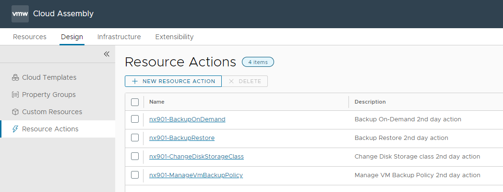
  
Switch to the Service Broker service, click the **Content & Policies** tab, navigate to Policies -> Definitions and select the standard day2 actions policy. Verify that it contains the newly added actions.
  
Example:

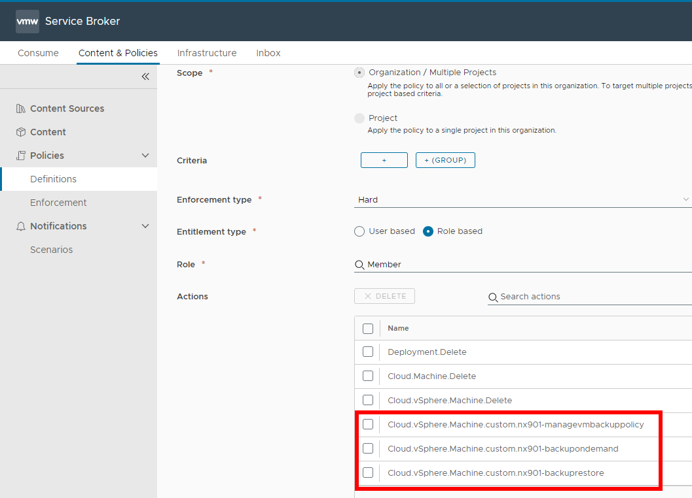
  
In the **Content & Policies** tab:

- click on **Content**,
- then click on the three dots next to the Deploy Virtual Machine catalog item and select **Customize Form**.
- In the canvas, click on the **backupPolicy_tag** field,
- on the right-hand side select the **Values** tab, expand **Value options** and verify that the external source points to the VRO action **getAvamarBackupPoliciesCustomForm**

Example:

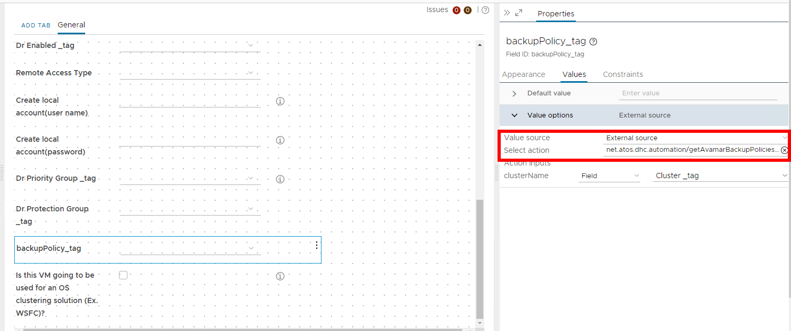

For the Active/Passive DR-enabled VCS additionaly check the following:

- In the canvas, click on the **Dr Protection Group _tag** field,
- on the right-hand side select the **Values** tab, expand **Value options** and verify that the external source points to the VRO action **getSRMProtectionGroup**
  
#### Configure Service Account for VRO

This step is automated with an Ansible playbook, which covers the following actions:

- create a VRO Active Directory service account (vRA On-Prem only)
- generate an API refresh token for the service account and add it to Hashivault
- add service account to vRA project as the member
  
Execute the **createAndIntegrateVroServiceAccount.yml** playbook on ans001 server. Please note that valid Tenant Organization Token (generated as per steps mentioned in section [CAS Integration - Tenant organization token creation (*createVraCloudToken.yml*)](#cas-integration---tenant-organization-token-creation-createvracloudtokenyml) of this document) must be available in Hashi vault before executing this playbook.

 ```yml
ansible-playbook createAndIntegrateVroServiceAccount.yml
 ```

You will be prompted to provide the following inputs:

- VCS management Active Directory domain username i.e. `a123456@exampledomain.com`
- Your Active Directory domain password
- Tenant name. For VRA SaaS it's the tenant organization name i.e. 'nx301'. For vRA On-Prem it's the IDM hostname dedicated for a given tenant, i.e. 'GRE92IDM002'
- vRA Project Name
- serviceAccountNumber (two digits)

Once the playbook execution is finished please double check that the service account has been successfully added to Hashivault and vRA project.

Log in to Hashivault and navigate to Secrets -> {customerCode} -> {locationCode} -> {servers} -> {vra01 hostname} and verify that there is an entry for the VRO service account:

Example:

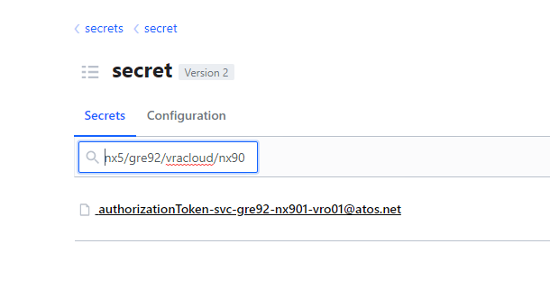

Verify vRA configuration:

- Log in to vRA
- Open Cloud Assembly
- Navigate to Infrastructure -> Projects
- Open a given project and click the Users tab
- Verify that the service account is on the list of users with the Member role
