# Tenant Builder for Multi-tenant vRA On Prem

## Table of Contents

- [Introduction](#introduction)
  - [Purpose](#purpose)
  - [Audience](#audience)
  - [Scope](#scope)
- [Related Documents](#related-documents)
- [Prerequisites](#prerequisites)
  - [Input Date File - *customInfraVars.yml*](#input-date-file---custominfravarsyml)
  - [Create Tenant](#create-tenant)
  - [Other prerequisites](#other-prerequisites)
- [vRA OnPrem Tenant Configuration procedure](#vra-onprem-tenant-configuration-procedure)
  - [Create datastore clusters and storage tags](#create-datastore-clusters-and-storage-tags)
  - [Storage policies creation](#storage-policies-creation)
    - [Default vSAN storage policies creation](#default-vsan-storage-policies-creation)
  - [vRA OnPrem Tenant Assembler configuration](#vra-onprem-tenant-assembler-configuration)
  - [vRA OnPrem Tenant configuration for Regional Secondary site deployment](#vra-onprem-tenant-configuration-for-regional-secondary-site-deployment)
  - [Update default blueprint for secondary sites configuration](#update-default-blueprint-for-secondary-sites-configuration)
  - [IPAM Integration](#ipam-integration)
  - [vRA OnPrem token creation](#vra-onprem-token-creation)
  - [vRA OnPrem token creation for regional Secondary site](#vra-onprem-token-creation-for-regional-secondary-site)
  - [NSX-T components creation](#nsx-t-components-creation)
  - [NSX-T components creation for regional secondary site](#nsx-t-components-creation-for-regional-secondary-site)
  - [Add vCenter Plugin in vRO](#add-vcenter-plugin-in-vro)
  - [Add secondary site vCenter Plugin in vRO](#add-secondary-site-vcenter-plugin-in-vro)
  - [2nd Day policy definition creation](#2nd-day-policy-definition-creation)
  - [Enable SSRs](#enable-ssrs)
    - [Create REST Hosts in VRO](#create-rest-hosts-in-vro)
    - [Create VRO configuration element - SSRConfig](#create-vro-configuration-element---ssrconfig)
    - [Enable Standard SSRs in vRA](#enable-standard-ssrs-in-vra)
  - [vRA OnPrem Tenant Service Broker Configuration](#vra-onprem-tenant-service-broker-configuration)
  - [Enable NSX - T SSRs in vRA](#enable-nsx---t-ssrs-in-vra)
  - [Enable AVI Load Balancer SSRs in vRA](#enable-avi-load-balancer-ssrs-in-vra)
  - [Configure Service Account for VRO](#configure-service-account-for-vro)
  - [Create a schedule to auto rotate vRA refresh token](#create-a-schedule-to-auto-rotate-vra-refresh-token)
- [Post Configuration test](#post-configuration-test)
  
## Changelog

| Date       | Description                    | Author           |
| ---------- | :----------------------------- | :--------------- |
| 2022-10-07 | CESDHC-3825 Initial creation               | Alpesh Kumbhare |
| 2022-10-21 | CESDHC-4365 Added section to add plugins to vro | Prajacta Cerejo |
| 2022-11-04 | CESDHC-4582 Added playbook description for adding the vCenter plugin to vro | Prajacta Cerejo |
| 2023-01-11 | CESDHC-5174 Added playbook and description for regional vRA deployment of secondary site | Arun Sompura |
| 2023-03-09 | CESDHC-6277 Added steps required for enabling Avamar Backup/Restore SSRs | Piotr Lewandowski |
| 2023-03-15 | CESDHC-6609 Added more steps to IPAM integration section | Shilpa Arote |
| 2023-03-24 | CESDHC-6675 Added section "Configure Service Account for VRO" | Piotr Lewandowski |
| 2023-03-30 | VCS-5971 Minor adjustments for VMFS on FC | Adam Wieczorek |
| 2023-04-24 | VCS-9425 Added post configuration test | Alpesh Kumbhare |
| 2023-08-18 | VCS-10492 Update Day2 SSR integration with A/P DR SSRs | Piotr Lewandowski |
| 2023-11-29 | VCS-11515 Added chapter "Create a schedule to auto rotate vRA refresh token" | Marcin Kujawski |
| 2023-12-15 | VCS-10306 improved indentation and updated version matrix pre-requiste | Vani Tatipamula |
| 2024-10-29 | VCS-14239 Updated post configuration tests, resource actions and images | Marcin Kujawski |
| 2024-12-18 | VCS-14542 Update order of service broker configuration and add AVI Load Balancer Day1 SSRs | Marcin Kujawski |
| 2025-04-25 | VCS-15739 Fix link for omniTemplateRenderPlay.yml                                        | Lukasz Bienkowski |
| 2025-12-19 | VCS-17766 Added Work instruction for Tenant Creation | Martin P Mathew |

## Introduction

### Purpose

Configure the default tenant for vRA on-prem in VCS and enable secondary sites if it's a regional vRA deployment.

### Audience

- VCS Operations
- VCS Engineering

### Scope

- Tenant configuration for VCS vRA OnPrem.

## Related Documents

| Document | Description |
| -------- | ----------- |
| [Customer Infra Vars WI](wiCustomerInfraVars.md) | Guidance how to pre-create and fulfil the input data file *$HOME/customerInfraVars.yml* |

## Prerequisites

New tenant creation is partially automated, based on the below playbooks. Similarly enabling secondary sites is also partially automated.

| Playbook name | Description |
| ------------- | ----------- |
|*importGlobalImagesToContentLibrary.yml*| Imports Atos Global Images to workload domain Content Library on the 2nd vCenter |
|*createSpbmPolicy.yml* | Creates storage polices|
|*configureVraOnPremTenant.yml* | Configures default Tenant on vRA OnPrem |
|*configureNsxt.yml*| Deploys and configures NSX-T components based on *customInfraVars.yml* data input file located at user home directory|
|*configure2dayPolicyDefinition.yml*| Creates 2nd day policy definition|
|*configureRestHostsVro.yml*| Creates Avamar and vRA REST Hosts in VRO. Prerequisite for Backup/Restore SSRs|
|*createVroConfig.yml*| Creates the VRO configuration element containing variables required by the Backup/Restore SSRs workflows |
|*createDay2Actions.yml*| creates Backup/Restore SSRs and Active/Passive DR SSR custom resource actions and updates Service Broker 2nd day policy definition |
|*addChangeVmRestartPriorityAction.yml*| Creates 2nd day Change VM restart priority action|
|*configureVraOnPremTenantRegional.yml* | Need to execute only to enable upcoming secondary sites if it is regional deployment model. It Updates default Tenant on vRA OnPrem. Need to execute from secondary site ANS001|
|*configureVraOnPremNsxtRegional.yml*| Need to execute only to enable upcoming secondary sites if it is regional deployment model. Deploys and configures NSX-T components based on *customInfraVars.yml* data input file located at user home directory. Need to execute from secondary site ANS001|

There are two main prerequisites to fulfil before the playbooks may be executed:

- vRA onPrem already deployed using work instruction [wiVraOnPremDeploymentGuide.md](wiVraOnPremDeploymentGuide.md).
- **Input Data File** *$HOME/customerInfraVars.yml* for playbooks must exists
- VRO integrated with GIT repository
- Network traffic allowed between ABX (vRA Cloud) or vRA/VRO (vRA On-Prem) and the Avamar Server on port 443 (TCP)

### Input Date File - *customInfraVars.yml*

The `configureVraOnPremTenant.yml` and the `configureNsxt.yml` playbooks rely on input data file *$HOME/customInfraVars.yml* located in your home directory.

You may use `/opt/dhc/manage/omniTemplateRenderPlay.yml` playbook to create the *$HOME/customInfraVars.yml* file from template.

```bash
ansible-playbook /opt/dhc/manage/omniTemplateRenderPlay.yml
```

Next, the input file have to be **filled out manually**.

Below are mandatory parameters:

| parameter name | description |
| --- | --- |
| workloadDomainNumber | use 01 for the first customer workload domain |
| clusterNumber | use 01 for the first cluster within the customer workload domain |
| displayName | tenant name (it is by default <locationCode>IDM002)|

Below are other mandatory parameters if deployment type is regional vRA deployment and site is secondary site:

| parameter name | description |
| --- | --- |
| primaryTenant | default tenant name of primary site (example GRE92IDM002) |
| masterVraFqdn | primary site vRA fqdn (example gre92vra001.nx5dhc02.next |
| primaryLocationCode | location code of primary site where vRA is deployed (example gre92)|
| domain | domain name of primary site. (example nx5dhc02.next)|

There are many more parameters to satisfy inputs required by `configureNsxt.yml` playbook. Refer to [wiCustomerInfraVars.md](wiCustomerInfraVars.md) document for guidance.

ONLY FOR REGIONAL DEPLOYMENT MODEL AND SECONDARY vRA SITE:

If it is a regional Vra secondary deployment in that case we need to execute this playbook `configureVraOnPremNsxtRegional.yml` for this same document can be referred. There are no other changes required for inputs.
Refer to [wiCustomerInfraVars.md](wiCustomerInfraVars.md) document for guidance.

### Create Tenant

If Tenant is not created yet follow the work instruction [wiCreateNewTenantOnLCM.md](wiCreateNewTenantOnLCM.md)  

### Other prerequisites

Validate whether the version matrix present in /opt/dhc/version-matrix/versionMatrix.json is the correct version for your VCS release.

**NOTE**: As per the new version matrix in VCS, the versionMatrix.json file may not be directly referenced in any playbooks. All interactions with the version matrix must be performed via the dedicated dhc_version_matrix Python module.

## vRA OnPrem Tenant Configuration procedure

Tenant Configuration is partially automated. Similarly update of secondary sites for regional deployment is partially automated as well.

Please proceed with steps below.

### Create datastore clusters and storage tags

**NOTE**: NEED TO BE EXECUTED ON REGIONAL SECONDARY SITES AS WELL IF IT IS A REGIONAL DEPLOYMENT

**NOTE**: Execute only when using external storage solution in workload domain - `principalStorageTypeCmp: "vmfs"`

Before running this playbook make sure that all required datastores are created, connected to all hosts in WD and listed in `customInfraVars` file in `storagePoliciesVmfs` section as described in [wiCustomerInfraVars.md](wiCustomerInfraVars.md).

This playbook will:

- create `StorageClass` category and tags for each storageClass provided in customInfraVars file
- create `StorageReplication` category and tags for replication status - `yes` and/or `no`
- create `StorageProtectedSite` category and `locationCode` tag to indicate datastore`s original site
- create datastore cluster(s) for each storage flavor (storage class and storage replication combination) based on customInfraVars file
- assigned datastore(s) to newly created datastore cluster(s) based on customInfraVars file
- tag all datastores and datastore clusters with appropriate tags from `StorageClass` and `StorageReplication` categories

Playbook necessary input:

- MGMT domain credentials

Login to `ans001` and from `/opt/dhc/manage` run:

   ```shell
   ansible-playbook createVmfsDatastoreClusters.yml
   ```

Once playbook run is finished verify that all datastores and datastore clusters are corectly tagged. Each should have one tag from `StorageClass` category and one tag from `StorageReplication` category.

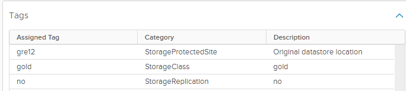

### Storage policies creation

**NOTE**: NEED TO BE EXECUTED ON REGIONAL SECONDARY SITES AS WELL IF IT IS A REGIONAL DEPLOYMENT

- Prepare the inputs for *createSpbmPolicy.yml* playbook. You will need to provide:
  
  - MGMT domain credentials
  - The Compute cluster number (two digits). Default value: 01
  - Storage type of vSAN (af or hd). Default value: af (short cuts means AllFlash or Hybrid)
  - RAID value for storage policies (1 or 5). Default value: 5
  
- Login to *ans001* virtual machine and navigate to `/opt/dhc/manage/` and execute:

  ```shell
  ansible-playbook createSpbmPolicy.yml
  ```

- You may login to *vcs002* vCenter and check if expected storage policies exists.
    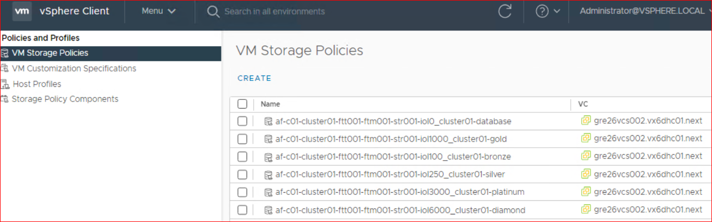

#### Default vSAN storage policies creation

**NOTE**: Execute only when using vSAN as a principal storage type for Workload Domain - `principalStorageTypeCmp: "vsan"`.
Skip this playbook when `principalStorageTypeCmp: "vmfs"` is used for Workload Domain.

We need to create default storage policy with unlimited IOPs in vCenter, also need check if default Gold policy available in vCenter, if not need to create default gold policy. To do so, run the following playbook:
  
  ```yml
    ansible-playbook createDefaultSpbmPolicyVraOnPrem.yml
  ```

- At the prompt you will have to provide:
  - MGMT domain credentials
  - The Compute cluster number (two digits). Default value: 01
  - Storage type of vSAN (af or hd). Default value: af (short cuts means AllFlash or Hybrid)
  - RAID value for storage policies (1 or 5). Default value: 5

### vRA OnPrem Tenant Assembler configuration

**NOTE**: NOT TO EXECUTE ON REGIONAL SECONDARY SITE IF IT IS A REGIONAL DEPLOYMENT

To configure Assembler part on vRA OnPrem Tenant, we need to execute `configureVraOnPremTenant.yml` playbook:

```yml
ansible-playbook configureVraOnPremTenant.yml
```
  
- This playbook will perform below tasks:
  - validate if required inputs were provided, like tenant and project name
  - create bearer token for vra On Prem
  - create NSX-T cloud accounts
  - create vSphere cloud accounts
  - create Cloud Zone for Tenant organization
  - create Project within  Tenant organization
  - creates all image mappings for Tenant
  - creates all flavor mappings for Tenant
  - creates all storage profiles mappings for Tenant
  - assign Compute tags within  Tenant organization
  - add vRA role access to VCS groups
  - add vRA role access to customer groups (Optional)
  - creates vRA Subscriptions and Actions for Custom name
  - prompt for next action to do execution of NSX-T configuration

### vRA OnPrem Tenant configuration for Regional Secondary site deployment

**NOTE**: NEED TO BE EXECUTED ONLY ON REGIONAL SECONDARY SITES IF IT IS A REGIONAL DEPLOYMENT

Firstly, Below Playbook to be executed to create and fetch token from primary site vRA using primary site domain credentials and storing the token under local (secondary) site vault at this location /secrets/secret/customerCode/locationCode/servers/<primarySiteLocationCode>vra001/tenant org/

```yml
ansible-playbook createVraOnPremAuthTokenRegional.yml
```

You will be prompted to provide the following inputs:

Enter VCS management domain username e.g.: `a123456@exampledomain.com`\
Your input: Your Active Directory domain username\
Enter the password for the user domain. Please note that the password you enter will not be displayed on the screen.\
Your input: Your Active Directory domain password\
Enter regional vRA username e.g.: `a123456@exampledomain.com`:\
Your input: Primary site Active Directory domain password where vRA is hosted\
Enter regional vRA domain e.g.:exampledomain.com:\
Your input: e.g.:primaryDomain.com:\
Please enter the name of the tenant organization, i.e. GRE42IDM002\
Your input: tenant organization name

Once playbook execution is finished please double check that all data provided is saved successfully in Hashi Corp Vault Password Manager. Login to Vault using LDAP option and navigate through secrets path to find credentials you are looking for. In this case it would be /secrets/secret/customerCode/locationCode/servers/<primarySiteLocationCode>vra001/tenant org/

There must be an entry with your Active Directory username suffix `authorizationToken-aXXXXXX`.

Valid tenant token in the Hashi is mandatory for the playbooks used next in this work instruction. You may use *createVraOnPremAuthTokenRegional.yml* playbook again to regenerate it.

To configure secondary site with Default vRA OnPrem Tenant, we need to execute configureVraOnPremTenantRegional.yml playbook

```yml
ansible-playbook configureVraOnPremTenantRegional.yml
```
  
- This playbook will perform below tasks-
  - validate if required inputs were provided, like tenant and project name
  - create NSX-T cloud accounts for secondary sites
  - create vSphere cloud accounts for secondary sites
  - create Cloud Zone for Tenant organization for secondary sites
  - update Project within Tenant organization to attach secondary sites zone to project
  - update all image mappings in default Tenant for secondary sites
  - update all flavor mappings in default Tenant for secondary sites
  - update all storage profiles mappings in default Tenant for secondary sites
  - assign Compute tags within  Tenant organization for secondary sites
  - validate vRA Subscriptions and Actions for Custom name for secondary sites
  - prompt for next action to do execution of NSX-T configuration for secondary sites

### Update default blueprint for secondary sites configuration

Currently blueprint modification for secondary sites is being done manually with the given step by step instructions while we are working on automation of same.
Here is the workinstructions [here](<wiTenantBuilderVraOnPremRegionalBlueprint.md>)

### IPAM Integration

**NOTE**: NO NEED TO EXECUTED THIS FOR REGIONAL SECONDARY SITE AS THIS IS ALREADY DONE DURING PRIMARY SITE TENANT CONFIGURATION IN REGIONAL DEPLOYMENT MODEL
  
  As there are no API available, we need to do IPAM integration manually. You can obtain package *.zip* file from */opt/binaries* on control host, or by downloading it from marketplace - links to specific versions can be found [here](<https://docs.vmware.com/en/vRealize-Automation/8.6/Using-and-Managing-Cloud-Assembly/GUID-ADD9C0D7-328C-4DAD-BC83-9C0F5656FE98.html>).

>Follow the below steps to import provider package into vRA OnPrem.

- Download appropriate IPAM provider package .zip file (you can find valid version in VCS versionMatrix).
- Logon to VMware vRA OnPrem and select "Cloud Assembly".
- Select `Infrastructure > Connections > Integrations` and click `Add Integration`.
- Click `IPAM`.
- Provide name as 'hostname-IPAM'.
- Click `Manage IPAM Providers`.
  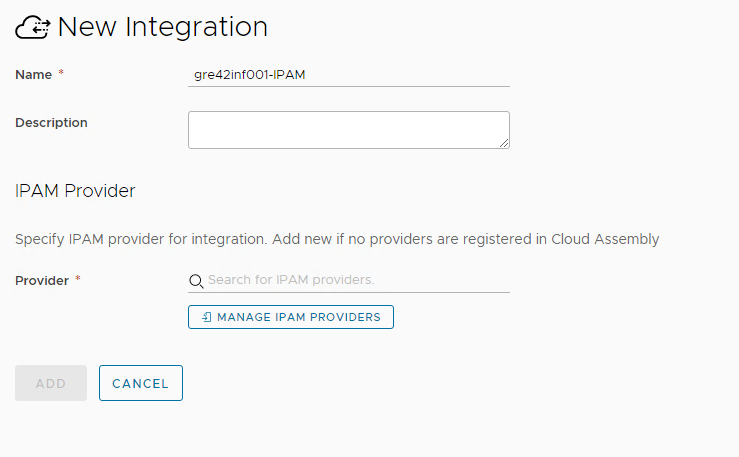
- Click `Import Provider Package`, navigate to the downloaded provider package .zip file, and select it. Once uploaded, you can close the window.
  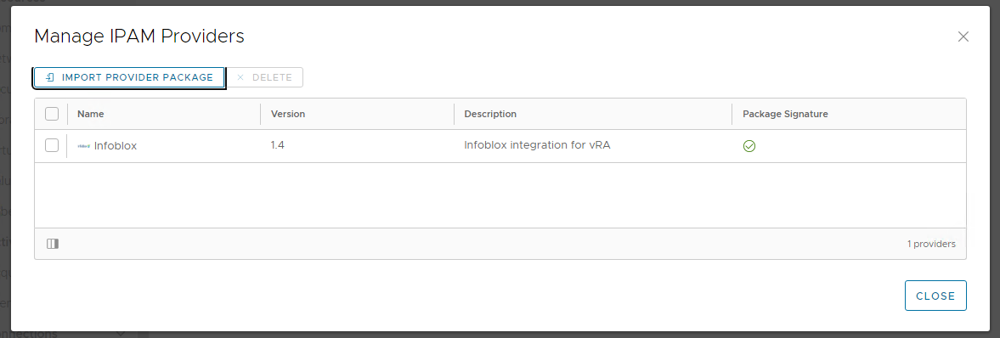
- Provide following details:
  - username : automation
  - passwords: copy password from hashi vault for automation user stored under infoblox server name
  - hostname: inf001 server name
  - properties: keep default
  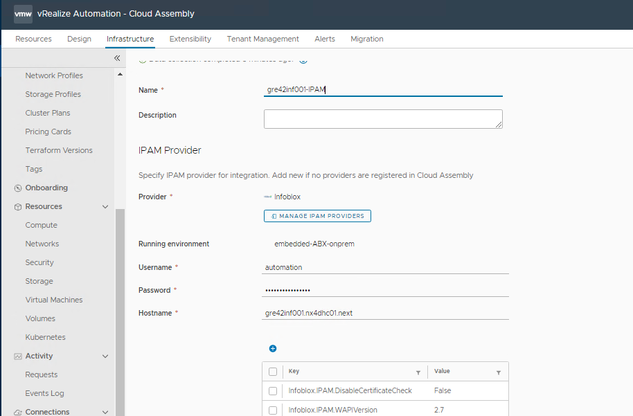
- Click on 'validate'.
- Once validation is successful. Click on 'Save' button.

### vRA OnPrem token creation

**NOTE**: NEED TO BE EXECUTED ONLY ON PRIMARY OR STANDALONE VRA DEPLOYMENT BECAUSE FOR REGIONAL DEPLOYMENT MODEL SECONDARY SITES THERE IS A SEPARATE PLAYBOOK CREATED.

- Create and Save a vRA OnPrem token

  This task will automatically generate an authorization token for vRA OnPrem and save it into Hashi Corp Vault Password Manager. Since the tokens are based on individual user accounts, each token will be stored as a separate entry in Hashivault, with a username appended to each entry ( the username of a user executing the playbook). The token will be visible only to this particular user. This Hashi Vault entry will be valid for 1 day.

In order to proceed please execute the playbook:

```yml
 ansible-playbook createVraOnPremAuthToken.yml
```

You will be prompted to provide the following inputs:\
Enter VCS management domain username e.g.: `a123456@exampledomain.com`\
Your input: Your Active Directory domain username\
Enter the password for the user domain. Please note that the password you enter will not be displayed on the screen.\
Your input: Your Active Directory domain password\
Please enter the name of the tenant organization, i.e. GRE42IDM002\
Your input: tenant organization name

Once playbook execution is finished please double check that all data provided is saved successfully in Hashi Corp Vault Password Manager. Login to Vault using LDAP option and navigate through secrets path to find credentials you are looking for. In this case it would be /secrets/secret/customerCode/locationCode/servers/<locationCode>vra001/tenant org/

There must be an entry with your Active Directory username suffix `authorizationToken-aXXXXXX`.

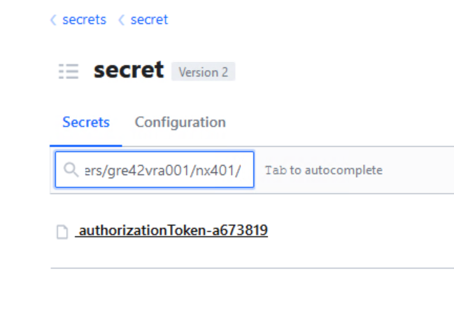

Valid tenant token in the Hashi is mandatory for the playbooks used next in this work instruction. You may use *createVraOnPremAuthToken.yml* playbook again to regenerate it.

### vRA OnPrem token creation for regional Secondary site

**NOTE**: NEED TO BE EXECUTED ONLY ON REGIONAL SECONDARY SITES IF IT IS A REGIONAL DEPLOYMENT

- Create and Save a vRA OnPrem token on regional secondary site

  This task will automatically generate an authorization token for vRA OnPrem hosted on primary site and save it into Hashi Corp Vault Password Manager of secondary (local) site. Since the tokens are based on individual user accounts, each token will be stored as a separate entry in Hashivault, with a username appended to each entry ( the username of a user executing the playbook). The token will be visible only to this particular user. This Hashi Vault entry will be valid for 1 day.

In order to proceed please execute the playbook:

```yml
ansible-playbook createVraOnPremAuthTokenRegional.yml
```

You will be prompted to provide the following inputs:

Enter VCS management domain username e.g.: `a123456@exampledomain.com`\
Your input: Your Active Directory domain username\
Enter the password for the user domain. Please note that the password you enter will not be displayed on the screen.\
Your input: Your Active Directory domain password\
Enter regional vRA username e.g.: `a123456@exampledomain.com`:\
Your input: Primary site Active Directory domain password where vRA is hosted\
Enter regional vRA domain e.g.:exampledomain.com:\
Your input: e.g.:primaryDomain.com:\
Please enter the name of the tenant organization, i.e. GRE42IDM002\
Your input: tenant organization name\

Once playbook execution is finished please double check that all data provided is saved successfully in Hashi Corp Vault Password Manager. Login to Vault using LDAP option and navigate through secrets path to find credentials you are looking for. In this case it would be /secrets/secret/customerCode/locationCode/servers/<primarySiteLocationCode>vra001/tenant org/

There must be an entry with your Active Directory username suffix `authorizationToken-aXXXXXX`.


Valid tenant token in the Hashi is mandatory for the playbooks used next in this work instruction. You may use *createVraOnPremAuthTokenRegional.yml* playbook again to regenerate it.

### NSX-T components creation

**NOTE**: DO NOT EXECUTE ON REGIONAL SECONDARY SITES AS WE HAVE SEPARATE PLAYBOOK FOR REGIONAL DEPLOYMENT OF SECONDARY SITE IN NEXT STEP

- Configure SDN for the new tenant

    This step is automated by the `configureNsxt.yml` playbook, however as described in the Prerequisites section, it requires the template file to be filled in properly. If this is done, run the playbook:

    ```bash
    ansible-playbook configureNsxt.yml
    ```

   >**IMPORTANT**: After a newly created NSX-T segment is visible on vRA OnPrem side, there is a need to add IP ranges to Network profile manually. Currently this process cannot be automated due lack of public API from vRA OnPrem. Please follow [wiVraInfobloxIntegration](wiVraInfobloxIntegration.md) work instruction for every added network.

### NSX-T components creation for regional secondary site

**NOTE**: NEED TO BE EXECUTED ONLY ON REGIONAL SECONDARY SITES IF IT IS A REGIONAL DEPLOYMENT

- Configure SDN for the new tenant

    This step is automated by the `configureVraOnPremNsxtRegional.yml` playbook, however as described in the Prerequisites section, it requires the template file to be filled in properly. If this is done, run the playbook:

    ```bash
    ansible-playbook configureVraOnPremNsxtRegional.yml
    ```

   >**IMPORTANT**: After a newly created NSX-T segment is visible on vRA OnPrem side, there is a need to add IP ranges to Network profile manually. Currently this process cannot be automated due lack of public API from vRA OnPrem. Please follow [wiVraInfobloxIntegration](wiVraInfobloxIntegration.md) work instruction for every added network. Also follow [wiServiceBrokerNetworkUpdate](wiServiceBrokerNetworkUpdate.md) work instruction for update in service broker form.

### Add vCenter Plugin in vRO

**NOTE**: DO NOT EXECUTE ON REGIONAL SECONDARY SITES AS WE HAVE SEPARATE PLAYBOOK FOR REGIONAL SECONDARY SITE IN NEXT STEP
  
  This section will add cmp vCenter Plugin to vRO
  
  ```bash
  ansible-playbook configureVroAddVcenterInstanceVraOnPrem.yml
  ```
  
  Once playbook execution is finished please check if the vCenter plugin is added in the vro Inventory.

### Add secondary site vCenter Plugin in vRO

**NOTE**: TO BE EXECUTED ON REGIONAL SECONDARY SITES ONLY IF IT IS A REGIONAL DEPLOYMENT
  
  This section will add cmp vCenter Plugin to vRO
  
  ```bash
  ansible-playbook configureVroAddVcenterInstanceVraOnPremRegional.yml
  ```
  
  Once playbook execution is finished please check if the vCenter plugin is added in the vro Inventory.
  
### 2nd Day policy definition creation

**NOTE**: DO NOT EXECUTE ON REGIONAL SECONDARY SITES AS THIS IS ALREADY DONE AS A PART OF PRIMARY SITE TENANT CONFIGURATION

- To configure 2day action SSRs policy definitions on Service Broker (vRA OnPrem) execute:

    ```bash
    ansible-playbook configureVraOnPremDay2Policy.yml
    ```

You may validate policy definitions by login to `vRA Service Broker -> Content&Policies -> Policies -> Definitions`

  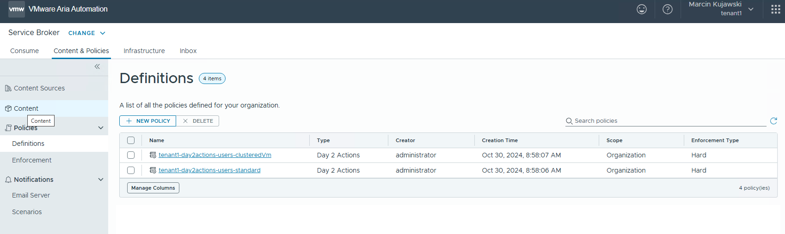
  
### Enable SSRs

Enabling the SSRs is automated by Ansible playbooks and includes the following steps:

- create Avamar and vRA REST Hosts in VRO
- create VRO Configuration element (SSRConfig)
- create backup & restore custom resource actions in Cloud Assembly
- create 'Manage DR A/P Protection' Day2 action for a given tenant in vRA (only when VCS is configured with Active/Passive DR and VSAN storage)
- update the Service Broker day2 policy definition
  
#### Create REST Hosts in VRO

Execute the **configureRestHostsVro.yml** playbook on ans001 server. Please note that valid Tenant Organization Token (generated as per steps mentioned in section Create and Save tenant organization Token of this document) must be available in Hashi vault before executing this playbook.

 ```yml
ansible-playbook configureRestHostsVro.yml
 ```

You will be prompted to provide the following inputs:

- VCS management Active Directory domain username i.e. `a123456@exampledomain.com`
- Your Active Directory domain password
- Tenant name
- Avamar server FQDN, i.e. gre92ave001.exampledomain.com

Once playbook execution is finished please double check that the REST Hosts have been successfully created. Login to vRA, open Orchestrator, navigate to the Inventory and verify that the Avamar and VRA REST Hosts are present.
  
Example:

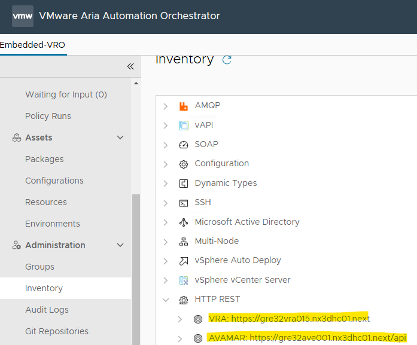

#### Create VRO configuration element - SSRConfig

This step will create the **SSRConfig** configuration Element in VRO, containing all the variables required by workflows used for executing the Avamar Backup & Restore SSRs.

Execute the **createVroConfig.yml** playbook on ans001 server. Please note that valid Tenant Organization Token (generated as per steps mentioned in section Create and Save tenant organization Token of this document) must be available in Hashi vault before executing this playbook.

 ```yml
ansible-playbook createVroConfig.yml
 ```

You will be prompted to provide the following inputs:

- VCS management Active Directory domain username i.e. `a123456@exampledomain.com`
- Your Active Directory domain password
- Tenant name

Once playbook execution is finished please double check that the Configuration element has been successfully created and all variables are filled in correctly. Login to vRA, open Orchestrator, navigate to the (Assets) Configurations and click on the SSRConfig file under Configrations/DHC/.

Example:

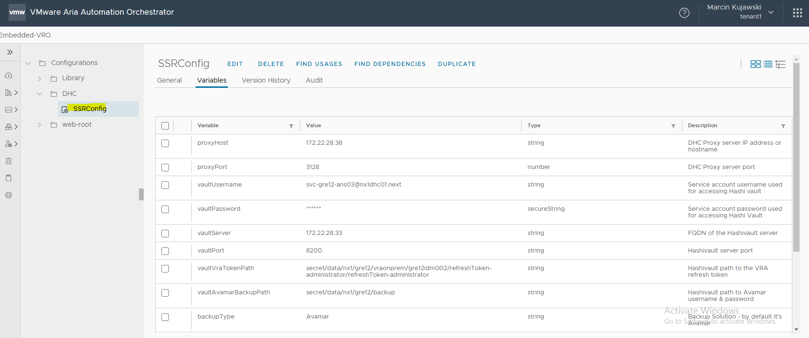

#### Enable Standard SSRs in vRA

This step will cover the following tasks:

- create 'Manage Avamar VM Backup Policy' Day2 action for a given tenant in vRA
- create 'Avamar Backup On-Demand' Day2 action for a given tenant in vRA
- create 'Avamar Backup Restore' Day2 action for a given tenant in vRA
- create 'Networker Backup On-Demand' Day2 action for a given tenant in vRA
- create 'Networker Backup Restore' Day2 action for a given tenant in vRA
- create 'Change Disk Storage Class' Day2 action for a given tenant in vRA
- create 'Manage DR A/P Protection' Day2 action for a given tenant in vRA (only when VCS is configured with Active/Passive DR and VSAN storage)
- create 'Change VM Restart Priority' Day2 action for a given tenant in vRA (only when VCS is configured with Active/Active DR and VSAN storage)
- update Service Broker policies definitions with the new Day2 actions

Execute the **createDay2Actions.yml** playbook on ans001 server. Please note that valid Tenant Organization Token (generated as per steps mentioned in section Create and Save tenant organization Token of this document) must be available in Hashi vault before executing this playbook.

 ```yml
ansible-playbook createDay2Actions.yml
 ```

You will be prompted to provide the following inputs:

- VCS management Active Directory domain username i.e. `a123456@exampledomain.com`
- Your Active Directory domain password
- Tenant name

Once playbook execution is finished please double check that the custom resource actions have been successfully created in Assembler and the day2 policy definition has been updated with the new actions.

Login to vRA, open Assembler, click the **Design** tab and navigate to **Resouce Actions**. Verify that all actions are present.

Example:

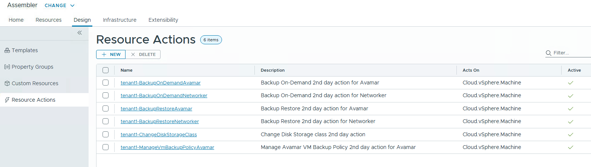

Switch to the Service Broker service, click the **Content & Policies** tab, navigate to Policies -> Definitions and select the standard day2 actions policy. Verify that it contains the newly added actions.

Example:

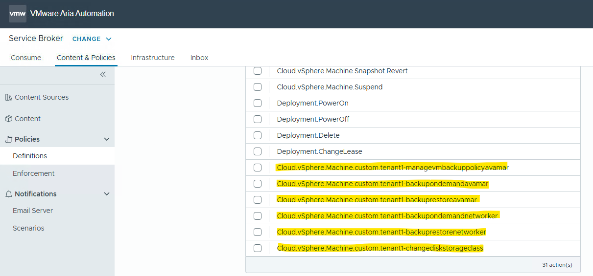

### vRA OnPrem Tenant Service Broker Configuration

**NOTE**: NOT TO EXECUTE ON REGIONAL SECONDARY SITE IF IT IS A REGIONAL DEPLOYMENT

To configure Service Broker part on vRA OnPremTenant, we need to execute `configureServiceBroker.yml` playbook:

```yml
ansible-playbook configureServiceBroker.yml
```

- This playbook will perform below tasks:
  - import 3 blueprints within Tenant organization (Windows, RHEL, SuSE)
  - release blueprints for Service Broker form within Tenant organization
  - create content source for blueprint templates within Tenant organization
  - create content sharing policy within Tenant organization (includes blueprints content sources only)
  - import custom form as well as custom icon and CSS style file into Service Broker Day1 Catalog items within Tenant organization

### Enable NSX - T SSRs in vRA

> Note: This chapter is optional. Implementation of NSX-T SSRs is dedicated for Customers, who wants to manage microsegmentation for their workloads within vRA Portal themselves.

To enable NSX-T SSRs for a given tenant in vRA On Prem, we need to execute `createNsxtSsrsBroker.yml` playbook:

```yml
ansible-playbook createNsxtSsrsBroker.yml
```

This playbook will perform below tasks:

- create resource role in domain to mamange NSX-T SSR access on Service Broker
- sync vIDM to discover new AD group
- create refresh and bearer token for vra On Prem
- create content source for vRO workflows within Tenant organization
- create content sharing policy within Tenant organization
- import custom form into Service Broker Catalog items within Tenant organization
- import custom CSS style file into Service Broker Catalog items within Tenant organization

You will be prompted to provide the following inputs:

- VCS management Active Directory domain username i.e. `a123456@exampledomain.com`
- Your Active Directory domain password
- Tenant name

Once playbook execution is finished please double check that NSX-T SSRs have been successfully created in Service Broker.

Log in to vRA portal and check in Service Broker whether:

- you can see SSRs in Catalog
  
  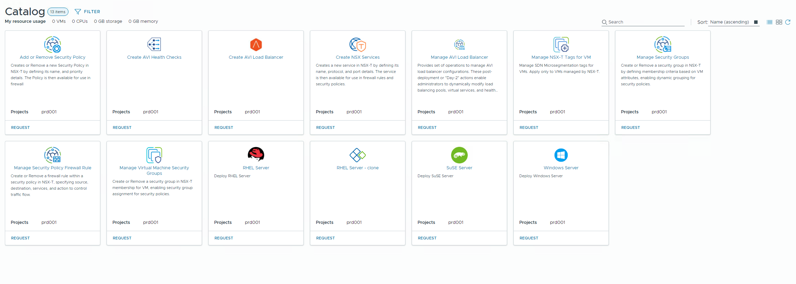

- you can see prd001-workflows in Content Sources  
  
  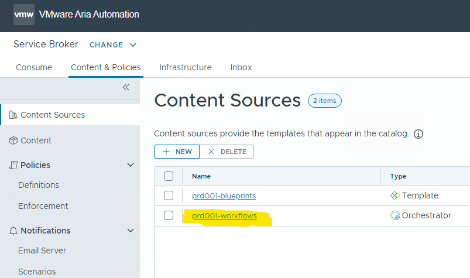

- you can see {{ tenantName }}-nsx-contentSharing in Policies Definitions
  
  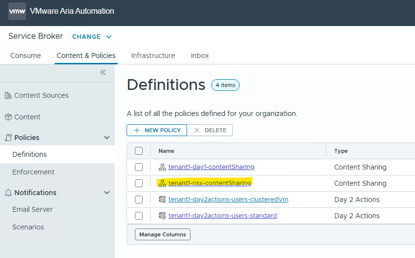

- you can see Content Sharing policy configured with specific NSX-T SSR Active Directory group
  
  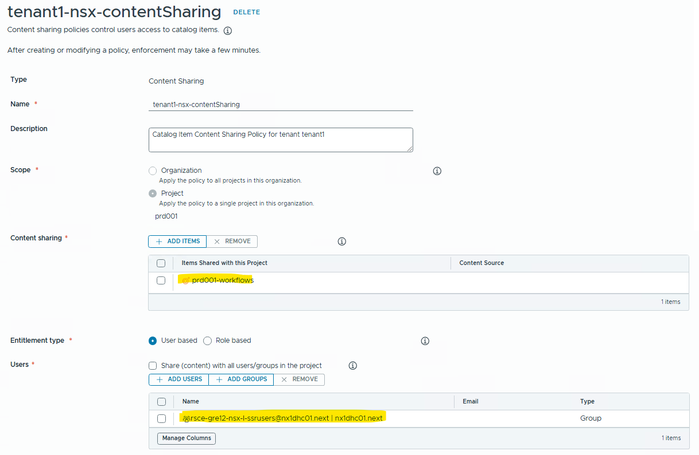

NSX-T SSR's also require a dedicated NSX-T infrastructure to be deployed, including dynamic group memberships based on tags and the corresponding Distributed Firewall rules.

To achieve this, please execute the playbook.

```yml
createPredefinedSecurityGroupNsxtMicrosegmentation.yml -e "nsxProject=tenantName"
```

The "nsxProject" variable is corresponding to tenant name which can be found in *$HOME/customInfraVars.yml*. `NSX Project` name must be the same as `Aria Autoamtion Tenant` name - this is prerequsit to SRRs working properlly.

To confirm that the playbook was executed successfully, please navigate to:

`NSX -> Tenant/Project -> Security -> Distributed Firewall -> Environment`

and verify the existence of the predefined policy ('predefinedSgIcmp') along with the corresponding firewall entries, as shown in the example below.

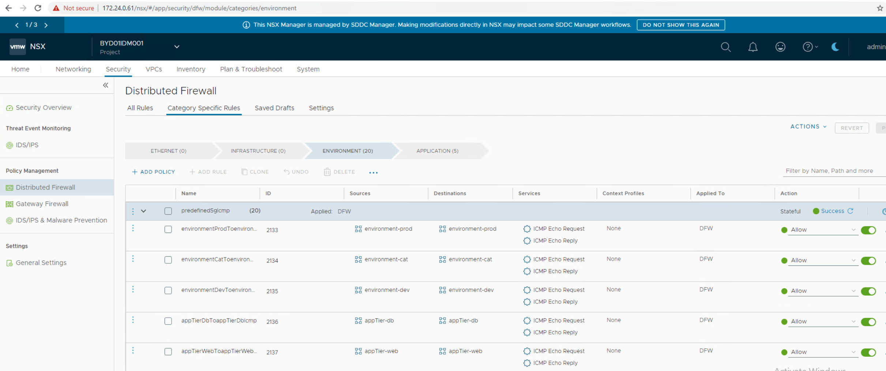

### Enable AVI Load Balancer SSRs in vRA

> Note: This chapter is optional. Implementation of AVI Load Balancer SSRs is dedicated for Customers, who wants to manage load balancers for their workloads within vRA Portal themselves.

To enable AVI Load Balancer SSRs for a given tenant in vRA On Prem, we need to execute `createAviLbSsrsBroker.yml` playbook:

```yml
ansible-playbook createAviLbSsrsBroker.yml
```

The "nsxProject" variable is corresponding to tenant name which can be found in *$HOME/customInfraVars.yml*. `NSX Project` name must be the same as `Aria Autoamtion Tenant` name - this is prerequsit to SRRs working properlly.

This playbook will perform below tasks:

- create refresh and bearer token for vra On Prem
- create two blueprint templates for AVI Load Balancer on Assembler (one for AVI Load Balancer create and another for Healthcheck)
- update content source for blueprints within Tenant organization
- create/update content source for vRO workflows within Tenant organization
- create content sharing policy within Tenant organization
- import custom form into Service Broker Catalog items within Tenant organization
- import custom CSS style file into Service Broker Catalog items within Tenant organization

You will be prompted to provide the following inputs:

- VCS management Active Directory domain username i.e. `a123456@exampledomain.com`
- Your Active Directory domain password
- Tenant name

Once playbook execution is finished please double check that AVI Load Balancer SSRs have been successfully created in Service Broker.

Log in to vRA portal and check in Service Broker whether:

- you can see AVI SSRs in Catalog
  
  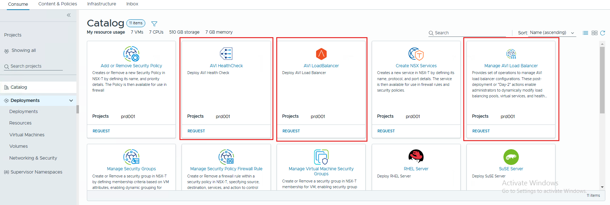

- you can see prd001-workflows in Content Sources with "Manage AVI Load Balancer" item
  
  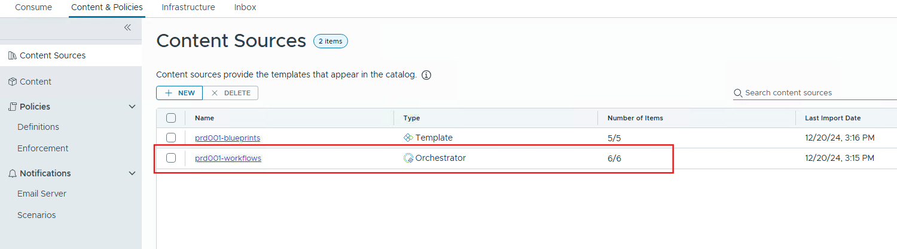

  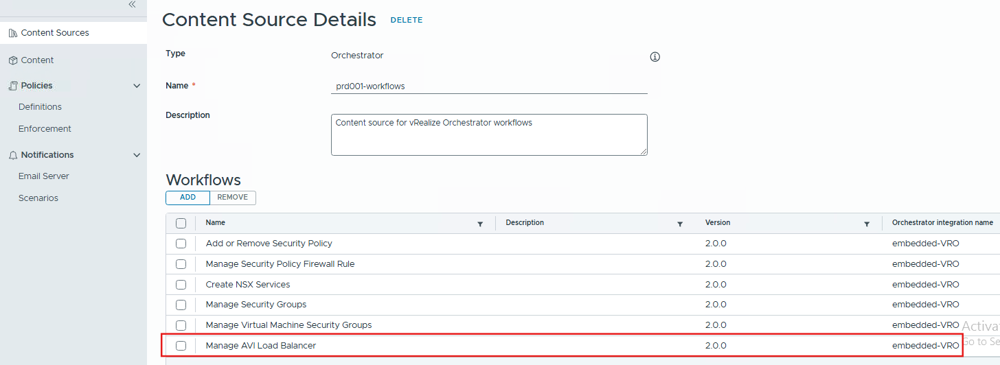

- you can see Content Sharing Policies Definition
  
  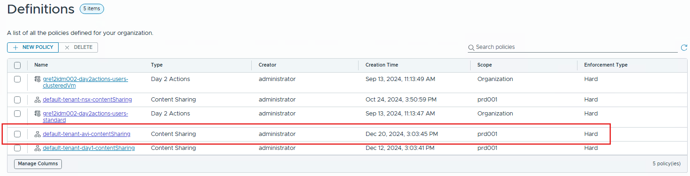

### Configure Service Account for VRO

This step is automated with an Ansible playbook, which covers the following actions:

- create a VRO Active Directory service account (vRA On-Prem only)
- generate an API refresh token for the service account and add it to Hashivault
- add service account to vRA project as the member

Execute the **createAndIntegrateVroServiceAccount.yml** playbook on ans001 server. Please note that valid Tenant Organization Token (generated as per steps mentioned in section [vRA OnPrem token creation](#vra-onprem-token-creation) of this document) must be available in Hashi vault before executing this playbook.

 ```yml
ansible-playbook createAndIntegrateVroServiceAccount.yml
 ```

You will be prompted to provide the following inputs:

- VCS management Active Directory domain username i.e. `a123456@exampledomain.com`
- Your Active Directory domain password
- Tenant name
- vRA Project Name
- serviceAccountNumber (two digits)

Once playbook execution is finished please double check that the service account has been successfully added to Hashivault and vRA project.

Log in to Hashivault and navigate to Secrets -> {customerCode} -> {locationCode} -> vraonprem -> {tenantName} and verify that there is an entry for the VRO service account:

Example:

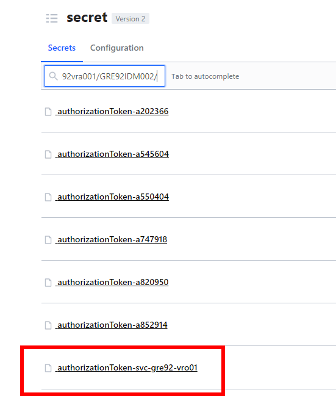

Verify vRA configuration:

- Log in to vRA
- Open Assembler
- Navigate to Infrastructure -> Projects
- Open a given project and click the Users tab
- Verify that the service account is on the list of users with the Member role

Example:

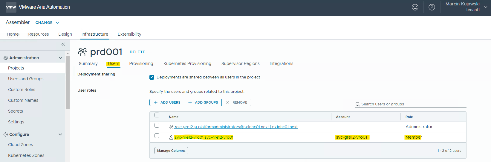

### Create a schedule to auto rotate vRA refresh token

>Note: This chapter is applicable only to Customers who are using Service Standard Requests (SSRs) with vRA/vRO service account.
>Please skip this chapter for non SSR Customer.

This step will create new schedule in VRO to execute auto rotate process for vRA refresh token, which is by default expiring each 90 days.

1. Log in to vRO
2. Navigate to *Library* -> *Workflows*
3. Go to *Workflows* -> *DHC* -> *2Day Actions* and select `dhcRotateVraToken` workflow
4. On top, click *Schedule*
5. Provide following details while creating a new schedule:
   - **Name**: `vRA Onprem - rotate token`
   - **Description**: `Run workflow to auto-rotate the vRA token for service account used for SSRs.`
   - **Start**: select currecnt date and time
   - **Start if in the past**: `No`
   - **Schedule**: `Every Month` (1st day)
   - **End**: no end date
   - **vraUsername**: `svc-<locationCode>-vro01`
6. Click *Save*

Example:

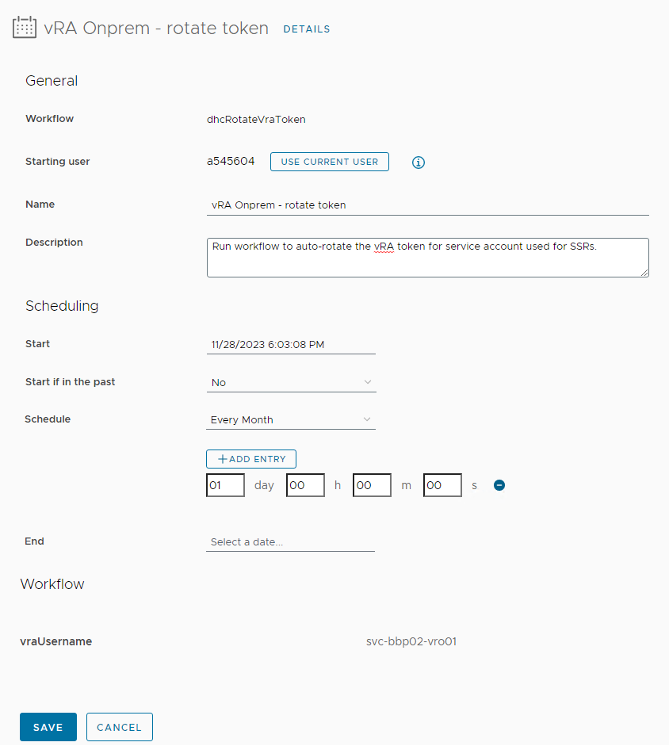

### vRA OnPrem Tenant Service Broker configuration

**NOTE**: NOT TO EXECUTE ON REGIONAL SECONDARY SITE IF IT IS A REGIONAL DEPLOYMENT

To configure Service Broker part on vRA OnPremTenant, we need to execute `configureServiceBroker.yml` playbook:

```yml
ansible-playbook configureServiceBroker.yml
```

- This playbook will perform below tasks:
  - import 3 blueprints within Tenant organization (Windows, RHEL, SuSE)
  - release blueprints for Service Broker form within Tenant organization
  - create content source for blueprint templates within Tenant organization
  - create content source for vro workflows within Tenant organization
  - create content sharing policy within Tenant organization (includes all content sources)
  - import custom form as well as custom icon and CSS style file into Service Broker Catalog item within Tenant organization

## Post Configuration test
  
After all configuration is done, post configuration test need to be performed as below -  
  
- Login to vRA on-prem and navigate to **Service Broker**:
  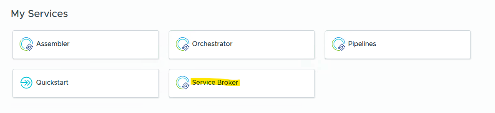
- **Day1** catalog items will be available there, click on **Request** for any kind (RHEL/SuSE/Windows):
  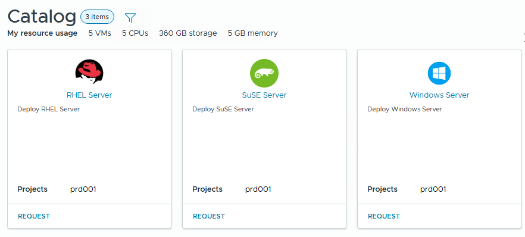
- Provide all details and fill the request form. Click **Submit** to start server provisioning:
 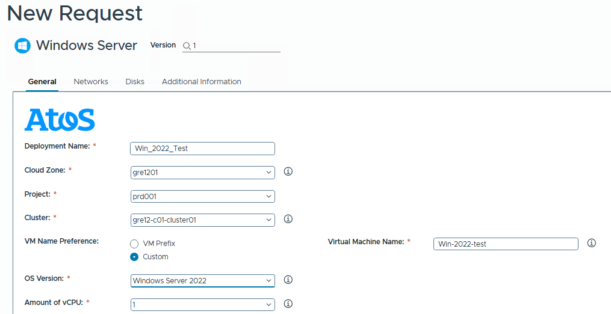
- Navigate to **Deployments**.
- Click on **Deployments**.
- You should see a new deployment in progress there. Completion of that deployment confirms that vRA on-prem is working fine.
 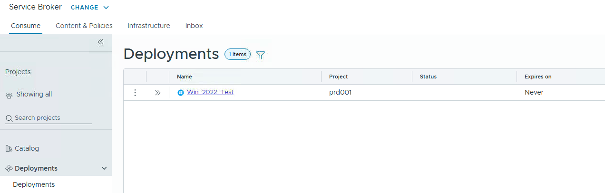
