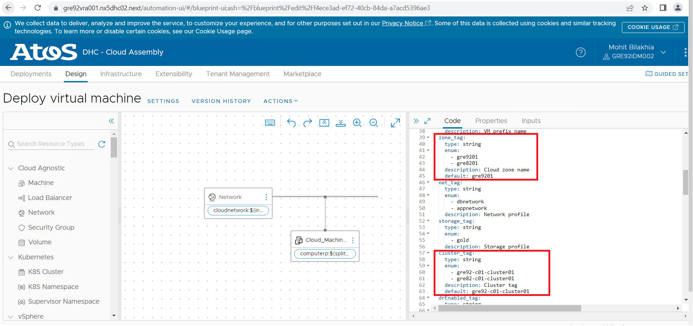
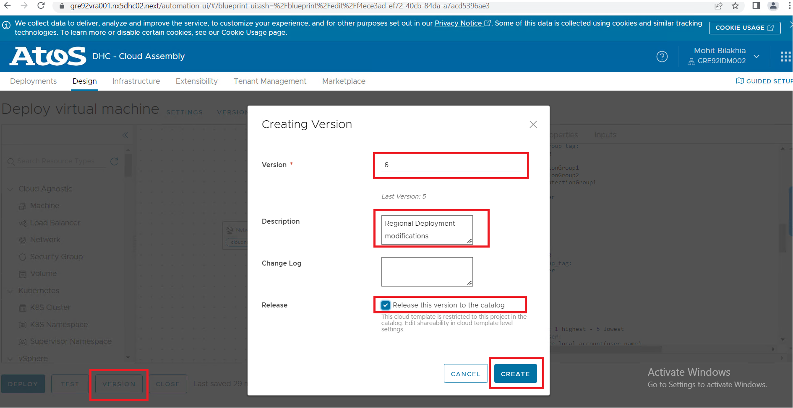
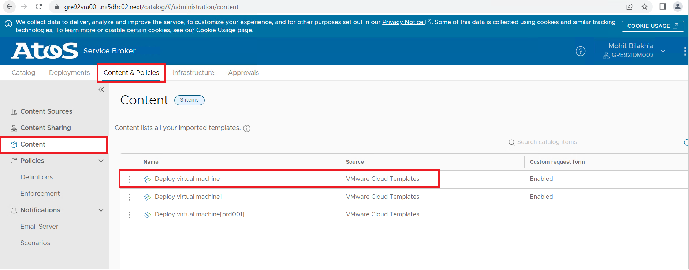
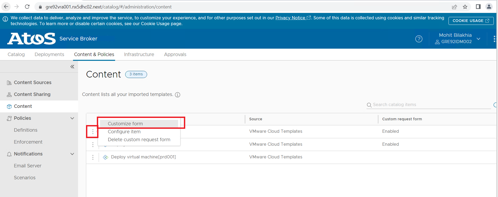
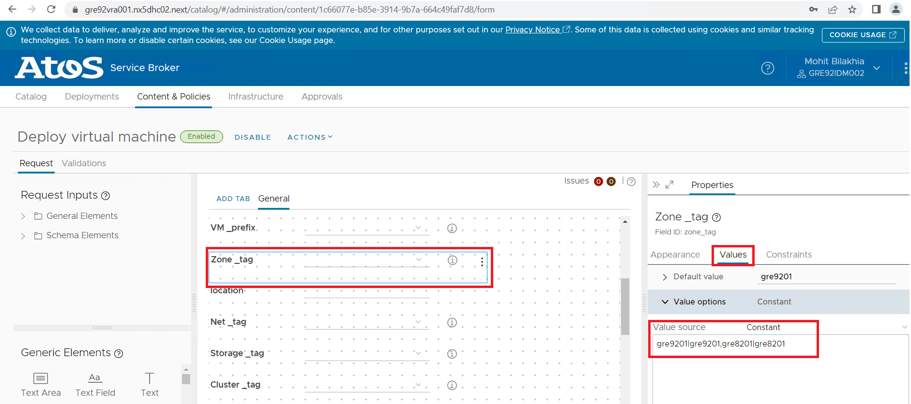
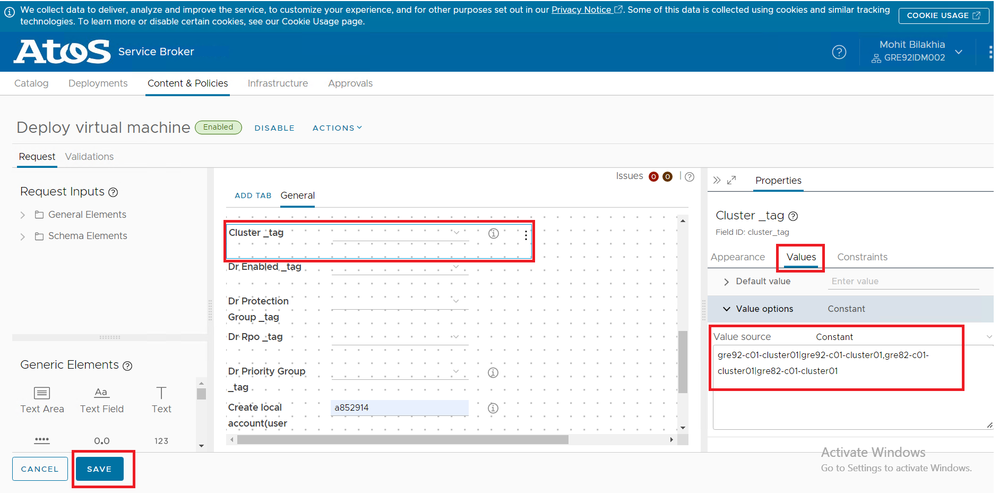
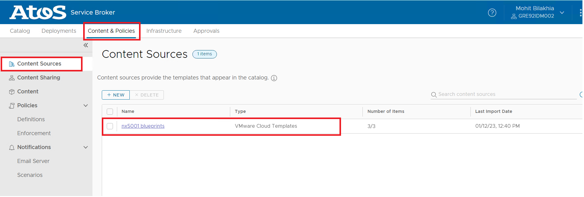
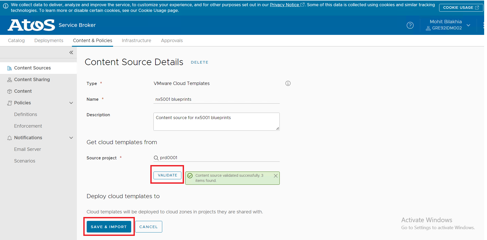

# Modify Blueprint for Regional Deployment of vRA OnPrem

# Table of Contents

- [Modify Blueprint for Regional Deployment of vRA OnPrem](#modify-blueprint-for-regional-deployment-of-vra-onprem)
- [Table of Contents](#table-of-contents)
- [Changelog](#changelog)
  - [Introduction](#introduction)
    - [Purpose](#purpose)
    - [Audience](#audience)
    - [Scope](#scope)
- [Prerequisites](#prerequisites)
- [Blueprint Modifications in primary site vRA for Regional Secondary Site](#blueprint-modifications-in-primary-site-vra-for-regional-secondary-site)

# Changelog

| Date | TOS | Issue | Author | Description |
|------|-----|-------|--------|-------------|
| 12.01.2023 | | CESDHC-5174 | Mohit Bilakhia | Added info related to Blueprint modifications for Regional deployment of vRA OnPrem |

## Introduction

### Purpose

Modify the Cloud Assembly blueprint for regional deployment of vRA on-prem.

### Audience

- VCS Operations

### Scope

- Manual modifications in primary site Blueprint for Regional Deployment of vRA OnPrem.

# Prerequisites

vRA OnPrem for Regional Secondary Site(s) Deployment must be executed successfully.

# Blueprint Modifications in primary site vRA for Regional Secondary Site

1. Login to the vRA, Select Cloud Assembly and Open the Default Blueprint example:- **Deploy virtual machine**

2. In the code section, append the seconday sites zone and cluster in input of **zone_tag** and **cluster_tag**.

3. Publish the Blueprint to a new version as per below.
    Click on Version Button
    Keep the default version number
    Enter Description according to the changes made
    Please select the checkbox for release the version to catalog

4. Once Version is published, Go to the **Service Broker** Option from the main menu.

5. Select **Content & Policies** tab and then select **Content** option. You can see the default blueprint name present in the table.

6. Besides Blueprint name, click on three dots and select **Customize form** option

7. A complete, service broker form will be visible. Select **Zone_tag** field and in **Values** tab, need to add secondary zone values in value options.

8. Similarly, just as zone_tag is updated, need to update **Cluster_tag** field and then **Save**

9. Once form update is done, in Content & Policies, select Content Sources and select **Cloud Templates**

10. Once Cloud Template is opened, click on **validate** button and then click on **Save & Import**

