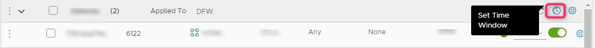
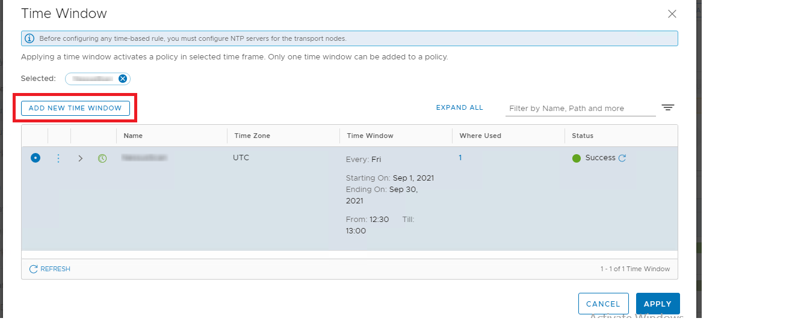
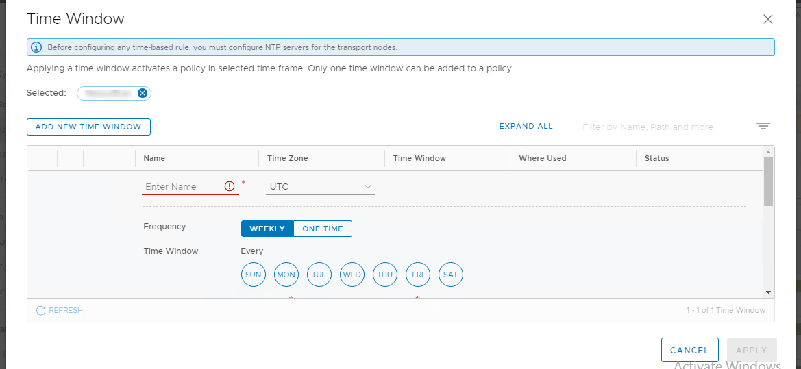
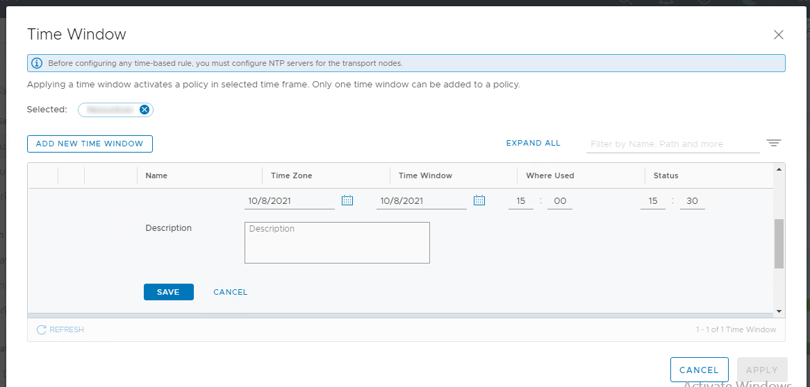
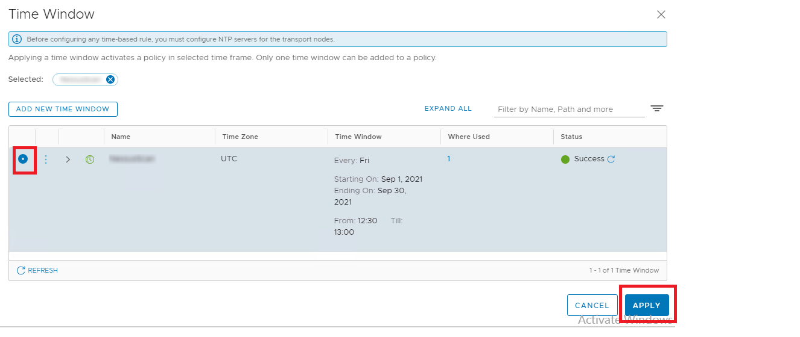
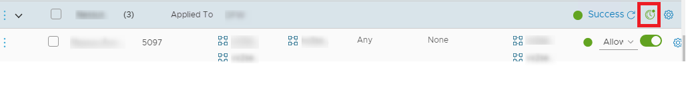

# Time-Based Firewall Policy

- [Time-Based Firewall Policy](#time-based-firewall-policy)
- [Changelog](#changelog)
  - [Introduction](#introduction)
    - [Purpose](#purpose)
    - [Audience](#audience)
    - [Scope](#scope)
- [Pre checks](#pre-checks)
- [Procedure](#procedure)

# Changelog

| version | Date       | Description   | Author(s)           |
| ------- | ---------- | ------------- | ------------------- |
| 0.1     | 08-10-2021 | Initial Draft | Bhalchandra Gavhane |

## Introduction

Policy of DFW have an option viz. Set Time Window, wherein the Policy rule will get applied for a particular time frame and gets disabled after the schedule is over.  
The Set Time Window will be configured to a firewall Policy and the same will get applied to firewall rules under it.

### Purpose

Configure Time-based firewall rule in NSX-T Distributed Firewall (DFW).

### Audience

- VCS Operations

### Scope

The work instruction is intended to cover below tasks:

1. Validate NTP configuration
2. Set Time Window configuration for a Policy of Distributed Firewall.

# Pre checks

Following are the prerequisites to configure Time-based firewall rule in Distributed firewall:

- NTP service must be running on each transport node when using time-based rule publishing. NTP must be configured and synced for below components:
  - NTP configuration for NSX Manager
  - NTP configuration for All NSX Nodes.
  - NTP configuration for ESXi Hosts.

# Procedure

Following is the process to configure Set Time Window for a Firewall Policy:

1. Login to NSX-T > Security > Distributed Firewall.
2. Select a Policy  
3. Click the clock icon on the firewall policy you want to have a time window. A time window appears.

4. Click **Add New Time Window**.

5. Enter Name, Time Zone, select Frequency, Day, Period (Start date and end date), Time and Description.

6. Save the changes.
7. Select the Time Window you want to apply for Policy and click Apply.

8. Click Publish.
9. The clock icon for the section turns green.

10. After the rules are deployed, enforcement as per time window, is instantaneous.
