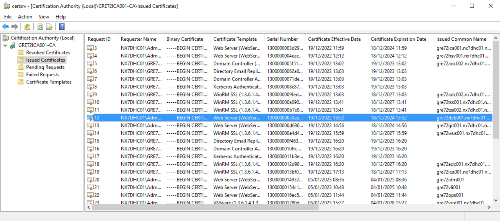
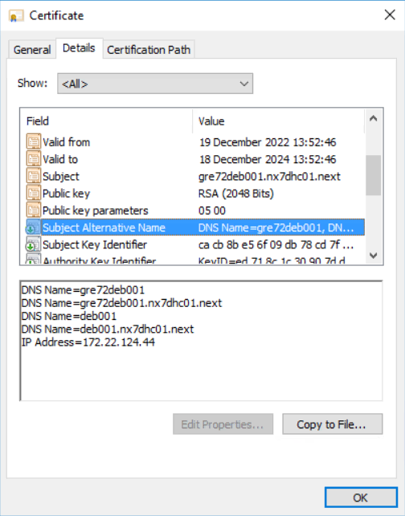
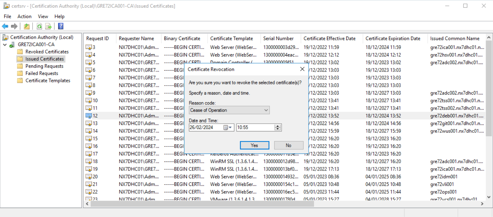

# Updating Certificates

## Table of Contents

- [Updating Certificates](#updating-certificates)
  - [Table of Contents](#table-of-contents)
  - [Changelog](#changelog)
  - [Introduction](#introduction)
    - [Purpose](#purpose)
    - [Audience](#audience)
    - [Scope](#scope)
  - [About the playbook](#about-the-playbook)
  - [Verifying the existing certificate](#verifying-the-existing-certificate)
    - [Locating the certificate](#locating-the-certificate)
    - [Collecting information about the certificate](#collecting-information-about-the-certificate)
  - [Running the playbook](#running-the-playbook)
    - [LCM environments certificates](#lcm-environments-certificates)
    - [Custom certificates](#custom-certificates)
  - [Verifying the new certificate - ICA](#verifying-the-new-certificate---ica)
  - [Replacing the certificate](#replacing-the-certificate)
    - [LCM environments](#lcm-environments)
    - [HashiCorp Vault (hsv001)](#hashicorp-vault-hsv001)
    - [Ubuntu DEB Packages Repository (deb001)](#ubuntu-deb-packages-repository-deb001)
    - [GitLab (git001)](#gitlab-git001)
  - [Verifying the new certificate - after replacing it](#verifying-the-new-certificate---after-replacing-it)
  - [Cleanup](#cleanup)
    - [LCM](#lcm)

## Changelog

| Version | Date       | Description               | Author(s)            |
| ------- | ---------- | ------------------------- | -------------------- |
| 0.1     | 26.02.2024 | VCS-12271 Initial version | Stanislaw Kilanowski |
| 0.2     | 24.04.2026 | VCS-18435 Importing SSL Certificates for Nessus | Kanchan Pardeshi |

## Introduction

### Purpose

- Executing the updateCertificates.yml playbook.
- Replacing the existing certificates of selected servers.

### Audience

- VCS Engineers
- VCS Operations

### Scope

This document covers the following steps:

- Veryfing existing certificate
- Creating new certificate
- Replacing certificate
- Revoking certificate

## About the playbook

Playbook updateCertificates.yml allows the user to create and sign new certificates in ICA and import them into LCM (for predefined LCM environments). This playbook is designed for updating Web Server certificates and it was not tested with other certificate templates.

## Verifying the existing certificate

> **Note:** This step can be skipped when updating certificates for LCM environments.

Before running the playbook, you should check how the previous certificate was created. For this purpose, please RDP to ICA server and open **Certification Authority**. Navigate to **Issued Certificates** and locate the certificate for your server.



### Locating the certificate

The following steps can be used to find your certificate:

1. If it's a Web Server certificate, you can open an HTTPS connection to the server for which you want to update the certificate and click the icon on the left side of the address bar to verify connection details. Click on the button to check whether the connection is secure and from there you should be able to open the existing certificate. Note down the expiration date or the serial number.

2. In the Certification Authority there's a column on the right side with the server names called **Issued Common Name**. You can order the entries by this column to find your server by name and identify the certificate by its expiration date or the serial number.

### Collecting information about the certificate

Once you located the certificate for your server double click it, switch to the **Details** tab and note the following details:

- **Subject** field (Common Name)
- **Subject Alternative Name** field (DNS Names and IP Address)



## Running the playbook

> **Note:** Before running the playbook, make sure that the CertReq.exe process is not running on ICA. If it is, the playbook will get stuck. Please open the Task Manager on ICA and look for it in the expanded view. If the process is there, validate if anyone else is using it at the moment. If not, you can stop the process.

When you're running the playbook, you should use proper tags to control which certificates you're renewing. Without any tags, the playbook will be executed for all LCM environments.

### LCM environments certificates

The playbook is fully automated for tools that have LCM environments. Please use the following command for specific tools:

```shell
ansible-playbook updateCertificates.yml --tags <toolTag>
```

Where `<toolTag>` is any or multiple of: **vrli, vrops, vidm, vrni, vra**

After the playbook is completed, you can find the new certificates in LCM. Please proceed to the next step in this WI to learn how to replace them.

### Custom certificates

If you want to renew certificate for another server, you'll need to use the "custom" tag. Please run the following playbook:

```shell
ansible-playbook updateCertificates.yml --tags custom
```

You will be prompted for the certificate details you collected in the previous step. Please follow the instructions on the screen. After the playbook is completed, you can find the new certificate and it's private key on the Ansible server in `/tmp/new-certs`.

#### Importing SSL Certificates for Nessus

Once the custom playbook is executed for Nessus with all the parameters as specified, run the following command to import the SSL private key, server certificate, and CA certificate. This will replace the existing certificates and activate the new SSL configuration for the Nessus web interface:

```shell
/opt/nessus/sbin/nessuscli import-certs --serverkey=/home/next/ssl/{{ ansible_hostname }}.key --servercert=/home/next/ssl/{{ ansible_hostname }}.crt --cacert=/home/next/ssl/cacert.crt
```

Note: Replace {{ ansible_hostname }} with the appropriate certificate file name for your server.

## Verifying the new certificate - ICA

> **Note:** This step can be skipped when updating certificates for LCM environments.

After the playbook is completed it is recommended to verify if the new certificate has been created correctly and if the details you collected previously are the same as for the old certificate. Please follow the steps from **Verifying existing certificates** section to find it in ICA.

## Replacing the certificate

In this section you can find details how to replace the certificates on the most common tools. Please make sure to create snapshots for the servers.

### LCM environments

Please log in to the LCM GUI and navigate to **Locker**. In the **Certificates** tab you can find the certificates that are currently used and the ones imported by the playbook. The latter can be identified by a dash and a timestamp after the server name.

Click on the menu on the right side of an old certificate that you want to replace (identified by a green check mark in the **In Use** column) and select **Replace**. Follow the steps:

- Select the environment where the certificate is used,
- Select the new certificate,
- Select all products to retrust,
- Opt-in for Snapshot if available,
- Run Precheck - accept the Certificate rollback consent and check if the certificate validation has passed.

Afterwards an LCM request will begin. Be aware that the tools may be rebooted during the process. When it's completed you can observe that the new certificate has the green check mark in the Locker.

### HashiCorp Vault (hsv001)

**Before any activity it is important that you note down the HSV unseal keys!** Operations Team Lead of VCS DevSecOps has access to them.

Please log in to the HSV server as a root user. Validate if the certificate and private key are present in the following directory:

```shell
ls /etc/opt/vault/certificate
```

You should see `cert.pem` and `key.pem` files. Open them in a text editor and paste the new certificate and private key, including the header and footer (`BEGIN/END` `CERTIFICATE/PRIVATE KEY`).

Then please run the following command. Afterwards you'll have to access HSV GUI and provide 3 unseal keys.

```shell
systemctl restart vault.service
```

### Ubuntu DEB Packages Repository (deb001)

Please log in to the DEB server as a root user. Validate if the certificate and private key are present in the following directory:

```shell
ls /etc/apache2/ssl
```

> **Note:** The certificate path can be found in the file /etc/apache2/sites-available/repository.conf under the fields "SSLCertificateFile" and "SSLCertificateKeyFile".

You should see `<locationCode>deb001.crt` and `<locationCode>deb001.key` files. Open them in a text editor and paste the new certificate and private key, including the header and footer (`BEGIN/END` `CERTIFICATE/PRIVATE KEY`).

Then please run the following command:

```shell
service apache2 restart
```

### GitLab (git001)

Please log in to the GIT server as a root user. Validate if the certificate and private key are present in the following directory:

```shell
ls /etc/gitlab/ssl
```

You should see `<locationCode>git001.crt` and `<locationCode>git001.key` files. Open them in a text editor and paste the new certificate and private key, including the header and footer (`BEGIN/END` `CERTIFICATE/PRIVATE KEY`).

Then please run the following commands:

```shell
gitlab-ctl hup nginx
gitlab-ctl hup registry
```

## Verifying the new certificate - after replacing it

If you replaced a Web Server certificate, you can validate if the process was successful by accessing the tool from a browser. Please follow steps as in the respective part of **Locating the certificate** section and you can similarly check the expiration date or the serial number.

> **Note:** You may need to clear cookies or open an incognito/private window in the browser to see the changes.

## Cleanup

If you're confident that the new certificate is working or if the old certificate is already expired, you can perform the following steps to revoke the old certificate in ICA. After this step the certificate will no longer be visible in the expiring certificates report.

Please RDP to ICA server and open **Certification Authority**. Navigate to **Issued Certificates** and locate the old certificate for your server. Right click on it and select **Revoke Certificate** from **All Tasks**. In the pop-up window, please select the reason ("Cease of Operation" if expiring) and confirm.

Be aware that a certificate cannot be unrevoked unless the reason "Certificate Hold" is selected.



### LCM

The old certificates can be removed from LCM GUI. Please navigate to **Locker** and open the **Certificates** tab. Click on the menu on the right side of the certificate that you want to remove, select **Delete** and confirm.
