# Update Password Policy

## Changelog

|    Date    |   Issue   | Author | Description |
|------------|-----------|--------|-------------|
| 07.02.2025 | VCS-14925 | Stanisław Kilanowski | Document creation |
| 14.05.2025 | VCS-15963 | Stanisław Kilanowski | Corrected configuration of Ubuntu servers |

## Introduction

### Purpose

Implement the new VCS password policy on VCS management servers and test if password rotation works as expected.

### Audience

- VCS Engineers
- VCS Operations

### Scope

This document covers configuring the following items:

- Local accounts on Linux servers
- Local accounts on Windows servers
- Windows Active Directory accounts
- ESXi hosts
- vCenter Servers
- SDDC Manager
- NSX Managers
- NSX Edges

## VCS Password Policy

The latest VCS password policy lists the following requirements:

| Password parameter | Value |
| ------------------ | ----- |
| Minimum number of characters | 15 |
| Maximum expiration interval | 90 days or 180 day with MFA |
| Number of not reusable most recent passwords | 13 |
| Lockout threshold | 10 failed attempts |
| Must follow complexity requirements | TRUE |

## Configuration - manual

> [!IMPORTANT]
> Remember to create VM snapshots in advance of making any changes.

### Local accounts on Linux servers

The following steps need to be performed on each Ubuntu server. They require superuser permissions.

#### Pre-implementation

1. Make backups of the existing configuration:

    ```shell
    cp /etc/login.defs /etc/login.defs_BACKUP
    cp /etc/pam.d/common-auth /etc/pam.d/common-auth_BACKUP
    cp /etc/pam.d/common-password /etc/pam.d/common-password_BACKUP
    ```

2. Register the existing configuration:

    ```shell
    cat /etc/login.defs | grep PASS_MAX_DAYS
    cat /etc/pam.d/common-auth
    cat /etc/pam.d/common-password
    ```

#### Implementation

Update the following files:

1. `/etc/login.defs`

    Find the parameter `PASS_MAX_DAYS` and set its value to 90:

    ```apacheconf
    # Password aging controls:
    #
    # PASS_MAX_DAYS Maximum number of days a password may be used.
    # PASS_MIN_DAYS Minimum number of days allowed between password changes.
    # PASS_WARN_AGE Number of days warning given before a password expires.
    #
    PASS_MAX_DAYS 90
    ...
    ```

2. `/etc/pam.d/common-auth`

    Add the following line at the beginning of the "Primary" block:

    ```shell
    # here are the per-package modules (the "Primary" block)
    auth    required                        pam_faillock.so preauth even_deny_root deny=10 unlock_time=900
    ...
    ```

    Add the following lines at the beginning of the "fallback" block:

    ```shell
    # here's the fallback if no module succeeds
    auth    [default=die]                   pam_faillock.so authfail even_deny_root deny=10 unlock_time=900
    auth    sufficient                      pam_faillock.so authsucc even_deny_root deny=10 unlock_time=900
    ...
    ```

3. `/etc/pam.d/common-password`

    Update the line with pam_pwquality.so module, by adding the parameters: `minlen=15 enforce_for_root`

    Add the following line directly above pam_unix.so module (should be second in order, right after pam_pwquality.so):

    ```shell
    password        required                pam_pwhistory.so use_authtok remember=13 enforce_for_root
    ```

    In the end the whole configuration should look as follows:

    ```shell
    # here are the per-package modules (the "Primary" block)
    password        requisite                       pam_pwquality.so retry=3 minlen=15 enforce_for_root
    password        required                        pam_pwhistory.so use_authtok remember=13 enforce_for_root
    password        [success=2 default=ignore]      pam_unix.so obscure use_authtok try_first_pass yescrypt
    password        sufficient                      pam_sss.so use_authtok
    # here's the fallback if no module succeeds
    password        requisite                       pam_deny.so
    # prime the stack with a positive return value if there isn't one already;
    # this avoids us returning an error just because nothing sets a success code
    # since the modules above will each just jump around
    password        required                        pam_permit.so
    # and here are more per-package modules (the "Additional" block)
    ```

Validate if the file `/etc/security/opasswd` exists and has correct permissions:

```shell
ls -l /etc/security/opasswd
```

If it's not owned by root (`root:root`) or allows more than read and write for owner (`-rw-------`), execute the following:

```shell
chown root:root /etc/security/opasswd
chmod 600 /etc/security/opasswd
```

Lastly, update password expiration time for the root and next accounts:

```shell
chage -M 90 root
chage -M 90 next
```

#### Post-implementation

To test the changes, run the following playbook on Ansible Core VM. It will rotate passwords for local accounts on Linux servers:

```shell
ansible-playbook rotatePassword.yml -e executionOption=linux
```

### Local accounts on Windows servers

#### Pre-implementation

The following steps need to be performed on each Windows server.

1. Open the Command Prompt as administrator and execute the command:

    ```bat
    gpresult /h C:\gpresult_pre.html
    ```

2. Open the created report and look for "Account Policies" section. Note down the "Winning GPO". There should be only one used by all servers.

    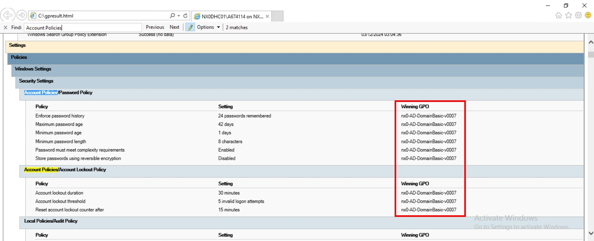

#### Implementation

The following steps need to be performed on one of the Active Directory Controller servers, e.g. `<locationCode>adc001`.

1. Open `gpmc.msc` (Group Policy Management Console).
2. On the menu, navigate to **Forest** -> **Domains** -> **`Domain name`**.
3. Right click on the name of the policy found earlier and click Edit.

    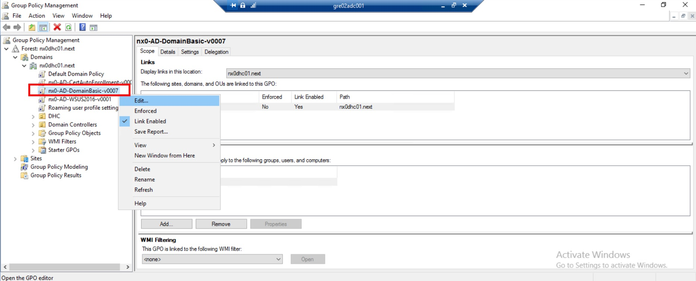

4. On the menu, navigate to **Computer Configuration** -> **Policies** -> **Windows Settings** -> **Security Settings** -> **Account Policies**.
5. Modify the highlighted entries in **Password Policies** and **Account Lockout Policy**.

    > **Note**
    >
    > "Minimum password length" is configured as 14 characters instead of 15. That's because the minimum length greater than 14 isn't supported at this time.

    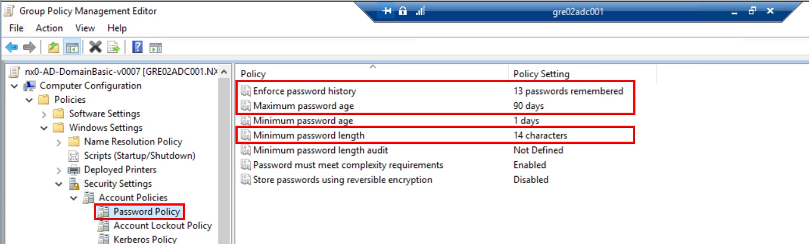

    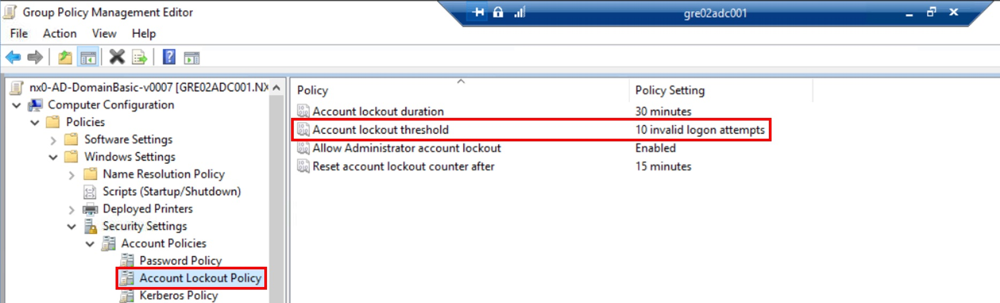

    > **Note**
    >
    > When prompted, you will need to accept suggested changes to "Allow Administrator account lockout" in order to update the "Account lockout threshold".

    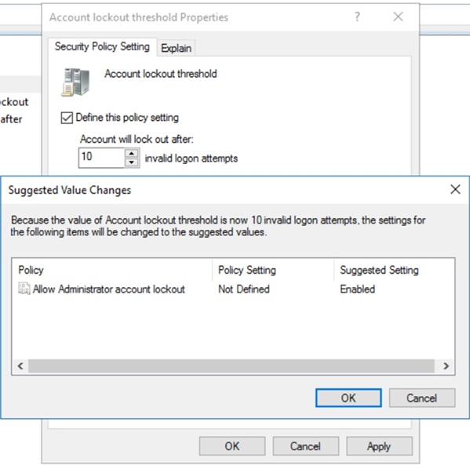

6. Open the Command Prompt and execute the commands:

    ```bat
    gpupdate /force
    repadmin /syncall /AdeP
    repadmin /replsummary
    ```

    Validate if the sync finished with no errors.

#### Post-implementation

The following steps need to be performed on each Windows server.

1. Open the Command Prompt and execute the commands:

    ```bat
    gpupdate /force
    gpresult /h C:\gpresult_post.html
    ```

2. Open the created report and look for "Account Policies" section. Validate if the new policy settings are effective.

    > **Note**
    >
    > You can also validate it by opening `secpol.msc`, navigating to **Account Policy**, and verifying settings under **Password Policy** and **Account Lockout Policy**.

To test the changes, run the following playbook on Ansible Core VM. It will rotate passwords for local accounts on Windows servers:

```shell
ansible-playbook rotatePassword.yml -e executionOption=c-kathos
```

### Windows Active Directory accounts

#### Pre-implementation

1. Open PowerShell as administrator and execute the command:

    ```powershell
    Get-ADFineGrainedPasswordPolicy -Filter *
    ```

2. Note down the "Name" field.

    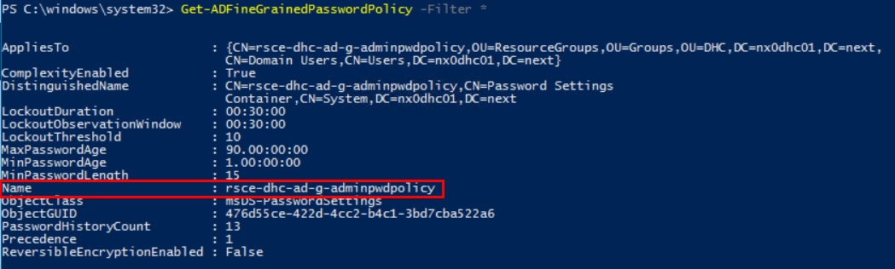

#### Implementation

The following steps need to be performed on one of the Active Directory Controller servers, e.g. `<locationCode>adc001`.

1. Open the **Active Directory Administrative Center**.
2. On the menu, navigate to **`Domain name`** -> **System** -> **Password Settings Container**.

    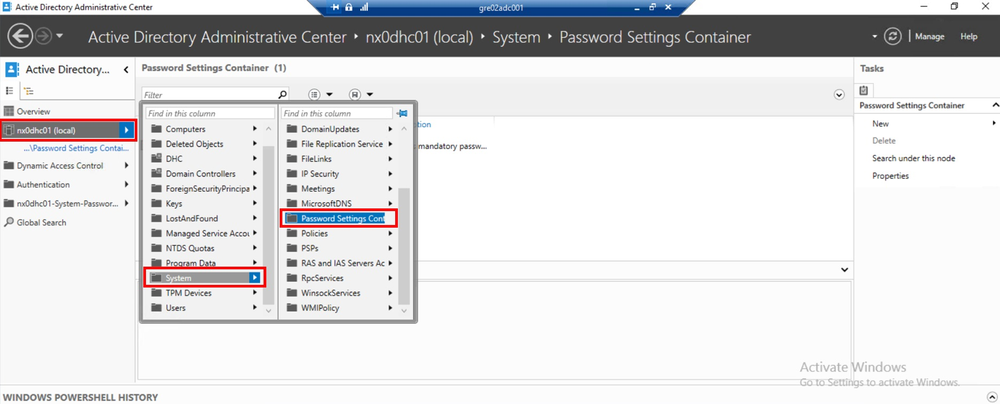

3. Locate on the list the policy noted down in a previous step. Right click on it and select "Properties".

    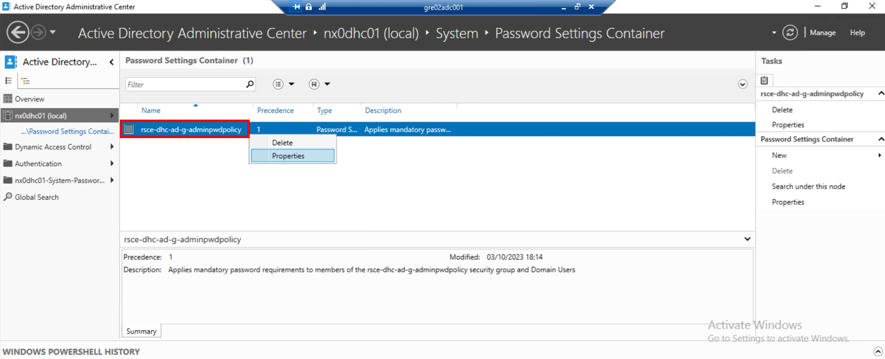

4. Modify the highlighted entries and save the changes.

    > **Note**
    >
    > "Maximum password age" should be set to 90 days, however due to contractual obligations, Siemens locations need to stay with 42 days configured.
    >
    > In the highlighted section "Directly Applies To", the group "Domain Users" should be added.

    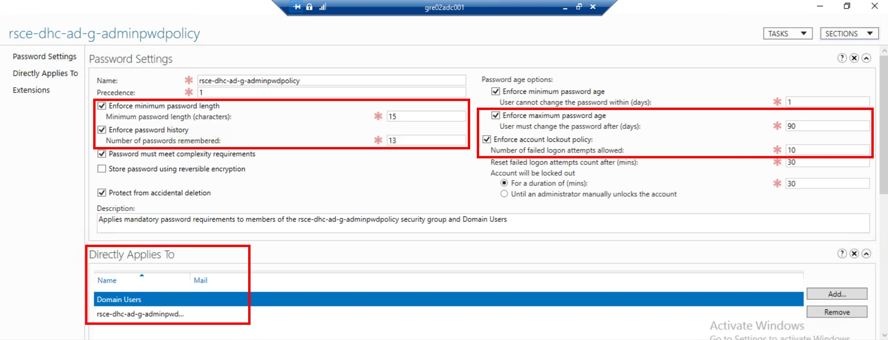

#### Post-implementation

Open PowerShell as administrator and execute the command:

```powershell
Get-ADFineGrainedPasswordPolicy -Filter *
```

Validate if the new policy settings are effective.

### ESXi hosts

> **Note**
>
> These steps can be performed automatically, as described in the section [Configuration - using PowerShell modules](#esxi-hosts-1)

In order to access the password policy for local **root** accounts, the following steps need to be performed for each ESXi host:

1. Log in to the vCenter Server using an administrator account.
2. From **Hosts and Clusters** view select the ESXi host.
3. Open the **Configure** tab and navigate to **System** -> **Advanced System Settings**.

    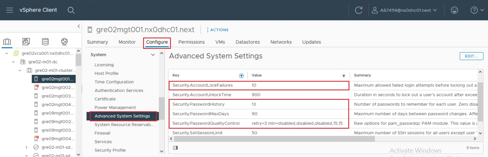

> [!TIP]
> In the next sections you can filter by **Key** and the phrase `Security` to quickly identify all entires.

#### Pre-implementation

Note down the highlighted fields:

- Security.AccountLockFailures
- Security.PasswordHistory
- Security.PasswordMaxDays
- Security.PasswordQualityControl

#### Implementation

1. Edit the **Advanced System Settings**.
2. Update the highlighted fields (noted down earlier) and click **OK**.

    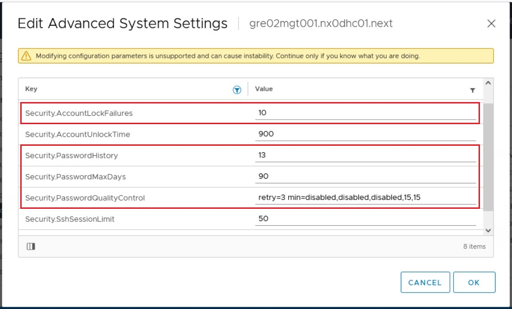

#### Post-implementation

Repeat steps from the pre-implementation.

To test the changes, run the following playbook. It will rotate passwords for root accounts on ESXi hosts:

```shell
ansible-playbook resetSddcManagerManagedPasswords.yml -e entityTypes='ESXI'
```

### vCenter Servers

> **Note**
>
> These steps can be performed automatically, as described in the section [Configuration - using PowerShell modules](#vcenter-servers-1)

In order to access the password policy for `administrator@vsphere.local` account:

1. Log in to the vCenter Server using `administrator@vsphere.local`.
2. From the menu on the top select **Administration**.

    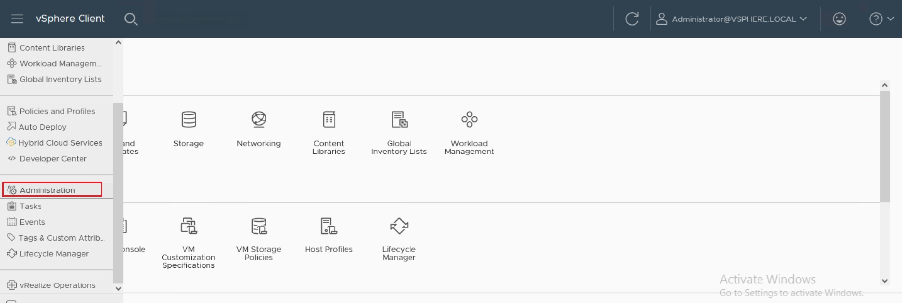

3. Navigate to: **Single Sign On** -> **Configuration** -> **Local Accounts**.

    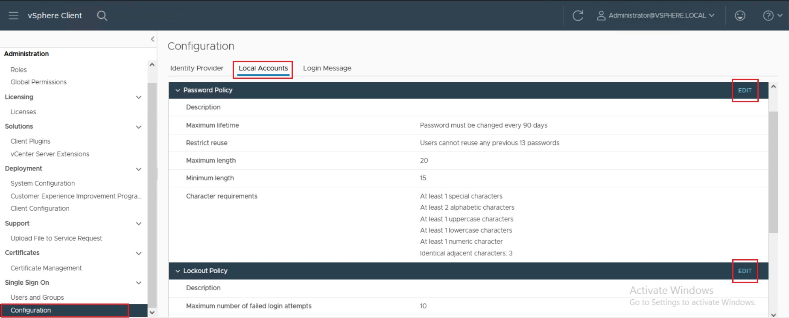

#### Pre-implementation

Note down the settings under the **Password Policy** and **Lockout Policy** sections.

#### Implementation

1. Edit the **Password Policy**: modify the highlighted entries, validate that the character requirements are in place and save the changes.

    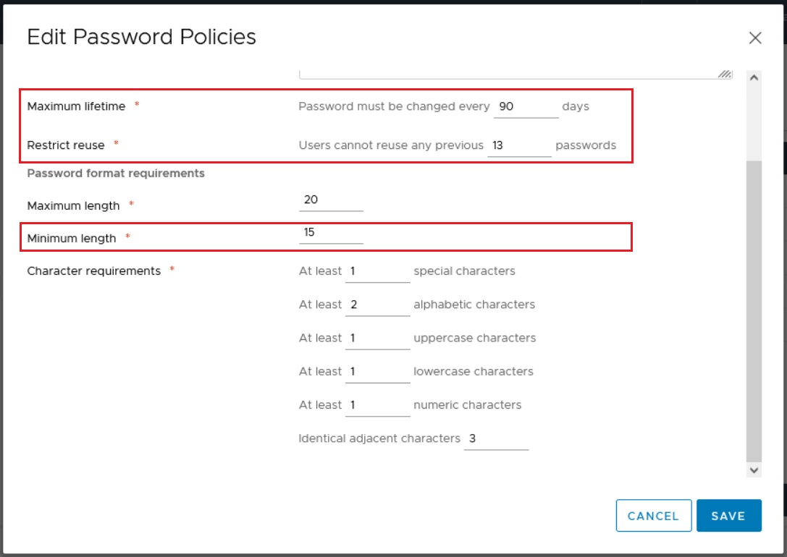

2. Edit the **Lockout Policy**: modify the highlighted entry and save the changes.

    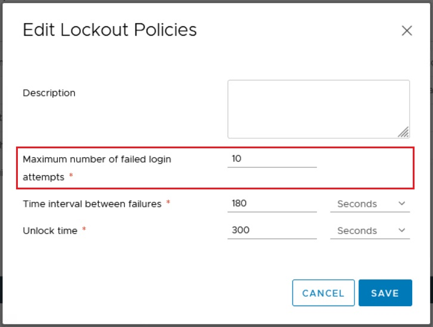

#### Post-implementation

Repeat steps from the pre-implementation.

To test the changes, run the following playbook. It will rotate password for local administrator account on vCenter:

```shell
ansible-playbook resetSddcManagerManagedPasswords.yml -e entityTypes='PSC'
```

> **Note**
>
> For VCS environments using vRA Cloud, this should be executed outside of business hours.

## Configuration - using PowerShell modules

> **Note**
>
> The commands are presented on the example of NX0 environment. They need to be adjusted per each site.

All steps in this section need to be performed in or for the Ansible Core VM, i.e. `<locationCode>ans001`.

### Pre-configuration

In order to use the PowerShell automation, it is required to complete the following steps in advance:

1. Create a snapshot for the Ansible Core VM.
2. Verify the PowerShell version (required is 7.2.0 or above):

    ```shell
    pwsh --version
    ```

    or

    ```powershell
    pwsh
        $PSVersionTable
    ```

3. Install **PowerShell 7.2.11** if needed.
    > **Note**
    >
    > This is the version used in VCS 2.0 - there's no need to revert it afterwards.

    - Check the installed package's release type:

        ```shell
        dpkg -l | grep powershell
        ```

    - Download the DEB package: [powershell](https://github.com/PowerShell/PowerShell/releases/download/v7.2.11/powershell_7.2.11-1.deb_amd64.deb) or [powershell-lts](https://github.com/PowerShell/PowerShell/releases/download/v7.2.11/powershell-lts_7.2.11-1.deb_amd64.deb).
    - Copy the file to Ansible Core VM.
    - Install the package:

        ```shell
        sudo dpkg -i powershell_7.2.11-1.deb_amd64.deb
        ```

        or

        ```shell
        sudo dpkg -i powershell-lts_7.2.11-1.deb_amd64.deb
        ```

    - Verify the PowerShell version:

        ```shell
        pwsh --version
        ```

4. Download the required PowerShell modules:

    ```powershell
    sudo su -
    export http_proxy="gre02pxy001.nx0dhc01.next:3128"
    export https_proxy="gre02pxy001.nx0dhc01.next:3128"
    pwsh
        $proxyUrl = "http://gre02pxy001.nx0dhc01.next"
        $proxy = New-Object System.Net.WebProxy($proxyUrl)
        $proxy.Credentials = [System.Net.CredentialCache]::DefaultNetworkCredentials
        [System.Net.WebRequest]::DefaultWebProxy = $proxy 

        # Test the connectivity
        Invoke-WebRequest -Uri 'https://www.powershellgallery.com/api/v2' 

        # Install the required module
        Install-Module -Name VMware.CloudFoundation.PasswordManagement -Force

        [System.Net.WebRequest]::DefaultWebProxy = $null
        exit
    unset http_proxy
    unset https_proxy
    ```

### VCF domains and clusters

Some commands have to be executed for each domain present in the SDDC Manager.

To find the domain names, open SDDC Manager's GUI and navigate to **Inventory** -> **Workload Domains**.

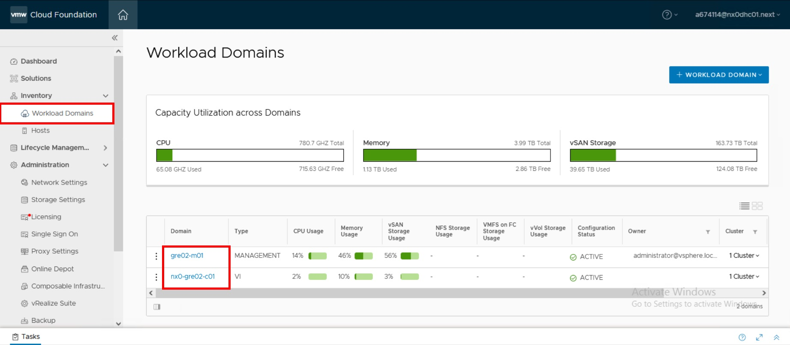

To find the cluster names for each listed domain, click on it and select **Clusters** in the horizontal menu.

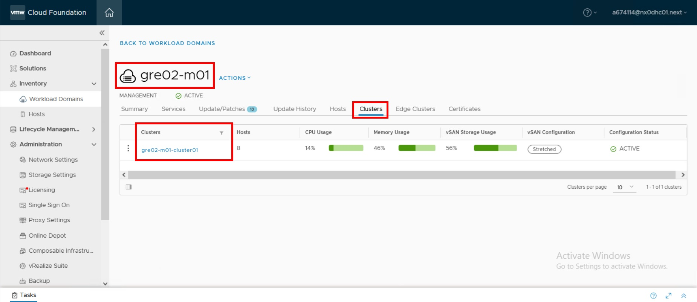

---

> [!NOTE]
> The following commands are executed from PowerShell. To open it on Ansible Core VM, run `pwsh`. The commands require authentication with vCenter administrator account, unless stated otherwise.

### ESXi hosts

Each set of commands needs to be executed for each domain present in the SDDC Manager and for each cluster under the domains.

#### Pre-implementation

```powershell
Request-EsxiPasswordComplexity -server "gre02sdm001.nx0dhc01.next" -user "administrator@vsphere.local" -domain "<domain name>" -cluster "<cluster name>"
Request-EsxiPasswordExpiration -server "gre02sdm001.nx0dhc01.next" -user "administrator@vsphere.local" -domain "<domain name>" -cluster "<cluster name>"
Request-EsxiAccountLockout -server "gre02sdm001.nx0dhc01.next" -user "administrator@vsphere.local" -domain "<domain name>" -cluster "<cluster name>"
```

#### Implementation

```powershell
Update-EsxiPasswordComplexity -server "gre02sdm001.nx0dhc01.next" -user "administrator@vsphere.local" -domain "<domain name>" -cluster "<cluster name>" -policy "retry=3 min=disabled,disabled,disabled,15,15" -history 13
Update-EsxiPasswordExpiration -server "gre02sdm001.nx0dhc01.next" -user "administrator@vsphere.local" -domain "<domain name>" -cluster "<cluster name>" -maxDays 90
Update-EsxiAccountLockout -server "gre02sdm001.nx0dhc01.next" -user "administrator@vsphere.local" -domain "<domain name>" -cluster "<cluster name>" -failures 10 -unlockInterval 900
```

#### Post-implementation

Repeat steps from the pre-implementation.

To test the changes, run the following playbook. It will rotate passwords for root accounts on ESXi hosts:

```shell
ansible-playbook resetSddcManagerManagedPasswords.yml -e entityTypes='ESXI'
```

### vCenter Servers

Each set of commands needs to be executed for each domain present in the SDDC Manager.

#### Pre-implementation

```powershell
Request-VcenterAccountLockout -server "gre02sdm001.nx0dhc01.next" -user "administrator@vsphere.local" -domain "<domain name>"
Request-VcenterPasswordExpiration -server "gre02sdm001.nx0dhc01.next" -user "administrator@vsphere.local" -domain "<domain name>"
Request-VcenterRootPasswordExpiration -server "gre02sdm001.nx0dhc01.next" -user "administrator@vsphere.local" -domain "<domain name>"
Request-VcenterPasswordComplexity -server "gre02sdm001.nx0dhc01.next" -user "administrator@vsphere.local" -domain "<domain name>"

Request-SsoAccountLockout -server "gre02sdm001.nx0dhc01.next" -user "administrator@vsphere.local" -domain "<domain name>"
Request-SsoPasswordExpiration -server "gre02sdm001.nx0dhc01.next" -user "administrator@vsphere.local" -domain "<domain name>"
Request-SsoPasswordComplexity -server "gre02sdm001.nx0dhc01.next" -user "administrator@vsphere.local" -domain "<domain name>"
```

#### Implementation

```powershell
Update-VcenterAccountLockout -server "gre02sdm001.nx0dhc01.next" -user "administrator@vsphere.local" -domain "<domain name>" -failures 10 -unlockInterval 900 -rootUnlockInterval 300
Update-VcenterPasswordExpiration -server "gre02sdm001.nx0dhc01.next" -user "administrator@vsphere.local" -domain "<domain name>" -maxDays 90 -minDays 1 -warnDays 7
Update-VcenterRootPasswordExpiration -server "gre02sdm001.nx0dhc01.next" -user "administrator@vsphere.local" -domain "<domain name>" -maxDays 90 -warnDays 7
Update-VcenterPasswordComplexity -server "gre02sdm001.nx0dhc01.next" -user "administrator@vsphere.local" -domain "<domain name>" -minLength 15 -history 13 -minLowercase -1 -minUppercase -1 -minNumerical -1 -minSpecial -1 -minUnique 4

Update-SsoAccountLockout -server "gre02sdm001.nx0dhc01.next" -user "administrator@vsphere.local" -domain "<domain name>" -failures 10 -failureInterval 180 -unlockInterval 300
Update-SsoPasswordExpiration -server "gre02sdm001.nx0dhc01.next" -user "administrator@vsphere.local" -domain "<domain name>" -maxDays 90
Update-SsoPasswordComplexity -server "gre02sdm001.nx0dhc01.next" -user "administrator@vsphere.local" -domain "<domain name>" -minLength 15 -history 13 -maxLength 20 -minAlphabetic 2 -minLowercase 1 -minUppercase 1 -minNumeric 1 -minSpecial 1 -maxIdenticalAdjacent 3 
```

#### Post-implementation

Repeat steps from the pre-implementation.

To test the changes, run the following playbook. It will rotate password for local administrator account and root accounts on vCenter Servers:

```shell
ansible-playbook resetSddcManagerManagedPasswords.yml -e entityTypes='PSC,VCENTER'
```

> **Note**
>
> For VCS environments using vRA Cloud, this should be executed outside of business hours.

### SDDC Manager

On top of requiring authentication with vCenter administrator account, the following commands will also prompt for SDDC Manager's root password.

#### Pre-implementation

```powershell
Request-SddcManagerAccountLockout -server "gre02sdm001.nx0dhc01.next" -user "administrator@vsphere.local"
Request-SddcManagerPasswordExpiration -server "gre02sdm001.nx0dhc01.next" -user "administrator@vsphere.local"
Request-SddcManagerPasswordComplexity -server "gre02sdm001.nx0dhc01.next" -user "administrator@vsphere.local"
```

#### Implementation

```powershell
Update-SddcManagerAccountLockout -server "gre02sdm001.nx0dhc01.next" -user "administrator@vsphere.local" -failures 10 -unlockInterval 86400 -rootUnlockInterval 300
Update-SddcManagerPasswordExpiration -server "gre02sdm001.nx0dhc01.next" -user "administrator@vsphere.local" -minDays 1 -maxDays 90
Update-SddcManagerPasswordComplexity -server "gre02sdm001.nx0dhc01.next" -user "administrator@vsphere.local" -minLength 15 -history 13 -minLowercase -1 -minUppercase -1  -minNumerical -1 -minSpecial -1 -minUnique 4 -minClass 4 -maxSequence 0 -maxRetry 3
```

#### Post-implementation

Repeat steps from the pre-implementation.

To test the changes, run the following playbook. It will rotate passwords for local accounts on SDDC Manager:

```shell
ansible-playbook rotatePassword.yml -e executionOption=sddc
```

### NSX Manager

Each set of commands needs to be executed for each domain present in the SDDC Manager.

#### Pre-implementation

```powershell
Request-NsxtManagerAccountLockout -server "gre02sdm001.nx0dhc01.next" -user "administrator@vsphere.local" -domain "<domain name>"
Request-NsxtManagerPasswordExpiration -server "gre02sdm001.nx0dhc01.next" -user "administrator@vsphere.local" -domain "<domain name>"
Request-NsxtManagerPasswordComplexity -server "gre02sdm001.nx0dhc01.next" -user "administrator@vsphere.local" -domain "<domain name>"
```

#### Implementation

```powershell
Update-NsxtManagerAccountLockout -server "gre02sdm001.nx0dhc01.next" -user "administrator@vsphere.local" -domain "<domain name>" -cliFailures 10 -cliUnlockInterval 900 -apiFailures 5 -apiFailureInterval 900 -apiUnlockInterval 900
Update-NsxtManagerPasswordExpiration -server "gre02sdm001.nx0dhc01.next" -user "administrator@vsphere.local" -domain "<domain name>" -maxdays 90
Update-NsxtManagerPasswordComplexity -server "gre02sdm001.nx0dhc01.next" -user "administrator@vsphere.local" -domain "<domain name>" -minLength 15 -minLowercase -1 -minUppercase -1  -minNumerical -1 -minSpecial -1 -minUnique 4 -maxRetry 3
```

#### Post-implementation

Repeat steps from the pre-implementation.

To test the changes, run the following playbook (outside of business hours). It will rotate passwords for local accounts on NSX Managers:

```shell
ansible-playbook resetSddcManagerManagedPasswords.yml -e entityTypes='NSXT_MANAGER'
```

### NSX Edge

The commands need to be executed for the management domain in the SDDC Manager.

#### Pre-implementation

```powershell
Request-NsxtEdgeAccountLockout -server "gre02sdm001.nx0dhc01.next" -user "administrator@vsphere.local" -domain "<domain name>"
Request-NsxtEdgePasswordExpiration -server "gre02sdm001.nx0dhc01.next" -user "administrator@vsphere.local" -domain "<domain name>"
Request-NsxtEdgePasswordComplexity -server "gre02sdm001.nx0dhc01.next" -user "administrator@vsphere.local" -domain "<domain name>"
```

#### Implementation

```powershell
Update-NsxtEdgeAccountLockout -server "gre02sdm001.nx0dhc01.next" -user "administrator@vsphere.local" -domain "<domain name>" -cliFailures 10 -cliUnlockInterval 900
Update-NsxtEdgePasswordExpiration -server "gre02sdm001.nx0dhc01.next" -user "administrator@vsphere.local" -domain "<domain name>" -maxdays 90
Update-NsxtEdgePasswordComplexity -server "gre02sdm001.nx0dhc01.next" -user "administrator@vsphere.local" -domain "<domain name>" -minLength 15 -minLowercase -1 -minUppercase -1  -minNumerical -1 -minSpecial -1 -minUnique 4 -maxRetry 3
```

#### Post-implementation

Repeat steps from the pre-implementation.

To test the changes, run the following playbook. It will rotate passwords for local accounts on management NSX Edges (`<locationCode>edg101` and `<locationCode>edg102`):

```shell
ansible-playbook resetSddcManagerManagedPasswords.yml -e entityTypes='NSXT_EDGE'
```

### Reference

Official documentation for the PowerShell module:
[VMware.CloudFoundation.PasswordManagement](https://vmware.github.io/powershell-module-for-vmware-cloud-foundation-password-management/documentation)
