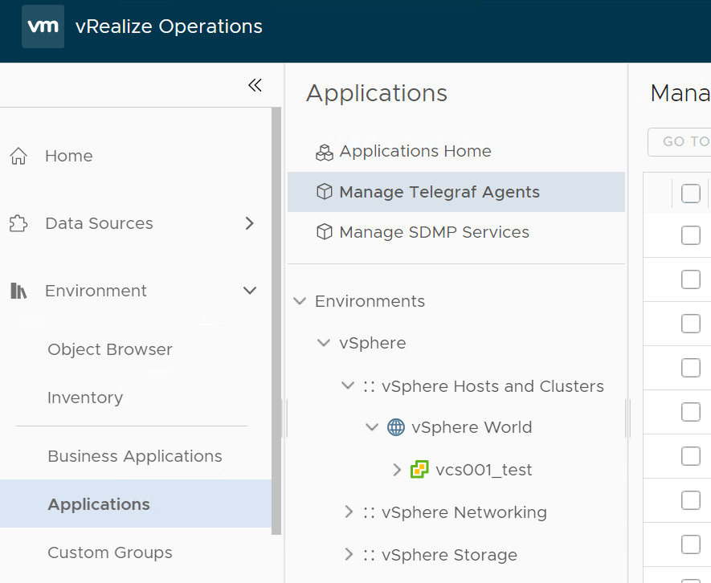
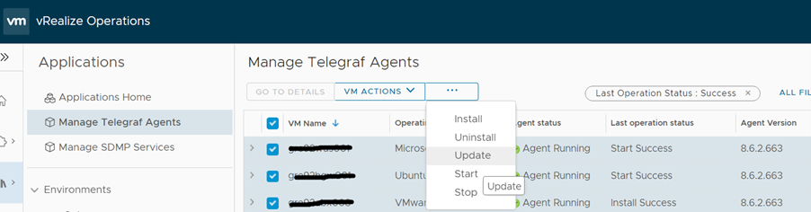
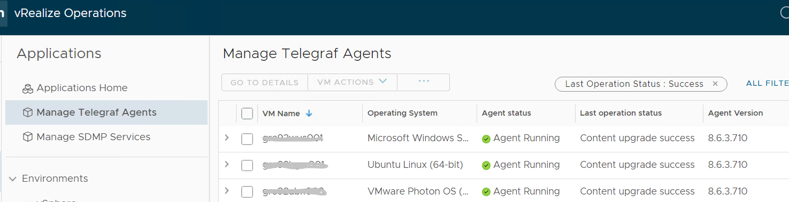

# Update Telegraf agent on vROPS GUIDE

Table of Contents:

- [Changelog](#changelog)
- [Introduction](#introduction)
- [Purpose](#purpose)
- [Audience](#audience)
- [Scope](#scope)
- [Pre-requisite](#pre-requisite)
- [Update Telegraf agent](#update-telegraf-agent)
  - [Follow below steps to update telegraf agent](#follow-below-steps-to-update-telegraf-agent)
- [Troubleshooting of services](#troubleshooting-of-services)

# Changelog

| Date       | Author            | Issue               | Description                                          |
| ---------- | ----------------- | ------------------- | ---------------------------------------------------- |
| 17.07.2023 | Vani Yemula       | VCS-9598            | Document creation                                    |
| 16.10.2023 | Mariusz Stanek    | VCS-6605            | Troubleshooting services added                       |

# Introduction

This document describes below automation:

- The step-by-step instructions to update Telegraf agent to the latest available version after the vROPS upgrade..

# Purpose

The purpose of this document is to describe the steps to update Telegraf agent to the latest available version after the vROPS upgrade.

# Audience

This document is intended for Atos ESO Cloud Services Engineers and Architects responsible for the deployment of vROPS upgradation.

# Scope

The scope of this document is to provide detailed steps to update cloud proxy telegraf agent.
However, installation of telegraf agent is not under the scope of this document.

# Pre-requisite

- Ensure Telegraf agent is already installed on all the VMs that are in the scope.
- Ensure vROPS along with cloud proxy has been upgraded to 8.6.3.

# Update Telegraf agent

## Follow below steps to update telegraf agent

| Steps                                    | Screenshots                              |
| ---------------------------------------- | ---------------------------------------- |
| 1. Login to vROps UI with admin credentials. From the left menu, click **Environment**-> **Applications**. From the Applications panel, click **Manage Telegraf Agents**. |  |
| 2. Choose one or more Virtual Machines on which Telegraf agent needs to updated and click on the horizontal ellipsis available at the top. Select **Update** ||
| 3. Once updated, you can check the status of the agent and the new version as shown ||

# Troubleshooting of services

If Telegraf agents update fails then check if 3 below services are running on VMs:

- ucp-minion,
- ucp-telegraf,
- ucp-salt-minion.

It can be required to start them manually using appropriate command for example service ucp-salt-minion restart/start on Linux.
