# Upgrade HBA Firmware and Driver

## Changelog

| Version | Date       | Description              | Author(s)       |
| ------- | ---------- | ------------------------ | --------------- |
| 0.1     | 2025-05-12 | Initial version          | Lukasz Tomaszewski |

## Introduction

### Purpose

These work instructions outline the procedure for performing HBA (Host Bus Adapter) upgrade. This is a general procedure that provides information about support for I/O card firmware and driver versions as specific hardware may vary depanding on customer setup.

### Audience

- VCS Engineers
- VCS Operations

### Scope

1. Determine current firmware and driver versions in an ESXi host
2. Check supported drivers and firmware versions for I/O devices
3. Example firmware and driver upgrade

## Related Documents

This document is a subset of Atos Technology Lifecycle Management (ATLM) artefacts. All documents are stored in the VCS Documentation repository

### Precedure

#### Determine current firmware and driver versions in an ESXi host

Source (and additional information): <https://knowledge.broadcom.com/external/article?legacyId=1027206>

1. Confirm the model of your HBA (e.g., Broadcom/Emulex/LSI)

  SSH into the ESXi host. (Enable SSH service if needed) and execute:

```bash
esxcfg-scsidevs -a
```

Output will look simmilar to:

```txt
vmhba0  vmw_ahci          link-n/a       sata.vmhba0                             (0000:00:11.5) Intel Corporation Lewisburg SATA AHCI Controller
vmhba1  vmw_ahci          link-n/a       sata.vmhba1                             (0000:00:17.0) Intel Corporation Lewisburg SATA AHCI Controller
vmhba2  lpfc              link-up        fc.200000109b41725c:100000109b41725c    (0000:da:00.0) Emulex Corporation Emulex LightPulse LPe31000/LPe32000 PCIe Fibre Channel Adapter
vmhba3  lpfc              link-up        fc.200000109b41725d:100000109b41725d    (0000:da:00.1) Emulex Corporation Emulex LightPulse LPe31000/LPe32000 PCIe Fibre Channel Adapter
vmhba4  lpfc              link-up        fc.200000109b41705e:100000109b41705e    (0000:5a:00.0) Emulex Corporation Emulex LightPulse LPe31000/LPe32000 PCIe Fibre Channel Adapter
vmhba5  lpfc              link-up        fc.200000109b41705f:100000109b41705f    (0000:5a:00.1) Emulex Corporation Emulex LightPulse LPe31000/LPe32000 PCIe Fibre Channel Adapter
vmhba64 lpfc              link-up        fc.200000109b41705e:100000109b41705e    (0000:5a:00.0) Emulex Corporation Emulex LightPulse LPe31000/LPe32000 PCIe Fibre Channel Adapter
vmhba65 lpfc              link-up        fc.200000109b41705f:100000109b41705f    (0000:5a:00.1) Emulex Corporation Emulex LightPulse LPe31000/LPe32000 PCIe Fibre Channel Adapter
vmhba66 lpfc              link-up        fc.200000109b41725c:100000109b41725c    (0000:da:00.0) Emulex Corporation Emulex LightPulse LPe31000/LPe32000 PCIe Fibre Channel Adapter
vmhba67 lpfc              link-up        fc.200000109b41725d:100000109b41725d    (0000:da:00.1) Emulex Corporation Emulex LightPulse LPe31000/LPe32000 PCIe Fibre Channel Adapter
```

In mentioned example **Emulex LightPulse LPe31000/LPe32000** is an HBA adapter we are looking for.

1. Verify current firmware and driver versions:

  SSH into the ESXi host. (Enable SSH service if needed) and execute:

```bash
esxcli storage san fc list
```

Output:

```txt
   Adapter: vmhba2
   Port ID: 010300
   Node Name: 20:00:00:10:9b:41:72:5c
   Port Name: 10:00:00:10:9b:41:72:5c
   Speed: 8 Gbps
   Port Type: NPort
   Port State: ONLINE
   Model Description: Emulex LightPulse LPe31002-M6 2-Port 16Gb Fibre Channel Adapter
   Hardware Version: 0000000c
   OptionROM Version: 11.4.204.20
   Firmware Version: 11.4.204.20
   Driver Name: lpfc
   DriverVersion: 14.4.0.39
```

If you were not able to determine firmware and driver version, please follow extended instructions on <https://knowledge.broadcom.com/external/article?legacyId=1027206> webpage.

#### Check supported drivers and firmware versions for I/O devices

Source: <https://knowledge.broadcom.com/external/article?legacyId=2150890>

Check VMware's HCL (Hardware Compatibility List) to match compatible firmware/driver version.

The Broadcom Hardware Compatibility List is the aggregation point for the information as provided by the vendor.

The vendor does the certification test, and then passes the information on to VMware by Broadcom, who then posts the information on the Web site at Broadcom Compatibility Guide

The driver versions are normally published in a newest-first sequence.

If one or more firmware versions is noted on the driver line, this is not a prescription, but rather it is the tester's documentation of the version of firmware that happened to be present in the hardware that was used to do the testing.

Example:

Login to Broadcom Compatibility Guide <https://compatibilityguide.broadcom.com/> using your Broadcom account. In 'Platform and Compute' menu click 'IO Devices' (<https://compatibilityguide.broadcom.com/search?program=io&persona=live&column=brandName&order=asc>).

Select your Product Relese Version, type name of your card in 'Keyword' text box and hit enter.

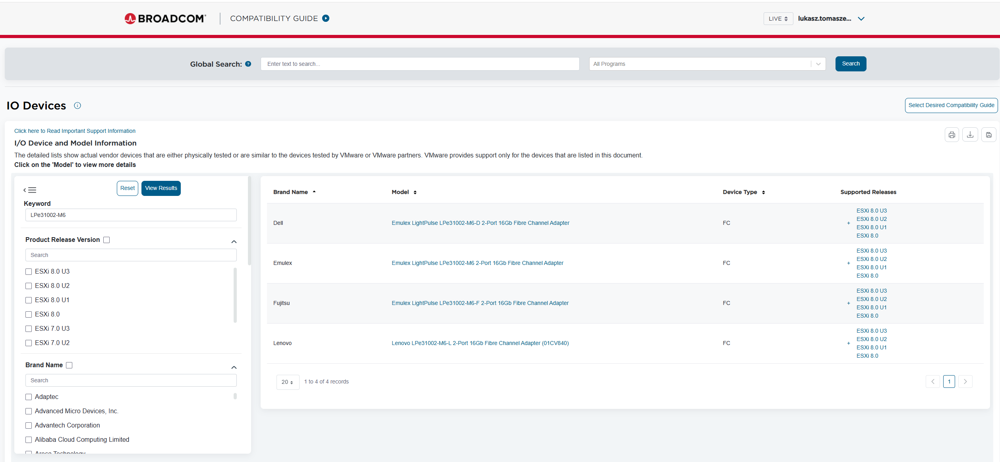

Select your brand name.

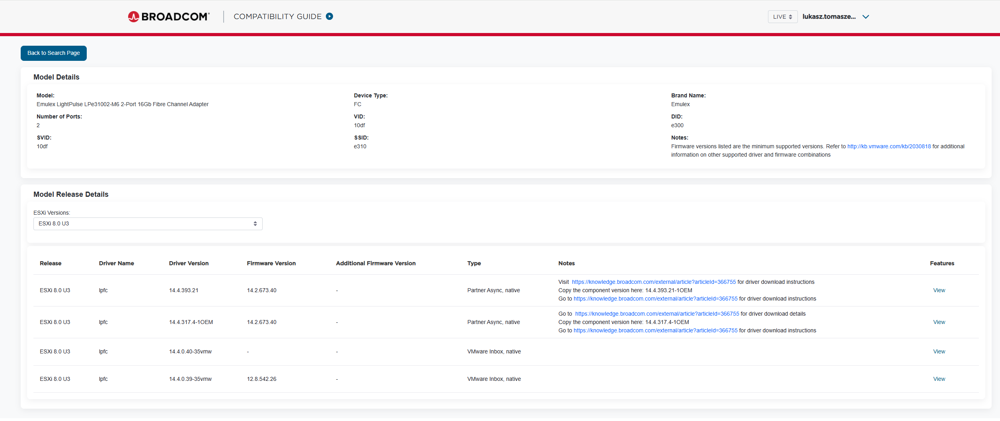

VMware does not develop or test drivers/firmware. The hardware vendor develops, tests, and certifies the drivers and the firmware for their components. VMware has very few specific drivers which are developed by VMware.

Refer to Figure2 (column Type) where you can find an information about driver types and distribution.

**Driver Types:**

Native - written for ESXi without use of Linux libraries.

Note: ESXi 7.0+ no longer supports VMKlinux drivers which are Linux library dependent

**Distribution:**

VMware Inbox - VMware built-in to ESXi install

Partner Async - hardware vendor provided, sometimes with links from VMware for convenience.

**It is very important that both the firmware and the driver versions to be aligned**. VMware recommends using the latest firmware versions listed at these links provided that they are paired with certified drivers.

In our example we will choose Partner Async, native  driver (14.4.393.21) and firmware (14.2.673.40).

#### Driver download

Source: <https://knowledge.broadcom.com/external/article?articleId=366755>

As of May 6, 2024, the Broadcom Support Portal replaces the VMware Customer Connect portal for vSphere downloads, including IO drivers. Follow the instructions below to navigate to a desired driver download.

Procedure:

  1. Locate your device and a corresponding driver on the Broadcom Compatibility Guide (BCG)

  2. To the left of the ESXi version, click on plus (+) to reveal the footnote. The footnote will contain the component version and instruct you to copy it, and then to click the link to this KB article.

  3. Go to the Broadcom Support web page <https://support.broadcom.com/web/ecx>

      Note: If you are not already registered, please register.

  4. Use the dropdown next to Username and find “VMware Cloud Foundation”.

      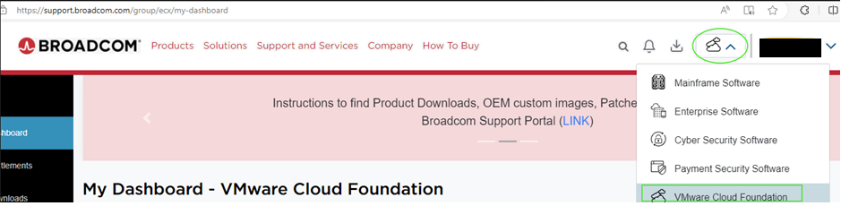

  5. On the My Downloads page, find the banner saying "Free Software Downloads Available HERE" towards the top of the page. Click on the word HERE

      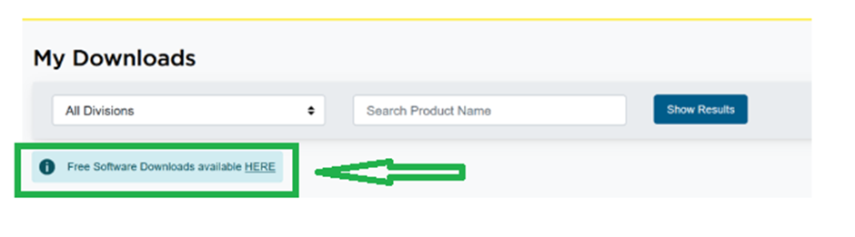

  6. On the Free Downloads page, in the Search for Products box, enter the word **drivers** and click the **Show Results** button to reveal the words VMware vSphere ESX Drivers

      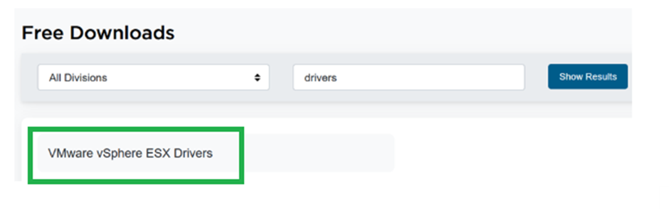

  7. Click on the words "VMware vSphere ESX Drivers"

  8. On the VMware vSphere ESX drivers page drop down menu, click on the desired vSphere version, e.g. 7.x, 8.x. etc.

  9. On the VMware vSphere (ESXi) page, click on "Drivers and Tools" to reveal the drivers

      Note: Some drivers, though shown on vSphere 8 VCG listings, are actually version 7.0 drivers that will work on 8.0. If you don't find the driver you are looking for in 8.0, it may be a 7.0 driver. Modify the vSphere version to 7.0 and search there.

  10. In the Search dialog box, paste in the component version you copied from the BCG footnote to reveal the driver download.

      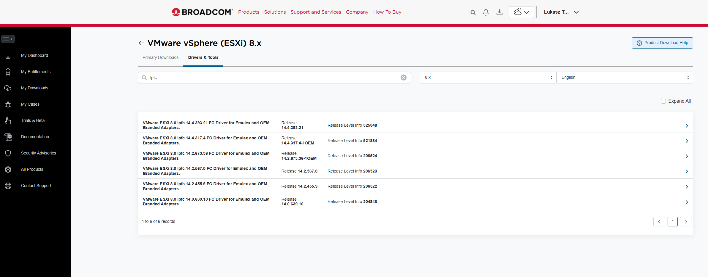

#### Firmware download

Below you will find an example of firmware download for Broadcom`s Emulex Adapter.

Links to vendor support websites: <https://knowledge.broadcom.com/external/article?legacyId=2030818>

  1. Open your vendor support website, and use search or relevant option to find more information about HBA card.

      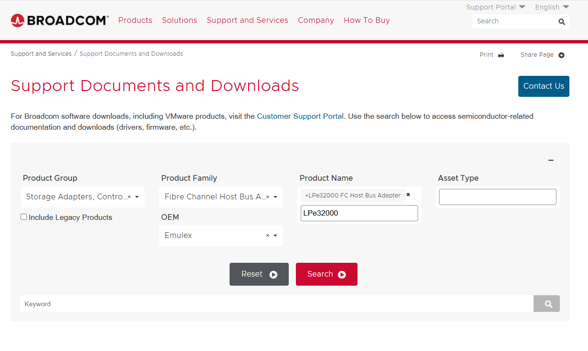

  2. Go to the firmware section, find appropriate firmware and download it. Underlined selection refers to firmware version we have chosen from Broadcom Compatibility Guide.

      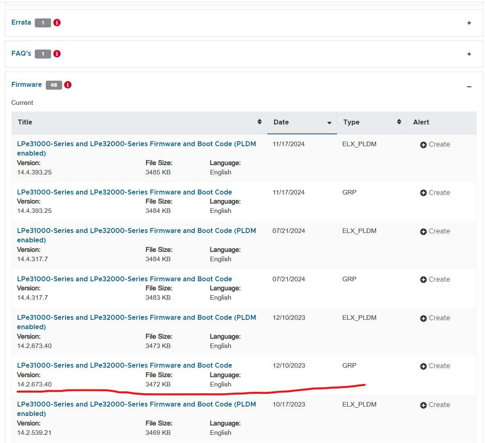

#### Example firmware and driver upgrade

##### Determine your HBA configuration

  Source: <https://knowledge.broadcom.com/external/article/342630/identifying-esxi-boot-luns-for-boot-from.html>

  While backup of the configuration is imposible you need to determine your boot device in case of unpredicted situation, like loosing boot device on BIOS level of your adapter after firmware upgrade.

  **Note that this applies only if you boot your ESXi host from HBA**

  To identify boot LUNs for ESXi Boot from SAN configurations, first find what LUNs are being used by the bootbank and the altbootbank. By definition, these LUNs will be the boot LUNs:

  1. SSH to the ESXi host via root

  2. Obtain the bootbank and altbootbank UUIDs:

      ```shell
      ls -l /
      ```

      Note down the path /vmfs/volumes/########-########-####-############ for a bootbank and altbookbank.

      Example:

      ```txt
      lrwxrwxrwx 1 root root 49 Oct 27 17:55 altbootbank -> /vmfs/volumes/########-########-####-############
      drwxr-xr-x 1 root root 512 Sep 17 01:11 bin
      lrwxrwxrwx 1 root root 49 Oct 27 17:55 bootbank -> /vmfs/volumes/########-########-####-############
      ```

  3. Obtain the disk ID:

      ```shell
      vmkfstools -P <path>
      ```

      Note down the NAA ID (Network Address Authority) - naa.xxxxxxxxxxxxxxxxxxxxxxx.

      Example:

      ```txt
      vmkfstools -P /vmfs/volumes/########-########-####-############
      
      vfat-0.04 file system spanning 1 partitions.
      File system label (if any):
      Mode: private
      Capacity 261853184 (63929 file blocks * 4096), 114647040 (27990 blocks) avail
      UUID: ########-########-####-############
      Partitions spanned (on "disks"):
      naa.xxxxxxxxxxxxxxxxxxxxxxx:6
      ```

  4. Check the device properties:

      ```shell
      esxcli storage nmp device list -d <naaID>
      esxcli storage core device list -d <naaID>
      ```

      In below example we can see that the working path for this device is: vmhba0:C0:T6:L0, which means our device uses **C**hanel 0 **T**arget 6 and **L**UN 0.

      Example:

      ```txt
      esxcli storage nmp device list -d naa.################################

      naa.################################
      Device Display Name: NETAPP Fibre Channel Disk (naa.################################)
      Storage Array Type: VMW_SATP_DEFAULT_AA
      Storage Array Type Device Config: SATP VMW_SATP_DEFAULT_AA does not support device configuration.
      Path Selection Policy: VMW_PSP_FIXED
      Path Selection Policy Device Config: {preferred=vmhba0:C0:T6:L0;current=vmhba0:C0:T6:L0}
      Path Selection Policy Device Custom Config:
      Working Paths: vmhba0:C0:T6:L0
      ```

      Example:

      ```txt
      esxcli storage core device list -d naa.################################
      
      naa.################################
      Display Name: NETAPP Fibre Channel Disk (naa.################################)
      Has Settable Display Name: true
      Size: 30720
      Device Type: Direct-Access
      Multipath Plugin: NMP
      Devfs Path: /vmfs/devices/disks/naa.################################
      Vendor: NETAPP
      Model: LUN
      Revision: 0.2
      SCSI Level: 4
      Is Pseudo: false
      Status: on
      Is RDM Capable: true
      Is Local: false
      Is Removable: false
      Is SSD: false
      Is Offline: false
      Is Perennially Reserved: false
      Thin Provisioning Status: unknown
      Attached Filters:
      VAAI Status: unknown
      Other UIDs: vml.######################################################
      ```

      Sometimes it might be helpful to find LUN`s friendly names.

      To find the "friendly names" of these LUNs as seen in the vCenter/ESXi host client views, use the "esxcli storage filesystem list" command, and search for the naa number(s) for the boot LUN(s):

      /vmfs/devices/disks/naa.################################    spr-lun3    ########-########-####-############    true    VMFS-5    805037932544    400613703680

      Using the above example, "spr-lun3" is the friendly name of the boot LUN because its naa number ################################ matches what the previous outputs.

      Note: Locally-attached disk LUNs may not have "friendly names" set at all.

###### Example from dev environment

Here's an example of **esxcli storage nmp device list** command from working environment, showing how to find the LUN number on which storage device is working:

```txt
[root@gre22cmp001:~] esxcli storage nmp device list -d naa.6006016018bf560094a52766e58eca2c
naa.6006016018bf560094a52766e58eca2c
   Device Display Name: DGC Fibre Channel Disk (naa.6006016018bf560094a52766e58eca2c)
   Storage Array Type: VMW_SATP_ALUA_CX
   Storage Array Type Device Config: {navireg=on, ipfilter=on} {implicit_support=on; explicit_support=on; explicit_allow=on; alua_followover=on; action_OnRetryErrors=on; {TPG_id=1,TPG_state=AO}{TPG_id=2,TPG_state=ANO}}
   Path Selection Policy: VMW_PSP_RR
   Path Selection Policy Device Config: {policy=rr,iops=1000,bytes=10485760,useANO=0; lastPathIndex=12: NumIOsPending=0,numBytesPending=0}
   Path Selection Policy Device Custom Config:
   Working Paths: vmhba3:C0:T6:L0, vmhba4:C0:T4:L0, vmhba5:C0:T5:L0, vmhba4:C0:T6:L0, vmhba2:C0:T4:L0, vmhba5:C0:T4:L0
   Is USB: false
```

Please note that boot device is on LUN0.

You can always boot your server and enter BIOS to verify these settings:

  1. Reboot your server and enter boot options
  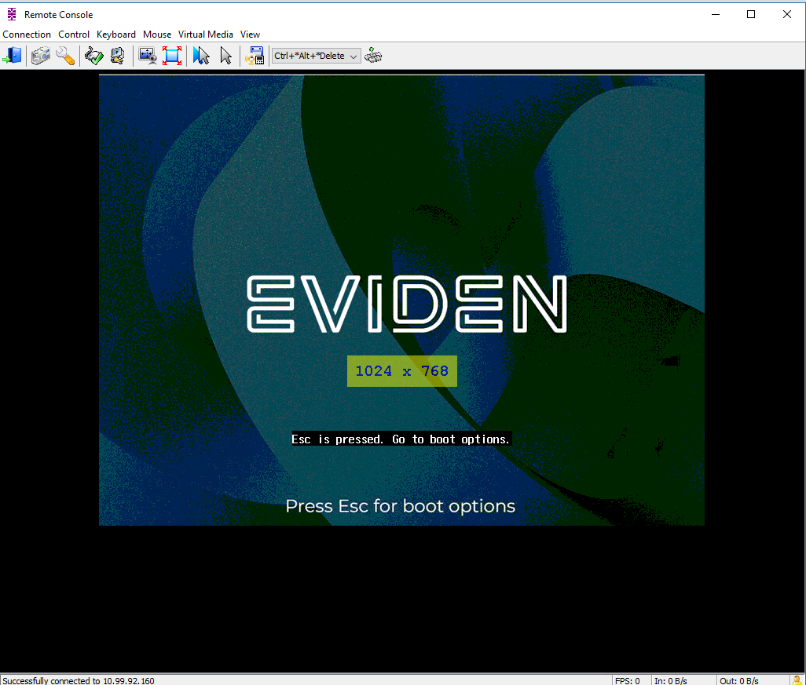

  2. Enter **Boot Manager**

      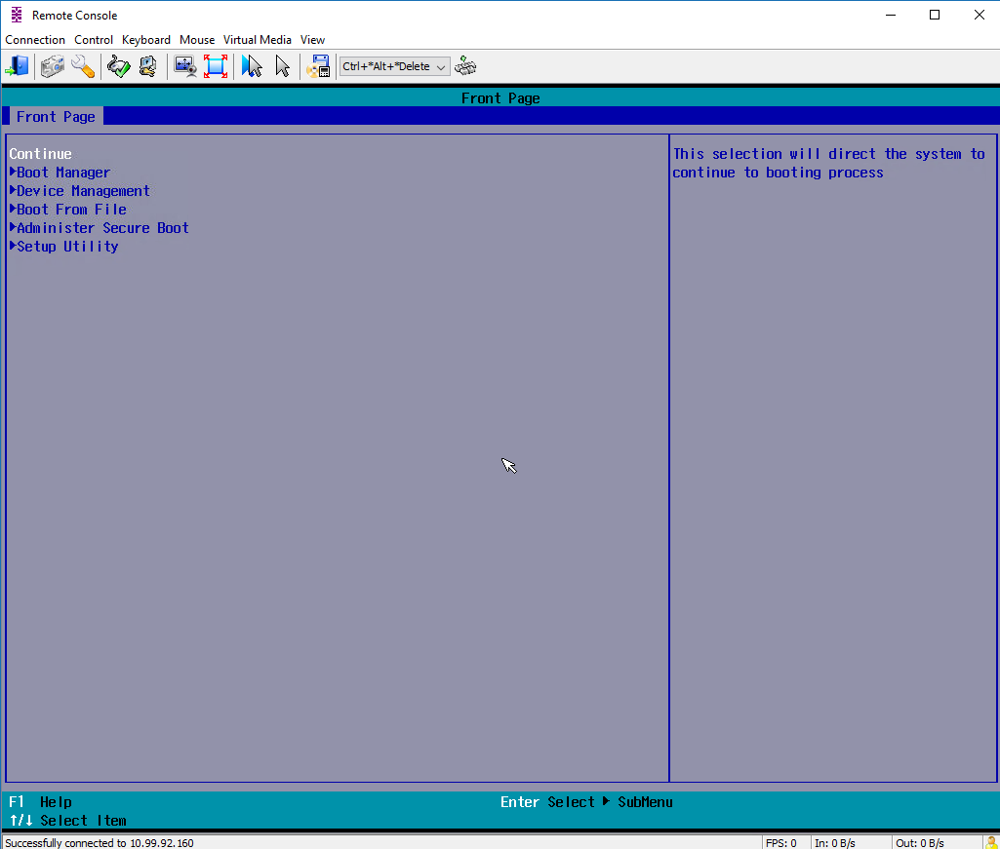

  3. Write down WWN and LUN used as a boot drive for ESXi host

      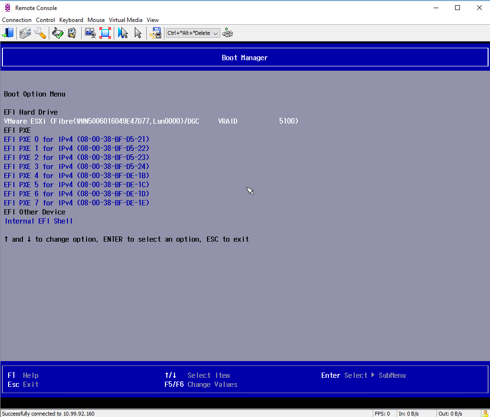

##### Bull Sequana S series

Below you will find an example of firmware and driver upgrade on Bull Sequana S400 equipped with Emulex LPe31002 FC Host Bus Adapter.

When updating HBAs in ESXi, firmware should generally be updated before the driver. This is because the firmware dictates the hardware's capabilities and the driver interacts with that firmware to provide OS-level functionality. Updating the firmware first ensures the driver can interact with the latest hardware features and performance enhancements.

Before you start, enable SSH service if needed.

  1. Emulex adapters firmware is upgraded using **elxmgmt** esxcli extention component which is delivered as vib package. Check if **elxmgmt** vib is already installed.

      ```shell
      esxcli software vib list | grep elxmgmt
      ```

      Example output:

      ```txt
        [root@gre22cmp001:~] esxcli software vib list | grep elxmgmt
      elxmgmt                        14.4.393.19-1OEM.800.1.0.20613240     EMU     VMwareAccepted    2025-05-08    host
      ```

  2. If software component hasn't been found, please download elxmgmt vib that extends esxcli with elxmgmt subcommand (this is required to update Emulex HBA).

      Go to the download page on the Broadcom website, at <www.broadcom.com>, or to the vendor website to verify the driver version or the Emulex HBA Manager application version that must be installed on your system.

      Click **Support Documents and Downloads** and provide sercha atrributes: Group: Storage Adapters, Controllers, and ICs Family: Storage Adapters, Controllers, and ICs OEM: Emulex

      Go to **Management Software and Tools** and find: **ESXCLI Management Tool for VMware ESXi 8.0**. Download the file (in .zip format).

  3. Put ESXi host in **Maintenance mode**.

  4. Using WinSCP or any simmilar software copy .zip file to /tmp directory.

  5. Install **elxmgmt** vib

      ```shell
      esxcli software vib install -d /tmp/xxx.zip
      ```
  
  6. Restart your server.

  7. Download firmware and/or driver files (instruction was presented in Driver download and firmware download sections).

  8. Using WinSCP or any similar software copy firmware and driver files to /tmp directory.

  9. Check HBA card and its WWNs port. Write down Port WWN (only one per adapter is required). you can diffirentiate adapters based on **PCI Bus Number**.

      ```shell
      esxcli elxmgmt hba list
      ```

      Example output:

      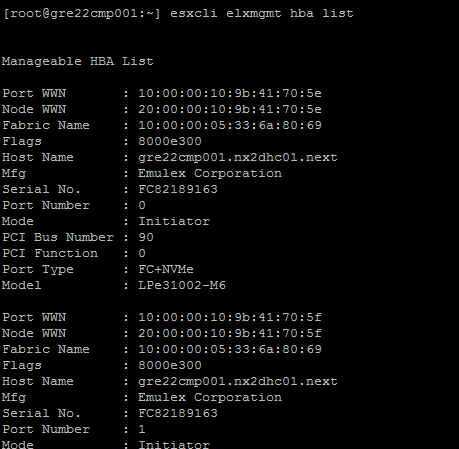

  10. Firmware upgrade. Please remember, you need to execute it against 2 adapters, useng Port WWN noted down in previous step.

      ```shell
      esxcli elxmgmt hba firmware download -f /tmp/lancerg6_A12.8.542.26.grp -w <Port WWN>
      ```

      Example output:

      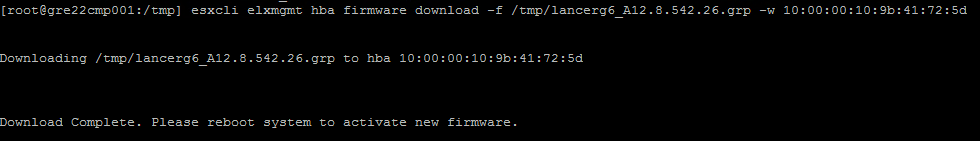

  11. Restart your server (can be postponed and done in step 13, after driver upgrade).

  12. Driver upgrade.

      ```shell
      esxcli software vib install -d /tmp/xxx.zip
      ```

      Example output:

      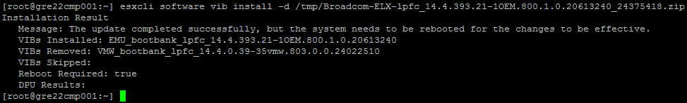

  13. Restart your server.

  14. Check installed versions.

      ```shell
        esxcli storage san fc list
      ```

      Example output:

      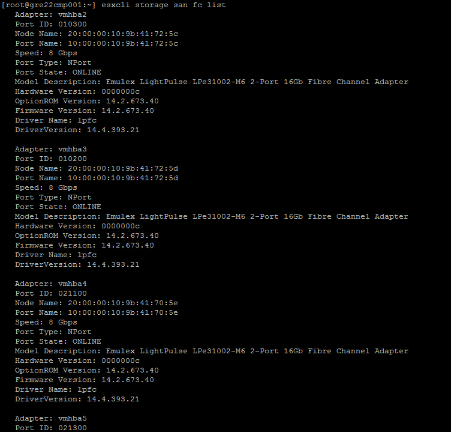

  15. Exit **Maintenance mode**.

##### Dell PowerEdge

Quick guide for firmware upgrade on Dell PowerEdge servers. Driver upgrade will look the same as presented ealier for Bull Sequana servers.

The procedure for driver upgrade is the same as in Bull's example (please check supported driver version on vendor website).

1. Enter Maintenance Mode

2. Upgrade the HBA Firmware

    There are two main ways to update firmware:

    a. Using iDRAC and Dell DUP (Recommended)

      Download the Dell Update Package (.EXE) for Windows or (.BIN) for Linux.

      Boot the server using Dell Live Linux ISO (or CentOS/Ubuntu) via iDRAC virtual console.

      Upload the DUP to the live OS.

      Run the DUP: chmod +x <filename>.BIN ./<filename>.BIN

    b. Using Dell Lifecycle Controller (No OS Boot Needed)

      Reboot and press F10 to enter Lifecycle Controller.

      Go to Firmware Update > Local Drive / FTP / Network.

      Load the firmware update file or connect to Dell’s FTP.

      Apply the HBA firmware update and reboot when done.

3. Reboot the Host

4. Exit Maintenance Mode

5. Verify Upgrade

    Check version again to confirm update:

    ```shell
    esxcli software vib list | grep -i <driver>
    ```

    To ensure the adapter is active and recognized use following command:

    ```shell
    esxcfg-scsidevs -a
    ```
