# Update vRealize Automation Suite using vRLCM GUIDE

## Table of Contents

- [Update vRealize Automation Suite using vRLCM GUIDE](#update-vrealize-automation-suite-using-vrlcm-guide)
  - [Table of Contents](#table-of-contents)
  - [Changelog](#changelog)
  - [Introduction](#introduction)
    - [Purpose](#purpose)
    - [Audience](#audience)
    - [Scope](#scope)
    - [Pre-requisite](#pre-requisite)
  - [Upgrade vRLCM asynchronous](#upgrade-vrlcm-asynchronous)
  - [Upgrade vRA through vRLCM using automation playbook](#upgrade-vra-through-vrlcm-using-automation-playbook)
    - [Upgrade VRA through automation](#upgrade-vra-through-automation)
    - [Upgrade VRA Manually](#upgrade-vra-manually)
      - [1. Download vRA Binaries in vRLCM](#1-download-vra-binaries-in-vrlcm)
      - [2. Upgrade vRA](#2-upgrade-vra)

## Changelog

| Date       | Author            | Issue               | Description                                          |
| ---------- | ----------------- | ------------------- | ---------------------------------------------------- |
| 11.08.2023 | Vani Yemula       | VCS-9888            | Document creation                                    |
| 11.09.2023 | Vani Yemula       | VCS-10883           | Reformatted document                                 |

## Introduction

This document describes below automation:

- The steps to follow for the upgrade of vRA using vRLCM.

### Purpose

The purpose of this document is to describe the steps to upgrade vRA to 8.12 version using vRLCM.

### Audience

This document is intended for Atos ESO Cloud Services Engineers and Architects responsible for the deployment of vRA upgradation.

### Scope

The scope of this document is to provide detailed steps to upgrade of vRA using vRLCM.
However, if the automation isnt successful, manual steps are also documented.

### Pre-requisite

- vRA On-Prem Upgrade can be done on SDDC 4.5

## Upgrade vRLCM asynchronous

We are required to upgrade vRLCM to version 8.10, in order to have upgrade of VRA.

Please follow below steps to upgrade the vRLCM.

1. login into vRLCM portal using admin user - `https://greXXlcm001.nxXdhc01.next/`

2. Take a snapshot of the vRealize Suite Lifecycle Manager virtual appliance. If you encounter
any problems during upgrade, you can revert to this snapshot.  

    Note: Verify that no critical tasks are currently in progress in vRealize Suite Lifecycle Manager.
    The upgrade process stops and starts vRealize Suite Lifecycle Manager services and reboots
    the vRealize Suite Lifecycle Manager virtual appliance, which might corrupt tasks that are in
    progress.

3. The upgrade of vRealize Suite Lifecycle Manager is performed through a CDROM, which means to download the vRealize Suite Lifecycle Manager upgrade binary from MyVMware portal in advance. The file name must be - VMware-vLCM-Appliance-8.X.X.XXXXXXXXXX-updaterepo.iso.
   Download the upgrade ISO's for both below mentioned version of vRLCM.
    - VMware vRealize Suite Lifecycle Manager 8.10
    - VMware Aria Suite Lifecycle 8.12

4. Now, go to vCenter and attach the above downloaded iso for version 8.10 to vRLCM VM ie. greXXlcm001.
   Upload in a datastore that the vRealize Suite Lifecycle Manager VM can access. After uploading, attach the ISO to the vRealize Suite Lifecycle Manager VM's CD-ROM device by editing the VM's hardware configuration from the vCenter inventory.

5. On the vRLCM portal, My services dashboard, click `Lifecycle Operations` and click `Settings`

6. Click `System Upgrade`. Select the repository type for vRealize Suite Lifecycle Manager updates as 'CD-ROM'.
   vRealize Suite Lifecycle Manager displays the name, version number, and vendor of the current vRealize Suite Lifecycle Manager appliance.

7. Click `CHECK FOR UPGRADE`
   After few minutes, vRealize Suite Lifecycle Manager appliance reads from the virtual CD-ROM drive.

8. Select the checkbox on product snapshots under Prerequisite, and then click `Next`.

9. Click `RUN PRECHECK`. Once the precheck validation is complete, then download the report to view the checks and validation status.

10. Click `Upgrade` after successful precheck validation.

11. After a few minutes, login to the vRealize Suite Lifecycle Manager UI and check for the upgrade successful message in the Settings > System Details.
    Should see version 8.10.

    Note: On an upgrade completion, vRealize Suite Lifecycle Manager displays the message upgrade
    completion message. If you do not see this message, wait for a few minutes and refresh the
    UI.

12. Upgrade vRealize Suite Lifecycle Manager appliance to ver 8.12. For this, it is also required to apply PSPAK.

13. To apply PSPAK for before upgrading the vRLCM to 8.12

    - On the VMware Aria Suite Lifecycle Operations dashboard, navigate to `Settings` > `Product Support Pack`.
    - Select `Support` for Additional Product Versions section. VMware Aria Suite Lifecycle auto-populates the list of available support versions. If the list is not auto-populated, click `CHECK SUPPORT PACKS ONLINE`.
    - When the list is populated, click `Apply Version` in `Settings` > `Product Support Pack` for the appropriate content version.

    For this upgrade, select `vRLCM PSPAK 3`

    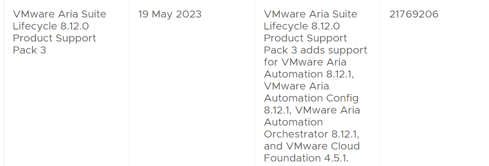

    - After the PSPAK installation is triggered successfully, VMware Aria Suite Lifecycle services are restarted and you are redirected to VMware Aria Suite Lifecycle login page.

    **Note**: To verify that the correct VMware Aria Suite Lifecycle 8.12 Product Support Pack is installed, on the VMware Aria Suite Lifecycle Operations dashboard, navigate to Settings > Product Support Pack. The option should list version 8.12.x (exact version is dependent on the downloaded PSPAK) along with the supported versions of VMware Aria Automation, VMware Aria Automation Orchestrator, and VMware Aria Automation Config.

14. Repeat steps 4 - 10. Ensure version selected is VMware Aria Suite Lifecycle 8.12.

15. On the vRLCM portal, `My Services` dashboard, click `Lifecycle Operations` and click `Settings` > `System Details`. Version should reflect VMware Aria Suite Lifecycle 8.12

## Upgrade vRA through vRLCM using automation playbook

### Upgrade VRA through automation

We are required to upgrade the vRealize Automation tool from version 8.x to version 8.12.

The upgrade of vRA has been automated with an anisble playbook. To upgrade the run the ansible playbook.

```text
ansible-playbook upgradeVraUsingVrlcm.yml
```

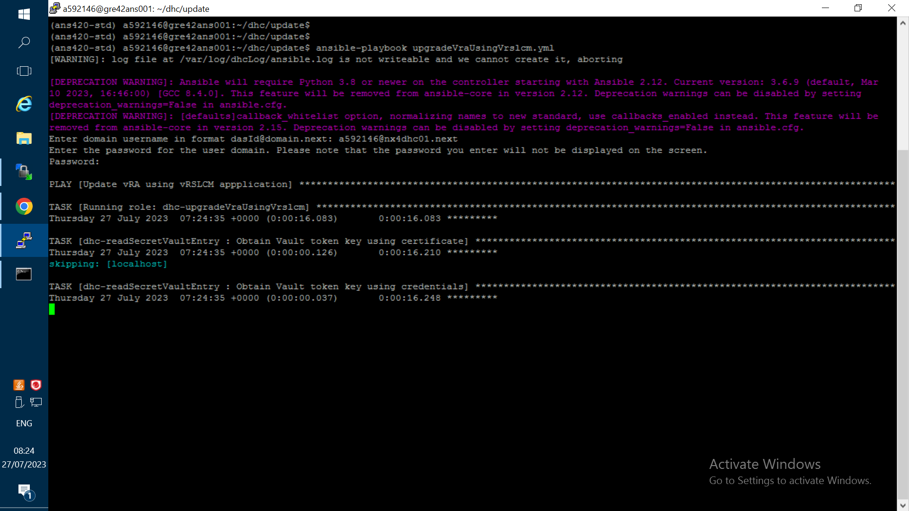

This playbook, runs and triggers the upgrade on the vRLCM and keeps monitoring the upgrade process until completes. If any issues encountered with the upgrade process then the playbook fails with appropriate error.

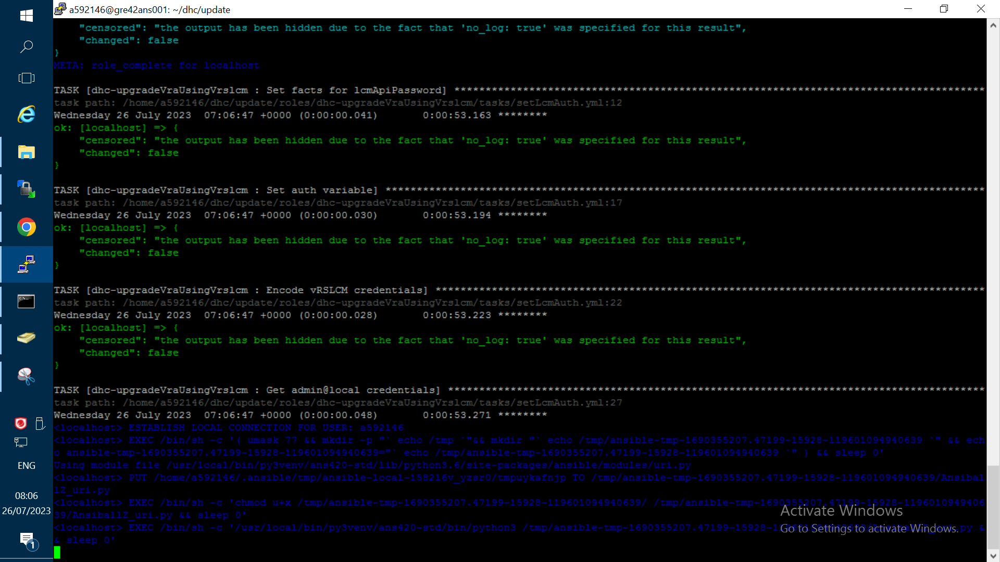

### Upgrade VRA Manually

To upgrade vRealize Automation using vRLCM, please follow the below steps.

#### 1. Download vRA Binaries in vRLCM

Login to vRLCM, Goto Home –> Settings –> Binary Mapping –> Add Binaries –> Choose My VMware and click on `Discover`.

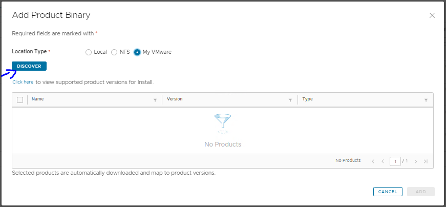

After the discovery , you can see the list of products which are ready to be added in the repo. Choose the appropriate product version ie. vRealize Automation 8.12 and click on `Add` and ensure the type is upgrade.

Once you click `Add`, a new task will be created to download the package from VMware site to vRLCM.

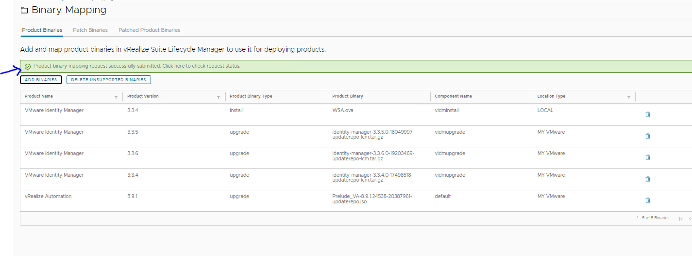

Goto vRLCM home –> Requests and check the download status, this will take some time based on the download speed. Once this task is completed, you can see the newly downloaded package under Binary Mapping section.

#### 2. Upgrade vRA

login to vRLCM, go to Environments and select vRA and view details, Click on `upgrade`.

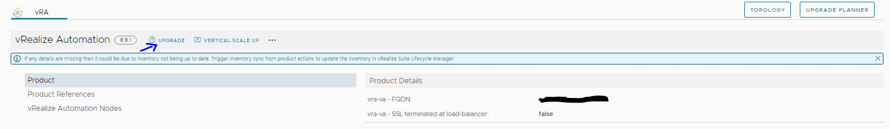

It will prompt you to run “Trigger Inventory Sync”, it is always recommended to do a Inventory Sync to ensure everything is fine in the setup before we do any activity. Once you run Inventory sync click on `Proceed` to move to next step.

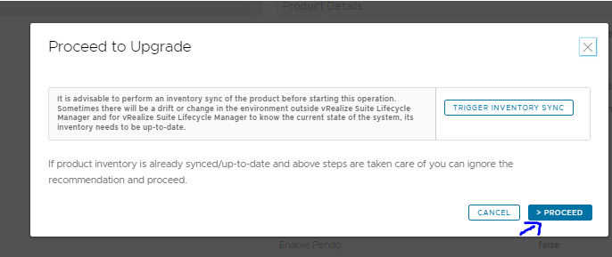

Choose the version and click `next`.
Select the snapshots options and click `next`.

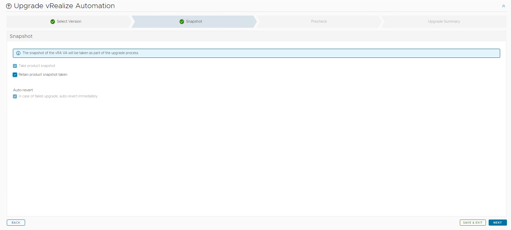

Click on `Run Prechecks`.

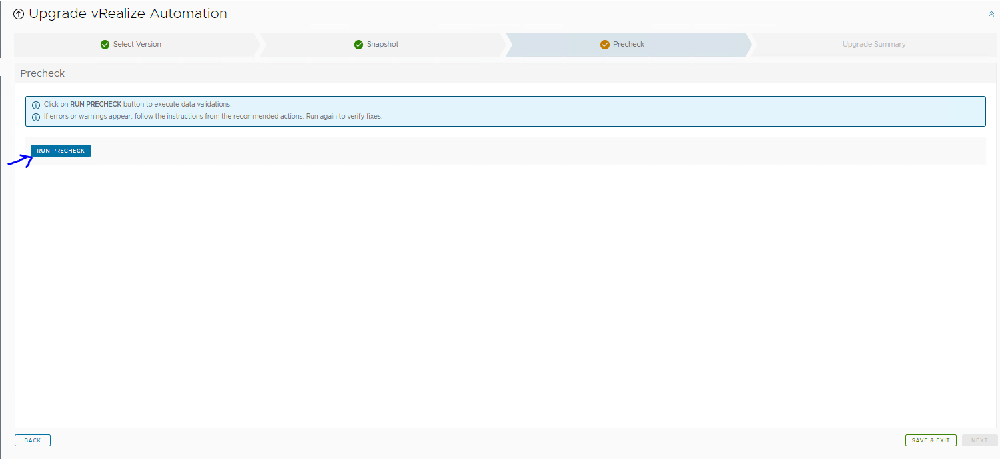
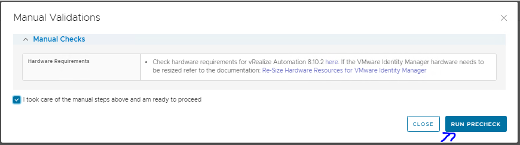
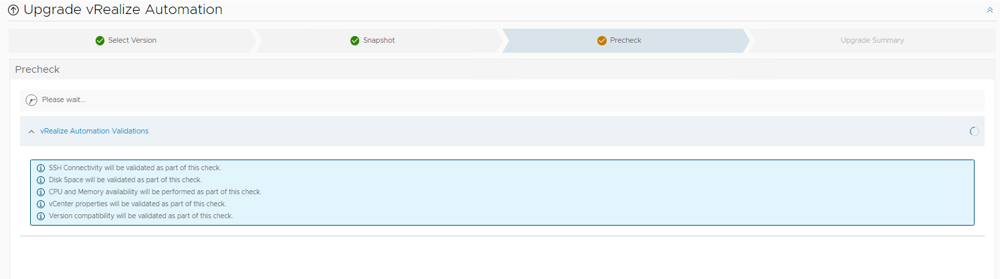
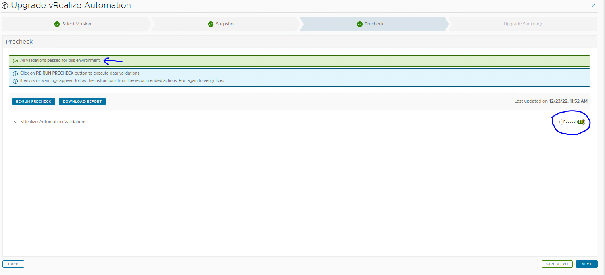

Once the prechecks are done and they are clear without any errors, last page is upgrade summary page where you submit the upgrade job

Upgrade progress can be tracked under requests page, be patient this will take a lot of time.

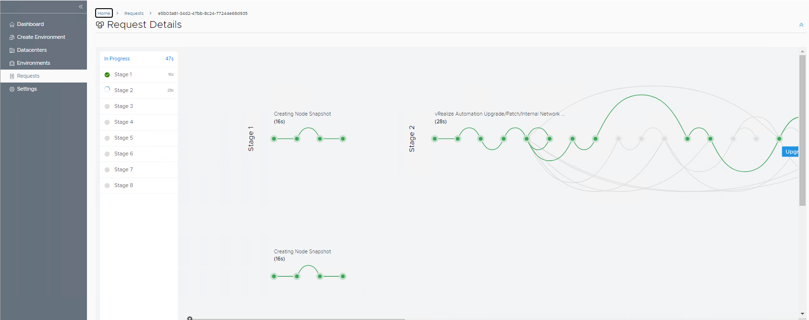

vRA Upgrade has 8 stages in total and it may take more than couple of hours to complete the entire workflow.

Now the upgrade completed successfully. You can verify this from the vRLCM. Go to Environments and select vRA and view details.
