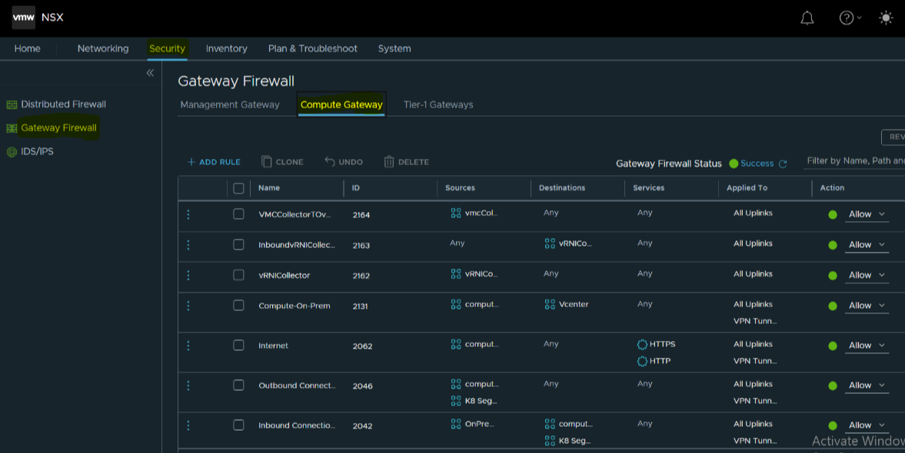

# Firewall rules for VMC Integration with On-Premises Products

## Table of Contents

- [Firewall rules for VMC Integration with On-Premises Products](#firewall-rules-for-vmc-integration-with-on-premises-products)
  - [Table of Contents](#table-of-contents)
  - [Changelog](#changelog)
  - [Introduction](#introduction)
  - [Purpose](#purpose)
  - [Audience](#audience)
  - [Scope](#scope)
  - [Firewall Ruleset](#firewall-ruleset)
    - [Management Gateway Path](#management-gateway-path)
    - [RuleSet](#ruleset)
    - [Compute Gateway Path](#compute-gateway-path)
    - [RuleSet](#ruleset-1)
    - [Segments](#segments)

## Changelog

| Date       | Author        | Issue     | Description       |
| ---------- | ------------- | --------- | ----------------- |
| 08.09.2023 | Ajit Vakodkar | VCS-10754 | Document creation |
| 17.10.2023 | Aroop Sethi   | VCS-10646 | Document Updation |

## Introduction

## Purpose

The purpose of this document is to display the Firewall rules that needs to be created on VMC NSX for Integration with On-Premises SDDC Products.

## Audience

This document is intended for Atos ESO Cloud Services Engineers and Network Architects responsible for the deployment and installation of the HCX feature for VMC on AWS

## Scope

The scope of this document is to cover Firewall rules that needs to be created on VMC NSX for Integration with On-Premises SDDC Products.

## Firewall Ruleset

### Management Gateway Path

Open **NSX Manager** // Go to **Security** Tab // **Gateway Firewall** // Click on **Management Gateway** as highlighted in the below Screenshot.

### RuleSet

| Firewall Rule Name | Source        | Destination | Service                                                      | Action | Annotation |
| ------------------ | ------------- | ----------- | ------------------------------------------------------------ | ------ | ---------- |
| HCX Outbound       | HCX-On-Prem   | HCX-Cloud   | Any                                                          | Allow  |            |
| HCX Inbound        | HCX-Cloud     | HCX-On-Prem | HTTPS SSH ICMP Echo Request Appliance Management (TCP 9443) | Allow  |            |
| vRNI to vCenter    | vRNI          | vCenter     | HTTPS ICMP ALL SSO                                 | Allow  |            |
| NSX Inbound        | Vrops-On-Prem TSS-On-Prem DNS-On-Prem vRNI-On-Prem VRA-On-Prem | NSX-Manager  | HTTPS ICMP ALL                                 | Allow  |            |
| TSSToVCenter       | TSS           | vCenter     | 443 (https) (icmp)                                      | ACCEPT |            |
| vRLI               | vRLI          | vCenter     | 443 (https) 22(ssh) (icmp)                         | ACCEPT |            |
| vRA                | vRA           | vCenter     | 443 (https)                                                  | ACCEPT |            |
| SNOWDiscovery      | mid           | vCenter     | 443 (https)                                                  | ACCEPT |            |
| TSSToHCXVMC        | TSS           | HCX VMC     | 443 (https) 22 (ssh)  (icmp) 9443 (Appliance Management) | ACCEPT |            |
| HCXToHCXVMC        | HCX Connector | HCX VMC     | 443 (https) 22 (ssh)  (icmp) 9443 (Appliance Management) | ACCEPT |            |

### Compute Gateway Path

Open **NSX Manager** // Go to **Security** Tab // **Gateway Firewall** // Click on **Compute Gateway** as highlighted in the below Screenshot.

### RuleSet

| Firewall Rule Name | Source        | Destination | Service                                                      | Action | Annotation |
| ------------------ | ------------- | ----------- | ------------------------------------------------------------ | ------ | ---------- |
| Outbound Connection OnPrem | Compute-VM-Any K8-Segment | Any    | Any                                                          | Allow  | K8 Segment is automatically created when we enable Tanzu on VMC on AWS |
| Inbound Connection OnPrem | OnPrem-Subnet | Compute-VM-Any K8-Segment | Any                                                          | Allow  | K8 Segment is automatically created when we enable Tanzu on VMC on AWS |

### Segments

Open **NSX Manager** // Go to **Networking** Tab // Click on **Segments** as highlighted in the below Screenshot.

**NOTE:** We can create segments as per customer requirement
