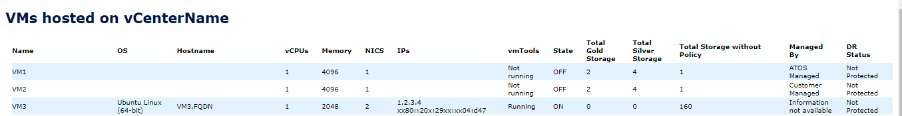

# Initial Author

Alpesh Kumbhare

# Changelog

| Version | Date       | Description              | Author       |
| ------- | ---------- | ------------------------ | --------------- |
| 0.1     | 28.07.2021 | First version | Alpesh Kumbhare|

# Table of Contents

- [Initial Author](#initial-author)
- [Changelog](#changelog)
- [Table of Contents](#table-of-contents)
  - [Introduction](#introduction)
    - [Purpose](#purpose)
    - [Audience](#audience)
    - [Scope](#scope)
  - [Prerequisite](#prerequisite)
- [Steps to configure report](#steps-to-configure-report)
  - [Prepare Script](#prepare-script)
  - [Schedule Script](#schedule-script)
  - [Sample Output of Report](#sample-output-of-report)

## Introduction

### Purpose

Configure VM Custom Report for AKZO of VM details which provides data for Configuration and Storage provisioned on each Storage class. This report was requested by AKZO customer, but can be used by other customers if they need it.

### Audience

- VCS Engineers
- VCS Operations

### Scope

- Prepare and execute reporting script

## Prerequisite

- Administrator access on Windows server where script need to be configured
- Service account using which report will be scheduled. This service account should have at least read only access on the vCenter

# Steps to configure report

## Prepare Script

- Create Folder D:\Scripts\VMReport\ on the server where you need to configure this script. vCenter server should be reachable from this server. Preferably TSS01 can be chosen.
- Download Script [VMReport.ps1](files/wiVMCustomReportforAKZO/VMreport.ps1) by clicking on it and copy it in Folder "D:\Scripts\VMReport\" which you created in previous step.
- Right Click on Script and edit lines $hostIP, $users and $smtpserver by providing environment specific details

```powershell
[string]$hostIP = "vCenterFQDN" # provide vCenter Name
 [string]$sortBy = "Name"
 $date = Get-Date -format ddMMyyyy
 $users = "useremail@atos.net"  # List of users to email your report to (separate by comma)
 $fromemail = "noreply@atos.net"
 $smtpserver = "SMTPFQDN" # provide SMTP Server Name
```

- Save Script. Run it to test. Email ID mentioned in $users should get mail if it's working fine.

## Schedule Script

- Open Task Scheduler on server and create new task
- Provide name for Task.
- Provide Service account using which report will be scheduled.
- Select "Run whether user is logged on or not"
- Create new trigger for the report as per requirement
- Create new Action as below
  - Action: Start a program
  - Program/Script: powershell.exe
  - Add arguments (optional): D:\Scripts\VMReport\VMReport.ps1
  - Start in (optional): D:\Scripts\VMReport
- Validate schedule by running it.

## Sample Output of Report

Users will get report in below format

