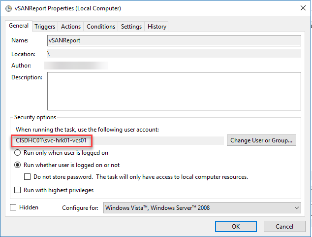
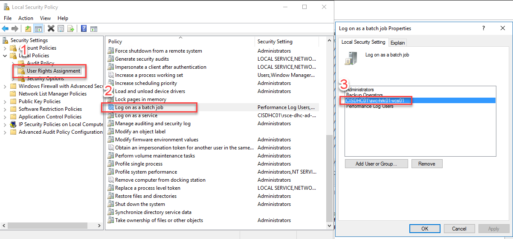
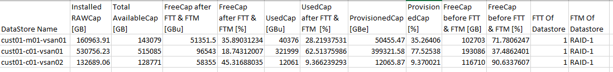

# VSAN Report

## Changelog

| Version | Date       | Description              | Author       |
| ------- | ---------- | ------------------------ | --------------- |
| 0.1     | 29.07.2021 | First version | Alpesh Kumbhare|
| 0.2     | 11.08.2021 | Second version after discussion with Capacity manager | Alpesh Kumbhare|
| 0.3     | 21.12.2021 | Updated Script to enable multiple cluster in vCenter | Alpesh Kumbhare|
| 0.4     | 29.09.2022 | CESDHC-3935 Updated WI to use service account instead of regular user account to gather data from vCenter Servers | Marcin Gala |
| 0.5     | 11.01.2022 | CESDHC-4603 Changed task location to tss002 and corrected folder name for task | Adam Szymczak |

## Introduction

### Purpose

Generate and Schedule a vSAN capacity report. A vSAN Capacity report Available in vROPS, however it lacks details like Fault to tolerate, Provisioned space etc.

### Audience

- VCS Operations

### Scope

- Prepare the PowerShell script
- Schedule script execution

## Prerequisite

- Administrator access on Windows server where script need to be configured
- Service account using which report will be scheduled. This service account should have admin access on the vCenter

# Steps to configure report

## Prepare Script

- Create Folder D:\Scripts\VSAN\ on the server where you need to configure this script. vCenter server should be reachable from this server. Preferably TSS002 should be chosen.
- Download Script [vSAN.ps1](files/wiVSANReport/vSAN.ps1) by clicking on it and copy it in Folder "D:\Scripts\vSAN\" which you created in previous step.
- Right Click on Script and edit lines $vCenterIP, $users and $smtpserver by providing environment specific details

```powershell
$vCenterIP = "vCenterFQDN1","vCenterFQDN2"
$date = Get-Date -format dd.MM.yyyy
$reportpath = "D:\Scripts\vSAN\DHC-<customerCode>-<locationCode>-vSAN-$date.csv"
$outpath = "D:\Scripts\vSAN\out.csv"
$users = "useremail@atos.net"  # List of users to email your report to (separate by comma)
$fromemail = "noreply@atos.net"
$smtpserver = "SMTPFQDN" # provide SMTP Server Name
```

- Save Script. Run it to test. Email ID mentioned in $users should get mail if it's working fine.

## Schedule Script

- Open Task Scheduler on server and create new task
- Provide name for Task.
- Provide Service account using which report will be scheduled - svc-{ locationCode}-vcs01 account should be used.
  To ensure that svc-{ locationCode}-vcs01 service account has required permissions, run configureVsanReportServiceAccount.yml playbook located on Ansible Core VM (ans001) in manage folder

```yaml
(ans210-std) a745866@hrk01ans001:/opt/dhc/manage$ ansible-playbook configureVsanReportServiceAccount.yml
```



- The service account needs to have also Log on as a batch job permission assigned.
  Open Local Security Policy and add svc-{ locationCode}-vcs01 to the Log on as a batch job policy


- Select "Run whether user is logged on or not"
- Create new trigger for the report as per requirement
- Create new Action as below
  - Action: Start a program
  - Program/Script: powershell.exe
  - Add arguments (optional): D:\Scripts\VSAN\vSAN.ps1
  - Start in (optional): D:\Scripts\VSAN
- Validate schedule by running it.

## Sample Output of Report

Users will get report in below format:


