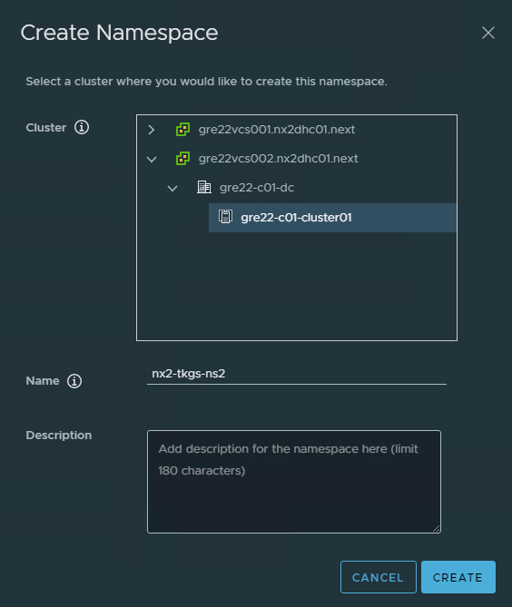
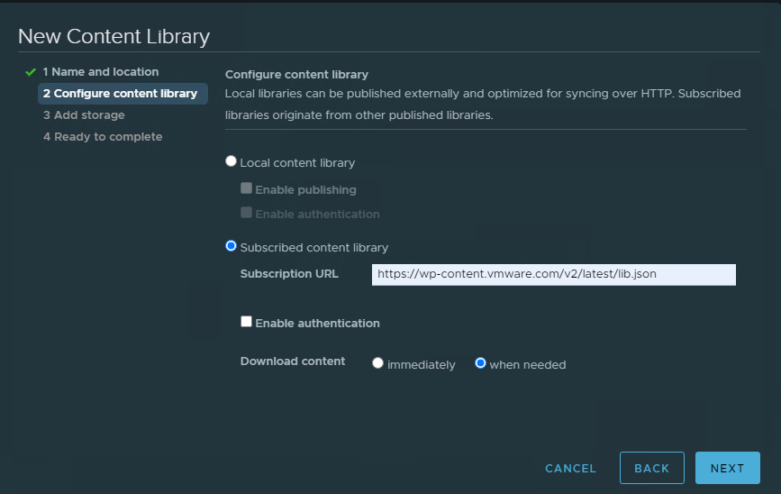
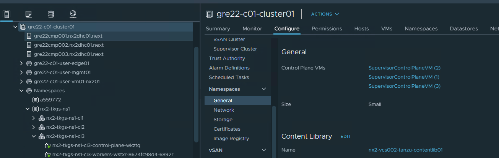
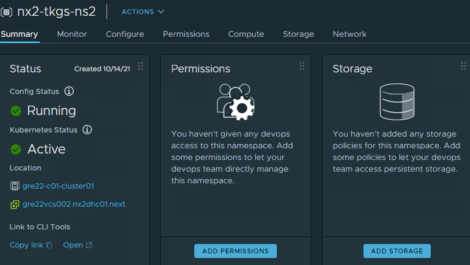

# vSphere with Tanzu installation

## Table of Contents

- [vSphere with Tanzu installation](#vsphere-with-tanzu-installation)
  - [Table of Contents](#table-of-contents)
  - [Changelog](#changelog)
  - [Introduction](#introduction)
    - [Purpose](#purpose)
    - [Audience](#audience)
    - [Scope](#scope)
  - [1.3 Related documents](#13-related-documents)
- [2 Environment preparation](#2-environment-preparation)
  - [2.1 General prerequisities](#21-general-prerequisities)
  - [2.2 Workload Management enablement](#22-workload-management-enablement)
  - [2.3 Image registries](#23-image-registries)
  - [2.4 vSphere Namespaces](#24-vsphere-namespaces)
- [3 Tanzu Kubernetes Grid Service](#3-tanzu-kubernetes-grid-service)
  - [3.1 Content library configuration](#31-content-library-configuration)
  - [3.2 Namespace preparation](#32-namespace-preparation)
  - [3.3 TKG cluster creation](#33-tkg-cluster-creation)
- [4 Simple app on TKGS](#4-simple-app-on-tkgs)
  - [3.1 Prepare TKGS for hosting app](#31-prepare-tkgs-for-hosting-app)

## Changelog

| Version | Date       | Description              | Author(s)       |
| ------- | ---------- | ------------------------ | --------------- |
| 0.1     | 2021-10-12 | Initial draft creation   | Karol Gomulkiewicz |

## Introduction

### Purpose

Install and configure vSphere with Tanzu on VCS customer vSphere cluster.

### Audience

- VCS Engineers
- VCS Operations

### Scope

- Prepare the environment
- Install Tanzu
- Validate the install with a test app

## 1.3 Related documents

This document is a subset of Atos Technology Lifecycle Management (ATLM) artefacts. All documents are stored in the VCS Documentation repository.

# 2 Environment preparation

## 2.1 General prerequisities

It has been assumed that VCS environment is prepared for deploying vSphere with Tanzu. Main prerequisites to enable Workload Management are:

1. One site (non-stretched), Workload domain VI type enabled on VCF.
2. NSX edge cluster prepared for Workload Management.
3. IP addresses subsets for using by Tanzu; at least two /27 routable networks
4. Having additional, different of VCS internal, DNS server.
5. At least one Content Library is present in vSphere environment prepared for Tanzu.

## 2.2 Workload Management enablement

Go to the VCF management console and open Solutions tab. Click on DEPLOY button. System validates prerequisites and prompts to continue enablement in vSphere management console.

1. vCenter Server and Network

    These settings have been adopted from VCF, it includes selected vCenter and NSX-T as supported configuration for VCF Solution

2. Select a cluster

    Setting derived from VCF, can be changed to another compatible cluster if needed.

3. Control Plane size

    Size for Supervisor Control Plane VMs, can be chosen from four predefined sizes.

4. Storage

    Choose storage policy to host Control Plane nodes, Ephemeral Disks and containers Image caching.

5. Management Network

    - Network: choose port group with network accessible to ESXi, vCenter and NSX, typically it is management network port group
    - Starting IP Address: input first IP from range of 5 following IP addresses. It will be used by Supervisor Control Plane VMs. Typically it is the same     subnet as management network for cmp cluster.
    - Subnet mask (management network subnet mask)
    - Gateway (management network gateway)
    - DNS Server (management network DNS)
    - DNS Search Domains (Optional, leave empty)
    - NTP Server (management network NTP server)

6. Workload Network

    - vSphere Distributed Switch (for overlay networking, typically there is only one VDS to choose)
    - Edge Cluster - choose edge cluster for vSphere with Tanzu
    - API Server endpoint FQDN (Optional, leave empty)
    - DNS Servers (external DNS that should be prepared before Tanzu installation)
    - POD CIDRs - can be leave as is if generated IP subnet do not overlap with DC networks (i.e. management network)
    - Service CIDRs - can be leave as is if generated IP subnet do not overlap with DC networks (i.e. management network)
    - Ingress CIDRs - IP subnet that must be advertised/routed to external networks. It will be used by Supervisor Control Plane to assign addresses for Ingresses, external Load Balancers, external IPs (i.e. Supervisor control plane cluster IP, Harbor)
    - Egress CIDRs - IP subnet that must be advertised to external network. It will be used by pods as SNAT network while communicating with external networks

7. TKG Configuration

    Add Content Library - add content library with OVA images for Tanzu Kubernetes Grid. At this stage, library may be empty.

## 2.3 Image registries

There are two common ways to provide container images to container runtime.

1. Harbor image registry

    Harbor is the only one supported image registry for both types of workloads: vSphere Pods and TKGS based pods. If you want to run containers directly on ESXi hosts it is mandatory to enable Harbor embedded registry.  
    Go to vSphere cluster with Tanzu Supervisor cluster configured. Go to Configure tab on cluster level, from left menu select Image registry. Click ENABLE HARBOR.

2. External service registry

    Another way to provide container images is to create access to external image registry. Simplest way to do this is to set up network policies to allow external traffic to Tanzu objects. In VCS environment, besides of Distributed Firewall configuration it is mandatory to create http/https proxy configuration. Please note, that after configuring proxy settings are populated to lower level objects. I.e. if you configure proxy on newly created vSphere Namespace, each TKGS cluster created after that will be deriving proxy settings from its parent.

    Configure proxy settings along with noProxy section by adding configuration to TkgServiceConfiguration trough KUBE_EDITOR or by applying it via kubectl apply

    ```config
    apiVersion: run.tanzu.vmware.com/v1alpha1
    kind: TkgServiceConfiguration
    ...
    spec:
      ...
      proxy:
        httpProxy: http://<user>:<pwd>@<ip>:<port>
        httpsProxy: http://<user>:<pwd>@<ip>:<port>
        noProxy: [SVC-POD-CIDRs, SVC-EGRESS-CIDRs, SVC-INGRESS-CIDRs]
    ```

## 2.4 vSphere Namespaces

To allow create TKGS clusters or run vSphere Pods, vSphere Namespace must be configured first. To do this, from vSphere Client Menu, choose Workload Management. Go to the Namespaces Tab and click on NEW NAMESPACE. Provide DNS-compliant name and click CREATE

 

# 3 Tanzu Kubernetes Grid Service

Before enabling TKGS cluster on vSphere Namespaces there is need to adjust and vSphere with Tanzu in following way

## 3.1 Content library configuration

Content library attached to vSphere with Tanzu is used for serving OVA images for TKGS components. Easiest way to achieve this goal is to create  Content Library subscribed to official VMware library which is hosting appropriate files.
Go to vSphere Client and from menu choose Content Libraries, click on Create. Choose name and vCenter server to register library. On the next page select "Subscribed content library" with following subscribtion address: <https://wp-content.vmware.com/v2/latest/lib.json> and next choose "Download content when needed". Please note that proxy needs to be configured on vCenter.



 Content Library which is used by vSphere with Tanzu may be choosen from vSphere Client Menu > Host and CLusters > Configure > Namespaces > General > Content Library > Edit:



## 3.2 Namespace preparation

Before enabling TKGS cluster on vSphere Namespaces there is need to add storage to host TKGS virtual machines.
Go to Summary of newly created vSphere Namespace and click ADD STORAGE. Then select proper storage policy.



## 3.3 TKG cluster creation

To prepare manifest file with future TKG cluster configuration it is mandatory to gather following data:

1. Distribution version - it should be from the same major version with Supervisor cluster is running. Go to vSphere Client Menu > Workload Management > Clusters and note Current Version, i.e. v1.18.2-vsc0.0.7-17449972. Then go to subscribed Content Library and schedule download of corresponding newest version of OVA template, in this case it should be ob-18284400-photon-3-k8s-v1.18.19---vmware.1-tkg.1.17af790
2. Storage class name. It can be checked via kubectl by running command: ``` kubectl -n namespace-you-want-to-check get sc ```.

With gathered data it's time to create manifest file fo TKGS cluster:

```config
apiVersion: run.tanzu.vmware.com/v1alpha1    
kind: TanzuKubernetesCluster                 
metadata:
  name: type-cluster-name-here                                
  namespace: vSphere-namespace-for-hosting-cluster                     
spec:
  distribution:
    version: v1.18.19+vmware.1-tkg.1  #OVA should be downloaded to Content Library                           
  topology:
    controlPlane:
      count: 1                                                        
      class: best-effort-medium                 
      storageClass: storage-class-from-get-sc-command        
    workers:
      count: 3                                                      
      class: best-effort-medium                            
      storageClass: storage-class-from-get-sc-command
      volumes:
        - name: containerd
          mountPath: /var/lib/containerd
          capacity:
            storage: 16Gi       
```

save to tkgs-cluster.yml file and run

```kubectl create -f ./tkgs-cluster.yml```

After a while your TKG cluster will be ready to use.

# 4 Simple app on TKGS

In this section we go trough environment preparation for simple web application.

## 3.1 Prepare TKGS for hosting app

Check if new TKG cluster is using proxy:

```shell
kubectl vsphere login --server ip-address -u administrator@vsphere.local --insecure-skip-tls-verify
kubectl config use-context vsphere-namespace-with-tkg-cluster-in
kubectl get tkc cluster-name -n vsphere-namespace-with-tkg-cluster-in -o yaml
```

Close session and open new one:

```kubectl vsphere login --server ip-addr-of-supervisor-cluter -u administrator@vsphere.local --insecure-skip-tls-verify --tanzu-kubernetes-cluster-name type-cluster-name-here --tanzu-kubernetes-cluster-namespace vSphere-namespace-for-hosting-cluster```

Check Kubernetes namespaces within cluster you've logged into:

```kubectl -n type-cluster-name-here get namespaces```

and create new to deploy application:

```kubectl -n type-cluster-name-here create namespace namespace-to-be-created```

Create network policy to allow access to and from pods:

```kubectl -n type-namespace-within-tkg-cluster -f ./network-policy.yml```

with network-policy.yml that contains following lines:

```config
---
apiVersion: networking.k8s.io/v1
kind: NetworkPolicy
metadata:
  name: allow-all
spec:
  podSelector: {}
  ingress:
  - {}
  policyTypes:
  - Ingress
  - Egress

```

Create cluster role binding to allow vSphere users creating pods:

```kubectl -n tkg-cluster-name create clusterrolebinding default-tkg-admin-privileged-binding --clusterrole=psp:vmware-system-privileged --group=system:authenticated```

Next, it is time to deploy application as Deployment kind:

```kubectl -n type-namespace-within-tkg-cluster -f ./deployment.yml```

with deployment.yml file contents:

```config
apiVersion: apps/v1
kind: Deployment
metadata:
  name: nginx-deployment
  namespace: type-namespace-within-tkg-cluster
spec:
  selector:
    matchLabels:
      app: nginx-app
  replicas: 3
  template:
    metadata:
      labels:
        app: nginx-app
    spec:
      containers:
      - name: nginx-app
        image: docker.io/library/nginx
        ports:
        - containerPort: 80
```

After a while you should have 3 pods running. Type command to verify:

```kubectl -n type-namespace-within-tkg-cluster get pods```

Then, there is a need to expose deployment as a service. Run:

```kubectl -n type-namespace-within-tkg-cluster -f ./service.yml```

```config
apiVersion: v1
kind: Service
metadata:
  name: nginx-service
  labels:
    app: nginx-app
spec:
  ports:
    # the port that this service should serve on
    - port: 80
      targetPort: 80
      protocol: TCP
      name: tcp-80
  selector:
    app: nginx-app  
```

It has exposed application internally, but to add external load balancer configuration, type:

```kubectl -n type-namespace-within-tkg-cluster -f ./lb.yml```

 with contents:

```config
apiVersion: v1
kind: Service
metadata:
  name: nginx-service-lb
  labels:
    app: nginx-app
spec:
  type: LoadBalancer
  ports:
    # the port that this service should serve on
    - port: 80
      targetPort: 80
      protocol: TCP
      name: tcp
  selector:
      app: nginx-app
#    tier: frontend
```

Check effects with command:

```kubectl -n type-namespace-within-tkg-cluster get services```

From this time, newly created application should be accessible trough external IP of nginx-service-lb on port 80.
